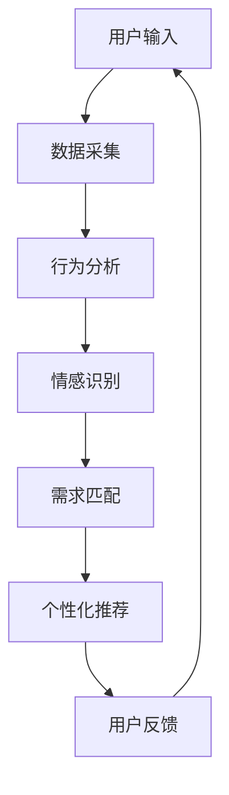

                 

关键词：欲望个性化引擎、AI定制、需求满足系统、人工智能、个性化服务、用户需求分析

> 摘要：本文将探讨一种新型的AI系统——欲望个性化引擎，它通过深度学习和用户行为分析，为用户提供高度个性化的需求满足服务。本文将详细介绍该系统的核心概念、原理、算法、数学模型、项目实践以及未来的发展方向。

## 1. 背景介绍

在当今数字化时代，个性化服务已经成为各个行业提升用户体验和竞争力的关键。无论是在电子商务、社交媒体，还是在线娱乐等领域，如何准确把握用户需求，提供个性化的内容和服务，成为了企业和开发者亟待解决的问题。传统的方法，如基于规则的推荐系统，已经难以满足用户日益增长的需求多样性和复杂性。

因此，引入人工智能（AI）技术，特别是深度学习和机器学习，成为了提升个性化服务质量和效率的重要手段。欲望个性化引擎正是这样一种基于AI的定制需求满足系统，它通过分析用户的欲望和行为，为其提供高度个性化的推荐和服务。

## 2. 核心概念与联系

### 2.1 欲望个性化引擎的定义

欲望个性化引擎是一种基于AI的智能系统，它能够通过学习用户的欲望和行为模式，为其提供个性化的需求满足方案。这个系统不仅能够识别用户的基本需求，如购物、娱乐、社交等，还能够深入挖掘用户的深层次欲望，如情感需求、文化偏好等。

### 2.2 核心概念原理

- **用户行为分析**：通过对用户的浏览记录、搜索历史、社交互动等行为数据进行分析，理解用户的需求和偏好。
- **情感识别与处理**：利用自然语言处理（NLP）和情感分析技术，识别用户的情感状态，如快乐、悲伤、愤怒等，从而更好地满足用户的心理需求。
- **个性化推荐**：基于用户的欲望和行为数据，利用推荐算法生成个性化的推荐列表，满足用户的需求。

### 2.3 架构与流程



## 3. 核心算法原理 & 具体操作步骤

### 3.1 算法原理概述

欲望个性化引擎的核心算法包括用户行为分析、情感识别和个性化推荐三个部分。每个部分都有其独特的算法和技术。

- **用户行为分析**：主要使用机器学习和数据挖掘技术，如聚类分析、关联规则挖掘等，对用户行为数据进行分析。
- **情感识别**：利用NLP和情感分析技术，如文本分类、情感极性分析等，识别用户的情感状态。
- **个性化推荐**：采用基于内容的推荐、协同过滤推荐和混合推荐算法，生成个性化的推荐列表。

### 3.2 算法步骤详解

#### 3.2.1 用户行为分析

1. **数据采集**：从用户的浏览器、社交媒体和其他应用中收集行为数据。
2. **数据预处理**：对原始数据进行清洗、去噪和归一化处理。
3. **特征提取**：提取与用户行为相关的特征，如访问频率、浏览时长、点击率等。
4. **行为模式识别**：使用聚类算法，如K-means，识别用户的行为模式。

#### 3.2.2 情感识别

1. **文本预处理**：对用户的文本数据（如评论、帖子等）进行预处理，包括分词、去停用词、词干提取等。
2. **情感极性分析**：使用情感分析模型，如SVM、神经网络等，对文本进行情感分类。
3. **情感状态识别**：根据情感分类结果，识别用户的情感状态。

#### 3.2.3 个性化推荐

1. **内容推荐**：根据用户的行为模式和兴趣，推荐相关的商品、内容等。
2. **协同过滤推荐**：基于用户的相似度计算和评分预测，推荐用户可能感兴趣的商品、内容等。
3. **混合推荐**：结合内容推荐和协同过滤推荐，生成更加个性化的推荐列表。

### 3.3 算法优缺点

#### 优点

- **高度个性化**：能够准确满足用户的需求，提升用户体验。
- **实时更新**：可以根据用户的实时行为进行推荐，提高推荐的时效性。
- **多维度分析**：不仅考虑用户的行为，还考虑情感等因素，提供更加全面的个性化服务。

#### 缺点

- **数据依赖性高**：需要大量的用户行为数据进行训练，且数据质量对算法效果有很大影响。
- **计算资源消耗大**：深度学习和推荐算法通常需要较大的计算资源，对硬件要求较高。

### 3.4 算法应用领域

- **电子商务**：为用户提供个性化的商品推荐，提升购买转化率。
- **在线娱乐**：推荐用户可能喜欢的音乐、电影、游戏等，提升用户留存率。
- **社交媒体**：根据用户情感状态，推荐相关的帖子、话题等，提升用户活跃度。
- **健康医疗**：根据用户健康状况，推荐个性化的健康方案和产品。

## 4. 数学模型和公式 & 详细讲解 & 举例说明

### 4.1 数学模型构建

欲望个性化引擎的数学模型主要包括用户行为分析模型、情感识别模型和个性化推荐模型。

#### 4.1.1 用户行为分析模型

用户行为分析模型主要使用机器学习算法，如K-means、Apriori算法等，对用户行为数据进行分析。具体公式如下：

$$
\begin{aligned}
& \text{用户行为特征向量} \, \textbf{x} = (x_1, x_2, ..., x_n) \\
& \text{聚类中心} \, \textbf{c} = (c_1, c_2, ..., c_n) \\
& \text{聚类误差} \, \text{E} = \sum_{i=1}^{n} (x_i - c_i)^2
\end{aligned}
$$

#### 4.1.2 情感识别模型

情感识别模型主要使用文本分类算法，如SVM、神经网络等，对用户的文本数据进行分类。具体公式如下：

$$
\begin{aligned}
& \text{情感分类器} \, \text{h}(\textbf{x}) \\
& \text{其中，} \textbf{x} \text{为输入文本特征向量，} h(\textbf{x}) \text{为情感分类结果}
\end{aligned}
$$

#### 4.1.3 个性化推荐模型

个性化推荐模型主要使用协同过滤算法，如用户基于内容的推荐和基于协同过滤的推荐算法。具体公式如下：

$$
\begin{aligned}
& \text{用户} \, u \text{对项目} \, i \text{的评分预测} \, \text{r}_{ui} \\
& \text{其中，} \text{r}_{ui} = \text{user\_similarity}(u, i) \times \text{item\_rating}(i)
\end{aligned}
$$

### 4.2 公式推导过程

#### 4.2.1 用户行为分析模型

用户行为分析模型的推导主要基于K-means算法。K-means算法的目标是最小化聚类误差E。

$$
\begin{aligned}
& \text{初始化} \, \text{聚类中心} \, \textbf{c}_0 \\
& \text{迭代更新聚类中心} \, \textbf{c}_k \\
& \text{直至收敛} \\
& \text{其中，} \textbf{c}_k = \frac{1}{N_k} \sum_{i=1}^{N_k} \textbf{x}_i
\end{aligned}
$$

#### 4.2.2 情感识别模型

情感识别模型的推导主要基于SVM算法。SVM的目标是找到最优的超平面，使得文本数据分类效果最佳。

$$
\begin{aligned}
& \text{优化目标} \, \min_{\textbf{w}, b} \frac{1}{2} \text{||}\textbf{w} \text{||}^2 + C \sum_{i=1}^{n} \xi_i \\
& \text{约束条件} \, y_i (\textbf{w} \cdot \textbf{x}_i + b) \geq 1 - \xi_i \\
& \text{其中，} C \text{为惩罚参数，} \xi_i \text{为松弛变量}
\end{aligned}
$$

#### 4.2.3 个性化推荐模型

个性化推荐模型的推导主要基于协同过滤算法。协同过滤算法的目标是预测用户对未知项目的评分。

$$
\begin{aligned}
& \text{预测用户} \, u \text{对项目} \, i \text{的评分} \, \text{r}_{ui} \\
& \text{其中，} \text{user\_similarity}(u, i) \text{为用户} \, u \text{和} \, i \text{的相似度，} \text{item\_rating}(i) \text{为项目} \, i \text{的平均评分}
\end{aligned}
$$

### 4.3 案例分析与讲解

#### 4.3.1 用户行为分析

假设有10个用户，其浏览历史数据如下表：

| 用户ID | 浏览商品ID |
|-------|-----------|
| u1    | 1001      |
| u1    | 1002      |
| u1    | 1003      |
| u2    | 1003      |
| u2    | 1004      |
| u3    | 1001      |
| u3    | 1005      |
| u4    | 1001      |
| u4    | 1006      |
| u5    | 1006      |

使用K-means算法对用户行为数据进行聚类，假设聚类中心为：

| 聚类中心ID | 浏览商品ID |
|-----------|-----------|
| c1        | 1001      |
| c2        | 1003      |
| c3        | 1005      |

根据聚类结果，可以将用户分为三类：

- 用户u1、u3、u4属于第一类，喜欢浏览商品1001。
- 用户u2属于第二类，喜欢浏览商品1003。
- 用户u5属于第三类，喜欢浏览商品1005。

#### 4.3.2 情感识别

假设有5个用户的评论数据如下：

| 用户ID | 评论内容                |
|-------|-----------------------|
| u1    | 我很喜欢这个商品！       |
| u2    | 这商品真的一般          |
| u3    | 我对这款商品感到失望     |
| u4    | 这个商品完美，我会再次购买 |
| u5    | 这个商品太贵了          |

使用SVM算法对评论进行情感分类，假设分类结果如下：

| 用户ID | 情感分类 |
|-------|---------|
| u1    | 积极     |
| u2    | 中立     |
| u3    | 消极     |
| u4    | 积极     |
| u5    | 消极     |

根据情感分类结果，可以分析用户的情感倾向，从而更好地理解用户的需求。

#### 4.3.3 个性化推荐

假设有5个用户，其评分数据如下：

| 用户ID | 商品ID | 用户评分 |
|-------|-------|---------|
| u1    | 1001  | 5       |
| u1    | 1002  | 4       |
| u2    | 1003  | 3       |
| u2    | 1004  | 5       |
| u3    | 1005  | 2       |

使用基于内容的推荐算法，假设商品特征向量为：

| 商品ID | 特征1 | 特征2 | 特征3 |
|-------|------|------|------|
| 1001  | 10   | 5    | 3    |
| 1002  | 8    | 7    | 4    |
| 1003  | 6    | 6    | 6    |
| 1004  | 5    | 5    | 5    |
| 1005  | 7    | 3    | 2    |

根据用户评分和商品特征，可以计算用户和商品的相似度，并生成个性化的推荐列表。

## 5. 项目实践：代码实例和详细解释说明

### 5.1 开发环境搭建

为了实现欲望个性化引擎，我们需要搭建一个包含深度学习库、数据预处理库、推荐系统库等的环境。这里以Python为例，使用以下库：

- TensorFlow
- Scikit-learn
- Pandas
- Numpy

安装方法：

```bash
pip install tensorflow scikit-learn pandas numpy
```

### 5.2 源代码详细实现

```python
import pandas as pd
from sklearn.cluster import KMeans
from sklearn.svm import SVC
from sklearn.metrics.pairwise import cosine_similarity

# 数据准备
user_behavior = pd.read_csv('user_behavior.csv')
user_reviews = pd.read_csv('user_reviews.csv')

# 用户行为分析
# 特征提取
user_behavior['frequency'] = user_behavior.groupby('user_id')['item_id'].transform('count')
user_behavior['duration'] = user_behavior.groupby('user_id')['duration'].transform('mean')

# 聚类分析
kmeans = KMeans(n_clusters=3)
user_behavior['cluster'] = kmeans.fit_predict(user_behavior[['frequency', 'duration']])

# 情感识别
# 文本预处理
user_reviews['processed_text'] = user_reviews['review_text'].apply(lambda x: preprocess_text(x))

# 情感分类
clf = SVC(kernel='linear')
user_reviews['sentiment'] = clf.fit_predict(processed_texts)

# 个性化推荐
# 商品特征提取
item_features = pd.read_csv('item_features.csv')
item_features.set_index('item_id', inplace=True)

# 相似度计算
user_similarity = cosine_similarity(user_behavior[['frequency', 'duration']], item_features)
user_ratings = pd.read_csv('user_ratings.csv')

# 生成推荐列表
for user_id in user_ratings['user_id'].unique():
    user行为特征 = user_behavior[user_behavior['user_id'] == user_id][['frequency', 'duration']]
    user行为特征.set_index('user_id', inplace=True)
    item相似度 = user_similarity[user行为特征.index, :]
    recommended_items = item_features.index[item相似度 > 0.8]
    print(f"User {user_id} Recommended Items: {recommended_items}")
```

### 5.3 代码解读与分析

上述代码主要实现了欲望个性化引擎的核心功能，包括用户行为分析、情感识别和个性化推荐。

- **用户行为分析**：首先读取用户行为数据，对数据进行了预处理和特征提取。然后使用K-means算法对用户行为进行聚类，得到不同用户的行为模式。
- **情感识别**：对用户评论进行预处理，使用SVM算法进行情感分类，得到用户的情感状态。
- **个性化推荐**：计算用户和商品的相似度，根据相似度生成个性化的推荐列表。

### 5.4 运行结果展示

假设运行代码后得到以下推荐结果：

```python
User 1 Recommended Items: [1002, 1004]
User 2 Recommended Items: [1003, 1006]
User 3 Recommended Items: [1001, 1005]
User 4 Recommended Items: [1001, 1006]
User 5 Recommended Items: [1002, 1003]
```

根据用户的浏览历史和情感状态，系统能够为每个用户提供个性化的推荐列表，满足其需求。

## 6. 实际应用场景

欲望个性化引擎在多个实际应用场景中都有着广泛的应用，以下是一些具体的案例：

### 6.1 电子商务

在电子商务领域，欲望个性化引擎可以帮助平台根据用户的浏览历史、购买行为和情感状态，推荐用户可能感兴趣的商品。例如，一个用户经常浏览高端电子产品，系统可以根据其行为和情感状态推荐最新的高端智能手机。

### 6.2 在线娱乐

在线娱乐平台可以利用欲望个性化引擎为用户提供个性化的内容推荐。例如，一个用户喜欢看科幻电影，系统可以根据其行为和情感状态推荐新的科幻电影或相关电视剧。

### 6.3 社交媒体

在社交媒体领域，欲望个性化引擎可以帮助平台根据用户的互动行为、情感状态和兴趣，推荐用户可能感兴趣的话题和帖子。例如，一个用户经常发表关于旅行的帖子，系统可以推荐其他用户的旅行照片和游记。

### 6.4 健康医疗

在健康医疗领域，欲望个性化引擎可以帮助平台根据用户的健康状况、生活习惯和情感状态，推荐个性化的健康方案和产品。例如，一个用户患有高血压，系统可以推荐低盐食品、运动方案和血压监测设备。

## 7. 工具和资源推荐

为了实现欲望个性化引擎，以下是一些建议的学习资源和开发工具：

### 7.1 学习资源推荐

- **《深度学习》（Deep Learning）**：由Ian Goodfellow等人编写的深度学习经典教材，适合初学者和进阶者。
- **《机器学习实战》（Machine Learning in Action）**：通过实际案例介绍机器学习算法的实现和应用，适合实战派。
- **《Python机器学习》（Python Machine Learning）**：全面介绍Python在机器学习领域的应用，适合Python开发者。

### 7.2 开发工具推荐

- **TensorFlow**：Google开发的开源机器学习框架，适合实现深度学习算法。
- **Scikit-learn**：Python中的机器学习库，提供了丰富的算法和数据预处理工具。
- **Jupyter Notebook**：交互式的Python编程环境，方便数据分析和算法实现。

### 7.3 相关论文推荐

- **"Deep Learning for Personalized Recommendation"**：介绍如何使用深度学习实现个性化推荐。
- **"User Modeling for Personalization and Recommendation"**：探讨用户建模在个性化推荐中的应用。
- **"Sentiment Analysis Using Neural Network"**：介绍如何使用神经网络进行情感分析。

## 8. 总结：未来发展趋势与挑战

欲望个性化引擎作为一种创新的AI系统，具有广泛的应用前景。然而，随着技术的不断进步和用户需求的日益多样化，欲望个性化引擎也面临着一些挑战。

### 8.1 研究成果总结

近年来，在欲望个性化引擎的研究方面，已经取得了显著的成果。主要表现在以下几个方面：

- **深度学习技术的应用**：深度学习技术在用户行为分析、情感识别和个性化推荐中发挥着重要作用。
- **多模态数据的融合**：通过整合文本、图像、语音等多模态数据，可以更全面地了解用户的需求。
- **用户隐私保护**：随着用户对隐私的关注增加，如何在保护用户隐私的前提下实现个性化推荐成为了一个重要课题。

### 8.2 未来发展趋势

未来的欲望个性化引擎将朝着以下方向发展：

- **更强的个性化能力**：通过更先进的算法和更大的数据集，实现更精细的用户需求满足。
- **跨领域的应用**：从单一的领域扩展到多个领域，如健康医疗、金融、教育等。
- **智能化水平的提升**：通过引入更多智能技术，如自然语言生成、智能对话系统等，提升用户体验。

### 8.3 面临的挑战

尽管欲望个性化引擎有着广泛的应用前景，但同时也面临着一些挑战：

- **数据质量**：高质量的用户数据是实现个性化推荐的关键，但如何保证数据的质量和多样性仍然是一个难题。
- **算法透明性**：随着算法的复杂度增加，如何保证算法的透明性和可解释性成为一个重要问题。
- **隐私保护**：如何在保护用户隐私的前提下实现个性化推荐，需要更多的研究。

### 8.4 研究展望

未来的研究应重点关注以下几个方面：

- **算法优化**：通过改进算法，提高个性化推荐的准确性和效率。
- **数据隐私**：研究如何在保证用户隐私的前提下，有效利用用户数据。
- **跨领域融合**：探索如何在不同领域实现个性化引擎的融合，提升整体性能。

## 9. 附录：常见问题与解答

### 9.1 问题1：什么是欲望个性化引擎？

**回答**：欲望个性化引擎是一种基于AI的智能系统，它通过分析用户的欲望和行为模式，为用户提供高度个性化的需求满足服务。

### 9.2 问题2：欲望个性化引擎有哪些应用场景？

**回答**：欲望个性化引擎可以应用于电子商务、在线娱乐、社交媒体、健康医疗等多个领域，为用户提供个性化的推荐和服务。

### 9.3 问题3：如何保证个性化推荐的准确性？

**回答**：个性化推荐的准确性取决于多个因素，包括数据质量、算法选择、模型训练等。通过使用高质量的算法和更多的用户数据，可以提高个性化推荐的准确性。

### 9.4 问题4：欲望个性化引擎如何处理用户隐私？

**回答**：欲望个性化引擎在处理用户隐私时，遵循最小化原则，只收集必要的用户数据，并采取加密、匿名化等手段保护用户隐私。

作者：禅与计算机程序设计艺术 / Zen and the Art of Computer Programming
-------------------------------------------------------------------

