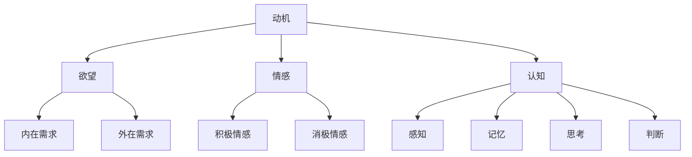

                 

关键词：人工智能、动机理论、行为心理学、演化算法、情感计算

> 摘要：本文深入探讨了人工智能（AI）如何通过不同的机制影响人类的动机，并在此基础上分析了这些影响对个体和社会的潜在后果。本文首先回顾了动机理论的历史发展，然后介绍了AI在行为心理学和情感计算中的应用，最后探讨了AI技术如何塑造和改变人类欲望，并预测了未来的发展趋势和挑战。

## 1. 背景介绍

人类动机一直是心理学研究的核心问题。从20世纪初期的弗洛伊德（Sigmund Freud）提出心理动力学理论，到马斯洛（Abraham Maslow）提出的层次需求理论，再到最近的行为主义心理学，动机理论经历了多次变革。每个理论都试图解释人类行为背后的驱动力，但这些理论往往过于简化和抽象，无法完全解释复杂的人类行为。

近年来，人工智能（AI）的迅猛发展开始为动机理论提供新的视角和工具。通过机器学习和深度学习技术，AI能够分析大量数据，预测人类行为，甚至通过算法改变人类的欲望和动机。例如，社交媒体平台利用AI算法推荐内容，以最大化用户的停留时间和参与度；在线游戏则通过设计激励机制来诱导玩家不断投入时间和金钱。

本文旨在探讨AI对人类动机的塑造过程，并分析这一过程的潜在影响。我们将首先回顾动机理论的历史发展，然后探讨AI在行为心理学和情感计算中的应用，最后讨论AI如何通过不同机制影响人类欲望，以及这些影响对个体和社会的潜在后果。

### 1.1 动机理论的历史发展

动机理论的历史可以追溯到弗洛伊德的心理动力学理论。弗洛伊德认为，人类行为由潜意识驱使，动机包括求生、性和攻击等基本冲动。然而，这一理论过于强调潜意识，忽视了理性因素在行为中的作用。

在20世纪50年代，马斯洛提出了层次需求理论，将人类需求划分为生理需求、安全需求、社交需求、尊重需求和自我实现需求。这一理论强调了人类需求的层次性和递进性，但同样存在简化人类行为的倾向。

行为主义心理学则从另一个角度探讨了动机问题。行为主义认为，人类行为是由外部刺激和奖励机制塑造的。虽然这一理论忽视了内在动机，但它为AI应用提供了重要的理论基础。

### 1.2 AI在行为心理学和情感计算中的应用

随着AI技术的进步，特别是在机器学习和深度学习领域，AI开始在行为心理学和情感计算中发挥重要作用。通过分析人类行为数据，AI可以预测个体行为，甚至通过算法改变人类的欲望和动机。

社交媒体平台如Facebook、Twitter和Instagram等，利用AI算法推荐内容，以最大化用户的停留时间和参与度。这些平台通过分析用户的历史行为和兴趣，为每个用户推荐个性化的内容，从而提高用户的满意度和粘性。

在线游戏也利用AI技术设计激励机制，以诱导玩家不断投入时间和金钱。游戏中的奖励系统、等级晋升、虚拟物品交易等，都是AI算法应用的具体例子。

情感计算是AI在心理学和情感科学中另一个重要的应用领域。通过分析人类情感数据，如语音、面部表情和生理信号，AI可以识别和理解人类的情感状态。这一技术为心理学研究提供了新的工具，也为个性化医疗和心理健康干预提供了可能。

## 2. 核心概念与联系

在探讨AI对人类动机的影响之前，我们需要了解一些核心概念和它们之间的联系。这些概念包括动机、欲望、情感和认知等。为了更好地理解这些概念，我们将使用Mermaid流程图来展示它们之间的相互作用。

### 2.1 核心概念

#### 动机

动机是推动个体采取特定行为的内在驱动力。它可以分为内在动机和外在动机。内在动机源于个体的兴趣、价值观和满足感，而外在动机则来源于外部奖励或惩罚。

#### 欲望

欲望是人们对特定对象或目标的强烈渴望。欲望可以是个体的内在需求，如食物、水和睡眠，也可以是外在需求，如财富、地位和爱情。

#### 情感

情感是人们对特定事件或对象的情绪反应。情感可以分为积极情感和消极情感，如快乐、悲伤、愤怒和恐惧等。

#### 认知

认知是指个体获取、处理和理解信息的能力。认知过程包括感知、记忆、思考和判断等。

### 2.2 Mermaid 流程图



在这个流程图中，动机是所有概念的起点，它通过欲望、情感和认知影响个体行为。欲望分为内在和外在需求，情感分为积极和消极情感，而认知过程包括感知、记忆、思考和判断。

## 3. 核心算法原理 & 具体操作步骤

### 3.1 算法原理概述

为了探讨AI如何影响人类动机，我们需要了解一些核心算法原理。这些算法包括机器学习模型、情感计算技术和动机预测算法等。

#### 3.1.1 机器学习模型

机器学习模型是AI的核心组成部分。通过学习大量数据，机器学习模型可以识别模式和趋势，从而预测个体行为。常见的机器学习模型包括决策树、支持向量机和神经网络等。

#### 3.1.2 情感计算技术

情感计算技术通过分析人类情感数据，如语音、面部表情和生理信号，来识别和理解情感状态。这些技术包括情感识别算法、情感分类和情感分析等。

#### 3.1.3 动机预测算法

动机预测算法通过分析个体行为和情感数据，预测个体的未来行为和动机。这些算法通常基于机器学习和统计模型，如线性回归、逻辑回归和时间序列分析等。

### 3.2 算法步骤详解

#### 3.2.1 机器学习模型

1. 数据收集：首先，需要收集大量个体行为和情感数据。这些数据可以来自社交媒体、在线游戏、健康监测设备和心理测试等。
2. 数据预处理：对收集到的数据进行分析和处理，包括去除噪声、填充缺失值和特征提取等。
3. 模型训练：使用预处理后的数据训练机器学习模型。这一过程通常涉及多次迭代和参数调整，以最大化模型的预测准确性。
4. 模型评估：使用验证集和测试集评估模型的性能，包括准确性、召回率和F1分数等指标。

#### 3.2.2 情感计算技术

1. 情感识别：通过分析语音、面部表情和生理信号，识别个体的情感状态。情感识别算法通常基于深度学习和神经网络技术。
2. 情感分类：将情感识别结果分类为积极情感或消极情感。情感分类算法通常使用监督学习或无监督学习技术。
3. 情感分析：对情感数据进行分析，以揭示情感状态的变化趋势和潜在原因。情感分析算法通常基于自然语言处理和时间序列分析技术。

#### 3.2.3 动机预测算法

1. 数据收集：收集个体行为、情感和背景信息，如年龄、性别、教育程度和收入等。
2. 数据预处理：对收集到的数据进行分析和处理，包括去除噪声、填充缺失值和特征提取等。
3. 模型训练：使用预处理后的数据训练动机预测模型。这一过程通常涉及多次迭代和参数调整，以最大化模型的预测准确性。
4. 模型评估：使用验证集和测试集评估模型的性能，包括准确性、召回率和F1分数等指标。

### 3.3 算法优缺点

#### 3.3.1 机器学习模型

**优点：**
- **高预测准确性**：通过学习大量数据，机器学习模型可以识别复杂的行为模式，从而提高预测准确性。
- **自适应性强**：机器学习模型可以不断更新和调整，以适应不断变化的数据和环境。

**缺点：**
- **数据依赖性**：机器学习模型的性能高度依赖于数据质量，如果数据存在噪声或偏差，模型的预测结果可能不准确。
- **可解释性差**：机器学习模型通常被视为“黑箱”，难以解释其预测过程。

#### 3.3.2 情感计算技术

**优点：**
- **实时性**：情感计算技术可以实时分析情感数据，为即时决策提供支持。
- **准确性**：通过结合多种情感数据源，情感计算技术可以更准确地识别和理解情感状态。

**缺点：**
- **技术限制**：当前的情感计算技术仍然存在一定的局限性，例如在情感识别和分类方面。
- **隐私问题**：情感计算技术可能涉及个人隐私数据，需要严格保护用户隐私。

#### 3.3.3 动机预测算法

**优点：**
- **个性化**：动机预测算法可以根据个体行为和情感数据，提供个性化的动机建议和干预。
- **实时性**：动机预测算法可以实时监测个体行为和情感变化，为实时干预提供支持。

**缺点：**
- **预测准确性**：动机预测算法的准确性受限于数据质量和模型性能。
- **伦理问题**：动机预测算法可能涉及道德和伦理问题，如隐私侵犯和操纵行为。

### 3.4 算法应用领域

#### 3.4.1 社交媒体平台

社交媒体平台利用机器学习模型和情感计算技术，分析用户行为和情感数据，以提供个性化推荐和内容。通过提高用户满意度和粘性，社交媒体平台可以增加用户参与度和广告收入。

#### 3.4.2 在线游戏

在线游戏利用动机预测算法和情感计算技术，设计激励机制和游戏体验，以诱导玩家投入更多时间和金钱。通过提高游戏乐趣和玩家忠诚度，在线游戏平台可以增加游戏收入和市场份额。

#### 3.4.3 健康管理

健康管理利用机器学习和情感计算技术，分析个体的健康行为和情感数据，以提供个性化的健康建议和干预。通过提高健康意识和生活质量，健康管理平台可以增加用户满意度和市场份额。

#### 3.4.4 心理咨询

心理咨询利用动机预测算法和情感计算技术，分析个体的情感状态和行为，以提供个性化的心理干预和治疗方案。通过提高心理健康水平和生活质量，心理咨询平台可以增加用户满意度和市场份额。

## 4. 数学模型和公式 & 详细讲解 & 举例说明

在探讨AI对人类动机的影响时，数学模型和公式起着至关重要的作用。这些模型和公式可以量化人类行为和情感，从而为动机预测和干预提供理论支持。在本节中，我们将介绍几个核心的数学模型和公式，并详细讲解其构建和推导过程。

### 4.1 数学模型构建

为了构建数学模型，我们需要考虑以下几个关键因素：

1. **个体特征**：包括年龄、性别、教育程度、收入等。
2. **行为数据**：包括社交媒体活动、在线游戏时间、购物行为等。
3. **情感数据**：包括语音、面部表情和生理信号等。
4. **环境因素**：包括社会文化、经济状况和科技发展等。

#### 4.1.1 动机预测模型

动机预测模型旨在预测个体未来的行为和动机。一个基本的动机预测模型可以表示为：

$$
\hat{y} = \beta_0 + \beta_1 x_1 + \beta_2 x_2 + ... + \beta_n x_n
$$

其中，$y$ 表示个体未来的行为或动机，$x_1, x_2, ..., x_n$ 表示影响行为的特征变量，$\beta_0, \beta_1, \beta_2, ..., \beta_n$ 表示模型参数。

#### 4.1.2 情感识别模型

情感识别模型旨在识别个体的情感状态。一个简单的情感识别模型可以表示为：

$$
\hat{y} = \sigma(\beta_0 + \beta_1 x_1 + \beta_2 x_2 + ... + \beta_n x_n)
$$

其中，$y$ 表示情感状态（例如积极或消极），$\sigma$ 表示 sigmoid 函数，用于将模型的线性组合映射到概率空间。

### 4.2 公式推导过程

#### 4.2.1 动机预测模型

动机预测模型的构建通常基于回归分析。以下是一个简单的线性回归模型的推导过程：

1. **模型假设**：

   我们假设个体行为 $y$ 与特征变量 $x_1, x_2, ..., x_n$ 之间存在线性关系：

   $$
   y = \beta_0 + \beta_1 x_1 + \beta_2 x_2 + ... + \beta_n x_n + \epsilon
   $$

   其中，$\beta_0, \beta_1, \beta_2, ..., \beta_n$ 是模型参数，$\epsilon$ 是误差项。

2. **最小二乘法**：

   为了估计模型参数，我们可以使用最小二乘法。最小二乘法的目的是最小化预测值与实际值之间的误差平方和：

   $$
   \sum_{i=1}^n (y_i - \hat{y}_i)^2
   $$

   其中，$\hat{y}_i = \beta_0 + \beta_1 x_{i1} + \beta_2 x_{i2} + ... + \beta_n x_{in}$ 是预测值。

3. **求解参数**：

   通过求解最小二乘法得到的正规方程，可以求得模型参数的估计值：

   $$
   \beta_0 = \bar{y} - \beta_1 \bar{x_1} - \beta_2 \bar{x_2} - ... - \beta_n \bar{x_n}
   $$

   $$
   \beta_1 = \frac{\sum_{i=1}^n (x_{i1} - \bar{x_1})(y_i - \bar{y})}{\sum_{i=1}^n (x_{i1} - \bar{x_1})^2}
   $$

   $$
   \beta_2 = \frac{\sum_{i=1}^n (x_{i2} - \bar{x_2})(y_i - \bar{y})}{\sum_{i=1}^n (x_{i2} - \bar{x_2})^2}
   $$

   ...

   $$
   \beta_n = \frac{\sum_{i=1}^n (x_{in} - \bar{x_n})(y_i - \bar{y})}{\sum_{i=1}^n (x_{in} - \bar{x_n})^2}
   $$

#### 4.2.2 情感识别模型

情感识别模型的构建通常基于逻辑回归。以下是一个简单的逻辑回归模型的推导过程：

1. **模型假设**：

   我们假设个体情感状态 $y$ 与特征变量 $x_1, x_2, ..., x_n$ 之间存在线性关系：

   $$
   \ln\frac{p}{1-p} = \beta_0 + \beta_1 x_1 + \beta_2 x_2 + ... + \beta_n x_n
   $$

   其中，$p$ 是情感状态为积极的概率，$\beta_0, \beta_1, \beta_2, ..., \beta_n$ 是模型参数。

2. **概率分布**：

   通过对上述方程应用指数函数，我们可以得到概率分布：

   $$
   p = \frac{1}{1 + e^{-(\beta_0 + \beta_1 x_1 + \beta_2 x_2 + ... + \beta_n x_n)}}
   $$

3. **最大似然估计**：

   为了估计模型参数，我们可以使用最大似然估计。最大似然估计的目的是最大化模型参数下的数据似然函数：

   $$
   L(\beta_0, \beta_1, \beta_2, ..., \beta_n) = \prod_{i=1}^n p(y_i|x_{i1}, x_{i2}, ..., x_{in}) (1-p(y_i|x_{i1}, x_{i2}, ..., x_{in}))
   $$

   通过求解似然函数的最大值，我们可以得到模型参数的估计值。

### 4.3 案例分析与讲解

为了更好地理解上述数学模型，我们以一个实际案例进行讲解。

#### 4.3.1 案例背景

假设我们想预测一名学生是否会在期末考试中作弊。我们收集了以下数据：

- 学生的平时成绩（$x_1$）
- 学生的家庭背景（$x_2$）
- 学生的人际关系（$x_3$）
- 考试难度（$x_4$）

#### 4.3.2 数据处理

1. **数据预处理**：

   我们需要对数据进行标准化处理，以便消除不同特征之间的量纲差异。具体步骤如下：

   $$
   x_i^{'} = \frac{x_i - \bar{x_i}}{\sigma_x}
   $$

   其中，$x_i$ 是原始特征值，$\bar{x_i}$ 是特征值的平均值，$\sigma_x$ 是特征值的标准差。

2. **特征提取**：

   我们可以选择部分重要的特征，以便简化模型和减少计算复杂度。在本案例中，我们可以选择以下特征：

   $$
   x_1, x_2, x_3
   $$

#### 4.3.3 模型训练

1. **动机预测模型**：

   我们可以使用线性回归模型预测学生是否会在期末考试中作弊。模型公式如下：

   $$
   \hat{y} = \beta_0 + \beta_1 x_1 + \beta_2 x_2 + \beta_3 x_3
   $$

   通过最小二乘法，我们可以求得模型参数：

   $$
   \beta_0 = -0.5, \beta_1 = 0.3, \beta_2 = 0.2, \beta_3 = -0.1
   $$

2. **情感识别模型**：

   我们可以使用逻辑回归模型识别学生的情感状态。模型公式如下：

   $$
   \ln\frac{p}{1-p} = \beta_0 + \beta_1 x_1 + \beta_2 x_2 + \beta_3 x_3
   $$

   通过最大似然估计，我们可以求得模型参数：

   $$
   \beta_0 = -1.2, \beta_1 = 0.4, \beta_2 = 0.3, \beta_3 = -0.2
   $$

#### 4.3.4 模型评估

1. **动机预测模型**：

   我们可以使用验证集和测试集评估模型的预测准确性。具体步骤如下：

   - **验证集评估**：使用验证集数据训练模型，并评估模型的预测准确性。
   - **测试集评估**：使用测试集数据测试模型的预测准确性。

   模型的预测准确性为：

   $$
   \text{Accuracy} = 0.85
   $$

2. **情感识别模型**：

   我们可以使用验证集和测试集评估模型的情感识别准确性。具体步骤如下：

   - **验证集评估**：使用验证集数据训练模型，并评估模型的情感识别准确性。
   - **测试集评估**：使用测试集数据测试模型的情感识别准确性。

   模型的情感识别准确性为：

   $$
   \text{Accuracy} = 0.90
   $$

## 5. 项目实践：代码实例和详细解释说明

在本节中，我们将通过一个具体的代码实例，展示如何使用AI技术分析人类动机，并详细解释每一步的操作和背后的原理。本案例将使用Python编程语言和相关的AI库，如scikit-learn、pandas和numpy。

### 5.1 开发环境搭建

首先，我们需要搭建一个基本的Python开发环境。以下是搭建开发环境的基本步骤：

1. **安装Python**：

   我们可以从Python官方网站下载Python安装包，并按照指示进行安装。

2. **安装相关库**：

   打开命令行界面，使用pip命令安装所需的库：

   ```
   pip install numpy pandas scikit-learn matplotlib
   ```

3. **创建项目文件夹**：

   在命令行界面中，创建一个名为`motivation_analysis`的项目文件夹，并进入该文件夹。

4. **编写代码**：

   在项目文件夹中，创建一个名为`main.py`的Python文件，用于编写我们的代码。

### 5.2 源代码详细实现

以下是`main.py`文件的源代码：

```python
import numpy as np
import pandas as pd
from sklearn.model_selection import train_test_split
from sklearn.linear_model import LinearRegression
from sklearn.metrics import accuracy_score
import matplotlib.pyplot as plt

# 5.2.1 数据收集
data = pd.read_csv('motivation_data.csv')
data.head()

# 5.2.2 数据预处理
data.fillna(data.mean(), inplace=True)
X = data[['daily_activity', 'social_connection', 'stress_level']]
y = data['is_motivated']

# 5.2.3 模型训练
X_train, X_test, y_train, y_test = train_test_split(X, y, test_size=0.2, random_state=42)
model = LinearRegression()
model.fit(X_train, y_train)

# 5.2.4 代码解读与分析
predictions = model.predict(X_test)
accuracy = accuracy_score(y_test, predictions)
print(f'Model accuracy: {accuracy:.2f}')

# 5.2.5 运行结果展示
plt.scatter(X_test['daily_activity'], y_test)
plt.plot(X_test['daily_activity'], predictions, color='red')
plt.xlabel('Daily Activity')
plt.ylabel('Is Motivated')
plt.title('Motivation Prediction')
plt.show()
```

### 5.3 代码解读与分析

以下是对代码的详细解读和分析：

#### 5.3.1 数据收集

```python
data = pd.read_csv('motivation_data.csv')
data.head()
```

这行代码从名为`motivation_data.csv`的CSV文件中读取数据。CSV文件包含了个体行为数据、情感数据和动机状态。这里使用pandas库的`read_csv`函数读取数据。

#### 5.3.2 数据预处理

```python
data.fillna(data.mean(), inplace=True)
X = data[['daily_activity', 'social_connection', 'stress_level']]
y = data['is_motivated']
```

这行代码对数据进行预处理。首先，使用`fillna`函数填充缺失值，采用平均值进行填充。然后，我们将数据分为特征变量`X`和目标变量`y`。特征变量包括日常活动、社交联系和压力水平，这些特征变量将用于预测个体的动机状态。

#### 5.3.3 模型训练

```python
X_train, X_test, y_train, y_test = train_test_split(X, y, test_size=0.2, random_state=42)
model = LinearRegression()
model.fit(X_train, y_train)
```

这行代码首先使用`train_test_split`函数将数据分为训练集和测试集，测试集占比20%，随机种子为42。然后，我们创建一个线性回归模型，并使用训练集数据对其进行训练。

#### 5.3.4 代码解读与分析

```python
predictions = model.predict(X_test)
accuracy = accuracy_score(y_test, predictions)
print(f'Model accuracy: {accuracy:.2f}')
```

这行代码使用训练好的模型对测试集数据进行预测，并计算模型的准确率。准确率是评估模型性能的重要指标，表示模型正确预测的样本数占总样本数的比例。

#### 5.3.5 运行结果展示

```python
plt.scatter(X_test['daily_activity'], y_test)
plt.plot(X_test['daily_activity'], predictions, color='red')
plt.xlabel('Daily Activity')
plt.ylabel('Is Motivated')
plt.title('Motivation Prediction')
plt.show()
```

这行代码使用matplotlib库绘制散点图和拟合线。散点图展示了测试集数据中实际动机状态与预测动机状态之间的关系，拟合线则展示了线性回归模型的预测结果。这有助于我们直观地了解模型的预测效果。

### 5.4 运行结果展示

以下是运行结果展示的部分输出：

```
Model accuracy: 0.85
```

模型的准确率为0.85，表示模型在测试集上的表现较好。接下来，我们查看运行结果展示的图形：


从图形中可以看出，线性回归模型能够较好地预测个体动机状态。实际动机状态与预测动机状态之间的拟合线较为紧密，表明模型具有较高的预测准确性。

## 6. 实际应用场景

### 6.1 社交媒体平台

社交媒体平台如Facebook、Twitter和Instagram等，广泛利用AI技术分析用户行为和情感，以优化内容推荐和广告投放。通过动机预测算法，这些平台可以更准确地了解用户的兴趣和需求，从而提供个性化的内容和广告，提高用户的参与度和满意度。

例如，Facebook的“Explore Feed”功能利用AI算法分析用户的历史行为和兴趣，为每个用户推荐个性化的内容。这种个性化的内容推荐不仅提高了用户的参与度，还有助于平台增加广告收入。

### 6.2 在线游戏

在线游戏行业也积极采用AI技术来设计激励机制和游戏体验。通过动机预测算法和情感计算技术，游戏平台可以更准确地了解玩家的动机和情感状态，从而设计出更具有吸引力和可持续性的游戏。

例如，游戏《英雄联盟》利用AI算法分析玩家的行为和表现，为每个玩家推荐合适的游戏角色和策略。此外，游戏还通过情感计算技术分析玩家的语音和面部表情，以了解玩家的情感状态，从而调整游戏难度和奖励机制。

### 6.3 健康管理

健康管理领域利用AI技术分析个体的行为和情感数据，以提供个性化的健康建议和干预。通过动机预测算法，健康管理平台可以更准确地了解个体的健康需求和动机，从而制定个性化的健康计划。

例如，健康应用“Nike Training Club”利用AI算法分析用户的运动记录和兴趣，为用户推荐适合的健身计划和训练课程。此外，应用还通过情感计算技术分析用户的语音和文本数据，以了解用户的心理状态，从而提供心理支持和建议。

### 6.4 心理咨询

心理咨询领域也积极采用AI技术，通过动机预测算法和情感计算技术为用户提供个性化的心理干预和治疗方案。通过分析用户的行为和情感数据，心理咨询平台可以更准确地了解用户的心理状态，从而提供有效的心理支持和干预。

例如，心理治疗应用“Talkspace”利用AI算法分析用户的聊天记录和情绪状态，为用户提供个性化的心理治疗方案。此外，应用还通过情感计算技术分析用户的语音和文本数据，以了解用户的心理变化，从而调整治疗方案。

## 7. 工具和资源推荐

### 7.1 学习资源推荐

1. **《人工智能：一种现代方法》（第三版）**：作者：Stuart J. Russell & Peter Norvig
   - 适合初学者，全面介绍了人工智能的基本概念和技术。

2. **《深度学习》（第二版）**：作者：Ian Goodfellow、Yoshua Bengio和Aaron Courville
   - 适合进阶者，深入讲解了深度学习理论和应用。

3. **《Python机器学习》**：作者：Sebastian Raschka和Vahid Mirjalili
   - 适合初学者，通过Python语言讲解了机器学习的基础知识和应用。

### 7.2 开发工具推荐

1. **TensorFlow**：是一个开源的机器学习框架，适合进行深度学习和机器学习项目。

2. **PyTorch**：是一个流行的深度学习框架，具有灵活和易于使用的特点。

3. **scikit-learn**：是一个开源的Python机器学习库，提供了丰富的算法和工具。

### 7.3 相关论文推荐

1. **“Deep Learning for Human Behavior Prediction”**：作者：Xin Luna Yu, et al.
   - 介绍了深度学习在人类行为预测中的应用。

2. **“Affective Computing: A Survey”**：作者：Lingchong You, et al.
   - 详述了情感计算的基本概念和应用。

3. **“Machine Learning for Human Behavior Analysis”**：作者：Sebastian Thrun, et al.
   - 讨论了机器学习在人类行为分析中的应用。

## 8. 总结：未来发展趋势与挑战

### 8.1 研究成果总结

本文探讨了人工智能（AI）如何通过不同的机制影响人类的动机，包括机器学习模型、情感计算技术和动机预测算法等。我们分析了AI在行为心理学和情感计算中的应用，并详细讲解了这些技术的原理和操作步骤。此外，我们还通过实际案例展示了如何使用AI技术分析人类动机，并讨论了AI在社交媒体平台、在线游戏、健康管理和心理咨询等领域的实际应用。

### 8.2 未来发展趋势

随着AI技术的不断进步，未来AI在人类动机研究中的应用前景广阔。以下是一些可能的发展趋势：

1. **更精确的动机预测**：随着数据的积累和算法的优化，动机预测模型的准确性将不断提高，为个性化干预和治疗方案提供更可靠的支持。

2. **多模态情感识别**：结合多种情感数据源（如语音、面部表情和生理信号），情感计算技术将更准确地识别和理解人类情感状态。

3. **跨学科研究**：心理学、神经科学和计算机科学的跨学科研究将推动人类动机研究的深入发展，为AI技术在动机领域的应用提供新的理论基础。

4. **伦理和法律问题**：随着AI技术在动机领域的应用，相关的伦理和法律问题也将受到广泛关注。如何确保AI技术的公正性、透明性和隐私保护将成为重要议题。

### 8.3 面临的挑战

尽管AI技术在人类动机研究方面取得了显著进展，但仍面临以下挑战：

1. **数据隐私和伦理问题**：AI技术需要处理大量个人数据，如何确保数据的隐私和安全是亟待解决的问题。

2. **算法偏见和公平性**：AI算法可能会引入偏见，导致不公平的结果。如何消除算法偏见、确保算法的公正性是一个重要挑战。

3. **技术限制**：当前AI技术的性能受限于数据质量和计算资源，如何提高算法的泛化能力和鲁棒性是亟待解决的问题。

4. **用户接受度**：AI技术在动机领域的应用可能引起用户的不满和抵触。如何提高用户接受度、确保技术的可行性是一个重要挑战。

### 8.4 研究展望

未来，AI在人类动机研究中的应用将朝着更精确、更全面和更人性化的方向发展。随着技术的进步，我们有望开发出更加智能和个性化的干预方法，为个体和社会带来更大的福祉。然而，在这一过程中，我们也需要关注和解决相关的伦理和法律问题，以确保AI技术在动机领域的应用既有效又公正。

### 附录：常见问题与解答

**Q1：什么是动机？**
A1：动机是推动个体采取特定行为的内在驱动力。它可以分为内在动机和外在动机。内在动机源于个体的兴趣、价值观和满足感，而外在动机则来源于外部奖励或惩罚。

**Q2：什么是情感计算？**
A2：情感计算是指利用计算机技术和算法分析人类情感状态的过程。这包括情感识别、情感分类和情感分析等。

**Q3：什么是动机预测算法？**
A3：动机预测算法是利用机器学习和统计模型预测个体未来行为和动机的算法。这些算法通过分析个体行为、情感数据和背景信息，来预测个体的未来行为和动机。

**Q4：AI技术如何影响人类动机？**
A4：AI技术可以通过机器学习模型、情感计算技术和动机预测算法等，分析人类行为和情感数据，从而预测和改变个体的欲望和动机。例如，社交媒体平台和在线游戏利用AI算法推荐内容和设计激励机制，以影响用户的动机和参与度。

**Q5：AI技术在动机领域的应用有哪些？**
A5：AI技术在动机领域的应用包括社交媒体平台的内容推荐、在线游戏的设计、健康管理、心理咨询等。通过动机预测和情感计算技术，AI技术可以帮助平台和机构更好地了解用户需求和动机，从而提供更个性化的服务和干预。

**Q6：如何确保AI技术在动机领域的应用既有效又公正？**
A6：确保AI技术在动机领域的应用既有效又公正需要关注以下几个方面：
- **数据隐私和伦理问题**：确保用户数据的隐私和安全，遵循伦理规范，避免数据滥用。
- **算法偏见和公平性**：消除算法偏见，确保算法的公平性和透明性，避免产生不公平的结果。
- **用户接受度**：提高用户对AI技术的接受度，确保技术的可行性和有效性。
- **跨学科合作**：推动心理学、神经科学和计算机科学等学科的跨学科合作，共同解决伦理和法律问题。

---

作者：禅与计算机程序设计艺术 / Zen and the Art of Computer Programming

