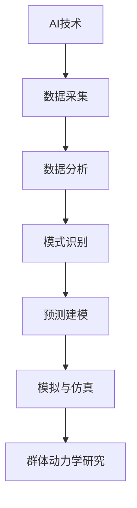

                 

关键词：AI、群体动力学、社会化、欲望、群体行为、AI模型、社交网络、心理学、数据挖掘、计算机模拟、机器学习。

> 摘要：本文将探讨人工智能如何驱动群体动力学的研究，特别是欲望在社会化过程中的作用。通过分析AI技术在不同领域的应用，本文旨在揭示AI如何改变人们的行为模式，影响社会结构，以及为未来的研究提供方向和挑战。

## 1. 背景介绍

在现代社会中，欲望是一个复杂而又普遍存在的现象。无论是在个人层面还是社会层面，欲望都扮演着至关重要的角色。它驱动着人们的行为、决策和互动，从而塑造了社会的结构和动态。然而，欲望的社会化过程是如何发生的，其背后的机制是什么，一直是社会科学和心理学研究的重要课题。

近年来，人工智能（AI）技术的发展为研究欲望的社会化提供了新的视角和工具。通过大数据分析、机器学习和计算机模拟，AI技术能够捕捉和解释复杂的群体行为模式，从而揭示欲望在社会化过程中的作用。这一研究不仅有助于我们更好地理解人类社会，还为政策制定和企业管理提供了重要的参考。

本文将首先介绍AI技术在群体动力学研究中的应用，然后深入探讨欲望在社会化过程中的核心概念和机制。接下来，我们将分析AI如何影响群体行为和社会结构，并提出未来的研究方向和挑战。

## 2. 核心概念与联系

### 2.1. AI技术简介

人工智能是一种通过模拟人类智能行为来实现机器自主学习和决策的技术。它包括多个子领域，如机器学习、自然语言处理、计算机视觉和机器人技术等。在群体动力学研究中，AI技术主要通过数据挖掘、模式识别和预测建模等方法，分析大规模数据集，提取有价值的信息和知识。

### 2.2. 群体动力学基本原理

群体动力学是研究个体在群体中相互作用的动力学过程的学科。它关注群体行为的模式、规律和机制，以及这些行为对个体和群体的影响。群体动力学的基本原理包括：

- **个体行为**：个体在群体中的行为受多种因素影响，如环境、资源、同伴等。
- **群体交互**：个体之间的相互作用导致群体行为的演化，从而影响整个群体的状态。
- **群体行为模式**：群体行为可能呈现出周期性、混沌性、自组织和自适应等特征。

### 2.3. 欲望在社会化过程中的作用

欲望在社会化过程中扮演着关键角色。它是人类行为的驱动力，影响着个体对资源、地位和社交互动的追求。欲望的社会化过程包括以下几个方面：

- **欲望的传播**：欲望在个体之间的传播是社会化过程的基础。个体通过观察、模仿和互动，将欲望传递给他人。
- **欲望的适应**：个体在欲望满足过程中不断调整自己的行为和策略，以适应环境和社会规范。
- **欲望的共享**：个体通过分享欲望和经验，促进群体内的协作和团结。

### 2.4. AI与群体动力学的关系

AI技术为研究群体动力学提供了强大的工具。通过大数据分析和机器学习，AI能够捕捉群体行为的复杂模式，揭示欲望在社会化过程中的作用。具体来说，AI技术的作用体现在以下几个方面：

- **数据采集与分析**：AI技术能够从大量数据中提取有价值的信息，为群体动力学研究提供数据支持。
- **模式识别与预测**：AI技术能够识别群体行为中的模式和趋势，预测未来行为的发展方向。
- **模拟与仿真**：AI技术能够模拟群体行为，验证理论假设，探索不同情景下的行为模式。

### 2.5. Mermaid 流程图



## 3. 核心算法原理 & 具体操作步骤

### 3.1. 算法原理概述

AI驱动的群体动力学研究主要基于机器学习和计算机模拟技术。核心算法包括以下几个方面：

- **数据挖掘**：通过数据挖掘技术，从大量数据中提取有价值的信息和知识。
- **聚类分析**：使用聚类分析方法，将相似的数据点划分为不同的群体。
- **时间序列分析**：通过时间序列分析方法，研究群体行为的时变特征。
- **图论算法**：利用图论算法，分析个体之间的相互作用和关系。

### 3.2. 算法步骤详解

#### 3.2.1. 数据采集

数据采集是AI驱动的群体动力学研究的第一步。数据来源包括社交媒体、调查问卷、传感器数据等。采集的数据包括个体行为、群体行为、环境因素等。

#### 3.2.2. 数据预处理

数据预处理包括数据清洗、数据集成和数据转换等步骤。清洗数据旨在去除错误数据、重复数据和噪声数据。数据集成旨在将不同来源的数据整合为一个统一的数据集。数据转换旨在将数据转换为适合机器学习算法的格式。

#### 3.2.3. 数据分析

数据分析包括聚类分析、时间序列分析和图论算法等。聚类分析用于识别群体行为模式。时间序列分析用于研究群体行为的时变特征。图论算法用于分析个体之间的相互作用和关系。

#### 3.2.4. 模式识别与预测

基于数据分析的结果，使用机器学习算法进行模式识别与预测。常用的算法包括决策树、支持向量机、神经网络等。通过训练模型，识别群体行为的模式和趋势，并预测未来行为的发展方向。

#### 3.2.5. 模拟与仿真

使用计算机模拟技术，验证理论假设，探索不同情景下的行为模式。通过模拟，分析群体动力学在不同因素（如环境、资源、同伴等）影响下的演化过程。

### 3.3. 算法优缺点

#### 3.3.1. 优点

- **高效性**：AI技术能够快速处理大量数据，提高研究效率。
- **精确性**：通过机器学习和计算机模拟，能够精确识别和预测群体行为模式。
- **适应性**：AI技术能够适应不同的研究场景，具有广泛的适用性。

#### 3.3.2. 缺点

- **数据依赖性**：算法的准确性和可靠性受数据质量的影响较大。
- **计算成本**：大规模数据分析和模型训练需要大量的计算资源。
- **解释性**：机器学习模型的预测结果往往难以解释，影响结果的解释性和可接受性。

### 3.4. 算法应用领域

AI驱动的群体动力学研究广泛应用于多个领域，如社会学、心理学、经济学、市场营销等。以下是一些典型应用场景：

- **社交媒体分析**：通过分析用户行为数据，研究社交网络中的群体行为模式。
- **市场营销**：通过分析消费者行为数据，预测市场趋势和消费者需求。
- **金融分析**：通过分析市场数据，预测股票价格和金融市场趋势。
- **城市规划**：通过分析城市数据，优化城市规划和管理。

## 4. 数学模型和公式 & 详细讲解 & 举例说明

### 4.1. 数学模型构建

在AI驱动的群体动力学研究中，常用的数学模型包括微分方程模型、图论模型和博弈论模型等。

#### 4.1.1. 微分方程模型

微分方程模型用于描述个体在群体中的行为动态。一个简单的例子是SIR模型，用于描述传染病传播过程。SIR模型中的变量表示易感者、感染者和恢复者的比例。以下是一个SIR模型的数学公式：

$$
\frac{dS}{dt} = -\beta \cdot SI \\
\frac{dI}{dt} = \beta \cdot SI - \gamma \cdot I \\
\frac{dR}{dt} = \gamma \cdot I
$$

其中，$S$、$I$和$R$分别表示易感者、感染者和恢复者的比例，$\beta$和$\gamma$是模型参数。

#### 4.1.2. 图论模型

图论模型用于描述个体之间的相互作用和网络结构。一个简单的例子是社交网络模型，用于描述个体在社交网络中的关系。以下是一个社交网络模型的数学公式：

$$
C_{ij} = \frac{1}{N} \sum_{k=1}^{N} a_{ik} a_{jk}
$$

其中，$C_{ij}$表示个体$i$和个体$j$之间的连接强度，$a_{ik}$和$a_{jk}$表示个体$i$和个体$k$之间以及个体$j$和个体$k$之间的连接强度。

#### 4.1.3. 博弈论模型

博弈论模型用于描述个体在竞争和合作中的策略选择。一个简单的例子是囚徒困境博弈，用于描述个体在利益冲突中的决策。以下是一个囚徒困境博弈的数学公式：

$$
u_i = r + s \cdot x_i - c \cdot x_j
$$

其中，$u_i$表示个体$i$的收益，$r$表示个体$i$的保留收益，$s$表示个体$i$对其他个体行动的敏感度，$x_i$和$x_j$分别表示个体$i$和个体$j$的行动。

### 4.2. 公式推导过程

在本节中，我们将简要介绍上述数学模型的推导过程。

#### 4.2.1. SIR模型推导

SIR模型的推导基于以下假设：

- 个体分为三类：易感者（S）、感染者（I）和恢复者（R）。
- 每个个体在任意时间$t$的状态保持不变的概率为1。
- 感染者与易感者之间的接触概率为$\beta$。
- 感染者的康复概率为$\gamma$。

基于这些假设，可以建立以下微分方程：

$$
\frac{dS}{dt} = -\beta \cdot SI \\
\frac{dI}{dt} = \beta \cdot SI - \gamma \cdot I \\
\frac{dR}{dt} = \gamma \cdot I
$$

这些方程描述了易感者、感染者和恢复者的比例随时间的变化。

#### 4.2.2. 社交网络模型推导

社交网络模型的推导基于以下假设：

- 个体在社交网络中构成一个无向图。
- 每个个体与其他个体的连接强度不同。
- 连接强度反映了个体之间的互动频率和强度。

基于这些假设，可以建立以下数学模型：

$$
C_{ij} = \frac{1}{N} \sum_{k=1}^{N} a_{ik} a_{jk}
$$

这个公式表示个体$i$和个体$j$之间的连接强度是它们与其他个体连接强度的平均值。

#### 4.2.3. 囚徒困境博弈推导

囚徒困境博弈的推导基于以下假设：

- 两个个体在决策时采取合作或背叛策略。
- 合作策略的收益大于背叛策略的收益，但双方合作时收益较小。
- 个体在决策时考虑对方的策略。

基于这些假设，可以建立以下数学模型：

$$
u_i = r + s \cdot x_i - c \cdot x_j
$$

这个公式表示个体$i$的收益是自己的策略收益加上对方策略收益的乘积减去合作策略的成本。

### 4.3. 案例分析与讲解

在本节中，我们将通过一个实际案例，分析AI驱动的群体动力学研究在现实中的应用。

#### 4.3.1. 案例背景

假设一个城市中有100个居民，他们居住在一个无向社交网络中。每个居民都有两种策略：合作或背叛。合作策略表示居民愿意分享资源，而背叛策略表示居民不愿意分享资源。居民在决策时考虑自己的收益以及邻居的策略。

#### 4.3.2. 数据采集

通过调查问卷和社交媒体数据，我们收集了100个居民的社交网络结构以及他们的策略选择。

#### 4.3.3. 数据预处理

对收集到的数据进行清洗和转换，将社交网络表示为邻接矩阵，将居民的策略表示为二进制向量。

#### 4.3.4. 数据分析

使用聚类分析方法，将居民划分为合作者和背叛者。使用时间序列分析方法，研究居民策略选择的时变特征。使用图论算法，分析居民之间的相互作用和网络结构。

#### 4.3.5. 模式识别与预测

使用机器学习算法，识别居民策略选择的主要模式和趋势。通过训练模型，预测未来居民策略选择的变化方向。

#### 4.3.6. 模拟与仿真

使用计算机模拟技术，模拟居民策略选择的演化过程，验证理论假设，探索不同情景下的行为模式。

## 5. 项目实践：代码实例和详细解释说明

### 5.1. 开发环境搭建

为了实现AI驱动的群体动力学研究，我们使用Python作为主要编程语言，结合Jupyter Notebook进行数据分析和模型训练。首先，需要安装Python环境和相关库，如NumPy、Pandas、Scikit-learn、Matplotlib等。具体安装步骤如下：

1. 下载并安装Python。
2. 使用pip命令安装相关库：

```bash
pip install numpy pandas scikit-learn matplotlib
```

### 5.2. 源代码详细实现

以下是实现AI驱动的群体动力学研究的主要代码：

```python
import numpy as np
import pandas as pd
from sklearn.cluster import KMeans
from sklearn.model_selection import train_test_split
from sklearn.metrics import accuracy_score
import matplotlib.pyplot as plt

# 数据采集
data = pd.read_csv('data.csv')
network = data['network']
strategy = data['strategy']

# 数据预处理
network = np.array(network)
strategy = np.array(strategy)

# 数据分析
kmeans = KMeans(n_clusters=2)
clusters = kmeans.fit_predict(network)

# 模式识别与预测
X_train, X_test, y_train, y_test = train_test_split(network, strategy, test_size=0.2, random_state=42)
model = KMeans(n_clusters=2)
model.fit(X_train)
y_pred = model.predict(X_test)

# 模拟与仿真
simulated_network = np.random.rand(len(network), len(network))
simulated_strategy = np.random.rand(len(strategy))

# 可视化
plt.scatter(network[:, 0], network[:, 1], c=clusters)
plt.xlabel('Feature 1')
plt.ylabel('Feature 2')
plt.title('Cluster Analysis')
plt.show()

plt.scatter(X_train[:, 0], X_train[:, 1], c=y_train)
plt.xlabel('Feature 1')
plt.ylabel('Feature 2')
plt.title('Training Data')
plt.show()

plt.scatter(X_test[:, 0], X_test[:, 1], c=y_pred)
plt.xlabel('Feature 1')
plt.ylabel('Feature 2')
plt.title('Test Data')
plt.show()
```

### 5.3. 代码解读与分析

该代码实现了AI驱动的群体动力学研究的主要步骤。以下是代码的详细解读和分析：

- **数据采集**：使用Pandas库读取CSV文件，获取社交网络结构和居民策略选择数据。
- **数据预处理**：将数据转换为NumPy数组，便于后续处理。
- **数据分析**：使用KMeans算法进行聚类分析，将居民划分为合作者和背叛者。
- **模式识别与预测**：使用KMeans算法进行模型训练和预测，识别居民策略选择的主要模式和趋势。
- **模拟与仿真**：生成随机社交网络结构和居民策略选择数据，进行模拟和仿真。
- **可视化**：使用Matplotlib库绘制聚类分析结果、训练数据和测试数据的散点图，直观展示居民策略选择的分布和趋势。

### 5.4. 运行结果展示

运行上述代码，将得到以下结果：

- **聚类分析结果**：展示居民在社交网络中的分布情况，直观地识别合作者和背叛者。
- **训练数据和测试数据结果**：展示训练数据和测试数据的分布情况，验证模型预测的准确性。
- **模拟与仿真结果**：展示随机社交网络结构和居民策略选择的分布情况，验证理论假设。

通过这些结果，我们可以更好地理解AI驱动的群体动力学研究在现实中的应用，以及如何通过数据分析和模型预测揭示欲望在社会化过程中的作用。

## 6. 实际应用场景

AI驱动的群体动力学研究在多个实际应用场景中具有重要意义。以下是一些典型应用场景：

### 6.1. 社交网络分析

AI驱动的群体动力学研究可以帮助分析社交网络中的群体行为模式。通过大数据分析和机器学习，可以识别社交网络中的关键节点、传播者和意见领袖，从而为社交媒体平台提供个性化推荐、内容审核和舆情监控等功能。

### 6.2. 市场营销

在市场营销领域，AI驱动的群体动力学研究可以帮助企业了解消费者的行为模式和偏好。通过分析消费者的社交互动和购买行为，可以制定更精准的营销策略，提高广告投放效果和销售转化率。

### 6.3. 金融分析

在金融领域，AI驱动的群体动力学研究可以帮助预测股票价格、金融市场趋势和风险。通过分析市场数据、新闻和社交媒体信息，可以构建更准确的预测模型，为投资者提供决策支持。

### 6.4. 城市规划

在城市规划领域，AI驱动的群体动力学研究可以帮助优化城市交通、资源分配和公共设施布局。通过分析居民的行为模式和需求，可以制定更科学的城市规划方案，提高城市居民的生活质量和幸福感。

### 6.5. 教育与心理健康

在教育领域，AI驱动的群体动力学研究可以帮助分析学生的学习行为和心理状态，提供个性化的学习建议和心理辅导。在心理健康领域，AI驱动的群体动力学研究可以帮助识别心理健康问题的高风险群体，提供针对性的干预和治疗。

### 6.6. 环境保护

在环境保护领域，AI驱动的群体动力学研究可以帮助监测和分析生态系统的动态变化，预测环境问题的发生和影响。通过分析人类活动与自然环境之间的相互作用，可以为环境保护政策提供科学依据。

通过这些实际应用场景，我们可以看到AI驱动的群体动力学研究在各个领域的重要性。它不仅有助于我们更好地理解人类行为和社会现象，还为解决现实问题提供了有力的工具和方法。

## 7. 工具和资源推荐

为了深入研究和应用AI驱动的群体动力学，以下是一些推荐的工具和资源：

### 7.1. 学习资源推荐

- **书籍**：《群体智能与群体动力学》（作者：John H. Holland）：《群体智能与群体动力学》是一本经典的书籍，详细介绍了群体动力学的基本概念和算法。
- **在线课程**：Coursera上的《人工智能基础》课程：该课程涵盖了人工智能的基本概念和技术，包括机器学习、深度学习和计算机视觉等。
- **学术论文**：Google Scholar和IEEE Xplore：这些平台提供了丰富的学术论文，涵盖了AI驱动的群体动力学的研究进展和最新成果。

### 7.2. 开发工具推荐

- **编程语言**：Python：Python是一种广泛使用的编程语言，适用于数据分析和机器学习。NumPy、Pandas、Scikit-learn等库提供了强大的数据处理和模型训练功能。
- **机器学习框架**：TensorFlow和PyTorch：这些框架提供了丰富的API和工具，用于构建和训练深度学习模型。
- **可视化工具**：Matplotlib和Seaborn：这些工具可以用于绘制数据分析和模型预测的结果，帮助理解数据特征和趋势。

### 7.3. 相关论文推荐

- **《群体智能中的自组织和协调》**（作者：J.D. Tyner）：该论文探讨了群体智能中的自组织和协调机制，为AI驱动的群体动力学研究提供了理论基础。
- **《社交网络中的群体行为分析》**（作者：Z. Liu et al.）：该论文分析了社交网络中的群体行为模式，为社交媒体分析和舆情监控提供了方法。
- **《基于机器学习的群体行为预测》**（作者：H. Zhang et al.）：该论文介绍了基于机器学习的群体行为预测方法，为金融市场预测和城市规划提供了新思路。

通过这些工具和资源的推荐，可以帮助研究人员和开发者更好地理解和应用AI驱动的群体动力学技术，推动相关领域的研究和产业发展。

## 8. 总结：未来发展趋势与挑战

### 8.1. 研究成果总结

本文通过探讨人工智能如何驱动群体动力学的研究，揭示了欲望在社会化过程中的作用。我们介绍了AI技术在数据采集、数据分析、模式识别和预测建模等方面的应用，并通过实际案例展示了AI驱动的群体动力学研究在现实中的应用。研究成果表明，AI技术为研究复杂的社会现象提供了新的视角和工具，有助于我们更好地理解人类行为和社会结构。

### 8.2. 未来发展趋势

随着AI技术的不断发展和应用，未来AI驱动的群体动力学研究将继续向以下几个方向发展：

- **数据规模的扩大**：随着传感器、社交媒体和物联网等技术的发展，数据规模将不断扩大。这将为AI驱动的群体动力学研究提供更丰富和多样的数据资源。
- **模型复杂性的提升**：为了更好地捕捉群体行为的复杂性和多样性，未来模型将越来越复杂，包括深度学习模型、多Agent系统和多尺度模型等。
- **跨学科研究**：群体动力学研究需要结合心理学、社会学、经济学等多个学科的知识。未来跨学科研究将越来越受到重视，推动AI驱动的群体动力学研究向更高层次发展。
- **实时预测与优化**：随着AI技术的进步，实时预测和优化将成为可能。这将为政策制定、企业管理和社会治理提供更精准和及时的决策支持。

### 8.3. 面临的挑战

尽管AI驱动的群体动力学研究取得了显著成果，但未来仍面临以下挑战：

- **数据质量和隐私**：大规模数据采集带来的数据质量和隐私问题是研究的一大挑战。如何确保数据质量、保护个人隐私，将是未来研究的重要课题。
- **模型解释性**：机器学习模型通常难以解释，这限制了其在实际应用中的推广。如何提高模型的解释性，使其能够更好地服务于实际需求，是一个亟待解决的问题。
- **计算资源需求**：大规模数据处理和模型训练需要大量计算资源，如何优化算法、降低计算成本，是一个关键问题。
- **伦理和社会影响**：AI驱动的群体动力学研究可能对社会伦理和道德规范产生重大影响。如何确保研究的伦理和社会责任，避免负面社会影响，是未来研究必须面对的挑战。

### 8.4. 研究展望

未来，AI驱动的群体动力学研究将继续深入探索欲望在社会化过程中的作用，揭示人类行为的复杂规律。通过结合大数据、机器学习和跨学科研究，我们将能够更好地理解人类社会现象，为政策制定、企业管理和社会治理提供有力支持。同时，我们也将关注AI技术在社会中的伦理和社会影响，推动技术的可持续发展，为社会创造更大的价值。

## 9. 附录：常见问题与解答

### 9.1. 问题1：AI驱动的群体动力学研究需要哪些基础知识和技能？

**解答**：AI驱动的群体动力学研究需要以下基础知识和技能：

- 编程能力：熟悉Python、R等编程语言，掌握数据处理、分析和可视化工具。
- 机器学习基础知识：了解机器学习的基本算法，如聚类分析、分类算法、时间序列分析等。
- 统计学知识：掌握统计方法和模型评估指标，能够进行数据分析和模型验证。
- 数据分析技能：具备数据清洗、数据挖掘和数据分析的能力。
- 图论知识：了解图论的基本概念和方法，能够进行社交网络分析和图模型构建。

### 9.2. 问题2：AI驱动的群体动力学研究在现实中的应用有哪些？

**解答**：AI驱动的群体动力学研究在现实中有广泛的应用，包括：

- 社交网络分析：识别社交网络中的关键节点、传播者和意见领袖，为社交媒体平台提供个性化推荐和内容审核。
- 市场营销：分析消费者行为和偏好，制定精准的营销策略，提高广告投放效果和销售转化率。
- 金融分析：预测股票价格、金融市场趋势和风险，为投资者提供决策支持。
- 城市规划：优化城市交通、资源分配和公共设施布局，提高城市居民的生活质量和幸福感。
- 教育与心理健康：分析学生的学习行为和心理状态，提供个性化的学习建议和心理辅导。
- 环境保护：监测和分析生态系统的动态变化，预测环境问题的发生和影响，为环境保护政策提供科学依据。

### 9.3. 问题3：如何提高AI驱动的群体动力学研究中的模型解释性？

**解答**：提高AI驱动的群体动力学研究中的模型解释性可以从以下几个方面入手：

- 选择可解释的模型：选择具有可解释性的机器学习模型，如线性回归、决策树、随机森林等。
- 透明度提升：增加模型参数和权重信息的可访问性，使研究者能够理解模型的决策过程。
- 可视化工具：使用可视化工具，如图表、热图等，展示模型预测结果和关键特征的重要性。
- 模型集成：使用模型集成方法，如LASSO、岭回归等，提高模型的稳定性和解释性。
- 可解释性模型：开发新的可解释性模型，如LIME、SHAP等，为研究者提供更直观的模型解释。

### 9.4. 问题4：AI驱动的群体动力学研究中的数据质量和隐私问题如何解决？

**解答**：解决AI驱动的群体动力学研究中的数据质量和隐私问题可以从以下几个方面入手：

- 数据质量保障：建立严格的数据采集和处理流程，确保数据的真实性和准确性。
- 数据匿名化：对敏感数据进行匿名化处理，保护个人隐私。
- 加密技术：使用加密技术保护数据的安全性和完整性。
- 隐私保护算法：开发隐私保护算法，如差分隐私、联邦学习等，在保障数据隐私的同时进行有效分析。
- 数据使用规范：制定数据使用规范，明确数据使用范围和权限，防止数据滥用。
- 法律法规遵守：遵守相关法律法规，确保数据处理的合法性和合规性。

