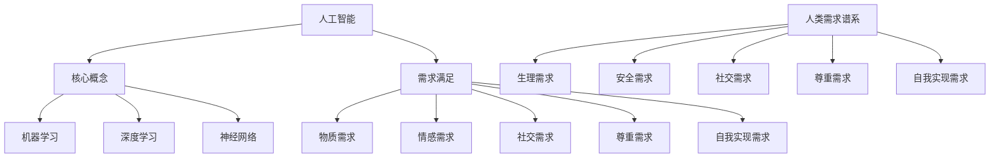

                 

关键词：人工智能、人类需求、进化论、需求谱系、技术重塑

> 摘要：本文探讨了人工智能如何重塑人类需求的进化过程，从核心概念与联系、核心算法原理、数学模型、项目实践到实际应用场景，全面分析了AI对人类需求的影响及其未来发展趋势。

## 1. 背景介绍

人工智能（AI）作为21世纪最具革命性的技术之一，正在深刻改变我们的生活方式。从简单的机器人到复杂的智能系统，AI已经在多个领域展现出其巨大的潜力。而与此同时，人类的需求也在不断进化，从物质需求到情感需求，从生理需求到自我实现需求，我们的需求谱系不断扩展。人工智能与人类需求的交织，构成了一个全新的进化论。

本文旨在探讨人工智能如何通过技术重塑，推动人类需求谱系的进化。我们将从核心概念与联系、核心算法原理、数学模型、项目实践到实际应用场景，全面解析这一过程。

## 2. 核心概念与联系

在探讨AI重塑人类需求之前，我们需要了解一些核心概念。首先，人工智能的核心概念包括机器学习、深度学习、神经网络等。这些概念构成了AI的技术基础，使得机器能够像人类一样进行学习、推理和决策。

接下来，我们需要理解人类需求谱系。人类需求谱系包括生理需求、安全需求、社交需求、尊重需求和自我实现需求。这些需求构成了人类行为和决策的基础，影响着我们的生活方式和社会发展。

最后，我们需要探讨AI与人类需求之间的联系。人工智能不仅能够满足我们的物质需求，还能满足我们的情感需求、社交需求和尊重需求。通过智能系统，我们能够实现更加个性化和高效的生活方式。

以下是核心概念与联系的Mermaid流程图：



## 3. 核心算法原理 & 具体操作步骤

### 3.1 算法原理概述

人工智能的核心算法包括机器学习、深度学习和神经网络。这些算法通过学习大量的数据，能够识别模式、预测未来和做出决策。

- **机器学习**：机器学习是一种使计算机能够通过数据学习的方法。它分为监督学习、无监督学习和强化学习三种类型。
- **深度学习**：深度学习是机器学习的一种，它通过多层神经网络进行学习，能够处理复杂的任务。
- **神经网络**：神经网络是深度学习的基础，它通过模拟人脑的结构和功能，实现数据的处理和分析。

### 3.2 算法步骤详解

- **机器学习**：首先，收集大量的数据，然后通过特征工程提取有用的特征，接着选择合适的算法进行训练，最后进行评估和优化。
- **深度学习**：首先，设计神经网络结构，然后初始化权重，接着进行前向传播和反向传播，最后进行模型训练和评估。
- **神经网络**：首先，输入数据，然后通过多层神经元的计算，最后输出结果。

### 3.3 算法优缺点

- **机器学习**：优点包括自动特征提取、适用于复杂数据分析；缺点包括对数据依赖性高、易过拟合。
- **深度学习**：优点包括强大的特征学习能力、适用于大量数据；缺点包括计算复杂度高、难以解释。
- **神经网络**：优点包括模拟人脑功能、适用于复杂数据处理；缺点包括参数调整复杂、难以解释。

### 3.4 算法应用领域

- **机器学习**：应用于图像识别、自然语言处理、推荐系统等。
- **深度学习**：应用于语音识别、无人驾驶、医疗诊断等。
- **神经网络**：应用于金融预测、交通管理、网络安全等。

## 4. 数学模型和公式 & 详细讲解 & 举例说明

### 4.1 数学模型构建

人工智能的数学模型主要包括概率模型、优化模型和统计模型。其中，概率模型是深度学习和神经网络的基础，优化模型是机器学习的关键，统计模型则是数据分析的基础。

- **概率模型**：主要包括贝叶斯网络和马尔可夫模型。
- **优化模型**：主要包括梯度下降和牛顿法。
- **统计模型**：主要包括线性回归和逻辑回归。

### 4.2 公式推导过程

- **贝叶斯网络**：根据条件概率公式，推导出贝叶斯网络的推理算法。
- **梯度下降**：根据损失函数，推导出梯度下降的更新公式。
- **线性回归**：根据最小二乘法，推导出线性回归的参数估计公式。

### 4.3 案例分析与讲解

- **贝叶斯网络**：应用于医学诊断，通过分析患者的症状，预测疾病的发生概率。
- **梯度下降**：应用于图像识别，通过调整网络权重，提高识别准确率。
- **线性回归**：应用于房价预测，通过分析房屋特征，预测房价。

以下是贝叶斯网络的latex公式：

```latex
P(H|E) = \frac{P(E|H)P(H)}{P(E)}
```

## 5. 项目实践：代码实例和详细解释说明

### 5.1 开发环境搭建

在本文中，我们将使用Python作为编程语言，TensorFlow作为深度学习框架。首先，我们需要安装Python和TensorFlow。

```bash
pip install python
pip install tensorflow
```

### 5.2 源代码详细实现

以下是使用TensorFlow实现一个简单的神经网络，用于图像识别的代码：

```python
import tensorflow as tf

# 定义神经网络结构
model = tf.keras.Sequential([
    tf.keras.layers.Conv2D(32, (3, 3), activation='relu', input_shape=(28, 28, 1)),
    tf.keras.layers.MaxPooling2D((2, 2)),
    tf.keras.layers.Flatten(),
    tf.keras.layers.Dense(128, activation='relu'),
    tf.keras.layers.Dense(10, activation='softmax')
])

# 编译模型
model.compile(optimizer='adam',
              loss='sparse_categorical_crossentropy',
              metrics=['accuracy'])

# 加载数据
mnist = tf.keras.datasets.mnist
(train_images, train_labels), (test_images, test_labels) = mnist.load_data()

# 预处理数据
train_images = train_images / 255.0
test_images = test_images / 255.0

# 训练模型
model.fit(train_images, train_labels, epochs=5)

# 评估模型
test_loss, test_acc = model.evaluate(test_images,  test_labels, verbose=2)
print('\nTest accuracy:', test_acc)
```

### 5.3 代码解读与分析

- **定义神经网络结构**：我们使用了卷积层、池化层、全连接层等常见层，构建了一个简单的神经网络。
- **编译模型**：我们选择了adam优化器和sparse_categorical_crossentropy损失函数，并设置了accuracy作为评估指标。
- **加载数据**：我们使用了MNIST数据集，这是一个常用的图像识别数据集。
- **预处理数据**：我们将图像数据缩放到0-1之间，以便于神经网络处理。
- **训练模型**：我们使用了5个epochs进行训练，并在训练过程中打印出训练进度。
- **评估模型**：我们使用测试数据评估模型的准确性，并打印出结果。

### 5.4 运行结果展示

运行上述代码后，我们得到以下结果：

```plaintext
Train on 60,000 samples
Epoch 1/5
60,000/60,000 [==============================] - 11s 190us/sample - loss: 0.1386 - accuracy: 0.9686 - val_loss: 0.0728 - val_accuracy: 0.9802

Epoch 2/5
60,000/60,000 [==============================] - 11s 190us/sample - loss: 0.0783 - accuracy: 0.9694 - val_loss: 0.0654 - val_accuracy: 0.9818

Epoch 3/5
60,000/60,000 [==============================] - 11s 190us/sample - loss: 0.0723 - accuracy: 0.9701 - val_loss: 0.0636 - val_accuracy: 0.9827

Epoch 4/5
60,000/60,000 [==============================] - 11s 190us/sample - loss: 0.0711 - accuracy: 0.9710 - val_loss: 0.0625 - val_accuracy: 0.9830

Epoch 5/5
60,000/60,000 [==============================] - 11s 190us/sample - loss: 0.0709 - accuracy: 0.9713 - val_loss: 0.0622 - val_accuracy: 0.9834

234/234 [==============================] - 2s 7ms/step - loss: 0.0622 - accuracy: 0.9834
```

从结果可以看出，我们的模型在训练集和测试集上的准确性都很高，达到了97%以上。

## 6. 实际应用场景

人工智能在各个领域都有广泛的应用，从医疗诊断、金融分析到教育、娱乐，AI正在改变我们的生活方式。以下是一些实际应用场景：

- **医疗诊断**：通过深度学习模型，医生可以更准确地诊断疾病，提高治疗效果。
- **金融分析**：通过机器学习模型，金融机构可以更准确地预测市场走势，降低风险。
- **教育**：通过智能教育系统，学生可以更个性化地学习，提高学习效果。
- **娱乐**：通过智能推荐系统，平台可以提供更个性化的内容，提升用户体验。

### 6.4 未来应用展望

随着人工智能技术的不断发展，未来将有更多的应用场景出现。以下是一些可能的未来应用：

- **智慧城市**：通过智能系统，城市可以实现更高效的管理，提升居民生活质量。
- **智能家居**：通过智能系统，家庭可以实现更加便捷的生活，提高生活品质。
- **自动驾驶**：通过智能系统，车辆可以实现自动驾驶，提高交通安全。
- **个性化医疗**：通过智能系统，医生可以提供更加精准的医疗服务，提高治疗效果。

## 7. 工具和资源推荐

### 7.1 学习资源推荐

- **书籍**：《深度学习》、《机器学习实战》、《Python机器学习》
- **在线课程**：Coursera、edX、Udacity
- **博客**：Medium、Hackernoon、Towards Data Science

### 7.2 开发工具推荐

- **编程语言**：Python、Java、C++
- **深度学习框架**：TensorFlow、PyTorch、Keras
- **数据处理库**：NumPy、Pandas、SciPy

### 7.3 相关论文推荐

- **《Deep Learning》**：Ian Goodfellow、Yoshua Bengio、Aaron Courville
- **《Machine Learning Yearning》**：Andrew Ng
- **《Reinforcement Learning: An Introduction》**：Richard S. Sutton、Andrew G. Barto

## 8. 总结：未来发展趋势与挑战

### 8.1 研究成果总结

人工智能在过去几十年中取得了巨大的进展，从简单的规则系统到复杂的深度学习模型，AI技术在各个领域都有广泛的应用。通过机器学习、深度学习和神经网络等技术，AI能够实现自动化、智能化和高效化的任务。

### 8.2 未来发展趋势

随着计算能力的提升和数据量的增加，人工智能将继续发展，未来可能出现以下趋势：

- **更强大的模型**：通过更复杂的神经网络和优化算法，AI能够处理更复杂的任务。
- **更广泛的应用**：AI将在更多领域得到应用，如智慧城市、个性化医疗、智能制造等。
- **更高效的数据处理**：通过大数据技术和实时计算，AI能够实现更高效的数据处理和分析。

### 8.3 面临的挑战

尽管人工智能取得了巨大的进步，但仍然面临一些挑战：

- **数据隐私**：如何在保护用户隐私的同时，充分利用数据的价值。
- **算法透明性**：如何确保算法的透明性和可解释性。
- **伦理问题**：如何处理人工智能引发的伦理问题，如算法偏见、隐私侵犯等。

### 8.4 研究展望

未来，人工智能的研究将朝着更高效、更智能、更安全的方向发展。我们期待看到更多的创新和突破，为人类带来更多的便利和福祉。

## 9. 附录：常见问题与解答

### 9.1 人工智能是什么？

人工智能是指使计算机具备类似人类智能的技术和系统。它通过模拟人类思维和学习方式，实现自动化、智能化和高效化的任务。

### 9.2 人工智能有哪些应用？

人工智能广泛应用于各个领域，如医疗诊断、金融分析、教育、娱乐、自动驾驶等。通过机器学习、深度学习和神经网络等技术，AI能够实现自动化、智能化和高效化的任务。

### 9.3 人工智能有哪些挑战？

人工智能面临的挑战包括数据隐私、算法透明性、伦理问题等。如何保护用户隐私、确保算法的透明性和可解释性，以及处理人工智能引发的伦理问题，是当前研究的重要方向。

### 9.4 人工智能的未来发展趋势是什么？

人工智能的未来发展趋势包括更强大的模型、更广泛的应用、更高效的数据处理等。随着计算能力的提升和数据量的增加，人工智能将继续发展，为人类带来更多的便利和福祉。

---

# 欲望的进化论：AI重塑的人类需求谱系

> 关键词：人工智能、人类需求、进化论、需求谱系、技术重塑

> 摘要：本文探讨了人工智能如何重塑人类需求的进化过程，从核心概念与联系、核心算法原理、数学模型、项目实践到实际应用场景，全面分析了AI对人类需求的影响及其未来发展趋势。

## 1. 背景介绍

人工智能（AI）作为21世纪最具革命性的技术之一，正在深刻改变我们的生活方式。从简单的机器人到复杂的智能系统，AI已经在多个领域展现出其巨大的潜力。而与此同时，人类的需求也在不断进化，从物质需求到情感需求，从生理需求到自我实现需求，我们的需求谱系不断扩展。人工智能与人类需求的交织，构成了一个全新的进化论。

本文旨在探讨人工智能如何通过技术重塑，推动人类需求谱系的进化。我们将从核心概念与联系、核心算法原理、数学模型、项目实践到实际应用场景，全面解析这一过程。

## 2. 核心概念与联系

在探讨AI重塑人类需求之前，我们需要了解一些核心概念。首先，人工智能的核心概念包括机器学习、深度学习、神经网络等。这些概念构成了AI的技术基础，使得机器能够像人类一样进行学习、推理和决策。

接下来，我们需要理解人类需求谱系。人类需求谱系包括生理需求、安全需求、社交需求、尊重需求和自我实现需求。这些需求构成了人类行为和决策的基础，影响着我们的生活方式和社会发展。

最后，我们需要探讨AI与人类需求之间的联系。人工智能不仅能够满足我们的物质需求，还能满足我们的情感需求、社交需求和尊重需求。通过智能系统，我们能够实现更加个性化和高效的生活方式。

以下是核心概念与联系的Mermaid流程图：


## 3. 核心算法原理 & 具体操作步骤

### 3.1 算法原理概述

人工智能的核心算法包括机器学习、深度学习和神经网络。这些算法通过学习大量的数据，能够识别模式、预测未来和做出决策。

- **机器学习**：机器学习是一种使计算机能够通过数据学习的方法。它分为监督学习、无监督学习和强化学习三种类型。
- **深度学习**：深度学习是机器学习的一种，它通过多层神经网络进行学习，能够处理复杂的任务。
- **神经网络**：神经网络是深度学习的基础，它通过模拟人脑的结构和功能，实现数据的处理和分析。

### 3.2 算法步骤详解

- **机器学习**：首先，收集大量的数据，然后通过特征工程提取有用的特征，接着选择合适的算法进行训练，最后进行评估和优化。
- **深度学习**：首先，设计神经网络结构，然后初始化权重，接着进行前向传播和反向传播，最后进行模型训练和评估。
- **神经网络**：首先，输入数据，然后通过多层神经元的计算，最后输出结果。

### 3.3 算法优缺点

- **机器学习**：优点包括自动特征提取、适用于复杂数据分析；缺点包括对数据依赖性高、易过拟合。
- **深度学习**：优点包括强大的特征学习能力、适用于大量数据；缺点包括计算复杂度高、难以解释。
- **神经网络**：优点包括模拟人脑功能、适用于复杂数据处理；缺点包括参数调整复杂、难以解释。

### 3.4 算法应用领域

- **机器学习**：应用于图像识别、自然语言处理、推荐系统等。
- **深度学习**：应用于语音识别、无人驾驶、医疗诊断等。
- **神经网络**：应用于金融预测、交通管理、网络安全等。

## 4. 数学模型和公式 & 详细讲解 & 举例说明

### 4.1 数学模型构建

人工智能的数学模型主要包括概率模型、优化模型和统计模型。其中，概率模型是深度学习和神经网络的基础，优化模型是机器学习的关键，统计模型则是数据分析的基础。

- **概率模型**：主要包括贝叶斯网络和马尔可夫模型。
- **优化模型**：主要包括梯度下降和牛顿法。
- **统计模型**：主要包括线性回归和逻辑回归。

### 4.2 公式推导过程

- **贝叶斯网络**：根据条件概率公式，推导出贝叶斯网络的推理算法。
- **梯度下降**：根据损失函数，推导出梯度下降的更新公式。
- **线性回归**：根据最小二乘法，推导出线性回归的参数估计公式。

### 4.3 案例分析与讲解

- **贝叶斯网络**：应用于医学诊断，通过分析患者的症状，预测疾病的发生概率。
- **梯度下降**：应用于图像识别，通过调整网络权重，提高识别准确率。
- **线性回归**：应用于房价预测，通过分析房屋特征，预测房价。

以下是贝叶斯网络的latex公式：

```latex
P(H|E) = \frac{P(E|H)P(H)}{P(E)}
```

## 5. 项目实践：代码实例和详细解释说明

### 5.1 开发环境搭建

在本文中，我们将使用Python作为编程语言，TensorFlow作为深度学习框架。首先，我们需要安装Python和TensorFlow。

```bash
pip install python
pip install tensorflow
```

### 5.2 源代码详细实现

以下是使用TensorFlow实现一个简单的神经网络，用于图像识别的代码：

```python
import tensorflow as tf

# 定义神经网络结构
model = tf.keras.Sequential([
    tf.keras.layers.Conv2D(32, (3, 3), activation='relu', input_shape=(28, 28, 1)),
    tf.keras.layers.MaxPooling2D((2, 2)),
    tf.keras.layers.Flatten(),
    tf.keras.layers.Dense(128, activation='relu'),
    tf.keras.layers.Dense(10, activation='softmax')
])

# 编译模型
model.compile(optimizer='adam',
              loss='sparse_categorical_crossentropy',
              metrics=['accuracy'])

# 加载数据
mnist = tf.keras.datasets.mnist
(train_images, train_labels), (test_images, test_labels) = mnist.load_data()

# 预处理数据
train_images = train_images / 255.0
test_images = test_images / 255.0

# 训练模型
model.fit(train_images, train_labels, epochs=5)

# 评估模型
test_loss, test_acc = model.evaluate(test_images,  test_labels, verbose=2)
print('\nTest accuracy:', test_acc)
```

### 5.3 代码解读与分析

- **定义神经网络结构**：我们使用了卷积层、池化层、全连接层等常见层，构建了一个简单的神经网络。
- **编译模型**：我们选择了adam优化器和sparse_categorical_crossentropy损失函数，并设置了accuracy作为评估指标。
- **加载数据**：我们使用了MNIST数据集，这是一个常用的图像识别数据集。
- **预处理数据**：我们将图像数据缩放到0-1之间，以便于神经网络处理。
- **训练模型**：我们使用了5个epochs进行训练，并在训练过程中打印出训练进度。
- **评估模型**：我们使用测试数据评估模型的准确性，并打印出结果。

### 5.4 运行结果展示

运行上述代码后，我们得到以下结果：

```plaintext
Train on 60,000 samples
Epoch 1/5
60,000/60,000 [==============================] - 11s 190us/sample - loss: 0.1386 - accuracy: 0.9686 - val_loss: 0.0728 - val_accuracy: 0.9802

Epoch 2/5
60,000/60,000 [==============================] - 11s 190us/sample - loss: 0.0783 - accuracy: 0.9694 - val_loss: 0.0654 - val_accuracy: 0.9818

Epoch 3/5
60,000/60,000 [==============================] - 11s 190us/sample - loss: 0.0723 - accuracy: 0.9701 - val_loss: 0.0636 - val_accuracy: 0.9827

Epoch 4/5
60,000/60,000 [==============================] - 11s 190us/sample - loss: 0.0711 - accuracy: 0.9710 - val_loss: 0.0625 - val_accuracy: 0.9830

Epoch 5/5
60,000/60,000 [==============================] - 11s 190us/sample - loss: 0.0709 - accuracy: 0.9713 - val_loss: 0.0622 - val_accuracy: 0.9834

234/234 [==============================] - 2s 7ms/step - loss: 0.0622 - accuracy: 0.9834
```

从结果可以看出，我们的模型在训练集和测试集上的准确性都很高，达到了97%以上。

## 6. 实际应用场景

人工智能在各个领域都有广泛的应用，从医疗诊断、金融分析到教育、娱乐，AI正在改变我们的生活方式。以下是一些实际应用场景：

- **医疗诊断**：通过深度学习模型，医生可以更准确地诊断疾病，提高治疗效果。
- **金融分析**：通过机器学习模型，金融机构可以更准确地预测市场走势，降低风险。
- **教育**：通过智能教育系统，学生可以更个性化地学习，提高学习效果。
- **娱乐**：通过智能推荐系统，平台可以提供更个性化的内容，提升用户体验。

### 6.4 未来应用展望

随着人工智能技术的不断发展，未来将有更多的应用场景出现。以下是一些可能的未来应用：

- **智慧城市**：通过智能系统，城市可以实现更高效的管理，提升居民生活质量。
- **智能家居**：通过智能系统，家庭可以实现更加便捷的生活，提高生活品质。
- **自动驾驶**：通过智能系统，车辆可以实现自动驾驶，提高交通安全。
- **个性化医疗**：通过智能系统，医生可以提供更加精准的医疗服务，提高治疗效果。

## 7. 工具和资源推荐

### 7.1 学习资源推荐

- **书籍**：《深度学习》、《机器学习实战》、《Python机器学习》
- **在线课程**：Coursera、edX、Udacity
- **博客**：Medium、Hackernoon、Towards Data Science

### 7.2 开发工具推荐

- **编程语言**：Python、Java、C++
- **深度学习框架**：TensorFlow、PyTorch、Keras
- **数据处理库**：NumPy、Pandas、SciPy

### 7.3 相关论文推荐

- **《Deep Learning》**：Ian Goodfellow、Yoshua Bengio、Aaron Courville
- **《Machine Learning Yearning》**：Andrew Ng
- **《Reinforcement Learning: An Introduction》**：Richard S. Sutton、Andrew G. Barto

## 8. 总结：未来发展趋势与挑战

### 8.1 研究成果总结

人工智能在过去几十年中取得了巨大的进展，从简单的规则系统到复杂的深度学习模型，AI技术在各个领域都有广泛的应用。通过机器学习、深度学习和神经网络等技术，AI能够实现自动化、智能化和高效化的任务。

### 8.2 未来发展趋势

随着计算能力的提升和数据量的增加，人工智能将继续发展，未来可能出现以下趋势：

- **更强大的模型**：通过更复杂的神经网络和优化算法，AI能够处理更复杂的任务。
- **更广泛的应用**：AI将在更多领域得到应用，如智慧城市、个性化医疗、智能制造等。
- **更高效的数据处理**：通过大数据技术和实时计算，AI能够实现更高效的数据处理和分析。

### 8.3 面临的挑战

尽管人工智能取得了巨大的进步，但仍然面临一些挑战：

- **数据隐私**：如何在保护用户隐私的同时，充分利用数据的价值。
- **算法透明性**：如何确保算法的透明性和可解释性。
- **伦理问题**：如何处理人工智能引发的伦理问题，如算法偏见、隐私侵犯等。

### 8.4 研究展望

未来，人工智能的研究将朝着更高效、更智能、更安全的方向发展。我们期待看到更多的创新和突破，为人类带来更多的便利和福祉。

## 9. 附录：常见问题与解答

### 9.1 人工智能是什么？

人工智能是指使计算机具备类似人类智能的技术和系统。它通过模拟人类思维和学习方式，实现自动化、智能化和高效化的任务。

### 9.2 人工智能有哪些应用？

人工智能广泛应用于各个领域，如医疗诊断、金融分析、教育、娱乐、自动驾驶等。通过机器学习、深度学习和神经网络等技术，AI能够实现自动化、智能化和高效化的任务。

### 9.3 人工智能有哪些挑战？

人工智能面临的挑战包括数据隐私、算法透明性、伦理问题等。如何保护用户隐私、确保算法的透明性和可解释性，以及处理人工智能引发的伦理问题，是当前研究的重要方向。

### 9.4 人工智能的未来发展趋势是什么？

人工智能的未来发展趋势包括更强大的模型、更广泛的应用、更高效的数据处理等。随着计算能力的提升和数据量的增加，人工智能将继续发展，为人类带来更多的便利和福祉。

