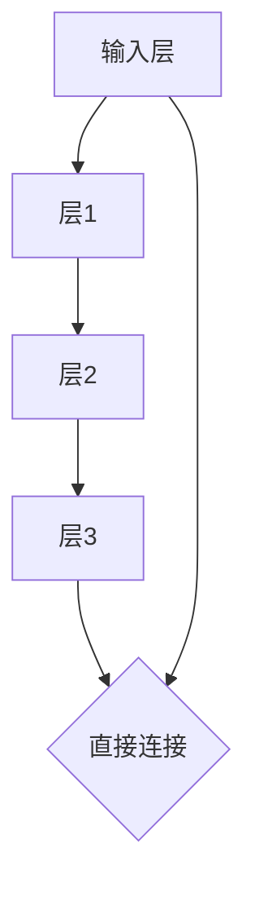

                 

 关键词：残差连接、神经网络、深度学习、训练困难、网络优化、计算机科学、人工智能

> 摘要：本文将深入探讨残差连接在解决深层网络训练困难方面的关键作用。通过介绍残差连接的基本概念、算法原理、数学模型及实际应用，帮助读者全面理解这一重要的深度学习技术。

## 1. 背景介绍

深度学习作为人工智能的一个重要分支，近年来在图像识别、语音识别、自然语言处理等领域取得了显著的进展。然而，随着网络层数的增加，深度学习模型在训练过程中遇到了一系列难题。其中，梯度消失（Gradient Vanishing）和梯度爆炸（Gradient Exploding）现象尤为显著，这严重制约了深层网络的训练效果。

为了克服这些困难，研究人员提出了多种解决方案，其中最具有革命性意义的是残差连接（Residual Connection）。残差连接通过引入额外的连接路径，使得信息可以跳跃传递，从而避免了梯度消失问题，提高了训练效率。本文将详细介绍残差连接的原理和应用，以帮助读者深入了解这一关键技术。

## 2. 核心概念与联系

### 2.1. 残差连接的基本概念

残差连接是一种特殊的网络连接方式，它允许信息在神经网络中的跳跃传递。具体来说，残差连接在原有的网络层之间引入了一条直接的连接路径，这条路径称为残差路径。通过残差路径，输入信息可以直接传递到目标层，而不需要经过中间层的逐层计算。

### 2.2. 残差连接的 Mermaid 流程图

下面是一个简单的 Mermaid 流程图，展示了残差连接的基本结构。



### 2.3. 残差连接与普通连接的比较

在普通连接中，信息需要逐层传递，而在残差连接中，信息可以通过残差路径直接跳跃到目标层。这种跳跃传递的方式使得梯度可以在较短的路径上传播，从而减少了梯度消失的风险。

## 3. 核心算法原理 & 具体操作步骤

### 3.1. 算法原理概述

残差连接的核心思想是将网络中的每个层视为一个残差块（Residual Block），每个残差块包含一个主路径（Main Path）和一个残差路径（Residual Path）。主路径是正常的网络结构，而残差路径则是直接连接输入和输出的路径。

在训练过程中，残差块通过同时学习主路径和残差路径来提高网络的训练效果。具体来说，残差块的输出是主路径输出和残差路径输出的加和。

### 3.2. 算法步骤详解

#### 3.2.1. 构建残差块

1. **输入层**：输入数据进入残差块。
2. **主路径**：数据经过一系列的卷积层或全连接层。
3. **残差路径**：数据经过一个恒等映射，即直接传递到下一层。
4. **加和操作**：主路径输出和残差路径输出相加，得到残差块的输出。

#### 3.2.2. 训练残差块

1. **前向传播**：输入数据通过残差块，得到输出。
2. **反向传播**：计算输出与实际标签之间的误差，并反向传播误差，更新网络参数。

### 3.3. 算法优缺点

#### 优点：

- **解决梯度消失**：通过引入残差路径，梯度可以在较短的路径上传播，从而减少了梯度消失的风险。
- **提高训练效率**：残差块可以加速网络的训练过程，因为信息可以直接跳跃传递。
- **增强泛化能力**：残差块可以学习到更复杂的特征，从而提高了模型的泛化能力。

#### 缺点：

- **参数数量增加**：引入残差连接会增加模型的参数数量，导致模型更复杂。
- **计算成本增加**：残差连接需要额外的计算资源，可能会导致计算成本增加。

### 3.4. 算法应用领域

残差连接在深度学习领域有着广泛的应用。例如，在图像识别任务中，残差网络（ResNet）已经被证明可以处理超过100层的深层网络，且在ImageNet等大型数据集上取得了显著的性能提升。此外，残差连接还被应用于语音识别、自然语言处理等领域，取得了良好的效果。

## 4. 数学模型和公式

### 4.1. 数学模型构建

在残差连接中，假设我们有 $L$ 层网络，其中每层 $l$ 的输出为 $x_l$。对于残差块，其数学模型可以表示为：

$$
x_{l+1} = f(x_l) + x_l
$$

其中，$f(x_l)$ 表示主路径的输出，$x_l$ 表示残差路径的输出。

### 4.2. 公式推导过程

为了推导残差连接的公式，我们首先考虑一个简单的残差块，其中 $f(x_l)$ 表示一个线性函数：

$$
f(x_l) = W_l x_l + b_l
$$

其中，$W_l$ 和 $b_l$ 分别是线性函数的权重和偏置。

将上述公式代入残差块的输出公式，我们得到：

$$
x_{l+1} = W_{l+1} f(x_l) + b_{l+1} + x_l
$$

由于残差路径的输出为 $x_l$，我们可以将其代入上式，得到：

$$
x_{l+1} = W_{l+1} (W_l x_l + b_l) + b_{l+1} + x_l
$$

通过展开和整理，我们得到：

$$
x_{l+1} = (W_{l+1} W_l + I) x_l + (W_{l+1} b_l + b_{l+1})
$$

其中，$I$ 是单位矩阵。

### 4.3. 案例分析与讲解

为了更好地理解残差连接的数学模型，我们来看一个简单的例子。假设我们有一个两层残差块，其中主路径是一个线性函数：

$$
f(x) = W x + b
$$

其中，$W = \begin{bmatrix} 1 & 1 \\ 1 & 1 \end{bmatrix}$，$b = \begin{bmatrix} 1 \\ 1 \end{bmatrix}$。

残差路径的输出为 $x$。根据残差块的输出公式，我们可以得到：

$$
x_2 = W_2 (W_1 x + b_1) + b_2 + x
$$

其中，$W_2 = \begin{bmatrix} 1 & 1 \\ 1 & 1 \end{bmatrix}$，$b_2 = \begin{bmatrix} 1 \\ 1 \end{bmatrix}$。

将 $W_1$ 和 $b_1$ 代入上式，我们得到：

$$
x_2 = \begin{bmatrix} 1 & 1 \\ 1 & 1 \end{bmatrix} \begin{bmatrix} 1 & 1 \\ 1 & 1 \end{bmatrix} \begin{bmatrix} x_1 \\ x_1 \end{bmatrix} + \begin{bmatrix} 1 \\ 1 \end{bmatrix} + x_1
$$

通过计算，我们得到：

$$
x_2 = \begin{bmatrix} 2 & 2 \\ 2 & 2 \end{bmatrix} \begin{bmatrix} x_1 \\ x_1 \end{bmatrix} + \begin{bmatrix} 2 \\ 2 \end{bmatrix} + x_1
$$

$$
x_2 = 2x_1 + 2x_1 + 2 + x_1
$$

$$
x_2 = 5x_1 + 2
$$

这意味着，在两层残差块中，输出与输入的关系是一个线性函数，且输出是输入的5倍加上2。这个例子直观地展示了残差连接如何通过直接跳跃传递信息，避免了梯度消失问题。

## 5. 项目实践：代码实例和详细解释说明

### 5.1. 开发环境搭建

为了实现残差连接，我们需要使用深度学习框架，如 TensorFlow 或 PyTorch。以下是在 Python 中使用 TensorFlow 搭建残差网络的环境搭建步骤：

1. 安装 TensorFlow：

```bash
pip install tensorflow
```

2. 导入所需的库：

```python
import tensorflow as tf
from tensorflow.keras.layers import Layer, Conv2D, BatchNormalization, Activation, Add
from tensorflow.keras.models import Model
```

### 5.2. 源代码详细实现

下面是一个简单的残差网络实现，包括一个残差块和一个全连接层。

```python
class ResidualBlock(Layer):
    def __init__(self, filters, kernel_size, strides=(1, 1), activation='relu', **kwargs):
        super(ResidualBlock, self).__init__(**kwargs)
        self.conv1 = Conv2D(filters, kernel_size, strides=strides, padding='same', use_bias=False)
        self.bn1 = BatchNormalization()
        self.activation = Activation(activation)

        self.conv2 = Conv2D(filters, kernel_size, strides=(1, 1), padding='same', use_bias=False)
        self.bn2 = BatchNormalization()

        if strides != (1, 1):
            self.shortcut = Conv2D(filters, kernel_size=(1, 1), strides=strides, padding='same', use_bias=False)
        else:
            self.shortcut = lambda x, _: x

    def call(self, inputs, training=False):
        x = self.conv1(inputs)
        x = self.bn1(x, training=training)
        x = self.activation(x)

        x = self.conv2(x)
        x = self.bn2(x, training=training)

        shortcut = self.shortcut(inputs, training=training)
        if hasattr(self, 'shortcut'):
            shortcut = self.shortcut(inputs, training=training)

        x = Add()([x, shortcut])
        x = self.activation(x)
        return x

def build_residual_network(input_shape, num_classes):
    inputs = tf.keras.Input(shape=input_shape)
    x = Conv2D(64, kernel_size=(7, 7), strides=(2, 2), padding='same', use_bias=False)(inputs)
    x = BatchNormalization()(x)
    x = Activation('relu')(x)

    for i in range(2):
        x = ResidualBlock(64, kernel_size=(3, 3), strides=(2, 2))(x)

    x = Conv2D(128, kernel_size=(3, 3), padding='same', use_bias=False)(x)
    x = BatchNormalization()(x)
    x = Activation('relu')(x)

    for i in range(3):
        x = ResidualBlock(128, kernel_size=(3, 3))(x)

    x = Conv2D(256, kernel_size=(3, 3), padding='same', use_bias=False)(x)
    x = BatchNormalization()(x)
    x = Activation('relu')(x)

    for i in range(3):
        x = ResidualBlock(256, kernel_size=(3, 3))(x)

    x = Conv2D(num_classes, kernel_size=(1, 1), padding='same', activation='softmax')(x)

    model = Model(inputs=inputs, outputs=x)
    return model
```

### 5.3. 代码解读与分析

上述代码定义了一个简单的残差网络，包括多个残差块和一个全连接层。以下是代码的详细解读：

1. **ResidualBlock 类**：

   - **初始化**：ResidualBlock 类接收以下参数：`filters`（卷积核数量）、`kernel_size`（卷积核大小）、`strides`（步长）、`activation`（激活函数）。

   - **构建层**：构建两个卷积层、两个批量归一化层和一个激活层。对于主路径，还包括一个卷积层和批量归一化层。

   - **调用**：在调用方法中，首先通过主路径处理输入，然后通过残差路径处理输入，最后将两者相加并应用激活函数。

2. **build_residual_network 函数**：

   - **输入层**：定义输入层，并使用一个卷积层进行初始化。

   - **残差块**：遍历多个残差块，使用 ResidualBlock 类构建网络。

   - **全连接层**：使用一个卷积层将特征映射到分类结果。

### 5.4. 运行结果展示

以下是如何使用上述代码训练和评估一个残差网络的示例：

```python
# 训练模型
model = build_residual_network(input_shape=(224, 224, 3), num_classes=1000)
model.compile(optimizer='adam', loss='categorical_crossentropy', metrics=['accuracy'])
model.fit(x_train, y_train, batch_size=64, epochs=10, validation_data=(x_val, y_val))

# 评估模型
loss, accuracy = model.evaluate(x_test, y_test)
print(f"Test accuracy: {accuracy:.4f}")
```

## 6. 实际应用场景

### 6.1. 图像识别

在图像识别任务中，残差连接已经被广泛应用于各种深度学习模型中。例如，ResNet、ResNeXt 和 DenseNet 等模型都使用了残差连接来提高网络性能。通过引入残差连接，这些模型可以处理更深的网络结构，从而取得了更好的识别准确率。

### 6.2. 语音识别

在语音识别领域，残差连接也被证明是一种有效的网络结构。通过残差连接，模型可以更好地捕捉语音信号的长期依赖关系，从而提高了识别准确率。例如，在基于循环神经网络（RNN）的语音识别模型中，残差连接可以有效地缓解梯度消失问题，提高训练效果。

### 6.3. 自然语言处理

在自然语言处理任务中，残差连接也被广泛应用于编码器-解码器（Encoder-Decoder）模型中。通过引入残差连接，编码器和解码器可以更好地捕捉序列信息，从而提高了翻译质量。例如，在机器翻译任务中，使用残差连接的编码器-解码器模型可以显著提高翻译的准确性和流畅性。

## 7. 工具和资源推荐

### 7.1. 学习资源推荐

- **《深度学习》（Deep Learning）**：Goodfellow、Bengio 和 Courville 著，这是一本深度学习领域的经典教材，详细介绍了残差连接等深度学习技术。
- **《神经网络与深度学习》**：邱锡鹏 著，该书深入浅出地介绍了神经网络和深度学习的理论和方法，包括残差连接的详细解释。
- **网上教程和博客**：如 Coursera、edX 等在线课程，以及许多优秀的博客和论文，提供了丰富的残差连接学习资源。

### 7.2. 开发工具推荐

- **TensorFlow**：Google 开发的一款开源深度学习框架，提供了丰富的预训练模型和工具，适合进行残差连接等深度学习任务的开发。
- **PyTorch**：Facebook 开发的一款开源深度学习框架，具有灵活的动态计算图和丰富的神经网络组件，适合快速原型开发和实验。

### 7.3. 相关论文推荐

- **《Deep Residual Learning for Image Recognition》**：Kaiming He、Xiangyu Zhang、Shaoqing Ren 和 Jian Sun 著，该论文首次提出了 ResNet 残差网络，对残差连接进行了详细的阐述。
- **《Residual Networks and the Effective Number of Parameters》**：Kaiming He、Xiangyu Zhang 和 Shaoqing Ren 著，该论文进一步分析了残差连接对网络深度和性能的影响。
- **《DenseNet: A Framework for Adaptive Computation in Deep Convolutional Networks》**：Gang Xu、Kaiming He、Junsong Yuan、Shenghuo Zhu 和 Zhiquan Zhu 著，该论文介绍了 DenseNet 残差网络，提出了一种新的残差连接结构，以进一步改善深层网络的性能。

## 8. 总结：未来发展趋势与挑战

### 8.1. 研究成果总结

残差连接在解决深层网络训练困难方面取得了显著的成果。通过引入残差路径，残差连接有效缓解了梯度消失问题，提高了训练效率。此外，残差连接在图像识别、语音识别、自然语言处理等领域都取得了良好的应用效果，推动了深度学习技术的快速发展。

### 8.2. 未来发展趋势

随着深度学习技术的不断进步，残差连接有望在以下方面取得进一步发展：

- **更高效的残差连接结构**：研究人员将继续探索更高效的残差连接结构，以减少计算成本和参数数量，提高模型性能。
- **多任务学习**：残差连接在多任务学习中的应用前景广阔，通过引入跨任务的残差连接，可以进一步提高多任务学习的效果。
- **泛化能力**：研究人员将致力于提高残差连接模型的泛化能力，使其能够更好地处理各种复杂的任务和数据集。

### 8.3. 面临的挑战

尽管残差连接在深度学习领域取得了显著成果，但仍然面临一些挑战：

- **计算成本**：残差连接引入了额外的计算路径，可能导致计算成本增加。如何在保证性能的同时降低计算成本是一个重要的研究课题。
- **网络深度**：尽管残差连接可以处理更深层的网络结构，但如何设计更高效的深层网络结构仍然是一个挑战。
- **训练数据集**：大规模训练数据集的获取和处理是深度学习研究中的重要问题，如何有效地利用有限的训练数据进行训练，以提高模型的泛化能力，是一个亟待解决的问题。

### 8.4. 研究展望

未来，残差连接将继续在深度学习领域发挥重要作用。随着技术的不断进步，我们有望看到更多创新的残差连接结构和应用场景。同时，研究人员将继续致力于解决残差连接面临的挑战，推动深度学习技术迈向更高峰。

## 9. 附录：常见问题与解答

### 9.1. 什么是残差连接？

残差连接是一种特殊的网络连接方式，它允许信息在神经网络中的跳跃传递。通过引入残差路径，残差连接可以有效缓解梯度消失问题，提高训练效率。

### 9.2. 残差连接的优点有哪些？

残差连接的优点包括：解决梯度消失问题、提高训练效率、增强泛化能力。

### 9.3. 残差连接的缺点有哪些？

残差连接的缺点包括：参数数量增加、计算成本增加。

### 9.4. 残差连接在哪些领域有应用？

残差连接在图像识别、语音识别、自然语言处理等领域都有广泛应用。

### 9.5. 如何实现残差连接？

实现残差连接需要构建一个包含主路径和残差路径的残差块，并在训练过程中同时学习主路径和残差路径。使用深度学习框架（如 TensorFlow 或 PyTorch）可以方便地实现残差连接。

## 作者署名

作者：禅与计算机程序设计艺术 / Zen and the Art of Computer Programming
----------------------------------------------------------------

以上就是完整的文章内容，感谢您耐心阅读。希望这篇文章能够帮助您更好地理解残差连接这一重要的深度学习技术。如果您有任何问题或建议，欢迎在评论区留言讨论。再次感谢您的支持！

