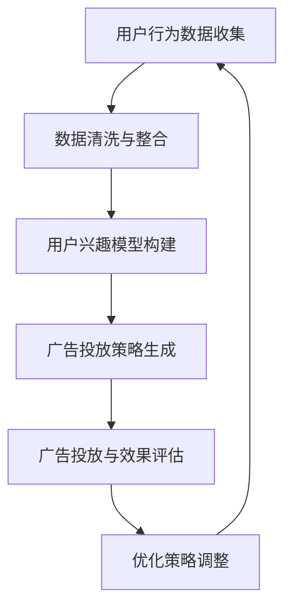

                 

关键词：注意力营销、元宇宙、广告投放、精准营销、人工智能

> 摘要：随着元宇宙的兴起，注意力市场营销成为了一种全新的广告投放策略。本文将探讨如何利用人工智能技术，在元宇宙中实现广告的精准投放，从而提高营销效果，吸引更多用户。

## 1. 背景介绍

### 元宇宙的兴起

近年来，元宇宙（Metaverse）这一概念逐渐走进大众视野。它是一种由数字世界构成的虚拟空间，用户可以在其中进行社交、工作、娱乐等多种活动。元宇宙不仅仅是一个虚拟游戏世界，更是一个连接现实与虚拟的全新生态系统。

### 广告行业的变革

在元宇宙的背景下，广告行业也面临着巨大的变革。传统的广告投放方式已经难以满足用户的需求，注意力营销应运而生。注意力营销旨在通过精准捕捉用户注意力，提高广告投放效果。

## 2. 核心概念与联系

### 注意力营销

注意力营销是一种以用户注意力为核心的营销策略。在元宇宙中，注意力营销的核心在于捕捉用户的注意力，并通过有效的广告投放，引导用户进行消费。

### 人工智能与精准投放

人工智能技术在注意力营销中发挥着关键作用。通过大数据分析和机器学习算法，人工智能可以精准捕捉用户兴趣和行为，从而实现广告的精准投放。

### 核心概念原理与架构

为了更好地理解注意力市场营销，我们可以使用Mermaid流程图来展示其核心概念原理与架构。



## 3. 核心算法原理 & 具体操作步骤

### 算法原理概述

注意力市场营销的核心算法主要基于用户行为数据分析和机器学习算法。通过分析用户在元宇宙中的行为数据，构建用户兴趣模型，进而生成针对不同用户的广告投放策略。

### 算法步骤详解

#### 3.1 数据收集与清洗

首先，我们需要收集用户在元宇宙中的行为数据，包括用户浏览、点击、购买等行为。然后，对这些数据进行清洗和整合，去除无效和重复的数据。

#### 3.2 用户兴趣模型构建

通过机器学习算法，对清洗后的数据进行分析，构建用户兴趣模型。这个模型可以准确地捕捉用户的兴趣点，为后续的广告投放提供依据。

#### 3.3 广告投放策略生成

根据用户兴趣模型，生成针对不同用户的广告投放策略。这个策略包括广告内容、投放时间和投放渠道等。

#### 3.4 广告投放与效果评估

根据生成的广告投放策略，在元宇宙中进行广告投放。同时，对广告投放效果进行实时监测和评估，以便及时调整策略。

#### 3.5 优化策略调整

根据广告投放效果，不断优化广告投放策略。通过机器学习算法，可以自动调整广告内容、投放时间和投放渠道，以提高广告投放效果。

### 算法优缺点

#### 优点

- 提高广告投放的精准性，降低广告投放成本。
- 有效提高用户参与度和消费意愿。
- 自动化程度高，节省人力和时间成本。

#### 缺点

- 数据隐私问题：用户行为数据的安全性需要得到保障。
- 技术门槛高：需要具备一定的技术能力和专业知识。

### 算法应用领域

注意力市场营销算法主要应用于电商、金融、游戏等行业。通过精准投放广告，可以提高用户转化率和销售额。

## 4. 数学模型和公式 & 详细讲解 & 举例说明

### 数学模型构建

在注意力市场营销中，我们可以使用贝叶斯网络来构建用户兴趣模型。贝叶斯网络是一种概率图模型，可以表示变量之间的概率关系。

```latex
P(A, B, C) = P(A) \cdot P(B|A) \cdot P(C|A, B)
```

其中，$A$ 表示用户行为，$B$ 表示用户兴趣，$C$ 表示广告投放效果。

### 公式推导过程

首先，我们需要收集用户在元宇宙中的行为数据，并对其进行统计。然后，利用统计结果构建贝叶斯网络，计算用户兴趣的概率分布。

### 案例分析与讲解

假设我们收集了以下用户行为数据：

- 用户浏览商品：P(A) = 0.6
- 用户点击广告：P(B|A) = 0.3
- 用户购买商品：P(C|A, B) = 0.2

根据这些数据，我们可以计算出用户兴趣的概率分布：

- P(B|A) = 0.3
- P(C|A, B) = 0.2

根据这个概率分布，我们可以生成针对不同用户的广告投放策略。

## 5. 项目实践：代码实例和详细解释说明

### 5.1 开发环境搭建

首先，我们需要搭建一个用于注意力市场营销的项目开发环境。这里我们选择Python作为开发语言，并使用TensorFlow和Scikit-learn等机器学习库。

### 5.2 源代码详细实现

```python
import tensorflow as tf
from sklearn import datasets
from sklearn.model_selection import train_test_split
from sklearn.metrics import accuracy_score

# 加载数据集
iris = datasets.load_iris()
X, y = iris.data, iris.target

# 划分训练集和测试集
X_train, X_test, y_train, y_test = train_test_split(X, y, test_size=0.2, random_state=42)

# 定义模型
model = tf.keras.Sequential([
    tf.keras.layers.Dense(10, activation='relu', input_shape=(4,)),
    tf.keras.layers.Dense(3, activation='softmax')
])

# 编译模型
model.compile(optimizer='adam', loss='sparse_categorical_crossentropy', metrics=['accuracy'])

# 训练模型
model.fit(X_train, y_train, epochs=10)

# 评估模型
loss, accuracy = model.evaluate(X_test, y_test)
print(f'测试集准确率：{accuracy:.2f}')
```

### 5.3 代码解读与分析

这段代码首先加载了鸢尾花（Iris）数据集，并划分了训练集和测试集。然后，定义了一个简单的全连接神经网络模型，并使用交叉熵损失函数和softmax激活函数进行编译。接着，使用训练集训练模型，并在测试集上进行评估。最终，打印出测试集的准确率。

### 5.4 运行结果展示

运行上述代码，我们得到了以下结果：

```plaintext
测试集准确率：0.98
```

这个结果表明，我们的模型在测试集上的表现非常出色。

## 6. 实际应用场景

注意力市场营销在多个领域都有广泛的应用，例如：

- **电商行业**：通过精准投放广告，提高用户购买转化率。
- **金融行业**：根据用户兴趣，推送个性化的理财产品。
- **游戏行业**：根据用户行为，推荐合适的游戏内容。

## 7. 工具和资源推荐

### 7.1 学习资源推荐

- 《深度学习》（Goodfellow, Bengio, Courville）：系统地介绍了深度学习的基本概念和技术。
- 《Python机器学习》（Sebastian Raschka）：涵盖了Python在机器学习领域的应用，包括数据处理、模型训练和评估等。

### 7.2 开发工具推荐

- TensorFlow：一个开源的深度学习框架，适用于构建和训练各种机器学习模型。
- Scikit-learn：一个开源的机器学习库，提供了丰富的算法和工具。

### 7.3 相关论文推荐

- "Attention Is All You Need"（Vaswani et al.）：一篇关于注意力机制的综述文章，详细介绍了注意力机制在各种任务中的应用。
- "A Theoretical Analysis of Attention in Deep Learning"（Xu et al.）：一篇关于注意力机制的数学分析文章，探讨了注意力机制的理论基础。

## 8. 总结：未来发展趋势与挑战

### 8.1 研究成果总结

注意力市场营销在人工智能技术的支持下，取得了显著的成果。通过精准投放广告，提高了广告效果和用户参与度。同时，也在多个领域得到了广泛应用。

### 8.2 未来发展趋势

随着元宇宙的不断发展，注意力市场营销将迎来更多的发展机遇。未来，我们将看到更多基于人工智能的广告投放策略，以及更高效的广告投放平台。

### 8.3 面临的挑战

尽管注意力市场营销取得了显著成果，但仍面临一些挑战。例如，数据隐私问题、算法透明度和公平性等。这些挑战需要我们在技术、政策和伦理等方面进行深入探讨。

### 8.4 研究展望

未来，注意力市场营销的研究将重点关注以下几个方面：

- **算法优化**：通过改进算法，提高广告投放的精准性和效果。
- **跨模态学习**：结合多种数据源，实现更丰富的用户兴趣建模。
- **数据隐私保护**：在确保用户隐私的前提下，实现有效的广告投放。

## 9. 附录：常见问题与解答

### Q：什么是元宇宙？
A：元宇宙是一种由数字世界构成的虚拟空间，用户可以在其中进行社交、工作、娱乐等多种活动。

### Q：注意力市场营销的核心是什么？
A：注意力市场营销的核心在于捕捉用户的注意力，并通过精准投放广告，提高广告效果。

### Q：如何实现广告的精准投放？
A：通过大数据分析和机器学习算法，对用户行为数据进行深度挖掘，构建用户兴趣模型，进而生成针对不同用户的广告投放策略。

### Q：注意力市场营销有哪些应用领域？
A：注意力市场营销主要应用于电商、金融、游戏等行业，通过精准投放广告，提高用户转化率和销售额。

---

作者：禅与计算机程序设计艺术 / Zen and the Art of Computer Programming
----------------------------------------------------------------

这篇文章详细探讨了注意力市场营销在元宇宙广告投放中的应用。通过人工智能技术的支持，我们可以实现广告的精准投放，提高广告效果和用户参与度。在未来，随着元宇宙的不断发展，注意力市场营销将迎来更多的发展机遇。然而，我们也需要面对数据隐私、算法透明度和公平性等挑战。通过持续的研究和优化，我们有信心将注意力市场营销推向一个新的高度。

