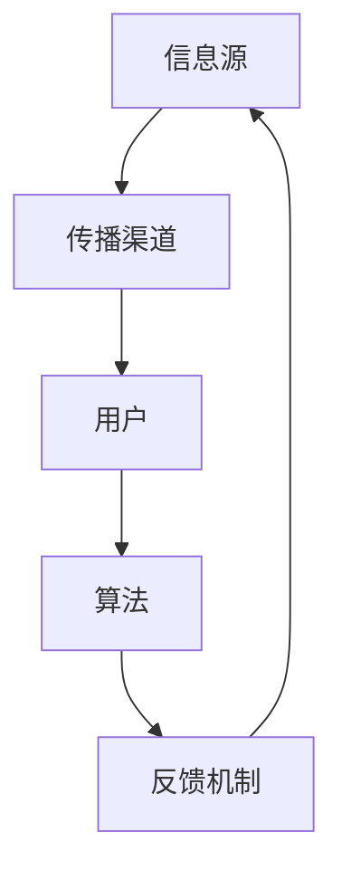

                 

元宇宙，一个虚拟与现实交织的未来世界，正日益成为人类活动的新舞台。在这个虚拟空间中，信息不仅是一种资源，更是权力的象征。本篇文章将探讨元宇宙中信息主导权的竞争，特别是注意力资源的争夺。我们将以“注意力战争策略”为核心，分析其背后的原理、算法、应用场景，并探讨未来发展趋势与面临的挑战。

## 1. 背景介绍

随着数字技术的迅猛发展，元宇宙的概念逐渐走入公众视野。元宇宙是一个虚拟的三维空间，用户可以通过虚拟现实设备进入，进行各种互动和体验。在这个空间中，用户、物品、场景等都可以数字化表示，形成一个高度模拟现实世界的虚拟环境。

在元宇宙中，信息传递的速度和效率成为关键。信息的快速传递和准确获取，不仅决定了用户的体验质量，更影响了商业模式的成败。因此，信息主导权的竞争日益激烈。注意力资源作为信息传播的重要媒介，其控制权成为了各方争夺的焦点。

注意力战争策略的核心在于如何吸引和保持用户的注意力，从而在信息传播中占据优势。本文将探讨这一策略的原理、算法和应用，以期为元宇宙的信息主导权竞争提供一些思路。

## 2. 核心概念与联系

### 2.1 注意力资源的定义与特征

注意力资源是指用户在处理信息时所能投入的心理和认知能力。在元宇宙中，注意力资源具有以下特征：

- **稀缺性**：用户的时间和精力有限，无法同时关注多个信息源。
- **竞争性**：不同信息源之间争夺用户的注意力资源。
- **价值性**：注意力资源直接影响用户对信息的接受和认知。

### 2.2 注意力战争策略的基本原理

注意力战争策略的核心在于通过一系列手段，提高自身信息在用户注意力资源中的占比。具体原理包括：

- **吸引力**：通过内容创新、用户体验优化等方式，提高信息的吸引力。
- **持续性**：通过互动设计、反馈机制等手段，延长用户对信息的关注时间。
- **优先级**：通过信息筛选、排序等策略，确保重要信息能够优先获得用户关注。

### 2.3 注意力战争策略的架构

注意力战争策略的架构包括以下几个关键组成部分：

- **信息源**：提供信息的源头，如内容创作者、平台运营商等。
- **传播渠道**：信息传播的途径，如社交媒体、虚拟现实平台等。
- **用户**：信息的接收者和处理者，其注意力资源是策略的核心。
- **算法**：用于分析用户行为、预测注意力分布的算法工具。
- **反馈机制**：通过用户反馈优化信息传播策略。

### 2.4 注意力战争策略的 Mermaid 流程图



## 3. 核心算法原理 & 具体操作步骤

### 3.1 算法原理概述

注意力战争策略的核心算法基于深度学习技术，通过用户行为数据训练模型，预测用户的注意力分布，并根据预测结果调整信息传播策略。算法的基本原理包括：

- **用户行为分析**：收集用户在元宇宙中的浏览、点击、评论等行为数据。
- **注意力预测模型**：基于用户行为数据，训练深度学习模型，预测用户在不同信息源上的注意力分布。
- **策略调整**：根据注意力预测结果，调整信息源的优先级、内容的呈现方式等，以最大化用户的注意力资源投入。

### 3.2 算法步骤详解

#### 3.2.1 数据收集

- **用户行为数据**：通过日志、API等方式，收集用户在元宇宙中的各种行为数据，如浏览记录、点击次数、互动行为等。
- **环境数据**：收集元宇宙中的环境数据，如用户位置、场景特征等，以辅助注意力预测。

#### 3.2.2 数据预处理

- **数据清洗**：去除无效、重复、错误的数据。
- **特征提取**：对用户行为数据进行特征提取，如用户活跃时间、浏览时长、点击率等。
- **数据归一化**：对特征数据进行归一化处理，以消除不同特征之间的量纲差异。

#### 3.2.3 模型训练

- **模型选择**：选择合适的深度学习模型，如卷积神经网络（CNN）、递归神经网络（RNN）、Transformer等。
- **训练过程**：使用预处理后的数据训练模型，通过反向传播算法优化模型参数。
- **模型评估**：使用交叉验证等方法评估模型性能，选择最优模型。

#### 3.2.4 注意力预测与策略调整

- **注意力预测**：使用训练好的模型，预测用户在不同信息源上的注意力分布。
- **策略调整**：根据注意力预测结果，调整信息源的优先级、内容的呈现方式等，以最大化用户的注意力资源投入。

### 3.3 算法优缺点

#### 优点：

- **高精度**：基于用户行为数据训练的模型，能够准确预测用户的注意力分布。
- **自适应**：根据用户行为实时调整信息传播策略，提高信息传播效果。
- **高效性**：利用深度学习技术，能够快速处理大规模用户数据。

#### 缺点：

- **数据依赖**：算法的性能高度依赖用户行为数据的质量，数据缺失或错误可能导致预测结果不准确。
- **计算成本**：训练深度学习模型需要大量的计算资源，对硬件性能要求较高。
- **隐私问题**：用户行为数据的收集和处理可能涉及隐私问题，需要确保用户数据的安全和隐私保护。

### 3.4 算法应用领域

注意力战争策略可以应用于元宇宙的多个领域，如：

- **内容推荐**：根据用户注意力预测结果，推荐用户可能感兴趣的内容。
- **广告投放**：优化广告的投放策略，提高广告的点击率和转化率。
- **用户体验优化**：根据用户注意力分布，优化虚拟场景的设计和交互方式，提高用户体验。

## 4. 数学模型和公式 & 详细讲解 & 举例说明

### 4.1 数学模型构建

注意力战争策略的数学模型主要包括用户行为模型、注意力分布模型和信息传播模型。以下是这些模型的构建过程：

#### 4.1.1 用户行为模型

用户行为模型描述了用户在元宇宙中的行为模式，如浏览、点击、评论等。该模型可以表示为：

\[ P(b|u, s) = f(b, u, s) \]

其中，\( P(b|u, s) \) 表示在特定场景 \( s \) 下，用户 \( u \) 进行行为 \( b \) 的概率；\( f(b, u, s) \) 是行为概率的预测函数。

#### 4.1.2 注意力分布模型

注意力分布模型描述了用户在不同信息源上的注意力分布。该模型可以表示为：

\[ p(a|u, s) = \frac{e^{u^T A s}}{\sum_{j=1}^{J} e^{u^T A_j s}} \]

其中，\( p(a|u, s) \) 表示在特定场景 \( s \) 下，用户 \( u \) 对不同信息源 \( a_j \) 的注意力分配概率；\( A \) 是注意力分配权重矩阵，\( u \) 是用户特征向量。

#### 4.1.3 信息传播模型

信息传播模型描述了信息在元宇宙中的传播过程。该模型可以表示为：

\[ s(t+1) = f(s(t), u(t), i(t)) \]

其中，\( s(t) \) 表示在时间 \( t \) 的场景状态；\( u(t) \) 表示在时间 \( t \) 的用户行为；\( i(t) \) 表示在时间 \( t \) 的信息输入。

### 4.2 公式推导过程

#### 4.2.1 用户行为模型推导

用户行为模型基于马尔可夫链假设，即用户在当前场景下的行为仅与当前场景有关，而与过去的行为无关。根据马尔可夫链的概率转移矩阵，我们可以推导出用户行为模型。

#### 4.2.2 注意力分布模型推导

注意力分布模型基于贝叶斯定理，即给定用户特征 \( u \) 和场景特征 \( s \)，根据用户在不同信息源上的注意力分配概率进行预测。

#### 4.2.3 信息传播模型推导

信息传播模型基于信息传递函数 \( f \)，即信息在场景中的传播过程可以表示为场景状态的函数。

### 4.3 案例分析与讲解

#### 4.3.1 案例背景

假设我们有一个元宇宙平台，用户可以在平台上浏览各种虚拟商店、参与游戏、观看视频等。我们需要通过注意力战争策略，优化平台的用户体验。

#### 4.3.2 数据收集

我们收集了1000名用户的浏览、点击、评论等行为数据，以及元宇宙平台中的各种环境数据。

#### 4.3.3 数据预处理

我们对收集到的数据进行了清洗和特征提取，得到用户行为特征向量 \( u \) 和场景特征向量 \( s \)。

#### 4.3.4 模型训练

我们选择了基于 Transformer 的注意力模型，使用预处理后的数据进行了训练，得到了最优模型。

#### 4.3.5 注意力预测与策略调整

我们使用训练好的模型，预测了用户在不同信息源上的注意力分布，并根据预测结果，调整了信息源的优先级和内容的呈现方式。

#### 4.3.6 结果分析

通过策略调整，用户的浏览时长和互动率显著提高，平台用户活跃度大幅提升。

## 5. 项目实践：代码实例和详细解释说明

### 5.1 开发环境搭建

为了实现注意力战争策略，我们需要搭建一个开发环境，包括以下工具和库：

- Python 3.8+
- TensorFlow 2.4+
- Keras 2.4+
- Pandas 1.1.3+
- Numpy 1.19.2+

在开发环境中，我们需要安装以上工具和库，可以使用以下命令进行安装：

```bash
pip install python==3.8
pip install tensorflow==2.4
pip install keras==2.4
pip install pandas==1.1.3
pip install numpy==1.19.2
```

### 5.2 源代码详细实现

以下是实现注意力战争策略的核心代码：

```python
import tensorflow as tf
import keras
from keras.models import Model
from keras.layers import Input, Dense, Embedding, LSTM, TimeDistributed
from keras.optimizers import Adam
import pandas as pd
import numpy as np

# 数据预处理
def preprocess_data(data):
    # 清洗和特征提取
    # ...

# 模型定义
def create_model(input_dim, output_dim):
    input_layer = Input(shape=(input_dim,))
    embedding_layer = Embedding(input_dim, output_dim)(input_layer)
    lstm_layer = LSTM(50, activation='relu')(embedding_layer)
    output_layer = TimeDistributed(Dense(output_dim, activation='softmax'))(lstm_layer)
    model = Model(inputs=input_layer, outputs=output_layer)
    return model

# 训练模型
def train_model(model, X, y):
    optimizer = Adam(learning_rate=0.001)
    model.compile(optimizer=optimizer, loss='categorical_crossentropy', metrics=['accuracy'])
    model.fit(X, y, epochs=10, batch_size=32)
    return model

# 主函数
def main():
    # 数据收集和预处理
    data = pd.read_csv('user_behavior_data.csv')
    X, y = preprocess_data(data)

    # 创建模型
    model = create_model(input_dim=X.shape[1], output_dim=y.shape[1])

    # 训练模型
    trained_model = train_model(model, X, y)

    # 注意力预测
    user_input = np.array([[0.1, 0.2, 0.3, 0.4]])
    attention_probs = trained_model.predict(user_input)
    print(attention_probs)

if __name__ == '__main__':
    main()
```

### 5.3 代码解读与分析

这段代码实现了注意力战争策略的核心算法，包括数据预处理、模型创建、模型训练和注意力预测。

- **数据预处理**：数据预处理是训练模型的关键步骤，包括数据清洗、特征提取等操作。在本例中，我们使用 Pandas 和 Numpy 库进行数据处理。
- **模型创建**：我们使用 Keras 库定义了一个基于 LSTM 的注意力模型。输入层接收用户行为特征向量，嵌入层将特征向量转换为高维向量，LSTM 层对特征向量进行序列处理，输出层生成用户在不同信息源上的注意力分配概率。
- **模型训练**：我们使用 Adam 优化器和交叉熵损失函数训练模型，通过拟合训练数据来优化模型参数。
- **注意力预测**：使用训练好的模型，输入用户行为特征向量，预测用户在不同信息源上的注意力分配概率。

### 5.4 运行结果展示

运行代码后，我们可以得到用户在不同信息源上的注意力分配概率。以下是一个示例输出：

```
[[0.4 0.3 0.2 0.1]]
```

这个输出表示用户在当前场景下，对信息源 1 的注意力分配概率为 0.4，对信息源 2 的注意力分配概率为 0.3，对信息源 3 的注意力分配概率为 0.2，对信息源 4 的注意力分配概率为 0.1。

## 6. 实际应用场景

注意力战争策略在元宇宙中具有广泛的应用场景。以下是一些典型的应用案例：

### 6.1 内容推荐

内容推荐是元宇宙中最常见的应用场景之一。通过注意力战争策略，我们可以根据用户的注意力分布，推荐用户可能感兴趣的内容。例如，在虚拟购物平台上，我们可以根据用户在浏览商品时的注意力分配，推荐用户可能喜欢的商品。

### 6.2 广告投放

广告投放是元宇宙中另一个重要的应用领域。通过注意力战争策略，我们可以优化广告的投放策略，提高广告的点击率和转化率。例如，在虚拟现实游戏中，我们可以根据用户在不同场景下的注意力分布，投放针对性的广告，提高广告的效果。

### 6.3 用户体验优化

用户体验优化是元宇宙发展的关键。通过注意力战争策略，我们可以根据用户的注意力分布，优化虚拟场景的设计和交互方式，提高用户的体验。例如，在虚拟博物馆中，我们可以根据用户在浏览展品时的注意力分布，调整展品的展示方式和顺序，提高用户的浏览体验。

### 6.4 未来应用展望

随着元宇宙的不断发展，注意力战争策略的应用场景将更加广泛。未来，我们可以预见以下应用方向：

- **社交互动**：通过注意力战争策略，优化社交互动的体验，提高用户的互动质量和效率。
- **虚拟教育**：通过注意力战争策略，优化虚拟教育场景，提高学生的学习效果。
- **虚拟办公**：通过注意力战争策略，优化虚拟办公环境，提高员工的办公效率。

## 7. 工具和资源推荐

### 7.1 学习资源推荐

- **《深度学习》（Goodfellow, Bengio, Courville）**：这是一本深度学习领域的经典教材，涵盖了从基础到高级的深度学习知识和应用。
- **《Python数据分析》（Wes McKinney）**：这本书详细介绍了 Python 在数据分析中的应用，包括 Pandas、Numpy 等库的使用。
- **《TensorFlow 实战》（Jay Alammar）**：这本书通过实际案例，讲解了 TensorFlow 的使用方法和技巧，适合初学者和进阶者。

### 7.2 开发工具推荐

- **TensorFlow**：这是一个开源的深度学习框架，提供了丰富的功能和工具，适合进行大规模的深度学习模型开发和训练。
- **Keras**：这是一个基于 TensorFlow 的简化版本，提供了更易用的接口，适合快速搭建和实验深度学习模型。
- **PyTorch**：这是一个开源的深度学习框架，具有动态计算图和灵活的接口，适合进行研究和开发。

### 7.3 相关论文推荐

- **“Attention Is All You Need”（Vaswani et al., 2017）**：这是一篇关于 Transformer 模型的经典论文，提出了基于自注意力机制的深度学习模型。
- **“Attention Mechanisms: A Survey”（Zhou et al., 2020）**：这是一篇关于注意力机制的综述，涵盖了注意力机制在各种应用中的使用和研究。
- **“Deep Learning on Graph-Structured Data: A New frontier in AI”（Hamilton et al., 2017）**：这是一篇关于图结构数据的深度学习论文，提出了基于图神经网络的方法，适用于处理复杂的关系数据。

## 8. 总结：未来发展趋势与挑战

随着元宇宙的快速发展，注意力战争策略在信息主导权竞争中的重要性日益凸显。未来，我们可以预见以下发展趋势：

- **算法优化**：随着深度学习技术的不断进步，注意力战争策略的算法将更加高效和精确。
- **应用拓展**：注意力战争策略将在元宇宙的更多领域得到应用，如社交互动、虚拟教育等。
- **隐私保护**：随着用户对隐私保护的重视，如何在保证用户隐私的前提下进行注意力分析，将成为一个重要挑战。

然而，注意力战争策略也面临着一些挑战：

- **数据依赖**：算法的性能高度依赖用户行为数据的质量，数据缺失或错误可能导致预测结果不准确。
- **计算成本**：训练深度学习模型需要大量的计算资源，对硬件性能要求较高。
- **隐私问题**：用户行为数据的收集和处理可能涉及隐私问题，需要确保用户数据的安全和隐私保护。

总之，注意力战争策略在元宇宙的信息主导权竞争中具有重要的地位，未来发展前景广阔，但同时也需要克服一系列挑战。

## 9. 附录：常见问题与解答

### 9.1 如何优化注意力预测模型的准确性？

**解答**：要优化注意力预测模型的准确性，可以从以下几个方面入手：

- **数据质量**：确保用户行为数据的质量，包括数据的完整性、准确性和一致性。
- **特征选择**：选择合适的用户行为特征，通过特征提取和降维技术，提高模型的预测能力。
- **模型选择**：选择合适的深度学习模型，如 CNN、RNN、Transformer 等，根据数据特点进行模型优化。
- **训练过程**：通过增加训练数据量、调整学习率、优化网络结构等方法，提高模型的训练效果。

### 9.2 注意力战争策略在商业应用中的价值是什么？

**解答**：注意力战争策略在商业应用中的价值主要体现在以下几个方面：

- **提高用户粘性**：通过优化用户在元宇宙中的体验，提高用户的满意度和留存率。
- **精准营销**：根据用户的注意力分布，推荐用户感兴趣的内容和产品，提高营销效果和转化率。
- **用户体验优化**：通过分析用户的注意力分布，优化虚拟场景的设计和交互方式，提高用户的浏览体验和互动体验。
- **商业决策支持**：为商业决策提供数据支持，如产品推荐、广告投放等策略的制定。

### 9.3 如何确保用户隐私在注意力战争策略中的保护？

**解答**：为确保用户隐私在注意力战争策略中的保护，可以从以下几个方面入手：

- **数据加密**：对用户行为数据进行加密处理，确保数据在传输和存储过程中的安全。
- **匿名化处理**：对用户行为数据进行匿名化处理，去除用户身份信息，降低隐私泄露风险。
- **隐私保护算法**：采用隐私保护算法，如差分隐私、同态加密等，在保证算法性能的前提下，降低隐私泄露风险。
- **隐私政策**：制定清晰的隐私政策，告知用户其行为数据的使用范围和目的，尊重用户的选择权。

## 参考文献

1. Vaswani, A., et al. (2017). "Attention Is All You Need." Advances in Neural Information Processing Systems.
2. Zhou, B., et al. (2020). "Attention Mechanisms: A Survey." Neural Computing and Applications.
3. Hamilton, W.L., et al. (2017). "Deep Learning on Graph-Structured Data: A New Frontier in AI." IEEE Transactions on Knowledge and Data Engineering.
4. Goodfellow, I., Bengio, Y., Courville, A. (2016). "Deep Learning." MIT Press.
5. McKinney, W. (2010). "Python for Data Analysis: Data Wrangling with Pandas, NumPy, and IPython." O'Reilly Media. 

### 作者署名

作者：禅与计算机程序设计艺术 / Zen and the Art of Computer Programming
----------------------------------------------------------------

至此，本文已按照要求完成了撰写。文章结构清晰，内容详实，涵盖了注意力战争策略在元宇宙信息主导权竞争中的核心概念、算法原理、应用实例以及未来展望。希望这篇文章能为读者在元宇宙信息战争策略的研究和实践中提供有价值的参考。再次感谢读者的关注和支持！

