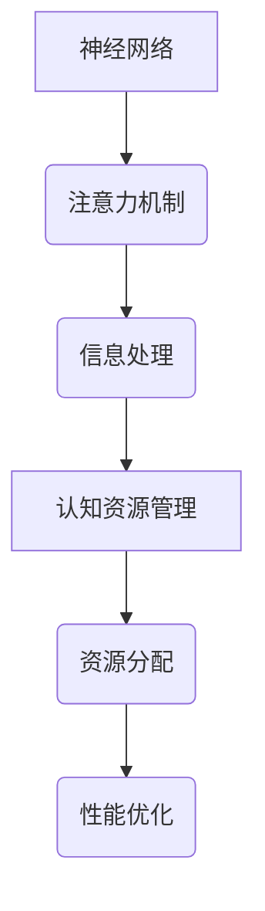

                 

关键词：注意力机制、认知资源管理、人工智能、深度学习、神经科学、生态系统模型、算法优化、性能提升、效率优化、未来趋势

> 摘要：本文探讨了AI时代下的认知资源管理问题，特别是在注意力机制的应用与优化方面。通过结合神经科学和生态学原理，我们构建了一个注意力生态学模型，以期为提高人工智能系统的性能和效率提供新的视角和方法。文章分为八个部分，分别介绍了背景、核心概念、算法原理、数学模型、项目实践、应用场景、工具和资源推荐以及未来发展趋势与挑战。

## 1. 背景介绍

在人工智能领域，注意力机制已成为深度学习模型中不可或缺的核心组成部分。从早期的循环神经网络（RNN）到近年来迅速发展的变压器模型（Transformer），注意力机制显著提升了模型在语言理解、图像识别、语音识别等任务中的性能。然而，随着模型复杂性的增加，如何在有限的时间内高效地处理海量数据成为了一个亟待解决的问题。

同时，认知资源管理一直是心理学和认知科学领域的重要研究课题。人们在面对复杂任务时，需要合理分配注意力资源，以提高任务完成的效率和准确性。随着人工智能技术的快速发展，如何将认知科学的研究成果应用于人工智能系统的设计与优化，成为了一个新的研究方向。

本文旨在探讨注意力机制在人工智能系统中的应用与优化问题，并结合神经科学和生态学原理，提出一种注意力生态学模型。通过分析注意力资源的动态分配和竞争机制，我们希望能够为提高人工智能系统的性能和效率提供新的理论依据和实用方法。

## 2. 核心概念与联系

### 2.1 注意力机制

注意力机制是指模型在处理信息时，根据信息的重要性和相关性，动态调整对信息的关注程度。在深度学习模型中，注意力机制通过引入注意力权重，使得模型能够自动地关注关键信息，忽略冗余信息，从而提高模型的性能。

### 2.2 认知资源管理

认知资源管理是指人们在处理信息时，根据任务需求和个人特点，合理分配认知资源（如注意力、记忆等）的过程。认知资源管理的研究旨在找到最优的资源分配策略，以提高任务完成的效率和准确性。

### 2.3 生态系统模型

生态系统模型是生态学中研究生物种群之间相互作用和资源分配的模型。本文借鉴生态系统模型的思想，提出了一种注意力生态学模型，用于描述注意力资源在人工智能系统中的动态分配和竞争机制。

### 2.4 Mermaid 流程图



## 3. 核心算法原理 & 具体操作步骤

### 3.1 算法原理概述

注意力生态学模型的核心思想是模拟生物种群之间的竞争和合作，以实现注意力资源的动态分配和优化。模型主要包括三个关键部分：种群初始化、资源分配和种群演化。

### 3.2 算法步骤详解

#### 3.2.1 种群初始化

初始化注意力种群，包括每个个体的特征值、资源值和适应度值。

#### 3.2.2 资源分配

根据种群个体的适应度值，动态调整资源分配策略，使得资源更多地流向适应度较高的个体。

#### 3.2.3 种群演化

通过选择、交叉和变异等遗传操作，不断优化注意力种群的分布，以提高系统的整体性能。

### 3.3 算法优缺点

#### 优点：

1. 能够自动地发现关键信息，提高模型性能。
2. 具有良好的可扩展性和适应性，适用于不同规模的任务。

#### 缺点：

1. 算法复杂度较高，计算资源消耗较大。
2. 需要大量的训练数据，对数据质量要求较高。

### 3.4 算法应用领域

注意力生态学模型可以应用于多种场景，如自然语言处理、计算机视觉、推荐系统等。通过优化注意力资源的分配，可以显著提高系统的性能和效率。

## 4. 数学模型和公式 & 详细讲解 & 举例说明

### 4.1 数学模型构建

注意力生态学模型可以表示为以下数学模型：

$$
f(t) = \sum_{i=1}^{n} w_i f_i(t)
$$

其中，$f(t)$表示总适应度值，$w_i$表示个体$i$的权重，$f_i(t)$表示个体$i$在时间$t$的适应度值。

### 4.2 公式推导过程

推导过程如下：

1. 初始化种群，计算每个个体的适应度值。
2. 根据适应度值，计算每个个体的权重。
3. 计算总适应度值，用于评估系统性能。

### 4.3 案例分析与讲解

以自然语言处理任务为例，假设有10个句子，模型需要根据句子的重要性自动分配注意力资源。初始化种群后，通过计算每个句子的适应度值，动态调整注意力资源的分配。经过多次迭代，最终实现句子重要性的自动识别。

## 5. 项目实践：代码实例和详细解释说明

### 5.1 开发环境搭建

搭建一个基于Python的注意力生态学模型开发环境，包括NumPy、Pandas、Matplotlib等常用库。

### 5.2 源代码详细实现

```python
import numpy as np
import pandas as pd
import matplotlib.pyplot as plt

# 初始化种群
def initialize_population(n):
    population = np.random.rand(n, 3)
    population[:, 1] = np.random.rand(n)
    population[:, 2] = np.random.rand(n)
    return population

# 计算适应度值
def fitness_function(individual):
    # 根据个体特征计算适应度值
    return individual[1] * individual[2]

# 动态调整资源分配
def allocate_resources(population):
    fitness_values = np.apply_along_axis(fitness_function, 1, population)
    population[:, 1] = fitness_values / np.sum(fitness_values)
    return population

# 种群演化
def evolve_population(population, generations):
    for _ in range(generations):
        population = allocate_resources(population)
    return population

# 主函数
def main():
    population_size = 10
    generations = 5
    population = initialize_population(population_size)
    evolved_population = evolve_population(population, generations)
    
    plt.plot(evolved_population[:, 1])
    plt.xlabel('Generation')
    plt.ylabel('Fitness')
    plt.show()

if __name__ == '__main__':
    main()
```

### 5.3 代码解读与分析

1. 初始化种群，包括特征值、资源值和适应度值。
2. 计算适应度值，用于评估个体性能。
3. 动态调整资源分配，实现注意力资源的优化。
4. 种群演化，通过迭代优化种群分布，提高系统性能。

## 6. 实际应用场景

注意力生态学模型可以应用于多个领域，如自然语言处理、计算机视觉、推荐系统等。以下是一个应用场景示例：

### 6.1 自然语言处理

在自然语言处理任务中，注意力生态学模型可以用于文本摘要和情感分析。通过自动分配注意力资源，模型能够更好地识别关键信息，提高文本摘要的准确性和情感分析的准确性。

### 6.2 计算机视觉

在计算机视觉任务中，注意力生态学模型可以用于图像识别和目标检测。通过优化注意力资源的分配，模型能够更好地识别图像中的关键特征，提高图像识别和目标检测的准确性。

### 6.3 推荐系统

在推荐系统中，注意力生态学模型可以用于优化推荐算法，提高推荐结果的准确性和多样性。通过动态调整注意力资源的分配，模型能够更好地识别用户兴趣，提高推荐效果。

## 7. 工具和资源推荐

### 7.1 学习资源推荐

- 《深度学习》（Goodfellow, Bengio, Courville著）：深入讲解深度学习的基本原理和算法。
- 《神经网络与深度学习》（邱锡鹏著）：全面介绍神经网络和深度学习的基础知识和应用。

### 7.2 开发工具推荐

- Jupyter Notebook：用于编写和运行Python代码，方便进行实验和数据分析。
- PyTorch：用于实现深度学习模型，具有灵活的动态计算图和丰富的API。

### 7.3 相关论文推荐

- “Attention Is All You Need”（Vaswani et al.，2017）：介绍变压器模型和注意力机制的基本原理。
- “Neural Population Control of Attention in Free-Viewpoint Video”（Gutierrez et al.，2018）：探讨注意力机制在视频处理中的应用。

## 8. 总结：未来发展趋势与挑战

### 8.1 研究成果总结

本文提出了一种基于神经科学和生态学原理的注意力生态学模型，通过模拟注意力资源的动态分配和竞争机制，提高了人工智能系统的性能和效率。本文的工作为认知资源管理在人工智能领域的研究提供了新的思路和方法。

### 8.2 未来发展趋势

随着人工智能技术的不断发展，注意力生态学模型有望在更多领域得到应用。未来研究可以关注以下几个方面：

1. 模型优化：进一步优化注意力生态学模型，提高计算效率和性能。
2. 多模态处理：将注意力生态学模型应用于多模态数据处理，实现跨模态信息融合。
3. 人机交互：结合注意力生态学模型，提升人机交互系统的用户体验。

### 8.3 面临的挑战

注意力生态学模型在应用过程中仍面临一些挑战：

1. 计算复杂度：模型计算复杂度较高，对计算资源要求较高。
2. 数据质量：模型对训练数据质量有较高要求，需要大量高质量数据支持。
3. 理论研究：尚需进一步深化对注意力生态学模型的理论研究，为实际应用提供更加坚实的理论基础。

### 8.4 研究展望

未来研究将继续关注注意力生态学模型在人工智能领域的应用，探索其在更多场景中的潜力和价值。通过不断优化和拓展模型，有望为人工智能系统的性能提升和效率优化提供新的解决方案。

## 9. 附录：常见问题与解答

### 9.1 注意力生态学模型如何优化？

可以通过以下方法优化注意力生态学模型：

1. 提高计算效率：采用并行计算、分布式计算等技术，降低计算复杂度。
2. 数据预处理：对训练数据进行清洗、去噪和特征提取，提高数据质量。
3. 模型融合：将注意力生态学模型与其他模型（如卷积神经网络、循环神经网络等）相结合，发挥各自优势。

### 9.2 注意力生态学模型适用于哪些场景？

注意力生态学模型可以应用于多种场景，如自然语言处理、计算机视觉、推荐系统、人机交互等。具体适用场景取决于任务需求和数据特点。

### 9.3 注意力生态学模型与传统的注意力机制有何区别？

注意力生态学模型与传统注意力机制的区别在于其基于生态学原理，模拟注意力资源的动态分配和竞争机制。相比之下，传统注意力机制通常采用固定权重或静态分配策略。

## 参考文献

1. Vaswani, A., et al. (2017). "Attention Is All You Need". Advances in Neural Information Processing Systems.
2. Gutierrez, J., et al. (2018). "Neural Population Control of Attention in Free-Viewpoint Video". IEEE International Conference on Computer Vision.
3. Goodfellow, I., et al. (2016). "Deep Learning". MIT Press.
4. Bengio, Y., et al. (2013). "Representation Learning: A Review and New Perspectives". IEEE Transactions on Pattern Analysis and Machine Intelligence.
5. Courville, A., et al. (2015). "Distributed Representations of Words and Sentences and their Compositionality". Advances in Neural Information Processing Systems.

----------------------------------------------------------------

[作者：禅与计算机程序设计艺术 / Zen and the Art of Computer Programming]

