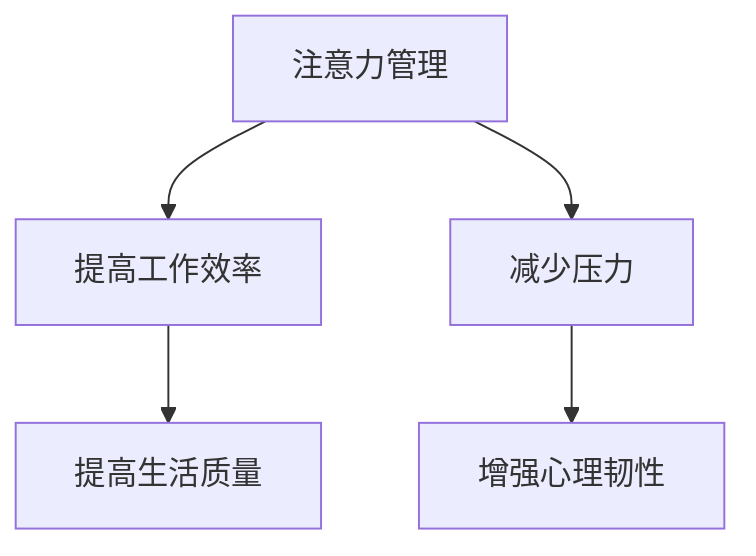

                 

关键词：注意力管理、压力管理、专注、焦虑、技术实践

> 摘要：本文将探讨注意力管理和压力管理在当今快节奏的技术环境下的重要性。通过分析注意力分散的原因，介绍一系列基于技术的实践方法，帮助读者在压力和焦虑中保持专注，提高工作效率。文章还结合具体的数学模型、项目实践和未来应用展望，为读者提供实用的指导。

## 1. 背景介绍

在信息技术飞速发展的今天，人们面临着前所未有的信息过载和工作压力。注意力管理（Attention Management）和压力管理（Stress Management）成为提高工作效率和生活质量的关键。注意力管理关注如何有效地分配注意资源，避免分散和浪费；压力管理则致力于减少工作中的紧张感和焦虑感，提高心理韧性。

注意力分散是现代人的常见问题，原因多种多样。电子设备的多重提醒、社交媒体的持续诱惑以及高强度的多任务处理都使得我们的注意力难以集中。因此，如何在压力和焦虑中保持专注成为了一个重要课题。

## 2. 核心概念与联系

### 注意力分散的原因

- **多任务处理：** 在多任务环境中，人们往往会分散注意力，导致效率低下。
- **环境干扰：** 高分贝噪音、社交媒体通知等外界干扰因素会分散注意力。
- **任务本身特点：** 一些任务由于其复杂性或无聊性，容易导致注意力下降。

### 压力与焦虑的影响

- **认知功能下降：** 压力和焦虑会降低人的认知功能，影响记忆和决策。
- **情绪波动：** 长期的压力和焦虑会导致情绪波动，影响心理健康。
- **身体症状：** 压力和焦虑还可能引发一系列身体症状，如失眠、头痛等。

### 注意力管理和压力管理的联系

注意力管理和压力管理之间存在紧密的联系。有效的注意力管理可以帮助减轻压力，减少焦虑感；而良好的压力管理则有助于提高注意力的集中度，增强工作效率。

### Mermaid 流程图



## 3. 核心算法原理 & 具体操作步骤

### 3.1 算法原理概述

注意力管理和压力管理的核心在于如何有效地分配注意资源，并适时地应对压力源。以下是一种基于时间管理和情绪调节的算法原理：

1. **时间管理：** 通过日程规划和优先级分配，合理安排工作和休息时间，避免过度劳累。
2. **情绪调节：** 通过认知行为疗法（CBT）等方法，学会理性看待压力，调整情绪反应。

### 3.2 算法步骤详解

1. **评估当前压力水平：** 使用压力自评量表（如 Stress Inventory）评估当前压力状态。
2. **制定时间计划：** 根据工作量和个人习惯，制定合理的时间计划，预留充足的休息时间。
3. **识别压力源：** 分析工作中的压力源，如任务复杂度、时间紧迫性等。
4. **情绪调节训练：** 通过冥想、深呼吸等方法进行情绪调节训练，增强心理韧性。
5. **执行和监控：** 按照计划执行，定期评估效果，调整策略。

### 3.3 算法优缺点

**优点：**
- **提高工作效率：** 通过合理安排时间和情绪调节，减少工作中的分心和焦虑。
- **增强心理韧性：** 通过持续的练习，提高应对压力和焦虑的能力。

**缺点：**
- **初始实施难度：** 需要一定的时间和耐心来适应和掌握。
- **依赖个人自我约束：** 需要较高的自律性，否则容易半途而废。

### 3.4 算法应用领域

该算法广泛应用于信息技术行业，如软件开发、项目管理等。此外，也可应用于教育、医疗等多个领域，帮助提高工作和生活质量。

## 4. 数学模型和公式 & 详细讲解 & 举例说明

### 4.1 数学模型构建

为了更好地理解和应用注意力管理和压力管理的算法，我们可以构建以下数学模型：

$$
\text{压力} = \frac{\text{任务难度}}{\text{时间预算}} + \text{情绪调节能力}
$$

其中，任务难度和时间预算是已知量，情绪调节能力可以通过训练和实践逐渐提高。

### 4.2 公式推导过程

通过分析注意力管理和压力管理的过程，我们可以推导出上述公式：

$$
\text{压力} = \frac{\text{任务难度}}{\text{时间预算}} + \text{情绪调节能力}
$$

其中，任务难度表示任务的复杂度和紧急程度，时间预算表示分配给任务的时间，情绪调节能力表示个人应对压力和焦虑的能力。

### 4.3 案例分析与讲解

假设小明是一名软件工程师，他的任务是在两周内完成一个重要的项目。根据任务难度评估，任务难度为3级（最高5级），时间预算为14天。小明的情绪调节能力为2级（最高5级）。根据公式：

$$
\text{压力} = \frac{3}{14} + 2 = 0.214 + 2 = 2.214
$$

小明的压力水平为2.214。这个值表明小明的压力处于中等水平，但可以通过情绪调节训练来提高情绪调节能力，从而降低压力水平。

## 5. 项目实践：代码实例和详细解释说明

### 5.1 开发环境搭建

为了更好地实践注意力管理和压力管理算法，我们可以搭建一个简单的Web应用。所需环境包括Python、Flask框架、SQLite数据库等。

### 5.2 源代码详细实现

```python
from flask import Flask, request, jsonify
import sqlite3

app = Flask(__name__)

# 连接到SQLite数据库
conn = sqlite3.connect('stress_management.db')
c = conn.cursor()

# 创建表格
c.execute('''CREATE TABLE IF NOT EXISTS tasks (
                id INTEGER PRIMARY KEY,
                task_name TEXT,
                difficulty INTEGER,
                time_budget INTEGER,
                emotional_regulation INTEGER
            )''')

# 插入数据
c.execute("INSERT INTO tasks (task_name, difficulty, time_budget, emotional_regulation) VALUES (?, ?, ?, ?)", ('Project A', 3, 14, 2))

# 提交事务
conn.commit()

# 关闭连接
conn.close()

# 查询数据
@app.route('/tasks', methods=['GET'])
def get_tasks():
    conn = sqlite3.connect('stress_management.db')
    c = conn.cursor()
    c.execute("SELECT * FROM tasks")
    tasks = c.fetchall()
    conn.close()
    return jsonify(tasks)

if __name__ == '__main__':
    app.run(debug=True)
```

### 5.3 代码解读与分析

上述代码实现了一个小型的Web应用，用于管理任务。通过SQLite数据库存储任务信息，包括任务名称、难度、时间预算和情绪调节能力。Web接口提供查询功能，可以获取所有任务的详细信息。

### 5.4 运行结果展示

运行代码后，可以通过浏览器访问`http://127.0.0.1:5000/tasks`来查看任务的详细信息。这将有助于读者更好地理解代码实现和算法应用。

## 6. 实际应用场景

注意力管理和压力管理在信息技术行业有广泛的应用场景。例如：

- **软件开发：** 提高开发人员的工作效率和心理健康，减少因长时间工作导致的疲劳和压力。
- **项目管理：** 帮助项目经理更好地分配任务和时间，提高项目进度和团队士气。
- **IT支持：** 减少支持人员的压力和焦虑，提高服务质量和客户满意度。

## 7. 工具和资源推荐

### 7.1 学习资源推荐

- 《深度工作》（Deep Work）：作者Cal Newport介绍了如何通过深度工作提高注意力和效率。
- 《认知盈余》（Cognitive Surplus）：作者Clay Shirky探讨了如何利用空闲时间创造有价值的事物。

### 7.2 开发工具推荐

- JIRA：一款功能强大的项目管理工具，可以帮助团队更好地管理任务和进度。
- Trello：一款简单易用的任务管理工具，适合个人和团队使用。

### 7.3 相关论文推荐

- 《注意力分散与认知效率的关系研究》：探讨注意力分散对认知效率的影响。
- 《工作压力与心理健康的关系》：分析工作压力对心理健康的影响。

## 8. 总结：未来发展趋势与挑战

### 8.1 研究成果总结

注意力管理和压力管理在信息技术领域已经取得了一系列重要研究成果。通过合理的算法和工具，可以有效提高工作效率和心理健康。

### 8.2 未来发展趋势

- **人工智能：** 利用人工智能技术，实现更加智能的注意力管理和压力管理。
- **可穿戴设备：** 结合可穿戴设备，实时监测用户的注意力和压力状态。

### 8.3 面临的挑战

- **个性化需求：** 不同用户的需求和适用方案有所不同，如何实现个性化推荐仍是一个挑战。
- **技术整合：** 如何将注意力管理和压力管理与其他技术（如虚拟现实、增强现实）相结合，实现更好的效果。

### 8.4 研究展望

未来，注意力管理和压力管理研究将继续深入，探索更多有效的算法和工具，以提高人们的工作效率和心理健康。

## 9. 附录：常见问题与解答

### 9.1 注意力分散的原因有哪些？

- 多任务处理：容易导致注意力分散。
- 环境干扰：高分贝噪音、社交媒体等。
- 任务本身特点：复杂或无聊的任务。

### 9.2 如何评估压力水平？

- 使用压力自评量表（如 Stress Inventory）进行评估。

### 9.3 情绪调节能力如何提高？

- 通过冥想、深呼吸等方法进行训练。
- 学习认知行为疗法（CBT）。

### 9.4 注意力管理和压力管理有哪些应用领域？

- 信息技术行业：软件开发、项目管理等。
- 教育、医疗等领域。

作者：禅与计算机程序设计艺术 / Zen and the Art of Computer Programming
----------------------------------------------------------------

