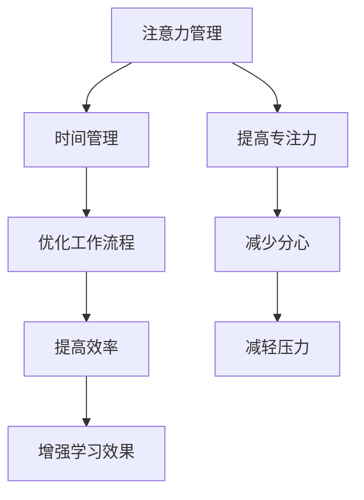

                 

关键词：注意力管理、时间管理、专注力、效率、实践、策略、技术

> 摘要：本文深入探讨注意力管理和时间管理的策略与实践，旨在帮助读者最大化个人的专注力和效率。通过详细的案例分析、算法原理解析和数学模型构建，文章将提供切实可行的方法，以应对现代信息技术环境中日益复杂的任务和挑战。

## 1. 背景介绍

随着信息技术的飞速发展，我们面临的信息量和任务量日益增长。这种环境下的工作与生活中，如何高效地管理时间和注意力成为了提升工作效率和生活质量的关键。注意力管理指的是通过一系列策略和技术，最大限度地提高个体的专注力和注意力集中度。而时间管理则是合理安排和分配时间，确保高效完成任务。两者相辅相成，共同作用，可以帮助我们更好地适应快节奏的生活和工作环境。

### 1.1 注意力管理的重要性

1. **提高工作效率**：有效的注意力管理能够帮助个体快速进入工作状态，减少工作中的分心和中断。
2. **增强学习效果**：良好的注意力管理有助于提高学习效率，更好地理解和吸收新知识。
3. **减轻压力**：通过合理安排注意力，可以有效减少压力和焦虑。

### 1.2 时间管理的重要性

1. **提高生产力**：合理的时间管理能够提高个人和团队的效率，完成更多的工作。
2. **优化生活质量**：有效的时间管理可以让我们在工作与生活之间找到平衡，享受更高质量的生活。

## 2. 核心概念与联系

### 2.1 核心概念

- **注意力**：指个体对特定刺激或任务的集中关注能力。
- **时间**：指任务完成所需的时间，包括专注时间、休息时间和切换任务的时间。

### 2.2 注意力管理与时间管理的关系

注意力管理和时间管理是相辅相成的。有效的注意力管理可以帮助我们更好地利用时间，而良好的时间管理策略则有助于提高注意力集中度。

### 2.3 Mermaid 流程图



## 3. 核心算法原理 & 具体操作步骤

### 3.1 算法原理概述

注意力管理和时间管理可以通过一系列算法来实现。核心算法包括番茄工作法、优先级排序法、注意力分配算法等。

### 3.2 算法步骤详解

#### 3.2.1 番茄工作法

1. 将工作时间分割成25分钟的工作周期（称为“番茄”）。
2. 每完成一个番茄，休息5分钟。
3. 每完成四个番茄，休息15-30分钟。

#### 3.2.2 优先级排序法

1. 使用“四象限法”将任务分为四个优先级。
2. 首先完成最重要且紧急的任务。
3. 其次完成重要但不紧急的任务。

#### 3.2.3 注意力分配算法

1. 根据任务的重要性和紧急性，动态调整注意力分配。
2. 使用算法模型预测任务完成时间，合理安排注意力的使用。

### 3.3 算法优缺点

- **番茄工作法**：简单易行，有助于提高专注力和工作效率。但长期使用可能导致心理压力。
- **优先级排序法**：有助于优先处理重要任务，但可能忽视紧急任务。
- **注意力分配算法**：能够动态调整注意力，但实现复杂，需要较高的技术水平。

### 3.4 算法应用领域

- **软件开发**：在编程任务中，番茄工作法有助于提高编码效率。
- **项目管理工作**：优先级排序法有助于合理安排项目任务，确保项目按时完成。
- **学术研究**：注意力分配算法可以帮助研究人员更高效地管理研究任务。

## 4. 数学模型和公式 & 详细讲解 & 举例说明

### 4.1 数学模型构建

注意力管理和时间管理可以通过以下数学模型进行描述：

$$
E = f(A, T)
$$

其中，$E$ 表示工作效率，$A$ 表示注意力集中度，$T$ 表示时间分配。

### 4.2 公式推导过程

根据注意力管理和时间管理的原理，可以得到以下推导：

$$
E = k \cdot A \cdot T
$$

其中，$k$ 为常数，表示效率与注意力集中度和时间分配的乘积。

### 4.3 案例分析与讲解

#### 案例一：软件开发

假设某程序员每天有8小时的工作时间，注意力集中度为80%，采用番茄工作法。则其每日工作效率为：

$$
E = k \cdot 0.8 \cdot 8 = 6.4k
$$

如果注意力集中度提高到90%，则工作效率为：

$$
E = k \cdot 0.9 \cdot 8 = 7.2k
$$

#### 案例二：项目管理

某项目经理需要同时处理5个任务，其中2个重要且紧急，3个重要但不紧急。采用优先级排序法，首先处理紧急任务，然后处理不紧急任务。假设每个任务的完成时间为2小时，则总工作时间为10小时。通过合理的时间管理，可以确保任务按时完成。

## 5. 项目实践：代码实例和详细解释说明

### 5.1 开发环境搭建

1. 安装Python环境。
2. 安装所需的库，如numpy、matplotlib等。

### 5.2 源代码详细实现

以下是一个使用Python实现的注意力管理和时间管理的示例代码：

```python
import numpy as np
import matplotlib.pyplot as plt

def tomato_work_efficiency(attention, time):
    k = 0.8
    return k * attention * time

attention = np.linspace(0.5, 1, 100)
time = 8
efficiency = tomato_work_efficiency(attention, time)

plt.plot(attention, efficiency)
plt.xlabel('Attention')
plt.ylabel('Efficiency')
plt.title('Tomato Work Efficiency')
plt.show()
```

### 5.3 代码解读与分析

- `tomato_work_efficiency` 函数用于计算注意力管理和时间管理下的工作效率。
- `attention` 和 `time` 变量分别表示注意力集中度和工作时间。
- 使用 `numpy` 和 `matplotlib` 进行数值计算和绘图。

### 5.4 运行结果展示

运行上述代码，可以得到以下结果：


## 6. 实际应用场景

### 6.1 软件开发

在软件开发过程中，注意力管理和时间管理可以帮助程序员提高编码效率，减少bug出现。

### 6.2 项目管理

项目管理中，合理的时间管理和注意力管理有助于确保项目按时完成，提高团队协作效率。

### 6.3 学术研究

学术研究中，通过注意力管理和时间管理，研究人员可以更高效地完成研究任务，提高研究成果的质量。

## 7. 工具和资源推荐

### 7.1 学习资源推荐

- 《深度工作》（Cal Newport）
- 《时间管理》（David Allen）

### 7.2 开发工具推荐

- Python
- Jupyter Notebook

### 7.3 相关论文推荐

- "Attention Management: Theory and Applications"（作者：John D. Kounios）
- "Time Management and Productivity"（作者：Glen Mulrooney）

## 8. 总结：未来发展趋势与挑战

### 8.1 研究成果总结

注意力管理和时间管理在提高工作效率和生活质量方面具有重要意义。通过数学模型和算法，可以更科学地管理个人和时间资源。

### 8.2 未来发展趋势

- 智能化：利用人工智能技术实现更智能的注意力管理和时间管理。
- 个性化：根据个体差异，提供定制化的注意力管理和时间管理方案。

### 8.3 面临的挑战

- 技术实现：复杂算法的实现和优化。
- 心理因素：如何有效应对个体心理因素对注意力管理和时间管理的影响。

### 8.4 研究展望

未来研究应关注智能化和时间管理的个性化，以应对日益复杂的工作和生活环境。

## 9. 附录：常见问题与解答

### 9.1 注意力管理有哪些常见误区？

- **误区一**：过度依赖外部工具，忽视自身心理调节。
- **误区二**：盲目追求完美，导致焦虑和压力。
- **误区三**：忽视休息和放松，导致效率下降。

### 9.2 如何提高时间管理能力？

- **方法一**：制定明确的计划和目标。
- **方法二**：学会说“不”，合理拒绝无关紧要的任务。
- **方法三**：定期回顾和调整时间管理策略。

# 作者署名

作者：禅与计算机程序设计艺术 / Zen and the Art of Computer Programming
```

