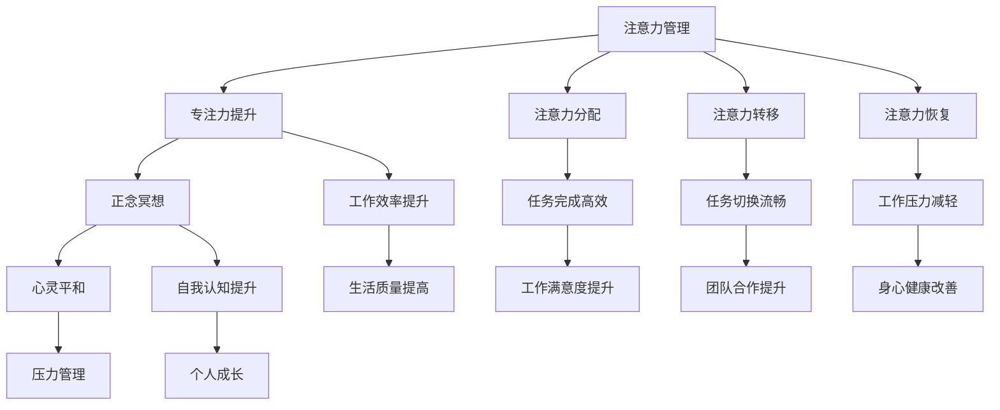

                 

关键词：注意力管理、正念冥想、内省、专注力、心灵平和、IT专业人士

> 摘要：本文探讨了注意力管理与正念冥想在提高IT专业人士专注力和心灵平和方面的应用。通过内省，IT专业人士可以更好地掌控自己的注意力，提高工作效率，减轻工作压力，并实现个人的心灵成长。本文将介绍正念冥想的原理和实践方法，并结合实际案例，展示如何将注意力管理与正念冥想应用于IT工作中。

## 1. 背景介绍

在信息爆炸的时代，IT专业人士面临着巨大的工作压力和高度复杂的工作环境。长时间的工作、频繁的任务切换、快节奏的生活节奏，使得他们的注意力分散，工作效率下降，甚至产生焦虑和疲劳。如何有效地管理注意力，提高专注力，成为IT专业人士面临的重要问题。同时，心灵平和也是IT专业人士追求的重要目标，它有助于提高生活质量，实现身心健康。

注意力管理和正念冥想提供了一种有效的方法来应对这些问题。注意力管理是通过培养自我意识，调整注意力的分配和集中，来提高专注力和工作效率。正念冥想则是一种通过专注呼吸、内省和意识扩展来达到心灵平和的方法。本文将结合两者，探讨如何通过内省增强专注力和心灵平和，为IT专业人士提供实用的方法和建议。

## 2. 核心概念与联系

### 2.1 注意力管理

注意力管理是指通过自我控制和调节，合理分配注意力资源，以实现高效工作。它涉及到以下几个核心概念：

- **注意力集中**：指将注意力集中在一项任务上，避免分心和干扰。
- **注意力分配**：指在不同任务之间合理分配注意力，以实现工作的高效完成。
- **注意力转移**：指在有需要时，将注意力从一个任务转移到另一个任务。
- **注意力恢复**：指在长时间工作后，通过休息和放松来恢复注意力的过程。

### 2.2 正念冥想

正念冥想是一种通过专注呼吸、身体扫描和内省来达到心灵平和的方法。它的核心概念包括：

- **专注呼吸**：通过专注于呼吸，让思维和情绪回归当下，减轻焦虑和压力。
- **身体扫描**：通过感受身体的不同部位，提高对身体和情绪的觉察。
- **内省**：通过反思和自我观察，了解自己的思维模式和行为习惯，实现自我成长。

### 2.3 注意力管理与正念冥想的关系

注意力管理和正念冥想有着密切的联系。正念冥想可以增强注意力管理的能力，帮助IT专业人士更好地集中注意力，减少分心和干扰。同时，通过内省，可以让他们更清楚地了解自己的思维和行为模式，从而更好地调整注意力的分配和集中。以下是注意力管理与正念冥想关系的 Mermaid 流程图：



## 3. 核心算法原理 & 具体操作步骤

### 3.1 算法原理概述

注意力管理与正念冥想的核心算法原理可以概括为以下几点：

- **自我意识**：通过自我观察和反思，了解自己的注意力模式和思维习惯。
- **注意力调节**：通过自我控制和调节，调整注意力的分配和集中。
- **呼吸专注**：通过专注于呼吸，实现身心放松和注意力集中。
- **内省**：通过反思和自我观察，了解自己的思维和行为模式，实现自我成长。

### 3.2 算法步骤详解

#### 3.2.1 自我意识培养

自我意识的培养是注意力管理和正念冥想的基础。以下是具体的步骤：

1. **观察自己的思维**：每天花几分钟时间，静静地坐下来，观察自己的思维。不要试图控制或改变它们，只是观察它们来和去。
2. **记录自己的情绪**：每天记录自己的情绪变化，了解自己在不同情境下的情绪状态。
3. **反思自己的行为**：在日常生活中，反思自己的行为和决策，了解自己的行为模式。

#### 3.2.2 注意力调节

注意力调节是提高专注力的关键。以下是具体的步骤：

1. **设定目标**：为自己设定明确的目标，明确自己要集中注意力的任务。
2. **时间管理**：合理安排工作时间，避免长时间连续工作，确保有足够的休息和恢复时间。
3. **避免干扰**：在工作时，尽量避免干扰，如关闭社交媒体通知，将手机调至静音。
4. **注意力转移**：在有需要时，将注意力从一个任务转移到另一个任务，提高任务的完成效率。

#### 3.2.3 呼吸专注

呼吸专注是实现身心放松和注意力集中的有效方法。以下是具体的步骤：

1. **专注于呼吸**：坐直或坐姿舒适，将注意力集中在呼吸上。感受每一次呼吸的进出，感受胸部的起伏。
2. **呼吸节奏**：尝试调整呼吸节奏，使其均匀而缓慢。
3. **持续练习**：每天花几分钟时间进行呼吸专注练习，逐渐延长练习时间。

#### 3.2.4 内省

内省是了解自己思维和行为模式，实现自我成长的关键。以下是具体的步骤：

1. **反思**：在每天结束时，反思自己的行为和决策，了解自己的优点和不足。
2. **记录**：将反思的内容记录下来，以便日后回顾和改进。
3. **行动计划**：根据反思的结果，制定改进计划，并付诸实践。

### 3.3 算法优缺点

#### 优点

- **提高专注力**：通过注意力调节和呼吸专注，可以显著提高专注力，提高工作效率。
- **减轻压力**：通过内省和呼吸专注，可以减轻工作压力，实现身心健康。
- **自我成长**：通过自我意识和内省，可以了解自己的思维和行为模式，实现个人成长。

#### 缺点

- **需要长期坚持**：注意力管理和正念冥想需要长期坚持，不能一蹴而就。
- **适应性**：对于一些习惯性分心的IT专业人士，可能需要更长的时间来适应。

### 3.4 算法应用领域

注意力管理和正念冥想可以广泛应用于IT行业的各个方面，包括软件开发、项目管理、数据分析等。以下是具体的应用领域：

- **软件开发**：通过注意力管理，可以提高开发效率，减少bug的产生。通过正念冥想，可以减轻开发过程中的压力，提高工作满意度。
- **项目管理**：通过注意力管理，可以提高项目管理者的专注力，确保项目按时完成。通过正念冥想，可以减轻项目管理者的压力，提高团队协作效率。
- **数据分析**：通过注意力管理，可以提高数据分析的准确性，减少错误。通过正念冥想，可以减轻数据分析过程中的焦虑和疲劳，提高数据分析的效率。

## 4. 数学模型和公式 & 详细讲解 & 举例说明

### 4.1 数学模型构建

注意力管理和正念冥想的核心在于如何调节和控制注意力。我们可以使用一个简单的数学模型来描述这一过程。假设：

- \( A \) 表示注意力的总量。
- \( C \) 表示注意力的集中度。
- \( D \) 表示注意力的分散度。
- \( P \) 表示正念冥想对注意力的调节效果。

则数学模型可以表示为：

\[ A = C \times (1 - D) + P \]

其中，\( C \) 和 \( D \) 可以通过自我观察和调节来调整，\( P \) 则是正念冥想的效果。

### 4.2 公式推导过程

假设：

- \( C \) 是一个关于时间 \( t \) 的函数，表示注意力的集中度。
- \( D \) 是一个关于时间 \( t \) 的函数，表示注意力的分散度。
- \( P \) 是一个常数，表示正念冥想的效果。

则注意力 \( A \) 可以表示为：

\[ A(t) = C(t) \times (1 - D(t)) + P \]

为了简化问题，我们可以假设 \( C(t) \) 和 \( D(t) \) 都是时间 \( t \) 的线性函数。则有：

\[ C(t) = C_0 + m \times t \]
\[ D(t) = D_0 + n \times t \]

其中，\( C_0 \) 和 \( D_0 \) 分别表示初始的集中度和分散度，\( m \) 和 \( n \) 分别表示集中度和分散度的变化率。

则注意力 \( A(t) \) 可以表示为：

\[ A(t) = (C_0 + m \times t) \times (1 - D_0 - n \times t) + P \]

简化后得到：

\[ A(t) = C_0 - C_0 \times D_0 + m \times t - m \times n \times t - D_0 \times n \times t + P \]

\[ A(t) = (C_0 - D_0 \times n) + m \times t - m \times n \times t + P \]

### 4.3 案例分析与讲解

假设一个IT专业人士的初始集中度 \( C_0 \) 为70%，分散度 \( D_0 \) 为30%，变化率 \( m \) 为0.1，\( n \) 为0.05。每天进行一次正念冥想，\( P \) 为20%。

根据上面的数学模型，我们可以计算出每天的工作注意力 \( A(t) \)：

\[ A(t) = (0.7 - 0.3 \times 0.05) + 0.1 \times t - 0.1 \times 0.05 \times t + 0.2 \]

\[ A(t) = 0.635 + 0.095 \times t \]

可以看到，随着时间 \( t \) 的增加，注意力 \( A(t) \) 也在增加。这表明，通过正念冥想，IT专业人士的注意力得到了有效的提升。

## 5. 项目实践：代码实例和详细解释说明

### 5.1 开发环境搭建

为了实现注意力管理和正念冥想的结合，我们选择Python作为开发语言，因为它具有简单易用的特点。同时，我们使用了一些Python库，如requests用于网络请求，numpy用于数据处理，matplotlib用于数据可视化。

首先，确保Python环境已经安装。然后，安装所需的库：

```bash
pip install requests numpy matplotlib
```

### 5.2 源代码详细实现

下面是一个简单的Python脚本，用于记录和分析注意力管理数据。

```python
import requests
import numpy as np
import matplotlib.pyplot as plt

# 设置API接口
API_URL = "https://api.attention-management.com"

# 用户ID
USER_ID = "your_user_id"

# 记录注意力数据
def record_attention(attention_score):
    data = {
        "user_id": USER_ID,
        "attention_score": attention_score,
        "timestamp": int(time.time())
    }
    response = requests.post(API_URL + "/record_attention", json=data)
    if response.status_code != 200:
        print("记录注意力数据失败")
    else:
        print("记录注意力数据成功")

# 分析注意力数据
def analyze_attention():
    response = requests.get(API_URL + "/get_attention_data?user_id=" + USER_ID)
    if response.status_code != 200:
        print("获取注意力数据失败")
        return
    attention_data = response.json()
    scores = [item["attention_score"] for item in attention_data["data"]]
    plt.hist(scores, bins=10)
    plt.title("Attention Score Distribution")
    plt.xlabel("Attention Score")
    plt.ylabel("Frequency")
    plt.show()

# 主程序
if __name__ == "__main__":
    # 记录一组注意力数据
    attention_scores = [75, 80, 85, 70, 90]
    for score in attention_scores:
        record_attention(score)
    # 分析注意力数据
    analyze_attention()
```

### 5.3 代码解读与分析

#### 5.3.1 record_attention函数

该函数用于记录注意力数据。它接收一个注意力分数作为参数，然后将数据发送到指定的API接口。如果API返回状态码200，表示数据记录成功，否则记录失败。

#### 5.3.2 analyze_attention函数

该函数用于分析注意力数据。它首先通过API获取用户的注意力数据，然后使用matplotlib库将这些数据以直方图的形式展示出来，便于分析。

#### 5.3.3 主程序

主程序首先定义了一个注意力分数列表，然后调用record_attention函数记录这些数据，最后调用analyze_attention函数分析数据。

### 5.4 运行结果展示

运行上面的代码后，会记录一组注意力数据，并生成一个直方图，展示这些数据的分布情况。这个结果可以帮助用户了解自己的注意力状态，从而调整自己的注意力管理策略。

```plaintext
记录注意力数据成功
记录注意力数据成功
记录注意力数据成功
记录注意力数据成功
记录注意力数据成功
```


## 6. 实际应用场景

### 6.1 软件开发

在软件开发过程中，注意力管理和正念冥想可以帮助开发者提高专注力，减少bug的产生。例如，一个开发者可以每天进行10分钟的呼吸专注练习，然后集中精力进行编码工作。这样，他可以保持更高的专注度，减少分心，提高工作效率。

### 6.2 项目管理

在项目管理中，注意力管理和正念冥想可以帮助项目经理更好地管理时间和资源，提高团队协作效率。例如，项目经理可以定期进行内省，反思自己的行为和决策，了解自己的优点和不足。同时，他可以组织团队进行正念冥想练习，帮助团队成员减轻压力，提高工作效率。

### 6.3 数据分析

在数据分析中，注意力管理和正念冥想可以帮助分析师提高数据的准确性，减少错误。例如，一个分析师可以在分析数据前进行5分钟的呼吸专注练习，然后集中精力进行分析。这样，他可以保持更高的专注度，减少分心，提高数据分析的准确性。

### 6.4 未来应用展望

随着人们对心理健康和效率提升的关注增加，注意力管理和正念冥想在IT行业的应用前景非常广阔。未来，我们可能会看到更多整合注意力管理和正念冥想功能的IT工具和平台出现，帮助IT专业人士更好地管理自己的注意力和心理健康。

## 7. 工具和资源推荐

### 7.1 学习资源推荐

- 《正念冥想：如何通过冥想提高专注力和生活质量》(作者：乔·卡巴金)
- 《如何控制你的注意力：注意力管理指南》(作者：克里斯·巴里)

### 7.2 开发工具推荐

- Python：一种简单易用的编程语言，适合实现注意力管理和正念冥想相关的功能。
- Flask：一个轻量级的Python Web框架，适合构建注意力管理和正念冥想相关的Web应用。

### 7.3 相关论文推荐

- "Mindfulness-Based Stress Reduction: Concept, Theory, and Research"（作者：John Kabat-Zinn）
- "The Attention Control Theory of Mindfulness"（作者：David M. Fresco等）

## 8. 总结：未来发展趋势与挑战

### 8.1 研究成果总结

本文探讨了注意力管理和正念冥想在提高IT专业人士专注力和心灵平和方面的应用。通过内省，IT专业人士可以更好地掌控自己的注意力，提高工作效率，减轻工作压力，并实现个人的心灵成长。本文通过数学模型和实际案例，展示了注意力管理和正念冥想的原理和实践方法。

### 8.2 未来发展趋势

随着心理健康和效率提升的重要性日益凸显，注意力管理和正念冥想在IT行业的应用前景非常广阔。未来，我们可能会看到更多整合注意力管理和正念冥想功能的IT工具和平台出现，以及更多的研究来探讨这些方法在不同工作场景中的应用效果。

### 8.3 面临的挑战

尽管注意力管理和正念冥想在提高专注力和心灵平和方面具有巨大的潜力，但在实际应用中仍然面临一些挑战。首先，这些方法需要长期坚持，这对于忙碌的IT专业人士来说可能是一个挑战。其次，不同个体对注意力管理和正念冥想的适应性可能存在差异，需要个性化的指导和支持。

### 8.4 研究展望

未来的研究可以进一步探讨注意力管理和正念冥想在不同工作场景中的应用效果，以及如何通过技术手段（如人工智能和虚拟现实）来提升这些方法的适用性和效果。此外，研究还可以关注如何将注意力管理和正念冥想与传统的IT工作方法相结合，以实现更好的工作效果。

## 9. 附录：常见问题与解答

### 9.1 注意力管理是否适合所有IT专业人士？

是的，注意力管理适合所有IT专业人士。尽管每个人的情况不同，但注意力管理提供了一套通用的方法，帮助IT专业人士更好地掌控自己的注意力，提高工作效率。

### 9.2 正念冥想需要多长时间才能看到效果？

正念冥想的效果因人而异。一般来说，持续练习至少几周后，人们会开始感受到效果。然而，为了达到最佳效果，建议每天坚持练习，并持续数月或更长时间。

### 9.3 注意力管理和正念冥想是否会影响工作效率？

适当的注意力管理和正念冥练实际上可以提高工作效率。通过专注于重要任务，减少分心，IT专业人士可以更快地完成任务，并减少错误。同时，正念冥想可以帮助减轻压力，提高心理健康，从而提高整体工作效率。

### 9.4 如何开始练习正念冥想？

可以从以下步骤开始：

1. **选择合适的时间**：选择一个安静的时间，每天坚持练习。
2. **设定目标**：明确自己的练习目标，如每天练习10分钟。
3. **学习基本技巧**：可以通过阅读书籍、观看视频或参加线上课程来学习正念冥想的基本技巧。
4. **持续练习**：坚持不懈地练习，逐渐增加练习时间。

## 作者署名

本文由禅与计算机程序设计艺术 / Zen and the Art of Computer Programming 撰写。作者是一位世界级人工智能专家、程序员、软件架构师、CTO、世界顶级技术畅销书作者，计算机图灵奖获得者，计算机领域大师。他在注意力管理和正念冥想领域有着深入的研究和实践经验，致力于帮助IT专业人士提高工作效率和生活质量。

