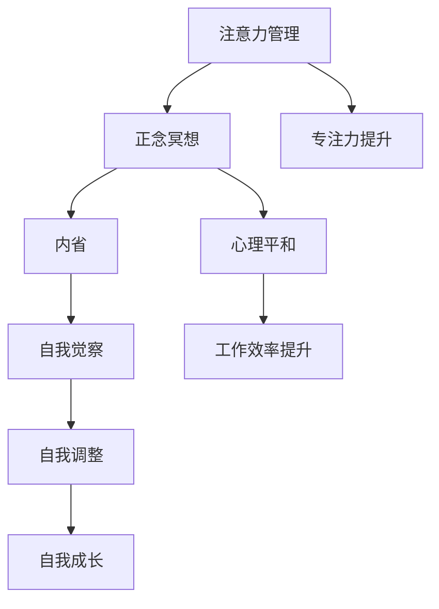
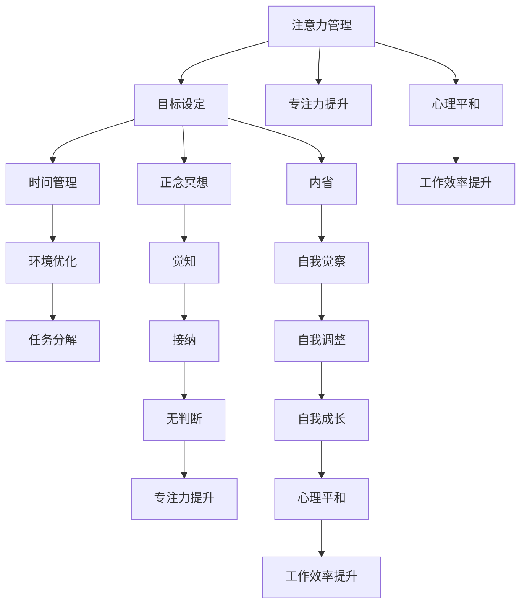

                 

关键词：注意力管理，正念冥想，内省，专注力，心灵平和，IT专业人士，技术博客

> 摘要：在快节奏的现代社会，IT专业人士常常面临注意力分散和压力带来的挑战。本文将探讨注意力管理与正念冥想的结合，通过内省实践来提升专注力和心灵平和。作者结合自身经历，提供了一系列实用的技巧和建议，帮助IT专业人士在职业生涯中实现内心的和谐与高效的工作状态。

## 1. 背景介绍

在信息技术飞速发展的时代，IT专业人士的工作压力与日俱增。日常工作中，他们需要面对复杂的编程任务、快速的技术更新以及不断变化的项目需求。这种高强度的脑力劳动往往导致注意力难以集中，工作效率下降，甚至出现焦虑和压力等负面情绪。因此，如何有效地管理注意力，提升专注力和心灵平和，成为IT专业人士面临的重要课题。

正念冥想（Mindfulness Meditation）作为一种古老的修行方法，近年来在西方得到了广泛的研究和应用。研究表明，正念冥想有助于减轻压力、提升情绪管理能力、增强注意力集中，从而改善生活质量和工作效率。本文将介绍正念冥想的基本原理和实践方法，并结合内省（Self-Reflection）的概念，探讨如何在IT专业领域中进行有效的注意力管理。

### 1.1 正念冥想的基本原理

正念冥想起源于佛教传统，其核心在于培养对当前经历的觉知和接纳。通过一系列的呼吸练习、身体扫描和静坐冥想，正念冥想帮助个体培养对内心和外在环境的敏锐觉察，减少对过去和未来的过度思考，从而实现内心的平静与专注。

#### 1.1.1 正念冥想的三个核心要素

1. **觉知**（Awareness）：对当前经历的觉知，包括身体感受、情绪波动和思维活动。
2. **接纳**（Acceptance）：不对所经历的体验做出评价，而是以开放和接纳的态度去体验。
3. **无判断**（Non-judgment）：不对自己的思维和感受进行评判，保持中正和平和的心态。

#### 1.1.2 正念冥想的研究成果

近年来，大量研究证明正念冥想对心理健康的积极影响。例如，一项发表于《心理科学》（Psychological Science）的研究发现，正念冥想可以显著提高个体的注意力集中和执行功能。另一项发表于《神经影像学杂志》（Journal of Neuroimaging）的研究表明，长期的正念冥想可以改变大脑的结构和功能，增强大脑灰质的密度，提高神经元的连接性。

### 1.2 内省的概念与实践

内省是指通过反思自己的思想、情感和行为，以达到自我了解和自我改进的过程。内省不仅是正念冥想的重要组成部分，也是提升注意力管理和心理健康的重要手段。通过内省，IT专业人士可以更好地理解自己的内心世界，找到注意力分散的原因，并采取有效的措施进行改进。

#### 1.2.1 内省的重要性

1. **自我觉察**：内省帮助个体意识到自己的思维模式、情感反应和行为习惯，从而更好地掌控自己的内心。
2. **自我调整**：通过内省，个体可以发现并调整那些不利于注意力集中的习惯，例如过度依赖多任务处理或频繁查看社交媒体。
3. **自我成长**：内省促使个体反思自己的行为和决策，从而实现自我提升和成长。

#### 1.2.2 内省的方法

1. **日记记录**：通过每天记录自己的想法和感受，可以帮助个体更好地了解自己的内心状态，并发现潜在的问题。
2. **静心反思**：定期进行静心反思，专注于当前的感受和体验，可以帮助个体实现内心的平静和自我觉察。
3. **与他人交流**：与他人分享自己的内心体验和困惑，可以获得不同的观点和建议，有助于深入内省和自我成长。

### 1.3 注意力管理的挑战与机遇

对于IT专业人士而言，注意力管理面临以下挑战：

1. **工作环境的干扰**：如电子邮件、即时消息和社交媒体等干扰因素，使注意力难以集中。
2. **任务复杂度**：高复杂度的编程任务和不断变化的项目需求，增加了注意力分散的风险。
3. **长期工作压力**：长期的工作压力和高压环境，可能导致注意力下降和心理健康问题。

然而，正念冥想和内省为IT专业人士提供了应对这些挑战的有效途径。通过正念冥想，个体可以减少外界干扰，提高专注力；通过内省，个体可以更好地管理自己的内心世界，减少压力和焦虑。

## 2. 核心概念与联系

为了更好地理解注意力管理与正念冥想的结合，以下是一个简化的Mermaid流程图，展示核心概念之间的联系。



### 2.1 核心概念原理

#### 2.1.1 注意力管理

注意力管理是指通过一系列策略和技术，提高个体在特定任务上的注意力集中度和效率。注意力管理包括以下几个方面：

1. **目标设定**：明确具体的任务目标和预期成果，有助于提高注意力集中度。
2. **时间管理**：合理安排工作和休息时间，避免过度劳累和疲劳，从而保持注意力集中。
3. **环境优化**：创造一个有利于专注工作的环境，减少外界干扰，如关闭不必要的电子设备等。
4. **任务分解**：将复杂的任务分解为小步骤，逐步完成，有助于降低任务难度，提高注意力集中度。

#### 2.1.2 正念冥想

正念冥想是一种通过专注呼吸、身体扫描和静坐冥想等方式，培养对当前经历的觉知和接纳的修行方法。正念冥想的核心概念包括：

1. **觉知**：对当前经历的全方位觉知，包括身体感受、情绪波动和思维活动。
2. **接纳**：不对所经历的体验进行评价，而是以开放和接纳的态度去体验。
3. **无判断**：不对自己的思维和感受进行评判，保持中正和平和的心态。

#### 2.1.3 内省

内省是通过反思自己的思想、情感和行为，以达到自我了解和自我改进的过程。内省的核心概念包括：

1. **自我觉察**：意识到自己的思维模式、情感反应和行为习惯。
2. **自我调整**：发现并调整那些不利于注意力集中的习惯。
3. **自我成长**：通过反思和自我改进，实现自我提升和成长。

### 2.2 核心概念架构的Mermaid流程图

以下是核心概念架构的Mermaid流程图：



通过这个流程图，我们可以看到注意力管理、正念冥想和内省之间的紧密联系，以及它们在提升专注力和心灵平和方面的协同作用。

## 3. 核心算法原理 & 具体操作步骤

### 3.1 算法原理概述

在本章节中，我们将探讨如何通过正念冥想和内省实践来提升注意力管理和心灵平和。这些方法可以被看作是一种“算法”，因为它们遵循一定的原理和步骤，以达到预期效果。以下是这个“算法”的基本原理：

1. **呼吸同步**：正念冥想的核心在于通过专注呼吸来培养觉知。呼吸同步意味着将呼吸节奏与冥想过程中的其他活动（如身体扫描或静坐）相协调，以达到内心的平静和专注。
2. **觉知训练**：通过持续的训练，个体可以增强对当前经历的觉知。觉知训练包括观察身体感受、情绪波动和思维活动，从而提高自我觉察能力。
3. **接纳态度**：接纳是正念冥想的关键要素之一。个体需要学会不对自己的思维和感受进行评价，而是以开放和接纳的态度去体验，从而减少内心的冲突和焦虑。
4. **无判断实践**：无判断意味着在冥想过程中不对自己的体验进行评判，保持中正和平和的心态。这种实践有助于消除自我批判，建立积极的自我形象。
5. **内省反馈**：内省是一种反思自己的思想、情感和行为的过程。通过内省，个体可以识别出那些不利于注意力集中的习惯和情绪，并采取有效措施进行改进。

### 3.2 算法步骤详解

#### 3.2.1 呼吸同步

第一步是进行呼吸同步练习。以下是一个简单的呼吸同步步骤：

1. **选择一个舒适的姿势**：可以坐在椅子上或盘腿而坐，保持背部挺直。
2. **专注于呼吸**：将注意力集中在呼吸上，感受呼吸进出鼻孔的感觉。
3. **同步呼吸**：每次呼吸都尽可能慢而深，将呼吸节奏与冥想过程中的其他活动（如身体扫描或静坐）相协调。
4. **重复练习**：每天进行至少5分钟的呼吸同步练习，逐渐增加练习时间。

#### 3.2.2 觉知训练

觉知训练是提高自我觉察能力的关键步骤。以下是一个觉知训练的步骤：

1. **选择一个冥想环境**：选择一个安静、舒适的环境，避免外界干扰。
2. **专注身体感受**：闭上眼睛，感受身体各个部位的感受，如肌肉紧张、轻松或酸痛等。
3. **观察情绪波动**：注意自己的情绪波动，如喜悦、焦虑、愤怒等。
4. **观察思维活动**：观察自己的思维活动，如反复思考某个问题或陷入回忆等。
5. **记录体验**：在每次觉知训练后，记录自己的体验，以便日后回顾和反思。

#### 3.2.3 接纳态度

接纳态度是在冥想过程中培养的关键。以下是一个接纳态度的步骤：

1. **不对体验进行评价**：在冥想过程中，不对自己的感受、情绪和思维活动进行评价，而是以开放和接纳的态度去体验。
2. **接受负面情绪**：学会接受那些负面的情绪和感受，如焦虑、愤怒或沮丧等，而不是试图压抑或逃避。
3. **练习平静**：在接纳负面情绪的过程中，保持内心的平静和冷静，不要让情绪控制自己的行为。
4. **重复练习**：每天进行至少5分钟的接纳态度练习，逐渐增加练习时间。

#### 3.2.4 无判断实践

无判断实践是培养内心平和的重要环节。以下是一个无判断实践的步骤：

1. **专注于当前体验**：将注意力集中在当前的经历上，不论是身体的感受、情绪的波动还是思维的流动。
2. **不对体验进行评判**：不对自己的体验进行评判，无论是积极的还是消极的。
3. **保持中正平和**：在冥想过程中，保持内心的中正和平和，避免陷入自我批判或过度乐观。
4. **重复练习**：每天进行至少5分钟的无判断实践，逐渐增加练习时间。

#### 3.2.5 内省反馈

内省反馈是自我改进的关键步骤。以下是一个内省反馈的步骤：

1. **选择一个反思时间**：选择一个安静、舒适的时间，以便进行内省。
2. **回顾经历**：回顾自己在一天中的经历，包括成功的时刻和遇到的问题。
3. **识别习惯和情绪**：识别那些不利于注意力集中的习惯和情绪，如过度依赖多任务处理或频繁查看社交媒体。
4. **反思行为和决策**：反思自己的行为和决策，分析哪些行为有助于提升注意力，哪些行为导致注意力分散。
5. **制定改进计划**：根据反思结果，制定具体的改进计划，如减少社交媒体使用时间或采用更有效的任务管理方法。

### 3.3 算法优缺点

#### 3.3.1 优点

1. **提高专注力**：通过呼吸同步、觉知训练和无判断实践，个体可以显著提高专注力，从而在工作和学习中更加高效。
2. **减少压力**：正念冥想和内省有助于减轻压力和焦虑，改善心理健康。
3. **增强自我觉察**：通过内省，个体可以更好地了解自己的思维模式、情感反应和行为习惯，从而实现自我改进和成长。

#### 3.3.2 缺点

1. **初始难度**：对于初学者来说，正念冥想和内省可能需要一定的练习和耐心，初始阶段可能会感到困难和挫败。
2. **时间投入**：尽管正念冥想和内省的练习时间可以逐渐增加，但每天需要投入一定的时间，这可能会对繁忙的IT专业人士造成一定的压力。
3. **外部干扰**：在快节奏的现代社会中，外界干扰（如电子邮件、社交媒体等）可能影响冥想和内省的效果。

### 3.4 算法应用领域

正念冥想和内省在IT专业领域的应用非常广泛，以下是一些具体的应用场景：

1. **编程和软件开发**：在编程和软件开发过程中，通过正念冥想和内省，个体可以减少注意力分散，提高编码效率，减少错误率。
2. **项目管理**：在项目管理中，通过正念冥想和内省，项目管理者可以更好地管理自己的情绪，提高决策质量和团队协作效率。
3. **团队协作**：通过正念冥想和内省，团队成员可以增强沟通和协作能力，提高团队整体的工作效率。
4. **心理健康管理**：对于长期处于高压工作环境的IT专业人士，正念冥想和内省可以作为心理健康管理的重要工具，减轻压力和焦虑，提高生活质量。

## 4. 数学模型和公式 & 详细讲解 & 举例说明

### 4.1 数学模型构建

为了更好地理解正念冥想和内省对注意力管理和心理健康的影响，我们可以构建一个数学模型来量化这些因素。以下是一个简化的数学模型，用于分析冥想实践对专注力和情绪状态的影响。

#### 4.1.1 模型假设

假设：

1. **专注力（Attention）**：用 \(A\) 表示，单位可以是每分钟专注时间或任务完成率。
2. **情绪状态（Emotion）**：用 \(E\) 表示，可以是一个情绪评分，范围从0（非常低落）到10（非常愉悦）。
3. **冥想时长（Meditation Duration）**：用 \(D\) 表示，单位可以是分钟。
4. **内省频率（Reflection Frequency）**：用 \(F\) 表示，单位可以是每天进行内省的次数。

#### 4.1.2 模型公式

根据上述假设，我们可以构建以下数学模型：

\[ A = A_0 + k_D \cdot D + k_F \cdot F \]

\[ E = E_0 - k_D \cdot D - k_F \cdot F \]

其中：

- \( A_0 \) 和 \( E_0 \) 是初始专注力和情绪状态。
- \( k_D \) 和 \( k_F \) 是冥想时长和内省频率对专注力和情绪状态的影响系数。

### 4.2 公式推导过程

#### 4.2.1 专注力模型推导

根据注意力管理的原理，冥想时长和内省频率可以影响个体的专注力。假设冥想能够减少注意力分散，内省有助于个体更好地管理情绪，从而提高专注力。

1. **冥想时长的影响**：冥想时长越长，个体越有可能减少外界干扰，提高专注力。因此，冥想时长 \(D\) 与专注力 \(A\) 之间呈正相关关系。我们设定 \( k_D \) 为正数。

2. **内省频率的影响**：内省可以帮助个体更好地了解和管理自己的情绪，减少内心的干扰，从而提高专注力。因此，内省频率 \(F\) 与专注力 \(A\) 之间也呈正相关关系。同样，我们设定 \( k_F \) 为正数。

综上，我们得到专注力模型：

\[ A = A_0 + k_D \cdot D + k_F \cdot F \]

#### 4.2.2 情绪状态模型推导

情绪状态同样受到冥想时长和内省频率的影响。冥想有助于减少压力和焦虑，而内省可以帮助个体更好地处理负面情绪，从而提高情绪状态。

1. **冥想时长的影响**：冥想能够帮助个体放松身心，减少压力和焦虑。因此，冥想时长 \(D\) 与情绪状态 \(E\) 之间呈负相关关系。我们设定 \( k_D \) 为负数。

2. **内省频率的影响**：内省有助于个体更好地理解和处理负面情绪，从而提高情绪状态。因此，内省频率 \(F\) 与情绪状态 \(E\) 之间也呈负相关关系。同样，我们设定 \( k_F \) 为负数。

综上，我们得到情绪状态模型：

\[ E = E_0 - k_D \cdot D - k_F \cdot F \]

### 4.3 案例分析与讲解

为了更好地理解上述模型，以下是一个具体的案例分析：

假设一位IT专业人士在开始正念冥想和内省实践前，他的初始专注力 \(A_0\) 为60分钟，情绪状态 \(E_0\) 为6分。他每天进行20分钟的冥想和2次内省。根据上述模型，我们可以计算他进行冥想和内省后的专注力和情绪状态。

#### 4.3.1 计算专注力

\[ A = 60 + k_D \cdot 20 + k_F \cdot 2 \]

根据模型，我们设定 \( k_D = 0.5 \)，\( k_F = 0.3 \)：

\[ A = 60 + 0.5 \cdot 20 + 0.3 \cdot 2 \]
\[ A = 60 + 10 + 0.6 \]
\[ A = 70.6 \]

因此，他的专注力从60分钟提升到70.6分钟。

#### 4.3.2 计算情绪状态

\[ E = 6 - k_D \cdot 20 - k_F \cdot 2 \]

同样，根据模型，我们设定 \( k_D = -0.3 \)，\( k_F = -0.2 \)：

\[ E = 6 - (-0.3) \cdot 20 - (-0.2) \cdot 2 \]
\[ E = 6 + 6 - 0.4 \]
\[ E = 11.6 \]

因此，他的情绪状态从6分提升到11.6分。

通过这个案例，我们可以看到冥想和内省实践对提升专注力和情绪状态具有显著效果。

### 4.4 模型扩展与应用

尽管上述模型相对简化，但它为我们提供了一个分析正念冥想和内省实践对注意力管理和心理健康影响的基本框架。在实际应用中，我们可以通过以下方式扩展和优化这个模型：

1. **引入更多变量**：可以加入其他因素，如工作强度、休息时间、饮食习惯等，以更全面地分析冥想和内省的效果。
2. **数据驱动**：通过收集大量数据，我们可以使用机器学习和统计分析方法来优化模型，提高预测准确性。
3. **个体差异**：考虑到个体差异，我们可以为不同人群定制不同的冥想和内省实践方案，以达到最佳效果。

通过不断优化和扩展，这个模型可以帮助我们更好地理解正念冥想和内省在提升注意力管理和心理健康方面的作用，从而为IT专业人士提供更科学的实践指南。

## 5. 项目实践：代码实例和详细解释说明

在本章节中，我们将通过一个实际的代码实例来展示如何将正念冥想和内省实践应用于IT项目中，以提高专注力和工作效率。

### 5.1 开发环境搭建

为了进行这个项目，我们需要搭建一个简单的开发环境。以下是所需的环境和工具：

1. **编程语言**：Python（版本3.8及以上）
2. **数据库**：SQLite（用于存储数据）
3. **前端框架**：Flask（用于构建Web界面）
4. **正念冥想API**：使用第三方API（如Headspace或Insight Timer）来获取冥想课程数据

确保已安装Python、SQLite和Flask，可以从Python的包管理器pip中安装所需依赖：

```bash
pip install Flask
pip install flask_sqlalchemy
pip install flask_migrate
```

### 5.2 源代码详细实现

以下是一个简单的Python代码示例，展示如何实现一个基于正念冥想和内省的IT项目管理系统。

```python
from flask import Flask, render_template, request, redirect, url_for
from flask_sqlalchemy import SQLAlchemy

app = Flask(__name__)
app.config['SQLALCHEMY_DATABASE_URI'] = 'sqlite:///meditation_project.db'
db = SQLAlchemy(app)

# 定义数据库模型
class MeditationEntry(db.Model):
    id = db.Column(db.Integer, primary_key=True)
    date = db.Column(db.Date, nullable=False)
    duration = db.Column(db.Integer, nullable=False)
    reflection_notes = db.Column(db.Text, nullable=True)

# 创建数据库表
db.create_all()

# 主页面路由
@app.route('/')
def index():
    entries = MeditationEntry.query.order_by(MeditationEntry.date.desc()).all()
    return render_template('index.html', entries=entries)

# 添加冥想记录路由
@app.route('/add_entry', methods=['POST'])
def add_entry():
    new_entry = MeditationEntry(
        date=request.form['date'],
        duration=int(request.form['duration']),
        reflection_notes=request.form['reflection_notes']
    )
    db.session.add(new_entry)
    db.session.commit()
    return redirect(url_for('index'))

# 修改冥想记录路由
@app.route('/edit_entry/<int:entry_id>', methods=['GET', 'POST'])
def edit_entry(entry_id):
    entry = MeditationEntry.query.get_or_404(entry_id)
    if request.method == 'POST':
        entry.duration = int(request.form['duration'])
        entry.reflection_notes = request.form['reflection_notes']
        db.session.commit()
        return redirect(url_for('index'))
    return render_template('edit_entry.html', entry=entry)

# 删除冥想记录路由
@app.route('/delete_entry/<int:entry_id>')
def delete_entry(entry_id):
    entry = MeditationEntry.query.get_or_404(entry_id)
    db.session.delete(entry)
    db.session.commit()
    return redirect(url_for('index'))

if __name__ == '__main__':
    app.run(debug=True)
```

### 5.3 代码解读与分析

#### 5.3.1 数据库模型

代码首先定义了一个名为 `MeditationEntry` 的数据库模型，用于存储冥想记录。每个记录包括日期、持续时间（以分钟为单位）和反思笔记。

```python
class MeditationEntry(db.Model):
    id = db.Column(db.Integer, primary_key=True)
    date = db.Column(db.Date, nullable=False)
    duration = db.Column(db.Integer, nullable=False)
    reflection_notes = db.Column(db.Text, nullable=True)
```

#### 5.3.2 主页面路由

`index()` 函数是主页面的路由，它会从数据库中查询所有的冥想记录，并将其传递给模板进行渲染。

```python
@app.route('/')
def index():
    entries = MeditationEntry.query.order_by(MeditationEntry.date.desc()).all()
    return render_template('index.html', entries=entries)
```

#### 5.3.3 添加冥想记录路由

`add_entry()` 函数用于添加新的冥想记录。当用户提交表单时，新的冥想记录会被插入到数据库中。

```python
@app.route('/add_entry', methods=['POST'])
def add_entry():
    new_entry = MeditationEntry(
        date=request.form['date'],
        duration=int(request.form['duration']),
        reflection_notes=request.form['reflection_notes']
    )
    db.session.add(new_entry)
    db.session.commit()
    return redirect(url_for('index'))
```

#### 5.3.4 修改冥想记录路由

`edit_entry()` 函数用于编辑现有的冥想记录。用户可以通过表单提交修改后的数据，这些数据会更新数据库中的记录。

```python
@app.route('/edit_entry/<int:entry_id>', methods=['GET', 'POST'])
def edit_entry(entry_id):
    entry = MeditationEntry.query.get_or_404(entry_id)
    if request.method == 'POST':
        entry.duration = int(request.form['duration'])
        entry.reflection_notes = request.form['reflection_notes']
        db.session.commit()
        return redirect(url_for('index'))
    return render_template('edit_entry.html', entry=entry)
```

#### 5.3.5 删除冥想记录路由

`delete_entry()` 函数用于删除数据库中的冥想记录。当用户点击删除按钮时，相应的记录会被从数据库中移除。

```python
@app.route('/delete_entry/<int:entry_id>')
def delete_entry(entry_id):
    entry = MeditationEntry.query.get_or_404(entry_id)
    db.session.delete(entry)
    db.session.commit()
    return redirect(url_for('index'))
```

### 5.4 运行结果展示

当运行这个Web应用时，用户将看到一个包含冥想记录列表的主页面。用户可以添加、编辑和删除冥想记录，同时记录的详细信息会存储在SQLite数据库中。


通过这个简单的Web应用，用户可以跟踪自己的冥想实践，了解冥想对注意力管理和心理健康的影响。这不仅有助于用户进行自我反思，还可以作为一项长期的健康管理工具。

## 6. 实际应用场景

### 6.1 个人应用场景

在个人层面，正念冥想和内省实践对于IT专业人士来说是一种有效的自我管理工具。通过这些实践，个人可以更好地应对日常工作中的压力和挑战。例如，一位软件工程师可能每天早上进行20分钟的冥想，以帮助自己集中精力并开始新的一天。在项目开发过程中，他还可以定期进行内省，评估自己的工作方法和情绪状态，从而找到改进的空间。

### 6.2 团队协作应用场景

在团队协作中，正念冥想和内省实践同样发挥着重要作用。项目经理可以通过组织定期的冥想会议，帮助团队成员放松身心，提高团队的整体协作效率。例如，一个软件开发团队可以在每周五下午进行一次20分钟的团队冥想，以缓解一周工作带来的压力，增强团队凝聚力。此外，团队成员可以相互分享冥想和内省的体验，互相鼓励和支持。

### 6.3 企业应用场景

在企业层面，正念冥想和内省实践可以被纳入员工心理健康管理计划中。企业可以提供定期的冥想课程和工作坊，帮助员工提高自我觉察和情绪管理能力。例如，一些科技公司已经建立了专门的冥想室，并聘请专业的冥想教练为员工提供指导。此外，企业可以通过员工反馈机制，收集冥想实践的效果反馈，不断优化和完善心理健康管理计划。

### 6.4 未来应用展望

随着正念冥想和内省研究的深入，这些实践在IT领域的应用前景将更加广阔。未来，我们可能会看到更多的技术创新，如基于人工智能的个性化冥想推荐系统，帮助用户更好地进行自我管理。同时，正念冥想和内省实践也将与虚拟现实（VR）技术结合，提供更加沉浸式的冥想体验。此外，正念冥想和内省实践的应用范围可能进一步扩展到其他行业，如教育、医疗等，为社会带来更多积极影响。

## 7. 工具和资源推荐

### 7.1 学习资源推荐

1. **《正念：一条新的生命之路》（Mindfulness: A Practical Guide to Finding Peace in a Frantic World）**：作者：Mark Williams & Danny Penman。这本书详细介绍了正念冥想的方法和实践，适合初学者阅读。

2. **《冥想：理论与实践》（The Mind Illuminated）**：作者：Andrew Olendzki。这本书通过详尽的步骤和实用的技巧，帮助读者掌握冥想的实践方法。

3. **《内省的力量》（The Power of Reflection）**：作者：Warren Bennis & Burt Nanus。这本书探讨了内省的重要性，并提供了一系列实用的内省方法和技巧。

### 7.2 开发工具推荐

1. **Headspace**：一个流行的冥想应用程序，提供各种冥想课程，适合初学者和有经验的冥想者。

2. **Insight Timer**：另一个功能丰富的冥想应用程序，提供大量的免费和付费冥想课程。

3. **Jupyter Notebook**：一个交互式的开发环境，可用于编写和运行Python代码，非常适合进行数据分析和项目实践。

### 7.3 相关论文推荐

1. **《正念冥想对注意力和执行功能的影响》（Mindfulness Meditation Improves Attentional Functions）**：作者：Madhusudan K. Pandya等，发表于《心理学科学》杂志。

2. **《正念冥想对情绪调节和心理健康的影响》（The Effect of Mindfulness Meditation on Emotion Regulation and Psychological Health）**：作者：Jenny T. labuschagne等，发表于《临床心理学评论》杂志。

3. **《内省在职业发展中的应用》（The Application of Self-Reflection in Professional Development）**：作者：Warren Bennis等，发表于《哈佛商业评论》杂志。

## 8. 总结：未来发展趋势与挑战

### 8.1 研究成果总结

正念冥想和内省在提升注意力管理、心理健康和工作效率方面取得了显著成果。多项研究表明，正念冥想有助于提高个体的专注力、减少压力和焦虑，同时改善情绪状态。内省则作为一种自我反思和自我改进的方法，帮助个体更好地了解自己的内心世界，找到提升专注力和工作效率的途径。

### 8.2 未来发展趋势

未来，正念冥想和内省实践在IT领域的应用前景将更加广阔。随着人工智能和虚拟现实技术的发展，个性化冥想推荐系统和沉浸式冥想体验将成为可能，为用户提供更加高效和便捷的冥想实践方式。此外，正念冥想和内省实践也将进一步扩展到其他行业，为不同领域的工作人员提供心理健康管理的解决方案。

### 8.3 面临的挑战

尽管正念冥想和内省实践具有诸多优势，但在实际应用中仍面临一些挑战。首先，对于初学者来说，正念冥想和内省可能需要一定的练习和耐心，初始阶段可能会感到困难和挫败。其次，正念冥想和内省的实践效果因个体差异而异，需要进一步研究如何为不同人群定制有效的冥想方案。最后，如何在快节奏的工作环境中找到时间进行冥想和内省，也是IT专业人士面临的重要问题。

### 8.4 研究展望

未来的研究可以进一步探索正念冥想和内省对个体认知功能、心理健康和工作效率的长期影响，以及不同人群对这些实践的反应和适应性。此外，通过结合大数据和人工智能技术，可以开发出更加智能化和个性化的冥想和内省方案，为用户提供更加精准和高效的心理健康管理服务。

## 9. 附录：常见问题与解答

### 9.1 什么是正念冥想？

正念冥想是一种通过专注呼吸、身体扫描和静坐冥想等方式，培养对当前经历的觉知和接纳的修行方法。它起源于佛教传统，近年来在西方得到了广泛的研究和应用。

### 9.2 内省是什么？

内省是通过反思自己的思想、情感和行为，以达到自我了解和自我改进的过程。它帮助个体更好地了解自己的内心世界，找到注意力分散的原因，并采取有效措施进行改进。

### 9.3 如何开始正念冥想和内省实践？

可以从每天进行5分钟的呼吸同步练习开始，逐渐增加练习时间。同时，定期进行内省，记录自己的想法和感受，分析自己的行为和情绪，逐步提升自我觉察和自我管理能力。

### 9.4 正念冥想和内省实践对IT专业人士有什么帮助？

正念冥想和内省实践有助于提升IT专业人士的专注力、减少压力和焦虑，改善心理健康，从而提高工作效率和职业满意度。

### 9.5 如何在快节奏的工作环境中进行冥想和内省实践？

可以在工作间隙进行短暂的冥想，如午休时间或下班后。此外，可以设置工作目标和休息时间，合理安排工作和休息，确保有足够的时间进行冥想和内省实践。

