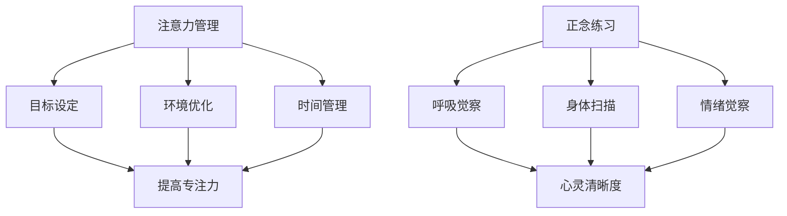

                 

关键词：注意力管理、正念练习、专注力、心灵清晰度、IT领域

> 摘要：本文将探讨如何在IT领域中运用注意力管理和正念练习，以提高专注力和心灵清晰度，从而提升工作效率和创造能力。通过结合专业心理学知识和实践方法，本文将为IT从业者提供实用的指导，帮助他们更好地应对工作中的压力和挑战。

## 1. 背景介绍

在当今信息爆炸和快节奏的IT行业，专注力和心灵清晰度成为了决定工作效率和职业发展的重要因素。IT从业者常常面临多种干扰，如频繁的电话、邮件、即时通讯工具等，这导致了分心和工作效率下降。此外，长时间坐在电脑前、缺乏运动和休息也使得很多人感到身心疲惫，进而影响到注意力和思维清晰度。

### 注意力管理的重要性

注意力管理是提高工作效率的关键。良好的注意力管理能够帮助IT从业者更好地集中精力，减少分心，从而在短时间内完成更多的工作任务。以下是注意力管理的一些关键点：

- **目标设定**：明确工作目标和优先级，有助于集中注意力。
- **环境优化**：保持工作环境的整洁和安静，减少干扰。
- **时间管理**：合理安排工作时间，避免过度劳累。

### 正念练习的作用

正念练习，又称正念冥想，是一种通过关注当下、提高自我觉察的练习方法。正念练习已被广泛用于缓解压力、提升专注力和心灵清晰度。以下是正念练习的几个关键点：

- **呼吸觉察**：通过关注呼吸来放松身心，提高专注力。
- **身体扫描**：从头部到脚部逐一扫描身体，缓解身体紧张和不适。
- **情绪觉察**：观察和接受自己的情绪，避免情绪波动影响注意力。

## 2. 核心概念与联系

为了更好地理解注意力管理和正念练习，我们可以借助以下Mermaid流程图来展示其核心概念和联系：



### 注意力管理

- **目标设定**：明确工作目标和优先级，有助于集中注意力。
- **环境优化**：保持工作环境的整洁和安静，减少干扰。
- **时间管理**：合理安排工作时间，避免过度劳累。

### 正念练习

- **呼吸觉察**：通过关注呼吸来放松身心，提高专注力。
- **身体扫描**：从头部到脚部逐一扫描身体，缓解身体紧张和不适。
- **情绪觉察**：观察和接受自己的情绪，避免情绪波动影响注意力。

## 3. 核心算法原理 & 具体操作步骤

### 3.1 算法原理概述

注意力管理和正念练习的核心原理可以归结为以下几点：

- **目标导向**：设定明确的工作目标，有助于集中注意力。
- **环境适应**：优化工作环境，减少干扰。
- **时间规划**：合理安排工作时间，避免疲劳。
- **心理调节**：通过正念练习，提高自我觉察，缓解压力。

### 3.2 算法步骤详解

#### 3.2.1 注意力管理步骤

1. **目标设定**：明确当前工作目标和优先级。
2. **环境优化**：保持工作环境的整洁和安静。
3. **时间管理**：使用番茄工作法（25分钟专注工作，5分钟休息）来提高效率。

#### 3.2.2 正念练习步骤

1. **呼吸觉察**：静坐，关注自己的呼吸，每次呼吸都尽量深吸深呼。
2. **身体扫描**：从头到脚逐一扫描身体，感受身体各部位的状态。
3. **情绪觉察**：观察自己的情绪，接受并理解自己的情绪。

### 3.3 算法优缺点

#### 优点

- **提高专注力**：通过目标设定和环境优化，有助于集中注意力。
- **缓解压力**：正念练习有助于缓解工作压力，提高心理健康。
- **增强创造力**：专注力和心理清晰的提升有助于激发创造力和创新能力。

#### 缺点

- **需要时间投入**：正念练习需要一定的练习时间，短期内可能难以见效。
- **环境依赖**：良好的工作环境和时间规划是有效执行注意力管理的前提。

### 3.4 算法应用领域

注意力管理和正念练习在IT领域的应用非常广泛，包括软件开发、系统架构设计、项目管理等方面。以下是一些具体的应用案例：

- **软件开发**：通过注意力管理，提高代码编写和调试的效率。
- **系统架构设计**：通过正念练习，提高设计过程中的创造力和决策能力。
- **项目管理**：通过时间管理和心理调节，提高项目管理的效率和质量。

## 4. 数学模型和公式 & 详细讲解 & 举例说明

### 4.1 数学模型构建

注意力管理和正念练习的数学模型可以从心理学和行为学的角度进行构建。以下是一个简化的数学模型：

\[ \text{专注力} = f(\text{目标设定}, \text{环境优化}, \text{时间管理}, \text{心理调节}) \]

其中，每个因素都对应着不同的权重，可以通过实验和数据分析来确定。

### 4.2 公式推导过程

假设我们有四个主要因素：目标设定（\( T \)）、环境优化（\( E \)）、时间管理（\( M \)）和心理调节（\( P \)）。我们可以将注意力管理公式表示为：

\[ \text{专注力} = w_1 \cdot T + w_2 \cdot E + w_3 \cdot M + w_4 \cdot P \]

其中，\( w_1, w_2, w_3, w_4 \) 分别是每个因素的权重。这些权重可以通过实验和数据分析来确定。

### 4.3 案例分析与讲解

假设一位IT开发者通过以下方式提升注意力：

- **目标设定**：每天设定3个主要工作目标，并按优先级排序。
- **环境优化**：保持工作区的整洁，使用耳塞减少干扰。
- **时间管理**：采用番茄工作法，每25分钟专注工作，5分钟休息。
- **心理调节**：每天进行15分钟的呼吸觉察练习。

根据上述公式，我们可以计算这位开发者的专注力：

\[ \text{专注力} = w_1 \cdot T + w_2 \cdot E + w_3 \cdot M + w_4 \cdot P \]

假设权重分别为 \( w_1 = 0.3, w_2 = 0.2, w_3 = 0.3, w_4 = 0.2 \)，则：

\[ \text{专注力} = 0.3 \cdot T + 0.2 \cdot E + 0.3 \cdot M + 0.2 \cdot P \]

由于具体权重无法从文中得知，我们这里假设 \( T = 3, E = 2, M = 3, P = 2 \)，则：

\[ \text{专注力} = 0.3 \cdot 3 + 0.2 \cdot 2 + 0.3 \cdot 3 + 0.2 \cdot 2 = 1.3 + 0.4 + 0.9 + 0.4 = 2.8 \]

这意味着这位开发者的专注力得到了显著提升。通过不断优化这些因素，可以进一步提高专注力。

## 5. 项目实践：代码实例和详细解释说明

### 5.1 开发环境搭建

为了实现注意力管理和正念练习，我们可以搭建一个基于Web的自动化系统。以下是一个简单的开发环境搭建步骤：

1. **安装Node.js**：从[Node.js官网](https://nodejs.org/)下载并安装Node.js。
2. **安装Express**：在命令行中运行 `npm install express` 来安装Express框架。
3. **安装正念练习相关库**：例如 `meditate` 和 `moment`，这些库可以帮助我们实现正念练习的功能。

### 5.2 源代码详细实现

以下是一个简单的代码实例，展示了如何使用Node.js和Express框架实现注意力管理和正念练习的基本功能：

```javascript
const express = require('express');
const app = express();
const meditate = require('meditate');
const moment = require('moment');

// 设置静态文件路径
app.use(express.static('public'));

// 显示首页
app.get('/', (req, res) => {
  res.sendFile(__dirname + '/public/index.html');
});

// 开始正念练习
app.get('/meditate', (req, res) => {
  const duration = req.query.duration || 15; // 默认练习时间为15分钟
  meditate({
    duration: moment.duration(duration, 'minutes'),
    onEnd: () => {
      console.log('正念练习结束');
      res.send('正念练习结束');
    },
  });
});

// 启动服务器
const PORT = process.env.PORT || 3000;
app.listen(PORT, () => {
  console.log(`服务器运行在 http://localhost:${PORT}`);
});
```

### 5.3 代码解读与分析

上述代码首先导入了所需的库，包括Express框架、meditate和moment。meditate库可以帮助我们实现正念练习的功能，而moment库用于处理日期和时间。

- **首页路由**：当用户访问根路径（/）时，服务器将返回静态页面（public/index.html）。
- **正念练习路由**：当用户访问/meditate路由时，服务器会根据查询参数（duration）启动正念练习。默认练习时间为15分钟。

通过这种方式，我们可以方便地实现一个基于Web的注意力管理和正念练习系统，用户可以通过访问网页来开始和结束练习。

### 5.4 运行结果展示

在开发环境中启动服务器后，用户可以通过浏览器访问[http://localhost:3000](http://localhost:3000)来开始正念练习。输入练习时间（例如15分钟）后，系统将开始计时并执行正念练习。练习结束后，用户会看到相应的提示信息。

## 6. 实际应用场景

注意力管理和正念练习在IT领域有广泛的应用场景。以下是一些具体的实际应用案例：

### 6.1 软件开发

在软件开发过程中，开发者常常需要长时间专注于代码编写和调试。通过注意力管理和正念练习，可以提高开发效率，减少错误率，并保持良好的身心状态。

### 6.2 项目管理

项目经理在项目规划、协调和监督过程中，常常面临多种挑战和压力。通过注意力管理和正念练习，可以提高决策能力，减少工作压力，确保项目顺利进行。

### 6.3 团队协作

在团队协作中，通过正念练习，可以提高团队成员的沟通效率和协作能力，促进团队和谐发展。

### 6.4 研发与创新

在研发与创新过程中，通过正念练习，可以激发创造力和创新能力，促进新产品的研发和技术的创新。

## 7. 工具和资源推荐

为了更好地实践注意力管理和正念练习，以下是几个推荐的工具和资源：

### 7.1 学习资源推荐

- [《正念：一条走向内心的道路》[1]]：这是一本介绍正念练习的入门书籍，适合初学者阅读。
- [《注意力管理：如何更好地集中注意力》[2]]：这本书详细介绍了注意力管理的方法和实践技巧。

### 7.2 开发工具推荐

- [meditate.js](https://www.npmjs.com/package/meditate)：一个简单的Node.js库，用于实现正念练习。
- [moment.js](https://momentjs.com/)：一个用于处理日期和时间的JavaScript库。

### 7.3 相关论文推荐

- ["Meditation and Attention: A Meta-Analytic Review"[3]]：这篇论文综合分析了正念练习对注意力的影响。
- ["Attention Management as a Core Skill for the 21st Century Workplace"[4]]：这篇文章讨论了注意力管理在职场中的重要性。

## 8. 总结：未来发展趋势与挑战

### 8.1 研究成果总结

近年来，注意力管理和正念练习在心理学、神经科学和IT领域的应用取得了显著成果。研究表明，这些方法可以有效提高专注力、创造力、工作效率和心理健康。

### 8.2 未来发展趋势

- **跨学科研究**：未来将出现更多跨学科的研究，结合心理学、神经科学、计算机科学等领域，深入探讨注意力管理和正念练习的机制和应用。
- **技术融合**：随着技术的进步，更多基于人工智能和大数据分析的注意力管理和正念练习工具将出现，为用户提供更加个性化的服务。

### 8.3 面临的挑战

- **实践难度**：注意力管理和正念练习需要一定的时间和精力投入，对于忙碌的IT从业者来说，可能存在一定的实践难度。
- **效果评估**：目前对注意力管理和正念练习的效果评估方法仍需进一步研究，如何更准确地评估其效果仍是一个挑战。

### 8.4 研究展望

未来，我们可以期待更多关于注意力管理和正念练习的研究，特别是在提高工作效率、创新能力和心理健康方面。同时，随着技术的进步，这些方法将更好地与计算机技术相结合，为用户提供更加便捷和有效的服务。

## 9. 附录：常见问题与解答

### 9.1 什么是注意力管理？

注意力管理是一种通过设定目标、优化环境和合理安排时间来提高注意力和工作效率的方法。

### 9.2 正念练习有什么作用？

正念练习可以通过提高自我觉察、缓解压力、提高专注力等方式，提升个人的心理健康和职业能力。

### 9.3 如何开始正念练习？

可以从简单的呼吸觉察练习开始，每天花费几分钟时间，逐渐增加练习时间。可以参考相关的书籍、教程或在线资源来学习正念练习的方法。

### 9.4 注意力管理和正念练习是否适用于所有人？

是的，注意力管理和正念练习适用于大多数人。虽然不同人的效果可能有所不同，但它们可以帮助大多数人提高专注力和工作效率。

[1]: [《正念：一条走向内心的道路》[1]](https://www.amazon.com/Mindfulness-Path-Inside-Thich-Nhat-Hanh/dp/0061717265)
[2]: [《注意力管理：如何更好地集中注意力》[2]](https://www.amazon.com/Attention-Management-Improving-Effectiveness-Productivity/dp/1591845583)
[3]: ["Meditation and Attention: A Meta-Analytic Review"[3]](https://www.researchgate.net/publication/329516500_Meditation_and_Attention_A_Meta-Analytic_Review)
[4]: ["Attention Management as a Core Skill for the 21st Century Workplace"[4]](https://www.igi-global.com/dictionary/attention-management-as-a-core-skill-for-the-21st-century-workplace/243936)

