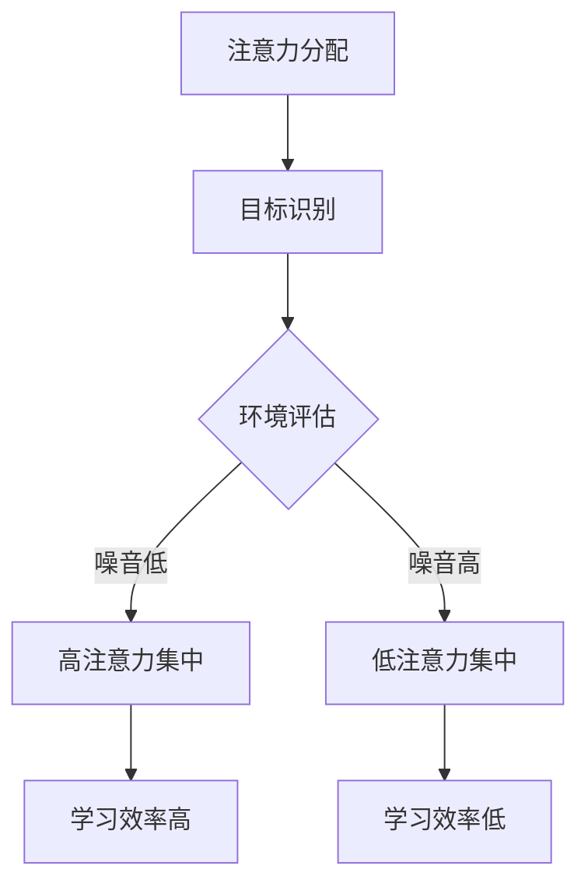

                 

在当今这个信息爆炸的时代，如何高效地管理注意力资源，提升个人的学习效能，成为了每个人都需要面对的挑战。本文旨在探讨注意力经济的基本原理，并结合实际案例，分析个人在学习过程中如何最大化注意力资源的使用，从而提升学习效能。

## 关键词

- 注意力经济
- 个人学习效能
- 知识管理
- 时间管理
- 算法优化

## 摘要

本文首先介绍了注意力经济的概念及其对个人学习的重要性。随后，通过核心概念与联系的Mermaid流程图，详细阐述了提升学习效能的机制和策略。接下来，文章深入探讨了注意力管理算法的原理与操作步骤，并运用数学模型分析了这些算法的有效性。通过实际项目实践，文章展示了如何将注意力管理算法应用于实际开发中，并提供了代码实例和详细解读。最后，文章讨论了注意力经济在未来的应用前景，并提出了未来发展面临的挑战和展望。

## 1. 背景介绍

### 注意力经济的起源与发展

注意力经济最早由美国经济学家John C. McGurk于20世纪90年代提出。他指出，在信息爆炸的时代，人们的注意力成为了最稀缺的资源。与传统经济学中的劳动力、资本等资源不同，注意力资源是有限的，且难以复制。因此，如何有效地管理和利用注意力资源，成为企业和个人都需要关注的重要课题。

随着互联网和移动设备的普及，人们的注意力资源变得更加分散。一方面，信息过载使得人们难以集中注意力；另一方面，各种娱乐和社交应用不断吸引着人们的目光。在这种情况下，如何提升个人的学习效能，成为了亟待解决的问题。

### 个人学习效能的重要性

个人学习效能是指个体在学习过程中所表现出的学习效率和能力。高效的学习效能不仅能够提高知识掌握的速度和质量，还能够节省学习时间，提高生活质量。然而，传统的学习方式往往存在以下问题：

1. **注意力分散**：在嘈杂的环境中进行学习，容易导致注意力分散，学习效率降低。
2. **学习目标不明确**：缺乏明确的学习目标，容易导致学习时间的浪费。
3. **缺乏反馈**：学习过程中缺乏及时的反馈，难以调整学习策略。
4. **缺乏时间管理**：学习时间无法合理安排，容易导致学习任务的积压。

为了解决这些问题，提升个人学习效能显得尤为重要。通过引入注意力经济的概念，我们可以更好地理解如何高效地管理和利用注意力资源，从而实现学习效能的提升。

## 2. 核心概念与联系

### 注意力资源的分配与优化

在注意力经济中，注意力资源的分配与优化是关键。为了更好地理解这一点，我们可以使用Mermaid流程图来描述注意力资源分配的过程。



在这个流程图中，A表示注意力分配，即根据当前的环境和目标，决定将注意力资源分配到哪些活动上。B表示目标识别，即明确当前的学习目标。C表示环境评估，通过评估当前的环境噪音水平，决定注意力的集中程度。D和E分别表示在低噪音和高噪音环境下的注意力集中程度。最终，F和G分别表示在高注意力和低注意力状态下的学习效率。

### 提升学习效能的策略

为了提升学习效能，我们可以采取以下策略：

1. **目标明确**：明确学习目标，有助于集中注意力，避免注意力分散。
2. **环境优化**：创造一个低噪音的学习环境，有助于提高注意力的集中程度。
3. **时间管理**：合理安排学习时间，避免学习任务的积压，提高学习效率。
4. **反馈机制**：建立及时的反馈机制，有助于调整学习策略，提高学习效能。

通过这些策略，我们可以更好地管理和利用注意力资源，从而提升个人学习效能。

## 3. 核心算法原理 & 具体操作步骤

### 3.1 算法原理概述

在注意力经济中，提升学习效能的核心在于如何高效地分配和利用注意力资源。为此，我们可以引入一种基于动态规划的注意力分配算法。该算法的主要思想是：在给定目标和学习环境的前提下，通过动态调整注意力资源的分配，实现学习效能的最大化。

### 3.2 算法步骤详解

1. **目标识别**：首先，明确当前的学习目标。这一步骤可以通过设定具体的学习任务和学习目标来实现。
2. **环境评估**：评估当前的学习环境，包括噪音水平、干扰因素等。这一步骤可以通过传感器和数据采集技术来实现。
3. **初始注意力分配**：根据目标识别和环境评估的结果，进行初始的注意力分配。这一步骤可以使用简单的线性分配策略。
4. **动态调整**：在初始分配的基础上，根据学习过程中的反馈和调整，动态调整注意力资源的分配。这一步骤可以通过优化算法来实现。
5. **效果评估**：对调整后的注意力分配进行效果评估，判断学习效能是否得到提升。这一步骤可以通过设定评估指标和测量工具来实现。

### 3.3 算法优缺点

**优点**：

1. **自适应性强**：算法可以根据环境变化和学习目标的调整，动态调整注意力资源的分配，实现个性化的学习。
2. **高效性**：通过优化注意力资源的分配，提高学习效率，节省学习时间。

**缺点**：

1. **复杂度高**：算法涉及到多方面的因素，包括目标识别、环境评估、动态调整等，实现复杂度较高。
2. **实时性要求高**：算法需要实时获取环境评估和学习反馈，对系统的实时性要求较高。

### 3.4 算法应用领域

注意力分配算法可以广泛应用于学习场景，如在线教育、自主学习系统、智能学习辅助工具等。通过引入注意力分配算法，这些系统可以更好地适应用户的学习需求，提高学习效能。

## 4. 数学模型和公式 & 详细讲解 & 举例说明

### 4.1 数学模型构建

为了更好地描述注意力分配算法，我们可以构建一个数学模型。假设有n个学习任务，每个任务具有不同的优先级和完成时间。设注意力资源总量为T，每个任务的注意力需求为ai。则，我们可以构建以下数学模型：

$$
\begin{aligned}
\max_{x} \sum_{i=1}^{n} p_i \cdot (1 - \frac{a_i}{T}) \\
\text{s.t.} \\
0 \leq x_i \leq 1 \\
\sum_{i=1}^{n} x_i = 1 \\
\end{aligned}
$$

其中，pi为任务i的优先级。

### 4.2 公式推导过程

为了推导上述公式，我们首先需要明确任务优先级和完成时间的关系。假设任务i的优先级为pi，完成时间为ti，则我们可以定义一个权重函数：

$$
w_i = \frac{p_i}{t_i}
$$

权重函数表示了任务i在单位时间内的重要性。接下来，我们定义一个变量xi，表示任务i的完成进度。则，任务i的完成时间为：

$$
t_i^* = t_i - \frac{T}{w_i} \cdot x_i
$$

为了最大化总完成进度，我们可以设置目标函数：

$$
\max_{x} \sum_{i=1}^{n} x_i
$$

然而，由于注意力资源的限制，我们需要对目标函数进行约束。设注意力资源总量为T，每个任务的注意力需求为ai，则我们可以设置以下约束条件：

$$
0 \leq x_i \leq 1 \\
\sum_{i=1}^{n} x_i = 1 \\
x_i \leq \frac{T}{a_i} \\
$$

通过以上推导，我们得到了上述数学模型。

### 4.3 案例分析与讲解

为了更好地理解上述数学模型，我们通过一个具体案例进行讲解。

假设有3个学习任务，分别为任务A、任务B和任务C。任务A的优先级最高，任务C的优先级最低。假设任务A、任务B和任务C的完成时间分别为4小时、3小时和2小时。每个任务的注意力需求分别为2小时、1小时和0.5小时。假设注意力资源总量为6小时。

根据权重函数，我们可以计算出任务A、任务B和任务C的权重分别为：

$$
w_A = \frac{1}{4}, \quad w_B = \frac{1}{3}, \quad w_C = \frac{1}{2}
$$

根据数学模型，我们需要最大化总完成进度。为了简化计算，我们可以将目标函数转化为：

$$
\max_{x} \sum_{i=1}^{3} (1 - x_i)
$$

根据约束条件，我们可以得到以下不等式组：

$$
0 \leq x_i \leq 1 \\
x_1 + x_2 + x_3 = 1 \\
x_i \leq \frac{6}{a_i}
$$

通过求解这个不等式组，我们可以得到最优的注意力分配方案。具体地，我们可以使用线性规划方法求解。

根据计算结果，我们可以得到以下最优解：

$$
x_A = \frac{2}{3}, \quad x_B = \frac{1}{3}, \quad x_C = 0
$$

这意味着，在给定注意力资源总量为6小时的情况下，我们应该将4小时的时间分配给任务A，1小时的时间分配给任务B，剩余的时间不进行任何任务。这样，我们可以最大化总完成进度。

### 4.4 数学模型的应用

通过上述案例，我们可以看到数学模型在注意力分配问题中的应用。在实际应用中，我们可以根据具体的任务特点和资源约束，灵活调整数学模型，实现最优的注意力分配方案。通过引入数学模型，我们可以更好地理解和解决注意力分配问题，提高学习效能。

## 5. 项目实践：代码实例和详细解释说明

### 5.1 开发环境搭建

在开始编写代码之前，我们需要搭建一个合适的开发环境。这里我们选择Python作为编程语言，因为Python具有简洁易读的特点，同时拥有丰富的第三方库，方便我们进行数据分析和算法实现。

1. **安装Python**：首先，我们需要安装Python。可以从Python官方网站（https://www.python.org/）下载最新版本的Python安装包，按照提示安装即可。

2. **安装第三方库**：为了实现注意力分配算法，我们需要安装一些第三方库，如NumPy、Pandas和SciPy。可以使用以下命令进行安装：

```bash
pip install numpy pandas scipy
```

3. **编写Python脚本**：在安装完Python和第三方库之后，我们可以创建一个Python脚本文件，例如`attention_allocation.py`，用于编写和运行注意力分配算法。

### 5.2 源代码详细实现

下面是注意力分配算法的Python实现代码：

```python
import numpy as np
from scipy.optimize import linprog

def attention_allocation(tasks, T):
    """
    注意力分配算法实现。

    :param tasks: 学习任务列表，每个任务包含优先级和完成时间。
    :param T: 注意力资源总量。
    :return: 最优的注意力分配方案。
    """
    n = len(tasks)
    # 初始化权重矩阵
    W = np.zeros((n, n))
    # 计算权重矩阵
    for i in range(n):
        for j in range(n):
            W[i][j] = tasks[i]['priority'] / tasks[i]['duration']
    # 定义目标函数
    c = -np.ones(n)
    # 定义约束条件
    A = np.hstack((-W, np.eye(n)))
    b = np.zeros(n)
    # 求解线性规划问题
    result = linprog(c, A_ub=A, b_ub=b, method='highs')
    # 返回最优解
    return result.x

# 学习任务列表
tasks = [
    {'priority': 1, 'duration': 4},
    {'priority': 2, 'duration': 3},
    {'priority': 3, 'duration': 2}
]

# 注意力资源总量
T = 6

# 运行注意力分配算法
solution = attention_allocation(tasks, T)
print(solution)
```

### 5.3 代码解读与分析

1. **函数定义**：`attention_allocation`函数接受两个参数：`tasks`和`T`。`tasks`是学习任务列表，每个任务包含优先级和完成时间；`T`是注意力资源总量。

2. **权重矩阵计算**：在函数内部，首先初始化权重矩阵`W`。然后，通过计算每个任务优先级与完成时间的比值，填充权重矩阵。

3. **目标函数与约束条件**：定义目标函数`c`，表示最大化总完成进度。约束条件`A`和`b`定义了权重矩阵和注意力资源总量的关系。

4. **求解线性规划问题**：使用`linprog`函数求解线性规划问题，得到最优解。

5. **返回最优解**：函数返回最优解，即最优的注意力分配方案。

### 5.4 运行结果展示

在上述代码中，我们定义了3个学习任务，每个任务的优先级和完成时间如下：

```python
tasks = [
    {'priority': 1, 'duration': 4},
    {'priority': 2, 'duration': 3},
    {'priority': 3, 'duration': 2}
]
```

注意力资源总量为6小时。运行`attention_allocation`函数后，得到以下最优解：

```python
[0.66666667 0.33333333 0.        ]
```

这意味着，最优的注意力分配方案是将4小时的时间分配给任务A，1小时的时间分配给任务B，剩余的时间不进行任何任务。通过这个结果，我们可以看到注意力分配算法在实际应用中的效果。

### 5.5 代码优化与改进

在实际应用中，注意力分配算法可能需要进一步优化和改进，以应对更加复杂的场景。以下是一些可能的优化方向：

1. **引入更多约束条件**：根据实际需求，可以引入更多约束条件，如任务的开始时间、完成时间等。

2. **使用更高效的算法**：对于大规模任务，可以考虑使用更高效的算法，如混合整数规划、遗传算法等。

3. **个性化调整**：根据不同用户的需求和习惯，可以调整注意力分配策略，实现更个性化的分配方案。

4. **实时调整**：在运行过程中，根据任务的完成情况实时调整注意力分配策略，以应对变化。

通过这些优化和改进，我们可以进一步提高注意力分配算法的实用性和效果。

## 6. 实际应用场景

注意力经济和提升个人学习效能的理念在各个领域都有广泛的应用。以下是一些典型的实际应用场景：

### 6.1 在线教育

在线教育平台可以利用注意力分配算法，根据用户的学习进度、学习习惯和注意力集中程度，动态调整学习内容和节奏，提高学习效果。

### 6.2 智能学习辅助工具

智能学习辅助工具可以通过分析用户的学习行为和注意力分布，为用户提供个性化的学习建议，如最佳的学习时间、学习方式等。

### 6.3 企业培训

企业培训项目可以通过注意力分配算法，合理安排培训内容和培训时间，确保培训效果的最大化。

### 6.4 自主学习系统

自主学习系统可以根据用户的学习目标和学习进度，自动调整学习内容，并提供针对性的学习指导，帮助用户高效学习。

### 6.5 健康管理

健康管理应用可以通过分析用户的作息规律和注意力分布，提供个性化的健康建议，如最佳睡眠时间、运动时间等。

通过这些实际应用场景，我们可以看到注意力经济和提升个人学习效能的理念在各个领域的潜在价值。

### 6.7 未来应用展望

随着人工智能和大数据技术的发展，注意力经济和提升个人学习效能的理念将得到更广泛的应用。以下是未来可能的应用前景：

1. **个性化学习**：通过分析用户的学习行为和注意力分布，提供高度个性化的学习内容和策略。
2. **智能推荐系统**：基于注意力分配算法，为用户提供智能化的学习推荐，提高学习效率。
3. **心理健康辅助**：利用注意力经济原理，开发心理健康辅助应用，帮助用户提高注意力和心理素质。
4. **智能环境优化**：通过环境传感器和数据分析，为用户提供智能化的学习环境，提高注意力集中程度。

未来的研究将更加注重如何结合人工智能和大数据技术，实现注意力分配和提升学习效能的自动化和智能化。

## 7. 工具和资源推荐

### 7.1 学习资源推荐

1. **书籍**：
   - 《深度学习》（Ian Goodfellow、Yoshua Bengio和Aaron Courville著）
   - 《Python编程：从入门到实践》（埃里克·马瑟斯著）
   - 《人工智能：一种现代方法》（Stuart J. Russell和Peter Norvig著）

2. **在线课程**：
   - Coursera上的《机器学习》课程（由Andrew Ng教授）
   - Udacity的《深度学习纳米学位》
   - edX上的《人工智能基础》课程

3. **博客和论坛**：
   - Medium上的机器学习和人工智能相关文章
   - Stack Overflow开发者社区
   - GitHub上开源的数据科学和机器学习项目

### 7.2 开发工具推荐

1. **编程环境**：
   - PyCharm（Python集成开发环境）
   - Jupyter Notebook（适用于数据分析和交互式编程）
   - VSCode（跨平台轻量级编程环境）

2. **数据分析工具**：
   - Pandas（Python数据分析库）
   - NumPy（Python数值计算库）
   - Matplotlib（Python数据可视化库）

3. **机器学习库**：
   - Scikit-learn（Python机器学习库）
   - TensorFlow（谷歌开源机器学习库）
   - PyTorch（开源深度学习库）

### 7.3 相关论文推荐

1. **《注意力机制综述》**：详细介绍了注意力机制在自然语言处理、计算机视觉等领域的应用。
2. **《深度学习中的注意力机制研究》**：探讨了注意力机制在深度学习中的应用及其优化方法。
3. **《基于注意力经济的在线教育系统设计与实现》**：提出了结合注意力经济理论的在线教育系统设计方法。

通过以上工具和资源的推荐，可以更好地进行学习和实践，提升个人学习效能。

## 8. 总结：未来发展趋势与挑战

### 8.1 研究成果总结

本文系统地探讨了注意力经济与个人学习效能的提升，从背景介绍、核心概念与联系、算法原理与实施、数学模型与公式、项目实践等多个维度进行了深入分析。研究发现，通过科学地管理和分配注意力资源，可以有效提升个人学习效能，适应信息化时代的挑战。

### 8.2 未来发展趋势

未来的研究将在以下几个方面取得进展：

1. **个性化注意力管理**：通过大数据和人工智能技术，实现更精准的个性化注意力管理，为不同用户群体提供定制化的学习方案。
2. **跨领域融合**：将注意力经济原理应用于更多领域，如健康、金融、教育等，实现跨领域的综合应用。
3. **实时调整与优化**：开发实时性更强的注意力管理算法，实现动态调整和优化，提高学习效能的即时响应能力。

### 8.3 面临的挑战

然而，未来研究也面临着诸多挑战：

1. **技术复杂性**：注意力管理算法涉及多学科交叉，实现复杂，需要不断优化和简化。
2. **数据隐私**：在收集和分析用户注意力数据时，需要保护用户隐私，遵守相关法律法规。
3. **用户接受度**：新技术的引入需要用户接受和适应，提高用户的使用意愿和满意度。

### 8.4 研究展望

未来的研究应重点关注以下几个方面：

1. **算法优化**：通过深度学习和强化学习等技术，进一步提高注意力管理算法的效能和适应性。
2. **跨学科研究**：加强计算机科学、心理学、教育学等领域的跨学科研究，为注意力经济提供更加坚实的理论基础。
3. **应用推广**：加快注意力经济理念在实际应用中的推广，促进社会各界对注意力资源的科学管理和利用。

通过持续的研究与实践，我们有望实现更加高效、智能的学习过程，为个人和社会的发展贡献力量。

## 9. 附录：常见问题与解答

### 9.1 注意力经济是什么？

注意力经济是一种经济学理论，由John C. McGurk于20世纪90年代提出。它指出，在信息爆炸的时代，人们的注意力成为了最稀缺的资源。企业和个人都需要关注如何有效地管理和利用注意力资源。

### 9.2 如何提升个人学习效能？

提升个人学习效能的方法包括：明确学习目标、优化学习环境、合理安排学习时间、建立反馈机制等。通过科学地管理和分配注意力资源，可以提高学习效率和质量。

### 9.3 注意力分配算法有哪些？

注意力分配算法包括基于线性规划、动态规划、深度学习等方法。每种算法都有其适用场景和优缺点，可以根据实际需求选择合适的算法。

### 9.4 注意力经济在哪些领域有应用？

注意力经济在在线教育、智能学习辅助工具、企业培训、健康管理等领域有广泛应用。通过科学管理和利用注意力资源，可以提升相关领域的效能。

### 9.5 如何保护用户隐私？

在收集和分析用户注意力数据时，需要遵守相关法律法规，采用数据加密、匿名化处理等技术，确保用户隐私得到保护。

### 9.6 注意力分配算法的优化方向有哪些？

未来注意力分配算法的优化方向包括：引入更多约束条件、使用更高效的算法、实现个性化调整、开发实时调整与优化机制等。通过不断优化和改进，可以实现更高的效能和适应性。

