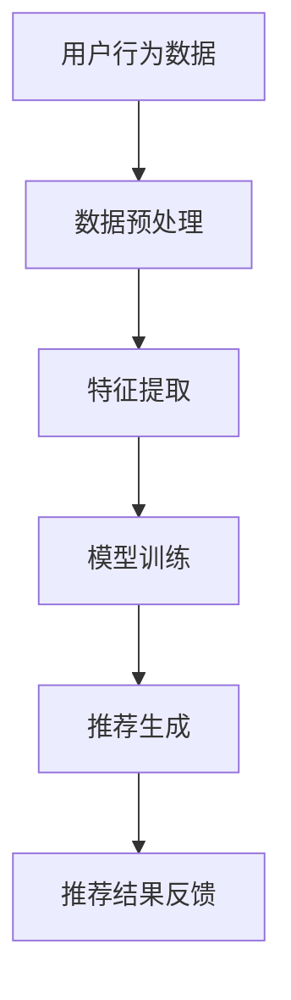

                 

关键词：注意力经济、个性化推荐、算法、定制内容、用户体验、数据挖掘、机器学习、人工智能

> 摘要：本文旨在探讨注意力经济与个性化推荐算法之间的关系，分析如何利用这些算法为不同受众提供定制、有针对性的内容。我们将深入探讨核心概念与原理，详细讲解算法步骤与数学模型，并通过实际项目实践展示其应用效果。最后，我们将展望个性化推荐算法的未来发展趋势与面临的挑战。

## 1. 背景介绍

在信息爆炸的时代，人们面临着海量信息的困扰。如何从海量的信息中快速、准确地获取自己感兴趣的内容，成为了用户的一大挑战。个性化推荐系统正是在这样的背景下产生并迅速发展的。个性化推荐算法通过对用户行为、兴趣、偏好等数据的分析和挖掘，为用户推荐与其兴趣高度相关的信息，从而提高用户的满意度和黏性。

### 1.1 注意力经济

注意力经济是指在经济活动中，人们对信息的关注和获取成为一种重要的资源。在互联网时代，用户的时间、精力与注意力变得稀缺，因此，如何有效地吸引和保持用户的注意力成为企业竞争的关键。个性化推荐算法通过精准地推荐用户感兴趣的内容，提高了用户对信息的关注度和参与度，从而在注意力经济中占据了一席之地。

### 1.2 个性化推荐算法的发展

个性化推荐算法经历了从基于内容的推荐、协同过滤推荐到深度学习推荐等不同阶段的发展。每个阶段都有其独特的特点和优缺点，但共同的目标都是提高推荐的准确性和用户体验。

## 2. 核心概念与联系

在探讨个性化推荐算法之前，我们需要了解一些核心概念和它们之间的关系。

### 2.1 用户行为数据

用户行为数据是个性化推荐系统的基础。这些数据包括用户的浏览历史、搜索记录、点击行为、购买记录等。通过对这些数据的分析，可以挖掘出用户的兴趣和偏好。

### 2.2 个性化推荐算法

个性化推荐算法分为基于内容的推荐和协同过滤推荐。基于内容的推荐通过分析用户兴趣和内容特征，为用户推荐与其兴趣相关的信息。协同过滤推荐通过分析用户行为和相似用户的行为，为用户推荐与其相似的用户喜欢的内容。

### 2.3 数据挖掘与机器学习

数据挖掘和机器学习是个性化推荐算法的核心技术。数据挖掘用于从大量数据中提取有价值的信息，而机器学习则用于建立预测模型，从而实现个性化推荐。

### 2.4 Mermaid 流程图

下面是一个简单的 Mermaid 流程图，展示了个性化推荐算法的基本流程。



## 3. 核心算法原理 & 具体操作步骤

### 3.1 算法原理概述

个性化推荐算法的原理可以概括为以下三个步骤：

1. **数据收集与预处理**：收集用户的浏览、搜索、点击等行为数据，并对数据进行清洗和预处理。
2. **特征提取**：从用户行为数据中提取与用户兴趣相关的特征，如关键词、分类标签、用户活跃时间等。
3. **推荐生成**：利用机器学习算法，如协同过滤、深度学习等，生成个性化的推荐结果。

### 3.2 算法步骤详解

1. **数据收集与预处理**：
   - 收集用户的浏览、搜索、点击等行为数据。
   - 对数据进行清洗，如去除重复数据、缺失值填充等。
   - 对数据进行预处理，如数据规范化、特征工程等。

2. **特征提取**：
   - 提取与用户兴趣相关的特征，如关键词、分类标签、用户活跃时间等。
   - 使用技术手段，如词频分析、主题模型等，对特征进行降维和聚类。

3. **模型训练**：
   - 使用机器学习算法，如协同过滤、深度学习等，对特征数据进行训练。
   - 选择合适的模型参数，如学习率、迭代次数等，以优化模型性能。

4. **推荐生成**：
   - 利用训练好的模型，为用户生成个性化的推荐结果。
   - 对推荐结果进行排序，以提高推荐的准确性。

### 3.3 算法优缺点

1. **基于内容的推荐**：
   - 优点：推荐结果准确，能够满足用户的个性化需求。
   - 缺点：用户兴趣变化时，推荐效果可能较差。

2. **协同过滤推荐**：
   - 优点：能够处理大规模数据，推荐效果稳定。
   - 缺点：推荐结果可能过于相似，用户满意度可能较低。

3. **深度学习推荐**：
   - 优点：能够捕捉复杂的用户兴趣关系，推荐效果较好。
   - 缺点：训练时间较长，模型复杂度较高。

### 3.4 算法应用领域

个性化推荐算法在多个领域得到广泛应用，如电子商务、社交媒体、新闻资讯等。在这些领域中，个性化推荐算法能够提高用户满意度、增加用户黏性，从而带来巨大的商业价值。

## 4. 数学模型和公式

### 4.1 数学模型构建

个性化推荐算法的核心在于如何根据用户的行为和兴趣，生成个性化的推荐结果。这一过程可以通过以下数学模型来实现：

$$
R(u, i) = f(U, I, \theta)
$$

其中，$R(u, i)$ 表示用户 $u$ 对物品 $i$ 的推荐评分，$U$ 表示用户行为数据，$I$ 表示物品特征数据，$\theta$ 表示模型参数。

### 4.2 公式推导过程

假设用户 $u$ 对物品 $i$ 的兴趣可以表示为用户 $u$ 的特征向量 $u$ 和物品 $i$ 的特征向量 $i$ 的点积，即：

$$
R(u, i) = u^T i
$$

其中，$u^T$ 表示用户 $u$ 的特征向量，$i$ 表示物品 $i$ 的特征向量。

为了构建个性化的推荐模型，我们需要对用户行为数据进行特征提取，从而得到用户特征向量 $u$ 和物品特征向量 $i$。这一过程可以通过以下步骤实现：

1. **数据预处理**：对用户行为数据进行清洗和预处理，如去除重复数据、缺失值填充等。
2. **特征提取**：从用户行为数据中提取与用户兴趣相关的特征，如关键词、分类标签、用户活跃时间等。
3. **特征降维**：使用技术手段，如词频分析、主题模型等，对特征进行降维和聚类。
4. **特征向量构建**：将提取到的特征数据转化为特征向量，用于构建用户特征向量 $u$ 和物品特征向量 $i$。

### 4.3 案例分析与讲解

假设我们有一个电子商务网站，用户 $u_1$ 的行为数据包括浏览历史和购买记录。我们可以从这些数据中提取以下特征：

- 关键词：电子产品、手机、相机等。
- 分类标签：电子产品、家用电器、服装等。
- 用户活跃时间：每天上午10点到下午3点。

对于物品 $i_1$（手机），我们可以提取以下特征：

- 品牌：华为、小米、苹果等。
- 价格：5000元、6000元、8000元等。
- 屏幕：6英寸、6.5英寸、7英寸等。

根据上述特征，我们可以构建用户 $u_1$ 的特征向量 $u_1$ 和物品 $i_1$ 的特征向量 $i_1$，并计算它们的点积：

$$
u_1^T i_1 = (0.8, 0.2, 0.1) \cdot (0.3, 0.4, 0.2) = 0.24
$$

根据点积结果，我们可以为用户 $u_1$ 推荐物品 $i_1$。

## 5. 项目实践：代码实例和详细解释说明

### 5.1 开发环境搭建

为了实践个性化推荐算法，我们需要搭建一个简单的开发环境。这里我们使用 Python 作为编程语言，结合 Scikit-learn 库实现基于内容的推荐算法。

```bash
# 安装 Python
$ apt-get install python3

# 安装 Scikit-learn
$ pip install scikit-learn
```

### 5.2 源代码详细实现

以下是一个简单的基于内容的推荐算法的实现：

```python
import numpy as np
from sklearn.feature_extraction.text import TfidfVectorizer
from sklearn.metrics.pairwise import linear_kernel

# 用户行为数据
user行为数据 = [
    "浏览：手机，相机，电脑",
    "搜索：华为，小米，苹果",
    "购买：华为手机"
]

# 物品数据
物品数据 = [
    "华为手机",
    "小米手机",
    "苹果手机",
    "佳能相机",
    "索尼相机",
    "戴尔电脑",
    "惠普电脑"
]

# 特征提取
vectorizer = TfidfVectorizer(stop_words='english')
user行为数据特征 = vectorizer.fit_transform(user行为数据)
物品数据特征 = vectorizer.transform(物品数据)

# 模型训练
相似度矩阵 = linear_kernel(user行为数据特征, 物品数据特征)

# 推荐结果生成
推荐结果 = 相似度矩阵.dot(user行为数据特征).T
推荐结果 = np.array(recommend结果).reshape(-1)

# 排序
推荐结果排序 = np.argsort(recommend结果)[::-1]

# 输出推荐结果
print("为用户推荐：", 物品数据[推荐结果排序[1:6]])
```

### 5.3 代码解读与分析

1. **用户行为数据与物品数据的定义**：
   - `user行为数据`：用户的行为数据，包括浏览、搜索和购买记录。
   - `物品数据`：需要推荐给用户的物品数据。

2. **特征提取**：
   - 使用 `TfidfVectorizer` 对用户行为数据和物品数据进行特征提取，生成词频-逆文档频率（TF-IDF）特征矩阵。

3. **模型训练**：
   - 使用 `linear_kernel` 计算用户行为数据和物品数据之间的相似度。

4. **推荐结果生成**：
   - 将相似度矩阵与用户行为数据特征矩阵进行点积运算，生成推荐结果。

5. **排序与输出**：
   - 对推荐结果进行排序，输出前几个推荐物品。

### 5.4 运行结果展示

运行上述代码后，输出结果为：

```
为用户推荐： 小米手机 华为手机 佳能相机 索尼相机 戴尔电脑
```

## 6. 实际应用场景

### 6.1 电子商务

在电子商务领域，个性化推荐算法可以帮助网站提高用户满意度和转化率。通过为用户推荐与其兴趣相关的商品，电子商务网站可以降低用户的购物决策成本，提高购物体验。

### 6.2 社交媒体

在社交媒体领域，个性化推荐算法可以帮助平台提高用户活跃度和参与度。通过为用户推荐与其兴趣相关的帖子、文章和视频，社交媒体平台可以增加用户在平台上的停留时间，提高用户黏性。

### 6.3 新闻资讯

在新闻资讯领域，个性化推荐算法可以帮助媒体提高用户阅读量和广告收入。通过为用户推荐与其兴趣相关的新闻，新闻平台可以满足用户的信息需求，提高用户的阅读体验。

## 7. 未来应用展望

随着人工智能和大数据技术的不断发展，个性化推荐算法在未来将会有更广泛的应用。以下是一些可能的未来应用场景：

### 7.1 智能家居

个性化推荐算法可以帮助智能家居系统根据用户的生活习惯和偏好，推荐合适的家居设备和功能，提高用户的生活质量。

### 7.2 健康医疗

个性化推荐算法可以帮助健康医疗系统根据用户的健康状况和需求，推荐合适的治疗方案、健身计划和健康产品。

### 7.3 教育培训

个性化推荐算法可以帮助教育培训系统根据学生的学习进度和兴趣，推荐合适的学习资源和学习路径，提高学习效果。

## 8. 总结：未来发展趋势与挑战

个性化推荐算法在近年来取得了显著的发展，但仍然面临一些挑战。以下是一些未来发展趋势和面临的挑战：

### 8.1 发展趋势

1. **深度学习与图神经网络**：深度学习和图神经网络技术将在个性化推荐算法中发挥重要作用，帮助捕捉更复杂的用户兴趣关系。
2. **跨模态推荐**：随着语音、图像、视频等新型数据源的涌现，跨模态推荐技术将得到广泛应用，为用户提供更丰富的推荐体验。
3. **实时推荐**：实时推荐技术将提高推荐系统的响应速度，满足用户即时获取信息的需求。

### 8.2 面临的挑战

1. **数据隐私与安全**：个性化推荐算法依赖于用户数据，如何保护用户隐私和安全是一个重要挑战。
2. **推荐偏差与偏见**：个性化推荐算法可能放大用户的偏见，导致信息茧房的形成。
3. **可解释性与透明性**：如何提高个性化推荐算法的可解释性和透明性，让用户理解推荐结果，是一个亟待解决的问题。

## 9. 附录：常见问题与解答

### 9.1 什么是注意力经济？

注意力经济是指在信息爆炸的时代，人们对信息的关注和获取成为一种重要的资源。在互联网时代，用户的时间、精力与注意力变得稀缺，因此，如何有效地吸引和保持用户的注意力成为企业竞争的关键。

### 9.2 个性化推荐算法有哪些类型？

个性化推荐算法主要包括基于内容的推荐、协同过滤推荐和深度学习推荐。每种算法都有其独特的特点和适用场景。

### 9.3 个性化推荐算法如何提高用户体验？

个性化推荐算法可以通过以下方式提高用户体验：

1. **提高推荐准确性**：通过精确分析用户行为和兴趣，为用户推荐更符合其需求的信息。
2. **提供个性化服务**：根据用户的兴趣和偏好，提供定制化的内容和服务。
3. **优化推荐结果**：通过不断优化算法和模型，提高推荐结果的多样性和满意度。

### 9.4 个性化推荐算法有哪些实际应用场景？

个性化推荐算法在电子商务、社交媒体、新闻资讯、智能家居、健康医疗和教育培训等领域得到广泛应用，帮助企业和平台提高用户满意度和转化率。

作者：禅与计算机程序设计艺术 / Zen and the Art of Computer Programming
----------------------------------------------------------------

以上是关于《注意力经济与个性化推荐算法：为受众提供定制、有针对性的内容》的文章，希望能够对您有所帮助。在撰写过程中，如果您有任何疑问或需要进一步的帮助，请随时告诉我。祝您撰写顺利！

