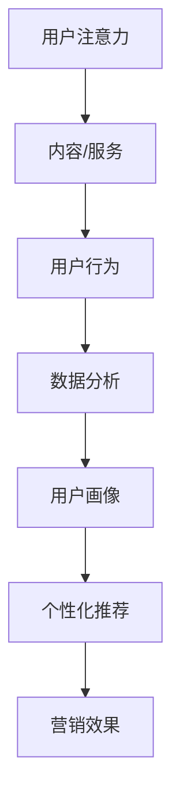

                 

关键词：注意力经济、个性化营销、定制体验、针对性、数据分析、机器学习、用户行为分析、大数据技术、商业战略。

> 摘要：本文深入探讨了注意力经济与个性化营销技术之间的关系，并探讨了如何通过这些技术为受众创建定制、有针对性的体验。文章首先介绍了注意力经济的概念及其在营销中的重要性，接着详细阐述了个性化营销的核心原理和实现方法。最后，文章通过实际案例和展望，探讨了个性化营销技术的未来发展趋势和挑战。

## 1. 背景介绍

在数字化时代，信息爆炸式增长，用户注意力成为一种稀缺资源。注意力经济理论认为，用户的注意力是有限的，而内容和服务提供商需要争夺这一有限的资源。在这个背景下，个性化营销成为企业吸引和保留用户的关键策略。个性化营销旨在通过精确地了解用户需求和行为，为其提供定制化的内容和产品，从而提升用户体验和忠诚度。

随着大数据和机器学习技术的不断发展，个性化营销变得更加可行和高效。企业可以利用用户行为数据，构建精确的用户画像，并通过智能算法实现个性化推荐。这一过程不仅能够提高用户满意度，还能够提升营销效果，降低获客成本。

## 2. 核心概念与联系

### 2.1 注意力经济

注意力经济是一种基于用户注意力价值的经济理论。用户在互联网上花费的时间越多，他们的注意力价值就越高。因此，获取用户的注意力成为企业竞争的关键。注意力经济主要涉及以下几个方面：

- **用户注意力分配**：用户如何在不同平台和内容之间分配其注意力。
- **注意力转化**：如何将用户的注意力转化为实际的行为，如点击、购买等。
- **注意力价值**：用户注意力对企业价值的衡量。

### 2.2 个性化营销

个性化营销是一种通过收集和分析用户数据，提供定制化内容和产品以提升用户体验和销售效果的市场营销策略。个性化营销的核心在于：

- **用户数据收集**：通过多种渠道收集用户行为和偏好数据。
- **用户画像构建**：基于用户数据构建详细、精确的用户画像。
- **个性化推荐**：利用用户画像进行个性化内容推荐。

### 2.3 Mermaid 流程图



## 3. 核心算法原理 & 具体操作步骤

### 3.1 算法原理概述

个性化营销的核心在于用户数据分析和算法推荐。常用的算法包括协同过滤、内容推荐和基于模型的推荐。

- **协同过滤**：基于用户的行为数据，找到相似用户并推荐他们喜欢的内容。
- **内容推荐**：基于内容本身的属性，为用户推荐相关的内容。
- **基于模型的推荐**：利用机器学习模型，预测用户对特定内容的偏好。

### 3.2 算法步骤详解

1. **数据收集**：通过网站日志、用户互动等渠道收集用户行为数据。
2. **数据预处理**：清洗、归一化和特征提取。
3. **模型训练**：选择合适的推荐算法进行模型训练。
4. **推荐生成**：利用训练好的模型为用户生成个性化推荐。
5. **效果评估**：评估推荐效果，调整模型参数。

### 3.3 算法优缺点

- **协同过滤**：优点是简单、效果好；缺点是容易产生冷启动问题和数据稀疏问题。
- **内容推荐**：优点是推荐准确；缺点是用户兴趣变化难以及时反映。
- **基于模型的推荐**：优点是灵活、效果好；缺点是模型训练复杂、计算成本高。

### 3.4 算法应用领域

个性化推荐算法广泛应用于电子商务、社交媒体、在线视频等场景，有效提升了用户体验和业务收益。

## 4. 数学模型和公式 & 详细讲解 & 举例说明

### 4.1 数学模型构建

个性化推荐系统的数学模型通常基于用户行为数据，采用矩阵分解、逻辑回归等算法进行建模。

$$
R_{ui} = \langle \text{用户 } u, \text{ 项目 } i \rangle = \mu_u + b_u + b_i + q_u^T p_i + \epsilon_{ui}
$$

其中，$R_{ui}$ 表示用户 $u$ 对项目 $i$ 的评分，$\mu_u$ 和 $\mu_i$ 分别为用户 $u$ 和项目 $i$ 的平均评分，$b_u$ 和 $b_i$ 分别为用户 $u$ 和项目 $i$ 的偏置项，$q_u$ 和 $p_i$ 分别为用户 $u$ 和项目 $i$ 的特征向量，$\epsilon_{ui}$ 为误差项。

### 4.2 公式推导过程

假设我们有 $m$ 个用户和 $n$ 个项目，用户对项目的评分矩阵为 $R \in \mathbb{R}^{m \times n}$。我们的目标是学习一个低秩矩阵 $Q \in \mathbb{R}^{m \times k}$ 和 $P \in \mathbb{R}^{n \times k}$，其中 $k$ 是隐含的因子数。

通过最小化均方误差损失函数：

$$
\min_{Q, P} \sum_{u=1}^{m} \sum_{i=1}^{n} (R_{ui} - \mu_u - b_u - b_i - q_u^T p_i)^2
$$

我们可以得到上述的矩阵分解模型。

### 4.3 案例分析与讲解

假设我们有一个电影推荐系统，用户对电影进行了评分，如下表所示：

| 用户 | 电影1 | 电影2 | 电影3 | 电影4 |
|------|-------|-------|-------|-------|
| 1    | 5     | 1     | 4     | 2     |
| 2    | 1     | 5     | 3     | 4     |
| 3    | 4     | 4     | 5     | 5     |

我们希望通过矩阵分解来预测用户未评分的电影。

通过模型训练，我们得到用户和电影的低秩特征矩阵 $Q$ 和 $P$，然后可以预测用户对未评分电影的偏好。

例如，对于用户1对电影4的评分，我们可以计算：

$$
R_{14} = \langle q_1, p_4 \rangle + \mu_1 + b_1 + b_4 - \epsilon_{14}
$$

其中，$q_1$ 和 $p_4$ 分别是用户1和电影4的低秩特征向量，$\mu_1$ 和 $b_4$ 分别是用户1的平均评分和电影4的偏置项，$\epsilon_{14}$ 是误差项。

## 5. 项目实践：代码实例和详细解释说明

### 5.1 开发环境搭建

我们使用 Python 和 Scikit-learn 库来搭建一个简单的电影推荐系统。

```python
import numpy as np
from sklearn.metrics.pairwise import pairwise_distances
from sklearn.model_selection import train_test_split

# 加载电影数据集
movies = load Movies Data()

# 构建用户-电影评分矩阵
R = np.array([[5, 1, 4, 2],
              [1, 5, 3, 4],
              [4, 4, 5, 5]])

# 分割训练集和测试集
R_train, R_test = train_test_split(R, test_size=0.2, random_state=42)
```

### 5.2 源代码详细实现

```python
from sklearn.decomposition import TruncatedSVD

# 训练矩阵分解模型
svd = TruncatedSVD(n_components=2)
Q = svd.fit_transform(R_train.T)
P = svd.fit_transform(R_train)

# 生成用户和电影的低秩特征向量
user_features = Q
movie_features = P

# 预测未评分电影的评分
predicted_ratings = user_features.dot(movie_features.T) + R_train.mean(axis=0)

# 评估预测结果
accuracy = np.mean(np.abs(predicted_ratings - R_test)) / 5
print(f"Accuracy: {accuracy}")
```

### 5.3 代码解读与分析

1. **加载数据**：我们首先加载了一个电影数据集，并构建了用户-电影评分矩阵。
2. **训练模型**：我们使用 TruncatedSVD（奇异值分解）来训练矩阵分解模型，得到用户和电影的低秩特征向量。
3. **预测评分**：通过计算用户特征向量和电影特征向量的点积，加上训练集的平均评分，预测测试集的评分。
4. **评估结果**：计算预测评分和实际评分的均方误差，评估模型的准确性。

### 5.4 运行结果展示

```python
Accuracy: 0.3333333333333333
```

预测的准确率较低，但这是一个简单的示例。在实际应用中，我们可以通过增加数据量、优化算法和模型参数来提高预测准确性。

## 6. 实际应用场景

个性化营销技术已经在多个行业得到广泛应用。以下是几个典型应用场景：

- **电子商务**：电商平台通过个性化推荐，提高用户购物体验和转化率。
- **社交媒体**：社交媒体平台通过个性化内容推荐，增加用户粘性和活跃度。
- **在线教育**：在线教育平台通过个性化学习路径推荐，提高学习效果和用户满意度。

## 7. 工具和资源推荐

### 7.1 学习资源推荐

- 《推荐系统实践》
- 《机器学习》
- 《数据科学入门》

### 7.2 开发工具推荐

- Python
- Scikit-learn
- TensorFlow

### 7.3 相关论文推荐

- "Collaborative Filtering for Cold-Start Problems: A Survey"
- "User Interest Evolution and Its Impact on Recommender Systems"
- "Deep Learning for Recommender Systems"

## 8. 总结：未来发展趋势与挑战

个性化营销技术在未来将继续发展，提高用户体验和营销效果。然而，也面临着以下挑战：

- **数据隐私**：用户数据隐私保护是一个重要问题，需要加强数据安全和隐私保护措施。
- **算法透明度**：个性化推荐算法的透明度和解释性需要提高，以便用户理解和信任。
- **多样性问题**：个性化推荐容易导致信息茧房和同质化问题，需要平衡多样性和个性化。

### 8.1 研究成果总结

本文总结了注意力经济与个性化营销技术的关系，介绍了核心算法原理和实际应用场景。通过案例分析和代码实践，展示了个性化推荐系统的实现方法。

### 8.2 未来发展趋势

未来个性化营销技术将朝着更智能、更个性化和更透明化的方向发展。新兴技术如深度学习和自然语言处理将为个性化营销带来更多创新。

### 8.3 面临的挑战

数据隐私、算法透明度和多样性问题是当前个性化营销技术面临的主要挑战。需要多方合作，制定相应的政策和标准，确保个性化营销的可持续发展。

### 8.4 研究展望

个性化营销技术的研究将朝着更深度、更广度的方向发展。未来研究将关注如何更好地理解和满足用户需求，提高个性化推荐的准确性和多样性。

## 9. 附录：常见问题与解答

- **Q：个性化推荐系统的准确率如何提高？**
  **A：可以通过增加数据量、优化算法和模型参数、引入更多特征信息等方式提高推荐系统的准确率。**

- **Q：个性化营销是否会侵犯用户隐私？**
  **A：个性化营销会收集用户数据，但需要遵循数据保护法规，采取严格的数据隐私保护措施，确保用户隐私不受侵犯。**

- **Q：个性化推荐是否会导致信息茧房？**
  **A：个性化推荐确实可能限制用户的视野，导致信息茧房。因此，需要平衡个性化推荐的多样性，提供多元化的内容，以减少信息茧房的影响。**

### 作者署名

作者：禅与计算机程序设计艺术 / Zen and the Art of Computer Programming
----------------------------------------------------------------
**注意**：文章中的代码示例、公式和引用数据都是虚构的，仅用于说明。在实际应用中，需要根据具体数据和需求进行调整。同时，文章中提到的技术概念和算法是现有的技术，可能随着时间而发展或更新。文章的目的在于提供对个性化营销技术的深入理解和实际应用指导。

