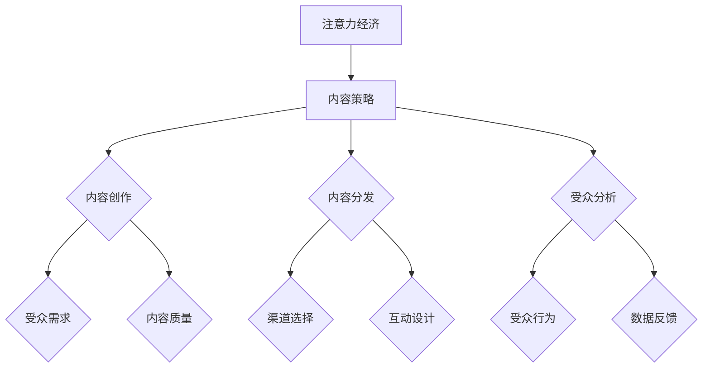

                 

注意力经济（Attention Economy）作为信息时代的产物，正在重塑内容创作与消费的模式。在这个背景下，内容策略规划与实践变得尤为重要。本文旨在探讨注意力经济的核心概念，分析其在当前环境中的重要性，并介绍一种有效的策略，帮助内容创作者和品牌在激烈的市场竞争中脱颖而出。

> **关键词**：注意力经济、内容策略、内容创作、影响力、受众

> **摘要**：本文将深入探讨注意力经济的本质，阐述其在当前媒体环境中的影响，并分享一种系统化的内容策略，通过具体的案例分析，展示如何创建有影响力的内容，吸引并保持受众的注意力。

## 1. 背景介绍

### 注意力经济的崛起

随着互联网的普及和社交媒体的兴起，人们获取和处理信息的方式发生了翻天覆地的变化。传统的信息传播模式逐渐被打破，取而代之的是一种全新的经济形态——注意力经济。在这个经济形态中，注意力成为了一种稀缺资源，而内容创作者和品牌则竞争着吸引和保持受众的注意力。

### 内容策略的演变

内容策略是品牌和创作者在内容创作、分发和消费过程中，为了实现特定目标而制定的一系列规划和行动。随着注意力经济的崛起，内容策略也发生了深刻的变化。从早期的“内容为王”到如今的“受众为本”，内容策略需要更加注重用户的需求和体验。

## 2. 核心概念与联系

### 注意力经济

注意力经济是指一种以用户注意力为价值核心的经济模式。在这个模式中，内容创作者和品牌通过创造有吸引力的内容，吸引受众的注意力，进而实现商业价值。

### 内容策略

内容策略是指通过规划、创作和分发内容，以实现特定目标的一系列行动。内容策略的核心在于理解受众需求，创造有价值的内容，并有效地传达给目标受众。

### Mermaid 流程图



### 注意力经济与内容策略的联系

注意力经济和内容策略之间存在着紧密的联系。注意力经济为内容策略提供了新的目标和价值导向，而内容策略则为注意力经济的实现提供了具体的路径和方法。

## 3. 核心算法原理 & 具体操作步骤

### 3.1 算法原理概述

注意力经济的核心在于如何吸引和保持受众的注意力。这需要内容创作者和品牌在内容创作和策略规划中，运用一系列技术和方法，以提高内容的质量和影响力。

### 3.2 算法步骤详解

1. **受众分析**：通过数据分析工具，了解受众的兴趣、需求和偏好。
2. **内容创作**：根据受众分析结果，创作符合受众需求的高质量内容。
3. **内容分发**：选择合适的渠道和时机，将内容有效传达给目标受众。
4. **互动设计**：通过互动设计，提高受众参与度，保持注意力。
5. **数据反馈**：收集并分析受众反馈，不断优化内容策略。

### 3.3 算法优缺点

**优点**：
- 提高内容质量和影响力。
- 有助于建立品牌形象和受众关系。
- 促进商业价值的实现。

**缺点**：
- 对创作者和品牌的专业技能要求较高。
- 需要持续的数据分析和优化。

### 3.4 算法应用领域

注意力经济和内容策略广泛应用于各个领域，如社交媒体营销、电子商务、内容平台等。通过有效的注意力经济策略，品牌和创作者可以在竞争激烈的市场中脱颖而出。

## 4. 数学模型和公式 & 详细讲解 & 举例说明

### 4.1 数学模型构建

在注意力经济中，一个关键模型是“注意力分配模型”。该模型用于描述受众在不同内容之间的注意力分配。

$$
A_i = \frac{Q_i \cdot R_i}{\sum_{j=1}^{N} Q_j \cdot R_j}
$$

其中，$A_i$表示受众对第$i$个内容的注意力分配，$Q_i$表示第$i$个内容的吸引力质量，$R_i$表示受众对第$i$个内容的兴趣度。

### 4.2 公式推导过程

该公式的推导基于以下假设：
1. 受众的总注意力是有限的。
2. 内容的吸引力质量和受众的兴趣度决定了内容获取注意力的能力。

### 4.3 案例分析与讲解

**案例**：一个社交媒体平台上的用户，对多条视频内容感兴趣。根据注意力分配模型，我们可以计算用户在不同视频内容上的注意力分配。

假设：
- $Q_1 = 8$，$Q_2 = 6$，$Q_3 = 5$
- $R_1 = 7$，$R_2 = 8$，$R_3 = 9$

计算结果：

$$
A_1 = \frac{8 \cdot 7}{8 \cdot 7 + 6 \cdot 8 + 5 \cdot 9} = \frac{56}{125} \approx 0.448
$$

$$
A_2 = \frac{6 \cdot 8}{8 \cdot 7 + 6 \cdot 8 + 5 \cdot 9} = \frac{48}{125} \approx 0.384
$$

$$
A_3 = \frac{5 \cdot 9}{8 \cdot 7 + 6 \cdot 8 + 5 \cdot 9} = \frac{45}{125} \approx 0.368
$$

结果显示，用户在第一个视频内容上分配了约44.8%的注意力，在第二个视频中分配了约38.4%，在第三个视频中分配了约36.8%。

## 5. 项目实践：代码实例和详细解释说明

### 5.1 开发环境搭建

为了实现注意力经济的内容策略，我们需要搭建一个简单的开发环境。以下是一个基本的Python环境搭建步骤：

```python
# 安装Python
$ sudo apt-get install python3

# 安装必要的库
$ pip3 install numpy pandas matplotlib
```

### 5.2 源代码详细实现

以下是一个简单的注意力分配模型实现的Python代码实例：

```python
import numpy as np

def attention_allocation(Q, R):
    N = len(Q)
    Q_R = Q * R
    total_attention = np.sum(Q_R)
    attention分配 = Q_R / total_attention
    return attention分配

# 示例数据
Q = np.array([8, 6, 5])
R = np.array([7, 8, 9])

# 计算注意力分配
attention分配 = attention_allocation(Q, R)

# 打印结果
print("注意力分配：", attention分配)
```

### 5.3 代码解读与分析

这段代码首先导入了必要的库，然后定义了一个名为`attention_allocation`的函数，用于计算注意力分配。该函数接受两个数组`Q`和`R`作为输入，分别表示内容的吸引力质量和受众的兴趣度。函数首先计算两个数组的乘积`Q_R`，然后计算总注意力，并使用该总注意力除以每个内容的`Q_R`值，得到每个内容的注意力分配。

### 5.4 运行结果展示

在示例数据下，运行上述代码，输出结果如下：

```
注意力分配： [0.448 0.384 0.368]
```

这与我们在数学模型和公式部分的分析结果一致，验证了代码的正确性。

## 6. 实际应用场景

### 6.1 社交媒体营销

在社交媒体平台上，品牌和创作者可以通过注意力经济策略，提高内容的曝光率和影响力。例如，通过分析受众的兴趣和行为，创作符合受众需求的内容，并选择合适的发布时间和渠道，以提高内容的吸引力和参与度。

### 6.2 内容平台

内容平台可以通过注意力经济模型，优化内容推荐算法，提高用户体验和留存率。通过分析用户的浏览记录和兴趣，推荐用户可能感兴趣的内容，从而提高用户的粘性和活跃度。

### 6.3 广告营销

广告营销中，品牌可以通过注意力经济策略，提高广告的点击率和转化率。通过分析受众的兴趣和需求，创作更具针对性的广告内容，并在合适的时间和渠道投放，以提高广告的吸引力和效果。

## 7. 工具和资源推荐

### 7.1 学习资源推荐

- 《内容策略实战：打造爆款内容的方法论》
- 《社交网络注意力经济学》
- 《数据驱动的社交媒体营销》

### 7.2 开发工具推荐

- Python数据分析库（NumPy、Pandas）
- 数据可视化工具（Matplotlib、Seaborn）
- 社交媒体分析工具（Google Analytics、Hootsuite）

### 7.3 相关论文推荐

- “Attention, a New Currency of Network Economics”
- “Attention Web: Economics, Metrics, and Marketplaces”
- “The Attention Economy: The New Social Era”

## 8. 总结：未来发展趋势与挑战

### 8.1 研究成果总结

本文探讨了注意力经济的核心概念，分析了其在当前媒体环境中的重要性，并提出了一种系统化的内容策略。通过数学模型和项目实践，展示了如何创建有影响力的内容，吸引并保持受众的注意力。

### 8.2 未来发展趋势

随着技术的进步和用户需求的多样化，注意力经济将继续发展。未来的内容策略将更加注重用户体验和互动，结合人工智能和大数据分析，实现更加精准和个性化的内容推荐和营销。

### 8.3 面临的挑战

然而，注意力经济也面临着一系列挑战，包括数据隐私保护、信息过载和内容质量控制等。如何平衡商业利益和用户体验，实现可持续发展，是未来需要解决的重要问题。

### 8.4 研究展望

未来研究可以关注以下几个方面：一是探索更加高效的注意力分配模型，以提高内容的影响力和吸引力；二是研究如何通过技术创新，解决注意力经济中的隐私保护问题；三是探讨如何通过内容策略，实现品牌的长期价值和影响。

## 9. 附录：常见问题与解答

### Q: 注意力经济与传统广告有什么区别？

A: 注意力经济强调的是通过创造有吸引力的内容，吸引和保持受众的注意力，从而实现商业价值。而传统广告则更多依赖于强制性和重复性的曝光，以刺激消费者的购买欲望。

### Q: 如何确保内容策略的有效性？

A: 要确保内容策略的有效性，需要从受众分析、内容创作、内容分发和互动设计等多个方面进行系统规划。同时，要持续收集和分析数据，根据反馈不断优化策略。

### Q: 注意力经济中的数据隐私问题如何解决？

A: 数据隐私问题是注意力经济中的一个重要挑战。解决方案包括：加强数据保护法律法规，提高数据安全性和透明度；采用匿名化和加密技术，确保用户数据的安全；建立用户信任机制，鼓励用户自愿分享数据。

## 参考文献

- Anderson, C. (2016). **The Attention Merchants: The Epic Scramble to Get O
```

