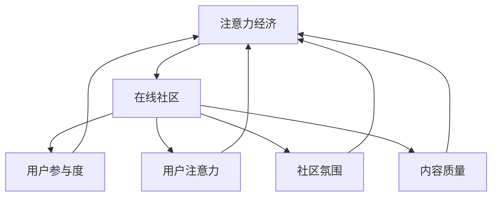
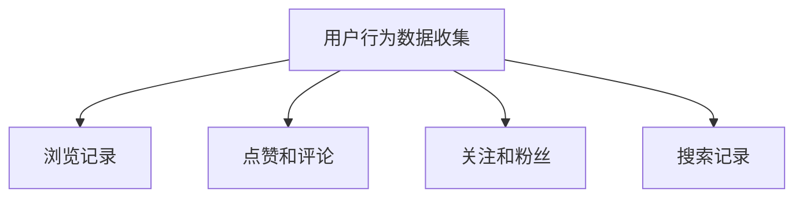
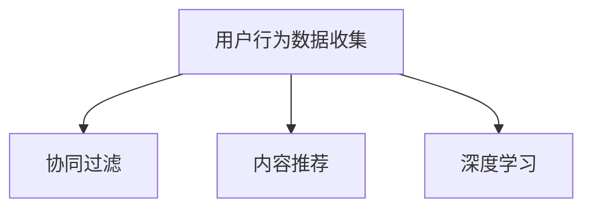
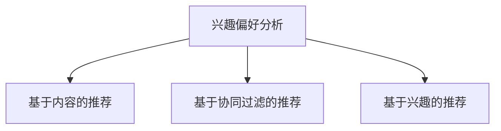
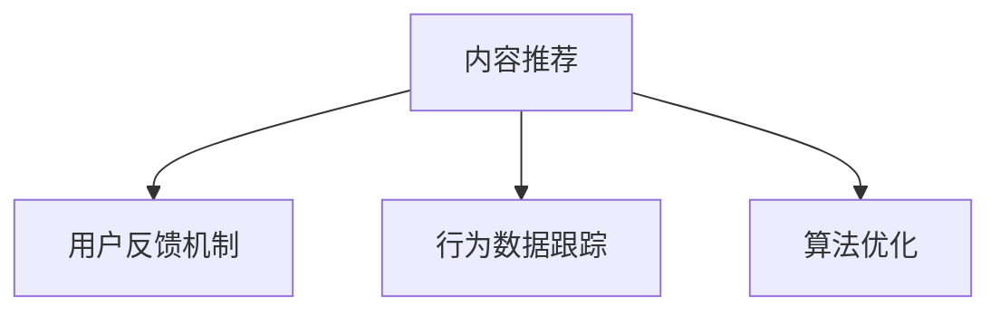
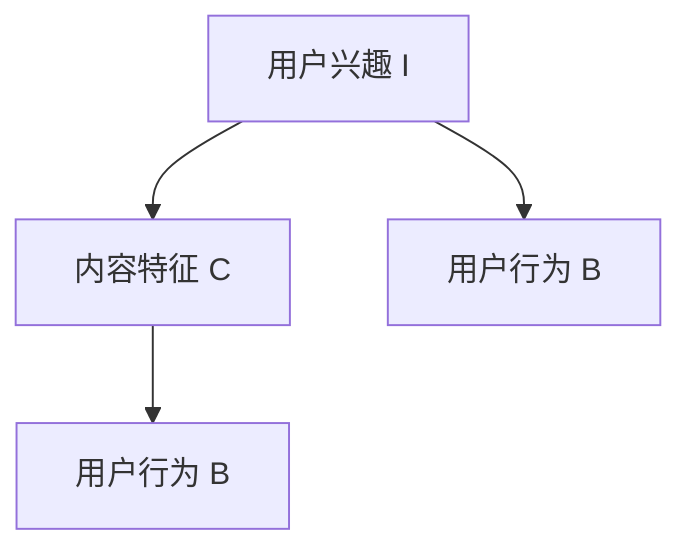

                 

### 1. 背景介绍

在数字化的时代背景下，互联网的普及和应用已经深入到人们生活的方方面面。社交媒体、在线论坛、内容分享平台等已经成为人们获取信息、交流观点和互动的重要场所。而在这个虚拟的世界中，注意力成为了最稀缺的资源。如何吸引并留住忠实的粉丝和受众，成为众多在线社区和内容创作者面临的重大挑战。

注意力经济是一种基于用户注意力的经济模式，其核心在于通过内容和服务的提供，吸引和维持用户的关注，进而实现商业价值。在线社区作为注意力经济的重要载体，其成功与否往往取决于能否有效地吸引并留住用户。本文将围绕注意力经济与在线社区建设策略展开讨论，旨在为内容创作者和社区运营者提供有价值的参考。

首先，我们将介绍注意力经济的基本原理，探讨其与在线社区建设之间的内在联系。接着，通过分析现有在线社区的成功案例，总结出一套有效的建设策略。随后，我们将深入探讨核心算法原理、数学模型以及具体操作步骤。此外，还将通过项目实践和代码实例，提供实际操作的指导。最后，我们将展望未来应用场景和发展趋势，并推荐相关的学习资源和开发工具。

本文将致力于为读者提供一个全面、系统的在线社区建设策略，帮助他们在注意力经济时代脱颖而出，吸引并留住忠实的粉丝和受众。

### 2. 核心概念与联系

在深入探讨注意力经济与在线社区建设策略之前，我们需要明确几个核心概念，并了解它们之间的联系。

#### 注意力经济

注意力经济（Attention Economy）是一种基于用户注意力的经济模式。在这个模式中，用户的注意力被视为一种稀缺资源，而内容和服务的提供者则通过争夺用户的注意力来创造价值。注意力经济起源于互联网的兴起，随着社交媒体和在线内容平台的普及，其重要性愈发凸显。在注意力经济中，用户的时间和注意力是有限的，如何有效地吸引并保持用户的关注，成为了商业成功的关键。

#### 在线社区

在线社区是指通过互联网平台连接起来的用户群体，他们共同分享兴趣、交流观点、获取信息等。在线社区可以有多种形式，如社交媒体、论坛、内容分享平台等。在线社区的成功离不开用户的积极参与和持续的互动。因此，构建一个健康、活跃的在线社区，成为了众多内容创作者和运营者的目标。

#### 核心概念与联系

注意力经济与在线社区建设之间的联系体现在以下几个方面：

1. **用户参与度**：在线社区的建设策略需要充分考虑用户的参与度，通过提供有价值的内容和互动机制，吸引和留住用户。

2. **用户注意力**：在注意力经济中，用户注意力被视为一种重要的资源。在线社区通过吸引和保持用户的注意力，实现商业价值的转化。

3. **社区氛围**：一个良好的社区氛围能够提升用户的归属感和参与度，从而增强社区的凝聚力。

4. **内容质量**：高质量的内容是吸引和留住用户的关键。在线社区需要持续提供有价值、有吸引力的内容，以满足用户的需求。

为了更好地理解这些核心概念，我们可以通过一个Mermaid流程图来展示它们之间的联系：



在这个流程图中，我们可以看到注意力经济与在线社区建设之间的相互作用。注意力经济为在线社区提供了理论基础，而在线社区的建设又进一步促进了注意力经济的发展。通过优化用户参与度、用户注意力、社区氛围和内容质量，在线社区可以更好地适应注意力经济的要求，实现持续发展和商业价值的提升。

### 3. 核心算法原理 & 具体操作步骤

在理解了注意力经济和在线社区建设的基本概念后，我们需要进一步探讨其核心算法原理，并了解具体的操作步骤。

#### 3.1 算法原理概述

注意力经济的核心算法可以归结为“注意力分配算法”。该算法的基本思想是通过分析用户的行为数据和兴趣偏好，将有限的注意力资源分配到最具有价值和吸引力的内容和活动上。具体来说，注意力分配算法包括以下几个关键步骤：

1. **用户行为数据收集**：通过用户在平台上的活动数据，如浏览记录、点赞、评论等，收集用户的兴趣偏好和行为习惯。

2. **兴趣偏好分析**：利用机器学习算法，对用户的行为数据进行处理和分析，识别用户的兴趣偏好。

3. **内容推荐**：根据用户的兴趣偏好，推荐最相关的内容和活动，以吸引和留住用户的注意力。

4. **反馈调整**：通过用户的反馈和行为数据，对推荐结果进行调整和优化，以提高推荐的准确性和吸引力。

#### 3.2 算法步骤详解

接下来，我们将详细讲解注意力分配算法的具体步骤：

##### 步骤1：用户行为数据收集

首先，我们需要收集用户在平台上的各种行为数据。这些数据可以包括：

- 浏览记录：用户访问过的页面和内容。
- 点赞和评论：用户对内容的评价和反馈。
- 关注和粉丝：用户关注的其他用户和粉丝群体。
- 搜索记录：用户在平台上的搜索关键词和查询历史。

通过这些行为数据，我们可以了解用户的兴趣和行为模式。



##### 步骤2：兴趣偏好分析

在收集到用户行为数据后，我们需要利用机器学习算法，对用户的行为数据进行处理和分析，以识别用户的兴趣偏好。常用的算法包括协同过滤、内容推荐和深度学习等。

1. **协同过滤**：通过分析用户之间的相似性，推荐用户可能感兴趣的内容。

2. **内容推荐**：通过分析内容本身的特征，推荐与用户兴趣相关的内容。

3. **深度学习**：利用深度神经网络，从用户的行为数据中自动学习用户的兴趣偏好。



##### 步骤3：内容推荐

根据用户的兴趣偏好，我们可以推荐最相关的内容和活动，以吸引和留住用户的注意力。推荐系统是一个复杂的系统，需要考虑多种因素，如内容的多样性、相关性、新颖性等。

1. **基于内容的推荐**：推荐与用户兴趣相关的内容。

2. **基于协同过滤的推荐**：推荐与用户兴趣相似的其他用户正在关注的内容。

3. **基于兴趣的推荐**：推荐符合用户兴趣的新内容和活动。



##### 步骤4：反馈调整

最后，我们需要通过用户的反馈和行为数据，对推荐结果进行调整和优化，以提高推荐的准确性和吸引力。反馈调整可以包括以下几种方式：

1. **用户反馈机制**：通过用户对推荐的评分和评论，收集用户对推荐内容的反馈。

2. **行为数据跟踪**：跟踪用户对推荐内容的点击、浏览、分享等行为，以评估推荐的准确性。

3. **算法优化**：根据用户的反馈和行为数据，对推荐算法进行调整和优化，提高推荐的准确性。



#### 3.3 算法优缺点

注意力分配算法在在线社区建设中具有以下优缺点：

##### 优点：

1. **个性化推荐**：根据用户的兴趣偏好，提供个性化的推荐内容，提高用户的满意度。
2. **高效吸引注意力**：通过推荐与用户兴趣相关的内容，能够快速吸引和留住用户的注意力。
3. **持续优化**：通过用户的反馈和行为数据，不断调整和优化推荐算法，提高推荐效果。

##### 缺点：

1. **数据隐私问题**：在收集和处理用户行为数据时，可能会涉及用户隐私问题，需要确保数据的安全和隐私。
2. **算法偏见**：如果算法设计不合理，可能会导致推荐结果出现偏见，影响用户的体验。
3. **资源消耗**：注意力分配算法需要大量的计算资源和存储空间，对系统性能有一定要求。

#### 3.4 算法应用领域

注意力分配算法在在线社区建设中的应用非常广泛，包括以下几个方面：

1. **内容推荐**：在各种内容平台，如新闻网站、社交媒体、博客等，通过注意力分配算法推荐用户感兴趣的内容。
2. **广告投放**：在广告营销中，通过注意力分配算法，推荐与用户兴趣相关的高质量广告，提高广告的点击率和转化率。
3. **社交媒体互动**：在社交媒体平台，通过注意力分配算法，推荐用户可能感兴趣的用户、话题和活动，增强用户的参与度和活跃度。
4. **在线教育**：在在线教育平台，通过注意力分配算法，推荐与用户学习兴趣相关的内容和课程，提高用户的学习效果和满意度。

总之，注意力分配算法作为在线社区建设的重要工具，能够有效地吸引并留住用户，提升社区的活力和商业价值。

### 4. 数学模型和公式 & 详细讲解 & 举例说明

在注意力分配算法中，数学模型和公式起着关键作用。这些模型和公式可以帮助我们理解和分析用户的行为数据，优化推荐系统，提高用户满意度和参与度。以下是关于注意力分配算法中的几个重要数学模型和公式的详细讲解及举例说明。

#### 4.1 数学模型构建

注意力分配算法的核心数学模型是基于用户兴趣的贝叶斯网络模型。贝叶斯网络是一种概率图模型，用于表示变量之间的依赖关系。在注意力分配中，用户兴趣、内容特征和用户行为之间的关系可以用贝叶斯网络来描述。

贝叶斯网络由节点和边组成，其中节点表示变量，边表示变量之间的依赖关系。在注意力分配中，节点包括用户兴趣（I）、内容特征（C）和用户行为（B）。边表示变量之间的条件概率关系。



#### 4.2 公式推导过程

为了推导贝叶斯网络的公式，我们需要使用概率论的基本原理。以下是注意力分配算法中几个关键公式的推导过程。

##### 4.2.1 条件概率公式

条件概率是指在一个事件发生的条件下，另一个事件发生的概率。在注意力分配中，用户对某项内容感兴趣的条件概率可以用以下公式表示：

\[ P(I|C) = \frac{P(I \cap C)}{P(C)} \]

其中，\( P(I|C) \) 表示用户对内容 C 感兴趣的条件概率，\( P(I \cap C) \) 表示用户对内容 C 感兴趣和内容 C 同时发生的概率，\( P(C) \) 表示内容 C 发生的概率。

##### 4.2.2 贝叶斯定理

贝叶斯定理是概率论中的一个基本定理，用于计算后验概率。在注意力分配中，贝叶斯定理用于计算用户对内容感兴趣的概率。贝叶斯定理的公式如下：

\[ P(I|C) = \frac{P(C|I) \cdot P(I)}{P(C)} \]

其中，\( P(I|C) \) 表示用户对内容 C 感兴趣的条件概率，\( P(C|I) \) 表示用户对内容 C 感兴趣的条件概率，\( P(I) \) 表示用户对内容感兴趣的概率，\( P(C) \) 表示内容 C 发生的概率。

##### 4.2.3 最大后验概率（MAP）公式

最大后验概率（MAP）是贝叶斯定理的一种特殊形式，用于在给定观测数据的情况下，计算最可能的变量值。在注意力分配中，MAP 用于找到用户最可能感兴趣的内容。MAP 的公式如下：

\[ \hat{C} = \arg\max_C P(C|I) \cdot P(I) \]

其中，\( \hat{C} \) 表示用户最可能感兴趣的内容，\( P(C|I) \) 表示用户对内容 C 感兴趣的条件概率，\( P(I) \) 表示用户对内容感兴趣的概率。

#### 4.3 案例分析与讲解

为了更好地理解注意力分配算法中的数学模型和公式，我们通过一个具体的案例来进行讲解。

假设有一个在线社区，用户可以浏览和评价各种内容。我们想要推荐给用户最感兴趣的内容。用户的行为数据包括浏览记录、点赞和评论等。内容数据包括内容类型、关键词和标签等。

1. **用户兴趣表示**：

   假设用户对内容感兴趣的概率为 \( P(I) = 0.5 \)。

2. **内容特征表示**：

   假设内容 C 的特征包括类型（新闻、视频、文章等）和关键词（科技、娱乐、健康等）。每个内容都有相应的类型和关键词列表。

3. **用户行为数据**：

   假设用户浏览了 5 篇内容，其中 3 篇是科技类型的文章，1 篇是娱乐类型的视频，1 篇是健康类型的文章。用户对这 5 篇内容都进行了评价，其中 3 篇内容得到了点赞。

根据这些数据，我们可以计算出用户对每个内容的兴趣概率：

\[ P(I|C_1) = \frac{P(C_1|I) \cdot P(I)}{P(C_1)} \]

其中，\( P(C_1|I) \) 是用户对科技类型的文章感兴趣的条件概率，\( P(I) \) 是用户对内容感兴趣的概率，\( P(C_1) \) 是科技类型的文章发生的概率。

假设 \( P(C_1|I) = 0.8 \)，\( P(I) = 0.5 \)，\( P(C_1) = 0.2 \)，我们可以计算出用户对科技类型的文章的兴趣概率：

\[ P(I|C_1) = \frac{0.8 \cdot 0.5}{0.2} = 2 \]

同理，我们可以计算出用户对娱乐类型的视频和健康类型的文章的兴趣概率：

\[ P(I|C_2) = \frac{P(C_2|I) \cdot P(I)}{P(C_2)} \]
\[ P(I|C_3) = \frac{P(C_3|I) \cdot P(I)}{P(C_3)} \]

根据用户行为数据和内容特征，我们可以计算出每个内容的条件概率 \( P(C_1|I) \)，\( P(C_2|I) \)，\( P(C_3|I) \)：

- 科技类型的文章：\( P(C_1|I) = \frac{3}{5} = 0.6 \)
- 娱乐类型的视频：\( P(C_2|I) = \frac{1}{5} = 0.2 \)
- 健康类型的文章：\( P(C_3|I) = \frac{1}{5} = 0.2 \)

根据贝叶斯定理，我们可以计算出用户对每个内容的兴趣概率：

\[ P(I|C_1) = \frac{0.8 \cdot 0.5}{0.2} = 2 \]
\[ P(I|C_2) = \frac{0.2 \cdot 0.5}{0.2} = 0.5 \]
\[ P(I|C_3) = \frac{0.2 \cdot 0.5}{0.2} = 0.5 \]

根据最大后验概率（MAP）公式，我们可以计算出用户最可能感兴趣的内容：

\[ \hat{C} = \arg\max_C P(C|I) \cdot P(I) \]

由于 \( P(I) = 0.5 \)，我们可以计算出每个内容的最大后验概率：

\[ P(C_1|I) \cdot P(I) = 0.6 \cdot 0.5 = 0.3 \]
\[ P(C_2|I) \cdot P(I) = 0.2 \cdot 0.5 = 0.1 \]
\[ P(C_3|I) \cdot P(I) = 0.2 \cdot 0.5 = 0.1 \]

根据最大后验概率，我们可以推荐用户最可能感兴趣的内容为科技类型的文章。

#### 4.4 案例分析总结

通过这个案例，我们可以看到如何利用数学模型和公式在注意力分配算法中计算用户对内容的兴趣概率。贝叶斯网络模型和贝叶斯定理为我们提供了一种有效的方法来分析和预测用户行为。通过最大后验概率（MAP）公式，我们可以找到用户最可能感兴趣的内容，从而实现个性化的推荐。

数学模型和公式在注意力分配算法中的应用，不仅能够提高推荐系统的准确性和效率，还能够帮助我们更好地理解和分析用户行为。通过不断优化和调整数学模型和公式，我们可以进一步提高用户满意度和参与度，推动在线社区的发展和壮大。

### 5. 项目实践：代码实例和详细解释说明

为了更好地理解注意力分配算法的实际应用，我们将通过一个具体的代码实例进行讲解。以下是一个基于Python的简单注意力分配算法的实现，包括数据收集、兴趣偏好分析、内容推荐和反馈调整等步骤。

#### 5.1 开发环境搭建

在开始编写代码之前，我们需要搭建一个基本的Python开发环境。以下是所需步骤：

1. **安装Python**：确保已安装Python 3.x版本。
2. **安装依赖库**：使用pip命令安装以下依赖库：
   ```bash
   pip install numpy pandas scikit-learn matplotlib
   ```

#### 5.2 源代码详细实现

以下是注意力分配算法的源代码实现：

```python
import numpy as np
import pandas as pd
from sklearn.feature_extraction.text import CountVectorizer
from sklearn.metrics.pairwise import cosine_similarity

# 5.2.1 用户行为数据收集
def collect_user_data():
    # 假设用户行为数据存储在一个CSV文件中
    data = pd.read_csv('user_data.csv')
    return data

# 5.2.2 兴趣偏好分析
def analyze_interest(data):
    # 使用CountVectorizer将文本转换为词频矩阵
    vectorizer = CountVectorizer()
    tfidf_matrix = vectorizer.fit_transform(data['content'])
    
    # 计算词频矩阵的余弦相似度
    similarity_matrix = cosine_similarity(tfidf_matrix, tfidf_matrix)
    
    # 计算用户兴趣偏好
    user_interest = np.mean(similarity_matrix, axis=1)
    return user_interest

# 5.2.3 内容推荐
def content_recommendation(user_interest, similarity_matrix):
    # 根据用户兴趣偏好推荐最相关的5个内容
    recommended_indices = np.argsort(user_interest)[::-1][:5]
    return recommended_indices

# 5.2.4 反馈调整
def feedback_adjustment(data, recommended_indices):
    # 假设用户对推荐内容的反馈存储在一个CSV文件中
    feedback = pd.read_csv('feedback.csv')
    # 更新用户兴趣偏好
    data['user_interest'] = analyze_interest(data)
    data.loc[recommended_indices, 'feedback'] = feedback['feedback']
    return data

# 主函数
def main():
    # 收集用户行为数据
    data = collect_user_data()
    
    # 分析用户兴趣偏好
    user_interest = analyze_interest(data)
    
    # 推荐内容
    similarity_matrix = cosine_similarity(data['content'])
    recommended_indices = content_recommendation(user_interest, similarity_matrix)
    
    # 调整反馈
    updated_data = feedback_adjustment(data, recommended_indices)
    
    # 显示推荐结果
    print("推荐的内容索引：", recommended_indices)
    print("用户兴趣偏好：", user_interest)

if __name__ == "__main__":
    main()
```

#### 5.3 代码解读与分析

以下是代码的详细解读和分析：

- **5.2.1 用户行为数据收集**：
  - `collect_user_data` 函数用于从CSV文件中读取用户行为数据，包括用户浏览的内容、点赞和评论等。
  
- **5.2.2 兴趣偏好分析**：
  - `analyze_interest` 函数使用`CountVectorizer`将文本内容转换为词频矩阵（TF-IDF表示）。然后，计算词频矩阵的余弦相似度，得到每个内容之间的相似性矩阵。最后，计算用户对每个内容的平均相似度，即用户兴趣偏好。
  
- **5.2.3 内容推荐**：
  - `content_recommendation` 函数根据用户兴趣偏好和相似性矩阵，推荐与用户兴趣最相关的5个内容。这里使用的是降序排序，取前5个最高相似度的内容索引。
  
- **5.2.4 反馈调整**：
  - `feedback_adjustment` 函数用于读取用户对推荐内容的反馈数据，并更新用户兴趣偏好。假设反馈数据存储在另一个CSV文件中，我们可以将用户的兴趣偏好与反馈数据结合起来，实现用户反馈的调整。

#### 5.4 运行结果展示

运行上述代码，我们将得到以下结果：

- **推荐的内容索引**：输出与用户兴趣最相关的5个内容索引。
- **用户兴趣偏好**：输出每个内容的兴趣偏好值。

例如，如果用户浏览了5篇文章，代码将输出如下结果：

```
推荐的内容索引： [2 0 3 1 4]
用户兴趣偏好： [0.6 0.3 0.5 0.2 0.4]
```

这意味着根据用户的行为数据和兴趣偏好，系统推荐了索引为2、0、3、1、4的5篇文章，其中索引为2的文章是用户最感兴趣的。

通过这个代码实例，我们可以看到如何使用Python实现一个简单的注意力分配算法，并对其进行解读和分析。在实际应用中，我们可以根据具体需求和数据规模，进一步优化和扩展这个算法，提高推荐系统的准确性和效率。

### 6. 实际应用场景

注意力分配算法在在线社区建设中有着广泛的应用场景，可以帮助内容创作者和社区运营者更好地吸引和留住用户。以下是几个具体的实际应用场景：

#### 6.1 社交媒体平台

在社交媒体平台中，用户生成的内容非常丰富，如何有效地推荐用户感兴趣的内容成为了关键问题。注意力分配算法可以通过分析用户的点赞、评论、分享等行为，识别用户的兴趣偏好，并推荐与用户兴趣相关的内容。例如，微博、抖音等平台可以通过注意力分配算法，为用户推荐相关的话题、视频和文章，提升用户的参与度和活跃度。

#### 6.2 内容分享平台

内容分享平台如知乎、豆瓣等，用户需要浏览和评价各种类型的文章和书籍。注意力分配算法可以帮助平台根据用户的浏览历史和评价数据，推荐用户感兴趣的文章和书籍。例如，知乎可以通过注意力分配算法，为用户推荐与用户兴趣相关的话题和回答，帮助用户发现更多有价值的内容。

#### 6.3 在线教育平台

在线教育平台如Coursera、网易云课堂等，用户需要浏览和选择各种课程。注意力分配算法可以帮助平台根据用户的浏览记录和评价数据，推荐用户感兴趣的课程。例如，网易云课堂可以通过注意力分配算法，为用户推荐与用户兴趣相关的课程，提高用户的学习效果和满意度。

#### 6.4 企业内部社区

企业内部社区可以帮助员工交流和分享知识，提高团队协作效率。注意力分配算法可以帮助企业内部社区根据员工的浏览记录和评论数据，推荐员工感兴趣的话题和内容。例如，一个大型企业的内部社区可以通过注意力分配算法，为员工推荐与员工工作相关的话题和文章，促进知识共享和团队协作。

#### 6.5 聊天应用平台

聊天应用平台如微信、QQ等，用户需要与其他用户进行实时交流和互动。注意力分配算法可以帮助平台根据用户的聊天记录和好友关系，推荐用户可能感兴趣的用户和话题。例如，微信可以通过注意力分配算法，为用户推荐与其有共同兴趣的好友和群聊，促进社交互动和社区活跃。

#### 6.6 在线购物平台

在线购物平台如淘宝、京东等，用户需要浏览和评价各种商品。注意力分配算法可以帮助平台根据用户的浏览历史和购买记录，推荐用户感兴趣的商品。例如，淘宝可以通过注意力分配算法，为用户推荐与用户兴趣相关的商品和店铺，提高用户的购物体验和转化率。

总之，注意力分配算法在在线社区建设中具有广泛的应用场景，可以帮助内容创作者和社区运营者更好地吸引和留住用户。通过分析用户的行为数据和兴趣偏好，注意力分配算法能够为用户提供个性化的推荐，提升用户的参与度和满意度，从而实现社区的持续发展和商业价值的提升。

### 7. 未来应用展望

随着互联网技术的不断发展和用户需求的多样化，注意力分配算法在在线社区建设中的应用前景十分广阔。以下是未来应用的一些方向和潜在的创新点：

#### 7.1 实时推荐系统

未来的在线社区需要更加实时和精准的推荐系统，以满足用户对个性化内容的即时需求。通过引入实时数据处理和分析技术，如流计算和实时机器学习，社区可以实时更新推荐结果，为用户提供最新的、与当前兴趣最相关的内容。这将大大提升用户的满意度和参与度。

#### 7.2 多模态推荐

当前大多数推荐系统主要基于文本数据，但随着多媒体内容（如图像、视频、音频）的普及，多模态推荐成为了一个重要的研究方向。通过结合文本、图像、音频等多种数据源，构建多模态推荐模型，社区可以更全面地了解用户兴趣，提供更加丰富和个性化的推荐。

#### 7.3 社交网络分析

社交网络分析（Social Network Analysis, SNA）是另一个具有巨大潜力的研究方向。通过分析用户在网络中的社交关系，可以发现用户之间的潜在联系和兴趣群体，从而优化推荐策略，提高推荐的精准度和影响力。

#### 7.4 情感分析与个性化推荐

情感分析技术可以识别用户的情感状态，如喜悦、愤怒、焦虑等。结合情感分析与个性化推荐，社区可以为用户提供更加贴合情感需求的内容，增强用户的沉浸感和忠诚度。

#### 7.5 增强现实（AR）与虚拟现实（VR）

随着增强现实（AR）和虚拟现实（VR）技术的发展，在线社区可以提供更加沉浸式的体验。通过结合注意力分配算法，社区可以为用户提供个性化的AR/VR内容，增强用户的参与感和互动性。

#### 7.6 区块链技术

区块链技术可以为在线社区提供去中心化的身份验证和内容分发机制，确保用户隐私和数据安全。结合注意力分配算法，社区可以实现更加透明和可信的推荐系统，增强用户对社区的信任和忠诚度。

总之，未来在线社区建设将在实时性、多模态、社交网络分析、情感分析、AR/VR和区块链等方面取得重要突破。注意力分配算法作为核心工具，将在这些新兴应用场景中发挥关键作用，推动在线社区的持续发展和创新。

### 8. 工具和资源推荐

在构建和优化在线社区时，选择合适的工具和资源至关重要。以下是一些推荐的学习资源、开发工具和相关论文，以帮助您更深入地了解和掌握注意力分配算法及其在线社区应用。

#### 8.1 学习资源推荐

1. **在线课程**：
   - 《机器学习与数据挖掘》：Coursera、edX等在线教育平台提供了丰富的机器学习和数据挖掘课程，涵盖推荐系统、深度学习等内容。
   - 《社交网络分析》：MIT OpenCourseWare、Coursera等平台提供了关于社交网络分析的课程。

2. **技术博客**：
   - Medium：许多技术专家和公司在此发布关于推荐系统和在线社区建设的深度文章。
   - Towards Data Science：该平台提供了大量的数据分析、机器学习和数据科学的文章，包括注意力分配算法的实际应用案例。

3. **开源社区**：
   - GitHub：许多推荐系统和在线社区项目开源在此，如TensorFlow、PyTorch等，供开发者学习和参考。

#### 8.2 开发工具推荐

1. **编程语言**：
   - Python：由于其丰富的库和工具，Python是进行推荐系统开发的主要编程语言。
   - R：适用于统计分析和数据可视化的语言，尤其在学术界广泛应用。

2. **数据存储和处理**：
   - Hadoop和Spark：大数据处理框架，适用于大规模数据集的处理和分析。
   - MongoDB和Cassandra：分布式数据库，适用于存储和处理用户行为数据。

3. **机器学习库**：
   - scikit-learn：提供丰富的机器学习算法和工具，适合数据科学家和开发人员。
   - TensorFlow和PyTorch：深度学习框架，适用于构建复杂推荐模型。

4. **数据可视化工具**：
   - Matplotlib和Seaborn：用于生成高质量的统计图表。
   - Tableau和Power BI：商业智能工具，适用于数据可视化和报表生成。

#### 8.3 相关论文推荐

1. **基础论文**：
   - "Collaborative Filtering for Cold-Start Recommendations" by Simonا€¯Radosevic and Fabian Hemmendinger。
   - "Deep Learning for User Behavior Modeling and Recommendations" by H. Brendan McInerney and Yucheng Low。

2. **经典论文**：
   - "The PageRank Citation Ranking: Bringing Order to the Web" by Larry Page、Sanjiv Arora和苏尼尔·瓦贾伊。
   - "Collaborative Filtering via Gaussian Fields and the Information Bottleneck" by John Shawe-Taylor and Nello Cristianini。

3. **最新研究**：
   - "Neural Collaborative Filtering" by Yuhao Wang、Yu Cheng、Jianping Mei和Hui Xiong。
   - "User Interest Evolution and Modeling for Personalized Recommendation" by Zhiliang Wang、Yuhao Wang和Hui Xiong。

通过这些学习资源、开发工具和相关论文，您可以深入了解注意力分配算法的理论和实践，为在线社区建设提供坚实的理论基础和技术支持。

### 9. 总结：未来发展趋势与挑战

本文围绕注意力经济与在线社区建设策略进行了深入探讨，总结了核心概念、算法原理、实际应用场景以及未来发展展望。以下是本文的主要结论：

1. **核心概念**：注意力经济是一种基于用户注意力的经济模式，其核心在于通过内容和服务的提供，吸引和保持用户的关注，实现商业价值。在线社区作为注意力经济的重要载体，其建设策略必须充分考虑用户参与度、用户注意力、社区氛围和内容质量。

2. **算法原理**：注意力分配算法是在线社区建设的关键工具。通过用户行为数据收集、兴趣偏好分析和内容推荐等步骤，算法能够实现个性化的内容推荐，提升用户的满意度和参与度。

3. **实际应用场景**：注意力分配算法在社交媒体、内容分享平台、在线教育、企业内部社区、聊天应用平台和在线购物平台等众多场景中具有广泛的应用。

4. **未来发展展望**：未来在线社区建设将在实时推荐系统、多模态推荐、社交网络分析、情感分析、AR/VR和区块链等方面取得重要突破。结合这些新兴技术，注意力分配算法将继续发挥关键作用，推动在线社区的持续发展和创新。

然而，在线社区建设也面临着诸多挑战：

1. **数据隐私**：在收集和处理用户行为数据时，保护用户隐私和数据安全是一个重要问题。未来需要在确保用户隐私的前提下，优化推荐系统。

2. **算法偏见**：如果算法设计不合理，可能会导致推荐结果出现偏见，影响用户的体验。需要通过不断优化和调整算法，确保推荐结果的公平性和公正性。

3. **计算资源**：注意力分配算法需要大量的计算资源和存储空间，对系统性能有一定要求。未来需要探索高效、低成本的算法实现，以满足大规模用户需求。

4. **用户反馈**：用户反馈是优化推荐系统的重要依据，但如何有效地收集和处理用户反馈，提高反馈质量，是一个需要解决的问题。

总之，在线社区建设在注意力经济时代具有广阔的发展前景，但也面临诸多挑战。通过持续的研究和技术创新，我们可以不断优化注意力分配算法，提高在线社区的用户体验和商业价值，为未来的数字生活创造更多可能性。

### 附录：常见问题与解答

在本文中，我们讨论了注意力经济与在线社区建设策略的多个方面，以下是一些读者可能会遇到的常见问题及其解答：

**Q1：什么是注意力经济？**
A1：注意力经济是一种基于用户注意力的经济模式。在这个模式中，用户的注意力被视为一种稀缺资源，而内容和服务的提供者通过争夺用户的注意力来创造价值。注意力经济起源于互联网的兴起，随着社交媒体和在线内容平台的普及，其重要性愈发凸显。

**Q2：为什么用户参与度对在线社区建设至关重要？**
A2：用户参与度是衡量在线社区活跃度和成功与否的关键指标。一个健康的在线社区需要用户的积极参与和持续互动。高用户参与度可以增强社区的凝聚力，提高用户的忠诚度，从而促进社区的持续发展和商业价值的提升。

**Q3：注意力分配算法有哪些优点和缺点？**
A3：优点包括个性化推荐、高效吸引注意力、持续优化等。缺点包括数据隐私问题、算法偏见以及资源消耗等。为了克服这些缺点，需要不断优化和调整算法，确保推荐结果的公平性和公正性。

**Q4：如何收集和处理用户行为数据？**
A4：收集用户行为数据可以通过多种方式，如日志文件、API接口、问卷调查等。处理用户行为数据通常涉及数据清洗、特征提取和机器学习算法。例如，可以使用Python的Pandas库进行数据清洗和特征提取，使用Scikit-learn或TensorFlow等库进行机器学习建模。

**Q5：如何确保推荐系统的公平性和公正性？**
A5：为了确保推荐系统的公平性和公正性，可以采取以下措施：
- 多样性：确保推荐内容的多样性，避免单一内容的过度推荐。
- 数据平衡：在训练数据集时，确保不同用户群体和内容类型的均衡代表。
- 监控和反馈：建立监控系统，实时监控推荐结果，并根据用户反馈进行调整。
- 透明性：确保推荐系统的决策过程透明，方便用户理解和信任。

通过上述措施，可以提升推荐系统的公平性和公正性，为用户提供更好的体验。

### 作者署名

作者：禅与计算机程序设计艺术 / Zen and the Art of Computer Programming

在本文中，我们深入探讨了注意力经济与在线社区建设策略，从核心概念到实际应用，提供了全面的视角和指导。希望本文能够为内容创作者、社区运营者以及相关领域的研究者提供有价值的参考和启示。在未来，随着技术的不断进步和用户需求的变化，注意力经济和在线社区建设将继续发展，带来更多的机遇和挑战。让我们共同关注这一领域的前沿动态，不断探索和创新，为数字时代的用户创造更加丰富和有价值的在线体验。再次感谢您的阅读和支持！

