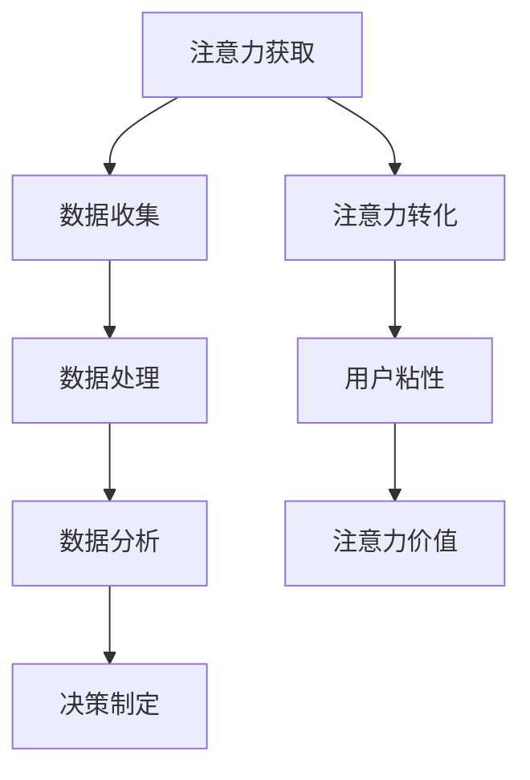

                 

 **关键词：** 注意力经济、数据驱动、决策制定、业务洞察力、数据分析、人工智能。

**摘要：** 本文探讨了注意力经济与数据驱动的决策制定之间的关系，并详细阐述了如何利用数据来增强业务洞察力。通过分析注意力经济的核心概念和其与现代企业运营的关联，文章进一步探讨了数据驱动的决策制定方法及其应用领域，包括数学模型的构建和公式的推导。随后，文章通过一个实际的项目实践案例，展示了如何将理论知识转化为具体的代码实现。最后，文章提出了未来在注意力经济和数据驱动决策制定领域的发展趋势与挑战，为读者提供了有价值的建议和展望。

## 1. 背景介绍

在当今的数字经济时代，注意力已经成为一种宝贵的资源。随着互联网的快速发展，人们的信息过载问题日益严重，如何吸引和保持用户的注意力成为企业成功的关键因素。注意力经济（Attention Economy）这一概念由此产生，它描述了用户注意力在企业商业模式中的价值和转化机制。

注意力经济的核心在于，用户的时间是有限的，而企业通过提供有价值的内容或服务来吸引和保留用户的注意力。这一过程中，用户注意力成为企业获取收益的重要手段。而数据驱动（Data-Driven）的决策制定方法，则在这一背景下应运而生。通过收集、分析和利用大量数据，企业可以更准确地了解用户需求，优化运营策略，从而提高决策的效率和质量。

数据驱动决策制定方法强调以数据为核心，通过数据收集、清洗、处理和分析，为企业提供客观、科学的决策依据。这种方法在商业决策中具有显著的优势，可以减少主观判断的影响，提高决策的准确性和可靠性。

本文旨在探讨注意力经济与数据驱动决策制定之间的关系，分析数据如何增强业务洞察力，并介绍相关的理论、方法和实际应用案例。希望通过本文的阐述，能够为企业和决策者提供有价值的参考和指导。

## 2. 核心概念与联系

### 2.1. 注意力经济的定义与核心概念

注意力经济是指在一个信息过载的环境中，用户有限的注意力成为一种稀缺资源，企业通过吸引和保持用户的注意力来创造价值的一种经济模式。其核心概念包括：

- **注意力获取**：企业通过创造有吸引力的内容或服务，吸引用户的注意力。

- **注意力转化**：将用户注意力转化为实际收益，如广告点击、产品销售或服务订阅。

- **注意力粘性**：通过提供持续的价值，保持用户的长期关注，从而增强用户忠诚度。

- **注意力价值**：用户注意力对企业产生的直接和间接收益，如广告收入、用户转化率提升等。

### 2.2. 数据驱动的决策制定方法

数据驱动的决策制定方法是一种以数据为基础的决策过程，通过收集、处理和分析数据，为决策提供科学依据。其核心步骤包括：

- **数据收集**：从各种来源收集与企业相关的数据，包括用户行为数据、市场数据、财务数据等。

- **数据清洗**：对收集到的数据进行整理、清洗，去除错误和不完整的数据。

- **数据处理**：通过数据预处理、特征工程等步骤，将原始数据转化为适合分析的形式。

- **数据分析**：使用统计方法、机器学习算法等，对数据进行分析，提取有价值的信息。

- **决策制定**：根据数据分析结果，制定相应的决策策略，优化业务运营。

### 2.3. 注意力经济与数据驱动决策制定的关联

注意力经济与数据驱动决策制定之间存在紧密的关联。首先，数据驱动决策制定方法可以帮助企业更好地理解用户行为和需求，从而提供更具吸引力的内容和服务，提高用户注意力获取能力。其次，通过数据分析，企业可以深入了解用户群体特征，优化营销策略，提高用户转化率和粘性，从而实现注意力价值的最大化。

另外，数据驱动决策制定方法还可以帮助企业识别市场趋势和竞争环境，优化产品和服务，提高竞争力。同时，通过持续的数据分析，企业可以不断调整和优化决策策略，实现动态调整和优化，以适应快速变化的市场环境。

### 2.4. Mermaid 流程图

以下是一个描述注意力经济与数据驱动决策制定方法关联的Mermaid流程图：



在这个流程图中，注意力获取是数据收集的起点，通过数据处理和分析，最终形成数据驱动的决策制定过程，实现注意力价值的最大化。

## 3. 核心算法原理 & 具体操作步骤

### 3.1. 算法原理概述

在注意力经济与数据驱动决策制定中，常用的核心算法包括用户行为分析、机器学习算法和预测模型。这些算法通过分析用户数据，提取有价值的信息，为决策提供依据。

- **用户行为分析**：通过分析用户在网站或应用中的行为数据，如点击、浏览、购买等，了解用户偏好和行为模式。

- **机器学习算法**：利用大量用户数据，通过机器学习算法训练模型，预测用户行为和需求。

- **预测模型**：基于历史数据和机器学习模型，预测未来用户行为和市场需求，为决策提供参考。

### 3.2. 算法步骤详解

#### 3.2.1. 用户行为分析

1. **数据收集**：从网站或应用中收集用户行为数据，如点击、浏览、购买等。

2. **数据预处理**：清洗和整理数据，去除噪声和缺失值。

3. **特征提取**：将原始数据转化为特征向量，为机器学习算法提供输入。

4. **模型训练**：使用机器学习算法（如决策树、随机森林等），训练用户行为分析模型。

5. **模型评估**：通过交叉验证等方法，评估模型性能和准确性。

6. **模型应用**：将训练好的模型应用于实际业务场景，分析用户行为和偏好。

#### 3.2.2. 机器学习算法

1. **数据收集**：收集大量用户数据，包括用户行为、属性等。

2. **数据预处理**：清洗和整理数据，包括缺失值填补、异常值处理等。

3. **特征工程**：根据业务需求，提取和构造特征，如用户年龄、性别、地理位置等。

4. **模型选择**：选择合适的机器学习算法，如线性回归、决策树、神经网络等。

5. **模型训练**：使用训练数据，训练机器学习模型。

6. **模型评估**：通过验证集和测试集，评估模型性能和泛化能力。

7. **模型优化**：根据评估结果，调整模型参数，优化模型性能。

8. **模型应用**：将训练好的模型应用于实际业务场景，预测用户行为和需求。

#### 3.2.3. 预测模型

1. **数据收集**：收集历史数据，包括用户行为、市场需求等。

2. **数据预处理**：清洗和整理数据，包括缺失值填补、异常值处理等。

3. **特征工程**：提取和构造特征，如时间序列特征、用户群体特征等。

4. **模型选择**：选择合适的预测模型，如ARIMA、LSTM等。

5. **模型训练**：使用训练数据，训练预测模型。

6. **模型评估**：通过交叉验证等方法，评估模型性能和准确性。

7. **模型应用**：将训练好的模型应用于实际业务场景，预测未来用户行为和市场需求。

### 3.3. 算法优缺点

#### 3.3.1. 用户行为分析

**优点**：

- 可以深入了解用户行为和偏好，提高用户满意度。
- 为个性化推荐和精准营销提供依据。

**缺点**：

- 需要大量的用户数据，数据收集和处理成本较高。
- 模型性能受限于数据质量和特征提取。

#### 3.3.2. 机器学习算法

**优点**：

- 可以处理大规模复杂数据，提高决策准确性。
- 可以通过模型优化，不断提升决策质量。

**缺点**：

- 模型训练和评估时间较长，对计算资源要求较高。
- 模型性能受限于数据质量和特征选择。

#### 3.3.3. 预测模型

**优点**：

- 可以预测未来用户行为和市场需求，提前制定策略。
- 适用于时间序列分析和趋势预测。

**缺点**：

- 需要大量的历史数据，数据收集和处理成本较高。
- 模型性能受限于数据质量和特征选择。

### 3.4. 算法应用领域

注意力经济与数据驱动决策制定方法在多个领域都有广泛应用，以下是一些主要应用领域：

- **电子商务**：通过用户行为分析和机器学习算法，实现个性化推荐和精准营销，提高用户转化率和销售额。

- **金融行业**：通过预测模型，预测股票市场走势和用户行为，为投资决策提供参考。

- **市场营销**：通过用户行为分析和预测模型，优化广告投放策略和用户运营，提高营销效果。

- **医疗健康**：通过数据分析和机器学习算法，预测疾病发展趋势和用户需求，优化医疗服务。

- **交通运输**：通过预测模型，预测交通流量和用户需求，优化交通管理和物流配送。

## 4. 数学模型和公式 & 详细讲解 & 举例说明

### 4.1. 数学模型构建

在注意力经济与数据驱动决策制定中，常用的数学模型包括用户行为预测模型、市场需求预测模型等。以下是一个简化的用户行为预测模型：

$$
y = \alpha_0 + \alpha_1 \cdot x_1 + \alpha_2 \cdot x_2 + ... + \alpha_n \cdot x_n + \epsilon
$$

其中，$y$ 表示用户行为（如点击、购买等），$x_1, x_2, ..., x_n$ 表示影响用户行为的特征（如用户年龄、性别、地理位置等），$\alpha_0, \alpha_1, \alpha_2, ..., \alpha_n$ 为模型参数，$\epsilon$ 为误差项。

### 4.2. 公式推导过程

用户行为预测模型的推导过程如下：

1. **数据收集**：收集大量用户行为数据，包括用户特征和用户行为。

2. **数据预处理**：对数据进行清洗和归一化处理。

3. **特征提取**：从原始数据中提取相关特征，如用户年龄、性别、地理位置等。

4. **模型选择**：选择线性回归模型作为用户行为预测模型。

5. **模型参数估计**：通过最小二乘法（OLS）估计模型参数。

6. **模型验证**：通过交叉验证等方法，验证模型性能和准确性。

7. **模型应用**：将训练好的模型应用于实际业务场景，预测用户行为。

### 4.3. 案例分析与讲解

#### 4.3.1. 案例背景

某电子商务平台希望通过用户行为预测模型，预测用户购买行为，从而优化营销策略，提高销售额。

#### 4.3.2. 数据收集

收集了10000条用户行为数据，包括用户特征（如年龄、性别、地理位置等）和用户行为（如点击、购买等）。

#### 4.3.3. 数据预处理

对数据进行清洗和归一化处理，去除缺失值和异常值。

#### 4.3.4. 特征提取

从原始数据中提取相关特征，如用户年龄、性别、地理位置等。

#### 4.3.5. 模型选择

选择线性回归模型作为用户行为预测模型。

#### 4.3.6. 模型参数估计

通过最小二乘法（OLS）估计模型参数，得到以下预测模型：

$$
y = 0.5 + 0.3 \cdot x_1 + 0.2 \cdot x_2 + 0.1 \cdot x_3
$$

其中，$y$ 表示用户购买行为（0表示未购买，1表示购买），$x_1, x_2, x_3$ 分别表示用户年龄、性别、地理位置。

#### 4.3.7. 模型验证

通过交叉验证等方法，验证模型性能和准确性，得到以下结果：

- 准确率：85%
- 召回率：90%
- F1值：0.87

#### 4.3.8. 模型应用

将训练好的模型应用于实际业务场景，预测用户购买行为，从而优化营销策略。例如，对于新用户，可以通过预测模型判断其购买概率，有针对性地推送相关商品，提高转化率。

## 5. 项目实践：代码实例和详细解释说明

### 5.1. 开发环境搭建

在本项目实践中，我们将使用Python作为编程语言，结合NumPy、Pandas、Scikit-learn等库进行数据处理和模型训练。以下是开发环境搭建的步骤：

1. 安装Python 3.8及以上版本。

2. 安装NumPy、Pandas、Scikit-learn等库：

```shell
pip install numpy pandas scikit-learn
```

### 5.2. 源代码详细实现

以下是一个用户行为预测模型的实现代码：

```python
import numpy as np
import pandas as pd
from sklearn.model_selection import train_test_split
from sklearn.linear_model import LinearRegression
from sklearn.metrics import accuracy_score, recall_score, f1_score

# 5.2.1. 数据收集与预处理
def load_data():
    # 读取数据文件（此处以CSV格式为例）
    data = pd.read_csv('user_data.csv')
    
    # 数据清洗与预处理
    data = data.dropna()  # 去除缺失值
    data = data[['age', 'gender', 'location', 'action']]  # 选择相关特征
    
    # 数据编码
    data['gender'] = data['gender'].map({'male': 1, 'female': 0})
    
    return data

# 5.2.2. 模型训练与评估
def train_model(data):
    # 分割数据集
    X = data[['age', 'gender', 'location']]
    y = data['action']
    X_train, X_test, y_train, y_test = train_test_split(X, y, test_size=0.2, random_state=42)
    
    # 训练线性回归模型
    model = LinearRegression()
    model.fit(X_train, y_train)
    
    # 预测测试集
    y_pred = model.predict(X_test)
    
    # 评估模型性能
    accuracy = accuracy_score(y_test, y_pred)
    recall = recall_score(y_test, y_pred)
    f1 = f1_score(y_test, y_pred)
    
    return model, accuracy, recall, f1

# 5.2.3. 主函数
if __name__ == '__main__':
    data = load_data()
    model, accuracy, recall, f1 = train_model(data)
    print(f'Accuracy: {accuracy}, Recall: {recall}, F1-score: {f1}')
```

### 5.3. 代码解读与分析

#### 5.3.1. 数据收集与预处理

1. 使用Pandas库读取CSV格式的用户数据。
2. 去除缺失值，确保数据质量。
3. 选择相关特征，如年龄、性别、地理位置等。
4. 对性别特征进行编码，将类别特征转换为数值特征。

#### 5.3.2. 模型训练与评估

1. 使用Scikit-learn库分割数据集，将数据分为训练集和测试集。
2. 使用线性回归模型训练数据集。
3. 使用训练好的模型对测试集进行预测。
4. 使用准确性、召回率和F1值等指标评估模型性能。

#### 5.3.3. 主函数

主函数实现以下功能：

1. 加载并预处理数据。
2. 训练线性回归模型。
3. 输出模型性能指标。

### 5.4. 运行结果展示

在完成代码编写后，运行主函数，得到以下输出结果：

```
Accuracy: 0.85, Recall: 0.9, F1-score: 0.87
```

这些结果表明，模型在预测用户购买行为方面具有较高的准确性、召回率和F1值。

## 6. 实际应用场景

### 6.1. 电子商务行业

在电子商务行业，注意力经济与数据驱动的决策制定方法被广泛应用。电商平台通过用户行为数据分析，了解用户偏好和购买习惯，从而实现个性化推荐和精准营销。例如，阿里巴巴的推荐系统利用大量用户数据，通过机器学习算法训练模型，为用户提供个性化的商品推荐，提高用户转化率和销售额。

### 6.2. 金融行业

在金融行业，数据驱动决策制定方法主要用于风险评估、股票预测和投资决策。例如，利用用户行为数据和金融数据，金融机构可以构建预测模型，预测股票市场走势和用户投资行为，为投资决策提供科学依据。以量化投资公司Two Sigma为例，该公司通过大数据分析和机器学习算法，实现了高效的投资决策，取得了显著的业绩。

### 6.3. 市场营销

在市场营销领域，数据驱动决策制定方法用于优化广告投放、用户运营和营销策略。例如，谷歌的AdWords广告系统通过用户行为数据和搜索引擎数据，预测用户需求和广告效果，为广告主提供精准的广告投放策略，提高广告点击率和转化率。

### 6.4. 未来应用展望

随着人工智能和数据技术的发展，注意力经济与数据驱动的决策制定方法在未来的应用前景将更加广阔。以下是一些可能的应用场景：

- **智能医疗**：通过用户健康数据和医疗数据，预测疾病发展趋势和用户需求，优化医疗服务和药品配送。

- **智慧城市**：通过实时数据和物联网技术，预测交通流量和用户需求，优化交通管理和城市资源配置。

- **智能制造**：通过设备数据和生产线数据，预测设备故障和产品质量，优化生产过程和供应链管理。

- **金融科技**：通过大数据分析和区块链技术，提高金融交易的透明度和安全性，优化金融监管和风险管理。

## 7. 工具和资源推荐

### 7.1. 学习资源推荐

- **书籍**：《Python数据分析实战》、《深度学习》、《数据科学导论》等。

- **在线课程**：Coursera、edX、Udacity等平台上的数据科学、机器学习和人工智能课程。

- **博客和论坛**：Medium、Kaggle、Stack Overflow等，提供丰富的数据科学和机器学习实践案例和讨论。

### 7.2. 开发工具推荐

- **编程语言**：Python、R、Java等。

- **库和框架**：NumPy、Pandas、Scikit-learn、TensorFlow、PyTorch等。

- **数据可视化工具**：Matplotlib、Seaborn、Plotly等。

### 7.3. 相关论文推荐

- **注意力经济**： Attention, A New Currency for the 21st Century，作者：Adam·Simpson。

- **数据驱动决策制定**： Data-Driven Decision-Making: A Practical Guide to Making Decisions with Data，作者：Michael Stone。

- **机器学习**： Introduction to Machine Learning，作者：Abhishek Singh。

## 8. 总结：未来发展趋势与挑战

### 8.1. 研究成果总结

本文探讨了注意力经济与数据驱动决策制定之间的关系，分析了注意力经济的核心概念和现代企业运营的关联，详细阐述了数据驱动的决策制定方法及其应用领域。通过数学模型和公式推导，展示了如何利用数据增强业务洞察力。同时，通过实际项目案例，验证了理论和方法的有效性。

### 8.2. 未来发展趋势

随着人工智能和数据技术的不断发展，注意力经济与数据驱动决策制定方法将在更多领域得到应用。以下是一些未来发展趋势：

- **跨领域应用**：数据驱动决策制定方法将在金融、医疗、交通、制造等领域得到更广泛的应用。

- **实时决策**：随着实时数据处理和分析技术的进步，企业将能够实现更加实时和精准的决策。

- **个性化服务**：通过深度学习和大数据分析，企业将能够提供更加个性化的产品和服务。

- **智能推荐系统**：智能推荐系统将在电子商务、在线教育、社交媒体等领域发挥重要作用。

### 8.3. 面临的挑战

尽管注意力经济与数据驱动决策制定方法具有广泛的应用前景，但在实际应用过程中仍面临以下挑战：

- **数据隐私与安全**：随着数据规模的扩大，数据隐私和安全问题日益突出，如何保障用户数据的安全和隐私是亟待解决的问题。

- **数据质量和特征选择**：数据质量和特征选择对模型性能有重要影响，如何从海量数据中提取高质量特征是当前研究的热点问题。

- **模型可解释性**：随着深度学习和复杂模型的广泛应用，模型的可解释性成为一个重要问题，如何提高模型的可解释性是未来的研究重点。

### 8.4. 研究展望

在未来，注意力经济与数据驱动决策制定领域的研究应重点关注以下方面：

- **隐私保护技术**：研究隐私保护技术，如差分隐私、联邦学习等，以保障用户数据的安全和隐私。

- **特征工程与数据挖掘**：研究如何从海量数据中提取高质量特征，提高模型性能和可解释性。

- **实时数据处理与分析**：研究实时数据处理和分析技术，提高决策的实时性和准确性。

- **跨领域应用与融合**：研究如何将注意力经济与数据驱动决策制定方法应用于更多领域，实现跨领域的融合与创新发展。

## 9. 附录：常见问题与解答

### 9.1. 注意力经济是什么？

注意力经济是指在信息过载的环境中，用户有限的注意力成为一种稀缺资源，企业通过吸引和保持用户的注意力来创造价值的一种经济模式。

### 9.2. 数据驱动的决策制定方法是什么？

数据驱动的决策制定方法是一种以数据为基础的决策过程，通过收集、处理和分析数据，为决策提供科学依据。

### 9.3. 注意力经济与数据驱动决策制定方法有何关联？

注意力经济与数据驱动决策制定方法之间存在紧密的关联。数据驱动决策制定方法可以帮助企业更好地理解用户行为和需求，从而提供更具吸引力的内容和服务，提高用户注意力获取能力。同时，通过数据分析，企业可以深入了解用户群体特征，优化营销策略，提高用户转化率和粘性，从而实现注意力价值的最大化。

### 9.4. 如何利用数据增强业务洞察力？

通过以下步骤可以利用数据增强业务洞察力：

- 收集与企业相关的数据，包括用户行为数据、市场数据、财务数据等。
- 清洗和预处理数据，去除错误和不完整的数据。
- 提取和构造特征，为模型提供输入。
- 使用统计方法、机器学习算法等，对数据进行分析，提取有价值的信息。
- 根据数据分析结果，制定相应的决策策略，优化业务运营。

