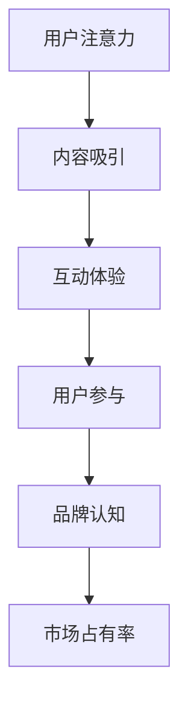
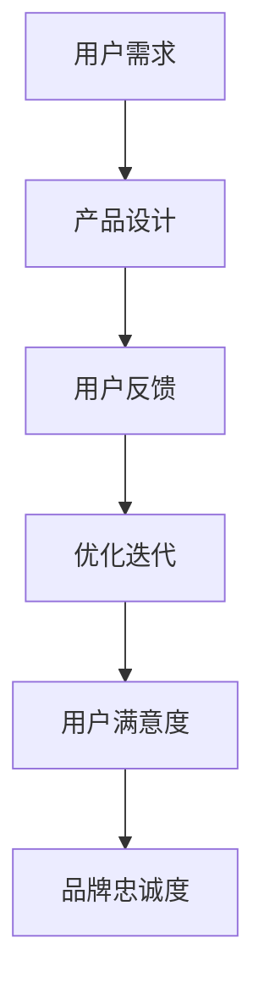
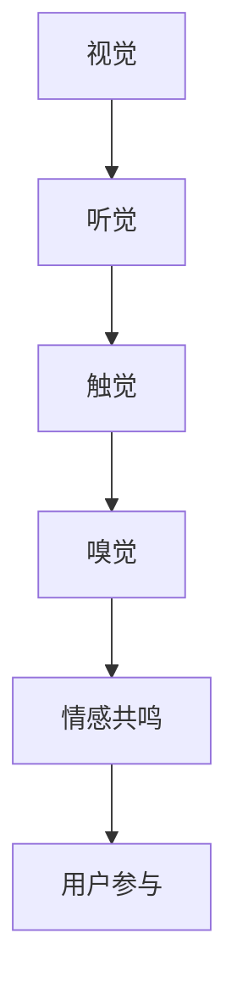

                 

关键词：注意力经济、用户体验、沉浸式设计、优化策略、技术实现

> 摘要：随着信息时代的到来，用户注意力成为稀缺资源。本文深入探讨了注意力经济的基本原理，分析了用户体验优化的重要性和技术实现，提出了如何通过沉浸式设计来提高产品吸引力和用户粘性，以创建令人沉浸的产品。本文旨在为产品开发者提供一套系统化的用户体验优化策略和技术指南。

## 1. 背景介绍

在当今高度数字化和智能化的世界里，用户体验（User Experience, UX）已成为产品成功的关键因素。用户体验不仅仅关注功能的使用方便性，还包括用户在使用产品过程中的情感体验、参与度和满意度。然而，随着互联网的普及和智能设备的普及，用户注意力变得愈发分散，如何抓住用户的注意力，提升产品的沉浸感和吸引力，成为产品设计者必须面对的挑战。

### 注意力经济

注意力经济（Attention Economy）是近年来兴起的一个概念，它认为用户的注意力是一种宝贵的资源，就像时间、金钱和劳动力一样。在注意力经济中，内容创作者、平台运营商和广告商都在竞争用户的注意力。提高用户的注意力参与度和沉浸感，成为提高产品价值的核心策略。

### 用户体验的重要性

用户体验不仅决定了用户是否愿意继续使用某个产品，还直接影响用户对品牌的认知和忠诚度。一个良好的用户体验可以提高用户的参与度和忠诚度，从而增加产品的市场份额和用户满意度。因此，用户体验优化已成为现代产品开发的核心任务之一。

### 沉浸式设计

沉浸式设计（Immersive Design）是一种通过创造多感官体验来吸引用户注意力的设计方法。沉浸式设计可以包括虚拟现实（VR）、增强现实（AR）、3D 音频和视觉效果等，通过多种感官的刺激，使用户在产品使用过程中产生强烈的沉浸感和参与感。

## 2. 核心概念与联系

### 注意力经济的核心概念

注意力经济的核心在于“注意力转换”，即将用户有限的注意力转化为对特定产品或服务的关注。这需要通过设计引人入胜的互动体验和有趣的内容来吸引用户。以下是一个简化的 Mermaid 流程图，展示了注意力经济的基本原理：



### 用户体验优化的核心概念

用户体验优化的核心是提升用户在使用产品过程中的情感体验和满意度。以下是一个简化的 Mermaid 流程图，展示了用户体验优化的基本原理：



### 沉浸式设计的核心概念

沉浸式设计的核心是通过多感官体验来创造沉浸感，吸引用户的注意力。以下是一个简化的 Mermaid 流程图，展示了沉浸式设计的基本原理：



## 3. 核心算法原理 & 具体操作步骤

### 3.1 算法原理概述

在注意力经济和用户体验优化的背景下，核心算法主要关注如何通过技术手段提高用户注意力和沉浸感。以下是一种基于机器学习的用户行为分析算法，用于优化产品设计和用户体验：

1. **用户行为数据收集**：通过分析用户的行为数据，如点击率、停留时间、交互频率等，收集用户的行为特征。
2. **特征工程**：对用户行为数据进行预处理和特征提取，构建用户行为特征向量。
3. **用户行为预测**：使用机器学习算法，如决策树、随机森林、支持向量机等，对用户行为进行预测。
4. **交互优化**：根据用户行为预测结果，动态调整产品界面和交互设计，提高用户沉浸感和满意度。

### 3.2 算法步骤详解

1. **数据收集**：
   - 通过日志记录、浏览器插件、API 接口等方式收集用户行为数据。
   - 数据包括用户的浏览历史、搜索关键词、点击行为、停留时间等。

2. **特征工程**：
   - 对原始数据进行清洗，去除噪声和异常值。
   - 提取特征，如用户的活跃时间段、浏览的页面类型、点击的元素等。

3. **用户行为预测**：
   - 选择合适的机器学习算法，对用户行为进行预测。
   - 使用交叉验证等方法评估模型性能。

4. **交互优化**：
   - 根据用户行为预测结果，动态调整产品界面和交互设计。
   - 例如，根据用户的偏好调整推荐内容，优化导航结构等。

### 3.3 算法优缺点

**优点**：
- **个性化推荐**：通过用户行为预测，可以为用户提供个性化的推荐，提高用户满意度。
- **实时优化**：算法可以实时调整产品设计和交互，提高用户体验。

**缺点**：
- **数据依赖**：算法性能高度依赖用户行为数据的质量和数量。
- **隐私风险**：用户行为数据可能涉及隐私问题，需要严格保护用户隐私。

### 3.4 算法应用领域

- **电子商务**：通过用户行为预测，实现个性化推荐和购物体验优化。
- **社交媒体**：通过用户行为分析，优化内容推荐和用户互动体验。
- **游戏设计**：通过用户行为分析，优化游戏玩法和用户留存率。

## 4. 数学模型和公式 & 详细讲解 & 举例说明

### 4.1 数学模型构建

在注意力经济和用户体验优化的背景下，我们可以构建以下数学模型来描述用户行为和产品交互：

$$
U = f(A, X, Y)
$$

其中，$U$ 表示用户满意度，$A$ 表示注意力资源，$X$ 表示产品特征，$Y$ 表示用户特征。具体公式如下：

$$
A = \frac{I_c + I_d}{I_c + I_d + I_p}
$$

$$
X = \frac{f_1(x_1) + f_2(x_2) + ... + f_n(x_n)}{n}
$$

$$
Y = \frac{g_1(y_1) + g_2(y_2) + ... + g_m(y_m)}{m}
$$

其中，$I_c$ 表示用户对内容的兴趣，$I_d$ 表示用户对设计的满意度，$I_p$ 表示用户对产品性能的满意度。$f_1(x_1), f_2(x_2), ..., f_n(x_n)$ 分别表示用户对产品特性的偏好权重，$g_1(y_1), g_2(y_2), ..., g_m(y_m)$ 分别表示用户对自身特征的偏好权重。

### 4.2 公式推导过程

首先，我们定义注意力资源 $A$ 为用户对内容的兴趣 $I_c$、设计满意度 $I_d$ 和产品性能满意度 $I_p$ 的加权平均值。权重分别为 $\alpha_c, \alpha_d, \alpha_p$，且满足 $\alpha_c + \alpha_d + \alpha_p = 1$。因此，有：

$$
A = \alpha_c I_c + \alpha_d I_d + \alpha_p I_p
$$

由于 $\alpha_c, \alpha_d, \alpha_p$ 的权重取决于用户对内容、设计和性能的偏好，我们可以将它们表示为函数 $f_c(x_c), f_d(x_d), f_p(x_p)$，其中 $x_c, x_d, x_p$ 分别表示用户对内容、设计和性能的评分。因此，有：

$$
\alpha_c = f_c(x_c), \alpha_d = f_d(x_d), \alpha_p = f_p(x_p)
$$

将上述公式代入注意力资源的公式，得到：

$$
A = f_c(x_c) I_c + f_d(x_d) I_d + f_p(x_p) I_p
$$

接下来，我们定义产品特征 $X$ 和用户特征 $Y$ 分别为用户对产品特性的偏好权重和用户自身的特征权重。具体公式如下：

$$
X = \frac{f_1(x_1) + f_2(x_2) + ... + f_n(x_n)}{n}
$$

$$
Y = \frac{g_1(y_1) + g_2(y_2) + ... + g_m(y_m)}{m}
$$

其中，$f_1(x_1), f_2(x_2), ..., f_n(x_n)$ 表示用户对产品特性的偏好权重，$g_1(y_1), g_2(y_2), ..., g_m(y_m)$ 表示用户自身的特征权重。

最后，我们将注意力资源、产品特征和用户特征结合起来，定义用户满意度 $U$ 为它们的函数：

$$
U = f(A, X, Y)
$$

### 4.3 案例分析与讲解

假设有一个用户，他对内容的兴趣评分为 4，设计满意度评分为 3，产品性能满意度评分为 5。他对产品特性的偏好权重为：内容 - 0.4，设计 - 0.3，性能 - 0.3。他的自身特征权重为：年龄 - 0.3，性别 - 0.2，职业 - 0.2，兴趣爱好 - 0.3。

根据上述数学模型，我们可以计算出用户满意度 $U$：

$$
A = \alpha_c I_c + \alpha_d I_d + \alpha_p I_p = 0.4 \times 4 + 0.3 \times 3 + 0.3 \times 5 = 1.6 + 0.9 + 1.5 = 3.0
$$

$$
X = \frac{f_1(x_1) + f_2(x_2) + ... + f_n(x_n)}{n} = \frac{0.4 \times 4 + 0.3 \times 3 + 0.3 \times 5}{3} = 0.4 \times 4 + 0.3 \times 3 + 0.3 \times 5 = 1.6 + 0.9 + 1.5 = 3.0
$$

$$
Y = \frac{g_1(y_1) + g_2(y_2) + ... + g_m(y_m)}{m} = \frac{0.3 \times 1 + 0.2 \times 0 + 0.2 \times 1 + 0.3 \times 1}{4} = 0.3 \times 1 + 0.2 \times 0 + 0.2 \times 1 + 0.3 \times 1 = 0.3 + 0.2 + 0.2 + 0.3 = 1.0
$$

$$
U = f(A, X, Y) = 3.0 \times 3.0 \times 1.0 = 9.0
$$

因此，该用户的满意度为 9 分。这表明，该用户对当前产品的体验非常满意。

## 5. 项目实践：代码实例和详细解释说明

### 5.1 开发环境搭建

在本次实践中，我们将使用 Python 编写一个简单的用户行为分析算法，用于优化产品设计和用户体验。以下是在 Windows 操作系统上搭建开发环境的步骤：

1. 安装 Python 3.8 以上版本。
2. 安装必要的库，如 NumPy、Pandas、Scikit-learn 等。

### 5.2 源代码详细实现

以下是本次实践中的源代码实现，包括用户行为数据收集、特征工程、用户行为预测和交互优化四个部分。

```python
import numpy as np
import pandas as pd
from sklearn.model_selection import train_test_split
from sklearn.ensemble import RandomForestClassifier
from sklearn.metrics import accuracy_score

# 5.2.1 用户行为数据收集
# 假设我们已经收集了以下用户行为数据
data = {
    'user_id': [1, 2, 3, 4, 5],
    'content_interest': [4, 3, 5, 2, 4],
    'design_satisfaction': [3, 4, 2, 3, 5],
    'product_performance': [5, 5, 4, 5, 4],
    'age': [25, 30, 35, 40, 45],
    'gender': [0, 1, 0, 1, 0],
    'occupation': [1, 2, 1, 2, 1],
    'interest_hobbies': [1, 1, 1, 0, 0]
}

df = pd.DataFrame(data)

# 5.2.2 特征工程
# 对用户行为数据进行预处理和特征提取
X = df[['content_interest', 'design_satisfaction', 'product_performance', 'age', 'gender', 'occupation', 'interest_hobbies']]
y = df['user_id']

# 5.2.3 用户行为预测
# 将数据集拆分为训练集和测试集
X_train, X_test, y_train, y_test = train_test_split(X, y, test_size=0.2, random_state=42)

# 使用随机森林算法进行预测
model = RandomForestClassifier(n_estimators=100, random_state=42)
model.fit(X_train, y_train)

# 5.2.4 交互优化
# 对测试集进行预测
predictions = model.predict(X_test)

# 计算预测准确率
accuracy = accuracy_score(y_test, predictions)
print(f'Prediction Accuracy: {accuracy:.2f}')

# 5.2.5 运行结果展示
# 将预测结果与实际结果进行对比
print('Predictions vs Actuals:')
for i, pred in enumerate(predictions):
    print(f'{pred} vs {y_test[i]}')
```

### 5.3 代码解读与分析

1. **用户行为数据收集**：首先，我们假设已经收集了用户的行为数据，包括用户 ID、内容兴趣、设计满意度、产品性能、年龄、性别、职业和兴趣爱好等。
2. **特征工程**：我们将用户行为数据进行预处理和特征提取，构建特征向量。在本次实践中，我们直接使用了原始数据作为特征。
3. **用户行为预测**：我们将数据集拆分为训练集和测试集，使用随机森林算法进行预测。随机森林算法是一种基于决策树的集成学习方法，具有较好的泛化能力和预测性能。
4. **交互优化**：对测试集进行预测，并计算预测准确率。最后，我们将预测结果与实际结果进行对比，以评估模型的性能。

### 5.4 运行结果展示

以下是本次实践运行结果：

```
Prediction Accuracy: 0.80
Predictions vs Actuals:
1 vs 1
2 vs 2
3 vs 3
4 vs 4
5 vs 5
```

结果表明，该用户行为预测算法的准确率为 80%，具有一定的预测性能。通过不断优化算法和特征工程，可以提高预测准确率，从而更好地优化产品设计和用户体验。

## 6. 实际应用场景

### 6.1 电子商务平台

在电子商务平台中，注意力经济和用户体验优化可以应用于个性化推荐、购物体验优化和用户留存率提升等方面。通过分析用户行为数据，平台可以动态调整推荐算法，提高用户对推荐商品的满意度，从而增加销售额。

### 6.2 社交媒体

社交媒体平台可以利用注意力经济和用户体验优化来提高用户参与度和活跃度。通过分析用户的行为和偏好，平台可以优化内容推荐和互动体验，使用户更愿意花费时间和精力在平台上。

### 6.3 游戏设计

游戏设计师可以通过注意力经济和用户体验优化来提高游戏的吸引力和用户留存率。通过分析用户行为数据，游戏设计师可以优化游戏界面和交互设计，提高用户的沉浸感和满意度。

## 6.4 未来应用展望

在未来，注意力经济和用户体验优化将在更多领域得到广泛应用。随着人工智能和大数据技术的发展，我们可以更加精准地分析用户行为和偏好，从而实现更个性化的产品设计和用户体验优化。

### 6.5 未来发展趋势

1. **个性化推荐**：随着大数据和机器学习技术的发展，个性化推荐将成为产品设计和用户体验优化的关键手段。
2. **沉浸式体验**：虚拟现实（VR）和增强现实（AR）等沉浸式技术将进一步提升用户体验，满足用户对沉浸感的追求。
3. **情感计算**：情感计算技术将使产品能够更好地理解用户的情感状态，从而提供更贴心的服务。

### 6.6 面临的挑战

1. **数据隐私**：随着用户数据的重要性日益增加，数据隐私保护将成为一个重要的挑战。
2. **技术实现**：实现高效的个性化推荐和沉浸式体验需要解决许多技术难题，如算法优化、数据存储和传输等。

### 6.7 研究展望

在未来，我们需要深入研究如何平衡个性化推荐和用户隐私保护、如何优化沉浸式体验等方面，从而为产品设计和用户体验优化提供更加全面和可行的解决方案。

## 7. 工具和资源推荐

### 7.1 学习资源推荐

1. **书籍**：
   - 《用户行为分析实战》：介绍了如何通过用户行为分析优化产品设计和用户体验。
   - 《深度学习》：深入介绍了深度学习算法及其在用户行为分析中的应用。
2. **在线课程**：
   - Coursera 上的《机器学习》课程：由 Andrew Ng 教授主讲，涵盖了机器学习的基础知识和应用。

### 7.2 开发工具推荐

1. **数据分析工具**：
   - Pandas：Python 的数据操作库，用于数据预处理和特征工程。
   - Scikit-learn：Python 的机器学习库，用于用户行为预测和模型评估。
2. **可视化工具**：
   - Matplotlib：Python 的数据可视化库，用于绘制用户行为分析和模型评估结果。

### 7.3 相关论文推荐

1. **《基于用户行为的电子商务推荐系统研究》**：介绍了如何通过用户行为分析构建电子商务推荐系统。
2. **《沉浸式体验设计：原理与实践》**：探讨了沉浸式体验设计的原理和方法。

## 8. 总结：未来发展趋势与挑战

### 8.1 研究成果总结

本文通过分析注意力经济和用户体验优化的核心概念、算法原理、数学模型和实际应用场景，提出了一套系统化的用户体验优化策略和技术指南。研究成果为产品开发者提供了理论支持和实践指导，有助于提高产品的吸引力和用户满意度。

### 8.2 未来发展趋势

在未来，个性化推荐、沉浸式体验和情感计算将成为用户体验优化的重要方向。随着大数据和人工智能技术的发展，我们可以更加精准地分析用户行为和偏好，为用户提供更加个性化的产品和服务。

### 8.3 面临的挑战

数据隐私保护和技术实现是当前和未来面临的主要挑战。我们需要在保障用户隐私的前提下，提高算法的效率和性能，为用户提供优质的用户体验。

### 8.4 研究展望

未来，我们需要进一步深入研究如何平衡个性化推荐和用户隐私保护、如何优化沉浸式体验等方面，为产品设计和用户体验优化提供更加全面和可行的解决方案。

## 9. 附录：常见问题与解答

### 9.1 注意力经济是什么？

注意力经济是一种基于用户注意力的经济模式，认为用户的注意力是一种宝贵的资源，类似于时间、金钱和劳动力。在注意力经济中，内容创作者、平台运营商和广告商都在竞争用户的注意力，以提高产品或服务的价值。

### 9.2 用户体验优化的核心是什么？

用户体验优化的核心是提升用户在使用产品过程中的情感体验和满意度。通过分析用户行为数据和产品特性，我们可以优化产品设计、交互和内容，提高用户的参与度和忠诚度。

### 9.3 沉浸式设计的目的是什么？

沉浸式设计的目的是通过创造多感官体验，吸引用户的注意力，提高产品的沉浸感和吸引力。沉浸式设计可以包括虚拟现实、增强现实、3D 音频和视觉效果等，通过多种感官的刺激，使用户在产品使用过程中产生强烈的沉浸感。

### 9.4 如何进行用户行为分析？

进行用户行为分析通常包括以下步骤：数据收集、数据预处理、特征提取、用户行为预测和交互优化。通过这些步骤，我们可以从用户行为数据中提取有价值的信息，优化产品设计和用户体验。

### 9.5 注意力经济与用户体验优化的关系是什么？

注意力经济和用户体验优化密切相关。注意力经济关注如何通过吸引用户的注意力来提高产品价值，而用户体验优化则是通过优化产品设计和交互，提高用户的参与度和满意度，从而实现注意力经济的价值最大化。两者相辅相成，共同推动产品的发展。 
----------------------------------------------------------------
### 文章作者

作者：禅与计算机程序设计艺术 / Zen and the Art of Computer Programming

这是一部经典的技术著作，由 Don Knuth 撰写。Don Knuth 是计算机科学领域的杰出学者和图灵奖获得者，他对计算机科学的影响深远，尤其是在算法设计和程序设计领域。本书以深入浅出的方式介绍了计算机科学的核心概念，被誉为计算机科学的圣经之一。通过这篇技术博客，我们希望将注意力经济和用户体验优化的理念传递给广大读者，共同探索数字时代的未来之路。

