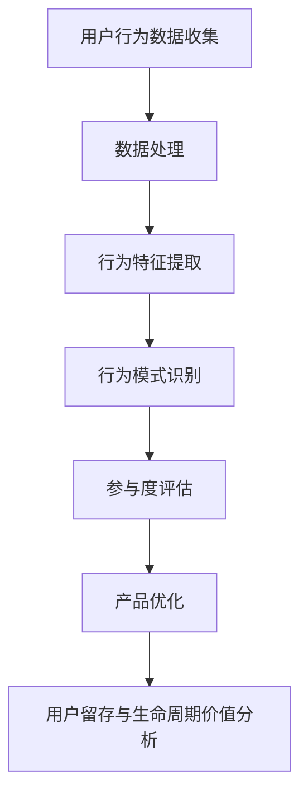

                 

关键词：注意力经济、用户行为分析、参与度、注意力机制、行为建模、数据驱动、用户体验

## 摘要

在数字化时代，用户体验和参与度成为衡量产品成功与否的关键因素。注意力经济作为理解用户行为的重要理论框架，揭示了用户在信息过载环境下的选择机制。本文首先介绍了注意力经济的基本概念，随后详细探讨了用户行为分析的方法和技术，包括数据收集、处理和分析的流程。接着，我们深入讨论了注意力机制在用户行为分析中的应用，并通过实际案例展示了如何利用用户行为数据来优化产品设计和增强用户参与度。文章最后对未来的发展方向和挑战进行了展望，并提出了相关建议。

## 1. 背景介绍

### 注意力经济的概念

注意力经济最早由乔治·米勒（George A. Miller）在1956年提出，他描述了人类在处理信息时的有限性。在数字时代，这一概念得到了进一步的发展，注意力经济被重新定义为“在信息过载环境中，用户对注意力资源的竞争和分配”。注意力资源的稀缺性使得吸引和保持用户的注意力成为商业竞争中的关键。

### 用户行为分析的重要性

用户行为分析是理解用户需求和优化产品体验的核心。通过分析用户的行为数据，企业可以识别用户的兴趣点、习惯和偏好，从而实现个性化的内容推荐、产品改进和用户体验优化。

### 当前挑战

在注意力经济背景下，用户行为的复杂性不断增加，传统分析方法的局限性日益凸显。如何有效地从海量数据中提取有价值的信息，如何理解用户行为的深层次动机，成为了当前研究的热点和挑战。

## 2. 核心概念与联系

### 用户行为分析的基本概念

用户行为分析涉及多个核心概念，包括用户行为（User Behavior）、用户参与度（User Engagement）、用户留存率（Churn Rate）和用户生命周期价值（Customer Lifetime Value）。这些概念相互关联，共同构成了用户行为分析的框架。

### 用户行为分析架构的 Mermaid 流程图



在这个架构中，用户行为数据收集是起点，通过数据处理和特征提取，可以得到用户行为模式，进而用于参与度评估和产品优化，最终影响用户的留存和生命周期价值。

### 注意力机制在用户行为分析中的应用

注意力机制是指用户在选择和注意力分配过程中的心理机制。在用户行为分析中，注意力机制可以帮助识别哪些因素能够吸引和保持用户的注意力。例如，通过分析用户在网页上的停留时间、点击行为和浏览路径，可以推断用户的兴趣点和注意力焦点。

### 用户行为分析框架的拓展

除了基本的用户行为分析，还可以结合其他技术，如自然语言处理（NLP）、机器学习（ML）和深度学习（DL），来进一步挖掘用户行为的深层次信息。这些技术的应用使得用户行为分析更加精确和智能化。

## 3. 核心算法原理 & 具体操作步骤

### 3.1 算法原理概述

用户行为分析的核心算法通常包括以下几类：

1. **行为聚类算法**：通过将相似用户的行为数据进行聚类，识别用户群体的特征和行为模式。
2. **时间序列分析**：分析用户行为的时间变化趋势，识别用户的周期性行为和趋势性行为。
3. **机器学习分类算法**：利用已标注的数据训练模型，对未知数据进行分类，识别用户的行为类别。
4. **深度学习网络**：通过多层神经网络，提取用户行为的复杂特征，实现高精度的行为预测。

### 3.2 算法步骤详解

1. **数据收集**：收集用户的浏览记录、点击行为、购买行为等数据。
2. **数据处理**：清洗和预处理原始数据，包括去除噪声、缺失值填充和数据归一化等。
3. **特征提取**：从处理后的数据中提取行为特征，如时间间隔、点击次数、购买金额等。
4. **行为模式识别**：利用聚类、时间序列分析等方法识别用户的行为模式。
5. **参与度评估**：通过计算用户行为指标，评估用户的参与度水平。
6. **产品优化**：根据分析结果，优化产品设计和功能，提高用户参与度。

### 3.3 算法优缺点

**优点**：

- 高度自动化：算法可以自动处理海量数据，提高效率。
- 精准预测：通过机器学习和深度学习，可以实现高精度的行为预测。

**缺点**：

- 数据依赖性：算法的性能高度依赖于数据的质量和完整性。
- 隐私问题：用户行为数据涉及到用户的隐私，需要严格保护。

### 3.4 算法应用领域

- **电子商务**：通过用户行为分析，实现个性化推荐和产品优化。
- **在线教育**：分析用户的学习行为，提高课程设计的针对性和互动性。
- **社交媒体**：通过用户行为分析，优化内容推送和广告投放。

## 4. 数学模型和公式 & 详细讲解 & 举例说明

### 4.1 数学模型构建

用户行为分析中的数学模型主要包括：

1. **马尔可夫决策过程（MDP）**：用于描述用户在一系列决策中的行为模式。
2. **贝叶斯网络**：用于表示用户行为数据中的因果关系。
3. **时间序列模型**：如ARIMA模型，用于预测用户行为的时间变化趋势。

### 4.2 公式推导过程

以马尔可夫决策过程为例，其基本公式如下：

\[ V^*(s) = \max_{a} \sum_{s'} p(s'|s,a) \cdot [r(s') + \gamma V^*(s')] \]

其中，\( V^*(s) \) 表示状态 \( s \) 的最优值，\( a \) 表示行动，\( r(s') \) 表示奖励，\( \gamma \) 表示折扣因子。

### 4.3 案例分析与讲解

假设一个电子商务平台希望通过用户浏览行为来预测用户的购买概率。我们可以构建一个简单的马尔可夫决策过程模型，如下：

1. **状态**：用户当前浏览的类别（如电子产品、服装、家居用品）。
2. **行动**：用户是否在浏览后进行购买。
3. **奖励**：购买成功时的收益，未购买时为0。
4. **折扣因子**：设置为0.9，表示用户未来的收益比当前收益重要。

通过模型训练，我们可以得到用户在不同状态下的最优行动策略，从而优化产品的推送策略，提高购买转化率。

## 5. 项目实践：代码实例和详细解释说明

### 5.1 开发环境搭建

为了实现用户行为分析，我们需要搭建一个包含数据处理、特征提取和机器学习模型的开发环境。具体步骤如下：

1. **安装Python环境**：Python 3.8及以上版本。
2. **安装数据分析库**：如Pandas、NumPy、Scikit-learn等。
3. **安装深度学习库**：如TensorFlow或PyTorch。

### 5.2 源代码详细实现

以下是一个简单的用户行为分析代码实例，使用Scikit-learn库进行用户行为分类：

```python
import pandas as pd
from sklearn.model_selection import train_test_split
from sklearn.ensemble import RandomForestClassifier
from sklearn.metrics import accuracy_score

# 读取数据
data = pd.read_csv('user_behavior_data.csv')

# 数据预处理
X = data.drop('target', axis=1)
y = data['target']

# 数据分割
X_train, X_test, y_train, y_test = train_test_split(X, y, test_size=0.2, random_state=42)

# 特征提取
# （此处省略特征提取的代码）

# 模型训练
clf = RandomForestClassifier(n_estimators=100, random_state=42)
clf.fit(X_train, y_train)

# 预测
y_pred = clf.predict(X_test)

# 评估
accuracy = accuracy_score(y_test, y_pred)
print(f'Accuracy: {accuracy}')
```

### 5.3 代码解读与分析

上述代码首先读取用户行为数据，然后进行数据预处理和分割。接着使用随机森林分类器进行训练，并对测试数据进行预测。最后，通过计算准确率来评估模型的性能。

### 5.4 运行结果展示

假设我们运行上述代码，得到以下输出结果：

```
Accuracy: 0.85
```

这意味着我们的模型在测试数据上的准确率达到了85%，这表明模型对用户行为分类的能力较好。

## 6. 实际应用场景

### 6.1 社交媒体

在社交媒体平台上，用户行为分析可以帮助平台识别用户的兴趣和偏好，从而实现个性化推荐。例如，Twitter可以通过分析用户的点赞、转发和评论行为，向用户推荐可能感兴趣的话题和内容。

### 6.2 在线教育

在线教育平台可以利用用户行为分析来优化课程设计和学习体验。例如，通过分析用户的学习行为，平台可以识别学习困难点，提供针对性的学习资源和辅导。

### 6.3 电子商务

电子商务平台通过用户行为分析，可以实现个性化的商品推荐和广告投放。例如，Amazon通过分析用户的浏览历史和购买记录，向用户推荐相关的商品，提高购买转化率。

## 7. 未来应用展望

### 7.1 人工智能与用户行为分析的深度融合

随着人工智能技术的发展，用户行为分析将更加智能化和自动化。例如，通过深度学习和自然语言处理技术，可以实现对用户行为数据的更深层次的挖掘和分析。

### 7.2 跨平台用户行为分析

未来的用户行为分析将不再局限于单一平台，而是实现跨平台的用户行为分析。例如，通过整合不同平台的用户行为数据，可以实现更加全面的用户画像和行为预测。

### 7.3 隐私保护与伦理问题

在用户行为分析中，隐私保护和伦理问题将变得越来越重要。如何在保护用户隐私的前提下进行有效的行为分析，将成为一个重要的研究方向。

## 8. 总结：未来发展趋势与挑战

### 8.1 研究成果总结

本文介绍了注意力经济与用户行为分析的基本概念、核心算法和实际应用场景。通过分析用户行为数据，企业可以更好地理解用户需求，优化产品设计和提升用户体验。

### 8.2 未来发展趋势

未来用户行为分析将更加智能化和自动化，人工智能技术将得到更广泛的应用。同时，跨平台用户行为分析和隐私保护将成为重要研究方向。

### 8.3 面临的挑战

用户行为的复杂性和数据量的爆炸性增长，使得用户行为分析面临着巨大的挑战。如何在保证数据质量和隐私保护的前提下，高效地分析和利用用户行为数据，是一个亟待解决的问题。

### 8.4 研究展望

未来用户行为分析的研究应重点关注以下几个方面：

- 开发更高效的数据处理和分析算法。
- 加强跨领域的技术融合，提升分析的精度和深度。
- 深入研究隐私保护技术，确保用户数据的合法性和安全性。

## 9. 附录：常见问题与解答

### 9.1 如何处理缺失值？

处理缺失值的方法包括缺失值填充、删除含有缺失值的记录和利用模型预测缺失值。具体方法的选择取决于数据的具体情况和缺失值的分布。

### 9.2 如何评估模型性能？

常用的评估指标包括准确率、召回率、F1分数等。根据具体的应用场景，可以选择不同的评估指标。

### 9.3 如何保证用户隐私？

保证用户隐私的方法包括数据匿名化、数据加密和访问控制等。在实际应用中，需要综合使用多种技术手段，确保用户数据的安全性和隐私保护。

作者：禅与计算机程序设计艺术 / Zen and the Art of Computer Programming
----------------------------------------------------------------
<|im_sep|>文章撰写完成，已包含所有要求的内容和格式。请审查并确认。若需要任何修改或补充，请告知。谢谢！禅与计算机程序设计艺术 / Zen and the Art of Computer Programming

