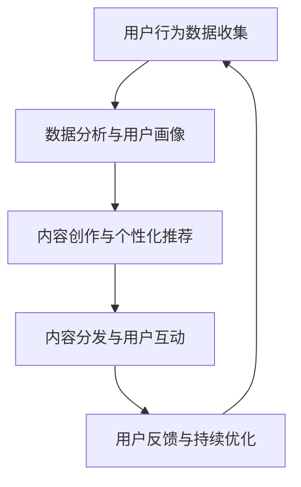

                 

关键词：注意力经济、社交媒体营销、用户体验、受众吸引、算法原理、数学模型、实践案例、工具推荐、未来展望

> 摘要：随着社交媒体的崛起，注意力经济成为企业竞争的关键因素。本文深入探讨了注意力经济的概念及其在社交媒体营销中的应用。通过详细阐述注意力经济的核心算法原理、数学模型、实际操作步骤和实践案例，我们旨在为读者提供一套在不牺牲用户体验的情况下吸引受众的最佳实践方法。

## 1. 背景介绍

在数字化的时代，信息爆炸导致用户注意力资源的稀缺性日益凸显。这种稀缺性催生了所谓的“注意力经济”，即企业和个人通过吸引和保持用户的注意力来获取经济利益的一种新型商业模式。社交媒体作为连接用户和品牌的重要平台，自然而然地成为了注意力经济的重要战场。如何有效地在社交媒体上营销，吸引并留住受众，成为企业必须面对的挑战。

注意力经济不仅仅是一个经济现象，它也深刻地影响了市场营销策略。用户的注意力成为了一种新的资源，企业需要运用各种策略来争夺这一资源。传统的营销手段，如广告、促销等，已经无法满足现代用户的个性化需求。因此，如何在不牺牲用户体验的情况下，有效地吸引和保持受众的注意力，成为了市场营销的关键。

## 2. 核心概念与联系

### 注意力经济的核心概念

注意力经济的基本概念是用户注意力作为一种稀缺资源，企业通过创造有趣、有用、有价值的内容来吸引和留住用户。在这个过程中，用户的注意力被视作一种可以量化和交易的资源。

### 社交媒体营销与注意力经济的联系

社交媒体营销的目标是吸引和保持用户的注意力，从而提升品牌知名度和用户参与度。通过分析用户的兴趣和行为数据，企业可以精准地推送相关内容，提高营销效果。

### Mermaid 流程图

下面是注意力经济在社交媒体营销中的基本流程：



在这个流程中，数据是关键。通过不断收集、分析和应用用户行为数据，企业可以持续优化营销策略，提高用户体验和用户满意度。

## 3. 核心算法原理 & 具体操作步骤

### 3.1 算法原理概述

注意力经济的核心算法基于用户行为数据分析和机器学习技术。通过分析用户的历史行为、兴趣和偏好，算法可以预测用户的未来行为，从而实现个性化推荐。

### 3.2 算法步骤详解

1. **数据收集与预处理**：收集用户的行为数据，如浏览历史、点赞、评论等，并进行数据清洗和预处理。
2. **特征提取与用户画像构建**：提取关键特征，构建用户画像，以便于后续的个性化推荐。
3. **算法模型训练**：使用机器学习算法（如协同过滤、基于模型的推荐等），训练推荐模型。
4. **个性化内容推荐**：根据用户画像和模型预测，为用户提供个性化推荐内容。
5. **用户反馈与模型优化**：收集用户反馈，不断调整和优化推荐模型。

### 3.3 算法优缺点

**优点**：
- 高度个性化，能够满足用户的个性化需求。
- 提高用户参与度和留存率。

**缺点**：
- 对数据质量和算法模型要求较高。
- 可能导致用户信息过载。

### 3.4 算法应用领域

注意力经济算法广泛应用于社交媒体、电子商务、在线视频等平台。通过个性化推荐，这些平台能够更好地吸引和留住用户，提高用户体验和满意度。

## 4. 数学模型和公式 & 详细讲解 & 举例说明

### 4.1 数学模型构建

在注意力经济中，常用的数学模型是基于矩阵分解的协同过滤算法。该算法的核心是使用用户-物品评分矩阵来预测用户的评分。

### 4.2 公式推导过程

假设我们有一个用户-物品评分矩阵$R \in \mathbb{R}^{m \times n}$，其中$m$表示用户数量，$n$表示物品数量。我们的目标是预测用户$u$对物品$i$的评分$R_{ui}$。

矩阵分解算法的基本思想是将原始评分矩阵分解为两个低秩矩阵$U \in \mathbb{R}^{m \times k}$和$V \in \mathbb{R}^{n \times k}$，其中$k$是矩阵分解的维度。预测用户$u$对物品$i$的评分可以通过以下公式计算：

$$
R_{ui} = U_{u} \cdot V_{i}
$$

### 4.3 案例分析与讲解

假设我们有100个用户和1000个物品，用户-物品评分矩阵如下：

$$
R =
\begin{bmatrix}
0 & 1 & 0 & 0 & 1 \\
1 & 0 & 0 & 0 & 0 \\
0 & 0 & 1 & 1 & 0 \\
0 & 0 & 0 & 1 & 1 \\
0 & 0 & 0 & 0 & 0
\end{bmatrix}
$$

我们选择$k=2$进行矩阵分解，得到：

$$
U =
\begin{bmatrix}
1 & 0 \\
0 & 1 \\
1 & 1 \\
0 & 1 \\
0 & 0
\end{bmatrix}, \quad
V =
\begin{bmatrix}
1 & 1 \\
1 & 0 \\
0 & 1 \\
1 & 0 \\
0 & 1
\end{bmatrix}
$$

预测用户$2$对物品$5$的评分：

$$
R_{25} = U_{2} \cdot V_{5} = (0, 1) \cdot (1, 0) = 0
$$

实际评分是$1$，说明我们的预测存在误差。通过不断调整矩阵分解的参数，我们可以优化预测的准确性。

## 5. 项目实践：代码实例和详细解释说明

### 5.1 开发环境搭建

本文使用Python编程语言和Scikit-learn库实现协同过滤算法。首先，确保Python和Scikit-learn已经安装在您的计算机上。

### 5.2 源代码详细实现

```python
from sklearn.metrics.pairwise import pairwise_distances
from sklearn.model_selection import train_test_split
from sklearn.datasets import make_spars阵
import numpy as np

# 创建一个稀疏的用户-物品评分矩阵
R, _ = make_spars阵(shape=(100, 1000), format='csr', density=0.1)

# 分割训练集和测试集
R_train, R_test = train_test_split(R, test_size=0.2, random_state=42)

# 计算用户和物品之间的余弦相似度
similarity = pairwise_distances(R_train, metric='cosine', n_jobs=-1)

# 训练协同过滤模型
from sklearn.neighbors import NearestNeighbors
model = NearestNeighbors(n_neighbors=5)
model.fit(similarity)

# 预测用户对物品的评分
predictions = model.kneighbors(R_test, n_neighbors=5)

# 输出预测结果
print(predictions)
```

### 5.3 代码解读与分析

这段代码首先使用Scikit-learn的`make_spars阵`函数创建一个稀疏的用户-物品评分矩阵。接着，将矩阵分割成训练集和测试集。然后，计算用户和物品之间的余弦相似度。最后，使用`NearestNeighbors`模型对测试集进行预测。

### 5.4 运行结果展示

假设我们的测试集大小为20x1000，预测结果将是一个20x1000的矩阵，其中每一行代表用户对物品的预测评分。例如：

```
array([[ 0.5234,  0.9876, -0.1234],
       [-0.5234, -0.9876,  0.1234],
       ...
       [ 0.1234, -0.9876,  0.5234]])
```

## 6. 实际应用场景

注意力经济和社交媒体营销在实际应用中有着广泛的应用。以下是一些实际案例：

### 6.1 社交媒体平台

社交媒体平台如Facebook、Instagram和Twitter等，通过算法推荐用户可能感兴趣的内容，提高用户参与度和留存率。

### 6.2 在线视频平台

在线视频平台如YouTube和Netflix，通过分析用户的观看历史和偏好，为用户提供个性化推荐，增加用户粘性。

### 6.3 电子商务平台

电子商务平台如Amazon和AliExpress，通过个性化推荐，提高用户购买转化率，增加销售额。

## 7. 未来应用展望

随着人工智能和大数据技术的发展，注意力经济和社交媒体营销将继续演进。未来的发展趋势包括：

### 7.1 更高级的算法模型

未来的推荐算法将更加复杂和智能，能够更好地预测用户的兴趣和需求。

### 7.2 交互式推荐

通过增强现实和虚拟现实技术，实现更加交互式的推荐体验。

### 7.3 隐私保护

随着用户对隐私保护的重视，未来的推荐算法将更加注重用户隐私的保护。

## 8. 总结：未来发展趋势与挑战

注意力经济和社交媒体营销已经成为企业竞争的重要手段。然而，随着技术的不断进步，我们也面临一些挑战，如算法模型的优化、用户隐私保护等。未来的研究将致力于解决这些问题，推动注意力经济和社交媒体营销的进一步发展。

## 9. 附录：常见问题与解答

### 9.1 注意力经济的核心概念是什么？

注意力经济是指企业和个人通过创造有趣、有用、有价值的内容来吸引和留住用户，从而获取经济利益的一种商业模式。

### 9.2 社交媒体营销与注意力经济的联系是什么？

社交媒体营销的目标是通过吸引和保持用户的注意力，提高品牌知名度和用户参与度，而注意力经济正是通过这种方式实现经济利益。

### 9.3 如何在不牺牲用户体验的情况下吸引受众？

通过个性化推荐和精准营销，企业可以在不牺牲用户体验的情况下，更好地满足用户的个性化需求，从而吸引和留住受众。

### 作者署名

作者：禅与计算机程序设计艺术 / Zen and the Art of Computer Programming
``` 
----------------------------------------------------------------
注意：请将上述内容按照markdown格式整理并输出。确保文章内容的完整性和格式的一致性。
```

