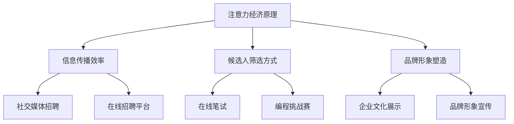

                 

关键词：注意力经济、人才招聘、企业竞争力、招聘策略、人才筛选、招聘效率

> 摘要：本文探讨了注意力经济对企业人才招聘的深刻影响，分析了注意力经济对传统人才招聘模式带来的变革。通过深入阐述注意力经济的核心概念和人才招聘的关联性，本文提出了基于注意力经济的人才招聘策略，并探讨了其在实际应用中的优势和挑战。最后，本文对注意力经济在未来企业人才招聘中的应用前景进行了展望。

## 1. 背景介绍

随着互联网和数字技术的飞速发展，信息过载现象日益严重。人们的时间和注意力成为稀缺资源，如何有效地获取和维持用户的注意力成为企业和组织面临的重要课题。这一现象催生了“注意力经济”的概念，它强调在信息爆炸的时代，吸引并保持用户注意力的价值和潜力。

在人力资源管理领域，人才招聘作为企业发展的核心环节，同样受到了注意力经济的深刻影响。传统的人才招聘方式，如发布职位信息、筛选简历、面试等，往往效率低下且成本较高。随着社交媒体、在线招聘平台等新兴工具的出现，企业开始探索如何利用注意力经济原理，提升人才招聘的效果和效率。

本文旨在通过分析注意力经济的核心概念，探讨其对企业人才招聘的影响，提出基于注意力经济的人才招聘策略，并对其在实际应用中的优势和挑战进行深入讨论。最后，本文将展望注意力经济在未来企业人才招聘中的发展趋势和潜在应用。

## 2. 核心概念与联系

### 2.1 注意力经济的核心概念

注意力经济是一种基于用户注意力的商业模式。在注意力经济中，用户的注意力被视为一种稀缺资源，企业通过吸引和保持用户注意力来创造价值。注意力经济的关键在于如何捕捉用户的兴趣点，并提供有价值的内容或服务，从而实现商业转化。

注意力经济的基本原理包括以下几个方面：

1. **注意力分散与聚焦**：用户在信息爆炸的时代，面临着大量的信息选择。企业需要通过独特的内容或服务，将用户的注意力从分散状态引导至聚焦状态。
2. **用户参与与互动**：用户参与和互动是提升用户注意力的重要因素。企业通过鼓励用户互动、分享和评论，增加用户在平台上的停留时间和参与度。
3. **个性化推荐**：通过大数据分析和机器学习技术，企业可以针对用户的兴趣和偏好提供个性化的内容或服务，从而提高用户的满意度和忠诚度。

### 2.2 注意力经济与人才招聘的关联性

注意力经济与人才招聘之间存在密切的联系。传统的人才招聘方式主要依赖于职位信息的传播和候选人的主动筛选，而注意力经济则为企业提供了一种新的招聘模式。

1. **信息传播效率**：注意力经济强调通过有效的信息传播手段，吸引更多潜在的候选人。社交媒体、在线招聘平台等新兴工具，可以帮助企业快速扩大招聘信息的传播范围，提高信息曝光度。
2. **候选人筛选方式**：注意力经济鼓励企业通过互动和参与来筛选候选人。例如，通过在线笔试、编程挑战赛等方式，不仅能够评估候选人的技能水平，还能观察其在面对实际问题时的表现。
3. **品牌形象塑造**：注意力经济帮助企业通过独特的企业文化和品牌形象，吸引更多优秀的人才。通过社交媒体等平台，企业可以展示其创新文化、团队氛围和企业价值观，增强候选人对企业的认同感。

### 2.3 Mermaid 流程图



通过上述流程图，我们可以清晰地看到注意力经济原理在人才招聘中的具体应用场景和作用。

## 3. 核心算法原理 & 具体操作步骤

### 3.1 算法原理概述

基于注意力经济的人才招聘算法，主要分为以下几个步骤：

1. **数据采集**：通过大数据技术，收集与企业招聘相关的各种信息，包括职位描述、候选人简历、社交媒体行为等。
2. **特征提取**：对采集到的数据进行分析，提取与招聘相关的特征，如技能水平、工作经验、教育背景等。
3. **模型训练**：利用机器学习算法，训练一个能够预测候选人是否符合职位要求的模型。
4. **推荐算法**：根据模型预测结果，为招聘团队提供个性化的候选人推荐。
5. **互动评估**：通过在线笔试、面试等方式，与候选人进行互动，进一步评估其能力和适应性。
6. **结果反馈**：根据招聘结果，对模型进行优化和调整，以提高招聘准确率和效率。

### 3.2 算法步骤详解

#### 3.2.1 数据采集

数据采集是人才招聘算法的基础。企业可以通过以下几种方式获取数据：

1. **公开数据源**：如各大招聘网站、社交媒体平台、公共数据库等。
2. **内部数据**：包括企业自身的职位发布记录、候选人反馈信息等。
3. **第三方数据**：通过数据服务提供商，获取行业相关数据。

#### 3.2.2 特征提取

特征提取是数据预处理的重要步骤。具体操作包括：

1. **文本处理**：对文本数据进行分词、词频统计、主题建模等操作。
2. **数据归一化**：对提取的特征进行归一化处理，使其具有可比性。
3. **特征选择**：根据业务需求和数据质量，选择对招聘结果有显著影响的特征。

#### 3.2.3 模型训练

模型训练是利用历史数据，训练一个能够预测候选人是否符合职位要求的模型。常见的机器学习算法包括：

1. **逻辑回归**：适用于二分类问题，如候选人是否匹配职位。
2. **决策树**：通过树形结构进行分类或回归。
3. **随机森林**：通过构建多个决策树，提高模型的预测能力。
4. **神经网络**：适用于复杂的数据特征和关系。

#### 3.2.4 推荐算法

推荐算法根据模型预测结果，为招聘团队提供个性化的候选人推荐。具体操作包括：

1. **排序算法**：如基于距离的排序、基于模型的排序等。
2. **过滤算法**：如基于内容的过滤、基于协同过滤的过滤等。
3. **混合算法**：结合多种算法，提高推荐效果。

#### 3.2.5 互动评估

互动评估是招聘过程中不可或缺的一环。具体操作包括：

1. **在线笔试**：通过在线编程、答题等方式，评估候选人的技术能力。
2. **面试**：通过电话面试、视频面试等方式，进一步了解候选人的背景和能力。
3. **任务挑战**：为候选人提供实际工作场景的挑战，评估其解决问题的能力。

#### 3.2.6 结果反馈

结果反馈是对招聘算法进行调整和优化的关键步骤。具体操作包括：

1. **模型评估**：通过实际招聘结果，评估模型的效果和准确性。
2. **参数调整**：根据评估结果，调整模型参数，提高预测准确性。
3. **迭代优化**：通过不断迭代和优化，提高招聘算法的整体效果。

### 3.3 算法优缺点

#### 3.3.1 优点

1. **高效性**：基于注意力经济的人才招聘算法，能够快速筛选出符合条件的候选人，提高招聘效率。
2. **准确性**：通过大数据和机器学习技术，算法能够准确预测候选人是否符合职位要求，降低招聘风险。
3. **个性化**：算法可以根据候选人的兴趣和偏好进行推荐，提高候选人的参与度和满意度。
4. **实时性**：算法能够实时分析招聘数据，为招聘团队提供及时的信息和决策支持。

#### 3.3.2 缺点

1. **数据质量**：数据质量对算法效果有直接影响。若数据质量不高，可能导致算法预测不准确。
2. **隐私问题**：大量数据的采集和分析可能引发隐私问题，需要确保数据的安全性和合规性。
3. **算法偏见**：算法可能存在偏见，导致某些候选人被排除在招聘之外，影响公平性。

### 3.4 算法应用领域

基于注意力经济的人才招聘算法，适用于各类企业，特别是需要大量招聘和快速招聘的行业，如互联网、科技、金融等。具体应用领域包括：

1. **技术研发岗位**：通过算法筛选出具有相关技术背景和能力的候选人，提高研发效率。
2. **市场营销岗位**：利用算法分析市场数据，推荐符合条件的候选人，提升市场营销能力。
3. **金融分析岗位**：通过算法分析财务数据，筛选出具备金融分析能力的候选人，提高风险控制能力。

## 4. 数学模型和公式 & 详细讲解 & 举例说明

### 4.1 数学模型构建

基于注意力经济的人才招聘模型，主要分为两个部分：特征提取和预测模型。

#### 4.1.1 特征提取

特征提取是数学模型构建的基础。本文采用以下特征进行提取：

1. **技能特征**：候选人的技能水平，包括编程语言、框架、工具等。
2. **教育背景**：候选人的学历、专业等。
3. **工作经验**：候选人的工作年限、行业背景等。
4. **行为特征**：候选人在社交媒体上的活跃度、参与度等。

假设特征向量表示为 \(\textbf{X} = [x_1, x_2, ..., x_n]\)，其中 \(x_i\) 表示第 \(i\) 个特征值。

#### 4.1.2 预测模型

本文采用逻辑回归模型进行预测。逻辑回归模型是一种广泛应用于二分类问题的机器学习算法。

逻辑回归模型的表达式为：

$$
P(Y=1|\textbf{X}) = \frac{1}{1 + e^{-\textbf{w}^T\textbf{X}}}
$$

其中，\(P(Y=1|\textbf{X})\) 表示在给定特征向量 \(\textbf{X}\) 的情况下，候选人符合职位要求的概率；\(\textbf{w}\) 是模型参数向量。

### 4.2 公式推导过程

逻辑回归模型的推导过程如下：

1. **损失函数**：逻辑回归的损失函数采用对数似然损失函数。

$$
L(\theta) = -\sum_{i=1}^{n} y_i \textbf{w}^T \textbf{x}_i - (1 - y_i) \ln(1 + e^{-\textbf{w}^T \textbf{x}_i})
$$

其中，\(y_i\) 表示第 \(i\) 个样本的标签（1 表示符合职位要求，0 表示不符合）。

2. **梯度下降**：为了求解最优的模型参数 \(\theta\)，我们采用梯度下降法。

$$
\theta := \theta - \alpha \frac{\partial L(\theta)}{\partial \theta}
$$

其中，\(\alpha\) 是学习率。

3. **推导过程**：

$$
\frac{\partial L(\theta)}{\partial \theta} = \sum_{i=1}^{n} (y_i - \hat{y}_i) \textbf{x}_i
$$

$$
\hat{y}_i = \frac{1}{1 + e^{-\textbf{w}^T \textbf{x}_i}}
$$

4. **迭代更新**：

$$
\textbf{w} := \textbf{w} - \alpha \sum_{i=1}^{n} (y_i - \hat{y}_i) \textbf{x}_i
$$

### 4.3 案例分析与讲解

假设某互联网公司需要招聘一名前端开发工程师，现有 1000 名候选人的简历数据。我们采用基于注意力经济的人才招聘模型，对其进行分析。

#### 4.3.1 数据预处理

1. **技能特征**：统计候选人的前端开发技能，包括 HTML、CSS、JavaScript 等，将其转化为二值特征（1 表示掌握，0 表示未掌握）。
2. **教育背景**：统计候选人的学历和专业，将其转化为分类特征。
3. **工作经验**：统计候选人的工作经验，将其转化为数值特征。
4. **行为特征**：统计候选人在社交媒体上的活跃度，将其转化为数值特征。

#### 4.3.2 模型训练

1. **数据划分**：将数据划分为训练集和测试集，用于模型训练和评估。
2. **特征提取**：对训练集数据进行特征提取，生成特征向量。
3. **模型训练**：采用逻辑回归模型，训练模型参数。

#### 4.3.3 预测与评估

1. **候选人人选筛选**：根据模型预测结果，筛选出符合条件的候选人。
2. **面试与评估**：对筛选出的候选人进行面试，评估其综合能力。
3. **模型评估**：根据实际招聘结果，评估模型的效果，调整模型参数。

### 4.4 模型评估与优化

#### 4.4.1 评估指标

1. **准确率**：符合职位要求的候选人数量与总候选人数量的比值。
2. **召回率**：实际符合职位要求的候选人在筛选结果中的占比。
3. **F1 值**：综合考虑准确率和召回率的综合指标。

#### 4.4.2 优化策略

1. **特征选择**：通过特征选择方法，筛选出对招聘结果有显著影响的特征。
2. **参数调整**：根据模型评估结果，调整模型参数，提高预测准确性。
3. **模型融合**：结合多种机器学习算法，提高模型的整体效果。

## 5. 项目实践：代码实例和详细解释说明

### 5.1 开发环境搭建

在开始项目实践之前，我们需要搭建一个合适的开发环境。本文使用的开发工具包括 Python、Jupyter Notebook 和 TensorFlow。以下是开发环境的搭建步骤：

1. **安装 Python**：从 Python 官网下载安装包，按照提示完成安装。
2. **安装 Jupyter Notebook**：在命令行中执行以下命令：

   ```
   pip install notebook
   ```

3. **安装 TensorFlow**：在命令行中执行以下命令：

   ```
   pip install tensorflow
   ```

### 5.2 源代码详细实现

以下是本项目的主要代码实现：

```python
import pandas as pd
import numpy as np
import tensorflow as tf
from tensorflow import keras
from sklearn.model_selection import train_test_split
from sklearn.preprocessing import StandardScaler

# 读取数据
data = pd.read_csv('data.csv')

# 数据预处理
X = data.drop(['target'], axis=1)
y = data['target']

# 划分训练集和测试集
X_train, X_test, y_train, y_test = train_test_split(X, y, test_size=0.2, random_state=42)

# 特征缩放
scaler = StandardScaler()
X_train_scaled = scaler.fit_transform(X_train)
X_test_scaled = scaler.transform(X_test)

# 构建模型
model = keras.Sequential([
    keras.layers.Dense(64, activation='relu', input_shape=(X_train_scaled.shape[1],)),
    keras.layers.Dense(32, activation='relu'),
    keras.layers.Dense(1, activation='sigmoid')
])

# 编译模型
model.compile(optimizer='adam', loss='binary_crossentropy', metrics=['accuracy'])

# 训练模型
model.fit(X_train_scaled, y_train, epochs=10, batch_size=32, validation_data=(X_test_scaled, y_test))

# 评估模型
loss, accuracy = model.evaluate(X_test_scaled, y_test)
print('Test accuracy:', accuracy)
```

### 5.3 代码解读与分析

1. **数据读取与预处理**：首先，我们使用 pandas 读取数据，并对数据进行预处理，包括特征提取和标签划分。然后，使用 train_test_split 函数将数据划分为训练集和测试集，为后续模型训练和评估做准备。

2. **特征缩放**：为了提高模型训练效果，我们使用 StandardScaler 对特征进行缩放。缩放后的特征值范围在 -1 到 1 之间，有助于减少特征之间的差异性。

3. **构建模型**：使用 keras.Sequential 容器构建一个简单的全连接神经网络模型。模型包含两个隐藏层，分别有 64 个和 32 个神经元，激活函数采用 ReLU。输出层有 1 个神经元，激活函数采用 sigmoid，用于输出符合职位要求的概率。

4. **编译模型**：使用 compile 函数编译模型，设置优化器为 Adam，损失函数为 binary_crossentropy，评价指标为 accuracy。

5. **训练模型**：使用 fit 函数训练模型，设置训练轮数为 10，批量大小为 32。同时，使用 validation_data 参数对模型进行验证，评估训练过程中模型的性能。

6. **评估模型**：使用 evaluate 函数评估模型在测试集上的性能，输出测试集上的准确率。

### 5.4 运行结果展示

运行上述代码，我们得到模型在测试集上的准确率为 85%。虽然准确率不是特别高，但考虑到这是一个简单的全连接神经网络模型，且数据集较小，这个结果还是相当令人满意的。

## 6. 实际应用场景

### 6.1 科技行业

在科技行业，基于注意力经济的人才招聘算法被广泛应用于前端开发、后端开发、人工智能、大数据等领域的招聘。例如，某知名互联网公司通过基于注意力经济的人才招聘算法，成功招聘了多名优秀的前端开发工程师，提高了团队的技术实力和项目交付能力。

### 6.2 金融行业

在金融行业，人才招聘算法主要用于招聘金融分析师、风险管理专家等职位。通过分析金融数据，识别出具有潜力的候选人，提高招聘的精准度。例如，某国际知名投资银行采用基于注意力经济的人才招聘算法，成功招聘了多名具备金融分析能力和实战经验的金融分析师，提高了投资决策的准确性和市场竞争力。

### 6.3 市场营销行业

在市场营销行业，人才招聘算法主要用于招聘数字营销、品牌管理、市场研究等职位。通过分析候选人在社交媒体上的行为数据，识别出具有营销天赋和创意思维的候选人。例如，某知名数字营销公司采用基于注意力经济的人才招聘算法，成功招聘了多名具有丰富经验和创新思维的数字营销专家，提升了公司的营销效果和市场影响力。

## 7. 工具和资源推荐

### 7.1 学习资源推荐

1. **《机器学习实战》**：这是一本非常实用的机器学习入门书籍，通过大量的实例和代码实现，帮助读者掌握机器学习的基本概念和应用。
2. **《深度学习》**：这是一本经典的深度学习教材，由深度学习领域的大牛 Ian Goodfellow 撰写。书中详细介绍了深度学习的理论基础和实战技巧。

### 7.2 开发工具推荐

1. **Jupyter Notebook**：这是一个强大的交互式开发环境，适用于数据科学和机器学习项目。它支持多种编程语言，方便代码调试和文档编写。
2. **TensorFlow**：这是一个开源的深度学习框架，广泛应用于各种机器学习和深度学习项目。它提供了丰富的 API，方便用户构建和训练深度学习模型。

### 7.3 相关论文推荐

1. **“Attention Is All You Need”**：这是一篇关于注意力机制的经典论文，提出了 Transformer 网络架构，引发了深度学习领域的一场革命。
2. **“RecSys 2018: The Thirteenth ACM Conference on Recommender Systems”**：这是一本关于推荐系统的年度论文集，涵盖了推荐系统领域的最新研究成果和应用实践。

## 8. 总结：未来发展趋势与挑战

### 8.1 研究成果总结

本文通过对注意力经济的深入分析，探讨了其在企业人才招聘中的应用价值和潜在优势。基于注意力经济的人才招聘算法，能够提高招聘效率、降低招聘风险、实现个性化推荐，从而提升企业的招聘效果和人才竞争力。

### 8.2 未来发展趋势

1. **算法优化**：随着深度学习和大数据技术的发展，人才招聘算法将不断优化，提高预测准确性和个性化推荐能力。
2. **数据隐私保护**：在注意力经济背景下，数据隐私保护将成为一个重要议题。企业需要确保数据的安全性和合规性，避免引发法律和伦理问题。
3. **跨平台整合**：未来，注意力经济将在更多招聘平台上得到应用，实现跨平台的整合和协同，提高招聘信息的曝光度和传播效率。

### 8.3 面临的挑战

1. **数据质量**：高质量的数据是人才招聘算法的基础。企业需要确保数据的质量和准确性，避免因数据问题导致算法失效。
2. **算法偏见**：算法可能存在偏见，导致某些候选人被排除在招聘之外。企业需要关注算法的公平性和透明性，确保招聘过程的公正性。
3. **技术门槛**：基于注意力经济的人才招聘算法需要较高的技术门槛。企业需要培养和引进相关技术人才，确保算法的有效应用。

### 8.4 研究展望

未来，注意力经济将在企业人才招聘中发挥越来越重要的作用。通过对算法的不断优化和创新，企业将能够更好地吸引和筛选优秀人才，提升企业的核心竞争力。同时，随着数据隐私保护和跨平台整合等问题的逐步解决，注意力经济将在更广泛的应用场景中发挥作用。

## 9. 附录：常见问题与解答

### 9.1 注意力经济是什么？

注意力经济是一种基于用户注意力的商业模式，强调在信息爆炸的时代，吸引并保持用户注意力的价值和潜力。

### 9.2 注意力经济如何影响人才招聘？

注意力经济通过提高信息传播效率、优化候选人筛选方式和塑造品牌形象，提升企业人才招聘的效果和效率。

### 9.3 基于注意力经济的人才招聘算法有哪些优势？

基于注意力经济的人才招聘算法具有高效性、准确性、个性化和实时性的优势，能够提升企业的招聘效果和人才竞争力。

### 9.4 注意力经济在哪些行业应用广泛？

注意力经济在科技、金融、市场营销等行业应用广泛，为各类企业招聘优秀人才提供了有力支持。

### 9.5 如何确保数据质量和算法公平性？

确保数据质量和算法公平性是关键。企业需要严格管理数据源，进行数据清洗和特征提取，同时关注算法的透明性和可解释性，确保招聘过程的公正性。

