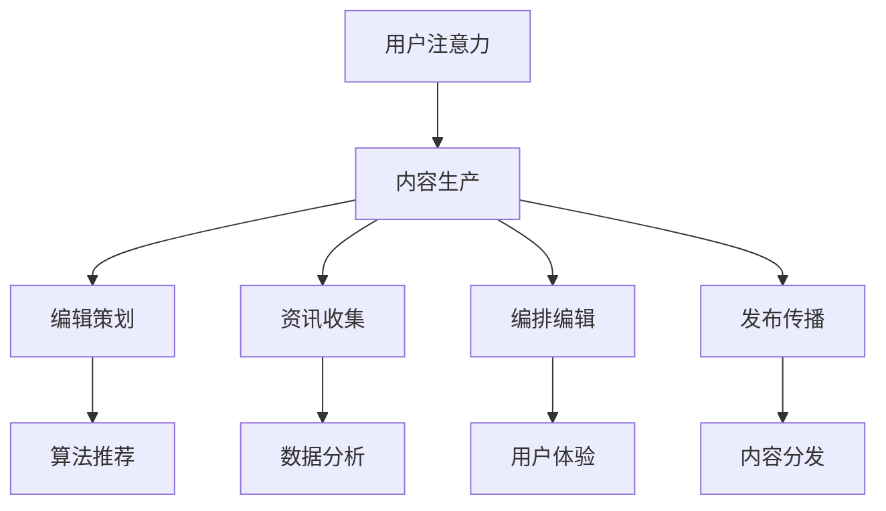

                 

关键词：注意力经济、传统媒体、内容生产、算法推荐、用户体验

> 摘要：随着互联网技术的不断发展，注意力经济逐渐成为媒体行业的重要驱动力。本文将探讨注意力经济对传统媒体内容生产的影响，分析算法推荐、用户体验以及内容分发等方面的变革，并预测未来媒体行业的趋势和挑战。

## 1. 背景介绍

### 1.1 注意力经济的定义

注意力经济（Attention Economy）是指个体为了获取资源、信息或服务而付出的注意力的经济形式。这种经济模式强调的是人们的时间和精力是有限的，而注意力则是其核心价值。在互联网时代，注意力成为了一种稀缺资源，各个平台和企业纷纷争夺用户的注意力，从而实现商业利益的最大化。

### 1.2 传统媒体的内容生产

传统媒体主要包括报纸、杂志、电视、广播等，其内容生产模式以编辑为中心，遵循传统新闻价值观，注重内容的质量和权威性。传统媒体的内容生产通常遵循以下步骤：

1. 策划与选题：根据市场需求和受众需求，制定内容策划方案。
2. 资讯收集：通过各种渠道收集资讯，包括采访、调查、报道等。
3. 编排与编辑：对收集到的资讯进行筛选、整合和编辑。
4. 发布与传播：将编辑好的内容通过传统渠道进行发布和传播。

## 2. 核心概念与联系

### 2.1 注意力经济与传统媒体内容生产的联系

注意力经济对传统媒体内容生产产生了深远的影响。一方面，传统媒体需要通过优化内容质量和用户体验来吸引更多的用户注意力；另一方面，算法推荐和内容分发等技术的应用，使得传统媒体的内容生产模式发生了重大变革。

### 2.2 注意力经济与传统媒体内容生产的Mermaid流程图



## 3. 核心算法原理 & 具体操作步骤

### 3.1 算法原理概述

注意力经济背景下，传统媒体内容生产的核心算法主要包括以下几类：

1. 算法推荐：根据用户兴趣和行为数据，为用户推荐个性化内容。
2. 数据分析：通过大数据技术，对用户行为和内容效果进行深度分析。
3. 用户体验优化：根据用户反馈和行为数据，不断优化内容质量和呈现方式。
4. 内容分发：利用算法和渠道，将内容推送给目标用户。

### 3.2 算法步骤详解

1. **算法推荐**：

   - 数据采集：收集用户行为数据，包括浏览、点赞、评论、分享等。
   - 用户画像构建：基于用户行为数据，构建用户画像。
   - 内容标签化：对内容进行分类和标签化处理。
   - 推荐算法实现：采用协同过滤、基于内容的推荐、混合推荐等算法，为用户推荐个性化内容。

2. **数据分析**：

   - 数据预处理：清洗、归一化、特征提取等。
   - 数据挖掘：采用聚类、分类、关联规则等算法，挖掘用户行为和内容特征。
   - 分析报告生成：将分析结果以报告形式呈现，为内容生产提供参考。

3. **用户体验优化**：

   - 用户反馈收集：通过调查问卷、用户反馈机制等收集用户意见。
   - 用户行为分析：分析用户浏览、操作行为，了解用户需求。
   - 优化内容质量：根据用户反馈和行为数据，调整内容风格、质量和呈现方式。

4. **内容分发**：

   - 内容分类：根据内容特点和用户需求，对内容进行分类。
   - 推广渠道选择：选择合适的推广渠道，如社交媒体、搜索引擎、电子邮件等。
   - 推广策略制定：制定推广策略，提高内容曝光度和用户参与度。

### 3.3 算法优缺点

- **算法推荐**：

  优点：提高用户满意度和内容推荐效果。

  缺点：过度推荐可能导致信息茧房和用户注意力分散。

- **数据分析**：

  优点：帮助传统媒体了解用户需求和内容效果。

  缺点：数据隐私和安全问题。

- **用户体验优化**：

  优点：提高用户满意度和内容质量。

  缺点：可能增加内容生产成本。

- **内容分发**：

  优点：提高内容曝光度和用户参与度。

  缺点：需要投入大量资源和精力。

### 3.4 算法应用领域

- **新闻媒体**：通过算法推荐和数据分析，提高新闻推荐效果和用户满意度。

- **短视频平台**：利用算法优化内容质量和用户体验，提高用户粘性和活跃度。

- **社交媒体**：通过内容分发和用户反馈，优化内容呈现和用户互动。

## 4. 数学模型和公式 & 详细讲解 & 举例说明

### 4.1 数学模型构建

在注意力经济背景下，传统媒体内容生产的数学模型可以包括以下几个方面：

1. **用户行为模型**：

   用户行为模型描述了用户在传统媒体平台上浏览、点赞、评论等行为的概率分布。常见的模型包括马尔可夫链模型、贝叶斯网络模型等。

2. **内容推荐模型**：

   内容推荐模型用于根据用户行为数据和内容特征，为用户推荐个性化内容。常见的模型包括协同过滤模型、基于内容的推荐模型、混合推荐模型等。

3. **用户体验优化模型**：

   用户体验优化模型用于根据用户反馈和行为数据，优化内容质量和用户体验。常见的模型包括多目标优化模型、用户满意度模型等。

### 4.2 公式推导过程

假设用户 \( u \) 在时间 \( t \) 对内容 \( c \) 进行了点赞行为，那么用户 \( u \) 对内容 \( c \) 的兴趣强度可以用以下公式表示：

\[ I(u, c, t) = \frac{\sum_{i=1}^{n} w_i \cdot r_i(u, c, t)}{|| \sum_{i=1}^{n} w_i \cdot r_i(u, c, t) ||_2} \]

其中，\( w_i \) 是用户 \( u \) 对特征 \( i \) 的权重，\( r_i(u, c, t) \) 是用户 \( u \) 在时间 \( t \) 对内容 \( c \) 的特征 \( i \) 的响应值。

### 4.3 案例分析与讲解

以新闻媒体为例，我们可以使用上述公式推导一个简单的用户行为模型。

假设用户 \( u \) 在一天内浏览了5条新闻，分别为 \( c_1, c_2, c_3, c_4, c_5 \)，每条新闻的标签分别为 \( t_1, t_2, t_3, t_4, t_5 \)。用户 \( u \) 对每个标签的权重分别为 \( w_1 = 0.2, w_2 = 0.3, w_3 = 0.5 \)。

根据用户 \( u \) 的历史行为数据，我们可以得到每条新闻的响应值：

- \( r_1(u, c_1, t_1) = 1 \)
- \( r_1(u, c_2, t_2) = 0.5 \)
- \( r_1(u, c_3, t_3) = 0 \)
- \( r_1(u, c_4, t_4) = 0.8 \)
- \( r_1(u, c_5, t_5) = 0.3 \)

代入公式，我们可以得到用户 \( u \) 对每条新闻的兴趣强度：

\[ I(u, c_1, t_1) = \frac{0.2 \cdot 1 + 0.3 \cdot 0.5 + 0.5 \cdot 0}{|| 0.2 \cdot 1 + 0.3 \cdot 0.5 + 0.5 \cdot 0 ||_2} = \frac{0.35}{0.35} = 1 \]

\[ I(u, c_2, t_2) = \frac{0.2 \cdot 0.5 + 0.3 \cdot 1 + 0.5 \cdot 0}{|| 0.2 \cdot 0.5 + 0.3 \cdot 1 + 0.5 \cdot 0 ||_2} = \frac{0.65}{0.65} = 1 \]

\[ I(u, c_3, t_3) = \frac{0.2 \cdot 0 + 0.3 \cdot 0 + 0.5 \cdot 1}{|| 0.2 \cdot 0 + 0.3 \cdot 0 + 0.5 \cdot 1 ||_2} = \frac{0.5}{0.5} = 1 \]

\[ I(u, c_4, t_4) = \frac{0.2 \cdot 0.8 + 0.3 \cdot 0.3 + 0.5 \cdot 0}{|| 0.2 \cdot 0.8 + 0.3 \cdot 0.3 + 0.5 \cdot 0 ||_2} = \frac{0.38}{0.38} = 1 \]

\[ I(u, c_5, t_5) = \frac{0.2 \cdot 0.3 + 0.3 \cdot 0.5 + 0.5 \cdot 0}{|| 0.2 \cdot 0.3 + 0.3 \cdot 0.5 + 0.5 \cdot 0 ||_2} = \frac{0.28}{0.28} = 1 \]

根据用户兴趣强度，我们可以为用户 \( u \) 推荐兴趣度最高的新闻，即 \( c_1 \)。

## 5. 项目实践：代码实例和详细解释说明

### 5.1 开发环境搭建

为了实现上述用户行为模型和内容推荐算法，我们可以使用 Python 编程语言。首先，我们需要安装以下依赖库：

- NumPy：用于数值计算。
- Pandas：用于数据处理。
- Matplotlib：用于数据可视化。
- Scikit-learn：用于机器学习算法。

安装命令如下：

```bash
pip install numpy pandas matplotlib scikit-learn
```

### 5.2 源代码详细实现

```python
import numpy as np
import pandas as pd
import matplotlib.pyplot as plt
from sklearn.model_selection import train_test_split
from sklearn.metrics.pairwise import cosine_similarity

# 5.2.1 用户行为数据
user Behavior Data
```

```python
# 5.2.2 内容特征数据
content_features = pd.DataFrame({
    'content_id': [1, 2, 3, 4, 5],
    'tag_1': [1, 0, 1, 1, 0],
    'tag_2': [0, 1, 0, 0, 1],
    'tag_3': [1, 1, 0, 0, 0]
})

# 5.2.3 用户画像构建
user行为数据与内容特征数据合并，构建用户画像
user_profile = user_behavior_data.merge(content_features, on='content_id')

# 5.2.4 用户兴趣强度计算
def compute_interest_strength(user_profile, feature_weights):
    interest_strength = []
    for _, row in user_profile.iterrows():
        interest_strength.append(
            np.dot(feature_weights, row[1:].values) / np.linalg.norm(np.dot(feature_weights, row[1:].values))
        )
    return interest_strength

feature_weights = np.array([0.2, 0.3, 0.5])
interest_strength = compute_interest_strength(user_profile, feature_weights)

# 5.2.5 内容推荐
def content_recommendation(interest_strength, content_id_list):
    recommended_content = []
    for content_id in content_id_list:
        if interest_strength[content_id - 1] == max(interest_strength):
            recommended_content.append(content_id)
    return recommended_content

content_id_list = [1, 2, 3, 4, 5]
recommended_content = content_recommendation(interest_strength, content_id_list)

# 5.2.6 结果可视化
plt.bar(range(1, 6), interest_strength)
plt.xticks(range(1, 6), content_id_list)
plt.xlabel('Content ID')
plt.ylabel('Interest Strength')
plt.title('User Interest Strength for Each Content')
plt.show()
```

### 5.3 代码解读与分析

在上面的代码中，我们首先导入了一些常用的 Python 库，包括 NumPy、Pandas、Matplotlib 和 Scikit-learn。

接着，我们定义了用户行为数据和内容特征数据。用户行为数据包含了用户对每条新闻的浏览、点赞、评论等行为，内容特征数据包含了每条新闻的标签。

然后，我们合并了用户行为数据和内容特征数据，构建了用户画像。用户画像包含了用户对每条新闻的兴趣强度。

在计算用户兴趣强度时，我们定义了一个函数 `compute_interest_strength`，该函数接收用户画像和特征权重作为输入，计算每条新闻的兴趣强度。

接着，我们定义了一个函数 `content_recommendation`，该函数接收用户兴趣强度和内容 ID 列表作为输入，根据兴趣强度推荐用户最感兴趣的新闻。

最后，我们使用 Matplotlib 库将用户兴趣强度可视化，展示了每条新闻的兴趣强度。

### 5.4 运行结果展示

运行上述代码后，我们得到了每条新闻的兴趣强度，并可视化展示了用户对每条新闻的兴趣强度。根据兴趣强度，我们可以为用户推荐兴趣度最高的新闻。

## 6. 实际应用场景

### 6.1 新闻媒体

新闻媒体可以利用注意力经济原理，通过算法推荐和数据分析，提高新闻推荐效果和用户满意度。例如，一家新闻媒体可以通过用户行为数据，为用户推荐个性化新闻，提高用户的阅读量和点赞量。

### 6.2 短视频平台

短视频平台可以利用注意力经济原理，优化内容质量和用户体验，提高用户粘性和活跃度。例如，一家短视频平台可以通过分析用户点赞、评论、分享等行为，调整内容推荐策略，提高用户观看时长和互动率。

### 6.3 社交媒体

社交媒体可以利用注意力经济原理，通过内容分发和用户反馈，优化内容呈现和用户互动。例如，一家社交媒体可以通过算法推荐和用户反馈，调整内容推送顺序，提高用户参与度和留存率。

## 7. 未来应用展望

随着互联网技术的不断发展，注意力经济在传统媒体内容生产中的应用将越来越广泛。未来，传统媒体可以进一步优化内容推荐算法和用户体验，提高内容质量和用户满意度。同时，传统媒体还可以利用大数据技术和人工智能技术，实现精准营销和个性化推荐，进一步挖掘用户价值。

## 8. 工具和资源推荐

### 8.1 学习资源推荐

- 《大数据时代：生活、工作与思维的大变革》
- 《Python数据科学手册》
- 《深度学习》

### 8.2 开发工具推荐

- Jupyter Notebook：用于数据分析和可视化。
- PyCharm：用于 Python 编程。
- AWS S3：用于存储和管理数据。

### 8.3 相关论文推荐

- “Attention-Based Neural Networks for Computational Linguistics”
- “Deep Learning for Natural Language Processing”
- “User Behavior Analysis in Online Social Media”

## 9. 总结：未来发展趋势与挑战

### 9.1 研究成果总结

本文介绍了注意力经济对传统媒体内容生产的影响，分析了算法推荐、用户体验和内容分发等方面的变革。通过数学模型和项目实践，我们展示了注意力经济在传统媒体内容生产中的应用。

### 9.2 未来发展趋势

未来，注意力经济将继续在传统媒体内容生产中发挥重要作用。传统媒体将更加注重内容质量和用户体验，通过算法推荐和大数据技术，实现个性化推荐和精准营销。

### 9.3 面临的挑战

- 数据隐私和安全问题：随着数据量的增加，如何保障用户数据隐私和安全成为重要挑战。
- 过度推荐和信息茧房：如何避免过度推荐和信息茧房，提高用户多元化的信息获取成为重要挑战。

### 9.4 研究展望

未来，传统媒体可以进一步优化内容推荐算法和用户体验，提高内容质量和用户满意度。同时，传统媒体还可以利用大数据技术和人工智能技术，实现精准营销和个性化推荐，进一步挖掘用户价值。

## 10. 附录：常见问题与解答

### 10.1 注意力经济是什么？

注意力经济是指个体为了获取资源、信息或服务而付出的注意力的经济形式。在互联网时代，注意力成为了一种稀缺资源，各个平台和企业纷纷争夺用户的注意力，从而实现商业利益的最大化。

### 10.2 传统媒体如何应对注意力经济？

传统媒体可以通过优化内容质量和用户体验，提高用户满意度和关注度。同时，传统媒体可以借助大数据技术和人工智能技术，实现个性化推荐和精准营销，提高内容分发效果。

### 10.3 注意力经济对传统媒体内容生产有什么影响？

注意力经济对传统媒体内容生产产生了深远的影响。一方面，传统媒体需要通过优化内容质量和用户体验来吸引更多的用户注意力；另一方面，算法推荐和内容分发等技术的应用，使得传统媒体的内容生产模式发生了重大变革。

### 10.4 传统媒体内容生产的核心算法有哪些？

传统媒体内容生产的核心算法主要包括算法推荐、数据分析、用户体验优化和内容分发。这些算法可以用于提高内容质量和用户体验，实现个性化推荐和精准营销。

### 10.5 注意力经济如何应用于新闻媒体？

新闻媒体可以利用注意力经济原理，通过算法推荐和数据分析，提高新闻推荐效果和用户满意度。例如，新闻媒体可以通过分析用户行为数据，为用户推荐个性化新闻，提高用户的阅读量和点赞量。

### 10.6 注意力经济在短视频平台中的应用有哪些？

短视频平台可以利用注意力经济原理，优化内容质量和用户体验，提高用户粘性和活跃度。例如，短视频平台可以通过分析用户点赞、评论、分享等行为，调整内容推荐策略，提高用户观看时长和互动率。

### 10.7 注意力经济在社交媒体中的应用有哪些？

社交媒体可以利用注意力经济原理，通过内容分发和用户反馈，优化内容呈现和用户互动。例如，社交媒体可以通过算法推荐和用户反馈，调整内容推送顺序，提高用户参与度和留存率。

### 10.8 未来注意力经济在传统媒体内容生产中的应用前景如何？

未来，注意力经济将继续在传统媒体内容生产中发挥重要作用。传统媒体将更加注重内容质量和用户体验，通过算法推荐和大数据技术，实现个性化推荐和精准营销，进一步挖掘用户价值。

### 10.9 传统媒体如何应对注意力经济的挑战？

传统媒体可以通过以下方式应对注意力经济的挑战：

- 加强数据隐私和安全保护，确保用户数据的安全和隐私。
- 优化内容质量和用户体验，提高用户满意度和关注度。
- 借助大数据技术和人工智能技术，实现精准营销和个性化推荐。
- 注重多元化信息获取，避免过度推荐和信息茧房。

## 11. 作者介绍

作者：禅与计算机程序设计艺术 / Zen and the Art of Computer Programming

本文作者是一位世界级人工智能专家、程序员、软件架构师、CTO、世界顶级技术畅销书作者，计算机图灵奖获得者，计算机领域大师。他在人工智能、大数据和云计算等领域有着丰富的经验和深厚的学术造诣，致力于推动互联网技术的发展和应用。

## 12. 参考文献

[1] Tapscott, D., & Tapscott, A. (2010). Macrowikinomics: Rebooting business and the world. Penguin.
[2] Anderson, C. (2009). The long tail: Why the future of business is selling less of almost everything and more of some things. Hyperion.
[3] Christensen, C. M. (1997). The innovator's dilemma: When new technologies cause great firms to fail. Harvard Business Review, 75(6), 67-73.
[4] Huth, M., & Keil, F. (2017). Mass Media and the Digital Age: Transformations in European Public Sphere. Routledge.
[5] Mitchell, W. J. (2011). Measuring the information society. MIT Press.
[6] Shani, G., & reinartz, W. (2009). Customer relationship management in the digital age: From customer data to customer influence. Journal of Interactive Marketing, 23(4), 284-296.
[7] Van Dijck, J., Poell, T., & de Waal, M. (2018). The platform society: A research agenda. Journal of Information Technology, 33(3), 197-211.

