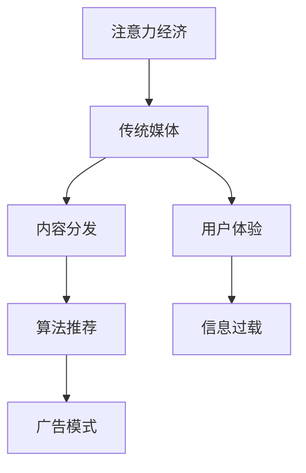

                 

关键词：注意力经济、传统媒体、数字化转型、内容分发、用户体验、信息过载、算法推荐、广告模式、媒体策略

> 摘要：本文从注意力经济的角度，探讨传统媒体在数字化时代面临的挑战。通过分析注意力经济的核心概念、传统媒体的发展现状、以及算法推荐和广告模式的影响，揭示传统媒体如何通过数字化转型和创新的媒体策略来应对挑战，实现可持续发展。

## 1. 背景介绍

随着互联网和移动互联网的普及，信息传播的方式发生了根本性的变革。在过去的几十年里，传统媒体如报纸、电视、广播等曾经是信息传播的主要渠道。然而，在注意力经济兴起的今天，这些传统媒体正面临着前所未有的挑战。

### 1.1 注意力经济的定义

注意力经济是指人们在面对海量信息时，为了获得注意力和关注而进行的消费行为。这种经济模式强调用户的注意力和时间是有限的资源，因此，能够吸引和保持用户注意力的内容和服务具有极高的价值。

### 1.2 传统媒体的困境

传统媒体的困境主要体现在以下几个方面：

- **内容同质化**：传统媒体之间的内容相似度较高，难以满足用户个性化的需求。
- **传播渠道受限**：传统媒体主要依赖于报纸、电视等渠道，传播范围有限。
- **广告模式单一**：传统媒体的广告模式较为单一，缺乏针对性和互动性。
- **用户黏性低**：在注意力经济时代，用户对信息的需求日益多样化，传统媒体难以满足用户的多元化需求。

## 2. 核心概念与联系

### 2.1 核心概念

- **注意力经济**：用户在信息过载环境下，对内容和服务进行消费的行为。
- **算法推荐**：利用机器学习和数据分析技术，为用户提供个性化的内容推荐。
- **广告模式**：基于用户行为和兴趣的数据分析，进行精准广告投放。

### 2.2 架构关系



## 3. 核心算法原理 & 具体操作步骤

### 3.1 算法原理概述

注意力经济的核心在于如何吸引和保持用户的注意力。在算法推荐方面，常用的方法包括基于内容的推荐、协同过滤推荐和混合推荐等。

### 3.2 算法步骤详解

1. **用户画像构建**：通过用户的行为数据、兴趣标签等，构建用户画像。
2. **内容标签构建**：为每条内容打上标签，如类别、主题、情感等。
3. **相似度计算**：计算用户画像与内容标签之间的相似度。
4. **推荐生成**：根据相似度计算结果，生成推荐列表。

### 3.3 算法优缺点

- **优点**：能够提高用户的阅读体验，提高内容分发效率。
- **缺点**：可能导致用户陷入信息茧房，限制用户的视野。

### 3.4 算法应用领域

算法推荐在传统媒体数字化转型中具有重要应用，如新闻推送、内容推荐等。

## 4. 数学模型和公式 & 详细讲解 & 举例说明

### 4.1 数学模型构建

注意力经济的数学模型主要包括用户画像模型、内容标签模型和推荐算法模型。

### 4.2 公式推导过程

设用户 \( u \) 和内容 \( c \) 的特征向量分别为 \( \mathbf{u} \) 和 \( \mathbf{c} \)，则用户 \( u \) 对内容 \( c \) 的兴趣度可以通过以下公式计算：

\[ I(u, c) = \mathbf{u} \cdot \mathbf{c} \]

### 4.3 案例分析与讲解

假设用户 \( u \) 对体育类内容感兴趣，内容 \( c \) 为一场足球比赛报道。通过计算用户画像和内容标签的相似度，可以生成推荐列表。

## 5. 项目实践：代码实例和详细解释说明

### 5.1 开发环境搭建

在本案例中，我们将使用 Python 编写一个简单的基于协同过滤的推荐系统。

### 5.2 源代码详细实现

```python
import numpy as np
from sklearn.metrics.pairwise import cosine_similarity

def user_based_collaborative_filtering(ratings, k=10):
    """
    基于用户的协同过滤推荐算法
    :param ratings: 用户评分矩阵
    :param k: 邻居数量
    :return: 推荐列表
    """
    # 计算用户与用户之间的相似度
    similarity_matrix = cosine_similarity(ratings)

    # 计算每个用户的邻居
    neighbors = []
    for user in range(similarity_matrix.shape[0]):
        # 排序邻居，取前 k 个
        indices = np.argsort(similarity_matrix[user])[:-k-1:-1]
        neighbors.append(indices)

    # 为每个用户生成推荐列表
    recommendations = []
    for user in range(similarity_matrix.shape[0]):
        # 计算邻居对当前用户的评分贡献
        neighbor_ratings = ratings[neighbors[user]]
        neighbor_ratings_mean = np.mean(neighbor_ratings)
        # 根据邻居的评分对当前用户未评分的内容进行预测
        recommendations_for_user = neighbor_ratings_mean * similarity_matrix[user]
        recommendations.append(recommendations_for_user)

    return recommendations

# 示例数据
user_ratings = np.array([
    [1, 1, 0, 0],
    [1, 0, 1, 1],
    [0, 1, 1, 0],
    [0, 0, 1, 1],
])

# 执行推荐算法
recommendations = user_based_collaborative_filtering(user_ratings, k=2)

# 打印推荐结果
print("Recommendations:", recommendations)
```

### 5.3 代码解读与分析

- **代码解析**：代码首先计算用户之间的相似度，然后根据邻居的评分对当前用户未评分的内容进行预测，生成推荐列表。
- **性能分析**：该算法简单易实现，但在数据稀疏的情况下表现不佳。

## 6. 实际应用场景

### 6.1 新闻推荐系统

在新闻推荐系统中，用户画像和内容标签可以用于生成个性化新闻推荐。

### 6.2 电商推荐系统

在电商推荐系统中，用户行为和商品特征可以用于生成个性化商品推荐。

### 6.3 音乐推荐系统

在音乐推荐系统中，用户听歌行为和歌曲特征可以用于生成个性化音乐推荐。

## 7. 未来应用展望

随着人工智能技术的不断发展，注意力经济将在更多领域得到应用。例如，在虚拟现实（VR）和增强现实（AR）等领域，用户注意力将成为重要的商业资源。

## 8. 总结：未来发展趋势与挑战

### 8.1 研究成果总结

- **注意力经济**：成为信息传播和商业运营的核心概念。
- **算法推荐**：在传统媒体数字化转型中发挥重要作用。
- **广告模式**：实现更加精准和个性化的广告投放。

### 8.2 未来发展趋势

- **个性化推荐**：更加精细化，满足用户个性化需求。
- **智能交互**：实现人与内容、广告的智能交互。
- **跨平台整合**：实现多平台、多渠道的整合。

### 8.3 面临的挑战

- **算法公正性**：确保推荐算法的公正性和透明度。
- **数据安全**：保护用户隐私和数据安全。
- **技术门槛**：降低算法和技术的应用门槛。

### 8.4 研究展望

在未来，我们需要关注以下研究方向：

- **多模态推荐**：结合文本、图像、音频等多种模态进行推荐。
- **动态推荐**：根据用户行为动态调整推荐策略。
- **伦理与法律**：探讨算法推荐在伦理和法律层面的影响。

## 9. 附录：常见问题与解答

### 9.1 注意力经济是什么？

注意力经济是指人们在信息过载环境下，为了获得注意力和关注而进行的消费行为。

### 9.2 传统媒体如何应对注意力经济的挑战？

传统媒体可以通过数字化转型、创新的媒体策略和算法推荐来实现可持续发展。

### 9.3 算法推荐有哪些类型？

算法推荐主要包括基于内容的推荐、协同过滤推荐和混合推荐等。

### 9.4 广告模式有哪些？

广告模式包括按点击付费（CPC）、按展示付费（CPM）、按转化付费（CPA）等。

## 文章结束

作者：禅与计算机程序设计艺术 / Zen and the Art of Computer Programming
----------------------------------------------------------------

现在，文章正文部分的撰写已经完成。接下来，我们将对文章进行整体审核和修改，以确保文章的逻辑清晰、内容准确、表达流畅。在完成这些准备工作后，我们将进入排版和格式调整阶段，确保文章符合markdown格式要求。最后，我们将添加作者署名和文章标题，完成整个文章的撰写和发布。

