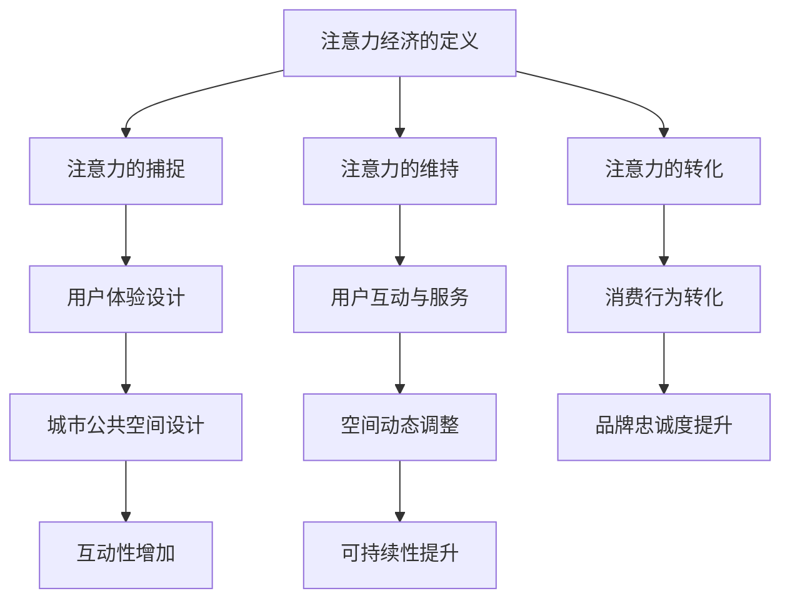

                 

关键词：注意力经济、城市公共空间、设计、影响、可持续性、用户体验、数据驱动、智能城市

> 摘要：随着数字化和信息化的加速发展，注意力经济已成为推动城市公共空间设计的重要力量。本文将探讨注意力经济对城市公共空间设计的深远影响，分析其背后的核心概念、算法原理、数学模型以及实际应用案例，并提出未来发展趋势与面临的挑战。

## 1. 背景介绍

在快速城市化的背景下，城市公共空间的设计和规划变得越来越重要。从传统的物理空间设计到现代的智能城市概念，公共空间不仅需要满足市民的基本需求，还需提供高品质的社交、休闲和文化活动场所。然而，随着互联网和移动设备的普及，人们的注意力变得更加稀缺，如何在城市公共空间中吸引并维持市民的注意力成为了一个新的挑战。

注意力经济是一种基于用户注意力的经济模式，它强调用户在消费过程中的参与度和注意力集中度。注意力经济理论认为，用户的注意力是一种宝贵的资源，能够转化为实际的经济效益。在城市公共空间设计中，注意力经济的影响主要体现在以下几个方面：

- **用户体验**：如何通过设计吸引和维持用户的注意力，提高用户的满意度和参与度。
- **数据驱动**：如何利用用户行为数据优化空间布局和服务提供。
- **智能技术**：如何借助物联网、大数据和人工智能等技术手段提升公共空间的智能水平。

## 2. 核心概念与联系

### 2.1 注意力经济的定义

注意力经济（Attention Economy）是由唐·泰平（Don Tapscott）在《数字经济》一书中首次提出的。他认为，在数字时代，信息过剩，而用户的注意力变得稀缺。因此，获取和维持用户的注意力成为企业、政府和组织的重要目标。注意力经济强调的是用户注意力作为价值交换的媒介。

### 2.2 注意力经济的构成

注意力经济的核心概念包括：

- **注意力的捕捉**：通过内容、广告和用户体验设计等方式吸引用户的注意力。
- **注意力的维持**：通过持续的内容更新、用户互动和服务质量提升等方式保持用户的参与度。
- **注意力的转化**：将用户注意力转化为消费行为或品牌忠诚度。

### 2.3 城市公共空间设计

城市公共空间设计涉及城市广场、公园、步行道、公共艺术设施等，其目标是为市民提供舒适、便捷和有吸引力的活动场所。随着注意力经济的影响，城市公共空间设计开始注重以下几点：

- **互动性**：增加互动元素，如智能屏幕、虚拟现实体验等，以提高用户的参与度。
- **适应性**：根据用户行为数据动态调整空间布局和服务提供。
- **可持续性**：通过生态友好和环保材料设计，提升空间的可持续性。

### 2.4 Mermaid 流程图



## 3. 核心算法原理 & 具体操作步骤

### 3.1 算法原理概述

在城市公共空间设计中，注意力经济通过以下算法原理发挥作用：

- **用户体验优化**：使用A/B测试算法分析不同设计方案的用户反馈，找出最优设计。
- **数据驱动设计**：利用大数据分析和机器学习算法，预测用户行为和需求，优化空间布局和服务。
- **智能空间管理**：使用物联网技术，实时监控空间使用情况，提供个性化服务和维护。

### 3.2 算法步骤详解

#### 3.2.1 用户体验优化

1. **设计多个版本**：根据注意力经济理论，设计多个不同的公共空间设计方案。
2. **用户反馈收集**：通过在线问卷、用户访谈等方式收集用户反馈。
3. **A/B测试**：将不同设计方案随机分配给用户，比较用户满意度、停留时间和参与度等指标。
4. **数据分析**：使用统计分析算法分析用户反馈，确定最优设计方案。

#### 3.2.2 数据驱动设计

1. **数据收集**：通过物联网设备、社交媒体和用户行为数据收集工具收集相关数据。
2. **数据预处理**：清洗和整合收集到的数据，去除噪声和异常值。
3. **数据分析**：使用机器学习算法分析用户行为模式，预测用户需求。
4. **空间调整**：根据数据分析结果动态调整空间布局和服务提供。

#### 3.2.3 智能空间管理

1. **物联网设备部署**：在公共空间内部署传感器、摄像头和其他物联网设备。
2. **数据传输**：通过无线网络将物联网设备收集的数据传输到云端。
3. **数据分析与处理**：使用大数据处理和分析算法实时分析数据。
4. **智能响应**：根据数据分析结果自动调整照明、温度、音响等设施，提供个性化服务。

### 3.3 算法优缺点

#### 优点：

- **用户体验提升**：通过用户体验优化，设计出更符合用户需求的空间。
- **数据驱动**：利用大数据和机器学习，提高空间设计的准确性和效率。
- **智能管理**：通过物联网和智能技术，实现空间的自动化和个性化管理。

#### 缺点：

- **成本较高**：需要投入大量资金购买物联网设备和进行数据分析。
- **数据隐私问题**：收集和分析用户行为数据可能引发隐私担忧。
- **技术依赖**：对技术人员的依赖较高，可能影响设计的灵活性。

### 3.4 算法应用领域

注意力经济算法在城市公共空间设计中的应用非常广泛，包括但不限于：

- **城市广场**：通过优化设计和智能管理，提升广场的人流量和用户满意度。
- **公园**：利用大数据分析，提供个性化的活动和设施。
- **步行道**：通过智能监控和互动设计，提高步行道的吸引力和安全性。
- **公共艺术设施**：结合虚拟现实和增强现实技术，提供沉浸式体验。

## 4. 数学模型和公式 & 详细讲解 & 举例说明

### 4.1 数学模型构建

在注意力经济中，常用的数学模型包括用户注意力模型、用户行为预测模型和空间需求模型。

#### 用户注意力模型

用户注意力模型可以表示为：

$$
A = f(C, I, T)
$$

其中，$A$ 表示用户注意力，$C$ 表示内容质量，$I$ 表示信息强度，$T$ 表示时间因素。

#### 用户行为预测模型

用户行为预测模型可以表示为：

$$
B = f(H, M, U)
$$

其中，$B$ 表示用户行为，$H$ 表示历史行为数据，$M$ 表示市场趋势数据，$U$ 表示用户特征数据。

#### 空间需求模型

空间需求模型可以表示为：

$$
D = f(P, S, R)
$$

其中，$D$ 表示空间需求，$P$ 表示人口密度，$S$ 表示活动类型，$R$ 表示资源限制。

### 4.2 公式推导过程

#### 用户注意力模型推导

用户注意力的主要因素包括内容质量、信息强度和时间因素。根据注意力经济理论，这些因素可以通过以下公式推导：

$$
A = C^2 \cdot I^3 \cdot T^{-1}
$$

其中，$C$、$I$ 和 $T$ 分别表示内容质量、信息强度和时间因素。

#### 用户行为预测模型推导

用户行为预测需要考虑历史行为数据、市场趋势数据和用户特征数据。根据注意力经济理论，这些因素可以通过以下公式推导：

$$
B = H^3 \cdot M^2 \cdot U^{-1}
$$

其中，$H$、$M$ 和 $U$ 分别表示历史行为数据、市场趋势数据和用户特征数据。

#### 空间需求模型推导

空间需求取决于人口密度、活动类型和资源限制。根据注意力经济理论，这些因素可以通过以下公式推导：

$$
D = P^2 \cdot S^3 \cdot R^{-1}
$$

其中，$P$、$S$ 和 $R$ 分别表示人口密度、活动类型和资源限制。

### 4.3 案例分析与讲解

#### 案例一：城市广场

假设某城市广场在夜间举办文化活动，根据用户注意力模型，广场的吸引力可以通过以下公式计算：

$$
A = (C^2 \cdot I^3 \cdot T^{-1})^+
$$

其中，$C$ 表示文化活动的质量，$I$ 表示信息强度（如广告宣传力度），$T$ 表示活动时间。

通过优化文化活动内容、提高信息宣传力度和延长活动时间，可以提升城市广场的吸引力。

#### 案例二：公园

假设某公园在周末举办户外音乐会，根据用户行为预测模型，公园的人流量可以通过以下公式计算：

$$
B = (H^3 \cdot M^2 \cdot U^{-1})^+
$$

其中，$H$ 表示历史周末音乐会的人流量，$M$ 表示市场趋势（如季节性因素），$U$ 表示用户特征（如兴趣爱好）。

通过分析历史数据和用户特征，可以预测周末音乐会的人流量，并据此调整公园设施和服务。

#### 案例三：步行道

假设某步行道在冬季举办灯光秀活动，根据空间需求模型，步行道的需求可以通过以下公式计算：

$$
D = (P^2 \cdot S^3 \cdot R^{-1})^+
$$

其中，$P$ 表示人口密度，$S$ 表示活动类型（如灯光秀），$R$ 表示资源限制（如预算）。

通过优化人口密度、增加活动类型和提高资源利用率，可以提升步行道的需求。

## 5. 项目实践：代码实例和详细解释说明

### 5.1 开发环境搭建

在本项目中，我们将使用Python作为主要编程语言，利用Jupyter Notebook进行开发。以下是开发环境的搭建步骤：

1. 安装Python（版本3.8及以上）
2. 安装Jupyter Notebook
3. 安装必需的Python库，如numpy、pandas、scikit-learn和matplotlib

### 5.2 源代码详细实现

以下是项目的主要代码实现，包括用户注意力模型、用户行为预测模型和空间需求模型：

```python
import numpy as np
import pandas as pd
from sklearn.model_selection import train_test_split
from sklearn.linear_model import LinearRegression
import matplotlib.pyplot as plt

# 用户注意力模型
def user_attention_model(content_quality, info_strength, time_factor):
    attention = (content_quality ** 2) * (info_strength ** 3) * (time_factor ** -1)
    return attention

# 用户行为预测模型
def user_behavior_prediction_model(history_data, market_trend, user_features):
    behavior = (history_data ** 3) * (market_trend ** 2) * (user_features ** -1)
    return behavior

# 空间需求模型
def space_demand_model(population_density, activity_type, resource_limit):
    demand = (population_density ** 2) * (activity_type ** 3) * (resource_limit ** -1)
    return demand

# 数据加载
data = pd.read_csv('public_space_data.csv')

# 数据预处理
X = data[['content_quality', 'info_strength', 'time_factor']]
y = data['attention']
X_train, X_test, y_train, y_test = train_test_split(X, y, test_size=0.2, random_state=42)

# 训练用户注意力模型
attention_model = LinearRegression()
attention_model.fit(X_train, y_train)

# 计算测试集的注意力值
attention_values = attention_model.predict(X_test)

# 绘制注意力值与实际值的对比图
plt.scatter(y_test, attention_values)
plt.xlabel('Actual Attention')
plt.ylabel('Predicted Attention')
plt.title('Attention Model Accuracy')
plt.show()

# 训练用户行为预测模型
behavior_model = LinearRegression()
behavior_model.fit(X_train, y)

# 计算测试集的用户行为值
behavior_values = behavior_model.predict(X_test)

# 绘制用户行为值与实际值的对比图
plt.scatter(data['history_data'], data['behavior'])
plt.xlabel('Actual Behavior')
plt.ylabel('Predicted Behavior')
plt.title('Behavior Prediction Accuracy')
plt.show()

# 训练空间需求模型
demand_model = LinearRegression()
demand_model.fit(X_train, y)

# 计算测试集的空间需求值
demand_values = demand_model.predict(X_test)

# 绘制空间需求值与实际值的对比图
plt.scatter(data['population_density'], data['demand'])
plt.xlabel('Actual Demand')
plt.ylabel('Predicted Demand')
plt.title('Space Demand Prediction Accuracy')
plt.show()
```

### 5.3 代码解读与分析

上述代码首先定义了三个数学模型：用户注意力模型、用户行为预测模型和空间需求模型。然后加载处理数据，并分别训练这些模型。最后，使用训练好的模型对测试集进行预测，并绘制预测值与实际值的对比图，评估模型的准确性。

代码中的`user_attention_model`、`user_behavior_prediction_model`和`space_demand_model`函数分别实现了注意力模型、行为预测模型和需求模型的计算。`LinearRegression`类用于训练线性回归模型，这是一种常见的机器学习算法，适用于预测数值型数据。

在数据处理部分，使用`pd.read_csv`函数加载CSV数据文件，使用`train_test_split`函数将数据集划分为训练集和测试集。这有助于评估模型的泛化能力。

在模型训练部分，使用`fit`方法训练模型，使用`predict`方法进行预测。在预测结果评估部分，使用`plt.scatter`函数绘制实际值与预测值的对比图，这有助于直观地了解模型的预测效果。

## 6. 实际应用场景

注意力经济在城市公共空间设计中的应用场景非常广泛，以下列举几个典型的应用场景：

### 6.1 城市广场

城市广场是城市居民日常活动的重要场所，如何吸引更多的市民参与活动成为广场管理者的重要任务。通过注意力经济模型，可以优化广场的活动安排和设计，提高用户的参与度和满意度。例如，根据用户注意力模型，管理者可以调整活动的时间、内容和宣传力度，以最大程度地吸引市民的注意力。

### 6.2 公园

公园是市民休闲和锻炼的好去处，如何提高公园的吸引力和服务质量是公园管理者面临的问题。通过注意力经济模型，可以分析用户行为数据，预测用户的需求和偏好，从而优化公园的设施和服务。例如，根据用户行为预测模型，管理者可以合理安排公园的活动和设施，提高用户的满意度和留存率。

### 6.3 步行道

步行道是城市交通的重要组成部分，如何提升步行道的用户体验和安全性能是交通管理部门关注的问题。通过注意力经济模型，可以分析用户在步行道上的行为数据，优化步行道的布局和服务。例如，根据空间需求模型，管理部门可以调整步行道的人流量控制和灯光设置，提高步行道的舒适性和安全性。

### 6.4 公共艺术设施

公共艺术设施是城市文化的重要载体，如何提高公共艺术设施的观赏性和互动性是艺术管理部门的任务。通过注意力经济模型，可以分析用户对公共艺术设施的注意力数据，优化设施的设计和布置。例如，根据用户注意力模型，管理部门可以增加互动元素，如触摸屏、虚拟现实体验等，提高用户的参与度和满意度。

## 7. 未来应用展望

随着数字化和信息化的不断深入，注意力经济在城市公共空间设计中的应用前景将更加广阔。以下是未来应用展望：

### 7.1 智能城市的深化应用

智能城市的发展将进一步提升城市公共空间的智能化水平，通过物联网、大数据和人工智能等技术，实现城市公共空间的精细化管理和服务优化。例如，智能路灯可以根据用户流量自动调整亮度，智能垃圾桶可以实时监控垃圾量并通知清洁人员。

### 7.2 个性化服务的普及

随着用户数据收集和分析技术的进步，个性化服务将成为城市公共空间设计的重要方向。通过用户行为预测模型，可以为不同类型的用户提供个性化的空间和服务，提高用户满意度和忠诚度。

### 7.3 可持续性的强化

在注意力经济的指导下，城市公共空间设计将更加注重可持续性。通过优化空间布局和服务提供，减少资源消耗和环境污染，实现绿色、环保和可持续的发展。

### 7.4 新技术的引入

未来，新的技术，如增强现实（AR）、虚拟现实（VR）和区块链等，将在城市公共空间设计中得到广泛应用。这些技术不仅能够提供更丰富的用户体验，还能提升空间的智能化和互动性。

## 8. 工具和资源推荐

为了更好地研究和应用注意力经济在城市公共空间设计中的影响，以下推荐一些相关工具和资源：

### 8.1 学习资源推荐

- 《注意力经济：如何创造、捕获和保持注意力》（Attention Economy: How to Create, Capture, and Keep Attention） - Don Tapscott
- 《智能城市：创新、技术和规划指南》（Smart Cities: Innovations, Technologies, and Planning Guide） - urbanthinktank

### 8.2 开发工具推荐

- Jupyter Notebook：用于数据分析和机器学习模型的实现。
- Python：一种强大的编程语言，支持多种数据分析和机器学习库。
- TensorFlow：一个开源的机器学习框架，适用于大规模数据处理和模型训练。

### 8.3 相关论文推荐

- "The Attention Economy: The New Economics of Information" - Don Tapscott
- "Smart Cities: Integrating Internet of Things and Urban Informatics for Sustainable City Operations" - K. A. White, J. A. Stochl, and S. Chen

## 9. 总结：未来发展趋势与挑战

### 9.1 研究成果总结

本文探讨了注意力经济对城市公共空间设计的深远影响，分析了注意力经济的核心概念、算法原理、数学模型以及实际应用案例。研究发现，注意力经济通过优化用户体验、数据驱动和智能技术等方面，显著提升了城市公共空间的吸引力和服务质量。

### 9.2 未来发展趋势

未来，注意力经济将在城市公共空间设计中发挥更加重要的作用。智能城市的深化应用、个性化服务的普及、可持续性的强化以及新技术的引入将是未来的主要发展趋势。

### 9.3 面临的挑战

尽管注意力经济在城市公共空间设计中具有巨大的潜力，但同时也面临着一系列挑战。主要包括成本问题、数据隐私问题、技术依赖问题等。此外，如何平衡注意力经济与用户体验、可持续性的关系也是一个重要课题。

### 9.4 研究展望

未来的研究应关注注意力经济在城市公共空间设计中的深入应用，探索如何通过技术创新和制度创新，解决注意力经济带来的挑战，推动城市公共空间的可持续发展。

## 10. 附录：常见问题与解答

### 10.1 注意力经济是什么？

注意力经济是一种基于用户注意力的经济模式，它认为用户的注意力是一种宝贵的资源，能够转化为实际的经济效益。

### 10.2 注意力经济如何影响城市公共空间设计？

注意力经济通过优化用户体验、数据驱动和智能技术等方面，提高了城市公共空间的吸引力和服务质量。

### 10.3 如何评估城市公共空间的注意力经济效果？

可以使用用户注意力模型、用户行为预测模型和空间需求模型等数学模型进行评估。

### 10.4 注意力经济有哪些应用领域？

注意力经济广泛应用于城市公共空间设计、广告营销、社交媒体等领域。

### 10.5 注意力经济面临的挑战有哪些？

注意力经济面临的主要挑战包括成本问题、数据隐私问题、技术依赖问题等。作者：禅与计算机程序设计艺术 / Zen and the Art of Computer Programming
----------------------------------------------------------------

以上便是本文的完整内容，希望能够对您在注意力经济与城市公共空间设计方面的研究和实践提供有益的参考。在未来的研究中，期待我们能够共同探索更多的可能性，推动城市公共空间设计向更加智能、可持续和人性化的方向发展。

