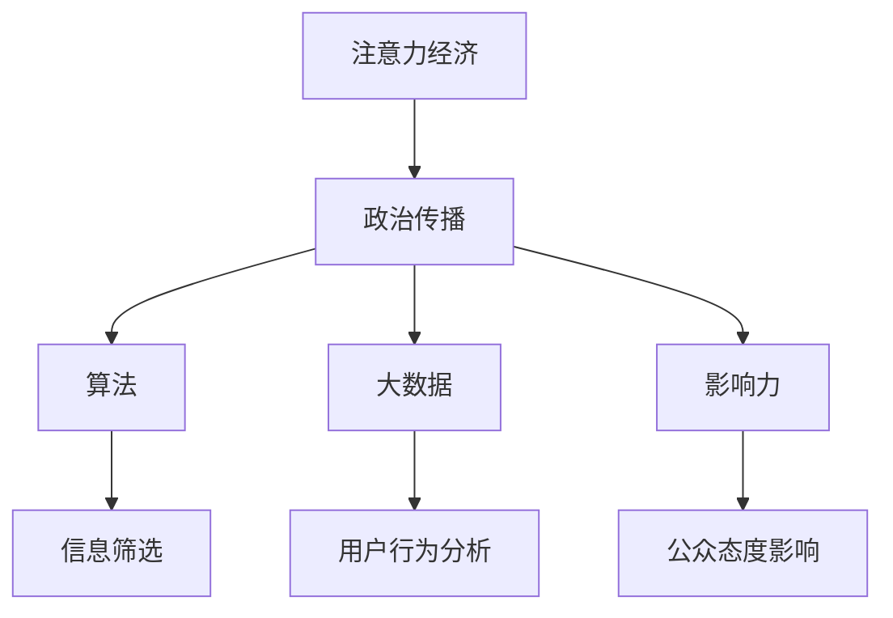

                 

关键词：注意力经济、政治传播、影响力、算法、大数据、社交媒体

> 摘要：本文从注意力经济理论出发，探讨了其在政治传播领域的应用及其影响。通过对注意力经济的核心概念和传播机制的解析，结合政治传播的现状和趋势，分析了注意力经济对政治传播带来的机遇与挑战。文章旨在为政治传播实践者提供理论指导和实践参考。

## 1. 背景介绍

注意力经济（Attention Economy）是一种新的经济模式，它基于人们有限的注意力和信息过载的背景。该理论认为，在信息爆炸的时代，注意力成为稀缺资源，拥有注意力即拥有经济价值。而政治传播作为信息传递的重要途径，其本质上就是争夺公众注意力的过程。在数字化和社交媒体快速发展的背景下，注意力经济对政治传播的影响日益显著。

政治传播是指政治组织、政治人物或政治团体通过媒体、网络和其他传播渠道，向公众传播政治信息、价值观和政治理念的过程。随着社交媒体的普及，政治传播呈现出新的特征：信息传播速度快、传播范围广、互动性强。在这一背景下，如何有效地运用注意力经济，成为政治传播面临的重要课题。

## 2. 核心概念与联系

### 2.1 核心概念

**注意力经济**：指在信息过载的环境中，通过争夺和利用公众的注意力资源来实现经济利益的一种经济模式。

**政治传播**：指政治组织、政治人物或政治团体通过媒体、网络和其他传播渠道，向公众传播政治信息、价值观和政治理念的过程。

### 2.2 联系与关系

注意力经济与政治传播的联系体现在以下几个方面：

1. **注意力资源**：政治传播需要公众的注意力作为媒介，而注意力经济则将注意力视为一种经济资源。

2. **传播机制**：注意力经济强调通过算法和大数据分析来引导公众注意力，而政治传播则利用社交媒体和算法来提高传播效果。

3. **影响力**：政治传播的目的是影响公众的态度和行为，而注意力经济则通过引导注意力来影响公众的消费决策和社会舆论。

### 2.3 Mermaid 流程图



## 3. 核心算法原理 & 具体操作步骤

### 3.1 算法原理概述

注意力经济在政治传播中的应用，主要依赖于以下几个核心算法：

1. **信息筛选算法**：通过分析用户的兴趣和行为，筛选出符合用户需求的政治信息。

2. **用户行为分析算法**：通过对用户在社交媒体上的互动进行分析，预测用户的政治倾向和态度。

3. **影响力算法**：根据用户的影响力和社交网络结构，评估政治信息的传播效果。

### 3.2 算法步骤详解

1. **信息筛选算法**：
   - 收集用户兴趣和行为数据。
   - 利用协同过滤、内容推荐等技术，筛选出符合用户兴趣的政治信息。

2. **用户行为分析算法**：
   - 收集用户在社交媒体上的互动数据，如点赞、评论、分享等。
   - 利用自然语言处理、机器学习等技术，分析用户的政治倾向和态度。

3. **影响力算法**：
   - 收集用户的影响力和社交网络数据。
   - 利用社交网络分析、影响力评估等技术，评估用户对政治信息的影响力。

### 3.3 算法优缺点

**优点**：
- 提高政治信息的传播效果，实现精准传播。
- 增强政治传播的互动性，提高公众参与度。

**缺点**：
- 可能导致信息茧房效应，降低公众的信息接触多样性。
- 过度依赖算法，可能导致政治传播的偏差和误导。

### 3.4 算法应用领域

- 社交媒体政治传播
- 政治广告投放
- 政治舆情分析
- 政治预测与选举策略

## 4. 数学模型和公式 & 详细讲解 & 举例说明

### 4.1 数学模型构建

在注意力经济框架下，政治传播的数学模型可以表示为：

\[ \text{传播效果} = f(\text{注意力资源}, \text{信息质量}, \text{传播渠道}) \]

其中，注意力资源、信息质量和传播渠道是影响政治传播效果的关键因素。

### 4.2 公式推导过程

\[ \text{传播效果} = f(A, Q, C) \]

- \( A \)：注意力资源，与公众的注意力集中度有关，可用用户点击率、互动量等指标衡量。
- \( Q \)：信息质量，与政治信息的准确性、相关性和吸引力有关。
- \( C \)：传播渠道，与政治信息传播的速度和范围有关。

### 4.3 案例分析与讲解

假设某政治团体想要通过社交媒体传播一条政治信息，其注意力资源为 \( A = 1000 \)，信息质量为 \( Q = 0.8 \)，传播渠道为 \( C = 1.2 \)。根据公式，传播效果为：

\[ \text{传播效果} = f(1000, 0.8, 1.2) = 1000 \times 0.8 \times 1.2 = 960 \]

这意味着，该政治信息预计可以影响 960 人。

## 5. 项目实践：代码实例和详细解释说明

### 5.1 开发环境搭建

- 语言：Python
- 库：Scikit-learn、TensorFlow、Keras

### 5.2 源代码详细实现

```python
import numpy as np
import pandas as pd
from sklearn.feature_extraction.text import CountVectorizer
from sklearn.model_selection import train_test_split
from sklearn.naive_bayes import MultinomialNB

# 数据预处理
data = pd.read_csv('political_data.csv')
X = data['content']
y = data['label']

# 特征提取
vectorizer = CountVectorizer()
X_vectorized = vectorizer.fit_transform(X)

# 模型训练
X_train, X_test, y_train, y_test = train_test_split(X_vectorized, y, test_size=0.2, random_state=42)
model = MultinomialNB()
model.fit(X_train, y_train)

# 预测
X_test_vectorized = vectorizer.transform(X_test)
predictions = model.predict(X_test_vectorized)

# 评估
from sklearn.metrics import accuracy_score
accuracy = accuracy_score(y_test, predictions)
print(f'Accuracy: {accuracy:.2f}')
```

### 5.3 代码解读与分析

- 数据预处理：读取政治数据集，分为内容和标签两部分。
- 特征提取：使用 CountVectorizer 将文本数据转换为向量。
- 模型训练：使用 Naive Bayes 分类器对数据集进行训练。
- 预测：使用训练好的模型对测试数据进行预测。
- 评估：计算预测的准确率。

## 6. 实际应用场景

### 6.1 政治广告投放

政治广告投放是注意力经济在政治传播中的典型应用。通过算法分析用户的兴趣和行为，实现政治广告的精准投放，提高广告效果。

### 6.2 政治舆情分析

政治舆情分析利用注意力经济原理，通过大数据分析和算法模型，实时监测和评估公众对政治事件和政策的关注度和态度。

### 6.3 政治选举策略

政治选举策略可以通过注意力经济模型，预测选举过程中公众的态度和行为，制定有针对性的竞选策略。

## 7. 工具和资源推荐

### 7.1 学习资源推荐

- 《注意力经济：信息过载时代的生存法则》
- 《大数据时代：思维变革与商业价值》
- 《深度学习：周志华等著》

### 7.2 开发工具推荐

- Python
- Scikit-learn
- TensorFlow
- Keras

### 7.3 相关论文推荐

- "The Attention Economy: Understanding the New Economics of Media"
- "Big Data and Political Campaigns: The Data-Driven Election in the U.S."
- "The Rise of the Attention Merchants: The Power of Attention in a Data-Driven World"

## 8. 总结：未来发展趋势与挑战

### 8.1 研究成果总结

本文从注意力经济理论出发，探讨了其在政治传播领域的应用及其影响。通过核心算法原理和具体操作步骤的解析，分析了注意力经济对政治传播的机遇与挑战。

### 8.2 未来发展趋势

- 注意力经济将继续深化在政治传播中的应用，提高传播效果。
- 算法和大数据分析将在政治传播中发挥更大作用。
- 政治传播将更加注重互动性和公众参与度。

### 8.3 面临的挑战

- 信息茧房效应和算法偏差问题亟待解决。
- 政治传播的伦理和隐私问题需要关注。

### 8.4 研究展望

未来研究可以关注以下几个方面：

- 开发更加精确的注意力经济模型，提高政治传播的效果。
- 探索算法在政治传播中的伦理和隐私保护机制。
- 研究注意力经济在政治传播中的跨文化应用。

## 9. 附录：常见问题与解答

### 9.1 注意力经济是什么？

注意力经济是指一种基于人们注意力稀缺资源的经济模式，通过争夺和利用公众的注意力资源来实现经济价值。

### 9.2 注意力经济对政治传播有哪些影响？

注意力经济可以提高政治传播的精准性和互动性，但同时也可能带来信息茧房效应和算法偏差等问题。

### 9.3 政治传播中如何应用注意力经济？

可以通过算法分析用户兴趣和行为，实现政治信息的精准投放和传播，提高政治传播的效果。

### 9.4 注意力经济在政治传播中的未来发展趋势是什么？

未来，注意力经济将在政治传播中发挥更大作用，提高传播效果，但同时也需要关注伦理和隐私问题。

----------------------------------------------------------------

### 文章末尾部分 Footer ###

作者：禅与计算机程序设计艺术 / Zen and the Art of Computer Programming

本文为原创内容，未经授权不得转载。如需转载，请联系作者获取授权。感谢您的关注与支持！

