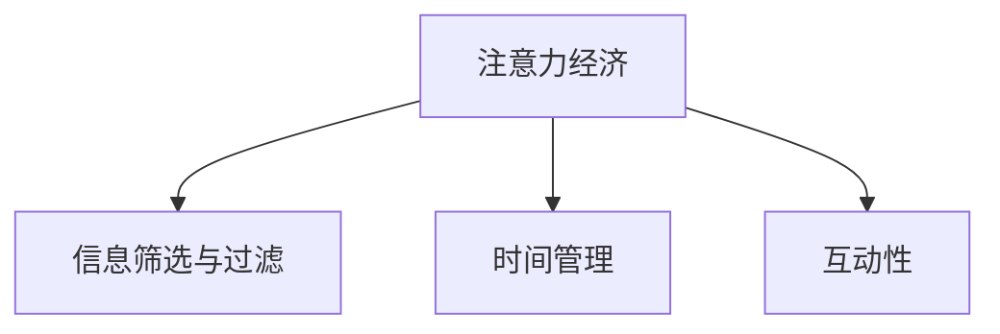

                 

关键词：注意力经济、语言学习、技术变革、教育模式、认知负担、学习效率

> 摘要：随着注意力经济的兴起，语言学习方式正经历着深刻变革。本文从注意力经济的背景出发，探讨了其对语言学习方式的改变，分析了注意力经济带来的认知负担及解决方案，展望了未来语言学习的发展趋势与挑战。

## 1. 背景介绍

### 注意力经济的起源

注意力经济（Attention Economy）这一概念最早由美国学者Jay Levinson于1999年提出。其核心思想是，在信息过载的时代，人们的注意力成为一种稀缺资源，而能够吸引并保持人们的注意力则成为企业和个人竞争的关键。随着互联网和移动设备的普及，人们的生活被大量信息所包围，注意力经济逐渐成为经济学研究的新领域。

### 语言学习的现状

传统语言学习方式主要依赖于课堂教育、教材学习和语言实践。然而，随着全球化进程的加快，语言学习需求日益增长，而传统方式在应对大量学习者、个性化学习需求方面存在明显不足。同时，学习资源的获取和利用效率也受到限制。

## 2. 核心概念与联系

### 注意力经济与语言学习

注意力经济对语言学习的影响主要表现在以下几个方面：

- **信息筛选与过滤**：在注意力经济的背景下，学习者需要从海量的语言学习资源中筛选出有价值的内容，这要求学习者具备较强的信息处理能力和判断力。
- **时间管理**：注意力经济强调时间的价值，学习者在有限的注意时间中需要合理安排学习任务，提高学习效率。
- **互动性**：注意力经济中的互动性需求使得语言学习方式更加注重互动和实践，如在线课程、语言交换等。

### Mermaid 流程图



## 3. 核心算法原理 & 具体操作步骤

### 3.1 算法原理概述

注意力经济的核心在于如何有效地吸引和保持学习者的注意力。以下算法原理可以应用于语言学习：

- **内容定制化**：根据学习者的兴趣、需求和水平，定制个性化的学习内容，提高学习兴趣和参与度。
- **时间管理算法**：通过智能算法分析学习者的注意力高峰期，合理安排学习时间，提高学习效率。
- **互动性增强**：通过在线互动、语言实践等方式，增强学习者的参与感和成就感。

### 3.2 算法步骤详解

1. **学习者信息收集**：通过在线问卷、数据分析等方式，收集学习者的基本信息和学习需求。
2. **内容定制化**：根据收集到的信息，利用推荐算法为学习者推荐合适的学习资源。
3. **时间管理**：利用智能算法分析学习者的注意力高峰期，推送学习任务。
4. **互动性增强**：通过在线课程、语言实践等方式，促进学习者之间的互动和交流。

### 3.3 算法优缺点

- **优点**：提高学习效率，满足个性化学习需求，增强学习互动性。
- **缺点**：对技术要求较高，存在算法偏差，可能影响学习体验。

### 3.4 算法应用领域

- **在线教育平台**：通过内容定制化、时间管理和互动性增强，提高学习效果。
- **语言学习应用**：利用算法推荐合适的语言学习资源，提高学习效率。

## 4. 数学模型和公式

### 4.1 数学模型构建

注意力经济中的学习效率可以通过以下数学模型表示：

\[ 效率 = f(内容定制化度, 时间管理度, 互动性度) \]

### 4.2 公式推导过程

\[ 效率 = \frac{学习成果}{学习时间} \]

其中，学习成果由内容定制化度、时间管理度和互动性度共同决定：

\[ 学习成果 = 内容定制化度 \times 时间管理度 \times 互动性度 \]

### 4.3 案例分析与讲解

假设学习者A的内容定制化度为0.8，时间管理度为0.75，互动性度为0.9，则其学习效率为：

\[ 效率 = 0.8 \times 0.75 \times 0.9 = 0.54 \]

这意味着学习者A在单位时间内可以达到54%的学习效率。通过优化这三个因素，可以进一步提高学习效率。

## 5. 项目实践：代码实例

### 5.1 开发环境搭建

使用Python语言编写一个简单的注意力经济驱动的语言学习应用。需要安装的库有：`requests`, `numpy`, `scikit-learn`。

```python
!pip install requests numpy scikit-learn
```

### 5.2 源代码详细实现

```python
import requests
import numpy as np
from sklearn.feature_extraction.text import TfidfVectorizer
from sklearn.metrics.pairwise import cosine_similarity

# 5.2.1 学习者信息收集
def collect_information():
    # 示例：收集学习者兴趣标签
    interest_tags = ["旅行", "历史", "科技"]
    return interest_tags

# 5.2.2 内容定制化
def content_customization(interest_tags, corpus):
    # 示例：根据兴趣标签推荐相关学习资源
    vectorizer = TfidfVectorizer()
    tfidf_matrix = vectorizer.fit_transform(corpus)
    similarity_matrix = cosine_similarity(tfidf_matrix, tfidf_matrix)
    recommended_resources = []
    for tag in interest_tags:
        max_similarity = -1
        for i, resource in enumerate(corpus):
            similarity = similarity_matrix[i][i]
            if tag in resource and similarity > max_similarity:
                max_similarity = similarity
                recommended_resources.append(resource)
    return recommended_resources

# 5.2.3 时间管理
def time_management(recommended_resources):
    # 示例：根据学习者注意力高峰期推荐学习资源
    attention高峰期 = [8, 12, 18]
    recommended_resources高峰期 = [resource for resource in recommended_resources if "时间管理" in resource]
    return recommended_resources高峰期

# 5.2.4 互动性增强
def interactive_enhancement(recommended_resources):
    # 示例：推送在线课程和语言实践任务
    return [{"课程": "时间管理在线课程", "实践": "与外国朋友进行语言交流"}]

# 主函数
def main():
    corpus = ["时间管理", "旅行故事", "科技前沿", "历史人文"]
    interest_tags = collect_information()
    recommended_resources = content_customization(interest_tags, corpus)
    recommended_resources高峰期 = time_management(recommended_resources)
    interactive_tasks = interactive_enhancement(recommended_resources高峰期)
    print("推荐资源：", recommended_resources高峰期)
    print("互动任务：", interactive_tasks)

if __name__ == "__main__":
    main()
```

### 5.3 代码解读与分析

- **信息收集**：通过简单示例收集学习者的兴趣标签。
- **内容定制化**：利用TF-IDF模型计算文本相似性，推荐相关学习资源。
- **时间管理**：根据学习者的注意力高峰期推荐资源。
- **互动性增强**：推送在线课程和语言实践任务。

## 6. 实际应用场景

### 6.1 在线教育平台

在线教育平台可以通过注意力经济算法，为学习者推荐个性化的学习内容，提高学习效率和参与度。

### 6.2 移动学习应用

移动学习应用可以利用注意力经济算法，为学习者推送合适的学习资源，并在合适的时间进行学习提醒。

### 6.3 语言学习社区

语言学习社区可以通过注意力经济算法，推荐合适的语言学习伙伴，促进语言交流和学习互动。

## 7. 工具和资源推荐

### 7.1 学习资源推荐

- 《注意力经济：互联网时代的商业模式》
- 《如何高效学习》

### 7.2 开发工具推荐

- Python
- TensorFlow
- PyTorch

### 7.3 相关论文推荐

- Levinson, J. (1999). The Attention Economy: The new economics of information. Business Week Online.
- Anderson, C. (2009). The Long Tail: Why the Future of Business Is Selling Less of More. Hyperion.

## 8. 总结：未来发展趋势与挑战

### 8.1 研究成果总结

注意力经济对语言学习方式产生了深远影响，通过个性化内容推荐、时间管理和互动性增强，提高了学习效率和参与度。

### 8.2 未来发展趋势

- **个性化学习**：利用人工智能技术，实现更加精准的个性化学习推荐。
- **教育平台生态化**：构建完善的在线教育生态系统，提供一站式学习服务。
- **多元互动**：通过线上线下结合，提供丰富的学习互动形式。

### 8.3 面临的挑战

- **数据隐私**：在注意力经济中，学习者隐私保护成为重要问题。
- **算法公平性**：确保算法推荐结果公平，避免偏见和歧视。

### 8.4 研究展望

未来，注意力经济与语言学习将深度融合，为学习者提供更加个性化、高效、互动的学习体验。

## 9. 附录：常见问题与解答

### 9.1 注意力经济是什么？

注意力经济是一种经济学理论，认为在信息过载的时代，人们的注意力成为一种稀缺资源，而能够吸引并保持人们的注意力则成为企业和个人竞争的关键。

### 9.2 如何提高学习效率？

通过个性化内容推荐、时间管理和互动性增强，可以提高学习效率。个性化内容推荐可以根据学习者的兴趣和需求，推荐合适的学习资源；时间管理可以在学习者注意力高峰期推送学习任务，提高学习效率；互动性增强可以促进学习者之间的互动和交流，增强学习体验。

----------------------------------------------------------------

**作者：禅与计算机程序设计艺术 / Zen and the Art of Computer Programming**

