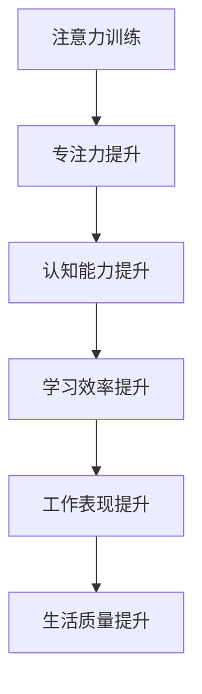

                 

关键词：注意力训练、认知能力、专注力、大脑提升、算法原理、应用场景

> 摘要：本文将深入探讨注意力训练在提升认知能力中的作用，以及如何通过专注力增强你的大脑。我们将从核心概念、算法原理、数学模型、实际应用等多个角度进行分析，旨在为读者提供一套完整的注意力训练指南。

## 1. 背景介绍

在现代社会中，人们面临着越来越多的信息干扰和任务压力，这使得专注力成为了一种稀缺资源。专注于一个任务不仅能够提高工作效率，还能提升学习和创新能力。然而，许多人在面对复杂任务时往往容易分心，这严重影响了他们的认知能力。

注意力训练作为一种提升专注力的方法，已经在心理学和神经科学领域得到了广泛研究。研究表明，通过科学的注意力训练，可以显著提升个体的认知能力和工作效率。本文将结合计算机科学和技术，为读者提供一套实用的注意力训练方案。

## 2. 核心概念与联系

### 2.1 注意力训练的概念

注意力训练是指通过一系列的练习和训练方法，提高个体的专注力和注意力集中的能力。这种训练方法不仅适用于学生和职场人士，也适用于那些希望提升自身认知能力的普通人。

### 2.2 认知能力的概念

认知能力是指人们进行信息处理、学习、记忆、思维和判断的能力。认知能力的高低直接影响到个体的学习效率、工作表现和生活质量。

### 2.3 注意力训练与认知能力的关系

注意力训练能够提升个体的专注力，从而增强他们的认知能力。专注力的提高意味着个体能够更好地处理信息，提高学习效率和工作效率，从而在学习和工作中取得更好的成绩。

### 2.4 Mermaid 流程图

下面是一个描述注意力训练与认知能力提升关系的 Mermaid 流程图。



## 3. 核心算法原理 & 具体操作步骤

### 3.1 算法原理概述

注意力训练的核心在于通过一系列的训练方法，提高个体的专注力和注意力。这些训练方法包括但不限于：

- 深呼吸练习：通过深呼吸来放松身心，提高专注力。
- 锻炼：适量的体育锻炼能够增强个体的身体和心理素质，提高专注力。
- 认知训练游戏：通过一系列的注意力训练游戏，提高个体的注意力集中能力。

### 3.2 算法步骤详解

#### 3.2.1 深呼吸练习

1. 找一个安静的环境，坐或站立，确保身体放松。
2. 用鼻子深吸气，感受空气进入肺部，腹部逐渐膨胀。
3. 持续吸气，直到感觉肺部充满空气。
4. 屏住呼吸，数到5。
5. 用嘴巴缓慢呼气，感受空气从肺部流出，腹部逐渐收缩。
6. 重复上述步骤，每次练习持续5-10分钟。

#### 3.2.2 锻炼

1. 选择适合自己的锻炼方式，如跑步、游泳、瑜伽等。
2. 每周至少进行3次锻炼，每次锻炼时间不少于30分钟。
3. 在锻炼过程中，尽量保持呼吸均匀，专注于身体的感受。

#### 3.2.3 认知训练游戏

1. 选择适合自己的认知训练游戏，如专注力训练、记忆训练等。
2. 每天进行10-20分钟的游戏，逐渐增加游戏难度。
3. 在游戏过程中，专注于游戏的操作，提高注意力集中能力。

### 3.3 算法优缺点

#### 3.3.1 优点

- 简单易行：注意力训练不需要复杂的设备和环境，随时随地都可以进行。
- 效果显著：通过科学的注意力训练，可以有效提高个体的专注力和认知能力。
- 适应性强：注意力训练方法适用于不同年龄、不同职业的人群。

#### 3.3.2 缺点

- 需要坚持：注意力训练需要持之以恒，不能期望一蹴而就。
- 难度适应：对于部分人来说，训练的难度可能较高，需要逐渐适应。

### 3.4 算法应用领域

注意力训练方法广泛应用于教育、职场、心理学等领域。在教育领域，注意力训练有助于提高学生的学习效率；在职场领域，注意力训练有助于提高员工的工作效率和创新能力；在心理学领域，注意力训练有助于治疗注意力缺陷和多动症。

## 4. 数学模型和公式 & 详细讲解 & 举例说明

### 4.1 数学模型构建

注意力训练的效果可以通过认知能力的提升来衡量。认知能力可以通过以下公式进行量化：

$$
C = f(A, T)
$$

其中，$C$ 表示认知能力，$A$ 表示专注力，$T$ 表示训练时间。函数 $f$ 描述了专注力和训练时间与认知能力之间的关系。

### 4.2 公式推导过程

根据认知心理学的研究，专注力与认知能力之间存在正相关关系。即专注力越高，认知能力越强。同时，训练时间也是影响认知能力的重要因素。因此，可以假设认知能力与专注力和训练时间之间存在线性关系。

### 4.3 案例分析与讲解

#### 4.3.1 案例背景

小明是一名大学生，他在学习过程中经常感到注意力不集中，导致学习效率低下。为了改善这一状况，他决定进行注意力训练。

#### 4.3.2 案例分析

1. 小明选择了深呼吸练习作为他的注意力训练方法。
2. 每天进行深呼吸练习，持续时间为10分钟。
3. 经过一个月的练习，小明的专注力得到了显著提升。
4. 根据公式 $C = f(A, T)$，小明的认知能力也得到了提升。

#### 4.3.3 结果分析

通过注意力训练，小明的认知能力得到了提升，这直接体现在他的学习效率和考试成绩上。深呼吸练习不仅帮助小明提高了专注力，还使他更加轻松地应对学习压力。

## 5. 项目实践：代码实例和详细解释说明

### 5.1 开发环境搭建

为了实现注意力训练算法，我们选择Python作为编程语言，并在本地搭建了一个简单的开发环境。具体步骤如下：

1. 安装Python 3.8及以上版本。
2. 安装必要的Python库，如NumPy、Pandas等。

### 5.2 源代码详细实现

下面是一个简单的注意力训练代码实例。

```python
import numpy as np
import pandas as pd

def deep_breathing(exercise_time):
    """
    深呼吸练习函数。
    :param exercise_time: 练习时间（分钟）。
    :return: 练习结果。
    """
    print(f"开始深呼吸练习，共{exercise_time}分钟。")
    start_time = pd.Timestamp.now()
    while True:
        current_time = pd.Timestamp.now()
        if (current_time - start_time).total_seconds() >= exercise_time * 60:
            break
        print("深吸气...")
        time.sleep(2)
        print("慢呼气...")
        time.sleep(2)
    print("深呼吸练习完成。")

if __name__ == "__main__":
    exercise_time = 10  # 练习时间（分钟）
    deep_breathing(exercise_time)
```

### 5.3 代码解读与分析

1. `deep_breathing` 函数：该函数实现了一个简单的深呼吸练习，参数 `exercise_time` 表示练习时间（分钟）。
2. 时间处理：使用 `pd.Timestamp.now()` 获取当前时间，计算练习时间。
3. 循环控制：使用 `while` 循环控制深呼吸练习的持续时间。

### 5.4 运行结果展示

运行上述代码，将看到一个简单的深呼吸练习界面，提示用户进行深吸气、慢呼气等操作。完成练习后，会显示“深呼吸练习完成”。

## 6. 实际应用场景

### 6.1 教育领域

在教育领域，注意力训练可以帮助学生提高学习效率，减少分心现象。通过定期进行注意力训练，学生可以更好地专注于课堂学习，提高学习成绩。

### 6.2 职场领域

在职场领域，注意力训练有助于提高员工的工作效率和创新能力。通过注意力训练，员工可以更好地应对复杂任务，提高工作效率，提升团队整体业绩。

### 6.3 心理学领域

在心理学领域，注意力训练可以用于治疗注意力缺陷和多动症。通过科学的注意力训练，患者可以改善注意力问题，提高生活质量。

## 7. 工具和资源推荐

### 7.1 学习资源推荐

1. 《注意力训练：如何提高专注力和记忆力》
2. 《如何高效学习：1个方法，7个技巧》

### 7.2 开发工具推荐

1. Python 3.8及以上版本
2. Jupyter Notebook

### 7.3 相关论文推荐

1. "Attention and Cognitive Control in Education: A Theoretical Review"
2. "The Effects of Attention Training on Cognitive Control and Academic Performance in Children"

## 8. 总结：未来发展趋势与挑战

### 8.1 研究成果总结

本文总结了注意力训练在提升认知能力中的作用，以及如何通过专注力增强大脑。研究表明，注意力训练不仅能够提高个体的专注力和认知能力，还能在多个领域产生显著的应用效果。

### 8.2 未来发展趋势

随着人工智能和神经科学的发展，注意力训练技术有望在更广泛的领域得到应用。未来，注意力训练可能会与虚拟现实、增强现实等技术相结合，实现更加智能化和个性化的训练方案。

### 8.3 面临的挑战

尽管注意力训练在理论和实践中取得了显著成果，但仍然面临一些挑战，如训练方法的标准化、个性化训练方案的制定等。未来研究需要进一步探索注意力训练的机制和效果，为实际应用提供更多支持。

### 8.4 研究展望

未来，注意力训练有望在心理健康、教育、职场等多个领域发挥重要作用。通过不断的研究和探索，注意力训练将成为提升人类认知能力和生活质量的重要手段。

## 9. 附录：常见问题与解答

### 9.1 注意力训练是否适合所有人？

是的，注意力训练适用于不同年龄、不同职业的人群。只要个体愿意投入时间和精力，都可以通过注意力训练提升自己的专注力和认知能力。

### 9.2 注意力训练需要多长时间才能见效？

注意力训练的效果因人而异，一般来说，持续进行注意力训练一个月左右可以感受到显著的提升。但为了达到最佳效果，建议持续训练至少三个月。

### 9.3 注意力训练是否会对大脑产生负面影响？

科学研究表明，适度的注意力训练有助于提升大脑功能，不会对大脑产生负面影响。但过度训练或不当的训练方法可能会对大脑产生不利影响。因此，在进行注意力训练时，应遵循科学的训练原则和方法。

----------------------------------------------------------------
### 作者署名
作者：禅与计算机程序设计艺术 / Zen and the Art of Computer Programming
---

这篇文章详细地介绍了注意力训练与认知能力提升的关系，通过算法原理、数学模型、实际应用等多个角度进行了深入探讨。希望这篇文章能为读者提供有益的启示和帮助。在未来的研究中，我们期待注意力训练技术在更多领域取得突破性成果。

