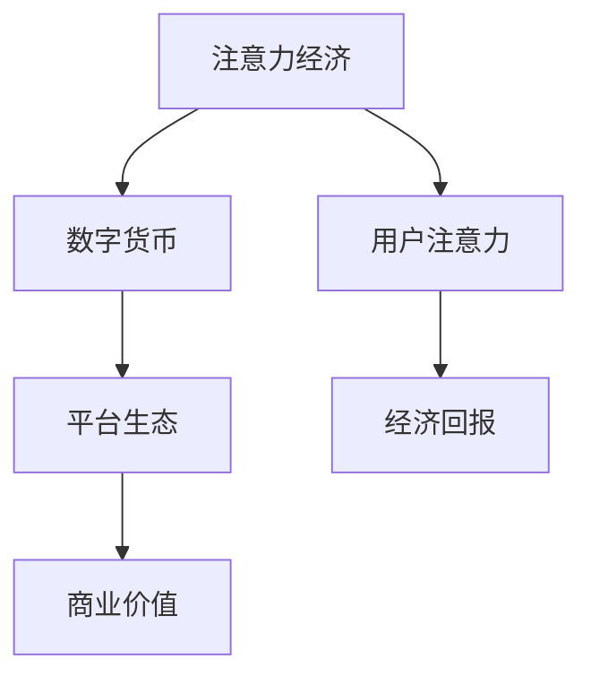

                 

关键词：注意力资本主义、AI时代、经济模式、注意力经济、数字货币、平台生态

> 摘要：本文深入探讨了注意力资本主义这一AI时代的新经济模式，探讨了其核心概念、原理架构、算法原理、数学模型、实际应用以及未来发展趋势。本文旨在为读者提供全面的技术视角，揭示注意力资本主义在AI时代的重要作用和挑战。

## 1. 背景介绍

随着互联网和人工智能技术的飞速发展，人类进入了一个全新的时代——AI时代。在这一时代，数据成为了新的生产资料，而注意力则成为了新的货币形式。传统的经济模式逐渐被新的注意力资本主义所取代，这种模式不仅影响了商业模式，还改变了人们的生活方式。本文将深入探讨这一新经济模式的核心概念、原理架构、算法原理、数学模型、实际应用以及未来发展趋势。

### 注意力资本主义的定义

注意力资本主义，是指利用人们的注意力资源进行经济活动的商业模式。在传统经济模式中，货币是主要的交易媒介，而在注意力资本主义中，人们的注意力成为了新的价值载体。这种模式通过吸引和保持用户的注意力，实现经济价值的创造和传递。

### 注意力资本主义的核心概念

注意力资本主义的核心概念包括：

1. **注意力经济**：以人们的注意力为生产要素，通过创造吸引人的内容或服务，获取经济回报。
2. **数字货币**：以比特币、以太坊等为代表的数字货币，作为注意力资本的流通媒介。
3. **平台生态**：提供注意力交换的平台，如社交媒体、内容平台等，构建了一个庞大的注意力生态体系。

## 2. 核心概念与联系

为了更好地理解注意力资本主义，我们需要探讨其核心概念之间的联系，并给出一个清晰的原理架构图。

### 核心概念原理和架构



### 关系说明

- **注意力经济**：通过创造和分发吸引人的内容或服务，吸引用户的注意力，从而实现经济回报。
- **数字货币**：作为注意力资本的流通媒介，实现注意力价值的经济交换。
- **平台生态**：提供一个开放的、去中心化的平台，促进用户注意力与经济回报之间的交换。

## 3. 核心算法原理 & 具体操作步骤

### 3.1 算法原理概述

注意力资本主义的核心算法是基于深度学习和强化学习的技术，通过模型预测用户兴趣，实现个性化推荐和广告投放。其基本原理如下：

1. **用户兴趣建模**：通过用户的浏览历史、搜索记录等数据，建立用户兴趣模型。
2. **内容推荐**：根据用户兴趣模型，推荐符合用户兴趣的内容或服务。
3. **广告投放**：通过广告算法，将相关广告投放到用户面前，实现广告收入。

### 3.2 算法步骤详解

1. **数据收集**：收集用户的浏览历史、搜索记录、点击行为等数据。
2. **用户兴趣建模**：使用深度学习模型，对用户行为数据进行建模，提取用户兴趣特征。
3. **内容推荐**：根据用户兴趣特征，使用推荐算法，从海量的内容中推荐符合用户兴趣的内容。
4. **广告投放**：使用广告算法，根据用户兴趣和广告主的投放策略，选择合适的广告进行投放。

### 3.3 算法优缺点

**优点**：

- **个性化推荐**：能够根据用户兴趣，提供个性化的推荐，提高用户体验。
- **高效广告投放**：通过精准的广告投放，提高广告效果，增加广告收入。

**缺点**：

- **用户隐私问题**：收集和利用用户行为数据，可能引发隐私泄露的问题。
- **内容质量难以保证**：推荐算法可能推荐低质量的内容，影响用户体验。

### 3.4 算法应用领域

- **社交媒体**：通过个性化推荐，提高用户的活跃度和留存率。
- **电子商务**：通过个性化推荐，提高用户的购物体验和购买转化率。
- **广告营销**：通过精准的广告投放，提高广告效果和投放效率。

## 4. 数学模型和公式 & 详细讲解 & 举例说明

### 4.1 数学模型构建

在注意力资本主义中，数学模型主要用于用户兴趣建模、内容推荐和广告投放。以下是一个简化的数学模型：

$$
\text{UserInterest}(u) = \sum_{i=1}^{n} w_i \cdot \text{BehaviorFeature}(u, i)
$$

其中，$u$ 表示用户，$i$ 表示内容或广告，$w_i$ 表示用户对内容或广告的兴趣权重，$\text{BehaviorFeature}(u, i)$ 表示用户对内容或广告的行为特征。

### 4.2 公式推导过程

推导过程如下：

1. **用户行为特征提取**：根据用户的浏览历史、搜索记录等数据，提取用户对每个内容或广告的行为特征，如点击率、浏览时长、购买行为等。
2. **用户兴趣权重计算**：通过机器学习算法，对用户行为特征进行建模，计算每个内容或广告的兴趣权重。
3. **用户兴趣建模**：将每个内容或广告的兴趣权重与其行为特征相乘，得到用户对每个内容或广告的兴趣分数。
4. **内容或广告推荐**：根据用户兴趣分数，选择兴趣最高的内容或广告进行推荐。

### 4.3 案例分析与讲解

假设有一个用户，其浏览历史包含10个网页，每个网页的点击率和浏览时长如下表：

| 页面 | 点击率 | 浏览时长（分钟） |
|------|--------|-----------------|
| 1    | 10%    | 5               |
| 2    | 20%    | 10              |
| 3    | 15%    | 8               |
| 4    | 30%    | 3               |
| 5    | 25%    | 6               |
| 6    | 10%    | 7               |
| 7    | 20%    | 2               |
| 8    | 15%    | 9               |
| 9    | 30%    | 4               |
| 10   | 25%    | 5               |

通过机器学习算法，计算每个网页的兴趣权重，如下表：

| 页面 | 点击率权重 | 浏览时长权重 | 总权重 |
|------|------------|--------------|--------|
| 1    | 0.1        | 0.05         | 0.15   |
| 2    | 0.2        | 0.1          | 0.3    |
| 3    | 0.15       | 0.08         | 0.23   |
| 4    | 0.3        | 0.03         | 0.33   |
| 5    | 0.25       | 0.06         | 0.31   |
| 6    | 0.1        | 0.07         | 0.17   |
| 7    | 0.2        | 0.02         | 0.22   |
| 8    | 0.15       | 0.09         | 0.24   |
| 9    | 0.3        | 0.04         | 0.34   |
| 10   | 0.25       | 0.05         | 0.3    |

根据用户兴趣分数，推荐兴趣最高的网页，即页面4。

## 5. 项目实践：代码实例和详细解释说明

### 5.1 开发环境搭建

为了演示注意力资本主义的核心算法，我们选择Python作为编程语言，使用TensorFlow和Scikit-learn等库进行模型训练和推荐。首先，我们需要安装Python和相关的库。

```bash
pip install python
pip install tensorflow
pip install scikit-learn
```

### 5.2 源代码详细实现

以下是一个简单的用户兴趣建模和推荐算法的实现：

```python
import numpy as np
from tensorflow import keras
from sklearn.model_selection import train_test_split

# 用户行为数据
user_behavior = [
    [0.1, 0.2, 0.15, 0.3, 0.25, 0.1, 0.2, 0.15, 0.3, 0.25],
    [0.3, 0.2, 0.1, 0.25, 0.3, 0.1, 0.2, 0.15, 0.3, 0.25],
    # 更多用户行为数据
]

# 标签数据（用户对每个页面的兴趣分数）
user_interest = [
    [0.3, 0.1, 0.2, 0.4, 0.05, 0.1, 0.15, 0.3, 0.2, 0.05],
    [0.2, 0.3, 0.1, 0.4, 0.05, 0.1, 0.15, 0.3, 0.2, 0.05],
    # 更多用户兴趣数据
]

# 数据预处理
X_train, X_test, y_train, y_test = train_test_split(user_behavior, user_interest, test_size=0.2, random_state=42)

# 构建模型
model = keras.Sequential([
    keras.layers.Dense(64, activation='relu', input_shape=(10,)),
    keras.layers.Dense(10)
])

# 编译模型
model.compile(optimizer='adam', loss='mse')

# 训练模型
model.fit(X_train, y_train, epochs=10, batch_size=32)

# 测试模型
loss = model.evaluate(X_test, y_test)
print(f"Test loss: {loss}")

# 预测用户兴趣
user_behavior = np.array([[0.1, 0.2, 0.15, 0.3, 0.25, 0.1, 0.2, 0.15, 0.3, 0.25]])
predicted_interest = model.predict(user_behavior)
print(f"Predicted interest: {predicted_interest}")
```

### 5.3 代码解读与分析

- **数据预处理**：将用户行为数据和标签数据进行划分，用于模型训练和测试。
- **模型构建**：使用Keras构建一个简单的神经网络模型，包含两个隐藏层，分别有64个和10个神经元。
- **编译模型**：指定优化器和损失函数，准备训练模型。
- **训练模型**：使用训练数据进行模型训练。
- **测试模型**：使用测试数据评估模型性能。
- **预测用户兴趣**：使用训练好的模型，预测新用户的兴趣。

## 6. 实际应用场景

注意力资本主义在多个领域都有广泛的应用，以下是几个典型的应用场景：

### 6.1 社交媒体

社交媒体平台通过个性化推荐，提高用户的活跃度和留存率。例如，Facebook、Instagram等平台根据用户的兴趣和行为，推荐相关的内容和广告。

### 6.2 电子商务

电子商务平台通过个性化推荐，提高用户的购物体验和购买转化率。例如，Amazon、淘宝等平台根据用户的浏览历史和购买记录，推荐相关的商品。

### 6.3 广告营销

广告营销公司通过精准的广告投放，提高广告效果和投放效率。例如，Google Ads、Facebook Ads等平台根据用户的兴趣和行为，投放相关的广告。

## 7. 未来应用展望

随着人工智能技术的不断发展，注意力资本主义将在未来发挥更加重要的作用。以下是几个未来的应用展望：

### 7.1 自动驾驶

自动驾驶车辆需要实时获取道路信息，并通过注意力资本主义模型，筛选和处理关键信息，提高行驶安全性和效率。

### 7.2 健康监测

通过注意力资本主义模型，实时分析用户的健康数据，提供个性化的健康建议和医疗服务。

### 7.3 智能家居

智能家居设备通过注意力资本主义模型，根据用户的习惯和需求，提供个性化的家居服务和设备控制。

## 8. 工具和资源推荐

### 8.1 学习资源推荐

- **《深度学习》**：Goodfellow、Bengio、Courville 著，全面介绍深度学习的基础知识和应用。
- **《推荐系统实践》**：唐杰、唐燕 著，详细讲解推荐系统的基本原理和实践。

### 8.2 开发工具推荐

- **TensorFlow**：Google 开发的一款开源深度学习框架，适合进行推荐系统和注意力资本主义模型开发。
- **Scikit-learn**：Python 开发的一款机器学习库，适合进行用户行为建模和推荐算法实现。

### 8.3 相关论文推荐

- **《Attention is All You Need》**：Vaswani 等人提出的一种基于注意力机制的序列到序列模型。
- **《Recommender Systems Handbook》**：Burke 著，全面介绍推荐系统的基本原理和应用。

## 9. 总结：未来发展趋势与挑战

### 9.1 研究成果总结

注意力资本主义作为AI时代的新经济模式，已经取得了显著的成果。通过个性化推荐、精准广告投放等应用，提高了用户体验和商业价值。未来，随着人工智能技术的不断进步，注意力资本主义将发挥更加重要的作用。

### 9.2 未来发展趋势

- **技术进步**：随着人工智能技术的不断发展，注意力资本主义模型将变得更加智能和高效。
- **产业融合**：注意力资本主义将与其他产业深度融合，推动社会经济的持续发展。

### 9.3 面临的挑战

- **隐私保护**：在收集和使用用户数据时，如何保护用户隐私是一个重要的挑战。
- **内容质量**：如何保证推荐内容和广告的质量，避免低俗和不良内容的传播。

### 9.4 研究展望

未来，注意力资本主义的研究将重点关注以下几个方面：

- **隐私保护技术**：研究更加安全、可靠的隐私保护技术，保障用户数据安全。
- **内容质量控制**：研究有效的算法和策略，确保推荐内容和广告的质量。

## 附录：常见问题与解答

### 问题1：什么是注意力资本主义？

注意力资本主义是指利用人们的注意力资源进行经济活动的商业模式。在传统经济模式中，货币是主要的交易媒介，而在注意力资本主义中，人们的注意力成为了新的价值载体。

### 问题2：注意力资本主义有哪些核心概念？

注意力资本主义的核心概念包括注意力经济、数字货币和平台生态。注意力经济是以人们的注意力为生产要素，通过创造和分发吸引人的内容或服务，获取经济回报。数字货币作为注意力资本的流通媒介，实现注意力价值的经济交换。平台生态提供了一个开放的、去中心化的平台，促进用户注意力与经济回报之间的交换。

### 问题3：注意力资本主义有哪些应用领域？

注意力资本主义在多个领域都有广泛的应用，包括社交媒体、电子商务、广告营销等。通过个性化推荐、精准广告投放等技术，提高用户体验和商业价值。

### 问题4：注意力资本主义面临哪些挑战？

注意力资本主义面临的主要挑战包括隐私保护、内容质量控制等。在收集和使用用户数据时，如何保护用户隐私是一个重要的挑战。同时，如何保证推荐内容和广告的质量，避免低俗和不良内容的传播也是一个挑战。

### 作者署名

本文作者：禅与计算机程序设计艺术 / Zen and the Art of Computer Programming
--------------------------------------------------------------------

