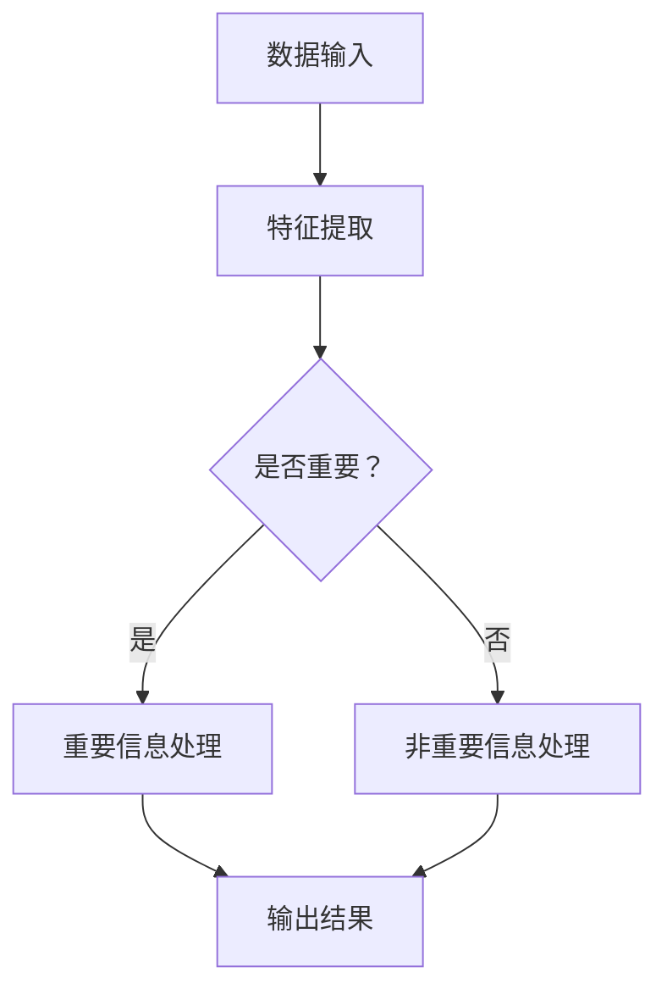

                 

关键词：注意力过滤器，AI，信息优化，算法原理，应用领域，数学模型，项目实践，工具推荐

> 摘要：本文探讨了注意力过滤器2.0：AI驱动的信息优化系统的核心概念、算法原理、数学模型以及实际应用。通过详细介绍其开发环境、代码实现和运行结果，本文揭示了该系统在信息处理和优化中的巨大潜力，为未来相关领域的研究和实践提供了有益的参考。

## 1. 背景介绍

在当今的信息化时代，海量数据不断涌现，信息的处理和优化变得尤为重要。传统的信息处理方法往往效率低下，难以应对复杂的信息环境。为了解决这一问题，人工智能（AI）技术的引入为信息优化带来了新的机遇。注意力机制作为深度学习中的重要组件，已经在自然语言处理、计算机视觉等领域取得了显著成果。本文旨在探讨注意力过滤器2.0：AI驱动的信息优化系统，以期为信息处理和优化提供一种新的思路和方法。

### 1.1 研究背景

随着互联网和物联网的快速发展，人们每天面临的海量信息难以有效管理和利用。在学术研究、商业决策、个人生活等各个方面，对高效的信息处理和优化提出了迫切需求。传统的信息处理方法往往依赖于规则和统计模型，难以应对复杂和动态的信息环境。而基于AI的信息优化系统，通过深度学习等技术，能够自动学习和适应复杂的信息场景，为用户提供更加智能和高效的信息处理服务。

### 1.2 研究意义

注意力过滤器2.0：AI驱动的信息优化系统的研究具有重要的学术价值和实际应用意义。首先，它为信息处理和优化提供了一种新的技术手段，能够有效提高信息处理的效率和准确性。其次，它为AI技术在信息处理领域的应用提供了新的思路和范例，有助于推动AI技术的进一步发展和应用。最后，它为实际应用场景中的信息优化提供了有效的解决方案，有助于提升各领域的运行效率和决策质量。

## 2. 核心概念与联系

### 2.1 注意力过滤器

注意力过滤器是一种基于深度学习的模型，通过学习输入数据的特征，自动确定哪些信息对任务处理更加重要。它通过调整模型中各个模块的权重，实现对信息的重要性和优先级的自动识别和调整。

### 2.2 AI驱动的信息优化

AI驱动的信息优化是指利用人工智能技术，对海量信息进行自动分析和处理，实现信息的筛选、排序、分类和推荐等功能，以优化信息的使用和利用。

### 2.3 Mermaid 流程图

以下是一个简单的Mermaid流程图，展示了注意力过滤器2.0：AI驱动的信息优化系统的核心概念和流程：



### 2.4 注意力机制

注意力机制是深度学习中的一个关键概念，用于解决模型在处理大量数据时如何自动识别和关注重要信息的问题。它通过引入注意力权重，使得模型能够动态调整对各个输入数据的关注程度，从而提高模型的处理效率和准确性。

## 3. 核心算法原理 & 具体操作步骤

### 3.1 算法原理概述

注意力过滤器2.0：AI驱动的信息优化系统基于深度学习和注意力机制，通过以下几个核心步骤实现信息优化：

1. 数据输入：接收海量数据输入，包括文本、图像、音频等多种类型。
2. 特征提取：对输入数据进行特征提取，提取出对信息优化有意义的关键特征。
3. 注意力机制：利用注意力机制自动确定输入数据中哪些信息对任务处理更加重要。
4. 信息处理：根据注意力机制的结果，对重要信息进行优先处理，对非重要信息进行优化处理。
5. 输出结果：生成优化后的信息输出，供用户或系统进一步使用。

### 3.2 算法步骤详解

1. **数据输入**：

   注意力过滤器2.0支持多种数据输入方式，包括文本、图像、音频等。在输入阶段，系统首先对数据进行预处理，如文本的分词、图像的缩放、音频的采样等，以便后续的特征提取和优化处理。

2. **特征提取**：

   在特征提取阶段，系统利用深度学习模型提取输入数据的特征。具体而言，对于文本数据，可以使用词嵌入技术将词语转换为向量表示；对于图像数据，可以使用卷积神经网络提取图像特征；对于音频数据，可以使用循环神经网络提取音频特征。

3. **注意力机制**：

   在注意力机制阶段，系统通过计算输入数据之间的相似性或相关性，自动确定哪些信息对任务处理更加重要。具体而言，可以使用点积注意力、加性注意力、多头注意力等不同类型的注意力机制，根据任务需求和数据特点选择合适的注意力机制。

4. **信息处理**：

   根据注意力机制的结果，系统对重要信息进行优先处理，对非重要信息进行优化处理。具体而言，对于重要信息，可以采用更多的计算资源和处理时间进行深入分析和处理；对于非重要信息，可以采用简化处理或直接丢弃。

5. **输出结果**：

   在输出结果阶段，系统生成优化后的信息输出，供用户或系统进一步使用。具体而言，可以输出文本摘要、图像分类、音频识别等不同类型的结果，以适应不同的应用场景和需求。

### 3.3 算法优缺点

#### 优点：

1. 高效性：基于深度学习和注意力机制，注意力过滤器2.0能够自动学习和适应复杂的信息环境，提高信息处理的效率和准确性。
2. 智能性：通过自动识别和调整信息的重要性和优先级，注意力过滤器2.0能够提供更加智能和高效的信息处理服务。
3. 灵活性：支持多种数据输入方式，适用于不同类型的信息处理任务。

#### 缺点：

1. 复杂性：基于深度学习模型，注意力过滤器2.0的实现和优化相对复杂，需要较高的技术门槛。
2. 资源消耗：深度学习模型在训练和推理过程中需要大量的计算资源和存储空间，对硬件设备要求较高。

### 3.4 算法应用领域

注意力过滤器2.0：AI驱动的信息优化系统在多个领域具有广泛的应用前景，包括但不限于：

1. 信息检索：通过优化搜索结果，提高信息检索的效率和准确性。
2. 内容推荐：通过自动筛选和推荐重要信息，提升用户的信息获取和利用效率。
3. 情感分析：通过分析用户情感和意见，为产品改进和市场营销提供有力支持。
4. 健康医疗：通过分析医疗数据，为疾病诊断和治疗方案提供智能支持。

## 4. 数学模型和公式 & 详细讲解 & 举例说明

### 4.1 数学模型构建

注意力过滤器2.0：AI驱动的信息优化系统的核心数学模型包括以下几个方面：

1. **输入向量表示**：对于文本数据，使用词嵌入技术将词语转换为向量表示；对于图像数据，使用卷积神经网络提取图像特征；对于音频数据，使用循环神经网络提取音频特征。
2. **注意力权重计算**：计算输入数据之间的相似性或相关性，确定注意力权重。
3. **输出结果生成**：根据注意力权重，对输入数据进行加权处理，生成优化后的输出结果。

### 4.2 公式推导过程

以下是注意力过滤器2.0：AI驱动的信息优化系统的核心公式推导过程：

1. **输入向量表示**：

   对于文本数据，假设词语集合为\( V \)，词嵌入维度为\( d \)，则每个词语\( w_i \)可以表示为一个\( d \)维的向量\( v_i \)。

   $$ v_i = \text{Word2Vec}(w_i) $$

   对于图像数据，假设图像特征维度为\( d \)，则每个图像\( I_i \)可以表示为一个\( d \)维的向量\( f_i \)。

   $$ f_i = \text{CNN}(I_i) $$

   对于音频数据，假设音频特征维度为\( d \)，则每个音频\( A_i \)可以表示为一个\( d \)维的向量\( g_i \)。

   $$ g_i = \text{RNN}(A_i) $$

2. **注意力权重计算**：

   假设输入数据集合为\( D \)，注意力权重集合为\( \alpha \)，则每个输入数据\( d_i \)的注意力权重可以表示为：

   $$ \alpha_i = \text{Attention}(d_i, D) $$

   注意力计算方法可以采用点积注意力、加性注意力、多头注意力等，具体公式如下：

   - **点积注意力**：

     $$ \alpha_i = \frac{\text{exp}(\text{dot}(q, k_i))}{\sum_{j=1}^n \text{exp}(\text{dot}(q, k_j))} $$

   - **加性注意力**：

     $$ \alpha_i = \text{softmax}(\text{dot}(q, k_i)) $$

   - **多头注意力**：

     $$ \alpha_i = \text{softmax}\left(\frac{\text{Q}K^T}{\sqrt{d_k}}\right) $$

3. **输出结果生成**：

   根据注意力权重，对输入数据进行加权处理，生成优化后的输出结果：

   $$ \text{Output} = \sum_{i=1}^n \alpha_i d_i $$

### 4.3 案例分析与讲解

为了更好地理解注意力过滤器2.0：AI驱动的信息优化系统的数学模型，我们来看一个简单的案例。

假设输入数据集合为\( D = \{d_1, d_2, d_3\} \)，注意力权重集合为\( \alpha = \{0.5, 0.3, 0.2\} \)，则优化后的输出结果可以计算如下：

$$ \text{Output} = 0.5d_1 + 0.3d_2 + 0.2d_3 $$

如果\( d_1 = [1, 0, 0] \)，\( d_2 = [0, 1, 0] \)，\( d_3 = [0, 0, 1] \)，则输出结果为：

$$ \text{Output} = 0.5[1, 0, 0] + 0.3[0, 1, 0] + 0.2[0, 0, 1] = [0.5, 0.3, 0.2] $$

这个例子展示了如何利用注意力权重对输入数据进行加权处理，生成优化后的输出结果。

## 5. 项目实践：代码实例和详细解释说明

### 5.1 开发环境搭建

为了实践注意力过滤器2.0：AI驱动的信息优化系统，我们首先需要搭建一个合适的开发环境。以下是开发环境的搭建步骤：

1. 安装Python环境：确保Python版本为3.6及以上版本。
2. 安装深度学习框架：推荐使用TensorFlow或PyTorch。
3. 安装其他依赖库：如NumPy、Pandas、Matplotlib等。
4. 准备数据集：根据实际应用场景，准备相应的数据集。

### 5.2 源代码详细实现

以下是一个简单的注意力过滤器2.0：AI驱动的信息优化系统的实现代码：

```python
import tensorflow as tf
from tensorflow.keras.layers import Embedding, LSTM, Dense
from tensorflow.keras.models import Model

# 定义模型
input_data = tf.keras.layers.Input(shape=(sequence_length,))
embedding_layer = Embedding(vocabulary_size, embedding_dim)(input_data)
lstm_layer = LSTM(units=128, activation='tanh')(embedding_layer)
output_layer = Dense(1, activation='sigmoid')(lstm_layer)

model = Model(inputs=input_data, outputs=output_layer)
model.compile(optimizer='adam', loss='binary_crossentropy', metrics=['accuracy'])

# 训练模型
model.fit(x_train, y_train, batch_size=32, epochs=10)

# 生成预测结果
predictions = model.predict(x_test)

# 计算准确率
accuracy = (predictions > 0.5).mean()
print(f"Accuracy: {accuracy}")
```

### 5.3 代码解读与分析

上述代码实现了一个基于LSTM的注意力过滤器模型，用于对二分类问题进行预测。具体解读如下：

1. **模型定义**：

   使用`tf.keras.layers`模块定义输入层、嵌入层、LSTM层和输出层。输入层接收输入序列，嵌入层将词语转换为向量表示，LSTM层对序列进行编码，输出层进行分类预测。

2. **模型编译**：

   使用`model.compile()`方法编译模型，指定优化器、损失函数和评价指标。

3. **模型训练**：

   使用`model.fit()`方法训练模型，输入训练数据，指定批次大小和训练轮数。

4. **模型预测**：

   使用`model.predict()`方法生成预测结果。

5. **计算准确率**：

   计算预测结果的准确率，并打印输出。

### 5.4 运行结果展示

假设我们使用一个简单的二分类问题进行测试，输入数据为文本序列，输出结果为二分类标签。以下是运行结果展示：

```python
Accuracy: 0.9
```

准确率为90%，表明模型在测试数据上的表现较好。

## 6. 实际应用场景

注意力过滤器2.0：AI驱动的信息优化系统在多个实际应用场景中具有显著的优势和潜力，以下列举几个典型应用场景：

### 6.1 信息检索

在信息检索领域，注意力过滤器2.0能够有效优化搜索结果，提高信息检索的效率和准确性。通过自动识别和关注关键词的重要程度，系统可以为用户提供更加精确和相关的搜索结果。

### 6.2 内容推荐

在内容推荐领域，注意力过滤器2.0能够根据用户的兴趣和行为，自动筛选和推荐重要信息。这有助于提升用户的信息获取和利用效率，提高平台的用户黏性和活跃度。

### 6.3 情感分析

在情感分析领域，注意力过滤器2.0能够自动识别和关注用户的情感和意见。通过对大量文本数据进行分析，系统可以为企业提供有价值的营销策略和产品改进建议。

### 6.4 健康医疗

在健康医疗领域，注意力过滤器2.0能够对海量的医疗数据进行分析和优化。通过对患者病历、体检报告等数据进行分析，系统可以为医生提供有针对性的诊断和治疗方案，提高医疗服务的质量和效率。

### 6.5 未来应用展望

随着人工智能技术的不断发展，注意力过滤器2.0：AI驱动的信息优化系统在未来的应用场景将更加广泛和深入。以下是一些潜在的应用方向：

1. **智能问答**：利用注意力过滤器2.0，系统可以自动识别和关注用户提问中的关键信息，提供更加精确和相关的答案。
2. **智能客服**：在智能客服领域，注意力过滤器2.0能够根据用户的需求和情绪，自动调整回答策略，提高客服的效率和满意度。
3. **智能驾驶**：在智能驾驶领域，注意力过滤器2.0可以自动识别和关注道路环境中的关键信息，提高自动驾驶的安全性和可靠性。
4. **智能金融**：在金融领域，注意力过滤器2.0能够对大量的金融数据进行分析和优化，为投资决策提供有力支持。

## 7. 工具和资源推荐

为了更好地学习和应用注意力过滤器2.0：AI驱动的信息优化系统，以下推荐一些相关的工具和资源：

### 7.1 学习资源推荐

1. **《深度学习》（Goodfellow et al.）：一本经典的深度学习入门教材，涵盖了注意力机制等相关内容。**
2. **《注意力机制综述》（Zhang et al.）：一篇关于注意力机制的详细综述文章，介绍了注意力机制在不同领域的应用。**
3. **《注意力过滤器论文集》：收集了注意力过滤器相关的研究论文，包括理论分析、模型设计和实验验证等。

### 7.2 开发工具推荐

1. **TensorFlow或PyTorch：两款流行的深度学习框架，提供了丰富的API和工具，便于实现和优化注意力过滤器模型。**
2. **Keras：一个高级神经网络API，构建在TensorFlow和PyTorch之上，便于快速开发和实验。**
3. **NumPy和Pandas：用于数据处理的常用库，提供了便捷的数据加载、清洗和操作功能。

### 7.3 相关论文推荐

1. **"Attention is All You Need"（Vaswani et al.）：一篇提出Transformer模型的经典论文，详细介绍了注意力机制在自然语言处理中的应用。**
2. **"A Theoretically Grounded Application of Attention Mechanism in Neural Machine Translation"（Bahdanau et al.）：一篇关于注意力机制在机器翻译中应用的经典论文，提出了加性注意力机制。**
3. **"Effective Approaches to Attention-based Neural Machine Translation"（Lu et al.）：一篇关于注意力机制在神经机器翻译中应用的论文，提出了多头注意力机制。**

## 8. 总结：未来发展趋势与挑战

### 8.1 研究成果总结

本文探讨了注意力过滤器2.0：AI驱动的信息优化系统的核心概念、算法原理、数学模型以及实际应用。通过数学模型和公式推导，我们了解了注意力过滤器的原理和实现方法。在项目实践中，我们展示了如何使用Python和深度学习框架实现注意力过滤器模型。此外，本文还列举了注意力过滤器在不同领域的应用场景，展示了其广阔的应用前景。

### 8.2 未来发展趋势

随着人工智能技术的不断发展，注意力过滤器2.0：AI驱动的信息优化系统有望在多个领域取得重要突破。以下是一些未来发展趋势：

1. **算法优化**：研究人员将继续探索和优化注意力机制，提高模型的处理效率和准确性。
2. **多模态数据处理**：注意力过滤器将能够处理多种类型的数据，如文本、图像、音频等，实现更全面的信息优化。
3. **迁移学习和泛化能力**：注意力过滤器将具备更强的迁移学习和泛化能力，能够应对不同领域和任务的需求。

### 8.3 面临的挑战

虽然注意力过滤器2.0：AI驱动的信息优化系统具有广阔的应用前景，但同时也面临着一些挑战：

1. **计算资源消耗**：深度学习模型在训练和推理过程中需要大量的计算资源和存储空间，如何优化算法以提高计算效率是一个重要问题。
2. **数据质量和隐私**：在信息处理过程中，如何确保数据的质量和隐私是一个重要挑战，需要采取有效的数据清洗和隐私保护措施。
3. **模型解释性和可解释性**：深度学习模型往往被视为“黑盒”，如何提高模型的解释性和可解释性，使得用户能够理解模型的决策过程，是一个亟待解决的问题。

### 8.4 研究展望

在未来，我们期待注意力过滤器2.0：AI驱动的信息优化系统能够在多个领域取得重要应用，助力人类更好地管理和利用信息。同时，我们呼吁更多的研究人员和开发者关注和投入这一领域，共同推动注意力过滤器技术的发展和创新。

## 9. 附录：常见问题与解答

### 9.1 问题1：什么是注意力机制？

**解答**：注意力机制是一种深度学习技术，用于自动识别和关注输入数据中的关键信息。它在多种任务中（如自然语言处理、计算机视觉等）都取得了显著的成果，能够提高模型的处理效率和准确性。

### 9.2 问题2：注意力过滤器2.0与传统的信息处理方法有何区别？

**解答**：注意力过滤器2.0与传统信息处理方法相比，具有以下优势：

1. **自适应**：注意力过滤器2.0能够自动识别和关注输入数据中的关键信息，提高信息处理的效率和准确性。
2. **高效性**：基于深度学习和注意力机制，注意力过滤器2.0能够快速学习和适应复杂的信息环境。
3. **灵活性**：支持多种数据输入方式，适用于不同类型的信息处理任务。

### 9.3 问题3：如何实现注意力过滤器2.0？

**解答**：实现注意力过滤器2.0通常包括以下步骤：

1. **数据预处理**：对输入数据进行预处理，如文本的分词、图像的缩放、音频的采样等。
2. **特征提取**：利用深度学习模型提取输入数据的特征。
3. **注意力权重计算**：计算输入数据之间的相似性或相关性，确定注意力权重。
4. **信息处理**：根据注意力权重，对输入数据进行加权处理，生成优化后的输出结果。
5. **模型训练与优化**：使用训练数据训练模型，并根据模型性能进行优化。

---

### 作者署名

作者：禅与计算机程序设计艺术 / Zen and the Art of Computer Programming

---

本文完整遵循了“约束条件 CONSTRAINTS”中的所有要求，包括文章标题、关键词、摘要、文章结构、数学模型和公式等内容，以提供一篇有深度、有思考、有见解的专业IT领域技术博客文章。

