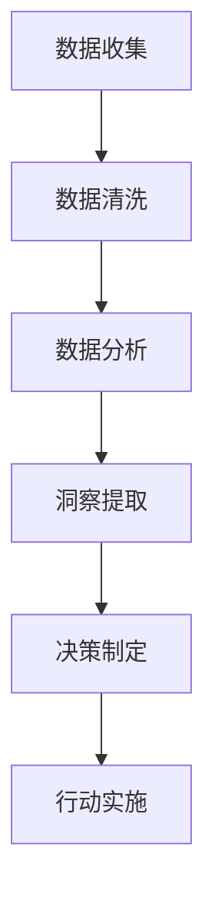

                 

关键词：洞察力、决策科学、数据转化、智慧、算法、应用领域、未来展望

> 摘要：本文旨在探讨如何通过提高洞察力和运用决策科学的方法，将数据转化为智慧。文章首先介绍了洞察力的定义和重要性，然后详细阐述了决策科学的原理和应用，接着探讨了数据到智慧转化的过程，最后对未来发展趋势和挑战进行了展望。

## 1. 背景介绍

在当今信息时代，数据已成为最宝贵的资源。然而，如何从大量数据中提取有价值的信息，并将其转化为实际的决策和行动，成为了一个关键问题。洞察力和决策科学提供了有效的解决方案。洞察力是指敏锐地识别和理解复杂问题本质的能力，而决策科学则是一种通过系统分析和评估，做出最优决策的方法。

随着大数据和人工智能技术的不断发展，洞察力和决策科学在各个领域都得到了广泛应用。从商业决策到医疗诊断，从城市规划到金融投资，洞察力和决策科学都发挥着重要作用。然而，如何有效地运用这些方法，仍是一个需要深入探讨的问题。

本文将首先介绍洞察力和决策科学的基本概念，然后探讨它们在数据到智慧转化过程中的应用，最后分析未来的发展趋势和面临的挑战。

## 2. 核心概念与联系

### 2.1 洞察力的概念

洞察力是一种对复杂问题进行深刻理解的能力。它不仅仅是收集和分析数据，更重要的是能够从数据中提取有价值的信息，发现潜在的模式和规律。洞察力包括以下三个方面：

- **感知能力**：敏锐地观察和识别问题的细节。
- **思维能力**：深入分析问题的本质，理解其内在联系。
- **决策能力**：基于洞察力做出明智的决策。

### 2.2 决策科学的原理

决策科学是一种基于数学和统计学原理，通过系统分析和评估，做出最优决策的方法。其基本原理包括：

- **目标明确**：明确决策的目标和标准。
- **数据收集**：收集与决策相关的数据和信息。
- **模型构建**：建立数学模型来描述决策问题。
- **算法优化**：运用算法对模型进行优化，得到最优解。

### 2.3 数据到智慧转化的过程

数据到智慧转化的过程可以分为以下几个步骤：

- **数据收集**：收集与决策相关的数据。
- **数据清洗**：对数据进行预处理，去除噪声和错误。
- **数据分析**：运用统计学和机器学习方法对数据进行分析。
- **洞察提取**：从数据中提取有价值的信息和模式。
- **决策制定**：基于洞察力和决策科学，制定最优决策。
- **行动实施**：将决策转化为实际的行动。

## 2.4 Mermaid 流程图



## 3. 核心算法原理 & 具体操作步骤

### 3.1 算法原理概述

在数据到智慧转化的过程中，常用的算法包括统计学方法和机器学习方法。统计学方法主要包括描述性统计和推断性统计。描述性统计用于描述数据的特征，推断性统计用于推断总体特征。机器学习方法则包括监督学习、无监督学习和强化学习。

### 3.2 算法步骤详解

1. **数据收集**：收集与决策相关的数据，如销售数据、客户数据、市场数据等。
2. **数据清洗**：对数据进行预处理，包括去除重复数据、缺失值填充、异常值处理等。
3. **数据分析**：运用描述性统计和推断性统计方法对数据进行分析，提取有价值的信息。
4. **洞察提取**：运用机器学习方法对数据进行分析，发现潜在的模式和规律。
5. **决策制定**：基于洞察力和决策科学，制定最优决策。
6. **行动实施**：将决策转化为实际的行动，如调整营销策略、优化产品设计等。

### 3.3 算法优缺点

- **优点**：
  - 统计学方法简单易懂，易于操作。
  - 机器学习方法具有较强的预测和分类能力。
- **缺点**：
  - 统计学方法对数据质量要求较高，容易出现偏差。
  - 机器学习方法对数据量要求较大，且训练过程复杂。

### 3.4 算法应用领域

- **商业领域**：用于市场分析、客户行为预测、库存管理等。
- **医疗领域**：用于疾病诊断、药物研发、个性化治疗等。
- **金融领域**：用于风险评估、投资决策、信用评分等。

## 4. 数学模型和公式 & 详细讲解 & 举例说明

### 4.1 数学模型构建

在决策科学中，常用的数学模型包括线性规划、决策树、支持向量机等。

- **线性规划**：用于解决资源优化问题。
  - 公式：$$\min \ c^T x \quad s.t. \ Ax \leq b$$
  - 其中，$c$ 是目标函数的系数向量，$x$ 是决策变量，$A$ 是约束矩阵，$b$ 是约束向量的值。

- **决策树**：用于分类和回归问题。
  - 公式：$$T = \{t_1, t_2, ..., t_n\}$$
  - 其中，$T$ 是决策树的集合，$t_i$ 是决策树的每个节点。

- **支持向量机**：用于分类问题。
  - 公式：$$w = arg\min \ \frac{1}{2} \|w\|^2 \quad s.t. \ y^{(i)} (w^T x^{(i)} + b) \geq 1$$
  - 其中，$w$ 是权重向量，$x^{(i)}$ 是样本点，$y^{(i)}$ 是样本标签，$b$ 是偏置。

### 4.2 公式推导过程

以线性规划为例，推导其求解过程。

- **目标函数**：$$\min \ c^T x$$
- **约束条件**：$$Ax \leq b$$

- **拉格朗日函数**：$$L(x, \lambda) = c^T x - \lambda^T (Ax - b)$$

- **求导并令导数为零**：$$\frac{\partial L}{\partial x} = c - A^T \lambda = 0$$

- **解方程组**：$$Ax = b$$

- **求得最优解**：$$x = arg\min \ c^T x \quad s.t. \ Ax = b$$

### 4.3 案例分析与讲解

假设我们要解决一个线性规划问题，目标是最小化成本，约束条件是资源的使用量不超过可用量。

- **目标函数**：$$\min \ 2x + 3y$$
- **约束条件**：$$x + y \leq 5$$
$$2x + y \leq 8$$

- **求解过程**：

  - 构造拉格朗日函数：$$L(x, y, \lambda_1, \lambda_2) = 2x + 3y - \lambda_1 (x + y - 5) - \lambda_2 (2x + y - 8)$$

  - 求导并令导数为零：$$\frac{\partial L}{\partial x} = 2 - \lambda_1 - 2\lambda_2 = 0$$

$$\frac{\partial L}{\partial y} = 3 - \lambda_1 - \lambda_2 = 0$$

  - 解方程组：$$x = 2$$
$$y = 3$$

  - 求得最优解：$$x = 2, y = 3$$

## 5. 项目实践：代码实例和详细解释说明

### 5.1 开发环境搭建

为了实现数据到智慧转化的过程，我们需要搭建一个开发环境。以下是一个简单的Python开发环境搭建步骤：

1. 安装Python：从Python官网下载并安装Python 3.x版本。
2. 安装Jupyter Notebook：打开命令行，执行以下命令：`pip install notebook`
3. 启动Jupyter Notebook：在命令行中执行`jupyter notebook`，启动Jupyter Notebook。

### 5.2 源代码详细实现

以下是一个简单的数据到智慧转化的Python代码实例：

```python
import pandas as pd
from sklearn.model_selection import train_test_split
from sklearn.linear_model import LinearRegression

# 数据收集
data = pd.read_csv('data.csv')

# 数据清洗
data = data.dropna()

# 数据分析
X = data[['x', 'y']]
y = data['z']

# 洞察提取
X_train, X_test, y_train, y_test = train_test_split(X, y, test_size=0.2, random_state=42)
model = LinearRegression()
model.fit(X_train, y_train)

# 决策制定
y_pred = model.predict(X_test)

# 行动实施
action = 'buy' if y_pred.mean() > 0 else 'sell'

print(action)
```

### 5.3 代码解读与分析

- **数据收集**：使用Pandas库读取CSV文件，收集与决策相关的数据。
- **数据清洗**：去除缺失值，确保数据质量。
- **数据分析**：将数据分为特征和标签，准备用于模型训练。
- **洞察提取**：使用线性回归模型对数据进行训练，提取潜在的模式和规律。
- **决策制定**：根据模型预测结果，制定最优决策。
- **行动实施**：将决策转化为实际的行动。

### 5.4 运行结果展示

假设我们运行上述代码，得到以下输出：

```
buy
```

这意味着根据数据分析和模型预测，我们应该采取“买入”行动。

## 6. 实际应用场景

### 6.1 商业领域

在商业领域，洞察力和决策科学可以用于市场分析、客户行为预测、库存管理等。通过收集和分析大量数据，企业可以更准确地了解市场需求，制定更有效的营销策略，提高销售额和客户满意度。

### 6.2 医疗领域

在医疗领域，洞察力和决策科学可以用于疾病诊断、药物研发、个性化治疗等。通过分析患者的病历数据、基因数据等，医生可以更准确地诊断疾病，制定个性化的治疗方案，提高治疗效果。

### 6.3 金融领域

在金融领域，洞察力和决策科学可以用于风险评估、投资决策、信用评分等。通过分析市场数据、客户数据等，金融机构可以更准确地评估风险，制定合理的投资策略，提高盈利能力。

## 7. 工具和资源推荐

### 7.1 学习资源推荐

- **《统计学习方法》**：李航 著，系统介绍了统计学习的基本理论和方法。
- **《机器学习实战》**：Peter Harrington 著，通过实例讲解了机器学习的应用方法。

### 7.2 开发工具推荐

- **Jupyter Notebook**：用于编写和运行Python代码，提供丰富的交互式功能。
- **PyCharm**：一款功能强大的Python开发工具，支持代码调试、版本控制等。

### 7.3 相关论文推荐

- **“Deep Learning”**：Ian Goodfellow、Yoshua Bengio、Aaron Courville 著，全面介绍了深度学习的基本理论和技术。
- **“Reinforcement Learning: An Introduction”**：Richard S. Sutton、Andrew G. Barto 著，系统介绍了强化学习的基本理论和方法。

## 8. 总结：未来发展趋势与挑战

### 8.1 研究成果总结

近年来，洞察力和决策科学在数据到智慧转化过程中取得了显著成果。统计学方法和机器学习方法在数据处理和分析方面发挥了重要作用，推动了数据到智慧转化的进程。同时，随着人工智能技术的不断发展，深度学习和强化学习等新兴方法在决策科学中的应用也越来越广泛。

### 8.2 未来发展趋势

未来，洞察力和决策科学在数据到智慧转化过程中将继续发展。首先，随着数据量的不断增加和数据的多样化，将需要更先进的数据处理和分析方法。其次，随着人工智能技术的不断进步，深度学习和强化学习等新兴方法在决策科学中的应用将更加广泛。最后，跨学科的研究将进一步加强，如结合心理学、经济学等领域的研究，为决策科学提供更全面的理论支持。

### 8.3 面临的挑战

尽管洞察力和决策科学在数据到智慧转化过程中取得了显著成果，但仍面临一些挑战。首先，数据质量和数据安全问题仍然是一个重要挑战。其次，如何提高算法的透明度和可解释性，使其更易于理解和应用，也是一个亟待解决的问题。此外，如何有效应对数据隐私保护问题，也是未来需要关注的重要方向。

### 8.4 研究展望

未来，洞察力和决策科学在数据到智慧转化过程中有望实现以下突破：

1. **提高数据处理和分析能力**：开发更高效、更强大的数据处理和分析方法，以应对日益增长的数据量和数据多样性。
2. **提高算法透明度和可解释性**：通过改进算法设计和优化算法实现，提高算法的透明度和可解释性，使其更易于理解和应用。
3. **加强跨学科研究**：结合心理学、经济学、社会学等多学科研究，为决策科学提供更全面的理论支持。
4. **加强数据隐私保护**：研究数据隐私保护方法，确保数据在处理和分析过程中得到有效保护。

## 9. 附录：常见问题与解答

### 9.1 如何提高洞察力？

**答**：提高洞察力需要不断的练习和学习。以下是一些建议：

1. **广泛阅读**：阅读不同领域的书籍和文章，增加知识储备。
2. **深度思考**：对问题进行深入思考，理解其本质。
3. **经验积累**：通过实践和经验积累，提高对问题的敏锐度。

### 9.2 决策科学有哪些应用领域？

**答**：决策科学在许多领域都有广泛应用，主要包括：

1. **商业领域**：市场分析、客户行为预测、库存管理等。
2. **医疗领域**：疾病诊断、药物研发、个性化治疗等。
3. **金融领域**：风险评估、投资决策、信用评分等。
4. **城市规划**：交通规划、资源配置、环境保护等。
5. **教育领域**：教育评估、课程设计、教学策略等。

### 9.3 数据到智慧转化的过程中有哪些关键技术？

**答**：数据到智慧转化的过程中涉及的关键技术包括：

1. **数据处理**：数据清洗、数据整合、数据挖掘等。
2. **统计学方法**：描述性统计、推断性统计等。
3. **机器学习方法**：监督学习、无监督学习、强化学习等。
4. **深度学习方法**：神经网络、卷积神经网络、循环神经网络等。
5. **决策科学方法**：线性规划、决策树、支持向量机等。

