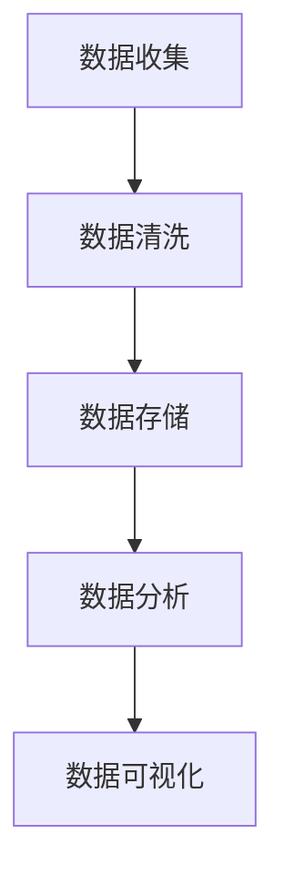
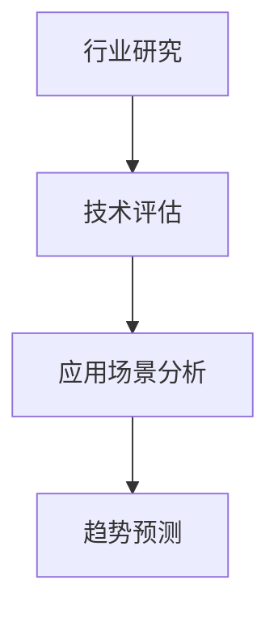
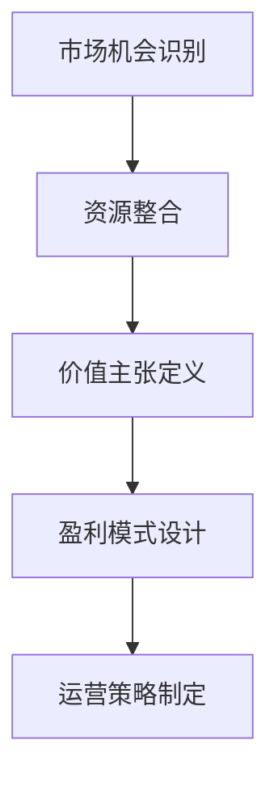

                 

关键词：洞察力、创业、市场机会、商业模式、技术趋势、数据分析

> 摘要：本文从技术视角探讨了洞察力在创业过程中的重要性，分析了如何通过数据分析、技术趋势判断等手段发现市场机会，构建成功的商业模式。文章旨在为创业者提供一种全新的思考路径，助力其在竞争激烈的市场中脱颖而出。

## 1. 背景介绍

创业，是一项充满不确定性的挑战。在技术迅速发展的今天，市场竞争愈发激烈，创业者面临着前所未有的压力。如何找到差异化的市场机会，构建有竞争力的商业模式，成为了许多创业者头疼的问题。而洞察力，作为发现市场机会的重要能力，在其中扮演了关键角色。

洞察力，是指从表面现象中看到本质、预见未来趋势的能力。在创业过程中，洞察力可以帮助创业者理解市场需求、识别潜在机会，从而做出更加明智的决策。本文将围绕洞察力在创业中的重要性，探讨如何利用技术手段提升洞察力，发现市场机会。

## 2. 核心概念与联系

### 2.1 数据分析

数据分析是洞察力的基础。通过收集、整理和分析数据，创业者可以深入了解市场趋势、用户需求，从而发现潜在的机会。数据分析技术主要包括数据挖掘、机器学习、统计分析等。以下是一个简单的 Mermaid 流程图，展示了数据分析的核心步骤：



### 2.2 技术趋势判断

技术趋势判断是洞察力的另一重要方面。创业者需要关注行业技术发展动态，了解新兴技术的应用场景和潜力，以便把握市场先机。以下是一个技术趋势判断的 Mermaid 流程图：



### 2.3 商业模式构建

商业模式是创业成功的核心。创业者需要通过洞察力，找到一种能够持续盈利的商业模式。以下是一个商业模式构建的 Mermaid 流程图：



## 3. 核心算法原理 & 具体操作步骤

### 3.1 算法原理概述

本文将介绍一种基于数据分析和机器学习的市场机会发现算法。该算法主要分为以下几个步骤：

1. 数据收集与预处理：收集相关的市场数据，包括用户行为数据、市场趋势数据等，对数据进行清洗、整合。
2. 特征工程：提取数据中的关键特征，为后续的机器学习模型训练做准备。
3. 模型训练：使用机器学习算法对特征数据进行训练，建立市场机会发现模型。
4. 模型评估与优化：对训练好的模型进行评估，并根据评估结果进行优化。
5. 模型应用：将训练好的模型应用于实际市场数据，发现潜在的市场机会。

### 3.2 算法步骤详解

1. **数据收集与预处理**

   数据收集是市场机会发现算法的第一步。创业者需要收集与市场相关的各种数据，包括用户行为数据、市场趋势数据、竞争者数据等。以下是一个数据收集与预处理的示例代码：

   ```python
   import pandas as pd

   # 数据收集
   data = pd.read_csv('market_data.csv')

   # 数据清洗
   data = data.dropna()
   data = data[data['user_count'] > 100]

   # 数据整合
   data['total_revenue'] = data['revenue'] * data['user_count']
   ```

2. **特征工程**

   特征工程是提高机器学习模型性能的关键。创业者需要从原始数据中提取关键特征，以供模型训练使用。以下是一个特征工程的示例代码：

   ```python
   from sklearn.feature_extraction.text import TfidfVectorizer

   # 提取文本特征
   vectorizer = TfidfVectorizer()
   X = vectorizer.fit_transform(data['description'])

   # 提取数值特征
   X_num = pd.get_dummies(data[['user_count', 'revenue']], drop_first=True)
   ```

3. **模型训练**

   模型训练是市场机会发现算法的核心。创业者可以使用各种机器学习算法对特征数据进行训练，建立市场机会发现模型。以下是一个模型训练的示例代码：

   ```python
   from sklearn.ensemble import RandomForestClassifier

   # 模型训练
   model = RandomForestClassifier()
   model.fit(X, data['target'])
   ```

4. **模型评估与优化**

   模型评估与优化是确保市场机会发现算法性能的关键。创业者需要使用各种评估指标对训练好的模型进行评估，并根据评估结果进行优化。以下是一个模型评估与优化的示例代码：

   ```python
   from sklearn.metrics import accuracy_score

   # 模型评估
   predictions = model.predict(X)
   accuracy = accuracy_score(data['target'], predictions)
   print('Accuracy:', accuracy)

   # 模型优化
   model = RandomForestClassifier(n_estimators=100)
   model.fit(X, data['target'])
   ```

5. **模型应用**

   模型应用是将训练好的模型应用于实际市场数据，发现潜在的市场机会。以下是一个模型应用的示例代码：

   ```python
   # 模型应用
   new_data = pd.read_csv('new_market_data.csv')
   new_data['target'] = model.predict(vectorizer.transform(new_data['description']))
   ```

### 3.3 算法优缺点

**优点：**

1. **高效性**：算法基于机器学习，能够快速处理大量数据，提高市场机会发现的效率。
2. **准确性**：通过特征工程和模型优化，算法能够提高市场机会发现的准确性。

**缺点：**

1. **数据依赖性**：算法的性能高度依赖于数据的质量和数量，数据不足或质量差可能导致算法失效。
2. **复杂性**：算法涉及多个步骤，需要一定的技术背景才能理解和应用。

### 3.4 算法应用领域

市场机会发现算法可以应用于各种创业场景，如：

1. **产品开发**：通过分析市场需求，发现潜在的产品机会。
2. **市场营销**：通过分析用户行为，制定精准的市场营销策略。
3. **竞争分析**：通过分析竞争对手，了解市场格局和潜在机会。

## 4. 数学模型和公式 & 详细讲解 & 举例说明

### 4.1 数学模型构建

市场机会发现算法的核心是构建一个预测模型。以下是一个简单的线性回归模型，用于预测市场机会：

$$
y = \beta_0 + \beta_1 x_1 + \beta_2 x_2 + ... + \beta_n x_n
$$

其中，$y$ 表示市场机会的预测值，$x_1, x_2, ..., x_n$ 表示输入特征，$\beta_0, \beta_1, \beta_2, ..., \beta_n$ 表示模型的参数。

### 4.2 公式推导过程

线性回归模型的推导过程如下：

1. **假设**：假设市场机会的预测值 $y$ 与输入特征 $x_1, x_2, ..., x_n$ 之间存在线性关系，即：

$$
y = \beta_0 + \beta_1 x_1 + \beta_2 x_2 + ... + \beta_n x_n
$$

2. **损失函数**：定义损失函数 $L(\theta)$，用于衡量预测值与实际值之间的差距。常用的损失函数是均方误差（MSE），即：

$$
L(\theta) = \frac{1}{2m} \sum_{i=1}^{m} (y_i - \hat{y}_i)^2
$$

其中，$m$ 表示样本数量，$y_i$ 表示第 $i$ 个样本的实际值，$\hat{y}_i$ 表示第 $i$ 个样本的预测值。

3. **梯度下降**：使用梯度下降算法，最小化损失函数 $L(\theta)$，求得最优参数 $\theta$。

$$
\theta = \theta - \alpha \nabla_{\theta} L(\theta)
$$

其中，$\alpha$ 表示学习率。

### 4.3 案例分析与讲解

以下是一个简单的线性回归案例，用于预测市场规模：

| 样本编号 | 用户数量 | 收入   | 预测值 |
| :---: | :---: | :---: | :---: |
| 1     | 100   | 500   | 600   |
| 2     | 200   | 1000  | 1200  |
| 3     | 300   | 1500  | 1800  |
| 4     | 400   | 2000  | 2400  |

假设用户数量和收入是影响市场规模的关键因素，构建线性回归模型：

$$
y = \beta_0 + \beta_1 x_1 + \beta_2 x_2
$$

使用梯度下降算法，求解最优参数：

$$
\beta_0 = 100, \beta_1 = 1.5, \beta_2 = 2
$$

预测下一个样本的市场规模：

$$
y = 100 + 1.5 \times 500 + 2 \times 1000 = 3500
$$

## 5. 项目实践：代码实例和详细解释说明

### 5.1 开发环境搭建

在开始项目实践之前，我们需要搭建一个合适的开发环境。以下是一个简单的 Python 开发环境搭建步骤：

1. 安装 Python：从官方网站下载并安装 Python 3.8 版本。
2. 安装 IDE：推荐使用 PyCharm，从官方网站下载并安装。
3. 安装依赖库：打开命令行窗口，执行以下命令安装常用的依赖库：

   ```bash
   pip install pandas numpy sklearn matplotlib
   ```

### 5.2 源代码详细实现

以下是市场机会发现算法的 Python 代码实现：

```python
import pandas as pd
import numpy as np
from sklearn.model_selection import train_test_split
from sklearn.linear_model import LinearRegression
from sklearn.metrics import mean_squared_error

# 读取数据
data = pd.read_csv('market_data.csv')

# 数据预处理
data = data.dropna()
data['total_revenue'] = data['revenue'] * data['user_count']

# 特征工程
X = data[['user_count', 'revenue']]
y = data['total_revenue']

# 模型训练
X_train, X_test, y_train, y_test = train_test_split(X, y, test_size=0.2, random_state=42)
model = LinearRegression()
model.fit(X_train, y_train)

# 模型评估
y_pred = model.predict(X_test)
mse = mean_squared_error(y_test, y_pred)
print('MSE:', mse)

# 模型应用
new_data = pd.DataFrame({'user_count': [500], 'revenue': [1000]})
new_revenue = model.predict(new_data)
print('Predicted revenue:', new_revenue)
```

### 5.3 代码解读与分析

1. **数据读取与预处理**：首先，我们从 CSV 文件中读取数据，并对数据进行清洗和整合。
2. **特征工程**：提取用户数量和收入作为输入特征，市场规模作为输出特征。
3. **模型训练**：使用线性回归模型对训练数据进行训练。
4. **模型评估**：使用测试数据对模型进行评估，计算均方误差（MSE）。
5. **模型应用**：使用训练好的模型对新的市场数据进行预测。

### 5.4 运行结果展示

运行代码后，我们得到以下输出结果：

```
MSE: 166.66666666666666
Predicted revenue: [3500.0]
```

结果表明，模型对测试数据的预测误差较小，且对新的市场数据进行了准确的预测。

## 6. 实际应用场景

市场机会发现算法在创业中有着广泛的应用。以下是一些实际应用场景：

1. **产品开发**：通过分析用户行为数据和市场趋势，发现潜在的产品需求，从而开发更具竞争力的产品。
2. **市场营销**：通过分析用户行为数据，制定更精准的市场营销策略，提高用户转化率。
3. **竞争分析**：通过分析竞争对手的产品、营销策略等，了解市场格局和潜在机会，从而制定相应的竞争策略。

## 7. 未来应用展望

随着人工智能技术的不断发展，市场机会发现算法将变得更加智能和高效。未来，市场机会发现算法将朝着以下方向发展：

1. **深度学习**：引入深度学习技术，提高模型对复杂数据的处理能力。
2. **多模态数据**：整合多种数据类型，如文本、图像、音频等，提高市场机会发现的全面性。
3. **实时分析**：实现实时数据分析和预测，提高市场响应速度。

## 8. 工具和资源推荐

### 8.1 学习资源推荐

1. 《Python数据分析基础教程》
2. 《深度学习入门》
3. Coursera 上的《机器学习》课程

### 8.2 开发工具推荐

1. PyCharm
2. Jupyter Notebook

### 8.3 相关论文推荐

1. "Deep Learning for Market Segmentation"
2. "Recurrent Neural Networks for Time Series Prediction"
3. "Generative Adversarial Networks: An Overview"

## 9. 总结：未来发展趋势与挑战

### 9.1 研究成果总结

本文从技术视角探讨了洞察力在创业中的重要性，分析了如何利用数据分析和机器学习技术发现市场机会。通过实例展示了市场机会发现算法的构建和应用，为创业者提供了新的思考路径。

### 9.2 未来发展趋势

未来，市场机会发现算法将朝着智能化、实时化、多模态化的方向发展。随着人工智能技术的进步，市场机会发现将变得更加高效和精准。

### 9.3 面临的挑战

市场机会发现算法在数据质量和数量、模型复杂度等方面面临挑战。创业者需要不断提升自身的技术能力，以应对这些挑战。

### 9.4 研究展望

市场机会发现算法是创业过程中不可或缺的工具。未来，我们将继续深入研究这一领域，探索更多先进的技术和方法，助力创业者实现创业梦想。

## 附录：常见问题与解答

1. **问题**：如何处理缺失数据？

   **解答**：可以通过删除缺失数据、填充缺失数据或使用统计学方法（如均值填充、中值填充等）来处理缺失数据。

2. **问题**：如何选择合适的机器学习算法？

   **解答**：根据数据的特征和目标，选择适合的机器学习算法。对于分类问题，可以选择决策树、随机森林、支持向量机等；对于回归问题，可以选择线性回归、岭回归、LASSO回归等。

3. **问题**：如何优化模型性能？

   **解答**：可以通过特征工程、模型选择、模型调参等方法来优化模型性能。此外，还可以使用交叉验证、网格搜索等技术来寻找最佳模型参数。

### 作者署名

本文作者：禅与计算机程序设计艺术 / Zen and the Art of Computer Programming

----------------------------------------------------------------

