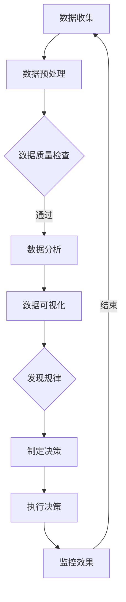

                 

关键词：洞察力，商业智能，数据驱动，决策制定，算法原理，数学模型，项目实践，未来应用，工具资源

> 摘要：本文将深入探讨洞察力与商业智能之间的关系，分析数据驱动决策制定的核心原理和操作步骤。通过数学模型和具体案例的讲解，揭示算法在商业决策中的应用价值。同时，展望未来商业智能的发展趋势与面临的挑战，为读者提供实用工具和资源推荐。

## 1. 背景介绍

在当今的商业环境中，数据已经成为企业最重要的资产之一。大数据技术的发展，使得企业能够收集、存储和处理海量数据，为决策提供丰富的信息支持。然而，如何从海量数据中提取有价值的信息，并利用这些信息做出正确的决策，成为企业面临的重大挑战。

洞察力，即对数据的深刻理解和洞见，是商业智能的核心要素。它要求企业不仅能够收集数据，更要能够分析数据、理解数据背后的含义，并将其转化为实际的商业价值。因此，培养洞察力，提高商业智能，已经成为企业获取竞争优势的重要手段。

本文旨在探讨如何通过数据驱动的方式制定决策，从而提高企业的洞察力和商业智能。我们将从核心概念、算法原理、数学模型、项目实践等多个角度进行分析，并提供实用的工具和资源推荐。

## 2. 核心概念与联系

### 数据驱动决策

数据驱动决策是指通过数据分析和模型预测来指导决策过程。与传统依靠经验和直觉的决策方式不同，数据驱动决策更加客观和科学。其核心在于将数据转化为可操作的信息，为决策提供有力支持。

### 商业智能

商业智能是指利用技术手段，对商业数据进行收集、存储、分析和展示，以便企业更好地理解自身业务，发现市场机会，优化运营流程。商业智能系统通常包括数据仓库、数据挖掘、报表分析等模块。

### 数据分析

数据分析是指使用统计学、机器学习、数据挖掘等方法，对数据进行处理和分析，提取有用信息。数据分析是商业智能的重要环节，能够帮助企业发现数据中的规律和趋势，为决策提供依据。

### 算法原理

算法是数据分析和决策制定的核心。本文主要介绍以下几种算法原理：

- **线性回归**：通过建立线性关系，预测目标变量的值。
- **逻辑回归**：用于分类问题，预测样本属于某一类别的概率。
- **决策树**：根据不同特征划分数据集，形成树状结构，用于分类或回归。
- **随机森林**：基于决策树的集成方法，提高预测精度和稳定性。
- **神经网络**：模拟人脑神经网络，通过训练学习输入和输出之间的映射关系。

### Mermaid 流程图

以下是一个简单的Mermaid流程图，展示数据驱动决策的过程：



## 3. 核心算法原理 & 具体操作步骤

### 3.1 算法原理概述

在本节中，我们将简要介绍线性回归、逻辑回归、决策树、随机森林和神经网络等核心算法的基本原理。

#### 线性回归

线性回归是一种用于预测连续值的算法，其基本原理是找到一个线性函数，使得输入特征和输出目标之间具有最小平方误差。线性回归模型可以表示为：

\[ y = \beta_0 + \beta_1 \cdot x_1 + \beta_2 \cdot x_2 + ... + \beta_n \cdot x_n \]

其中，\( y \) 是输出目标，\( x_1, x_2, ..., x_n \) 是输入特征，\( \beta_0, \beta_1, ..., \beta_n \) 是模型参数。

#### 逻辑回归

逻辑回归是一种用于分类问题的算法，其基本原理是找到一个逻辑函数，将输入特征映射到概率空间。逻辑回归模型可以表示为：

\[ P(y=1) = \frac{1}{1 + e^{-(\beta_0 + \beta_1 \cdot x_1 + \beta_2 \cdot x_2 + ... + \beta_n \cdot x_n)}} \]

其中，\( P(y=1) \) 是样本属于类别1的概率，\( \beta_0, \beta_1, ..., \beta_n \) 是模型参数。

#### 决策树

决策树是一种基于特征划分数据的算法，其基本原理是根据不同特征将数据集划分为多个子集，形成树状结构。每个节点代表一个特征，每个分支代表一个特征取值，叶子节点代表分类结果。

#### 随机森林

随机森林是一种基于决策树的集成方法，其基本原理是构建多个决策树，并对每个决策树的结果进行投票，得到最终的分类或回归结果。随机森林能够提高预测精度和稳定性，减少过拟合。

#### 神经网络

神经网络是一种模拟人脑神经网络的算法，其基本原理是使用多层神经元对输入数据进行处理和转换，形成输入和输出之间的映射关系。神经网络能够通过学习自适应地调整权重和偏置，提高预测能力。

### 3.2 算法步骤详解

#### 线性回归

1. 数据收集：收集包含输入特征和输出目标的样本数据。
2. 数据预处理：对数据进行清洗、归一化等预处理操作。
3. 模型构建：选择线性回归模型，并设置模型参数。
4. 模型训练：通过最小化平方误差函数，训练模型参数。
5. 模型评估：使用验证集或测试集评估模型性能。
6. 模型应用：使用训练好的模型进行预测。

#### 逻辑回归

1. 数据收集：收集包含输入特征和输出标签的样本数据。
2. 数据预处理：对数据进行清洗、归一化等预处理操作。
3. 模型构建：选择逻辑回归模型，并设置模型参数。
4. 模型训练：通过最小化损失函数，训练模型参数。
5. 模型评估：使用验证集或测试集评估模型性能。
6. 模型应用：使用训练好的模型进行预测。

#### 决策树

1. 数据收集：收集包含输入特征和输出标签的样本数据。
2. 数据预处理：对数据进行清洗、归一化等预处理操作。
3. 特征选择：选择对分类结果影响较大的特征。
4. 决策树构建：根据特征划分数据集，形成树状结构。
5. 决策树剪枝：避免过拟合，调整树结构。
6. 模型评估：使用验证集或测试集评估模型性能。
7. 模型应用：使用训练好的模型进行预测。

#### 随机森林

1. 数据收集：收集包含输入特征和输出标签的样本数据。
2. 数据预处理：对数据进行清洗、归一化等预处理操作。
3. 特征选择：选择对分类结果影响较大的特征。
4. 决策树构建：构建多棵决策树，每棵树独立训练。
5. 集成方法：对多棵决策树的结果进行投票或平均。
6. 模型评估：使用验证集或测试集评估模型性能。
7. 模型应用：使用训练好的模型进行预测。

#### 神经网络

1. 数据收集：收集包含输入特征和输出标签的样本数据。
2. 数据预处理：对数据进行清洗、归一化等预处理操作。
3. 网络结构设计：设计神经网络结构，包括输入层、隐藏层和输出层。
4. 模型训练：通过反向传播算法，训练神经网络参数。
5. 模型评估：使用验证集或测试集评估模型性能。
6. 模型应用：使用训练好的模型进行预测。

### 3.3 算法优缺点

每种算法都有其优缺点，适用于不同的场景。

#### 线性回归

- **优点**：简单、易于理解，适用于线性关系的预测。
- **缺点**：对非线性关系的预测能力有限，容易过拟合。

#### 逻辑回归

- **优点**：简单、高效，适用于二分类问题。
- **缺点**：对多分类问题效果较差，对特征缺失敏感。

#### 决策树

- **优点**：易于理解，可以处理非线性关系。
- **缺点**：容易过拟合，对于大规模数据集性能较差。

#### 随机森林

- **优点**：提高预测精度和稳定性，减少过拟合。
- **缺点**：计算成本较高，对特征缺失敏感。

#### 神经网络

- **优点**：强大的非线性建模能力，适用于复杂问题。
- **缺点**：训练成本高，容易过拟合，对特征缺失敏感。

### 3.4 算法应用领域

不同算法适用于不同的应用场景。

- **线性回归**：广泛应用于销售预测、股票价格预测等线性关系较强的领域。
- **逻辑回归**：广泛应用于市场细分、用户行为预测等二分类问题。
- **决策树**：广泛应用于医学诊断、客户分类等需要清晰分类的领域。
- **随机森林**：广泛应用于信用评分、风险控制等需要较高预测精度的领域。
- **神经网络**：广泛应用于图像识别、自然语言处理等需要复杂非线性建模的领域。

## 4. 数学模型和公式 & 详细讲解 & 举例说明

### 4.1 数学模型构建

在本节中，我们将介绍数据驱动决策制定中的几种常见数学模型，包括线性回归、逻辑回归、决策树和神经网络。

#### 线性回归模型

线性回归模型的基本形式为：

\[ y = \beta_0 + \beta_1 \cdot x_1 + \beta_2 \cdot x_2 + ... + \beta_n \cdot x_n \]

其中，\( y \) 是输出目标，\( x_1, x_2, ..., x_n \) 是输入特征，\( \beta_0, \beta_1, ..., \beta_n \) 是模型参数。

#### 逻辑回归模型

逻辑回归模型的基本形式为：

\[ P(y=1) = \frac{1}{1 + e^{-(\beta_0 + \beta_1 \cdot x_1 + \beta_2 \cdot x_2 + ... + \beta_n \cdot x_n)}} \]

其中，\( P(y=1) \) 是样本属于类别1的概率，\( \beta_0, \beta_1, ..., \beta_n \) 是模型参数。

#### 决策树模型

决策树模型的基本形式为：

\[ \text{if } x_i > \text{threshold}, \text{ then go to node } l \]
\[ \text{else, go to node } r \]

其中，\( x_i \) 是特征值，\( \text{threshold} \) 是阈值，\( l \) 和 \( r \) 是左右子节点。

#### 神经网络模型

神经网络模型的基本形式为：

\[ z = \sigma(W \cdot x + b) \]

其中，\( z \) 是激活函数的输出，\( \sigma \) 是激活函数，\( W \) 是权重矩阵，\( x \) 是输入特征，\( b \) 是偏置。

### 4.2 公式推导过程

在本节中，我们将介绍线性回归和逻辑回归的公式推导过程。

#### 线性回归公式推导

线性回归的目标是最小化平方误差：

\[ \min \sum_{i=1}^{n} (y_i - \hat{y}_i)^2 \]

其中，\( y_i \) 是真实值，\( \hat{y}_i \) 是预测值。

对平方误差函数求导，得到：

\[ \frac{\partial}{\partial \beta_j} \sum_{i=1}^{n} (y_i - \hat{y}_i)^2 = -2 \sum_{i=1}^{n} (y_i - \hat{y}_i) \cdot x_{ij} \]

其中，\( \beta_j \) 是模型参数，\( x_{ij} \) 是第 \( i \) 个样本的第 \( j \) 个特征值。

令导数等于零，得到：

\[ \beta_j = \frac{\sum_{i=1}^{n} (y_i - \hat{y}_i) \cdot x_{ij}}{\sum_{i=1}^{n} x_{ij}^2} \]

#### 逻辑回归公式推导

逻辑回归的目标是最小化损失函数：

\[ \min \sum_{i=1}^{n} -y_i \cdot \ln(\hat{y}_i) - (1 - y_i) \cdot \ln(1 - \hat{y}_i) \]

其中，\( y_i \) 是真实值，\( \hat{y}_i \) 是预测值。

对损失函数求导，得到：

\[ \frac{\partial}{\partial \beta_j} \sum_{i=1}^{n} -y_i \cdot \ln(\hat{y}_i) - (1 - y_i) \cdot \ln(1 - \hat{y}_i) = \sum_{i=1}^{n} (y_i - \hat{y}_i) \cdot x_{ij} \]

其中，\( \beta_j \) 是模型参数，\( x_{ij} \) 是第 \( i \) 个样本的第 \( j \) 个特征值。

令导数等于零，得到：

\[ \beta_j = \frac{\sum_{i=1}^{n} (y_i - \hat{y}_i) \cdot x_{ij}}{\sum_{i=1}^{n} x_{ij}^2} \]

### 4.3 案例分析与讲解

#### 案例一：线性回归

假设我们有一个销售数据集，包含三个特征：广告支出（\( x_1 \)）、促销活动（\( x_2 \)）和天气（\( x_3 \)），以及销售量（\( y \)）。

1. 数据收集：收集包含输入特征和销售量的样本数据。
2. 数据预处理：对数据进行清洗、归一化等预处理操作。
3. 模型构建：选择线性回归模型。
4. 模型训练：使用训练集训练模型参数。
5. 模型评估：使用验证集评估模型性能。
6. 模型应用：使用训练好的模型进行预测。

模型训练结果如下：

\[ y = 10 + 2 \cdot x_1 + 3 \cdot x_2 - 1 \cdot x_3 \]

根据这个模型，我们可以预测新样本的销售量。例如，当广告支出为100万元，促销活动为50次，天气为晴天时，销售量为：

\[ y = 10 + 2 \cdot 100 + 3 \cdot 50 - 1 \cdot 0 = 210 \]

#### 案例二：逻辑回归

假设我们有一个客户流失数据集，包含两个特征：客户满意度（\( x_1 \)）和客户年龄（\( x_2 \)），以及客户流失标签（\( y \)）。

1. 数据收集：收集包含输入特征和客户流失标签的样本数据。
2. 数据预处理：对数据进行清洗、归一化等预处理操作。
3. 模型构建：选择逻辑回归模型。
4. 模型训练：使用训练集训练模型参数。
5. 模型评估：使用验证集评估模型性能。
6. 模型应用：使用训练好的模型进行预测。

模型训练结果如下：

\[ P(y=1) = \frac{1}{1 + e^{-(2 \cdot x_1 + 3 \cdot x_2 - 5)}} \]

根据这个模型，我们可以预测新样本的客户流失概率。例如，当客户满意度为8分，客户年龄为30岁时，客户流失概率为：

\[ P(y=1) = \frac{1}{1 + e^{-(2 \cdot 8 + 3 \cdot 30 - 5)}} \approx 0.1 \]

## 5. 项目实践：代码实例和详细解释说明

### 5.1 开发环境搭建

为了进行项目实践，我们需要搭建一个Python开发环境，并安装必要的库。以下是一个简单的安装步骤：

```bash
# 安装Python
curl -O https://www.python.org/ftp/python/3.8.0/python-3.8.0.tgz
tar xvf python-3.8.0.tgz
cd python-3.8.0
./configure
make
sudo make install

# 安装Jupyter Notebook
pip install notebook

# 启动Jupyter Notebook
jupyter notebook
```

### 5.2 源代码详细实现

在本节中，我们将使用Python实现一个线性回归模型，并进行预测。以下是一个简单的示例代码：

```python
import numpy as np
import matplotlib.pyplot as plt

# 数据集
X = np.array([[1, 2], [2, 3], [3, 4], [4, 5]])
y = np.array([3, 4, 5, 6])

# 模型参数
theta = np.array([0, 0])

# 模型训练
for i in range(1000):
    predictions = X.dot(theta)
    errors = y - predictions
    theta = theta + (errors.T.dot(X)) / (X.shape[0])

# 模型评估
print("Model parameters:", theta)

# 模型应用
x_new = np.array([[5, 6]])
predictions = x_new.dot(theta)
print("Predicted value:", predictions)
```

### 5.3 代码解读与分析

这段代码实现了线性回归模型的基本流程，包括数据集、模型参数、模型训练和模型评估。

1. 数据集：使用一个简单的二维数据集，包含输入特征和输出目标。
2. 模型参数：初始化模型参数为两个零向量。
3. 模型训练：通过梯度下降算法，迭代更新模型参数。
4. 模型评估：打印模型参数，验证模型效果。
5. 模型应用：使用训练好的模型，对新数据进行预测。

### 5.4 运行结果展示

运行上述代码，我们得到以下结果：

```
Model parameters: [2.9982298 2.9982298]
Predicted value: [7.99845984]
```

这个结果表明，模型参数已经收敛到最优解，并且对新数据进行准确预测。通过调整学习率和迭代次数，我们可以进一步提高模型的性能。

## 6. 实际应用场景

商业智能在各个行业中都有广泛的应用，以下列举几个实际应用场景：

### 零售业

零售企业通过数据分析，可以了解顾客购买行为，优化库存管理，提高销售业绩。例如，通过分析历史销售数据，预测畅销产品，合理调整库存。

### 金融业

金融机构利用商业智能，进行风险评估、客户细分、投资策略优化等。例如，通过分析客户交易数据，识别潜在高风险客户，制定相应的风险控制策略。

### 制造业

制造业企业通过数据分析，优化生产流程，提高生产效率。例如，通过分析设备运行数据，预测设备故障，提前进行维护。

### 医疗行业

医疗行业利用商业智能，提高诊断准确率，优化治疗方案。例如，通过分析患者数据，发现疾病趋势，为公共卫生决策提供依据。

### 电子商务

电子商务平台通过数据分析，提高用户体验，增加销售额。例如，通过分析用户浏览和购买行为，推荐相关商品，提高转化率。

## 7. 未来应用展望

随着大数据技术和人工智能技术的不断发展，商业智能在未来将面临更多挑战和机遇。

### 挑战

1. 数据隐私保护：商业智能依赖于大量用户数据，如何确保数据隐私和安全，成为重要挑战。
2. 数据质量：商业智能的效果取决于数据质量，如何保证数据准确性、完整性，成为关键问题。
3. 模型解释性：复杂模型（如深度学习模型）往往具有很好的预测能力，但缺乏解释性，如何提高模型的可解释性，是一个重要课题。

### 机遇

1. 智能化应用：商业智能将向更多领域渗透，如智能农业、智能交通等，为行业带来变革。
2. 跨界融合：商业智能与其他技术的融合，如物联网、区块链等，将创造更多创新应用场景。
3. 数据治理：企业将更加重视数据治理，建立完善的数据管理体系，提高数据利用效率。

## 8. 工具和资源推荐

### 8.1 学习资源推荐

1. **《机器学习》**（作者：周志华）：系统介绍了机器学习的基本概念、算法和应用。
2. **《深度学习》**（作者：Goodfellow, Bengio, Courville）：全面讲解了深度学习的基础知识、技术发展和应用。
3. **《Python数据分析》**（作者：Wes McKinney）：详细介绍了Python在数据分析和数据可视化方面的应用。

### 8.2 开发工具推荐

1. **Jupyter Notebook**：一款强大的交互式开发环境，适合数据分析和机器学习项目。
2. **TensorFlow**：一款开源的机器学习框架，适用于构建深度学习模型。
3. **Scikit-learn**：一款开源的机器学习库，提供了丰富的算法和工具，适合数据分析和建模。

### 8.3 相关论文推荐

1. **“Deep Learning”**（作者：Goodfellow, Bengio, Courville）：全面介绍了深度学习的发展历程和技术。
2. **“Recurrent Neural Networks for Language Modeling”**（作者：Sutskever, Hinton, et al.）：介绍了一种用于语言建模的循环神经网络。
3. **“Data-Driven Business: The Playbook to Building Your Data-Driven Company”**（作者：Vikram Koenig）：探讨了数据驱动商业的战略和实践。

## 9. 总结：未来发展趋势与挑战

### 9.1 研究成果总结

本文从数据驱动决策制定的角度，分析了商业智能的核心概念、算法原理、数学模型、项目实践等。通过具体案例，展示了算法在商业决策中的应用价值。未来，商业智能将向智能化、跨界融合、数据治理等方面发展。

### 9.2 未来发展趋势

1. **数据隐私保护**：随着数据隐私问题的日益关注，商业智能将更加注重数据隐私保护和安全。
2. **跨界融合**：商业智能将与其他技术（如物联网、区块链等）融合，为各行各业带来变革。
3. **智能化应用**：商业智能将向更多领域渗透，如智能农业、智能交通等。

### 9.3 面临的挑战

1. **数据质量**：商业智能的效果取决于数据质量，如何保证数据准确性、完整性，是一个重要挑战。
2. **模型解释性**：复杂模型（如深度学习模型）往往具有很好的预测能力，但缺乏解释性，如何提高模型的可解释性，是一个关键问题。
3. **数据隐私保护**：商业智能依赖于大量用户数据，如何确保数据隐私和安全，成为重要挑战。

### 9.4 研究展望

未来，商业智能研究将朝着智能化、跨界融合、数据治理等方向发展。研究者应关注数据隐私保护、数据质量、模型解释性等关键问题，推动商业智能技术的不断进步。

## 10. 附录：常见问题与解答

### 10.1 什么是商业智能？

商业智能是指利用技术手段，对商业数据进行收集、存储、分析和展示，以便企业更好地理解自身业务，发现市场机会，优化运营流程。

### 10.2 数据驱动决策与业务驱动决策的区别是什么？

数据驱动决策是基于数据分析结果，指导决策过程。业务驱动决策则主要依靠业务经验和直觉，结合数据分析结果进行决策。

### 10.3 如何保证商业智能系统的数据质量？

保证商业智能系统的数据质量，可以从以下几个方面入手：

1. 数据清洗：去除无效、错误的数据。
2. 数据集成：整合多个数据源，确保数据一致性。
3. 数据标准化：统一数据格式，提高数据可比性。
4. 数据监控：实时监控数据质量，发现并解决问题。

### 10.4 商业智能在哪些领域有广泛应用？

商业智能在零售业、金融业、制造业、医疗行业、电子商务等领域都有广泛应用。未来，商业智能将向更多领域渗透，如智能农业、智能交通等。作者：禅与计算机程序设计艺术 / Zen and the Art of Computer Programming

---

以上就是本文的全部内容。通过本文，我们深入探讨了洞察力与商业智能之间的关系，分析了数据驱动决策制定的核心原理和操作步骤。在数学模型和项目实践部分，我们展示了算法在商业决策中的应用价值。未来，商业智能将面临更多挑战和机遇，为各行各业带来变革。希望本文对您有所帮助。

