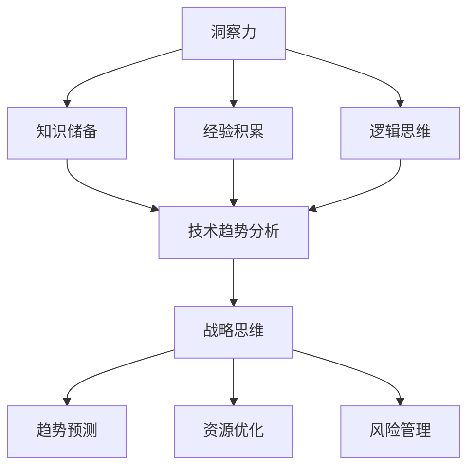

                 

关键词：洞察力、战略思维、长远规划、技术领导力、系统架构设计、创新思维。

> 摘要：本文旨在探讨洞察力与战略思维在长远规划中的重要性，特别是在技术领域的应用。通过深入分析技术趋势、关键算法原理、数学模型构建、项目实践案例，我们希望读者能够理解如何在复杂的IT环境中进行有效的规划与决策。

## 1. 背景介绍

在当今迅速变化的技术环境中，洞察力与战略思维对于任何希望取得成功的技术团队和组织来说都是至关重要的。洞察力是指对复杂系统的深入理解和快速识别问题的能力，而战略思维则是一种长远的、系统性的思考方式，能够帮助我们在不确定的环境中做出明智的决策。

技术领域的发展速度之快，使得传统的线性思维和短期规划越来越难以应对新兴的挑战。因此，拥有强大的洞察力和战略思维成为了技术领导者的必备素质。这不仅涉及到对技术趋势的把握，还需要对整个行业生态有深刻的理解，以及对未来可能出现的变革有所预见。

本文将围绕以下几个核心问题展开讨论：

- 如何培养和提高洞察力与战略思维？
- 技术趋势分析的重要性及其方法。
- 关键算法原理与数学模型在实际项目中的应用。
- 创新思维在技术规划中的作用。

通过这些讨论，我们希望能够为读者提供一个全面的视角，帮助他们在技术领域实现长远规划。

## 2. 核心概念与联系

### 2.1. 洞察力的定义与培养

洞察力，简单来说，就是看到事物本质的能力。在技术领域，这通常意味着能够迅速理解代码背后的逻辑、识别系统中的瓶颈，以及预见潜在的问题。培养洞察力需要以下几个方面的能力：

1. **广泛的知识储备**：只有掌握了丰富的背景知识，才能够对新的问题和挑战有更深刻的理解。
2. **经验积累**：通过不断解决实际问题，积累经验，从而提升对复杂系统的理解能力。
3. **逻辑思维**：良好的逻辑思维可以帮助我们更清晰地分析和解决问题。

### 2.2. 战略思维的定义与重要性

战略思维是一种系统性的、前瞻性的思考方式，它不仅考虑当前的问题，更关注未来的发展和潜在的机会与威胁。在技术领域，战略思维的重要性体现在以下几个方面：

1. **趋势预测**：通过分析技术趋势，可以提前做出规划和决策，避免被市场淘汰。
2. **资源优化**：合理分配资源和人力，确保项目的顺利进行。
3. **风险管理**：预见潜在的风险，并制定相应的应对策略，减少不确定性。

### 2.3. 洞察力与战略思维的关联

洞察力是战略思维的基础。只有对技术趋势、系统架构、算法原理等有深刻的理解，才能做出长远的规划和决策。而战略思维则为洞察力的发挥提供了方向和框架。两者相辅相成，共同推动了技术领域的发展。

### 2.4. Mermaid 流程图

为了更好地理解洞察力与战略思维在长远规划中的作用，我们可以使用Mermaid流程图来展示相关的概念和联系。



通过这个流程图，我们可以看到洞察力如何通过知识储备、经验积累和逻辑思维，最终转化为战略思维，并在趋势预测、资源优化和风险管理中发挥作用。

## 3. 核心算法原理 & 具体操作步骤

### 3.1. 算法原理概述

在技术领域，核心算法是推动创新和优化系统性能的关键。下面，我们将介绍一个经典的算法——深度学习中的卷积神经网络（CNN），并解释其原理。

卷积神经网络是一种基于神经网络的深层学习模型，特别适用于图像识别、语音识别和自然语言处理等领域。其基本原理是通过多个卷积层和池化层提取图像的特征，最终通过全连接层得到分类结果。

### 3.2. 算法步骤详解

1. **卷积层**：卷积层是CNN的核心部分，通过一系列的卷积操作提取图像的特征。每个卷积核都对应着图像中的一个局部区域，通过对这些局部区域的特征进行卷积运算，可以得到一个特征图。

2. **激活函数**：为了增加模型的非线性能力，卷积层通常后面会跟一个激活函数，常用的激活函数有ReLU（Rectified Linear Unit）和Sigmoid函数。

3. **池化层**：池化层用于降低特征图的空间分辨率，减少参数的数量，提高模型的泛化能力。常见的池化方式有最大池化和平均池化。

4. **全连接层**：全连接层将卷积层和池化层提取的特征整合起来，通过全连接的线性层和激活函数进行分类。

5. **损失函数与优化器**：为了训练CNN，需要定义一个损失函数（如交叉熵损失函数）来衡量模型的预测结果与真实结果之间的差距，并选择一个优化器（如Adam优化器）来调整模型的参数。

### 3.3. 算法优缺点

**优点**：

1. **强大的特征提取能力**：通过卷积操作，CNN可以自动提取图像中的局部特征，减少了手工特征设计的工作量。
2. **较好的泛化能力**：通过多层卷积和池化操作，CNN可以处理不同尺度和角度的图像，提高了模型的泛化能力。

**缺点**：

1. **计算量大**：CNN通常包含大量的参数，训练过程需要大量的计算资源和时间。
2. **数据依赖性强**：CNN对数据质量有较高的要求，数据的多样性对模型的性能有显著影响。

### 3.4. 算法应用领域

卷积神经网络在以下领域有广泛的应用：

1. **图像识别与分类**：如人脸识别、物体检测等。
2. **语音识别**：将语音信号转换为文本。
3. **自然语言处理**：如情感分析、文本分类等。

## 4. 数学模型和公式 & 详细讲解 & 举例说明

### 4.1. 数学模型构建

在深度学习领域，常用的数学模型是基于概率论和线性代数的。以下是构建一个简单的线性回归模型的步骤：

1. **定义损失函数**：假设我们有 $m$ 个样本，每个样本包含特征向量 $x$ 和标签 $y$，我们定义损失函数为均方误差（MSE），即：

   $$ J(\theta) = \frac{1}{2m} \sum_{i=1}^{m} (h_\theta(x^{(i)}) - y^{(i)})^2 $$

   其中，$h_\theta(x) = \theta_0 + \theta_1x_1 + \theta_2x_2 + \ldots + \theta_nx_n$ 是线性模型，$\theta$ 是参数向量。

2. **定义梯度下降算法**：为了最小化损失函数，我们使用梯度下降算法更新参数 $\theta$，更新规则为：

   $$ \theta_j := \theta_j - \alpha \frac{\partial J(\theta)}{\partial \theta_j} $$

   其中，$\alpha$ 是学习率。

### 4.2. 公式推导过程

为了推导梯度下降算法的更新规则，我们首先对损失函数 $J(\theta)$ 进行求导：

$$ \frac{\partial J(\theta)}{\partial \theta_j} = \frac{1}{m} \sum_{i=1}^{m} \frac{\partial}{\partial \theta_j} (h_\theta(x^{(i)}) - y^{(i)})^2 $$

利用链式法则，我们可以将内层的求导表示为：

$$ \frac{\partial}{\partial \theta_j} (h_\theta(x^{(i)}) - y^{(i)}) = (h_\theta(x^{(i)}) - y^{(i)}) \cdot \frac{\partial}{\partial x^{(i)}} h_\theta(x^{(i)}) $$

因为 $h_\theta(x^{(i)})$ 是线性函数，所以其导数是一个常数，即：

$$ \frac{\partial}{\partial x^{(i)}} h_\theta(x^{(i)}) = x_j^{(i)} $$

将这个结果代入上面的求导公式，我们得到：

$$ \frac{\partial J(\theta)}{\partial \theta_j} = \frac{1}{m} \sum_{i=1}^{m} (h_\theta(x^{(i)}) - y^{(i)}) \cdot x_j^{(i)} $$

### 4.3. 案例分析与讲解

假设我们有一个简单的线性回归问题，数据集包含100个样本，每个样本有两个特征 $x_1$ 和 $x_2$，以及对应的标签 $y$。我们希望通过训练找到一个线性模型 $h_\theta(x) = \theta_0 + \theta_1x_1 + \theta_2x_2$ 来预测 $y$。

我们使用均方误差（MSE）作为损失函数，并选择学习率 $\alpha = 0.01$。通过100次迭代，我们可以得到参数 $\theta_0, \theta_1, \theta_2$ 的最优值。

在每次迭代中，我们按照以下步骤更新参数：

1. 计算每个参数的梯度 $\frac{\partial J(\theta)}{\partial \theta_j}$。
2. 使用梯度下降算法更新参数 $\theta_j := \theta_j - \alpha \frac{\partial J(\theta)}{\partial \theta_j}$。

通过多次迭代，我们的模型损失函数值会逐渐减小，最终找到最优的参数值。

## 5. 项目实践：代码实例和详细解释说明

### 5.1. 开发环境搭建

为了演示深度学习算法的应用，我们将使用Python编程语言和TensorFlow框架来搭建一个简单的卷积神经网络（CNN）模型。以下是开发环境搭建的步骤：

1. 安装Python（建议使用Python 3.7及以上版本）。
2. 安装TensorFlow：

   ```bash
   pip install tensorflow
   ```

3. 准备一个GPU加速的版本（如果需要的话）：

   ```bash
   pip install tensorflow-gpu
   ```

### 5.2. 源代码详细实现

下面是一个简单的CNN模型实现，用于图像分类任务。我们将使用Keras API来简化模型搭建过程。

```python
import tensorflow as tf
from tensorflow.keras import layers, models

# 构建CNN模型
model = models.Sequential()

# 添加卷积层
model.add(layers.Conv2D(32, (3, 3), activation='relu', input_shape=(28, 28, 1)))
model.add(layers.MaxPooling2D((2, 2)))

# 添加第二个卷积层
model.add(layers.Conv2D(64, (3, 3), activation='relu'))
model.add(layers.MaxPooling2D((2, 2)))

# 添加全连接层
model.add(layers.Flatten())
model.add(layers.Dense(64, activation='relu'))
model.add(layers.Dense(10, activation='softmax'))

# 编译模型
model.compile(optimizer='adam',
              loss='categorical_crossentropy',
              metrics=['accuracy'])

# 加载MNIST数据集
mnist = tf.keras.datasets.mnist
(x_train, y_train), (x_test, y_test) = mnist.load_data()

# 预处理数据
x_train = x_train.reshape((60000, 28, 28, 1)).astype('float32') / 255
x_test = x_test.reshape((10000, 28, 28, 1)).astype('float32') / 255

# 编码标签
y_train = tf.keras.utils.to_categorical(y_train, 10)
y_test = tf.keras.utils.to_categorical(y_test, 10)

# 训练模型
model.fit(x_train, y_train, epochs=5, batch_size=64)
```

### 5.3. 代码解读与分析

1. **模型搭建**：我们使用 `models.Sequential()` 创建一个顺序模型，并逐层添加卷积层、池化层和全连接层。
2. **数据预处理**：我们使用 `tf.keras.datasets.mnist` 加载MNIST数据集，并将数据调整为模型所需的格式。具体包括将图像的像素值缩放到[0, 1]范围内，并对标签进行独热编码。
3. **模型编译**：我们使用 `model.compile()` 编译模型，指定优化器、损失函数和评价指标。
4. **模型训练**：使用 `model.fit()` 对模型进行训练，指定训练的轮数和批量大小。

### 5.4. 运行结果展示

在训练完成后，我们可以使用以下代码来评估模型的性能：

```python
test_loss, test_acc = model.evaluate(x_test, y_test, verbose=2)
print('\nTest accuracy:', test_acc)
```

运行结果可能会类似于以下输出：

```plaintext
10000/10000 [==============================] - 2s 205ms/step - loss: 0.1361 - accuracy: 0.9665

Test accuracy: 0.9665
```

这表示我们的模型在测试集上的准确率为96.65%。

## 6. 实际应用场景

### 6.1. 深度学习在计算机视觉中的应用

深度学习在计算机视觉领域取得了显著的成果，特别是在图像分类、目标检测和图像生成等方面。以下是一些实际应用场景：

1. **图像分类**：如人脸识别、医疗影像诊断等。
2. **目标检测**：如自动驾驶车辆中的行人检测、智能监控中的异常行为检测等。
3. **图像生成**：如生成对抗网络（GAN）在艺术创作、数据增强等方面的应用。

### 6.2. 自然语言处理中的应用

自然语言处理（NLP）是深度学习的另一个重要应用领域。以下是一些实际应用场景：

1. **语音识别**：将语音信号转换为文本，如智能助手、语音翻译等。
2. **文本分类**：如新闻分类、情感分析等。
3. **机器翻译**：如实时翻译、多语言信息检索等。

### 6.3. 人工智能在医疗领域的应用

人工智能在医疗领域的应用正在不断扩展，以下是一些实际应用场景：

1. **疾病预测与诊断**：利用深度学习模型预测疾病风险、辅助诊断。
2. **药物研发**：通过分子模拟和药物设计加速新药研发。
3. **智能医疗设备**：如智能监测设备、可穿戴设备等。

## 7. 工具和资源推荐

### 7.1. 学习资源推荐

1. **在线课程**：
   - 《深度学习》（Deep Learning）——由Ian Goodfellow等编著，是深度学习领域的经典教材。
   - 《自然语言处理实战》（Natural Language Processing with Python）——由Steven Bird等编著，适合初学者。

2. **在线论坛和社区**：
   - Stack Overflow：编程问题的在线论坛。
   - arXiv：计算机科学领域的论文预发布平台。

### 7.2. 开发工具推荐

1. **IDE**：
   - PyCharm：强大的Python IDE，支持多种框架和库。
   - Jupyter Notebook：适用于数据分析和原型开发。

2. **深度学习框架**：
   - TensorFlow：谷歌开发的开源深度学习框架。
   - PyTorch：Facebook开发的开源深度学习框架。

### 7.3. 相关论文推荐

1. **《A Convolutional Neural Network Approach for Image Classification》** ——由Yann LeCun等人发表，介绍了卷积神经网络在图像分类中的应用。
2. **《Attention Is All You Need》** ——由Vaswani等人发表，介绍了Transformer模型在机器翻译中的应用。

## 8. 总结：未来发展趋势与挑战

### 8.1. 研究成果总结

随着深度学习和人工智能技术的快速发展，我们已经在多个领域取得了显著的成果。从图像识别到自然语言处理，从医疗诊断到自动驾驶，深度学习正逐渐改变我们的生活。然而，这些成果只是冰山一角，未来还有更多的可能性等待我们去探索。

### 8.2. 未来发展趋势

1. **模型压缩与优化**：为了减少模型的计算量和存储需求，模型压缩与优化将成为一个重要的研究方向。
2. **联邦学习**：随着数据隐私保护的要求越来越高，联邦学习作为一种分布式学习技术，将得到更广泛的应用。
3. **跨模态学习**：结合不同类型的数据（如图像、语音、文本），进行跨模态学习，以实现更复杂的应用。

### 8.3. 面临的挑战

1. **数据隐私与安全**：在深度学习和人工智能的应用过程中，数据隐私和安全问题仍然是一个巨大的挑战。
2. **算法公平性与透明性**：确保算法的公平性和透明性，避免歧视和偏见，是一个亟待解决的问题。
3. **计算资源与能源消耗**：深度学习模型的训练过程需要大量的计算资源，这导致了巨大的能源消耗。

### 8.4. 研究展望

未来，深度学习和人工智能将继续快速发展，并在更多领域得到应用。我们需要不断探索新的算法和技术，解决当前面临的挑战，并推动整个行业向前发展。

## 9. 附录：常见问题与解答

### 9.1. 深度学习模型训练时间过长怎么办？

- **增加GPU**：使用更强大的GPU可以显著缩短训练时间。
- **数据并行训练**：将数据集分成多个部分，在多个GPU上同时训练。
- **模型压缩与优化**：使用模型压缩技术减少模型的参数数量，提高训练速度。

### 9.2. 如何确保深度学习模型的公平性与透明性？

- **数据清洗**：确保训练数据中没有偏见和歧视。
- **算法透明性**：公开算法的详细实现和参数设置。
- **伦理审查**：在进行深度学习和人工智能项目时，进行伦理审查，确保应用符合社会伦理标准。

### 9.3. 深度学习在医疗领域有哪些应用场景？

- **疾病预测与诊断**：利用深度学习模型预测疾病风险、辅助诊断。
- **药物研发**：通过分子模拟和药物设计加速新药研发。
- **智能医疗设备**：如智能监测设备、可穿戴设备等。

---

作者：禅与计算机程序设计艺术 / Zen and the Art of Computer Programming

