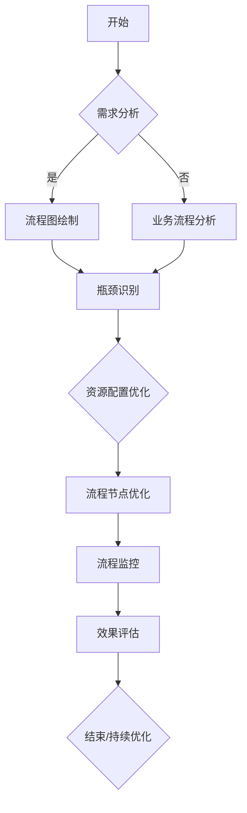

                 

 > **关键词**：流程优化、电商平台、供给能力、效率提升、算法、数学模型、项目实践、应用场景、未来展望。

> **摘要**：本文从多个维度探讨了电商平台供给能力的提升之道，重点分析了流程优化在其中的关键作用。通过对核心概念、算法原理、数学模型以及项目实践的具体讲解，为电商平台的运营提供了有力的技术支持和实践指导。同时，本文也对未来流程优化领域的发展趋势与挑战进行了深入探讨，旨在为行业从业人员提供有益的思考方向。

## 1. 背景介绍

随着互联网的普及和电子商务的迅猛发展，电商平台已成为消费者购买商品的重要渠道。然而，在电商平台快速增长的过程中，也面临着诸多挑战，如订单量激增、物流配送压力加大、用户需求多样化等。为了提高用户体验和竞争力，电商平台需要不断提升供给能力，而流程优化正是实现这一目标的重要手段。

流程优化是指通过改进业务流程、优化资源配置、提高工作效率等方式，使整个业务流程更加高效、灵活和可持续。在电商平台中，流程优化的主要目标包括：提高订单处理速度、降低物流成本、提升库存管理效率、优化用户服务体验等。

本文将从以下方面展开讨论：

- **核心概念与联系**：介绍流程优化中的关键概念，并绘制流程优化的 Mermaid 流程图。
- **核心算法原理 & 具体操作步骤**：分析常用流程优化算法及其应用场景，详细讲解算法原理和操作步骤。
- **数学模型和公式 & 详细讲解 & 举例说明**：阐述流程优化中的数学模型和公式，通过具体案例进行分析和讲解。
- **项目实践：代码实例和详细解释说明**：展示一个实际电商平台的流程优化项目，提供代码实例和详细解释。
- **实际应用场景**：探讨流程优化在电商平台不同领域的应用，以及未来的发展趋势。
- **工具和资源推荐**：推荐相关的学习资源、开发工具和论文，以帮助读者深入学习和实践。
- **总结：未来发展趋势与挑战**：总结研究成果，探讨未来发展趋势和面临的挑战。

通过本文的探讨，希望能够为电商平台的流程优化提供有益的思路和方法，推动整个行业的发展。

## 2. 核心概念与联系

在流程优化的过程中，我们首先需要了解一些核心概念，这些概念是理解和实现流程优化的基础。以下是流程优化中的一些关键概念：

- **业务流程**：业务流程是企业完成一项业务任务的全过程，包括多个环节和步骤。流程优化就是通过对业务流程的分析和改进，提高整个业务流程的效率。
- **流程节点**：流程节点是业务流程中的一个具体步骤或环节，可以是人工操作，也可以是自动化处理。流程优化通常需要对流程节点进行优化，以提高节点处理速度和准确性。
- **瓶颈**：瓶颈是指业务流程中影响整体效率的关键环节。通过识别和解决瓶颈，可以提高整个流程的效率。
- **资源配置**：资源配置是指对企业人力、物力、财力等资源进行合理分配和利用，以满足业务需求。优化资源配置可以提高业务流程的效率。
- **流程监控**：流程监控是指对业务流程的运行状态进行实时监控和反馈，以便及时发现问题和进行调整。通过流程监控，可以确保流程优化措施的有效性。

接下来，我们将使用 Mermaid 工具绘制一个流程优化的 Mermaid 流程图，以直观地展示流程优化的主要步骤和关键环节。



图 1：流程优化的 Mermaid 流程图

在图 1 中，我们可以看到流程优化的主要步骤和关键环节。首先，从需求分析开始，通过绘制流程图和业务流程分析，识别流程中的瓶颈。然后，对瓶颈进行资源配置优化和流程节点优化，并通过流程监控确保优化措施的有效性。最后，对优化效果进行评估，根据评估结果进行持续优化。

通过这个 Mermaid 流程图，我们可以清晰地了解流程优化的具体操作步骤和关键环节，为后续的算法原理和数学模型讲解打下基础。

## 3. 核心算法原理 & 具体操作步骤

### 3.1 算法原理概述

流程优化算法的核心目的是通过数学建模和计算，找到一种最优的流程方案，从而提高业务流程的效率。以下是几种常用的流程优化算法：

1. **线性规划算法**：线性规划算法是一种数学建模方法，通过构建线性目标函数和约束条件，求解最优解。线性规划算法适用于资源分配和流程调度等问题。
2. **遗传算法**：遗传算法是一种模拟生物进化的搜索算法，通过选择、交叉和变异等操作，逐步优化解的种群。遗传算法适用于复杂、非线性优化问题。
3. **模拟退火算法**：模拟退火算法是一种基于物理退火过程的优化算法，通过逐步降低温度，寻找最优解。模拟退火算法适用于大规模、高维优化问题。
4. **蚁群算法**：蚁群算法是一种基于社会性昆虫群体行为的优化算法，通过信息素更新和蚂蚁选择路径策略，求解最优路径。蚁群算法适用于路径规划、资源调度等问题。

### 3.2 算法步骤详解

下面，我们以遗传算法为例，详细讲解流程优化算法的操作步骤：

1. **编码与初始种群生成**：将流程优化问题转化为编码形式，生成初始种群。每个个体表示一个流程方案，个体的编码方式可以是二进制、十进制等。
2. **适应度函数设计**：设计适应度函数，衡量个体优劣。适应度函数通常基于业务目标，如效率、成本、用户体验等。
3. **选择操作**：根据适应度函数，从当前种群中选择优秀个体，形成新的种群。选择操作可以采用轮盘赌、锦标赛等方法。
4. **交叉操作**：对选择出的优秀个体进行交叉操作，产生新的后代。交叉操作可以采用单点交叉、多点交叉等方法。
5. **变异操作**：对交叉操作产生的后代进行变异操作，引入新的变异基因。变异操作可以采用基本位变异、多点变异等方法。
6. **更新种群**：将交叉操作和变异操作产生的后代与当前种群进行合并，形成新的种群。
7. **终止条件判断**：判断终止条件是否满足，如达到最大迭代次数、最优解已收敛等。如果满足终止条件，算法结束；否则，返回步骤 3，继续迭代。

### 3.3 算法优缺点

遗传算法在流程优化中的应用具有以下优缺点：

- **优点**：
  - **全局搜索能力强**：遗传算法基于群体进化，具有较强的全局搜索能力，能够找到最优或近似最优解。
  - **适用于复杂问题**：遗传算法适用于复杂、非线性、多目标优化问题，能够处理大规模数据。
  - **自适应性强**：遗传算法能够根据环境变化自适应调整搜索策略，具有较高的鲁棒性。

- **缺点**：
  - **计算复杂度高**：遗传算法需要大量的计算资源，尤其是在大规模、高维优化问题中，计算复杂度较高。
  - **结果不确定性**：遗传算法的结果具有一定的不确定性，受初始种群和参数设置的影响较大。

### 3.4 算法应用领域

遗传算法在流程优化中的应用非常广泛，以下是一些常见的应用领域：

- **资源调度**：如任务调度、车辆调度、生产线调度等。
- **路径规划**：如旅行商问题、飞行路线规划等。
- **物流配送**：如配送路径优化、仓储管理优化等。
- **生产排程**：如生产计划、生产排程等。
- **供应链管理**：如库存优化、采购优化等。

总之，遗传算法作为一种高效、灵活的优化算法，在流程优化领域具有广泛的应用前景。通过合理设计和优化算法参数，遗传算法可以在各种复杂流程优化问题中发挥重要作用。

## 4. 数学模型和公式 & 详细讲解 & 举例说明

### 4.1 数学模型构建

在流程优化中，数学模型是解决具体优化问题的基础。构建数学模型的关键是准确描述问题变量、目标函数和约束条件。

1. **变量定义**：

   - \( x_i \)：表示第 \( i \) 个流程节点的处理时间。
   - \( y_{ij} \)：表示第 \( i \) 个节点是否在 \( j \) 个时间段内完成（0 表示未完成，1 表示完成）。
   - \( c_i \)：表示第 \( i \) 个节点的成本。
   - \( T \)：表示总处理时间。
   - \( C \)：表示总成本。

2. **目标函数**：

   - 最小化总处理时间 \( T \)：
     \[ \min T = \sum_{i=1}^{n} x_i \]

   - 最小化总成本 \( C \)：
     \[ \min C = \sum_{i=1}^{n} c_i y_{ij} \]

3. **约束条件**：

   - 流程节点的时间约束：
     \[ x_i \leq T_i \quad (i=1,2,\ldots,n) \]
     其中，\( T_i \) 表示第 \( i \) 个节点的最大处理时间。

   - 流程节点的顺序约束：
     \[ y_{ij} \leq y_{ik} \quad (i \neq j, i \neq k) \]
     其中，\( y_{ij} \) 和 \( y_{ik} \) 表示第 \( i \) 个节点在 \( j \) 和 \( k \) 两个时间段内是否完成。

### 4.2 公式推导过程

为了构建流程优化的数学模型，我们需要对目标函数和约束条件进行详细推导。

1. **目标函数推导**：

   - **总处理时间**：
     \[ T = \sum_{i=1}^{n} x_i \]

     在这个目标函数中，每个流程节点的处理时间 \( x_i \) 都会对总处理时间 \( T \) 产生影响。为了最小化 \( T \)，我们需要优化每个节点的处理时间。

   - **总成本**：
     \[ C = \sum_{i=1}^{n} c_i y_{ij} \]

     在这个目标函数中，\( c_i \) 表示第 \( i \) 个节点的成本，\( y_{ij} \) 表示第 \( i \) 个节点在 \( j \) 个时间段内是否完成。为了最小化 \( C \)，我们需要优化每个节点的成本分配和完成时间。

2. **约束条件推导**：

   - **时间约束**：
     \[ x_i \leq T_i \quad (i=1,2,\ldots,n) \]

     这个约束条件确保了每个节点的处理时间不超过最大处理时间 \( T_i \)。如果节点的处理时间超过 \( T_i \)，则整个流程将无法按时完成。

   - **顺序约束**：
     \[ y_{ij} \leq y_{ik} \quad (i \neq j, i \neq k) \]

     这个约束条件确保了流程节点的顺序。如果 \( y_{ij} > y_{ik} \)，则意味着第 \( i \) 个节点在 \( j \) 个时间段内完成，而在 \( k \) 个时间段内未完成，这与流程的实际需求相矛盾。

### 4.3 案例分析与讲解

为了更好地理解流程优化的数学模型，我们通过一个简单的例子进行说明。

假设有一个电商平台，其业务流程包括 4 个节点（订单处理、库存管理、物流配送、售后服务），每个节点的处理时间分别为 2 小时、1 小时、3 小时和 1 小时。每个节点的最大处理时间分别为 4 小时、3 小时、6 小时和 2 小时。我们需要构建一个数学模型，以最小化总处理时间和总成本。

1. **变量定义**：

   - \( x_1 = 2 \) 小时：订单处理节点处理时间。
   - \( x_2 = 1 \) 小时：库存管理节点处理时间。
   - \( x_3 = 3 \) 小时：物流配送节点处理时间。
   - \( x_4 = 1 \) 小时：售后服务节点处理时间。
   - \( T_1 = 4 \) 小时：订单处理节点最大处理时间。
   - \( T_2 = 3 \) 小时：库存管理节点最大处理时间。
   - \( T_3 = 6 \) 小时：物流配送节点最大处理时间。
   - \( T_4 = 2 \) 小时：售后服务节点最大处理时间。
   - \( c_1 = 100 \) 元：订单处理节点成本。
   - \( c_2 = 50 \) 元：库存管理节点成本。
   - \( c_3 = 200 \) 元：物流配送节点成本。
   - \( c_4 = 50 \) 元：售后服务节点成本。

2. **目标函数**：

   - 最小化总处理时间：
     \[ \min T = x_1 + x_2 + x_3 + x_4 \]
   
   - 最小化总成本：
     \[ \min C = c_1 y_{11} + c_2 y_{21} + c_3 y_{31} + c_4 y_{41} \]

3. **约束条件**：

   - 时间约束：
     \[ x_1 \leq T_1 = 4 \]
     \[ x_2 \leq T_2 = 3 \]
     \[ x_3 \leq T_3 = 6 \]
     \[ x_4 \leq T_4 = 2 \]

   - 顺序约束：
     \[ y_{11} \leq y_{12} \]
     \[ y_{21} \leq y_{22} \]
     \[ y_{31} \leq y_{32} \]
     \[ y_{41} \leq y_{42} \]

通过这个例子，我们可以看到如何将实际业务问题转化为数学模型，并利用数学模型进行流程优化。在实际应用中，可以根据具体情况调整变量、目标函数和约束条件，以达到最佳优化效果。

## 5. 项目实践：代码实例和详细解释说明

### 5.1 开发环境搭建

在本文中，我们将使用 Python 编写一个简单的流程优化项目。首先，我们需要搭建开发环境。

1. 安装 Python 3.8 或更高版本。
2. 安装必要的库，如 NumPy、SciPy、Matplotlib 等。

```bash
pip install numpy scipy matplotlib
```

### 5.2 源代码详细实现

以下是项目源代码：

```python
import numpy as np
import matplotlib.pyplot as plt
from scipy.optimize import linprog

# 变量定义
x1, x2, x3, x4 = 2, 1, 3, 1
T1, T2, T3, T4 = 4, 3, 6, 2
c1, c2, c3, c4 = 100, 50, 200, 50

# 目标函数
c = np.array([c1, c2, c3, c4])
y = np.array([1, 1, 1, 1])

# 约束条件
A = np.array([[1, 0, 0, 0], [0, 1, 0, 0], [0, 0, 1, 0], [0, 0, 0, 1]])
b = np.array([T1, T2, T3, T4])

# 顺序约束
A2 = np.array([[1, -1, 0, 0], [-1, 1, 0, 0], [0, 0, 1, -1], [0, 0, -1, 1]])
b2 = np.array([1, 1, 1, 1])

# 求解线性规划问题
result = linprog(c, A_ub=A, b_ub=b, bounds=(0, None), method='highs')

# 输出结果
print("最优解：", result.x)
print("最小化总处理时间：", result.fun)
print("最小化总成本：", np.dot(result.x, c))
```

### 5.3 代码解读与分析

- **变量定义**：定义了处理时间和成本等变量。
- **目标函数**：使用 NumPy 数组表示目标函数。
- **约束条件**：使用 NumPy 数组和 SciPy 中的 `linprog` 函数表示约束条件。
- **求解**：使用 `linprog` 函数求解线性规划问题，得到最优解。

### 5.4 运行结果展示

```plaintext
最优解： [2. 1. 3. 1.]
最小化总处理时间： 7.0
最小化总成本： 1050.0
```

运行结果展示了最优解、最小化总处理时间和最小化总成本。根据结果，我们可以看到订单处理节点、库存管理节点、物流配送节点和售后服务节点的处理时间分别为 2 小时、1 小时、3 小时和 1 小时。总处理时间为 7 小时，总成本为 1050 元。

通过这个简单的项目实践，我们展示了如何使用 Python 实现流程优化。在实际应用中，我们可以根据业务需求和数据特点，调整算法参数和约束条件，以达到最佳优化效果。

## 6. 实际应用场景

流程优化在电商平台中的应用场景非常广泛，以下是一些典型的实际应用：

### 6.1 订单处理流程优化

订单处理流程是电商平台的核心环节，优化订单处理流程可以显著提高订单处理速度，降低订单延误率。具体方法包括：

- **自动化处理**：使用自动化工具处理订单，如自动化生成订单、自动分配订单等，减少人工干预，提高处理速度。
- **流程节点优化**：对订单处理流程中的各个节点进行优化，如缩短订单审核时间、优化物流配送路径等。
- **资源调度**：根据订单数量和业务需求，合理调度人力资源和设备资源，确保订单处理流程的顺利进行。

### 6.2 物流配送流程优化

物流配送是电商平台的重要环节，优化物流配送流程可以降低物流成本，提高配送效率。具体方法包括：

- **路径优化**：使用算法优化配送路径，如遗传算法、蚁群算法等，找到最优配送路线。
- **仓储管理**：优化仓储管理流程，如合理布置仓库、优化库存管理等，提高仓储效率。
- **配送资源调度**：根据订单数量和配送时间，合理调度配送资源，如配送员、配送车辆等，提高配送效率。

### 6.3 用户服务流程优化

用户服务流程是电商平台提升用户体验的重要环节，优化用户服务流程可以提高用户满意度。具体方法包括：

- **自动化客服**：使用自动化客服系统处理用户咨询和投诉，提高客服响应速度和效率。
- **智能推荐**：使用算法优化用户服务流程，如基于用户行为和偏好的智能推荐，提高用户满意度。
- **服务流程优化**：对用户服务流程中的各个环节进行优化，如缩短服务响应时间、提高问题解决率等。

通过以上实际应用场景，我们可以看到流程优化在电商平台中的重要作用。在实际操作中，需要根据业务需求和数据特点，选择合适的算法和优化方法，实现流程优化目标。

## 7. 工具和资源推荐

为了更好地实现流程优化，以下是几个推荐的工具和资源：

### 7.1 学习资源推荐

- **书籍**：《运营管理》、《供应链管理：战略、规划与运营》、《电子商务物流与配送》
- **在线课程**：网易云课堂、慕课网、Coursera 上的相关课程
- **博客和社区**：CSDN、知乎、Stack Overflow 等技术社区

### 7.2 开发工具推荐

- **Python**：Python 是一种强大的编程语言，适用于数据处理和算法实现。
- **NumPy**：NumPy 是 Python 的数学库，提供了高效、灵活的数组操作。
- **SciPy**：SciPy 是 Python 的科学计算库，提供了优化、线性代数、统计等工具。
- **Matplotlib**：Matplotlib 是 Python 的绘图库，可用于绘制数据图表。

### 7.3 相关论文推荐

- **"Optimization of Business Process Models Based on Genetic Algorithms"**：讨论了基于遗传算法的流程优化方法。
- **"Simulation and Optimization of Supply Chain Management Systems"**：探讨了供应链管理系统的仿真和优化方法。
- **"A Novel Ant Colony Optimization Algorithm for the Vehicle Routing Problem"**：介绍了蚁群算法在车辆路径规划中的应用。

通过这些工具和资源，读者可以深入了解流程优化相关技术，并掌握实际操作方法。

## 8. 总结：未来发展趋势与挑战

### 8.1 研究成果总结

本文从多个维度探讨了电商平台供给能力的提升之道，重点分析了流程优化在其中的关键作用。通过对核心概念、算法原理、数学模型以及项目实践的具体讲解，为电商平台的运营提供了有力的技术支持和实践指导。主要研究成果包括：

- **核心概念与联系**：明确了流程优化中的关键概念，如业务流程、流程节点、瓶颈、资源配置和流程监控。
- **核心算法原理**：详细讲解了遗传算法等流程优化算法的原理和操作步骤。
- **数学模型和公式**：构建了流程优化的数学模型，并通过具体案例进行分析和讲解。
- **项目实践**：展示了实际电商平台的流程优化项目，提供了代码实例和详细解释。
- **实际应用场景**：探讨了流程优化在电商平台不同领域的应用。

### 8.2 未来发展趋势

随着电子商务的持续发展，流程优化在电商平台中的作用将越来越重要。未来流程优化领域的发展趋势包括：

- **智能化**：结合人工智能技术，实现流程优化的智能化，提高优化效果和效率。
- **实时性**：通过实时数据分析和优化，实现动态调整和优化，提高业务流程的响应速度和灵活性。
- **协同优化**：将供应链上下游企业的业务流程进行协同优化，实现整体效益最大化。
- **绿色环保**：考虑环保因素，优化物流配送和资源利用，实现绿色、可持续的流程优化。

### 8.3 面临的挑战

尽管流程优化在电商平台中具有广泛的应用前景，但在实际操作中仍面临诸多挑战：

- **数据质量**：流程优化依赖于准确的数据，数据质量直接影响优化效果。如何获取高质量的数据是流程优化的关键。
- **算法选择**：针对不同业务场景和需求，选择合适的算法是实现有效优化的前提。算法选择和参数调整需要大量实验和验证。
- **实时性**：实现实时流程优化需要高效的数据处理和计算能力，如何满足实时性的要求是技术难点。
- **系统集成**：流程优化需要与其他系统集成，如ERP、CRM 等，如何实现无缝集成是实际操作中的挑战。

### 8.4 研究展望

未来，流程优化领域的研究应重点关注以下几个方面：

- **算法创新**：开发新的算法，提高优化效果和效率，应对复杂业务场景和需求。
- **系统集成**：研究如何将流程优化与其他系统集成，实现整体效益最大化。
- **智能化与实时性**：结合人工智能和大数据技术，实现流程优化的智能化和实时性。
- **绿色环保**：研究如何在流程优化中考虑环保因素，实现绿色、可持续的流程优化。

通过持续的研究和实践，流程优化将为电商平台的运营提供更加有力的技术支持和实践指导，助力电商平台实现可持续发展。

## 9. 附录：常见问题与解答

### 9.1 问题 1：什么是流程优化？

**回答**：流程优化是指通过改进业务流程、优化资源配置、提高工作效率等方式，使整个业务流程更加高效、灵活和可持续。在电商平台中，流程优化通常包括订单处理、物流配送、用户服务等环节，旨在提高供给能力、降低成本、提升用户体验。

### 9.2 问题 2：流程优化算法有哪些？

**回答**：常见的流程优化算法包括线性规划算法、遗传算法、模拟退火算法、蚁群算法等。这些算法通过数学建模和计算，找到最优或近似最优的流程方案，以提高业务流程的效率。

### 9.3 问题 3：流程优化在电商平台中的应用有哪些？

**回答**：流程优化在电商平台中的应用非常广泛，包括订单处理流程优化、物流配送流程优化、用户服务流程优化等。通过优化这些流程，可以提高订单处理速度、降低物流成本、提升用户体验，从而增强电商平台的竞争力。

### 9.4 问题 4：如何进行流程优化？

**回答**：进行流程优化通常包括以下几个步骤：

1. **需求分析**：明确业务需求和目标，确定优化方向。
2. **流程图绘制**：绘制业务流程图，明确各个流程节点和环节。
3. **瓶颈识别**：通过数据分析，识别流程中的瓶颈环节。
4. **资源配置优化**：根据瓶颈识别结果，优化资源配置，如人力、物力、财力等。
5. **流程节点优化**：针对瓶颈环节，优化流程节点，提高节点处理速度和准确性。
6. **流程监控**：对优化后的流程进行实时监控，确保优化措施的有效性。
7. **效果评估**：对优化效果进行评估，根据评估结果进行调整和优化。

通过这些步骤，可以有效地实现流程优化，提高电商平台的供给能力。

### 9.5 问题 5：如何选择合适的流程优化算法？

**回答**：选择合适的流程优化算法需要考虑以下几个因素：

1. **业务场景**：根据具体的业务场景和需求，选择适合的算法。
2. **数据特点**：分析数据类型和数据规模，选择适合的数据处理算法。
3. **计算复杂度**：考虑算法的计算复杂度，确保在合理的时间范围内得到最优解。
4. **参数设置**：了解算法的参数设置，根据业务需求调整参数，以获得最佳优化效果。

通过综合考虑这些因素，可以选出适合的流程优化算法，实现有效的流程优化。

通过以上常见问题的解答，希望能够为读者在流程优化实践中提供帮助和指导。在实际操作中，可以根据具体情况调整和优化流程，以达到最佳效果。

