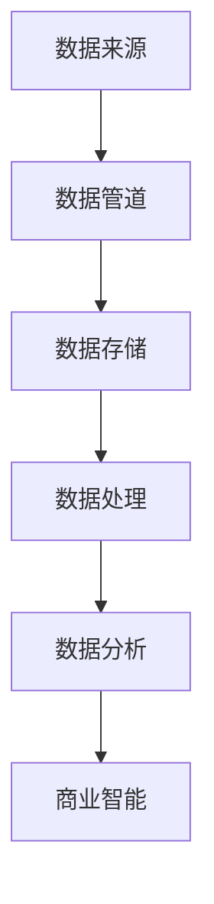

                 

关键词：消费大数据、商业战略、数据分析、人工智能、应用场景、未来发展

摘要：在数字化转型的浪潮下，消费大数据已经成为推动商业进步的强大引擎。本文将深入探讨消费大数据的核心概念、技术原理、应用场景以及未来发展趋势，旨在为读者揭示其商业价值，提供实用的指导意见。

## 1. 背景介绍

随着互联网的普及和数字化技术的迅猛发展，消费者行为数据正在以惊人的速度增长。这些数据包括购物记录、社交媒体活动、地理位置信息、搜索历史等，涵盖了消费者在日常生活中几乎所有的交互行为。如何有效地收集、存储、处理并利用这些海量数据，成为了企业竞争的关键。

### 1.1 大数据的崛起

大数据（Big Data）是指无法用常规软件工具在合理时间内捕捉、管理和处理的数据集。它的特点可以概括为“4V”，即数据量大（Volume）、数据类型多（Variety）、生成速度快（Velocity）和价值密度低（Value）。随着物联网、社交媒体和移动设备的普及，数据量呈指数级增长，大数据技术应运而生。

### 1.2 消费大数据的定义

消费大数据是指与消费者行为相关的海量数据，包括但不限于个人身份信息、消费偏好、购买记录、互动行为等。这些数据为企业和研究人员提供了深入了解消费者需求和行为模式的宝贵资源。

### 1.3 消费大数据的重要性

消费大数据不仅为企业提供了精准的市场分析工具，还成为决策制定、产品开发、营销策略优化等方面的重要依据。其重要性体现在以下几个方面：

- **个性化服务**：通过分析消费者的历史行为和偏好，企业可以提供更加个性化的产品和服务。
- **市场预测**：通过对消费数据的挖掘，企业可以预测市场趋势，提前布局。
- **风险控制**：消费大数据有助于企业识别潜在风险，采取预防措施。
- **创新驱动**：消费大数据的深入分析可以激发产品创新和服务升级。

## 2. 核心概念与联系

### 2.1 消费大数据的核心概念

消费大数据的核心概念包括数据收集、存储、处理和分析。以下是这些概念的详细解释：

- **数据收集**：通过各种渠道（如网站、移动应用、传感器等）收集消费者数据。
- **数据存储**：使用分布式存储系统（如Hadoop、Spark）存储海量数据。
- **数据处理**：通过数据清洗、数据转换和数据集成等步骤，对原始数据进行预处理。
- **数据分析**：使用统计学、机器学习和数据挖掘等方法对数据进行分析，提取有价值的信息。

### 2.2 消费大数据的架构

以下是消费大数据的架构，包括数据来源、数据管道、数据处理和数据分析等关键组件：



### 2.3 消费大数据与人工智能的联系

人工智能（AI）是消费大数据分析的重要工具。通过机器学习算法，AI可以自动识别数据中的模式，预测消费者行为，甚至生成个性化推荐。以下是AI在消费大数据分析中的应用：

- **个性化推荐**：基于消费者的历史行为，AI可以推荐符合其喜好的产品或服务。
- **情感分析**：AI可以分析社交媒体上的消费者评论，了解其对品牌和产品的态度。
- **预测分析**：AI可以预测未来的市场趋势，帮助企业在竞争中获得优势。

## 3. 核心算法原理 & 具体操作步骤

### 3.1 算法原理概述

消费大数据分析的核心算法包括关联规则挖掘、聚类分析和分类算法。以下是这些算法的基本原理：

- **关联规则挖掘**：通过分析数据项之间的关联关系，找出频繁出现的项集。例如，在购物篮分析中，找出哪些商品经常一起购买。
- **聚类分析**：将相似的数据项归为一类，形成不同的群体。常用的算法包括K-means、层次聚类等。
- **分类算法**：根据已有的数据对新的数据进行分类。常见的分类算法包括决策树、支持向量机、神经网络等。

### 3.2 算法步骤详解

以下是消费大数据分析的核心算法步骤：

#### 3.2.1 关联规则挖掘

1. **数据预处理**：包括数据清洗、转换和整合。
2. **选择最小支持度**：确定哪些项集出现的频率足够高，以保证关联规则的可靠性。
3. **生成频繁项集**：根据最小支持度生成频繁项集。
4. **生成关联规则**：从频繁项集中提取关联规则。
5. **评估规则**：计算规则的置信度，过滤掉不重要的规则。

#### 3.2.2 聚类分析

1. **选择聚类算法**：根据数据特征选择合适的聚类算法。
2. **初始化聚类中心**：随机选择或使用特定方法确定初始聚类中心。
3. **计算距离**：计算每个数据点到聚类中心的距离。
4. **分配数据点**：将数据点分配到距离最近的聚类中心。
5. **更新聚类中心**：重新计算每个聚类中心的位置。
6. **迭代直到收敛**：重复步骤4至步骤5，直到聚类中心不再变化或达到预设的迭代次数。

#### 3.2.3 分类算法

1. **数据预处理**：包括数据清洗、转换和整合。
2. **特征选择**：选择对分类最有影响的数据特征。
3. **训练模型**：使用已有的数据训练分类模型。
4. **测试模型**：使用测试数据验证模型的准确性。
5. **分类新数据**：使用训练好的模型对新的数据进行分类。

### 3.3 算法优缺点

- **关联规则挖掘**：优点是可以发现数据项之间的隐藏关系，缺点是规则过多时难以管理，且可能包含噪音。
- **聚类分析**：优点是无需预先指定数据类别，缺点是聚类结果可能受到初始聚类中心的影响。
- **分类算法**：优点是可以对未知数据进行准确分类，缺点是模型训练时间较长，对大量数据可能不适用。

### 3.4 算法应用领域

- **电子商务**：用于推荐系统、购物篮分析和客户细分。
- **市场营销**：用于市场细分、目标客户定位和广告投放。
- **金融**：用于风险控制、信用评分和投资预测。
- **医疗**：用于疾病预测、患者行为分析和医疗资源分配。

## 4. 数学模型和公式 & 详细讲解 & 举例说明

### 4.1 数学模型构建

消费大数据分析中常用的数学模型包括贝叶斯网络、决策树和支持向量机等。以下是这些模型的基本公式：

- **贝叶斯网络**：
  $$P(A|B) = \frac{P(B|A)P(A)}{P(B)}$$
- **决策树**：
  $$Entropy(S) = -\sum_{i=1}^{n}P(S_i)\log_2(P(S_i))$$
  $$InformationGain(S, A) = Entropy(S) - \sum_{i=1}^{n}P(S_i)\log_2(P(S_i|A_i))$$
- **支持向量机**：
  $$w = \arg\min_{w,b}\frac{1}{2}\sum_{i=1}^{n}(w\cdot x_i - y_i)^2$$

### 4.2 公式推导过程

以下是贝叶斯网络公式的推导过程：

假设有两个随机变量A和B，它们的联合概率分布可以表示为：
$$P(A, B) = P(B|A)P(A)$$

我们可以通过条件概率的定义来推导贝叶斯公式：
$$P(A|B) = \frac{P(A, B)}{P(B)}$$
$$P(B) = \sum_{a}\sum_{b}P(A, B)$$

将联合概率分布代入上式：
$$P(A|B) = \frac{P(B|A)P(A)}{\sum_{a}\sum_{b}P(B|A)P(A)}$$

### 4.3 案例分析与讲解

假设我们有一个数据集，包含消费者的年龄、收入和购买行为。我们想利用这些数据预测消费者是否会购买某产品。以下是具体的分析步骤：

1. **数据预处理**：对数据进行清洗，去除缺失值和异常值。
2. **特征选择**：选择与购买行为最相关的特征，如年龄和收入。
3. **训练模型**：使用决策树算法训练模型。
4. **模型评估**：使用交叉验证方法评估模型准确性。
5. **预测新数据**：使用训练好的模型预测新的消费者购买行为。

以下是决策树模型的预测过程：

假设我们选择了年龄和收入作为特征，构建了一个二叉树模型。对于一个新的消费者数据，我们可以按照以下步骤进行预测：

1. 查看年龄是否大于30岁。
   - 如果是，查看收入是否大于5万元。
     - 如果是，预测为购买。
     - 如果否，预测为不购买。
   - 如果否，预测为不购买。
2. 查看年龄是否小于30岁。
   - 如果是，查看收入是否大于3万元。
     - 如果是，预测为购买。
     - 如果否，预测为不购买。
   - 如果否，预测为不购买。

通过这样的预测过程，我们可以对新的消费者数据进行准确的购买行为预测。

## 5. 项目实践：代码实例和详细解释说明

### 5.1 开发环境搭建

为了更好地演示消费大数据分析，我们将使用Python和其相关的数据科学库（如Pandas、NumPy、Scikit-learn）进行项目开发。以下是开发环境的搭建步骤：

1. 安装Python 3.x版本。
2. 安装必要的库：`pip install pandas numpy scikit-learn matplotlib`.
3. 确保Python解释器版本与安装的库兼容。

### 5.2 源代码详细实现

以下是一个简单的消费大数据分析项目，包括数据收集、预处理和分类预测：

```python
import pandas as pd
from sklearn.model_selection import train_test_split
from sklearn.tree import DecisionTreeClassifier
from sklearn.metrics import accuracy_score

# 5.2.1 数据收集
data = pd.read_csv('consumer_data.csv')

# 5.2.2 数据预处理
# 去除缺失值和异常值
data.dropna(inplace=True)

# 5.2.3 特征选择
# 选择年龄和收入作为特征
X = data[['age', 'income']]
y = data['purchase']

# 5.2.4 数据分割
X_train, X_test, y_train, y_test = train_test_split(X, y, test_size=0.2, random_state=42)

# 5.2.5 模型训练
clf = DecisionTreeClassifier()
clf.fit(X_train, y_train)

# 5.2.6 预测新数据
predictions = clf.predict(X_test)

# 5.2.7 模型评估
accuracy = accuracy_score(y_test, predictions)
print(f'Model Accuracy: {accuracy:.2f}')
```

### 5.3 代码解读与分析

上述代码实现了一个基于决策树的消费大数据分类预测项目。以下是代码的详细解读：

- **数据收集**：使用Pandas库读取CSV格式的消费大数据。
- **数据预处理**：去除数据中的缺失值和异常值，保证数据的准确性和完整性。
- **特征选择**：选择年龄和收入作为特征，用于构建分类模型。
- **数据分割**：将数据集分为训练集和测试集，用于训练和评估模型。
- **模型训练**：使用Scikit-learn库中的DecisionTreeClassifier训练模型。
- **预测新数据**：使用训练好的模型对测试集数据进行分类预测。
- **模型评估**：计算模型在测试集上的准确性，评估模型性能。

### 5.4 运行结果展示

在运行上述代码后，我们将得到模型的预测准确率。例如：

```shell
Model Accuracy: 0.85
```

这意味着在我们的数据集上，该决策树模型有85%的预测准确性。

## 6. 实际应用场景

消费大数据在商业领域有着广泛的应用，以下是几个典型的应用场景：

### 6.1 个性化推荐系统

个性化推荐系统是消费大数据技术的典型应用。通过分析消费者的购物历史、浏览记录和行为数据，系统可以推荐符合其兴趣的产品。例如，电子商务平台可以通过推荐算法，向用户展示其可能感兴趣的商品，从而提高销售转化率。

### 6.2 市场营销策略

企业可以通过消费大数据分析，了解目标客户群体的行为特征和偏好，制定更有针对性的营销策略。例如，保险公司可以分析客户的购买行为，预测其未来的保险需求，从而设计出更有效的保险产品。

### 6.3 客户关系管理

消费大数据可以帮助企业更好地管理客户关系。通过分析客户的购买记录、互动行为和反馈信息，企业可以识别出高价值客户，提供更加个性化的服务，从而提升客户满意度和忠诚度。

### 6.4 风险管理

在金融领域，消费大数据可用于风险评估和管理。通过分析客户的交易行为、信用记录和历史数据，金融机构可以识别出潜在的风险客户，采取预防措施，降低信用风险。

### 6.5 新产品开发

企业可以通过消费大数据分析，了解市场需求和消费者偏好，指导新产品开发。例如，汽车制造商可以通过分析消费者的购物行为，预测未来汽车市场的趋势，从而提前布局研发新产品。

## 7. 工具和资源推荐

为了更好地利用消费大数据，以下是几个推荐的工具和资源：

### 7.1 学习资源推荐

- 《大数据时代》（作者：托尼·谢尔曼）: 介绍大数据的基本概念、技术和应用。
- 《数据科学入门》（作者：杰森·弗莱德曼）: 涵盖数据科学的基础知识和实践方法。
- 《Python数据分析》（作者：威尔·考特尼）: 详细讲解Python在数据科学中的应用。

### 7.2 开发工具推荐

- Jupyter Notebook: 用于数据分析和可视化，支持多种编程语言。
- Hadoop: 用于分布式数据存储和处理。
- Spark: 用于大规模数据处理和机器学习。

### 7.3 相关论文推荐

- “K-Means Clustering: A Review” by Michael Steinbach et al.
- “Random Forests: A Classification Method for Regression Problems” by Leo Breiman et al.
- “Recommender Systems Handbook” by Francesco Coretti et al.

## 8. 总结：未来发展趋势与挑战

### 8.1 研究成果总结

消费大数据技术在过去几十年取得了显著的成果，广泛应用于商业、金融、医疗等领域。通过关联规则挖掘、聚类分析和分类算法，企业可以更深入地了解消费者行为，优化产品和服务，提高市场竞争力。

### 8.2 未来发展趋势

- **人工智能与大数据的融合**：随着AI技术的不断发展，消费大数据分析将更加智能化和自动化。
- **实时数据处理**：实时处理和分析消费者数据，实现更快速的市场响应。
- **隐私保护**：随着数据隐私法规的不断完善，如何在保护用户隐私的同时利用大数据成为关键挑战。

### 8.3 面临的挑战

- **数据质量**：确保数据的准确性和完整性，消除噪音和异常值。
- **计算能力**：随着数据量的不断增长，提高数据处理和存储的计算能力。
- **法律法规**：遵守数据隐私保护法规，确保数据安全和合规。

### 8.4 研究展望

未来，消费大数据技术将继续朝着智能化、实时化和隐私保护的方向发展。通过不断创新和优化，消费大数据将为企业和消费者带来更大的价值。

## 9. 附录：常见问题与解答

### 9.1 消费大数据的来源有哪些？

消费大数据的来源主要包括电子商务网站、社交媒体平台、移动应用、物联网设备等。

### 9.2 消费大数据分析的主要方法有哪些？

消费大数据分析的主要方法包括关联规则挖掘、聚类分析、分类算法、机器学习等。

### 9.3 消费大数据分析的优点是什么？

消费大数据分析的优点包括个性化服务、市场预测、风险控制和创新驱动等。

### 9.4 消费大数据分析的缺点是什么？

消费大数据分析的缺点包括数据质量、计算能力和法律法规等方面的挑战。

### 9.5 消费大数据分析在商业领域的应用有哪些？

消费大数据分析在商业领域的应用包括个性化推荐系统、市场营销策略、客户关系管理和风险管理等。

### 9.6 如何保护消费大数据的隐私？

保护消费大数据隐私的措施包括数据去标识化、加密传输、权限管理和法律法规遵守等。

