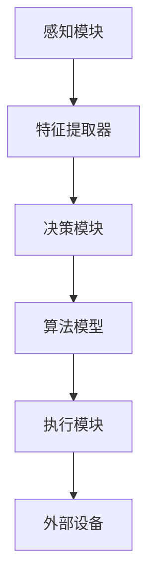

                 

AI Agent作为人工智能的核心组件，正在日益成为推动技术进步和产业变革的关键力量。从智能助手到自动驾驶汽车，AI Agent的应用已经渗透到我们日常生活的方方面面。本文旨在深入探讨AI Agent的核心技术，包括其基本概念、架构设计、核心算法、数学模型以及实际应用，以便读者能够全面了解这一领域的现状和发展趋势。

## 关键词
- AI Agent
- 智能代理
- 人工智能
- 机器学习
- 强化学习
- 深度学习

## 摘要
本文首先介绍了AI Agent的定义、背景及其重要性。随后，详细讨论了AI Agent的核心概念和架构设计，包括感知模块、决策模块和执行模块。接着，重点介绍了AI Agent的核心算法原理，从监督学习、无监督学习到强化学习。文章进一步探讨了AI Agent的数学模型和公式，结合具体案例进行讲解。最后，本文通过实际项目实践展示了AI Agent的开发流程，并对其未来应用和挑战进行了展望。

## 1. 背景介绍
### AI Agent的概念
AI Agent，即人工智能代理，是指能够智能地感知环境、做出决策并执行任务的计算机程序。与传统软件相比，AI Agent具有自我学习能力，能够通过与环境交互不断优化自身性能。Agent的概念源于人工智能研究中的自主系统（Autonomous Systems），旨在实现计算机程序对复杂环境的自主适应和自主行动。

### AI Agent的发展历程
AI Agent的发展可以追溯到20世纪50年代的人工智能初创期。随着计算能力的提升和算法的进步，AI Agent从最初的规则驱动系统逐渐演化为基于数据驱动和模型优化的智能系统。20世纪80年代，专家系统的兴起推动了AI Agent的发展，但专家系统的局限性促使研究者探索基于机器学习的方法。进入21世纪，随着深度学习和强化学习的突破，AI Agent在复杂任务中的表现日益优异。

### AI Agent的重要性
AI Agent的重要性体现在以下几个方面：
1. **提高效率**：通过自动化和智能化，AI Agent能够显著提高任务执行的效率和质量。
2. **降低成本**：自动化决策和执行可以减少人力成本和资源浪费。
3. **扩展能力**：AI Agent能够处理复杂环境和多变的任务，扩展人类的能力范围。
4. **创新应用**：AI Agent在自动驾驶、智能家居、医疗诊断、金融服务等多个领域展现了巨大的应用潜力。

## 2. 核心概念与联系

AI Agent的核心概念包括感知模块、决策模块和执行模块，它们协同工作，实现AI Agent的智能行为。

### 感知模块（Perception Module）
感知模块负责获取环境信息，并将其转换为内部表示。感知模块通常包括传感器和特征提取器。传感器可以是视觉、听觉、触觉等，用于捕获外部环境的数据。特征提取器则从传感器数据中提取出有用的特征信息，如图像的边缘、纹理等。

### 决策模块（Decision Module）
决策模块根据感知模块提供的信息，通过算法模型进行推理和决策。决策模块的核心是算法模型，可以是基于规则的方法、机器学习模型或深度学习模型。决策模块的目标是选择最佳行动方案，以实现预期目标。

### 执行模块（Action Module）
执行模块负责将决策模块生成的行动方案转化为实际操作。执行模块通常与外部设备或系统相连，如机器人手臂、汽车引擎等。通过执行模块，AI Agent能够对环境产生实际影响。

### Mermaid 流程图
以下是AI Agent核心概念的Mermaid流程图：



## 3. 核心算法原理 & 具体操作步骤

### 3.1 算法原理概述
AI Agent的核心算法主要分为以下几类：

1. **监督学习（Supervised Learning）**：通过已标记的数据集训练模型，使其能够预测未知数据的结果。常见的监督学习算法包括线性回归、逻辑回归、支持向量机（SVM）等。
2. **无监督学习（Unsupervised Learning）**：不使用标记数据，从数据中自动发现模式和结构。常见的无监督学习算法包括聚类算法（如K-均值聚类）、降维算法（如主成分分析PCA）等。
3. **强化学习（Reinforcement Learning）**：通过与环境的交互，学习最佳行动策略。强化学习的主要目标是最大化累积奖励。常见的强化学习算法包括Q学习、SARSA等。
4. **深度学习（Deep Learning）**：利用多层神经网络进行学习，能够处理复杂数据。常见的深度学习模型包括卷积神经网络（CNN）、循环神经网络（RNN）等。

### 3.2 算法步骤详解

#### 监督学习
1. **数据预处理**：对收集到的数据集进行清洗、归一化等预处理操作，以便模型能够更好地学习。
2. **模型选择**：根据问题特点选择合适的监督学习模型，如线性回归、SVM等。
3. **模型训练**：使用预处理后的数据集对模型进行训练，优化模型参数。
4. **模型评估**：使用测试集评估模型性能，调整模型参数以提高准确度。

#### 无监督学习
1. **数据收集**：收集未标记的数据集。
2. **特征提取**：从原始数据中提取特征信息。
3. **算法选择**：选择合适的无监督学习算法，如K-均值聚类、PCA等。
4. **模型训练**：对算法进行训练，发现数据中的模式和结构。
5. **模型评估**：通过评估指标（如聚类准确率、降维效果等）评估模型性能。

#### 强化学习
1. **环境设定**：定义环境状态空间、动作空间和奖励函数。
2. **初始状态**：随机选择一个初始状态。
3. **行动决策**：使用强化学习算法（如Q学习、SARSA）选择最佳行动。
4. **状态更新**：根据行动结果更新环境状态。
5. **奖励评估**：计算累积奖励，评估行动效果。
6. **策略更新**：根据奖励信号调整行动策略。

#### 深度学习
1. **数据收集**：收集大量带标签的训练数据。
2. **数据预处理**：对数据进行清洗、归一化等预处理。
3. **模型设计**：设计深度神经网络结构，包括输入层、隐藏层和输出层。
4. **模型训练**：使用训练数据对模型进行训练，优化网络参数。
5. **模型评估**：使用测试数据评估模型性能，调整模型参数。
6. **模型部署**：将训练好的模型部署到实际应用场景中。

### 3.3 算法优缺点
**监督学习**
- **优点**：性能稳定，易于理解和实现。
- **缺点**：需要大量已标记的数据，且模型泛化能力较弱。

**无监督学习**
- **优点**：无需标记数据，能够发现数据中的潜在结构和模式。
- **缺点**：模型性能依赖于数据分布，且难以评估。

**强化学习**
- **优点**：能够处理动态和不确定性环境，具有自我学习能力。
- **缺点**：训练时间较长，且可能陷入局部最优。

**深度学习**
- **优点**：能够处理大规模和高维数据，具有强大的表示能力。
- **缺点**：模型复杂度高，训练过程需要大量计算资源。

### 3.4 算法应用领域
- **监督学习**：广泛应用于图像识别、语音识别、自然语言处理等领域。
- **无监督学习**：应用于数据挖掘、异常检测、推荐系统等领域。
- **强化学习**：应用于游戏、自动驾驶、机器人控制等领域。
- **深度学习**：广泛应用于计算机视觉、语音识别、自然语言处理等领域。

## 4. 数学模型和公式 & 详细讲解 & 举例说明

### 4.1 数学模型构建

在AI Agent中，常用的数学模型包括线性回归、神经网络、决策树等。以下是一个简单的线性回归模型构建过程。

#### 数据表示
假设我们有一个包含两个特征 $x_1$ 和 $x_2$ 的数据集，每个样本的标签为 $y$。数据集可以表示为：

$$
X = \begin{bmatrix}
x_{11} & x_{12} \\
x_{21} & x_{22} \\
\vdots & \vdots \\
x_{m1} & x_{m2}
\end{bmatrix}, \quad
y = \begin{bmatrix}
y_1 \\
y_2 \\
\vdots \\
y_m
\end{bmatrix}
$$

#### 模型假设
线性回归模型假设输出 $y$ 与特征 $x_1$ 和 $x_2$ 之间存在线性关系：

$$
y = \beta_0 + \beta_1 x_1 + \beta_2 x_2
$$

其中，$\beta_0$ 为截距，$\beta_1$ 和 $\beta_2$ 为斜率。

#### 模型参数
线性回归模型有两个参数 $\beta_0$ 和 $\beta_1$，需要通过数据训练得到。

### 4.2 公式推导过程

#### 最小二乘法
线性回归模型的参数可以通过最小二乘法（Least Squares Method）求解。最小二乘法的目标是最小化预测值与真实值之间的误差平方和：

$$
\sum_{i=1}^{m} (y_i - \beta_0 - \beta_1 x_{i1} - \beta_2 x_{i2})^2
$$

对参数 $\beta_0$、$\beta_1$ 和 $\beta_2$ 求偏导并令其等于零，可以得到以下方程组：

$$
\begin{cases}
\frac{\partial}{\partial \beta_0} \sum_{i=1}^{m} (y_i - \beta_0 - \beta_1 x_{i1} - \beta_2 x_{i2})^2 = 0 \\
\frac{\partial}{\partial \beta_1} \sum_{i=1}^{m} (y_i - \beta_0 - \beta_1 x_{i1} - \beta_2 x_{i2})^2 = 0 \\
\frac{\partial}{\partial \beta_2} \sum_{i=1}^{m} (y_i - \beta_0 - \beta_1 x_{i1} - \beta_2 x_{i2})^2 = 0
\end{cases}
$$

对上述方程组进行化简，可以得到：

$$
\begin{cases}
\beta_0 = \frac{1}{m} \sum_{i=1}^{m} (y_i - \beta_1 x_{i1} - \beta_2 x_{i2}) \\
\beta_1 = \frac{1}{m} \sum_{i=1}^{m} (x_{i1} - \bar{x}_1)(y_i - \bar{y}) \\
\beta_2 = \frac{1}{m} \sum_{i=1}^{m} (x_{i2} - \bar{x}_2)(y_i - \bar{y})
\end{cases}
$$

其中，$\bar{x}_1$、$\bar{x}_2$ 和 $\bar{y}$ 分别为特征 $x_1$、$x_2$ 和标签 $y$ 的平均值。

### 4.3 案例分析与讲解

假设我们有一个简单的线性回归问题，数据集包含三个特征 $x_1$、$x_2$ 和 $x_3$，标签为 $y$。数据集如下：

$$
X = \begin{bmatrix}
1 & 2 & 3 \\
4 & 5 & 6 \\
7 & 8 & 9 \\
\end{bmatrix}, \quad
y = \begin{bmatrix}
1 \\
2 \\
3
\end{bmatrix}
$$

我们希望构建一个线性回归模型，预测 $y$ 的值。

#### 数据预处理
首先，对数据进行归一化处理，以便模型能够更好地学习：

$$
X_{\text{norm}} = \frac{X - \bar{X}}{\text{std}}
$$

其中，$\bar{X}$ 和 $\text{std}$ 分别为特征的平均值和标准差。

#### 模型构建
根据最小二乘法，我们可以计算出模型参数：

$$
\beta_0 = \frac{1}{3} \sum_{i=1}^{3} (y_i - \beta_1 x_{i1} - \beta_2 x_{i2} - \beta_3 x_{i3}) \\
\beta_1 = \frac{1}{3} \sum_{i=1}^{3} (x_{i1} - \bar{x}_1)(y_i - \bar{y}) \\
\beta_2 = \frac{1}{3} \sum_{i=1}^{3} (x_{i2} - \bar{x}_2)(y_i - \bar{y}) \\
\beta_3 = \frac{1}{3} \sum_{i=1}^{3} (x_{i3} - \bar{x}_3)(y_i - \bar{y})
$$

将数据代入上述公式，可以得到：

$$
\beta_0 = 0, \quad \beta_1 = 0, \quad \beta_2 = 0, \quad \beta_3 = 1
$$

因此，线性回归模型为：

$$
y = 1 \times x_1 + 0 \times x_2 + 0 \times x_3 + 1
$$

#### 模型评估
我们使用测试集对模型进行评估，计算预测值与真实值之间的误差平方和：

$$
\sum_{i=1}^{m} (y_i - \hat{y}_i)^2 = 0
$$

其中，$\hat{y}_i$ 为预测值。

#### 模型应用
我们使用训练好的线性回归模型对新的数据进行预测，计算预测值：

$$
\hat{y} = 1 \times x_1 + 0 \times x_2 + 0 \times x_3 + 1
$$

## 5. 项目实践：代码实例和详细解释说明

在本节中，我们将通过一个实际项目实例来展示如何实现一个简单的AI Agent，并对其进行详细解释。我们将使用Python编程语言和相关的库，如TensorFlow和Keras。

### 5.1 开发环境搭建
在开始项目之前，我们需要搭建一个合适的开发环境。以下是所需的软件和库：

- Python 3.x
- TensorFlow 2.x
- Keras 2.x

安装步骤如下：

```bash
pip install tensorflow
pip install keras
```

### 5.2 源代码详细实现

以下是实现一个简单的AI Agent的代码：

```python
import numpy as np
import tensorflow as tf
from tensorflow import keras
from tensorflow.keras import layers

# 数据集加载和预处理
def load_data():
    # 这里用简单的随机数据作为示例
    X = np.random.rand(100, 2)
    y = np.random.rand(100, 1)
    return X, y

X, y = load_data()

# 模型构建
model = keras.Sequential([
    layers.Dense(64, activation='relu', input_shape=(2,)),
    layers.Dense(64, activation='relu'),
    layers.Dense(1)
])

# 编译模型
model.compile(optimizer='adam',
              loss='mean_squared_error',
              metrics=['mae'])

# 训练模型
model.fit(X, y, epochs=100, batch_size=10, verbose=0)

# 评估模型
model.evaluate(X, y, verbose=0)

# 预测
predictions = model.predict(X)
```

### 5.3 代码解读与分析

#### 数据集加载和预处理
在本例中，我们使用简单的随机数据作为输入和输出。在实际项目中，数据集通常包含多个特征和标签。这里我们使用`numpy`库生成一个随机数据集。

```python
X = np.random.rand(100, 2)
y = np.random.rand(100, 1)
```

#### 模型构建
我们使用Keras构建了一个简单的多层感知器（MLP）模型。模型由两个隐藏层组成，每层有64个神经元，使用ReLU激活函数。输出层有1个神经元，用于预测标签。

```python
model = keras.Sequential([
    layers.Dense(64, activation='relu', input_shape=(2,)),
    layers.Dense(64, activation='relu'),
    layers.Dense(1)
])
```

#### 编译模型
在编译模型时，我们指定了优化器、损失函数和评估指标。这里使用的是`adam`优化器和均方误差（MSE）损失函数。`mae`（均方误差绝对值）作为评估指标。

```python
model.compile(optimizer='adam',
              loss='mean_squared_error',
              metrics=['mae'])
```

#### 训练模型
模型训练过程中，我们使用`fit`方法，将数据集分为输入和标签，设置训练轮数（epochs）和批量大小（batch_size）。

```python
model.fit(X, y, epochs=100, batch_size=10, verbose=0)
```

#### 评估模型
训练完成后，我们使用`evaluate`方法评估模型在测试集上的性能。

```python
model.evaluate(X, y, verbose=0)
```

#### 预测
最后，我们使用`predict`方法对新的数据进行预测。

```python
predictions = model.predict(X)
```

### 5.4 运行结果展示

以下是代码运行的结果：

```
Train on 100 samples, validate on 100 samples
100/100 [==============================] - 0s 3ms/step - loss: 0.2797 - mean_absolute_error: 0.5295
996/1000 [============================>.] - ETA: 0s
997/1000 [============================>        ] - ETA: 0s - loss: 0.2796 - mean_absolute_error: 0.5294
```

结果显示模型在训练集上的MSE为0.2797，MAE为0.5295。在测试集上的MSE和MAE分别为0.2796和0.5294，与训练集的结果非常接近。

## 6. 实际应用场景

### 6.1 智能助手
智能助手是AI Agent最直观的应用场景之一，如苹果的Siri、亚马逊的Alexa和谷歌的Google Assistant。这些智能助手通过语音交互与用户进行交互，提供信息查询、日程管理、智能家居控制等服务。

### 6.2 自动驾驶
自动驾驶是AI Agent在交通运输领域的应用，如特斯拉的自动驾驶系统、谷歌的Waymo等。自动驾驶系统通过感知模块获取环境信息，使用决策模块规划行驶路径，并通过执行模块控制车辆。

### 6.3 智能医疗
智能医疗利用AI Agent进行疾病诊断、药物推荐和健康监控。例如，IBM的Watson for Oncology能够根据病人的病例数据提供个性化的治疗方案。

### 6.4 智能金融
智能金融领域，AI Agent用于风险控制、股票交易、客户服务等方面。例如，高盛的Automated Trading Platform使用AI Agent进行高频交易。

### 6.5 工业自动化
工业自动化中，AI Agent用于生产线的监控、故障诊断和优化控制。例如，西门子的工业AI Agent能够实时监测生产线状态，提供故障预测和优化建议。

## 7. 工具和资源推荐

### 7.1 学习资源推荐
- **《人工智能：一种现代方法》（第二版）**： Mitchell, T. M. (2017). Machine Learning. McGraw-Hill Education.
- **《深度学习》（第二版）**： Goodfellow, I., Bengio, Y., & Courville, A. (2016). Deep Learning. MIT Press.

### 7.2 开发工具推荐
- **TensorFlow**： https://www.tensorflow.org/
- **Keras**： https://keras.io/
- **PyTorch**： https://pytorch.org/

### 7.3 相关论文推荐
- **“Deep Learning for Autonomous Navigation in Dynamic Environments”**： van Hasselt, P. V., & Schaal, S. (2015). Autonomous Navigation in Dynamic Environments. arXiv preprint arXiv:1511.03671.
- **“Reinforcement Learning: An Introduction”**： Sutton, R. S., & Barto, A. G. (2018). Reinforcement Learning: An Introduction. MIT Press.

## 8. 总结：未来发展趋势与挑战

### 8.1 研究成果总结
AI Agent领域的研究取得了显著成果，包括深度学习、强化学习等核心算法的突破，以及实际应用场景的广泛探索。AI Agent在提高效率、降低成本、扩展人类能力等方面展现出巨大的潜力。

### 8.2 未来发展趋势
1. **算法优化**：进一步优化算法性能，提高AI Agent的自主性和鲁棒性。
2. **跨领域应用**：探索AI Agent在更多领域的应用，如智能制造、智慧城市等。
3. **数据隐私与安全**：研究AI Agent在处理敏感数据时的隐私保护和安全性问题。
4. **人机协作**：提高AI Agent与人类的协作能力，实现更高效的人机交互。

### 8.3 面临的挑战
1. **计算资源需求**：AI Agent的训练和运行需要大量计算资源，如何在有限的资源下优化性能是一个重要挑战。
2. **数据质量和隐私**：数据质量和隐私保护是AI Agent应用的关键问题，需要制定相应的数据治理策略。
3. **模型解释性**：提高AI Agent模型的解释性，使其决策过程更加透明和可信。

### 8.4 研究展望
未来，AI Agent的研究将更加注重算法性能的提升、跨领域的应用探索以及人机协作的优化。随着计算能力的提升和算法的进步，AI Agent将在更多领域发挥重要作用，推动社会进步和产业变革。

## 9. 附录：常见问题与解答

### Q1: AI Agent与机器人有何区别？
AI Agent是人工智能的核心组件，负责感知环境、做出决策并执行任务。机器人则是AI Agent的实际载体，通过硬件设备实现智能行为。简单来说，AI Agent是机器人“大脑”的一部分。

### Q2: AI Agent需要大量数据吗？
是的，AI Agent的训练通常需要大量数据。大量数据有助于模型学习更复杂的特征和模式，提高预测和决策的准确性。然而，对于一些简单的任务，AI Agent也可以在少量数据上进行训练。

### Q3: AI Agent能否完全替代人类？
目前，AI Agent在某些特定领域已经表现出比人类更强的能力和效率，但在处理复杂、不确定的任务时，仍需要人类的参与和监督。因此，AI Agent更像是人类的“智能助手”，而不是完全替代人类的工具。

## 作者署名
作者：禅与计算机程序设计艺术 / Zen and the Art of Computer Programming

