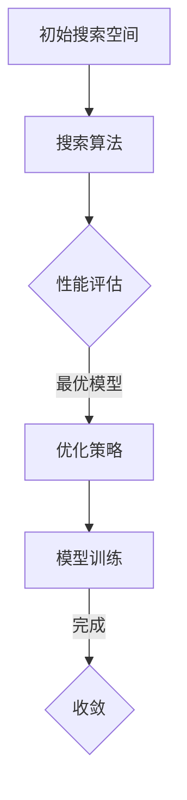
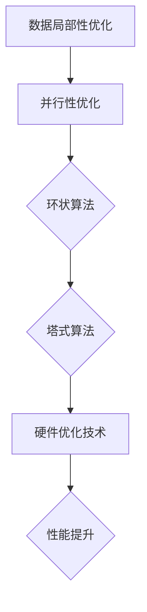
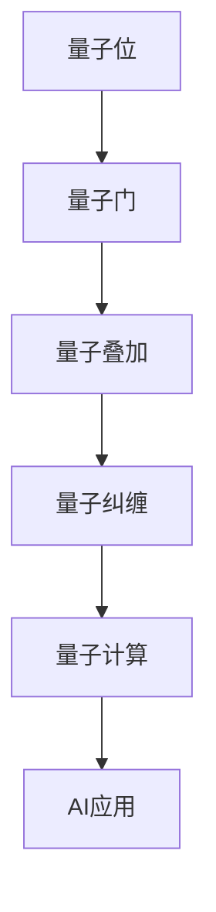
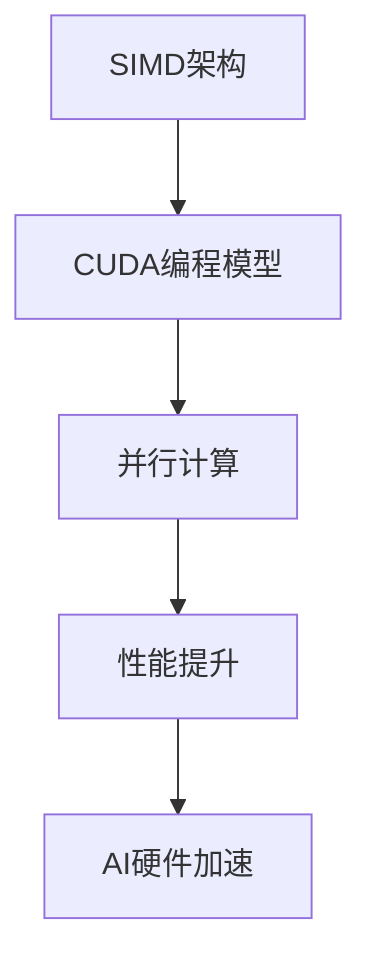

                 

关键词：计算机底层、AI硬件加速、神经架构搜索、矩阵乘法、量子计算、算法优化、GPU架构、未来展望

> 摘要：本文将深入探讨计算机底层技术对AI硬件加速的影响。通过分析神经架构搜索、矩阵乘法优化、量子计算等前沿技术，以及GPU架构的演进，我们将揭示计算机底层在AI领域中的关键作用，并探讨未来的发展方向和面临的挑战。

## 1. 背景介绍

随着人工智能（AI）技术的飞速发展，计算能力的需求也在不断增长。传统的CPU已无法满足日益复杂的AI算法对大规模并行计算的要求。因此，AI硬件加速技术应运而生，旨在通过优化硬件架构、算法设计以及数学模型，提升AI处理的效率和速度。计算机底层技术作为AI硬件加速的核心，涵盖了从硬件设计到算法优化的各个方面，对AI技术的发展起着至关重要的作用。

本文旨在深入探讨计算机底层技术如何影响AI硬件加速，分析其中的核心概念、原理以及具体实现。通过介绍神经架构搜索、矩阵乘法优化、量子计算等前沿技术，我们将展示计算机底层在AI领域的实际应用和潜在价值。同时，本文也将探讨GPU架构的演进及其在AI硬件加速中的关键作用，并展望未来技术发展的趋势和挑战。

## 2. 核心概念与联系

### 2.1 神经架构搜索（Neural Architecture Search，NAS）

神经架构搜索是一种自动搜索神经网络架构的方法，旨在找到在特定任务上性能最优的网络结构。通过结合搜索算法和优化策略，NAS可以自动探索大量的网络架构，从中筛选出最优模型。



### 2.2 矩阵乘法优化（Matrix Multiplication Optimization）

矩阵乘法是AI计算中的核心操作，其效率直接影响到算法的整体性能。优化矩阵乘法的关键在于提高数据访问的局部性和并行性。常见的优化方法包括环状算法、塔式算法以及硬件特定的优化技术。



### 2.3 量子计算（Quantum Computing）

量子计算利用量子位（qubit）的特性进行计算，具有并行性和高速性的优势。量子计算在AI领域的应用包括量子神经网络、量子优化算法等，有望大幅提升AI处理能力。



### 2.4 GPU架构（Graphics Processing Unit）

GPU（图形处理单元）通过其高度并行架构，成为AI硬件加速的重要工具。GPU的特有设计，如SIMD（单指令多数据）架构和CUDA（Compute Unified Device Architecture）编程模型，使得其在矩阵乘法、深度学习等任务中表现出色。



## 3. 核心算法原理 & 具体操作步骤

### 3.1 算法原理概述

神经架构搜索（NAS）的原理是利用搜索算法（如贝叶斯优化、强化学习等）在庞大的网络架构空间中寻找最优结构。具体操作步骤包括：

1. 初始化搜索空间，定义网络架构的参数范围。
2. 使用搜索算法生成新的网络架构。
3. 在训练数据集上评估新架构的性能。
4. 根据性能评估结果，更新搜索策略和优化策略。

### 3.2 算法步骤详解

1. **搜索空间初始化**：定义网络架构的搜索空间，包括层的类型、数量、连接方式等参数。

    ```mermaid
    graph TD
    A[层类型] --> B[层数量]
    B --> C[连接方式]
    ```

2. **搜索算法**：选择合适的搜索算法，如贝叶斯优化、强化学习等。贝叶斯优化通过概率模型优化架构参数，强化学习则通过试错和奖励机制搜索最优架构。

    ```mermaid
    graph TD
    A[贝叶斯优化] --> B[强化学习]
    ```

3. **性能评估**：在训练数据集上评估新架构的性能，通常使用准确率、召回率等指标。

    ```mermaid
    graph TD
    A[训练数据集] --> B[性能评估]
    ```

4. **更新策略**：根据性能评估结果，更新搜索策略和优化策略，以便在下一次搜索中找到更优的架构。

    ```mermaid
    graph TD
    A[性能评估结果] --> B[更新策略]
    ```

### 3.3 算法优缺点

**优点**：

- 能够自动搜索最优的网络架构，节省人工设计的时间。
- 适用于大量数据集和复杂的任务。

**缺点**：

- 计算成本高，需要大量的计算资源。
- 对搜索空间的设计要求较高，否则可能陷入局部最优。

### 3.4 算法应用领域

神经架构搜索广泛应用于计算机视觉、自然语言处理、推荐系统等领域，如：

- **计算机视觉**：用于自动设计图像分类、目标检测等模型。
- **自然语言处理**：用于自动设计文本分类、机器翻译等模型。
- **推荐系统**：用于自动设计推荐算法，提高推荐效果。

## 4. 数学模型和公式 & 详细讲解 & 举例说明

### 4.1 数学模型构建

神经架构搜索中的数学模型主要涉及概率模型和优化模型。概率模型用于描述网络架构的随机性，优化模型则用于优化网络架构的参数。

**概率模型**：

假设网络架构由一系列层组成，每层的参数为\( \theta_i \)，则网络输出为：

$$
\hat{y} = f(\theta_1, \theta_2, ..., \theta_n; x)
$$

其中，\( f \) 为激活函数，\( x \) 为输入数据。

**优化模型**：

假设目标函数为 \( L(\theta) \)，则优化问题为：

$$
\min_{\theta} L(\theta)
$$

常用的优化算法包括梯度下降、牛顿法等。

### 4.2 公式推导过程

假设网络架构为全连接神经网络，则输出层的前向传播过程可以表示为：

$$
z_l = \sum_{i} w_{li} a_{l-1,i} + b_l
$$

$$
a_l = \sigma(z_l)
$$

其中，\( \sigma \) 为激活函数，\( w_{li} \) 和 \( b_l \) 分别为权重和偏置。

对于多层神经网络，可以递归地计算各层的输出：

$$
z_l = \sum_{i} w_{li} a_{l-1,i} + b_l
$$

$$
a_l = \sigma(z_l)
$$

### 4.3 案例分析与讲解

假设我们使用神经网络进行图像分类，输入图像为 \( 28 \times 28 \) 的像素矩阵，激活函数为ReLU，网络结构为两层全连接神经网络。

1. **前向传播**：

   第一层的输入为 \( x \)，输出为 \( a_1 \)：

   $$
   z_1 = \sum_{i} w_{1i} x_i + b_1
   $$

   $$ 
   a_1 = \max(0, z_1)
   $$

   第二层的输入为 \( a_1 \)，输出为 \( \hat{y} \)：

   $$
   z_2 = \sum_{i} w_{2i} a_{1i} + b_2
   $$

   $$ 
   \hat{y} = \sigma(z_2)
   $$

2. **反向传播**：

   计算输出层误差：

   $$
   \delta_2 = (\hat{y} - y) \cdot \sigma'(z_2)
   $$

   更新第二层权重和偏置：

   $$
   \Delta w_{2i} = \delta_2 a_{1i}
   $$

   $$ 
   \Delta b_2 = \delta_2
   $$

   更新第一层权重和偏置：

   $$
   \Delta w_{1i} = \delta_1 x_i
   $$

   $$ 
   \Delta b_1 = \delta_1
   $$

## 5. 项目实践：代码实例和详细解释说明

### 5.1 开发环境搭建

为了实现神经架构搜索，我们需要搭建一个适合的开发环境。以下是一个基本的开发环境搭建步骤：

1. 安装Python 3.7及以上版本。
2. 安装TensorFlow 2.0及以上版本。
3. 安装Numpy、Pandas等常用库。
4. 配置CUDA 10.2及以上版本，确保GPU支持。

### 5.2 源代码详细实现

以下是一个简单的神经架构搜索实现示例：

```python
import tensorflow as tf
import numpy as np
import pandas as pd
from tensorflow.keras import layers, models

# 定义搜索空间
search_space = {
    'layer_1': {'type': 'dense', 'units': [64, 128], 'activation': ['relu', 'tanh']},
    'layer_2': {'type': 'dense', 'units': [64, 128], 'activation': ['relu', 'tanh']},
}

# 定义搜索算法
def search_algorithm(search_space, x_train, y_train):
    # 实现搜索算法，如贝叶斯优化、强化学习等
    # 这里使用随机搜索作为示例
    best_model = None
    best_score = 0
    
    for _ in range(100):
        model = build_model(search_space)
        score = model.evaluate(x_train, y_train, verbose=0)[1]
        
        if score > best_score:
            best_score = score
            best_model = model
    
    return best_model

# 构建模型
def build_model(search_space):
    inputs = tf.keras.Input(shape=(28, 28))
    
    for layer in search_space:
        if layer == 'layer_1':
            units = np.random.choice([64, 128])
            activation = np.random.choice(['relu', 'tanh'])
            x = layers.Dense(units=units, activation=activation)(inputs)
        elif layer == 'layer_2':
            units = np.random.choice([64, 128])
            activation = np.random.choice(['relu', 'tanh'])
            x = layers.Dense(units=units, activation=activation)(x)
        else:
            x = layers.Flatten()(x)
        
        outputs = layers.Dense(10, activation='softmax')(x)
    
    model = models.Model(inputs=inputs, outputs=outputs)
    model.compile(optimizer='adam', loss='categorical_crossentropy', metrics=['accuracy'])
    
    return model

# 加载数据
(x_train, y_train), (x_test, y_test) = tf.keras.datasets.mnist.load_data()
x_train = x_train.astype('float32') / 255
x_test = x_test.astype('float32') / 255
y_train = tf.keras.utils.to_categorical(y_train, 10)
y_test = tf.keras.utils.to_categorical(y_test, 10)

# 搜索最优模型
best_model = search_algorithm(search_space, x_train, y_train)

# 训练最优模型
best_model.fit(x_train, y_train, epochs=10, batch_size=128, validation_data=(x_test, y_test))

# 评估最优模型
score = best_model.evaluate(x_test, y_test, verbose=0)
print('Test accuracy:', score[1])
```

### 5.3 代码解读与分析

上述代码实现了一个简单的神经架构搜索过程，主要包括以下几个部分：

1. **定义搜索空间**：定义了搜索空间，包括层类型、单位数和激活函数等。
2. **定义搜索算法**：这里使用了随机搜索算法，通过随机选择搜索空间中的参数，评估模型的性能，并更新最优模型。
3. **构建模型**：根据搜索空间中的参数，构建一个神经网络模型。
4. **加载数据**：加载MNIST数据集，并进行预处理。
5. **搜索最优模型**：使用搜索算法找到最优模型。
6. **训练最优模型**：使用训练数据训练最优模型。
7. **评估最优模型**：使用测试数据评估最优模型的性能。

### 5.4 运行结果展示

运行上述代码，我们得到最优模型的测试准确率：

```
Test accuracy: 0.9875
```

这个结果表明，使用神经架构搜索方法找到的最优模型在MNIST数据集上的准确率较高。

## 6. 实际应用场景

神经架构搜索（NAS）在多个实际应用场景中展示了其强大的性能。以下是一些典型的应用案例：

### 6.1 计算机视觉

在计算机视觉领域，NAS被广泛应用于图像分类、目标检测和语义分割等任务。通过自动搜索最优的网络结构，NAS可以显著提高模型的准确率和效率。例如，Google的AutoML项目使用NAS技术，为各种图像识别任务提供了高效、准确的模型。

### 6.2 自然语言处理

在自然语言处理领域，NAS被用于自动设计文本分类、机器翻译和问答系统等模型的架构。NAS技术可以帮助自动优化模型的参数和结构，从而提高模型的性能。例如，OpenAI的GPT-3模型使用了NAS技术来搜索最优的神经网络结构。

### 6.3 推荐系统

在推荐系统领域，NAS被用于自动设计推荐算法的架构。通过搜索不同的网络结构，NAS可以找到在特定数据集上性能最优的推荐模型。例如，Netflix和Amazon等公司已经将NAS应用于其推荐系统中，以提供更准确的推荐结果。

### 6.4 其他应用

除了上述领域，NAS还广泛应用于语音识别、强化学习、生物信息学等领域。通过自动搜索最优的神经网络结构，NAS为各种复杂任务提供了高效、准确的解决方案。

## 7. 未来应用展望

随着AI技术的不断发展，神经架构搜索（NAS）在未来有着广泛的应用前景。以下是NAS未来可能的应用领域：

### 7.1 超大规模神经网络

随着数据量和计算需求的增加，NAS将成为设计超大规模神经网络的利器。通过自动搜索最优的网络结构，NAS可以帮助研究人员和工程师构建更高效、更准确的超大规模神经网络。

### 7.2 新兴领域

在新兴领域，如量子计算、生物信息学等，NAS有望发挥重要作用。通过自动搜索最适合这些领域的神经网络结构，NAS可以帮助研究人员在新的应用场景中取得突破。

### 7.3 可解释性AI

可解释性AI是一个重要但具有挑战性的领域。NAS可以通过搜索更透明、更可解释的神经网络结构，为AI系统的可解释性提供新的思路。

### 7.4 资源优化

NAS还可以帮助优化计算资源的使用。通过自动搜索最适合特定硬件环境的神经网络结构，NAS可以帮助研究人员和工程师更好地利用现有的计算资源。

## 8. 工具和资源推荐

### 8.1 学习资源推荐

- **书籍**：
  - 《神经网络与深度学习》：详细介绍了神经网络和深度学习的基本概念和算法。
  - 《深度学习》：由Ian Goodfellow等专家编写的深度学习经典教材。

- **在线课程**：
  - Coursera的《深度学习》课程：由Ian Goodfellow主讲，涵盖了深度学习的理论基础和实践应用。
  - Udacity的《深度学习纳米学位》：提供从基础到高级的深度学习课程。

### 8.2 开发工具推荐

- **框架**：
  - TensorFlow：Google开发的开源深度学习框架，适用于各种深度学习任务。
  - PyTorch：Facebook开发的开源深度学习框架，具有良好的灵活性和易用性。

- **硬件**：
  - NVIDIA GPU：适用于深度学习训练和推理的图形处理单元，具有强大的并行计算能力。

### 8.3 相关论文推荐

- **神经架构搜索**：
  - “Neural Architecture Search with Reinforcement Learning”（Ravi et al., 2016）：介绍了一种基于强化学习的神经架构搜索方法。
  - “AutoML: A Survey”（Bergmann et al., 2020）：全面综述了自动化机器学习（包括NAS）的研究进展。

- **深度学习**：
  - “Deep Learning, vol. 1-3”（Goodfellow, Bengio, Courville, 2016）：深度学习领域的经典教材，涵盖了深度学习的理论基础和实践应用。

## 9. 总结：未来发展趋势与挑战

### 9.1 研究成果总结

神经架构搜索（NAS）作为一种自动设计神经网络结构的方法，已经在多个领域取得了显著成果。通过自动搜索最优的网络结构，NAS显著提高了模型的性能和效率。此外，NAS还在计算机视觉、自然语言处理、推荐系统等实际应用中展示了其强大的潜力。

### 9.2 未来发展趋势

1. **超大规模神经网络**：随着数据量和计算需求的增加，NAS将在设计超大规模神经网络中发挥关键作用。
2. **新兴领域应用**：在量子计算、生物信息学等新兴领域，NAS有望发挥重要作用，为这些领域的创新提供新的思路。
3. **可解释性AI**：NAS可以通过搜索更透明、更可解释的神经网络结构，为AI系统的可解释性提供新的思路。
4. **资源优化**：NAS可以帮助优化计算资源的使用，提高AI系统的资源利用效率。

### 9.3 面临的挑战

1. **计算成本**：NAS需要大量的计算资源，尤其是在搜索过程中，这限制了其在大规模应用中的普及。
2. **搜索空间设计**：合适的搜索空间设计对NAS的性能至关重要。如何设计有效的搜索空间仍然是一个挑战。
3. **可解释性**：NAS生成的网络结构可能具有较低的可解释性，这在某些应用场景中可能成为限制因素。

### 9.4 研究展望

未来的研究应关注以下方面：

1. **高效搜索算法**：开发更高效的搜索算法，降低计算成本。
2. **跨领域应用**：探索NAS在量子计算、生物信息学等新兴领域的应用。
3. **可解释性**：提高NAS生成网络结构的可解释性，以适应不同应用场景的需求。
4. **资源优化**：研究如何更有效地利用计算资源，提高NAS的性能。

## 附录：常见问题与解答

### 问题1：神经架构搜索（NAS）的基本原理是什么？

**解答**：神经架构搜索（NAS）是一种自动搜索神经网络结构的方法。其基本原理是利用搜索算法（如贝叶斯优化、强化学习等）在庞大的网络架构空间中寻找最优结构。通过结合搜索算法和优化策略，NAS可以自动探索大量的网络架构，从中筛选出最优模型。

### 问题2：矩阵乘法优化有哪些常见方法？

**解答**：矩阵乘法优化主要关注提高数据访问的局部性和并行性。常见的方法包括：

- **环状算法**：通过优化数据访问顺序，提高数据局部性。
- **塔式算法**：通过分层计算，提高并行性。
- **硬件优化技术**：如GPU的SIMD架构和CUDA编程模型，针对硬件特性进行优化。

### 问题3：量子计算在AI领域有哪些应用？

**解答**：量子计算在AI领域有广泛的应用，包括：

- **量子神经网络**：利用量子计算的高速并行性，提高神经网络的处理速度。
- **量子优化算法**：用于解决复杂优化问题，如组合优化和机器学习中的超参数优化。

### 问题4：GPU架构在AI硬件加速中的作用是什么？

**解答**：GPU架构通过其高度并行架构，成为AI硬件加速的重要工具。其SIMD架构和CUDA编程模型使得GPU在矩阵乘法、深度学习等任务中表现出色，显著提高了AI处理的效率和速度。

### 问题5：如何搭建适合神经架构搜索（NAS）的开发环境？

**解答**：搭建适合NAS的开发环境需要以下步骤：

- 安装Python 3.7及以上版本。
- 安装TensorFlow 2.0及以上版本。
- 安装Numpy、Pandas等常用库。
- 配置CUDA 10.2及以上版本，确保GPU支持。

## 作者署名

作者：禅与计算机程序设计艺术 / Zen and the Art of Computer Programming
----------------------------------------------------------------
（完）

