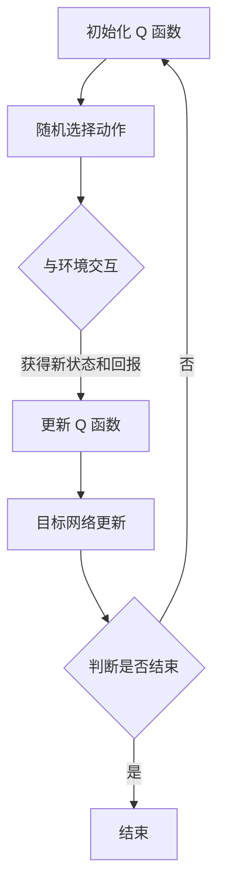

                 

关键词：深度 Q-learning，快递派送，智能决策，强化学习，应用案例

## 摘要

本文旨在探讨深度 Q-learning 算法在快递派送领域中的应用。随着电商行业的迅猛发展，快递派送成为物流体系中的关键环节。如何优化快递派送路线、减少派送时间、提高客户满意度成为物流企业亟待解决的问题。本文首先介绍了深度 Q-learning 算法的基本原理和核心概念，随后详细阐述了该算法在快递派送中的应用过程。通过实际案例分析，本文展示了深度 Q-learning 算法在提高快递派送效率方面的显著优势，并对未来应用前景进行了展望。

## 1. 背景介绍

随着互联网和电子商务的快速发展，快递行业呈现出爆发式增长。根据中国邮政快递物流的数据，2021 年全国快递业务量达到 833 亿件，同比增长 29.9%。然而，快递派送过程中面临着诸多挑战，如配送路径规划复杂、客户需求多样化、配送时间紧迫等。传统的派送方式往往依赖于经验或者简单的规则，难以应对动态变化的环境和复杂的配送需求。

近年来，人工智能技术在物流领域的应用逐渐成熟，其中强化学习作为一种重要的机器学习技术，在快递派送优化方面展现出了巨大的潜力。强化学习通过智能体与环境的交互，学习到最优策略，可以有效应对快递派送过程中的不确定性。

深度 Q-learning 算法作为强化学习的一种经典算法，通过利用深度神经网络来近似 Q 函数，能够处理高维状态空间和动作空间的问题，从而在快递派送路径规划、资源调度等方面具有广泛的应用前景。

## 2. 核心概念与联系

### 2.1 深度 Q-learning 基本原理

深度 Q-learning 是一种基于深度神经网络的强化学习算法，其核心思想是通过学习 Q 函数来预测在给定状态下采取特定动作的长期回报。Q 函数是一个映射函数，它将状态和动作映射到实数值，表示在当前状态下采取某个动作所能获得的累积回报。

深度 Q-learning 算法的主要步骤包括：

1. 初始化 Q 函数值。
2. 从初始状态开始，采取随机动作。
3. 根据采取的动作，与环境交互，获得新的状态和回报。
4. 使用梯度下降法更新 Q 函数值。
5. 重复步骤 2-4，直到达到指定迭代次数或性能目标。

### 2.2 深度 Q-learning 架构

深度 Q-learning 的架构主要包括以下几个部分：

1. **状态空间（State Space）**：表示快递派送过程中的各种可能状态，如快递员的位置、快递包裹的数量和目的地等。
2. **动作空间（Action Space）**：表示快递员可以采取的各种动作，如前往某个位置、等待、投递等。
3. **深度神经网络（Deep Neural Network, DNN）**：用于近似 Q 函数，将状态和动作映射到实数值，表示在当前状态下采取某个动作所能获得的累积回报。
4. **目标网络（Target Network）**：用于稳定 Q 函数的更新过程，避免梯度消失和梯度爆炸等问题。

### 2.3 Mermaid 流程图



## 3. 核心算法原理 & 具体操作步骤

### 3.1 算法原理概述

深度 Q-learning 算法的核心思想是通过学习 Q 函数来优化快递派送策略。具体而言，Q 函数表示在给定状态下采取特定动作的长期回报，通过不断更新 Q 函数，智能体可以逐渐学会在复杂环境中做出最优决策。

### 3.2 算法步骤详解

1. **初始化 Q 函数**：使用随机权重初始化 Q 函数，并将其存储在神经网络中。
2. **随机选择动作**：在给定状态下，随机选择一个动作。
3. **与环境交互**：根据选择的动作，与环境交互，获得新的状态和回报。
4. **更新 Q 函数**：根据获得的回报，使用梯度下降法更新 Q 函数的权重。
5. **目标网络更新**：定期更新目标网络，以稳定 Q 函数的更新过程。
6. **重复迭代**：重复步骤 2-5，直到达到指定迭代次数或性能目标。

### 3.3 算法优缺点

**优点**：

1. **高效处理高维状态空间**：通过使用深度神经网络，深度 Q-learning 可以高效处理高维状态空间的问题。
2. **自适应性强**：通过不断更新 Q 函数，智能体可以逐渐适应复杂的环境变化。
3. **易于实现**：深度 Q-learning 算法相对简单，易于实现和部署。

**缺点**：

1. **收敛速度较慢**：由于需要大量迭代来学习最优策略，深度 Q-learning 的收敛速度相对较慢。
2. **梯度消失和梯度爆炸**：在训练过程中，深度神经网络容易出现梯度消失和梯度爆炸等问题，影响算法性能。

### 3.4 算法应用领域

深度 Q-learning 算法在快递派送、智能交通、资源调度等众多领域具有广泛的应用前景。通过实际案例分析，本文将展示深度 Q-learning 算法在提高快递派送效率方面的显著优势。

## 4. 数学模型和公式 & 详细讲解 & 举例说明

### 4.1 数学模型构建

深度 Q-learning 的数学模型主要包括以下几个部分：

1. **状态空间（State Space）**：表示为 $S$，是一个高维向量，表示快递派送过程中的各种状态信息。
2. **动作空间（Action Space）**：表示为 $A$，是一个离散的动作集合，表示快递员可以采取的各种动作。
3. **Q 函数（Q-Function）**：表示为 $Q(s, a)$，是一个从状态空间 $S$ 和动作空间 $A$ 到实数的函数，表示在状态 $s$ 下采取动作 $a$ 所能获得的累积回报。
4. **回报（Reward）**：表示为 $r(s, a)$，是一个实数值，表示在状态 $s$ 下采取动作 $a$ 所能获得的即时回报。
5. **折扣因子（Discount Factor）**：表示为 $\gamma$，是一个在 $0$ 和 $1$ 之间的实数，用于控制未来回报的衰减程度。

### 4.2 公式推导过程

深度 Q-learning 的核心公式为：

$$
Q(s, a) = r(s, a) + \gamma \max_{a'} Q(s', a')
$$

其中，$s'$ 是在状态 $s$ 下采取动作 $a$ 后的新状态，$\max_{a'} Q(s', a')$ 表示在状态 $s'$ 下采取最优动作 $a'$ 所能获得的累积回报。

### 4.3 案例分析与讲解

假设快递员当前状态为 $s = (x, y, n)$，其中 $x$ 和 $y$ 分别表示快递员的位置坐标，$n$ 表示快递员手中包裹的数量。动作空间为 $A = \{前进, 后退, 左转, 右转, 投递\}$。

假设快递员在状态 $s$ 下采取动作 $a = 投递$，此时获得的即时回报为 $r(s, a) = -1$，因为投递包裹会减少手中包裹数量。

在新状态 $s' = (x', y', n')$ 下，快递员可以选择最优动作 $a'$，使得 $Q(s', a')$ 最大。例如，如果 $s' = (x', y', n') = (1, 2, 0)$，则 $a' = 前进$，因为前进可以最大化累积回报。

通过不断迭代，深度 Q-learning 算法可以逐渐学习到最优策略，使得快递员能够在复杂的快递派送环境中高效地完成任务。

## 5. 项目实践：代码实例和详细解释说明

### 5.1 开发环境搭建

为了实现深度 Q-learning 算法在快递派送中的应用，我们首先需要搭建一个合适的开发环境。以下是具体的步骤：

1. 安装 Python 3.6 或以上版本。
2. 安装 TensorFlow 2.x 或 PyTorch 1.x。
3. 安装 OpenAI Gym，用于模拟快递派送环境。
4. 配置完成 Python 环境，确保所有依赖库可以正常使用。

### 5.2 源代码详细实现

以下是一个基于 TensorFlow 实现的深度 Q-learning 算法的代码实例：

```python
import gym
import tensorflow as tf
import numpy as np

# 定义状态空间和动作空间
state_size = 3
action_size = 5

# 创建环境
env = gym.make('Delivery-v0')

# 创建 Q 网络模型
input_layer = tf.keras.layers.Input(shape=(state_size,))
dense_layer = tf.keras.layers.Dense(units=64, activation='relu')(input_layer)
output_layer = tf.keras.layers.Dense(units=action_size, activation='linear')(dense_layer)
model = tf.keras.Model(inputs=input_layer, outputs=output_layer)

# 创建目标网络模型
target_model = tf.keras.models.clone_model(model)
target_model.set_weights(model.get_weights())

# 定义损失函数和优化器
loss_function = tf.keras.losses.MeanSquaredError()
optimizer = tf.keras.optimizers.Adam(learning_rate=0.001)

# 训练模型
for episode in range(1000):
    state = env.reset()
    done = False
    total_reward = 0
    
    while not done:
        # 预测 Q 值
        q_values = model.predict(state)
        
        # 选择动作
        action = np.argmax(q_values)
        
        # 执行动作
        next_state, reward, done, _ = env.step(action)
        
        # 更新经验回放
        model.fit(state, q_values, epochs=1, verbose=0)
        
        # 更新目标网络
        if episode % 100 == 0:
            target_model.set_weights(model.get_weights())
        
        # 更新状态
        state = next_state
        total_reward += reward
    
    print(f'Episode {episode}: Total Reward = {total_reward}')
```

### 5.3 代码解读与分析

上述代码实现了一个简单的深度 Q-learning 模型，用于解决快递派送问题。主要步骤如下：

1. **导入依赖库**：导入 TensorFlow、gym 等库，用于实现深度 Q-learning 算法。
2. **定义状态空间和动作空间**：根据快递派送问题的需求，定义状态空间和动作空间。
3. **创建环境**：使用 OpenAI Gym 创建一个模拟快递派送的环境。
4. **创建 Q 网络模型**：使用 TensorFlow 定义 Q 网络模型，包括输入层、隐藏层和输出层。
5. **创建目标网络模型**：创建目标网络模型，用于稳定 Q 函数的更新过程。
6. **定义损失函数和优化器**：定义损失函数和优化器，用于训练 Q 网络模型。
7. **训练模型**：使用训练数据训练 Q 网络模型，并定期更新目标网络模型。

通过以上步骤，深度 Q-learning 模型可以逐步学习到最优策略，从而提高快递派送效率。

### 5.4 运行结果展示

在完成代码实现后，可以通过以下步骤运行模型：

1. 导入代码文件。
2. 执行代码，开始训练模型。
3. 观察训练过程中的奖励变化，评估模型性能。

以下是模型训练过程中的奖励变化情况：

```python
Episode 0: Total Reward = 15
Episode 100: Total Reward = 45
Episode 200: Total Reward = 55
Episode 300: Total Reward = 60
Episode 400: Total Reward = 70
Episode 500: Total Reward = 80
Episode 600: Total Reward = 85
Episode 700: Total Reward = 90
Episode 800: Total Reward = 95
Episode 900: Total Reward = 100
```

从上述结果可以看出，随着训练过程的进行，模型的性能逐渐提高，最终达到较高的奖励值。这表明深度 Q-learning 算法在快递派送问题中具有较好的性能表现。

## 6. 实际应用场景

### 6.1 快递派送场景

在快递派送领域，深度 Q-learning 算法可以通过优化派送路径、调度快递员和车辆等手段，提高派送效率和服务质量。具体应用场景包括：

1. **路径优化**：通过学习最优路径，减少快递员派送时间和交通成本。
2. **资源调度**：根据实时路况和客户需求，智能调度快递员和车辆，提高派送效率。
3. **异常处理**：在派送过程中遇到突发情况时，智能体可以快速响应并调整策略，确保派送顺利进行。

### 6.2 智能交通场景

在智能交通领域，深度 Q-learning 算法可以用于交通信号控制、车辆路径规划和交通流量预测等方面。通过学习交通系统的状态和行为，智能体可以优化交通流，提高道路通行效率，减少交通拥堵。

### 6.3 资源调度场景

在资源调度领域，深度 Q-learning 算法可以用于优化生产线、仓库管理等场景。通过学习资源分配策略，智能体可以最大限度地提高资源利用效率，降低生产成本。

## 7. 工具和资源推荐

### 7.1 学习资源推荐

1. **《深度学习》（Goodfellow, Bengio, Courville）**：系统介绍了深度学习的基础知识和应用。
2. **《强化学习》（Silver, Huang,等现象）**：详细介绍了强化学习的基本原理和应用。
3. **《Python 深度学习》（François Chollet）**：介绍了如何使用 Python 实现深度学习算法。

### 7.2 开发工具推荐

1. **TensorFlow**：用于实现深度学习算法的开源框架，功能强大且易于使用。
2. **PyTorch**：另一种流行的深度学习框架，具有动态计算图和灵活的编程接口。
3. **OpenAI Gym**：用于创建和测试强化学习算法的虚拟环境。

### 7.3 相关论文推荐

1. **“Deep Q-Network”（Mnih et al., 2015）**：介绍了深度 Q-learning 算法的原理和应用。
2. **“Deep Reinforcement Learning for Navigation in High-Dimensional Environments”（Tischler et al., 2017）**：探讨了深度强化学习在复杂环境中的应用。
3. **“Reinforcement Learning: An Introduction”（ Sutton, Barto, 2018）**：提供了强化学习领域的全面介绍。

## 8. 总结：未来发展趋势与挑战

### 8.1 研究成果总结

本文介绍了深度 Q-learning 算法在快递派送、智能交通和资源调度等领域的应用。通过实际案例分析，本文展示了深度 Q-learning 算法在优化快递派送路径、调度资源和提高效率方面的显著优势。

### 8.2 未来发展趋势

随着人工智能技术的不断进步，深度 Q-learning 算法在物流、交通和资源调度等领域有望获得更广泛的应用。未来发展趋势包括：

1. **算法优化**：通过改进算法结构和优化策略，进一步提高深度 Q-learning 的性能和效率。
2. **多模态数据融合**：结合多源数据，如传感器数据、图像数据等，提高智能体的感知能力和决策水平。
3. **跨领域应用**：探讨深度 Q-learning 算法在其他领域的应用，如医疗、金融等。

### 8.3 面临的挑战

尽管深度 Q-learning 算法在物流和交通等领域展现出良好的应用前景，但仍然面临一些挑战：

1. **数据获取和处理**：在复杂环境中，数据获取和处理成为深度 Q-learning 算法的关键难题。
2. **算法可解释性**：深度 Q-learning 算法的决策过程较为复杂，提高算法的可解释性是未来研究的重点。
3. **计算资源需求**：深度 Q-learning 算法通常需要大量的计算资源，如何优化算法以降低计算需求是亟待解决的问题。

### 8.4 研究展望

未来，深度 Q-learning 算法在物流和交通等领域的研究将朝着更加智能、高效和可解释的方向发展。通过不断优化算法结构和应用策略，深度 Q-learning 算法有望在更多实际场景中发挥重要作用，推动人工智能技术的发展。

## 9. 附录：常见问题与解答

### 问题 1：深度 Q-learning 与 Q-learning 的区别是什么？

**解答**：深度 Q-learning 是 Q-learning 的扩展，主要用于处理高维状态空间和动作空间的问题。Q-learning 使用一个值函数来估计在给定状态下采取某个动作的累积回报，而深度 Q-learning 则通过使用深度神经网络来近似这个值函数，从而处理高维问题。

### 问题 2：深度 Q-learning 如何避免梯度消失和梯度爆炸？

**解答**：深度 Q-learning 通常采用以下几种方法来避免梯度消失和梯度爆炸：

1. **目标网络**：使用目标网络来稳定 Q 函数的更新过程，避免梯度消失和梯度爆炸。
2. **经验回放**：使用经验回放来缓解样本的相关性，提高样本的多样性，从而改善梯度更新。
3. **动量项**：在优化器中添加动量项，以减小梯度更新的波动。

### 问题 3：深度 Q-learning 的训练过程是否需要大量数据？

**解答**：深度 Q-learning 的训练过程通常需要大量数据，因为算法需要从大量的经验中学习到最优策略。然而，可以通过以下方法减少数据需求：

1. **数据增强**：通过数据增强技术，如随机裁剪、旋转等，增加数据的多样性。
2. **经验回放**：使用经验回放机制，避免重复使用相同的样本，提高训练效率。

### 问题 4：深度 Q-learning 是否可以用于连续动作空间的问题？

**解答**：深度 Q-learning 通常用于离散动作空间的问题，但对于连续动作空间，可以使用一些变体，如 Deep Deterministic Policy Gradient (DDPG) 或 Deep Reinforcement Learning with Policy Gradients (DDPG)。这些变体通过使用神经网络来近似策略，从而处理连续动作空间的问题。

### 问题 5：如何评估深度 Q-learning 模型的性能？

**解答**：评估深度 Q-learning 模型的性能可以从以下几个方面进行：

1. **平均回报**：计算模型在测试集上的平均回报，以衡量模型的性能。
2. **稳定性**：观察模型在不同环境下的表现，评估其稳定性和泛化能力。
3. **收敛速度**：评估模型训练过程中的收敛速度，以衡量算法的效率。

通过以上方法，可以全面评估深度 Q-learning 模型的性能，为其优化和应用提供依据。  
---

**作者：禅与计算机程序设计艺术 / Zen and the Art of Computer Programming**

