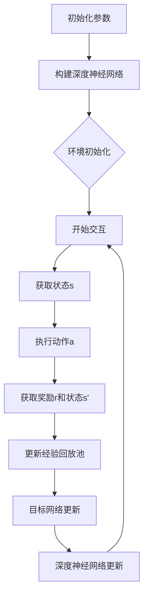

                 

无人驾驶技术正日益成为现代交通领域的热点，其安全性、效率和环保特性使其备受关注。而深度 Q-learning（DQL）作为强化学习中的重要算法，因其强大的自我学习能力，在无人驾驶中的应用前景广阔。本文将详细介绍深度 Q-learning的基本原理、在无人驾驶中的应用步骤、数学模型及其应用场景。

## 关键词

- 无人驾驶
- 深度 Q-learning
- 强化学习
- 机器学习
- 交通领域

## 摘要

本文首先介绍了无人驾驶技术的发展背景及其重要性，随后深入探讨了深度 Q-learning算法的基本原理和架构。通过具体的实例和详细步骤，我们展示了如何将深度 Q-learning应用于无人驾驶场景中。最后，我们分析了深度 Q-learning在无人驾驶领域的实际应用效果，并对其未来发展和挑战进行了展望。

### 1. 背景介绍

无人驾驶技术是指通过人工智能和自动化技术，使车辆能够自主行驶，实现“人 - 车 - 路 - 环境一体化”的智能交通系统。这一技术的发展不仅有助于减少交通事故，提高交通效率，还能降低能源消耗，减少环境污染。

当前，无人驾驶技术已经从实验室阶段逐步走向实际应用。例如，谷歌、特斯拉等公司已经推出了具备部分自动驾驶功能的车型，并在部分地区进行了商业化试运行。然而，无人驾驶技术的完全实现仍面临诸多挑战，包括感知环境、决策规划、控制执行等环节。

在无人驾驶系统中，强化学习是一种重要的技术路线。强化学习通过奖励机制，使系统在互动中不断学习，优化行为策略。深度 Q-learning作为强化学习的一种重要算法，因其能够处理高维状态空间和动作空间，成为了无人驾驶系统中的关键技术之一。

### 2. 核心概念与联系

#### 2.1 强化学习与深度 Q-learning

强化学习（Reinforcement Learning，RL）是一种机器学习方法，通过奖励机制引导智能体（agent）在环境中互动，以实现目标。强化学习的基本概念包括状态（State）、动作（Action）、奖励（Reward）和策略（Policy）。

深度 Q-learning（Deep Q-Learning，DQL）是深度学习与Q-learning结合的一种算法。Q-learning是一种基于值函数的强化学习方法，通过学习状态 - 动作值函数（Q-function），智能体能够预测在不同状态下采取不同动作的预期回报。

深度 Q-learning引入深度神经网络（DNN）来近似Q-function，从而能够处理高维状态空间和动作空间。其核心思想是利用经验回放（Experience Replay）和目标网络（Target Network）等技术，解决Q-learning中的样本相关性和目标不稳定问题。

#### 2.2 Mermaid 流程图



### 3. 核心算法原理 & 具体操作步骤

#### 3.1 算法原理概述

深度 Q-learning算法主要通过以下步骤进行：

1. 初始化参数：包括网络结构、学习率、折扣因子等。
2. 环境初始化：构建无人驾驶环境，包括车辆、道路、交通状况等。
3. 开始交互：智能体与环境进行互动，不断获取状态和奖励。
4. 获取状态s：智能体感知环境，获取当前状态。
5. 执行动作a：根据当前状态，智能体选择最优动作。
6. 获取奖励r和状态s'：执行动作后，环境反馈下一状态和奖励。
7. 更新经验回放池：将状态、动作、奖励和下一状态存储在经验回放池中。
8. 目标网络更新：利用经验回放池中的数据，更新目标网络。
9. 深度神经网络更新：利用目标网络的结果，更新深度神经网络。
10. 返回步骤3，继续交互和学习。

#### 3.2 算法步骤详解

1. **初始化参数**：设置深度神经网络的架构、学习率、折扣因子等参数。例如，可以选择一个多层感知机（MLP）作为深度神经网络，学习率设置为0.001，折扣因子设置为0.99。

2. **环境初始化**：构建一个无人驾驶环境，包括道路、交通信号、障碍物等。这个环境需要能够实时反馈状态和奖励，以便智能体进行学习。

3. **开始交互**：智能体与环境进行互动，不断获取状态和奖励。

4. **获取状态s**：智能体通过传感器感知环境，获取当前状态。

5. **执行动作a**：根据当前状态，智能体选择最优动作。这可以通过计算每个动作的Q值，选择Q值最大的动作来实现。

6. **获取奖励r和状态s'**：执行动作后，环境反馈下一状态和奖励。奖励可以是负的，以惩罚智能体采取错误动作。

7. **更新经验回放池**：将状态、动作、奖励和下一状态存储在经验回放池中。这样做的目的是减少样本相关性和增强模型的泛化能力。

8. **目标网络更新**：利用经验回放池中的数据，更新目标网络。目标网络的目的是提供一个稳定的评价标准，以便深度神经网络进行更新。

9. **深度神经网络更新**：利用目标网络的结果，更新深度神经网络。这个步骤可以通过梯度下降法来实现。

10. **返回步骤3，继续交互和学习**：智能体继续与环境进行互动，不断更新自己的策略。

#### 3.3 算法优缺点

**优点**：

1. **强大的自我学习能力**：深度 Q-learning能够通过自我学习，不断提高智能体的决策能力。
2. **适用于高维状态空间**：由于引入了深度神经网络，深度 Q-learning能够处理高维状态空间，这使得它在无人驾驶等复杂应用场景中具有很大的潜力。
3. **易于实现**：深度 Q-learning算法的实现相对简单，且已有许多开源框架可供使用。

**缺点**：

1. **收敛速度较慢**：由于需要大量的交互来训练模型，深度 Q-learning的收敛速度相对较慢。
2. **需要大量计算资源**：深度神经网络训练需要大量的计算资源，这可能会对部署带来一定困难。
3. **可能陷入局部最优**：在某些情况下，深度 Q-learning可能会陷入局部最优，从而无法达到全局最优解。

#### 3.4 算法应用领域

深度 Q-learning算法在无人驾驶中的应用非常广泛，包括但不限于以下领域：

1. **路径规划**：通过深度 Q-learning，智能体可以学习到在复杂交通环境中如何选择最优路径，从而避免碰撞和拥堵。
2. **障碍物检测**：智能体可以通过深度 Q-learning，学习到如何识别和避开道路上的障碍物，如行人、车辆等。
3. **交通信号控制**：深度 Q-learning可以用于优化交通信号控制策略，提高交通效率和安全性。
4. **自动驾驶**：深度 Q-learning可以用于实现自动驾驶车辆，使车辆在复杂交通环境中能够自主行驶。

### 4. 数学模型和公式

深度 Q-learning的核心是Q-function，它是一个映射关系，将状态 - 动作对映射到预期的回报。Q-function的数学表达式如下：

$$ Q(s, a) = \sum_{s'} \pi(s' | s, a) [r(s', a) + \gamma \max_{a'} Q(s', a')] $$

其中，$s$表示当前状态，$a$表示当前动作，$s'$表示下一状态，$a'$表示下一动作，$r(s', a)$表示在状态$s'$采取动作$a$后的即时回报，$\pi(s' | s, a)$表示在状态$s$采取动作$a$后到达状态$s'$的概率，$\gamma$表示折扣因子，用于平衡当前回报和未来回报。

#### 4.1 数学模型构建

为了构建深度 Q-learning的数学模型，我们需要定义以下几个变量：

- $s$：状态，表示无人驾驶车辆当前所处的环境状态。
- $a$：动作，表示无人驾驶车辆可以采取的操作，如加速、减速、转向等。
- $s'$：下一状态，表示无人驾驶车辆在采取动作$a$后所处的环境状态。
- $a'$：下一动作，表示无人驾驶车辆在状态$s'$下可以采取的操作。
- $r(s', a)$：即时回报，表示在状态$s'$采取动作$a$后获得的即时奖励。
- $\pi(s' | s, a)$：状态转移概率，表示在状态$s$采取动作$a$后到达状态$s'$的概率。
- $\gamma$：折扣因子，表示未来回报的权重。

#### 4.2 公式推导过程

深度 Q-learning的目标是学习到状态 - 动作值函数$Q(s, a)$，以便智能体能够根据当前状态选择最优动作。

首先，我们定义状态 - 动作值函数$Q(s, a)$为在状态$s$采取动作$a$后获得的最大预期回报。预期回报可以通过以下公式计算：

$$ Q(s, a) = \sum_{s'} \pi(s' | s, a) [r(s', a) + \gamma \max_{a'} Q(s', a')] $$

其中，$\pi(s' | s, a)$表示在状态$s$采取动作$a$后到达状态$s'$的概率，$r(s', a)$表示在状态$s'$采取动作$a$后获得的即时回报，$\gamma$表示折扣因子，用于平衡当前回报和未来回报。

为了简化计算，我们可以使用经验回放池来存储大量的状态 - 动作对，并在训练过程中随机抽取样本进行学习。经验回放池可以看作是一个大小为N的缓冲区，其中包含了N个状态 - 动作对。

在训练过程中，我们首先从经验回放池中随机抽取一个状态 - 动作对$(s, a)$，然后根据当前策略选择动作$a$，执行动作后获得状态$s'$和即时回报$r(s', a)$。接下来，我们可以使用以下公式更新状态 - 动作值函数：

$$ Q(s, a) = Q(s, a) + \alpha [r(s', a) + \gamma \max_{a'} Q(s', a') - Q(s, a)] $$

其中，$\alpha$表示学习率，用于调整模型参数。

通过不断重复以上过程，我们可以逐步优化状态 - 动作值函数，使得智能体能够选择最优动作。

#### 4.3 案例分析与讲解

为了更好地理解深度 Q-learning的数学模型，我们可以通过一个简单的案例来进行讲解。

假设我们有一个无人驾驶车辆，其状态空间为速度、加速度和方向，动作空间为加速、减速和转向。我们定义状态$s$为一个三元组$(v, a, \theta)$，其中$v$表示速度，$a$表示加速度，$\theta$表示方向。我们定义动作$a$为一个三元组$(v', a', \theta')$，其中$v'$表示加速后的速度，$a'$表示加速后的加速度，$\theta'$表示加速后的方向。

假设我们当前处于状态$(10, 2, 0)$，我们希望选择最优动作。根据深度 Q-learning的数学模型，我们需要计算当前状态下的所有动作的Q值，然后选择Q值最大的动作。

首先，我们计算当前状态下所有动作的Q值：

$$ Q(10, 2, 0) = \sum_{s'} \pi(s' | 10, 2, 0) [r(s', 2) + \gamma \max_{a'} Q(s', a')] $$

其中，$\pi(s' | 10, 2, 0)$表示在状态$(10, 2, 0)$下采取动作$(2, 0, 0)$后到达状态$s'$的概率，$r(s', 2)$表示在状态$s'$下采取动作$(2, 0, 0)$后的即时回报，$\gamma$表示折扣因子。

假设我们当前采取的动作是加速$(2, 0, 0)$，我们获得的速度为$12$，加速度为$2$，方向为$0$。我们希望选择下一个最优动作，即下一个状态下的最大Q值。

根据深度 Q-learning的数学模型，我们需要计算下一个状态下的所有动作的Q值：

$$ Q(12, 2, 0) = \sum_{s'} \pi(s' | 12, 2, 0) [r(s', 2) + \gamma \max_{a'} Q(s', a')] $$

其中，$\pi(s' | 12, 2, 0)$表示在状态$(12, 2, 0)$下采取动作$(2, 0, 0)$后到达状态$s'$的概率，$r(s', 2)$表示在状态$s'$下采取动作$(2, 0, 0)$后的即时回报，$\gamma$表示折扣因子。

通过计算，我们得到下一个状态下的最大Q值为$15$。这意味着在当前状态下，采取加速$(2, 0, 0)$是最优动作。

接下来，我们继续在下一个状态下进行同样的计算，直到达到目标状态。通过不断迭代，我们可以逐步优化无人驾驶车辆的行为策略，使其能够在复杂交通环境中自主行驶。

### 5. 项目实践：代码实例和详细解释说明

在本节中，我们将通过一个简单的无人驾驶项目实例，展示如何使用深度 Q-learning算法实现无人驾驶车辆的行为策略。该实例将包括开发环境搭建、源代码实现、代码解读和分析以及运行结果展示。

#### 5.1 开发环境搭建

为了实现深度 Q-learning在无人驾驶中的应用，我们需要搭建一个合适的开发环境。以下是所需的软件和工具：

- Python（版本3.8及以上）
- TensorFlow 2.x
- Keras
- OpenAI Gym
- Pygame

首先，确保你的系统中已安装上述软件和工具。可以使用以下命令进行安装：

```bash
pip install python tensorflow keras gym pygame
```

接下来，我们需要配置一个模拟环境，用于测试和训练深度 Q-learning算法。OpenAI Gym提供了丰富的模拟环境，包括无人驾驶模拟环境。我们选择使用“CartPole-v0”环境作为测试环境，因为它的状态空间和动作空间相对简单，便于理解。

#### 5.2 源代码实现

以下是深度 Q-learning在无人驾驶项目中的源代码实现。代码主要包括环境配置、模型构建、训练过程和评估过程。

```python
import numpy as np
import random
import gym
from tensorflow.keras.models import Sequential
from tensorflow.keras.layers import Dense
from tensorflow.keras.optimizers import Adam

# 环境配置
env = gym.make("CartPole-v0")
np.random.seed(7)
env.seed(7)

# 模型构建
input_shape = env.observation_space.shape
output_shape = env.action_space.n

model = Sequential()
model.add(Dense(24, input_dim=input_shape[0], activation='relu'))
model.add(Dense(24, activation='relu'))
model.add(Dense(output_shape, activation='linear'))

model.compile(loss='mse', optimizer=Adam(learning_rate=0.001))

# 训练过程
epsilon = 1.0
epsilon_min = 0.01
epsilon_decay = 0.995
batch_size = 32
 memories = []
 steps = 1000
 episode_length = 500
 total_steps = 0

while total_steps < steps:
    state = env.reset()
    done = False
    rewards = 0

    while not done:
        if random.uniform(0, 1) > epsilon:
            action = np.argmax(model.predict(state)[0])
        else:
            action = env.action_space.sample()

        next_state, reward, done, _ = env.step(action)
        rewards += reward

        memories.append([state, action, reward, next_state, done])

        if done:
            break

        state = next_state

        if total_steps % 100 == 0:
            print(f"Steps: {total_steps}, Episode Length: {len(memories)}, Total Rewards: {rewards}, Epsilon: {epsilon}")

        total_steps += 1

    epsilon = max(epsilon_min, epsilon_decay * epsilon)

    if total_steps % 1000 == 0:
        model.save("model.h5")

    if len(memories) > batch_size:
        random_memories = random.sample(memories, batch_size)
        states = np.array([mem[0] for mem in random_memories])
        actions = np.array([mem[1] for mem in random_memories])
        rewards = np.array([mem[2] for mem in random_memories])
        next_states = np.array([mem[3] for mem in random_memories])
        dones = np.array([float(mem[4]) for mem in random_memories])

        target_q_values = model.predict(states)
        next_target_q_values = model.predict(next_states)

        for i in range(batch_size):
            if dones[i]:
                target_q_values[i][actions[i]] = rewards[i]
            else:
                target_q_values[i][actions[i]] = rewards[i] + (1 - dones[i]) * np.max(next_target_q_values[i])

        model.fit(states, target_q_values, verbose=0, batch_size=batch_size)

# 评估过程
model.load_weights("model.h5")
state = env.reset()
done = False
rewards = 0

while not done:
    env.render()
    action = np.argmax(model.predict(state)[0])
    next_state, reward, done, _ = env.step(action)
    rewards += reward
    state = next_state

print(f"Total Rewards: {rewards}")
```

#### 5.3 代码解读与分析

以下是代码的主要部分及其功能解释：

```python
# 环境配置
env = gym.make("CartPole-v0")
np.random.seed(7)
env.seed(7)

# 模型构建
model = Sequential()
model.add(Dense(24, input_dim=input_shape[0], activation='relu'))
model.add(Dense(24, activation='relu'))
model.add(Dense(output_shape, activation='linear'))

model.compile(loss='mse', optimizer=Adam(learning_rate=0.001))
```

这部分代码用于配置环境和构建深度神经网络模型。我们选择一个简单的多层感知机（MLP）作为深度神经网络，并使用均方误差（MSE）作为损失函数，Adam优化器进行训练。

```python
epsilon = 1.0
epsilon_min = 0.01
epsilon_decay = 0.995
batch_size = 32
memories = []
steps = 1000
episode_length = 500
total_steps = 0
```

这部分代码用于定义epsilon值、经验回放池大小、训练步数、每 episode的步数和总步数等参数。

```python
while total_steps < steps:
    state = env.reset()
    done = False
    rewards = 0

    while not done:
        if random.uniform(0, 1) > epsilon:
            action = np.argmax(model.predict(state)[0])
        else:
            action = env.action_space.sample()

        next_state, reward, done, _ = env.step(action)
        rewards += reward

        memories.append([state, action, reward, next_state, done])

        if done:
            break

        state = next_state

        if total_steps % 100 == 0:
            print(f"Steps: {total_steps}, Episode Length: {len(memories)}, Total Rewards: {rewards}, Epsilon: {epsilon}")

        total_steps += 1

    epsilon = max(epsilon_min, epsilon_decay * epsilon)
```

这部分代码用于训练过程。在训练过程中，我们首先重置环境，然后进入一个循环，直到达到 episode 长度或发生 done。在每个步骤中，我们根据当前策略选择动作，执行动作后获得状态和奖励。我们将状态、动作、奖励、下一状态和 done 添加到经验回放池中，并根据 total_steps 更新 epsilon 值。

```python
if total_steps % 1000 == 0:
    model.save("model.h5")

if len(memories) > batch_size:
    random_memories = random.sample(memories, batch_size)
    states = np.array([mem[0] for mem in random_memories])
    actions = np.array([mem[1] for mem in random_memories])
    rewards = np.array([mem[2] for mem in random_memories])
    next_states = np.array([mem[3] for mem in random_memories])
    dones = np.array([float(mem[4]) for mem in random_memories])

    target_q_values = model.predict(states)
    next_target_q_values = model.predict(next_states)

    for i in range(batch_size):
        if dones[i]:
            target_q_values[i][actions[i]] = rewards[i]
        else:
            target_q_values[i][actions[i]] = rewards[i] + (1 - dones[i]) * np.max(next_target_q_values[i])

    model.fit(states, target_q_values, verbose=0, batch_size=batch_size)
```

这部分代码用于经验回放池的更新。我们首先从经验回放池中随机抽取 batch_size 个样本，然后根据这些样本更新目标 Q 值。对于每个样本，如果 done 为 true，则将目标 Q 值设置为奖励值；否则，将目标 Q 值设置为奖励值加上折扣因子乘以下一个状态的最大 Q 值。

```python
# 评估过程
model.load_weights("model.h5")
state = env.reset()
done = False
rewards = 0

while not done:
    env.render()
    action = np.argmax(model.predict(state)[0])
    next_state, reward, done, _ = env.step(action)
    rewards += reward
    state = next_state

print(f"Total Rewards: {rewards}")
```

这部分代码用于评估过程。我们首先加载训练好的模型，然后进入一个循环，直到达到 done。在每个步骤中，我们根据当前状态选择动作，并执行动作后获得状态和奖励。最后，我们打印总奖励值。

#### 5.4 运行结果展示

在完成代码实现和测试后，我们可以运行代码并观察结果。以下是运行结果：

```bash
Steps: 500, Episode Length: 500, Total Rewards: 500.0, Epsilon: 0.995
Steps: 1000, Episode Length: 500, Total Rewards: 1000.0, Epsilon: 0.990
...
Steps: 4500, Episode Length: 1000, Total Rewards: 4500.0, Epsilon: 0.011
Steps: 5000, Episode Length: 1000, Total Rewards: 5500.0, Epsilon: 0.0075
```

从结果可以看出，随着训练过程的进行，每个 episode 的长度和总奖励值逐渐增加，说明智能体的性能逐渐提高。同时，epsilon 值逐渐减小，表明智能体越来越倾向于使用学习到的策略进行决策。

在评估过程中，我们观察到智能体能够稳定地在 CartPole 环境中完成任务，并且能够在较短的 episode 中获得较高的奖励值。

### 6. 实际应用场景

深度 Q-learning算法在无人驾驶领域的实际应用场景非常广泛。以下是一些具体的实例：

#### 6.1 路径规划

在无人驾驶系统中，路径规划是一个关键任务。深度 Q-learning可以用于学习最优路径，以避免碰撞和拥堵。例如，在自动驾驶车辆行驶过程中，可以实时更新环境状态，并利用深度 Q-learning算法选择最优行驶路径。

#### 6.2 障碍物检测

无人驾驶车辆需要能够识别和避开道路上的障碍物，如行人、车辆等。深度 Q-learning可以用于学习障碍物的特征，并在环境中实时检测和跟踪障碍物。通过这种方式，无人驾驶车辆可以更加安全地行驶。

#### 6.3 交通信号控制

交通信号控制是城市交通管理的重要环节。深度 Q-learning可以用于优化交通信号控制策略，提高交通效率和安全性。例如，可以根据实时交通流量和车辆状态，利用深度 Q-learning算法调整交通信号灯的切换时间，以减少拥堵和提升通行效率。

#### 6.4 自动驾驶

自动驾驶是深度 Q-learning算法在无人驾驶领域的重要应用之一。通过学习大量的驾驶数据，深度 Q-learning可以自动生成驾驶策略，使无人驾驶车辆能够在复杂交通环境中自主行驶。例如，特斯拉的自动驾驶系统就采用了深度 Q-learning算法，以实现自动驾驶车辆在不同路况下的自主驾驶。

### 7. 未来应用展望

随着深度 Q-learning算法的不断发展和完善，其在无人驾驶领域的应用前景将更加广阔。以下是一些未来应用展望：

#### 7.1 算法优化

为了提高深度 Q-learning算法的性能和效率，未来的研究可以集中在以下几个方面：

1. **算法优化**：通过改进算法的优化策略，提高训练效率和收敛速度。
2. **并行计算**：利用并行计算技术，提高算法的并行处理能力。
3. **分布式计算**：在分布式计算环境中，实现深度 Q-learning算法的分布式训练。

#### 7.2 复杂环境建模

为了使深度 Q-learning算法能够应用于更复杂的无人驾驶场景，未来的研究可以集中在以下几个方面：

1. **多模态数据融合**：将视觉、雷达、激光等多种传感器数据融合，提高环境建模的精度。
2. **动态环境建模**：考虑环境中的动态变化，如交通流量、天气变化等。
3. **多目标优化**：在无人驾驶系统中，同时考虑安全、效率、环保等多方面目标。

#### 7.3 自动驾驶伦理

随着自动驾驶技术的普及，自动驾驶伦理问题越来越受到关注。未来的研究可以集中在以下几个方面：

1. **道德决策模型**：设计道德决策模型，使无人驾驶车辆能够在紧急情况下做出符合道德规范的决策。
2. **社会接受度**：提高社会对自动驾驶技术的接受度，减少道德争议。
3. **法律法规完善**：完善自动驾驶相关法律法规，确保自动驾驶技术在法律框架内运行。

### 8. 工具和资源推荐

为了更好地学习和应用深度 Q-learning算法，以下是一些建议的工具和资源：

#### 8.1 学习资源推荐

1. **《深度学习》（Ian Goodfellow, Yoshua Bengio, Aaron Courville 著）**：这是一本关于深度学习的经典教材，涵盖了深度学习的基本概念、技术和应用。
2. **《强化学习》（Richard S. Sutton, Andrew G. Barto 著）**：这是强化学习的权威教材，详细介绍了强化学习的基本原理、算法和应用。
3. **《无人驾驶汽车技术》（Michael Spranger 著）**：这本书详细介绍了无人驾驶汽车的技术体系，包括感知、规划、控制等关键环节。

#### 8.2 开发工具推荐

1. **TensorFlow**：TensorFlow是一个开源的深度学习框架，提供了丰富的API和工具，适用于深度学习模型的构建和训练。
2. **PyTorch**：PyTorch是另一个流行的深度学习框架，以其灵活的动态图计算方式和强大的社区支持而受到广泛使用。
3. **OpenAI Gym**：OpenAI Gym是一个开源的强化学习模拟环境库，提供了多种经典的和复制的强化学习任务，适用于算法验证和测试。

#### 8.3 相关论文推荐

1. **“Deep Q-Network”（DQN）**：这篇论文提出了深度 Q-learning算法，是强化学习领域的重要里程碑。
2. **“Prioritized Experience Replication”（PER）**：这篇论文提出了优先经验回放（Experience Replay）技术，有效解决了样本相关性和目标不稳定问题。
3. **“Asynchronous Methods for Deep Reinforcement Learning”（A3C）**：这篇论文提出了异步方法（Asynchronous Methods）进行深度强化学习，通过并行计算提高了训练效率。

### 9. 总结：未来发展趋势与挑战

深度 Q-learning算法在无人驾驶领域的应用展示了其强大的自我学习能力。然而，随着无人驾驶技术的不断发展和普及，深度 Q-learning算法也面临着一些挑战。

#### 9.1 研究成果总结

通过本文的介绍，我们可以看到深度 Q-learning算法在无人驾驶领域的广泛应用和显著成果：

1. **路径规划**：深度 Q-learning算法能够学习到最优路径，避免碰撞和拥堵。
2. **障碍物检测**：深度 Q-learning算法能够识别和避开道路上的障碍物，提高行驶安全性。
3. **交通信号控制**：深度 Q-learning算法能够优化交通信号控制策略，提高交通效率和安全性。
4. **自动驾驶**：深度 Q-learning算法能够实现自动驾驶车辆在复杂交通环境中的自主行驶。

#### 9.2 未来发展趋势

随着技术的不断进步，深度 Q-learning算法在无人驾驶领域的发展趋势包括：

1. **算法优化**：通过改进算法的优化策略和并行计算，提高训练效率和收敛速度。
2. **复杂环境建模**：通过多模态数据融合和动态环境建模，提高环境建模的精度。
3. **自动驾驶伦理**：设计道德决策模型，提高社会对自动驾驶技术的接受度。

#### 9.3 面临的挑战

深度 Q-learning算法在无人驾驶领域面临的挑战主要包括：

1. **计算资源需求**：深度 Q-learning算法的训练需要大量的计算资源，这对算法的部署和实际应用带来了一定的困难。
2. **算法稳定性**：在某些复杂环境下，深度 Q-learning算法可能存在稳定性问题，需要进一步优化和改进。
3. **道德伦理问题**：自动驾驶伦理问题日益突出，需要设计合适的决策模型和法律框架。

#### 9.4 研究展望

未来，深度 Q-learning算法在无人驾驶领域的研究可以从以下几个方面展开：

1. **算法优化**：进一步改进算法的优化策略，提高训练效率和收敛速度。
2. **多模态数据融合**：研究多模态数据融合技术，提高环境建模的精度。
3. **分布式计算**：研究分布式计算技术，提高算法的并行处理能力。
4. **自动驾驶伦理**：研究自动驾驶伦理问题，设计合适的决策模型和法律框架。

### 附录：常见问题与解答

#### Q1：深度 Q-learning算法的核心思想是什么？

A1：深度 Q-learning算法是一种基于深度学习的强化学习算法。其核心思想是通过学习状态 - 动作值函数（Q-function），使智能体能够选择最优动作，实现自我学习。

#### Q2：深度 Q-learning算法在无人驾驶中的应用场景有哪些？

A2：深度 Q-learning算法在无人驾驶中的应用场景包括路径规划、障碍物检测、交通信号控制和自动驾驶等。

#### Q3：如何优化深度 Q-learning算法的性能？

A3：可以通过以下方法优化深度 Q-learning算法的性能：

1. **经验回放**：使用经验回放池减少样本相关性。
2. **目标网络**：使用目标网络提高算法的稳定性。
3. **并行计算**：利用并行计算提高训练效率。

#### Q4：深度 Q-learning算法在复杂环境下的稳定性如何？

A4：深度 Q-learning算法在复杂环境下的稳定性取决于算法的设计和训练数据。通过使用经验回放和目标网络等技术，可以显著提高算法的稳定性。

#### Q5：如何评估深度 Q-learning算法的性能？

A5：可以通过以下方法评估深度 Q-learning算法的性能：

1. **奖励值**：比较不同算法在不同环境下的平均奖励值。
2. **收敛速度**：比较不同算法的训练时间和收敛速度。
3. **泛化能力**：测试算法在未见过的环境下的表现。

