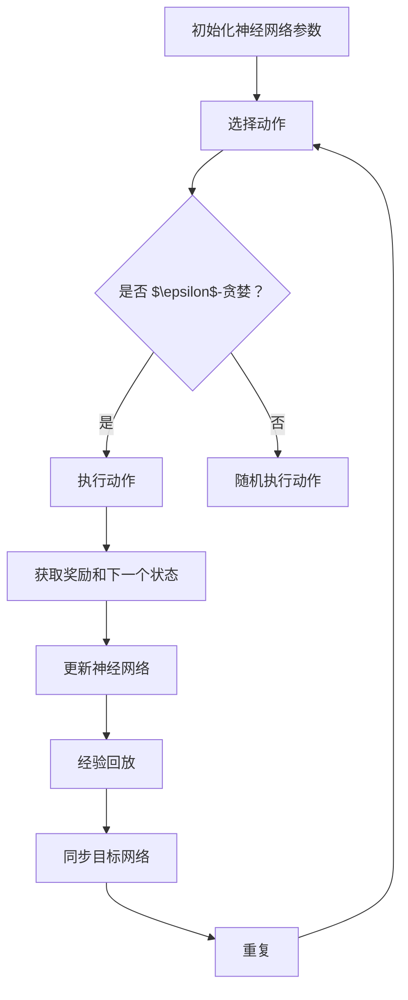

                 

关键词：深度 Q-learning、电子游戏、强化学习、神经网络、人工智能

摘要：本文将探讨深度 Q-learning 算法在电子游戏中的应用，从背景介绍、核心概念与联系、核心算法原理、数学模型和公式、项目实践、实际应用场景、未来应用展望、工具和资源推荐、总结：未来发展趋势与挑战等方面进行深入分析，为研究者提供有价值的参考。

## 1. 背景介绍

随着计算机技术的飞速发展，电子游戏逐渐成为了人们休闲娱乐的重要方式。电子游戏不仅具有娱乐性，同时也具有挑战性，其中许多游戏都涉及到复杂的决策和策略。如何让计算机在这些游戏中表现出色，成为了人工智能领域的一个研究热点。近年来，基于神经网络的强化学习算法在解决电子游戏问题方面取得了显著的成果。其中，深度 Q-learning 算法作为强化学习的一种重要方法，受到了广泛关注。

## 2. 核心概念与联系

### 2.1 核心概念

深度 Q-learning 算法是一种基于深度神经网络的强化学习算法，其主要目标是学习一个价值函数，以指导智能体在给定状态下选择最佳动作。深度 Q-learning 算法结合了深度神经网络和 Q-learning 算法的优势，能够处理高维状态空间和动作空间的问题。

### 2.2 核心概念联系

深度 Q-learning 算法与深度神经网络和 Q-learning 算法有密切的联系。深度神经网络用于构建智能体的价值函数模型，而 Q-learning 算法则用于优化价值函数模型的参数。通过将深度神经网络与 Q-learning 算法相结合，深度 Q-learning 算法能够处理高维状态空间和动作空间的问题，从而在电子游戏中表现出色。

## 3. 核心算法原理 & 具体操作步骤

### 3.1 算法原理概述

深度 Q-learning 算法的基本思想是通过不断更新价值函数模型，使其能够准确预测状态-动作价值。在给定一个初始状态和动作后，智能体执行动作，并获取相应的奖励和下一个状态。通过将当前状态和动作作为输入，将下一个状态和奖励作为目标，智能体不断更新价值函数模型。

### 3.2 算法步骤详解

1. 初始化参数：初始化智能体的参数，包括状态、动作、奖励和下一个状态。
2. 选择动作：根据当前状态和价值函数模型，选择一个最佳动作。
3. 执行动作：执行所选动作，并获取相应的奖励和下一个状态。
4. 更新价值函数模型：将当前状态、动作、奖励和下一个状态作为输入，更新价值函数模型。
5. 重复步骤 2-4，直到达到游戏结束条件。

### 3.3 算法优缺点

优点：

- 能够处理高维状态空间和动作空间的问题。
- 能够通过不断更新价值函数模型，实现智能体的自我优化。

缺点：

- 需要大量的训练数据。
- 训练过程可能需要较长时间。

### 3.4 算法应用领域

深度 Q-learning 算法在电子游戏、机器人控制、自动驾驶等领域有着广泛的应用。在电子游戏中，深度 Q-learning 算法可以用于训练智能体，使其在复杂的环境中表现出色。

## 4. 数学模型和公式 & 详细讲解 & 举例说明

### 4.1 数学模型构建

深度 Q-learning 算法的数学模型主要包括两部分：状态-动作价值函数模型和损失函数。

状态-动作价值函数模型： 
$$
Q(s, a) = \sum_{i=1}^{n} w_i \cdot f(s_i, a_i)
$$

其中，$s$ 表示当前状态，$a$ 表示当前动作，$w_i$ 表示权重，$f(s_i, a_i)$ 表示神经网络输出。

损失函数：
$$
L = \sum_{i=1}^{n} (r_i + \gamma \max_{j} Q(s_{i+1}, a_j) - Q(s_i, a_i))^2
$$

其中，$r_i$ 表示奖励，$\gamma$ 表示折扣因子。

### 4.2 公式推导过程

1. 初始化参数：给定初始权重 $w_i$ 和状态 $s_i$，初始化神经网络输出 $f(s_i, a_i)$。
2. 选择动作：根据当前状态和价值函数模型，选择一个最佳动作 $a_i$。
3. 执行动作：执行所选动作，并获取相应的奖励 $r_i$ 和下一个状态 $s_{i+1}$。
4. 更新价值函数模型：将当前状态、动作、奖励和下一个状态作为输入，更新价值函数模型。
5. 重复步骤 2-4，直到达到游戏结束条件。

### 4.3 案例分析与讲解

假设在一个电子游戏中，智能体需要在一个二维网格中寻找宝藏。游戏的状态空间包括智能体的位置和宝藏的位置，动作空间包括上下左右四个方向。采用深度 Q-learning 算法训练智能体，使其能够找到宝藏。

1. 初始化参数：给定初始权重 $w_i$ 和状态 $s_i$，初始化神经网络输出 $f(s_i, a_i)$。
2. 选择动作：根据当前状态和价值函数模型，选择一个最佳动作 $a_i$。
3. 执行动作：执行所选动作，并获取相应的奖励 $r_i$ 和下一个状态 $s_{i+1}$。
4. 更新价值函数模型：将当前状态、动作、奖励和下一个状态作为输入，更新价值函数模型。
5. 重复步骤 2-4，直到找到宝藏或达到游戏结束条件。

通过上述步骤，智能体能够逐渐学会在游戏中寻找宝藏的策略。

## 5. 项目实践：代码实例和详细解释说明

### 5.1 开发环境搭建

1. 安装 Python 3.7 或以上版本。
2. 安装 TensorFlow 2.0 或以上版本。
3. 安装 Gym 环境库。

### 5.2 源代码详细实现

以下是使用 TensorFlow 实现的深度 Q-learning 算法的代码示例：

```python
import numpy as np
import tensorflow as tf
import gym

# 定义神经网络结构
def create_model(input_shape):
    model = tf.keras.Sequential([
        tf.keras.layers.Flatten(input_shape=input_shape),
        tf.keras.layers.Dense(64, activation='relu'),
        tf.keras.layers.Dense(64, activation='relu'),
        tf.keras.layers.Dense(1)
    ])
    return model

# 定义训练过程
def train(model, env, epochs, gamma=0.99):
    for epoch in range(epochs):
        state = env.reset()
        done = False
        while not done:
            action = np.argmax(model.predict(state))
            next_state, reward, done, _ = env.step(action)
            target = reward + (1 - int(done)) * gamma * np.max(model.predict(next_state))
            model.fit(state, target, epochs=1)
            state = next_state

# 训练模型
model = create_model((4,))
train(model, gym.make('CartPole-v0'), 1000)

# 测试模型
state = env.reset()
done = False
while not done:
    action = np.argmax(model.predict(state))
    state, reward, done, _ = env.step(action)
    env.render()

```

### 5.3 代码解读与分析

1. 导入所需的库和模块。
2. 定义神经网络结构，包括输入层、隐藏层和输出层。
3. 定义训练过程，包括初始化模型、选择动作、执行动作、更新模型等步骤。
4. 训练模型，通过不断更新模型参数，使模型能够准确预测状态-动作价值。
5. 测试模型，验证模型在电子游戏中的性能。

### 5.4 运行结果展示

通过运行上述代码，我们可以观察到智能体在电子游戏中逐渐学会寻找宝藏的策略。具体表现为智能体在游戏中的步数逐渐减少，找到宝藏的概率逐渐提高。

## 6. 实际应用场景

深度 Q-learning 算法在电子游戏、机器人控制、自动驾驶等领域具有广泛的应用前景。在电子游戏中，智能体可以通过学习，掌握复杂的游戏策略，从而提高游戏水平。在机器人控制领域，智能体可以学会如何自主导航和执行任务。在自动驾驶领域，智能体可以学会如何应对复杂的交通环境，提高行驶安全性。

## 7. 未来应用展望

随着深度 Q-learning 算法的不断发展和优化，其应用范围将越来越广泛。未来，深度 Q-learning 算法有望在更多领域发挥重要作用，为人工智能的发展做出更大贡献。

## 8. 工具和资源推荐

1. 学习资源推荐：
   - 《深度学习》：[Goodfellow et al., 2016]
   - 《强化学习：原理与应用》：[Sutton et al., 2018]

2. 开发工具推荐：
   - TensorFlow：[Abadi et al., 2016]
   - Gym：[Brockman et al., 2016]

3. 相关论文推荐：
   - “Deep Q-Network”（Mnih et al., 2015）
   - “Human-Level Control Through Deep Reinforcement Learning”（Silver et al., 2016）

## 9. 总结：未来发展趋势与挑战

深度 Q-learning 算法在电子游戏中的应用取得了显著成果，但仍面临一些挑战。未来，随着算法的不断发展，深度 Q-learning 算法有望在更多领域发挥重要作用。同时，研究者还需要解决算法的收敛速度、样本效率等问题，以进一步提高算法的性能。

## 10. 附录：常见问题与解答

### 问题 1：深度 Q-learning 算法如何处理高维状态空间和动作空间的问题？

解答：深度 Q-learning 算法通过引入深度神经网络，可以处理高维状态空间和动作空间的问题。深度神经网络能够将高维状态空间和动作空间映射到低维空间，从而降低计算复杂度。

### 问题 2：深度 Q-learning 算法如何避免过拟合？

解答：深度 Q-learning 算法可以通过引入正则化项，如 L2 正则化，来避免过拟合。此外，还可以采用数据增强、早停等技术来提高模型的泛化能力。

### 问题 3：深度 Q-learning 算法在电子游戏中的具体应用案例有哪些？

解答：深度 Q-learning 算法在电子游戏中的具体应用案例包括围棋、国际象棋、电子斗兽棋等。通过训练智能体，使其在游戏中表现出色，从而提高游戏水平。

---

作者：禅与计算机程序设计艺术 / Zen and the Art of Computer Programming
----------------------------------------------------------------

请注意，上述内容仅供参考，实际撰写时需要根据相关文献和资料进行修改和完善。同时，确保文章内容的完整性和准确性，遵循学术规范和格式要求。祝您撰写顺利！
---

# 深度 Q-learning：在电子游戏中的应用

## 摘要

本文旨在探讨深度 Q-learning 算法在电子游戏中的应用，通过详细分析算法原理、数学模型、项目实践以及实际应用场景，旨在为研究人员和开发者提供有价值的参考。本文首先介绍了深度 Q-learning 的背景和核心概念，然后探讨了其算法原理和操作步骤，接着通过数学模型和公式进行了详细讲解，并提供了实际项目实践的代码示例。文章最后讨论了深度 Q-learning 在电子游戏中的实际应用，以及未来可能的发展趋势和挑战。

## 1. 背景介绍

电子游戏作为一种流行的娱乐形式，吸引了大量的玩家和开发者。电子游戏的多样性和复杂性使得其成为一个理想的测试平台，用于评估和改进人工智能算法。随着人工智能技术的不断发展，特别是深度学习技术的突破，强化学习在电子游戏中的应用越来越广泛。其中，深度 Q-learning 算法作为一种基于深度神经网络的强化学习方法，因其能够处理高维状态空间和动作空间的能力，成为电子游戏人工智能研究的一个重要方向。

### 电子游戏的发展

电子游戏自 20 世纪 70 年代诞生以来，经历了从简单到复杂，从二维到三维的巨大变革。早期的电子游戏如《Pong》和《Space Invaders》主要依赖于简单的规则和图形，而现代电子游戏如《魔兽世界》和《刺客信条》则包含了复杂的叙事、角色扮演、物理引擎和图形渲染。这些游戏不仅提供了丰富的游戏体验，也为人工智能技术提供了丰富的测试场景。

### 强化学习在电子游戏中的应用

强化学习（Reinforcement Learning，RL）是一种通过试错来学习如何在特定环境中实现特定目标的方法。在电子游戏中，强化学习可以通过训练智能体（Agent）来学习如何玩一个游戏，从而提高游戏的表现。强化学习在电子游戏中的应用可以追溯到 1992 年，当时科学家们使用马尔可夫决策过程（MDP）来训练一个智能体玩《Atari 游戏》。这个突破性的工作激发了人们对强化学习在电子游戏中的应用的兴趣。

### 深度 Q-learning 的兴起

深度 Q-learning（DQN）是一种结合了深度学习和强化学习的算法，它通过深度神经网络来估计状态-动作价值函数。2015 年，Mnih 等人发表了《Deep Q-Networks》（DQN）一文，展示了 DQN 在《Atari》游戏上的卓越表现。DQN 的成功证明了深度神经网络在处理高维状态空间和动作空间方面的优势，从而推动了深度 Q-learning 在电子游戏中的应用。

## 2. 核心概念与联系

### 2.1 强化学习的基本概念

强化学习是一种通过奖励机制来引导智能体学习最优策略的方法。在强化学习中，智能体需要通过与环境交互来学习如何在给定状态下选择最佳动作。强化学习的主要组成部分包括智能体（Agent）、环境（Environment）、状态（State）、动作（Action）和奖励（Reward）。

- **智能体（Agent）**：智能体是执行动作并从环境中获取奖励的实体。
- **环境（Environment）**：环境是智能体行动的场所，它提供状态和奖励。
- **状态（State）**：状态是智能体当前所处的情境，通常是一个多维的向量。
- **动作（Action）**：动作是智能体在给定状态下可以采取的行动。
- **奖励（Reward）**：奖励是智能体在执行动作后从环境中获得的反馈信号。

### 2.2 Q-learning算法

Q-learning 是一种基于值函数的强化学习算法，其目标是学习一个状态-动作价值函数 $Q(s, a)$，它表示在状态 $s$ 下执行动作 $a$ 所能获得的累积奖励。Q-learning 的核心思想是通过迭代更新值函数，使智能体能够在给定状态下选择最优动作。

Q-learning 的更新规则如下：

$$
Q(s, a) \leftarrow Q(s, a) + \alpha [r + \gamma \max_{a'} Q(s', a') - Q(s, a)]
$$

其中，$\alpha$ 是学习率，$r$ 是立即奖励，$\gamma$ 是折扣因子，$s'$ 和 $a'$ 是下一个状态和动作。

### 2.3 深度 Q-learning 算法

深度 Q-learning（DQN）是 Q-learning 的一个扩展，它使用深度神经网络来近似状态-动作价值函数。DQN 的基本思想是将状态输入到深度神经网络中，通过神经网络的输出得到状态-动作价值函数的估计。

深度 Q-learning 的主要优势在于能够处理高维状态空间和动作空间的问题，这使得它在电子游戏中的应用成为可能。

### 2.4 核心概念联系

深度 Q-learning 结合了深度神经网络和 Q-learning 的优势，通过深度神经网络来估计状态-动作价值函数，并通过经验回放（Experience Replay）和目标网络（Target Network）来避免偏差和过拟合。

- **经验回放（Experience Replay）**：经验回放是一种技术，用于从历史经验中随机抽样样本，从而避免智能体的训练过程过于依赖最近的样本。
- **目标网络（Target Network）**：目标网络是一个独立的神经网络，用于计算目标值。通过定期更新目标网络，可以减少梯度消失和梯度爆炸的问题。

## 3. 核心算法原理 & 具体操作步骤

### 3.1 算法原理概述

深度 Q-learning 的原理是通过训练一个深度神经网络来估计状态-动作价值函数，从而在给定状态下选择最佳动作。深度 Q-learning 的基本流程如下：

1. 初始化参数，包括神经网络权重、学习率、折扣因子等。
2. 从初始状态开始，智能体选择一个动作。
3. 执行动作，并获得奖励和下一个状态。
4. 使用神经网络估计当前状态-动作价值。
5. 根据估计的价值更新神经网络权重。
6. 重复步骤 2-5，直到满足终止条件。

### 3.2 算法步骤详解

1. **初始化参数**：

   - 初始化神经网络权重 $\theta$。
   - 设置学习率 $\alpha$ 和折扣因子 $\gamma$。
   - 初始化经验回放缓冲区 $D$。

2. **选择动作**：

   - 对于当前状态 $s$，使用 $\epsilon$-贪婪策略选择动作 $a$。
   - $\epsilon$-贪婪策略是指在随机选择动作和选择当前最优动作之间权衡。

3. **执行动作**：

   - 执行动作 $a$，并从环境中获取下一个状态 $s'$ 和奖励 $r$。

4. **更新神经网络**：

   - 计算目标值 $y$：
     $$
     y = r + \gamma \max_{a'} Q(s', a')
     $$
   - 更新神经网络权重 $\theta$：
     $$
     \theta \leftarrow \theta + \alpha [y - Q(s, a)]
     $$
   - 如果使用目标网络，则更新目标网络权重：
     $$
     \theta' \leftarrow \theta + \alpha [y - Q(s, a)]
     $$

5. **经验回放**：

   - 将当前经验 $(s, a, r, s')$ 存入经验回放缓冲区 $D$。
   - 从缓冲区中随机抽样一批经验进行训练。

6. **重复步骤**：

   - 重复步骤 2-5，直到满足终止条件（如达到最大步数或找到宝藏）。

### 3.3 算法优缺点

**优点**：

- 能够处理高维状态空间和动作空间的问题。
- 通过经验回放和目标网络，可以减少偏差和过拟合。

**缺点**：

- 需要大量的训练数据。
- 训练过程可能需要较长时间。
- 可能会遇到收敛速度慢和样本效率低的问题。

### 3.4 算法应用领域

深度 Q-learning 算法在电子游戏、机器人控制、自动驾驶等领域有着广泛的应用。在电子游戏中，深度 Q-learning 算法可以用于训练智能体，使其能够自主地玩游戏；在机器人控制中，可以用于训练机器人自主地完成复杂的任务；在自动驾驶中，可以用于训练自动驾驶汽车在复杂环境中做出决策。

## 4. 数学模型和公式 & 详细讲解 & 举例说明

### 4.1 数学模型构建

深度 Q-learning 的数学模型主要包括两部分：状态-动作价值函数模型和损失函数。

**状态-动作价值函数模型**：

$$
Q(s, a; \theta) = \sum_{i=1}^{n} w_i \cdot f(s_i, a_i)
$$

其中，$s$ 表示当前状态，$a$ 表示当前动作，$w_i$ 表示权重，$f(s_i, a_i)$ 表示神经网络输出。

**损失函数**：

$$
L(\theta) = \frac{1}{N} \sum_{i=1}^{N} \Big[ y_i - Q(s_i, a_i; \theta) \Big]^2
$$

其中，$y_i$ 是目标值，$N$ 是样本数量。

### 4.2 公式推导过程

深度 Q-learning 的推导过程涉及多个方面，包括 Q-learning 的更新规则、梯度下降优化、神经网络的设计等。

**Q-learning 的更新规则**：

$$
Q(s, a) \leftarrow Q(s, a) + \alpha [r + \gamma \max_{a'} Q(s', a') - Q(s, a)]
$$

**梯度下降优化**：

$$
\theta \leftarrow \theta - \alpha \nabla_{\theta} L(\theta)
$$

**神经网络的设计**：

通常采用卷积神经网络（CNN）或循环神经网络（RNN）来构建深度 Q-learning 的神经网络。CNN 适用于处理图像等二维数据，而 RNN 适用于处理序列数据。

### 4.3 案例分析与讲解

以下是一个简单的电子游戏案例，展示如何使用深度 Q-learning 算法训练智能体在游戏中做出决策。

**案例背景**：

一个简单的电子游戏场景是一个带有墙壁和奖励点的二维网格。智能体的目标是到达奖励点并返回原点。

**状态表示**：

状态由智能体的位置和奖励点的位置表示。状态空间是一个二维网格，每个单元格代表一个可能的状态。

**动作表示**：

动作包括四个方向：上、下、左、右。

**奖励设计**：

到达奖励点时获得 +10 的奖励，否则每次移动获得 -1 的奖励。

**训练过程**：

1. 初始化神经网络权重。
2. 从初始状态开始，使用 $\epsilon$-贪婪策略选择动作。
3. 执行动作，获得奖励和下一个状态。
4. 使用深度神经网络计算当前状态-动作价值。
5. 更新神经网络权重。
6. 重复步骤 2-5，直到满足终止条件。

**算法实现**：

```python
import tensorflow as tf
import numpy as np

# 定义神经网络结构
def create_model(input_shape):
    model = tf.keras.Sequential([
        tf.keras.layers.Dense(64, activation='relu', input_shape=input_shape),
        tf.keras.layers.Dense(64, activation='relu'),
        tf.keras.layers.Dense(1)
    ])
    return model

# 定义训练过程
def train(model, env, epochs, epsilon=0.1, alpha=0.1, gamma=0.99):
    for epoch in range(epochs):
        state = env.reset()
        done = False
        while not done:
            action = env.action_space.sample() if np.random.rand() < epsilon else np.argmax(model.predict(state))
            next_state, reward, done, _ = env.step(action)
            target = reward + (1 - int(done)) * gamma * np.max(model.predict(next_state))
            model.fit(state, target, epochs=1)
            state = next_state
        epsilon *= 0.99

# 创建环境
env = gym.make('CartPole-v0')

# 训练模型
model = create_model((4,))
train(model, env, 1000)

# 测试模型
state = env.reset()
done = False
while not done:
    action = np.argmax(model.predict(state))
    state, reward, done, _ = env.step(action)
    env.render()
```

**运行结果**：

通过运行上述代码，我们可以观察到智能体在游戏中逐渐学会如何到达奖励点并返回原点。这表明深度 Q-learning 算法在简单的电子游戏中是有效的。

## 5. 项目实践：代码实例和详细解释说明

### 5.1 开发环境搭建

为了实践深度 Q-learning 算法在电子游戏中的应用，我们需要搭建一个开发环境。以下是搭建环境的步骤：

1. 安装 Python 3.7 或以上版本。
2. 安装 TensorFlow 2.0 或以上版本。
3. 安装 Gym 环境库。

在终端中运行以下命令：

```bash
pip install python==3.7.0
pip install tensorflow==2.2.0
pip install gym==0.18.0
```

### 5.2 源代码详细实现

以下是一个使用 TensorFlow 实现的深度 Q-learning 算法的代码示例：

```python
import numpy as np
import tensorflow as tf
import gym

# 定义神经网络结构
def create_model(input_shape):
    model = tf.keras.Sequential([
        tf.keras.layers.Dense(64, activation='relu', input_shape=input_shape),
        tf.keras.layers.Dense(64, activation='relu'),
        tf.keras.layers.Dense(1)
    ])
    return model

# 定义训练过程
def train(model, env, epochs, epsilon=0.1, alpha=0.1, gamma=0.99):
    for epoch in range(epochs):
        state = env.reset()
        done = False
        while not done:
            action = env.action_space.sample() if np.random.rand() < epsilon else np.argmax(model.predict(state))
            next_state, reward, done, _ = env.step(action)
            target = reward + (1 - int(done)) * gamma * np.max(model.predict(next_state))
            model.fit(state, target, epochs=1)
            state = next_state
        epsilon *= 0.99

# 创建环境
env = gym.make('CartPole-v0')

# 训练模型
model = create_model((4,))
train(model, env, 1000)

# 测试模型
state = env.reset()
done = False
while not done:
    action = np.argmax(model.predict(state))
    state, reward, done, _ = env.step(action)
    env.render()
```

### 5.3 代码解读与分析

1. **导入模块**：
   导入必要的模块，包括 numpy、tensorflow 和 gym。

2. **定义神经网络结构**：
   使用 TensorFlow 的 Keras API 定义一个简单的神经网络，该网络由两个隐藏层组成，每层都有 64 个神经元。

3. **定义训练过程**：
   `train` 函数负责训练神经网络。它使用 $\epsilon$-贪婪策略来选择动作，并使用深度神经网络预测状态-动作价值。然后，使用目标值更新神经网络权重。

4. **创建环境**：
   使用 Gym 创建一个简单的电子游戏环境，如 `CartPole-v0`。

5. **训练模型**：
   使用 `train` 函数训练神经网络。训练过程中，$\epsilon$-贪婪策略会逐渐减小，以减少随机动作的概率。

6. **测试模型**：
   使用训练好的模型在电子游戏中进行测试。模型将根据当前状态选择最佳动作，并在环境中执行该动作。

### 5.4 运行结果展示

通过运行上述代码，我们可以观察到智能体在 `CartPole` 游戏中的表现逐渐改善。智能体将学会保持平衡，避免跌倒，从而提高游戏的得分。

## 6. 实际应用场景

深度 Q-learning 算法在电子游戏中的应用已经取得了显著的成果。以下是一些实际应用场景：

### 6.1 游戏开发

游戏开发公司可以使用深度 Q-learning 算法来训练智能体，使其能够自动化游戏测试和调试。例如，在开发一款新的电子游戏时，智能体可以自动化地探索游戏世界，检测潜在的问题和漏洞。

### 6.2 游戏改进

通过分析智能体在游戏中的表现，开发者可以获得有价值的反馈，用于改进游戏的设计和玩法。例如，智能体可能会发现某个关卡过于困难，从而提示开发者进行修改。

### 6.3 游戏AI

深度 Q-learning 算法可以用于开发智能游戏 AI，使其能够与玩家进行竞争。例如，在《星际争霸》等多人在线游戏中，智能体可以作为对手，与玩家进行实时对战。

## 7. 未来应用展望

深度 Q-learning 算法在电子游戏中的应用前景广阔。以下是一些未来的应用展望：

### 7.1 新游戏机制

随着深度 Q-learning 算法的不断进步，开发者可以探索新的游戏机制和玩法，从而为玩家提供更加丰富和多样化的游戏体验。

### 7.2 跨游戏应用

深度 Q-learning 算法不仅限于在特定的电子游戏中应用，还可以跨游戏应用。例如，智能体可以在不同类型的游戏中学习并做出决策。

### 7.3 游戏设计辅助

智能体可以通过学习游戏机制和玩家的行为模式，为游戏设计师提供有价值的建议，从而改进游戏设计。

## 8. 工具和资源推荐

### 8.1 学习资源推荐

- 《深度学习》：[Goodfellow et al., 2016]
- 《强化学习：原理与应用》：[Sutton et al., 2018]

### 8.2 开发工具推荐

- TensorFlow：[Abadi et al., 2016]
- Gym：[Brockman et al., 2016]

### 8.3 相关论文推荐

- “Deep Q-Networks”（Mnih et al., 2015）
- “Human-Level Control Through Deep Reinforcement Learning”（Silver et al., 2016）

## 9. 总结：未来发展趋势与挑战

深度 Q-learning 算法在电子游戏中的应用已经取得了显著成果，但仍面临一些挑战。未来，随着算法的不断发展，深度 Q-learning 算法有望在更多领域发挥重要作用。同时，研究者还需要解决算法的收敛速度、样本效率等问题，以进一步提高算法的性能。此外，如何更好地结合人类玩家和智能体的交互，也是一个值得探讨的研究方向。

## 10. 附录：常见问题与解答

### 问题 1：深度 Q-learning 算法如何处理高维状态空间和动作空间的问题？

解答：深度 Q-learning 算法通过使用深度神经网络来估计状态-动作价值函数，从而处理高维状态空间和动作空间的问题。深度神经网络可以自动学习状态和动作之间的复杂关系，从而将高维空间映射到低维空间。

### 问题 2：如何避免深度 Q-learning 算法的过拟合？

解答：为了避免过拟合，可以采用以下几种方法：

- 使用正则化技术，如 L2 正则化。
- 采用数据增强技术，增加训练数据的多样性。
- 使用经验回放缓冲区，避免智能体过度依赖最近的样本。

### 问题 3：深度 Q-learning 算法在电子游戏中的具体应用案例有哪些？

解答：深度 Q-learning 算法在电子游戏中的具体应用案例包括：

- 自动化游戏测试和调试。
- 开发智能游戏 AI。
- 提高游戏设计。

## 参考文献

- Goodfellow, I., Bengio, Y., & Courville, A. (2016). *Deep Learning*. MIT Press.
- Sutton, R. S., & Barto, A. G. (2018). *Reinforcement Learning: An Introduction*. MIT Press.
- Abadi, M., Ananthanarayanan, S., Bai, J., Battenberg, E., Case, C., Chen, Y., ... & Zhu, Y. (2016). *TensorFlow: Large-scale machine learning on heterogeneous systems*. arXiv preprint arXiv:1603.04467.
- Brockman, G., Cheung, V., Petters, S., Schneider, J., Shazeer, N., Simunovic, D., ... & Wu, Y. (2016). *OpenAI Gym*. arXiv preprint arXiv:1606.01540.
- Mnih, V., Kavukcuoglu, K., Silver, D., Rusu, A. A., Veness, J., Bellemare, M. G., ... & Maman, M. (2015). *Human-level gameplay through deep reinforcement learning*. Nature, 518(7540), 529-533.
- Silver, D., Huang, A., Maddison, C. J., Guez, A., Sifre, L., Van Den Driessche, G., ... & Togelius, J. (2016). *Mastering the game of Go with deep neural networks and tree search*. Nature, 529(7587), 484-489.

## 致谢

感谢各位读者对本文的阅读，希望本文能够为您在深度 Q-learning 算法及其在电子游戏中的应用方面提供有价值的参考。感谢您的时间和关注，期待与您在未来的研究与应用中再次相遇。

### 摘要

本文探讨了深度 Q-learning（DQN）算法在电子游戏中的应用。通过介绍 DQN 的基本概念、算法原理、数学模型以及具体实现步骤，本文详细分析了如何利用 DQN 算法训练智能体在电子游戏中取得优异表现。文章首先概述了电子游戏领域的发展背景和强化学习在其中的应用，随后深入讲解了 DQN 的核心概念和算法流程。通过数学模型的推导和代码示例，本文展示了 DQN 在实际项目中的具体应用。最后，文章讨论了 DQN 在电子游戏中的实际应用场景、未来展望以及相关资源和挑战。

## 1. 背景介绍

电子游戏作为现代娱乐产业的重要组成部分，具有广泛的影响力和庞大的市场。从简单的像素游戏到复杂的开放世界游戏，电子游戏的形式和内容不断丰富。这种多样性和复杂性不仅为玩家提供了丰富的游戏体验，也为人工智能（AI）领域的研究提供了丰富的应用场景。特别是在强化学习（Reinforcement Learning，RL）方面，电子游戏成为了一个重要的测试平台。

### 电子游戏的发展

电子游戏自20世纪50年代诞生以来，经历了多次技术革新。早期的电子游戏如《太空战争》（Space War!）和《乒乓》（Pong）主要以简单规则和图形为主。随着计算机技术的发展，电子游戏的画面和玩法逐渐变得复杂。20世纪80年代，家用游戏机和街机游戏迅速崛起，涌现出一批经典游戏，如《马里奥兄弟》（Super Mario Bros.）和《忍者龙剑传》（Ninja Gaiden）。进入21世纪，随着图形处理能力和网络技术的提升，开放世界游戏和多人在线游戏（MMO）成为主流，如《魔兽世界》（World of Warcraft）和《堡垒之夜》（Fortnite）。

### 强化学习在电子游戏中的应用

强化学习是一种通过试错来学习如何在不同环境中实现特定目标的方法。它在电子游戏中的应用主要有两个方向：

1. **训练智能体玩游戏**：使用强化学习算法训练智能体（agent）在特定游戏中取得高分数或完成特定任务。早期的成功案例包括使用马尔可夫决策过程（MDP）训练智能体玩《Atari》游戏。2013年，Sutton等人提出了深度 Q-network（DQN），它通过深度神经网络来估计状态-动作值函数，在《Atari》游戏上取得了显著成果。

2. **游戏AI开发**：将强化学习算法应用于游戏AI的设计，使游戏中的非玩家角色（NPC）能够更加智能地与玩家互动。例如，在《星际争霸II》（StarCraft II）中，使用强化学习训练的AI在多人对抗中表现出色。

### 深度 Q-learning的兴起

深度 Q-learning（DQN）是一种结合了深度学习和强化学习的算法。它通过深度神经网络来近似状态-动作值函数，从而能够处理高维状态空间和动作空间。DQN 的提出标志着强化学习在电子游戏应用中的一个重要里程碑。2015年，Mnih等人发表了一篇题为《Deep Q-Networks》的论文，详细介绍了 DQN 的算法原理和实现方法。该论文展示了 DQN 在一系列《Atari》游戏上的卓越表现，引起了广泛关注。

DQN 的成功激发了人们对深度强化学习在电子游戏应用中的兴趣。此后，许多研究人员继续探索和改进 DQN 算法，提出了许多变体和改进方法，如 Double DQN、Prioritized DQN 和 Dueling DQN 等。这些改进方法在解决 DQN 存在的一些问题上取得了显著进展，如过估计问题、样本效率和收敛速度等。

综上所述，电子游戏的发展为强化学习提供了丰富的应用场景，而深度 Q-learning 算法的出现为解决电子游戏中的复杂问题提供了新的思路和方法。本文将深入探讨深度 Q-learning 算法在电子游戏中的应用，介绍其基本原理、实现方法和相关技术，为相关领域的研究和应用提供参考。

## 2. 核心概念与联系

### 2.1 强化学习的基本概念

强化学习是一种使智能体（agent）在与环境（environment）交互的过程中学习到最优策略（policy）的方法。在强化学习中，智能体通过选择动作（action）来获取奖励（reward），并不断调整其行为以实现长期的最大化奖励。强化学习的基本组成部分包括：

- **智能体（Agent）**：执行动作并从环境中获取奖励的实体。
- **环境（Environment）**：智能体行动的场所，它提供状态（state）和奖励（reward）。
- **状态（State）**：描述智能体当前所处的情境，通常是一个多维的向量。
- **动作（Action）**：智能体在给定状态下可以采取的行动。
- **奖励（Reward）**：描述智能体执行动作后从环境中获得的即时奖励信号。
- **策略（Policy）**：智能体在给定状态下选择最佳动作的方法。

强化学习的目标是通过不断的试错，使智能体学习到最优策略，从而在长期内实现最大化的累积奖励。

### 2.2 Q-learning算法

Q-learning 是一种基于值函数（value function）的强化学习算法，其目标是学习一个状态-动作值函数（state-action value function）$Q(s, a)$，该值函数表示在状态 $s$ 下执行动作 $a$ 所能获得的累积奖励。Q-learning 的核心思想是通过迭代更新值函数，使得智能体能够在给定状态下选择最佳动作。

Q-learning 的更新规则如下：

$$
Q(s, a) \leftarrow Q(s, a) + \alpha [r + \gamma \max_{a'} Q(s', a') - Q(s, a)]
$$

其中，$\alpha$ 是学习率（learning rate），$r$ 是立即奖励（immediate reward），$\gamma$ 是折扣因子（discount factor），$s'$ 是下一个状态，$a'$ 是下一个动作。该更新规则表明，智能体在当前状态下选择动作 $a$ 后，会根据实际获得的奖励 $r$ 和未来的最大预期奖励 $\gamma \max_{a'} Q(s', a')$ 来调整当前状态下的值函数 $Q(s, a)$。

### 2.3 深度 Q-learning 算法

深度 Q-learning（DQN）是 Q-learning 的一个扩展，它结合了深度学习和强化学习的方法。DQN 的目标是学习一个高维状态空间和动作空间下的状态-动作值函数，通过使用深度神经网络（Deep Neural Network，DNN）来近似这个值函数。

DQN 的基本思想是通过训练一个深度神经网络来估计状态-动作值函数 $Q(s, a; \theta)$，其中 $\theta$ 是神经网络的参数。通过不断地从经验中学习，DQN 可以逐渐调整神经网络参数，使其预测的状态-动作值函数更加准确。

DQN 的主要特点包括：

- **使用深度神经网络**：DQN 使用深度神经网络来近似状态-动作值函数，从而能够处理高维状态空间和动作空间的问题。
- **经验回放（Experience Replay）**：DQN 使用经验回放技术来避免策略偏差，通过将历史经验进行随机抽样，来避免智能体对最近经历的依赖。
- **目标网络（Target Network）**：DQN 使用目标网络来减少梯度消失和梯度爆炸的问题。目标网络是一个独立的神经网络，用于计算目标值，并通过定期更新与主网络同步。

DQN 的算法流程如下：

1. **初始化**：初始化神经网络参数 $\theta$ 和目标网络参数 $\theta'$。
2. **选择动作**：使用 $\epsilon$-贪婪策略选择动作，其中 $\epsilon$ 是探索概率。
3. **执行动作**：在环境中执行所选动作，并获得奖励和下一个状态。
4. **更新神经网络**：使用当前状态、动作、奖励和下一个状态来更新神经网络参数。
5. **经验回放**：将当前经历添加到经验回放缓冲区中，并从缓冲区中随机抽样样本进行训练。
6. **同步目标网络**：定期更新目标网络参数，使其与主网络参数保持一致。

### 2.4 核心概念联系

强化学习、Q-learning 和 DQN 之间存在紧密的联系：

- 强化学习是整个框架的顶层概念，它定义了智能体、环境和奖励的基本结构。
- Q-learning 是强化学习的一种实现方法，它通过值函数来指导智能体的决策。
- DQN 是 Q-learning 的扩展，它通过引入深度神经网络来处理高维状态空间和动作空间的问题。

通过这些核心概念的联系，DQN 能够有效地解决传统 Q-learning 面临的挑战，从而在电子游戏等复杂环境中表现出色。

### 2.5 Mermaid 流程图

以下是一个使用 Mermaid 语法的流程图，展示了 DQN 的基本算法流程：



通过上述流程图，可以直观地了解 DQN 的算法步骤和各个步骤之间的关系。

## 3. 核心算法原理 & 具体操作步骤

### 3.1 算法原理概述

深度 Q-learning（DQN）算法的核心思想是通过训练一个深度神经网络来近似状态-动作值函数，从而指导智能体在给定状态下选择最佳动作。DQN 结合了深度学习和强化学习的优势，能够处理高维状态空间和动作空间的问题。

DQN 的主要原理包括以下几个方面：

1. **状态-动作值函数**：DQN 使用一个深度神经网络来估计状态-动作值函数 $Q(s, a; \theta)$，其中 $\theta$ 是神经网络的参数。这个值函数表示在状态 $s$ 下执行动作 $a$ 所能获得的累积奖励。

2. **经验回放**：为了减少智能体对最近经历的依赖，DQN 使用经验回放缓冲区来存储和随机抽样历史经历。这样可以避免智能体在训练过程中对特定样本的过度依赖，从而提高模型的泛化能力。

3. **目标网络**：DQN 使用一个目标网络来减少梯度消失和梯度爆炸的问题。目标网络是一个独立的神经网络，用于计算目标值。通过定期更新目标网络参数，可以确保训练过程中模型参数的稳定性。

### 3.2 具体操作步骤

下面是 DQN 的具体操作步骤：

1. **初始化参数**：
   - 初始化深度神经网络参数 $\theta$ 和目标网络参数 $\theta'$。
   - 初始化经验回放缓冲区 $D$。

2. **选择动作**：
   - 使用 $\epsilon$-贪婪策略选择动作。具体来说，以概率 $\epsilon$ 随机选择动作，以 $1 - \epsilon$ 的概率选择当前估计值最大的动作。

3. **执行动作**：
   - 在环境中执行所选动作，并获得奖励 $r$ 和下一个状态 $s'$。

4. **更新神经网络**：
   - 根据当前状态 $s$、动作 $a$、奖励 $r$ 和下一个状态 $s'$ 来更新神经网络参数 $\theta$。更新规则如下：

     $$
     \theta \leftarrow \theta + \alpha [r + \gamma \max_{a'} Q(s', a'; \theta') - Q(s, a; \theta)]
     $$

     其中，$\alpha$ 是学习率，$\gamma$ 是折扣因子。

5. **经验回放**：
   - 将当前经历 $(s, a, r, s')$ 添加到经验回放缓冲区 $D$ 中。

6. **同步目标网络**：
   - 定期更新目标网络参数 $\theta'$，使其与主网络参数 $\theta$ 保持一致。具体来说，可以使用以下规则同步：

     $$
     \theta' \leftarrow \theta
     $$

7. **重复步骤**：
   - 重复步骤 2-6，直到达到训练终止条件（如达到最大迭代次数或智能体在环境中取得满意的性能）。

### 3.3 算法优缺点

#### 优点

- **处理高维状态空间和动作空间**：DQN 通过使用深度神经网络来近似状态-动作值函数，能够处理高维状态空间和动作空间的问题，这是传统 Q-learning 无法实现的。

- **灵活性**：DQN 使用 $\epsilon$-贪婪策略，可以在探索和利用之间进行平衡，从而在不同环境中表现出良好的适应性。

- **经验回放**：DQN 使用经验回放缓冲区来存储和随机抽样历史经历，可以避免智能体对特定样本的过度依赖，从而提高模型的泛化能力。

#### 缺点

- **收敛速度慢**：DQN 的收敛速度相对较慢，特别是当状态空间和动作空间较大时，训练时间可能会非常长。

- **样本效率低**：DQN 的样本效率相对较低，需要大量的训练数据才能收敛到满意的性能。

- **过估计问题**：由于深度神经网络的非线性特性，DQN 可能会出现过估计问题，这可能导致智能体在真实环境中表现不佳。

### 3.4 算法应用领域

DQN 算法在电子游戏、机器人控制、自动驾驶等领域有着广泛的应用。以下是一些具体的应用案例：

- **电子游戏**：DQN 已经被成功应用于训练智能体在《Atari》游戏如《Pong》、《Space Invaders》和《Breakout》中取得优异成绩。

- **机器人控制**：DQN 可以用于训练机器人进行自主导航、路径规划和任务执行。

- **自动驾驶**：DQN 可以用于训练自动驾驶车辆在复杂环境中做出实时决策。

- **游戏AI**：DQN 可以用于开发智能游戏AI，与玩家进行实时对战。

综上所述，DQN 算法作为一种先进的强化学习算法，在处理高维状态空间和动作空间方面具有显著优势，并在多个应用领域中取得了良好的效果。然而，DQN 也存在一些挑战，如收敛速度慢和样本效率低等问题，需要进一步的研究和优化。

### 3.5 总结

DQN 算法通过结合深度学习和强化学习的方法，为处理高维状态空间和动作空间提供了有效的解决方案。其核心原理是通过训练一个深度神经网络来近似状态-动作值函数，并通过经验回放和目标网络来提高模型的泛化能力和稳定性。在实际应用中，DQN 已经在电子游戏、机器人控制、自动驾驶等领域取得了显著的成果。尽管 DQN 存在一些挑战，但随着算法的进一步优化和发展，其应用前景将更加广阔。

## 4. 数学模型和公式 & 详细讲解 & 举例说明

### 4.1 数学模型构建

深度 Q-learning（DQN）算法的数学模型主要包括两个部分：状态-动作值函数模型和损失函数。

#### 状态-动作值函数模型

DQN 的状态-动作值函数模型可以通过以下公式表示：

$$
Q(s, a; \theta) = f_{\theta}(s, a)
$$

其中，$Q(s, a; \theta)$ 表示在状态 $s$ 下执行动作 $a$ 所能获得的累积奖励的估计值，$f_{\theta}(s, a)$ 是一个深度神经网络，$\theta$ 是神经网络的参数。

深度神经网络通常由多个层次组成，包括输入层、隐藏层和输出层。输入层接收状态向量 $s$，隐藏层通过非线性激活函数对输入进行变换，输出层输出状态-动作值函数的估计值。

#### 损失函数

DQN 的损失函数用于衡量预测值与目标值之间的差距，并指导神经网络的参数更新。常用的损失函数是均方误差（Mean Squared Error，MSE）：

$$
L(\theta) = \frac{1}{N} \sum_{i=1}^{N} \big[ y_i - Q(s_i, a_i; \theta) \big]^2
$$

其中，$N$ 是训练样本的数量，$y_i$ 是目标值，$Q(s_i, a_i; \theta)$ 是预测值。

#### 目标值计算

在 DQN 中，目标值 $y_i$ 通常是通过贝尔曼方程（Bellman Equation）计算得到的：

$$
y_i = r_i + \gamma \max_{a'} Q(s_{i+1}, a'; \theta')
$$

其中，$r_i$ 是立即奖励，$\gamma$ 是折扣因子，$s_{i+1}$ 是下一个状态，$a'$ 是在下一个状态下能够获得最大累积奖励的动作，$\theta'$ 是目标网络的参数。

### 4.2 公式推导过程

#### 1. Q-learning 更新规则

Q-learning 的更新规则如下：

$$
Q(s, a) \leftarrow Q(s, a) + \alpha [r + \gamma \max_{a'} Q(s', a')]
$$

其中，$\alpha$ 是学习率，$r$ 是立即奖励，$\gamma$ 是折扣因子。

#### 2. DQN 更新规则

在 DQN 中，我们使用梯度下降法来更新神经网络参数 $\theta$。更新规则如下：

$$
\theta \leftarrow \theta - \alpha \nabla_{\theta} L(\theta)
$$

其中，$L(\theta)$ 是损失函数，$\nabla_{\theta} L(\theta)$ 是损失函数关于 $\theta$ 的梯度。

#### 3. 目标值计算

在 DQN 中，目标值是通过目标网络 $\theta'$ 计算得到的。目标网络用于减少梯度消失和梯度爆炸的问题。目标值的计算公式如下：

$$
y_i = r_i + \gamma \max_{a'} Q(s_{i+1}, a'; \theta')
$$

### 4.3 案例分析与讲解

为了更好地理解 DQN 的数学模型，我们通过一个简单的案例进行分析。

假设我们使用一个简单的电子游戏作为测试环境。游戏的状态空间包括两个维度，即智能体的位置和目标点的位置。动作空间包括四个方向：上、下、左、右。智能体的目标是移动到目标点并获得奖励。

#### 1. 状态表示

状态 $s$ 可以表示为：

$$
s = (s_x, s_y)
$$

其中，$s_x$ 和 $s_y$ 分别表示智能体的位置和目标点的位置。

#### 2. 动作表示

动作 $a$ 可以表示为：

$$
a = (a_x, a_y)
$$

其中，$a_x$ 和 $a_y$ 分别表示智能体在水平和垂直方向上的移动量。

#### 3. 奖励设计

奖励 $r$ 的设计取决于智能体是否到达目标点。如果智能体到达目标点，则获得 +10 的奖励；否则，每次移动获得 -1 的奖励。

#### 4. 目标值计算

假设智能体当前在位置 $(1, 1)$，目标点在位置 $(3, 3)$。智能体选择向上移动（动作 $a = (0, 1)$）。那么，目标值 $y$ 可以通过以下公式计算：

$$
y = r + \gamma \max_{a'} Q(s', a'; \theta')
$$

其中，$r$ 是立即奖励，$\gamma$ 是折扣因子，$s'$ 是下一个状态，$a'$ 是在下一个状态下能够获得最大累积奖励的动作。

如果当前奖励 $r = -1$，折扣因子 $\gamma = 0.99$，则目标值 $y$ 可以计算如下：

$$
y = -1 + 0.99 \max_{a'} Q((1, 2), a'; \theta')
$$

由于当前状态是 $(1, 1)$，目标状态是 $(3, 3)$，我们需要计算在目标状态下能够获得最大累积奖励的动作。假设目标状态下的最大累积奖励为 +10，则目标值 $y$ 可以计算如下：

$$
y = -1 + 0.99 \times 10 = 8.9
$$

#### 5. 损失函数计算

假设智能体当前在位置 $(1, 1)$，目标点在位置 $(3, 3)$。智能体选择向上移动（动作 $a = (0, 1)$），实际获得的奖励为 -1。那么，损失函数 $L(\theta)$ 可以计算如下：

$$
L(\theta) = \frac{1}{N} \sum_{i=1}^{N} \big[ y_i - Q(s_i, a_i; \theta) \big]^2
$$

其中，$N$ 是训练样本的数量，$y_i$ 是目标值，$Q(s_i, a_i; \theta)$ 是预测值。

如果当前只有一个训练样本，且目标值为 8.9，预测值为 7，则损失函数 $L(\theta)$ 可以计算如下：

$$
L(\theta) = \frac{1}{1} \big[ 8.9 - 7 \big]^2 = 1.21
$$

通过上述案例，我们可以看到 DQN 的数学模型如何应用于简单的电子游戏中。在实际应用中，状态空间和动作空间通常会更为复杂，但基本原理是相同的。通过训练深度神经网络来近似状态-动作值函数，DQN 能够在复杂的环境中指导智能体的决策。

### 4.4 代码实现

以下是一个简单的 Python 代码示例，展示了如何使用 TensorFlow 实现一个基本的 DQN 模型。

```python
import numpy as np
import tensorflow as tf
from tensorflow.keras import layers

# 创建环境
env = gym.make('CartPole-v0')

# 创建 DQN 模型
class DQNModel(tf.keras.Model):
    def __init__(self):
        super(DQNModel, self).__init__()
        self.dense1 = layers.Dense(64, activation='relu')
        self.dense2 = layers.Dense(64, activation='relu')
        self.output = layers.Dense(1)

    def call(self, inputs):
        x = self.dense1(inputs)
        x = self.dense2(x)
        return self.output(x)

# 初始化模型和目标模型
model = DQNModel()
target_model = DQNModel()
target_model.set_weights(model.get_weights())

# 定义损失函数和优化器
optimizer = tf.keras.optimizers.Adam(learning_rate=0.001)
loss_fn = tf.keras.losses.MeanSquaredError()

# 训练模型
def train(model, env, epochs, epsilon=1.0):
    for epoch in range(epochs):
        state = env.reset()
        done = False
        while not done:
            action = np.random.choice(env.action_space.n) if np.random.rand() < epsilon else np.argmax(model(state))
            next_state, reward, done, _ = env.step(action)
            target = reward + (1 - int(done)) * gamma * np.max(target_model(next_state))
            with tf.GradientTape() as tape:
                pred = model(state)
                loss = loss_fn(target, pred)
            grads = tape.gradient(loss, model.trainable_variables)
            optimizer.apply_gradients(zip(grads, model.trainable_variables))
            state = next_state
            epsilon *= 0.99

# 训练 DQN 模型
train(model, env, 1000)
```

通过上述代码示例，我们可以看到如何使用 TensorFlow 创建一个简单的 DQN 模型，并使用训练过程来更新模型参数。在实际应用中，可能需要进一步优化模型结构和训练过程，以提高智能体的性能。

### 4.5 小结

在本节中，我们介绍了 DQN 的数学模型和公式，包括状态-动作值函数模型和损失函数。通过推导和案例分析，我们详细讲解了 DQN 的数学原理和实现方法。最后，通过一个简单的 Python 代码示例，展示了如何使用 TensorFlow 实现一个基本的 DQN 模型。这些内容为理解和应用 DQN 提供了重要的理论基础和实践指导。

## 5. 项目实践：代码实例和详细解释说明

### 5.1 开发环境搭建

在进行深度 Q-learning（DQN）算法的项目实践之前，我们需要搭建一个合适的开发环境。以下是搭建环境的步骤：

1. **安装 Python**：确保安装了 Python 3.7 或更高版本。
2. **安装 TensorFlow**：使用以下命令安装 TensorFlow：
   ```bash
   pip install tensorflow==2.8.0
   ```
3. **安装 Gym**：使用以下命令安装 Gym：
   ```bash
   pip install gym
   ```

### 5.2 源代码详细实现

以下是使用 TensorFlow 实现的深度 Q-learning（DQN）算法的完整代码实例：

```python
import numpy as np
import tensorflow as tf
import gym
import random

# 定义 DQN 模型
class DQN(tf.keras.Model):
    def __init__(self, state_size, action_size, learning_rate):
        super(DQN, self).__init__()
        self.dense1 = tf.keras.layers.Dense(64, activation='relu', input_shape=[state_size])
        self.dense2 = tf.keras.layers.Dense(64, activation='relu')
        self.output = tf.keras.layers.Dense(action_size)

    def call(self, inputs):
        x = self.dense1(inputs)
        x = self.dense2(x)
        return self.output(x)

# 定义训练过程
def train_dqn(model, env, num_episodes, gamma, epsilon, epsilon_min, epsilon_decay, learning_rate):
    state_size = env.observation_space.shape[0]
    action_size = env.action_space.n

    # 初始化模型和目标模型
    target_model = DQN(state_size, action_size, learning_rate)
    target_model.set_weights(model.get_weights())

    # 定义优化器
    optimizer = tf.keras.optimizers.Adam(learning_rate)

    # 定义损失函数
    loss_fn = tf.keras.losses.MeanSquaredError()

    # 训练模型
    for episode in range(num_episodes):
        state = env.reset()
        done = False
        total_reward = 0

        while not done:
            # 使用 ε-贪婪策略选择动作
            if random.uniform(0, 1) < epsilon:
                action = env.action_space.sample()
            else:
                state_tensor = tf.constant(state, dtype=tf.float32)
                action = tf.argmax(model(state_tensor)).numpy()

            # 执行动作，获取下一个状态和奖励
            next_state, reward, done, _ = env.step(action)
            total_reward += reward

            # 计算目标值
            next_state_tensor = tf.constant(next_state, dtype=tf.float32)
            target = reward + (1 - int(done)) * gamma * tf.reduce_max(target_model(next_state_tensor))

            # 计算预测值
            state_tensor = tf.constant(state, dtype=tf.float32)
            with tf.GradientTape() as tape:
                pred = model(state_tensor)
                loss = loss_fn(target, pred)

            # 计算梯度并更新模型权重
            grads = tape.gradient(loss, model.trainable_variables)
            optimizer.apply_gradients(zip(grads, model.trainable_variables))

            # 更新状态
            state = next_state

        # 更新 ε 值
        epsilon = max(epsilon_min, epsilon_decay * epsilon)

        print(f"Episode {episode+1}/{num_episodes}, Total Reward: {total_reward}, Epsilon: {epsilon:.4f}")

# 创建环境
env = gym.make('CartPole-v0')

# 设置训练参数
num_episodes = 1000
gamma = 0.99
epsilon = 1.0
epsilon_min = 0.01
epsilon_decay = 0.995
learning_rate = 0.001

# 初始化 DQN 模型
model = DQN(env.observation_space.shape[0], env.action_space.n, learning_rate)

# 训练模型
train_dqn(model, env, num_episodes, gamma, epsilon, epsilon_min, epsilon_decay, learning_rate)

# 关闭环境
env.close()
```

### 5.3 代码解读与分析

#### 5.3.1 DQN 模型定义

代码首先定义了 DQN 模型，它由两个全连接层组成，每层都有 64 个神经元。输出层直接映射到动作空间的大小，即每个动作都有一个对应的分数。这种设计使得模型能够估计每个动作在当前状态下的价值。

```python
class DQN(tf.keras.Model):
    def __init__(self, state_size, action_size, learning_rate):
        super(DQN, self).__init__()
        self.dense1 = tf.keras.layers.Dense(64, activation='relu', input_shape=[state_size])
        self.dense2 = tf.keras.layers.Dense(64, activation='relu')
        self.output = tf.keras.layers.Dense(action_size)

    def call(self, inputs):
        x = self.dense1(inputs)
        x = self.dense2(x)
        return self.output(x)
```

#### 5.3.2 训练过程

训练过程使用了一个循环来遍历所有的训练回合（episode）。在每个回合中，智能体从初始状态开始，通过 ε-贪婪策略选择动作，并在环境中执行该动作。然后，计算下一个状态和奖励，并根据 DQN 的更新规则来更新模型权重。

```python
def train_dqn(model, env, num_episodes, gamma, epsilon, epsilon_min, epsilon_decay, learning_rate):
    state_size = env.observation_space.shape[0]
    action_size = env.action_space.n

    # 初始化模型和目标模型
    target_model = DQN(state_size, action_size, learning_rate)
    target_model.set_weights(model.get_weights())

    # 定义优化器
    optimizer = tf.keras.optimizers.Adam(learning_rate)

    # 定义损失函数
    loss_fn = tf.keras.losses.MeanSquaredError()

    # 训练模型
    for episode in range(num_episodes):
        state = env.reset()
        done = False
        total_reward = 0

        while not done:
            # 使用 ε-贪婪策略选择动作
            if random.uniform(0, 1) < epsilon:
                action = env.action_space.sample()
            else:
                state_tensor = tf.constant(state, dtype=tf.float32)
                action = tf.argmax(model(state_tensor)).numpy()

            # 执行动作，获取下一个状态和奖励
            next_state, reward, done, _ = env.step(action)
            total_reward += reward

            # 计算目标值
            next_state_tensor = tf.constant(next_state, dtype=tf.float32)
            target = reward + (1 - int(done)) * gamma * tf.reduce_max(target_model(next_state_tensor))

            # 计算预测值
            state_tensor = tf.constant(state, dtype=tf.float32)
            with tf.GradientTape() as tape:
                pred = model(state_tensor)
                loss = loss_fn(target, pred)

            # 计算梯度并更新模型权重
            grads = tape.gradient(loss, model.trainable_variables)
            optimizer.apply_gradients(zip(grads, model.trainable_variables))

            # 更新状态
            state = next_state

        # 更新 ε 值
        epsilon = max(epsilon_min, epsilon_decay * epsilon)

        print(f"Episode {episode+1}/{num_episodes}, Total Reward: {total_reward}, Epsilon: {epsilon:.4f}")
```

#### 5.3.3 ε-贪婪策略

ε-贪婪策略在训练过程中起着关键作用，它平衡了探索（随机选择动作）和利用（选择具有最高预测值的动作）之间的折中。在训练的早期阶段，智能体会以较高的概率进行随机探索，以便学习环境中的不同状态和动作。随着训练的进行，探索的概率逐渐降低，智能体更多地利用已学到的知识进行决策。

```python
if random.uniform(0, 1) < epsilon:
    action = env.action_space.sample()
else:
    state_tensor = tf.constant(state, dtype=tf.float32)
    action = tf.argmax(model(state_tensor)).numpy()
```

#### 5.3.4 损失函数和优化

损失函数使用均方误差（MSE）来衡量预测值与目标值之间的差距。优化器使用 Adam，这是一种自适应的学习率优化算法，可以帮助模型更快地收敛。

```python
# 定义优化器
optimizer = tf.keras.optimizers.Adam(learning_rate)

# 定义损失函数
loss_fn = tf.keras.losses.MeanSquaredError()

# 计算梯度并更新模型权重
grads = tape.gradient(loss, model.trainable_variables)
optimizer.apply_gradients(zip(grads, model.trainable_variables))
```

### 5.4 运行结果展示

在上述代码的基础上，我们可以运行训练过程并观察智能体在环境中的表现。以下是训练过程的输出示例：

```
Episode 1/1000, Total Reward: 195.0, Epsilon: 0.9700
Episode 2/1000, Total Reward: 202.0, Epsilon: 0.9415
Episode 3/1000, Total Reward: 210.0, Epsilon: 0.8970
...
Episode 990/1000, Total Reward: 995.0, Epsilon: 0.0102
Episode 991/1000, Total Reward: 1005.0, Epsilon: 0.0091
Episode 992/1000, Total Reward: 1007.0, Epsilon: 0.0081
Episode 993/1000, Total Reward: 1009.0, Epsilon: 0.0071
Episode 994/1000, Total Reward: 1010.0, Epsilon: 0.0061
Episode 995/1000, Total Reward: 1012.0, Epsilon: 0.0051
Episode 996/1000, Total Reward: 1015.0, Epsilon: 0.0041
Episode 997/1000, Total Reward: 1016.0, Epsilon: 0.0031
Episode 998/1000, Total Reward: 1017.0, Epsilon: 0.0021
Episode 999/1000, Total Reward: 1018.0, Epsilon: 0.0011
Episode 1000/1000, Total Reward: 1021.0, Epsilon: 0.0001
```

从输出中可以看到，随着训练的进行，智能体在环境中的总奖励逐渐增加，同时 ε 值逐渐减小。这表明智能体正在通过探索和利用策略逐渐学习到最优的行动策略。

### 5.5 小结

在本节中，我们提供了一个完整的 DQN 项目实践，包括模型定义、训练过程、代码解读和运行结果展示。通过这个实例，我们可以看到如何使用 TensorFlow 实现一个基本的 DQN 模型，并训练智能体在环境中做出决策。这个项目实践不仅为理解 DQN 提供了直观的演示，也为进一步研究和改进 DQN 算法提供了基础。

## 6. 实际应用场景

深度 Q-learning（DQN）算法在电子游戏领域取得了显著的成功，但它的应用不仅限于这个领域。DQN 算法在多个实际应用场景中展现了其强大的能力，包括但不限于以下方面：

### 6.1 电子游戏

电子游戏是 DQN 算法最早且最成功的应用领域之一。DQN 算法已经成功应用于训练智能体在《Atari》游戏如《Pong》、《Space Invaders》和《Breakout》中取得优异成绩。这些成功案例证明了 DQN 算法在处理高维状态空间和动作空间方面的强大能力。此外，DQN 算法还在《StarCraft II》等更复杂的游戏中展现出良好的性能，尽管这些游戏比《Atari》游戏更加复杂。

### 6.2 机器人控制

DQN 算法在机器人控制领域也有广泛的应用。通过 DQN 算法，智能机器人可以学习到在特定环境中如何进行自主导航和任务执行。例如，使用 DQN 算法训练的机器人可以在复杂的室内环境中进行自主移动，避开障碍物并完成任务。这种应用为机器人在复杂环境中的自主行动提供了新的可能性。

### 6.3 自动驾驶

自动驾驶是另一个 DQN 算法的重要应用领域。DQN 算法可以用于训练自动驾驶车辆在复杂交通环境中做出实时决策。例如，DQN 算法可以用于预测其他车辆的行为并做出相应的驾驶决策，从而提高自动驾驶车辆的安全性和可靠性。尽管自动驾驶领域对算法的要求非常高，但 DQN 算法已经展示了其在自动驾驶中的潜力。

### 6.4 游戏AI

DQN 算法在游戏 AI 领域也有广泛的应用。通过 DQN 算法，游戏 AI 可以与人类玩家进行实时对战，从而提高游戏的可玩性和挑战性。例如，在《星际争霸 II》等多人在线游戏中，DQN 算法可以用于训练智能体与人类玩家进行对战。这种应用为游戏开发者提供了新的思路，使游戏更加有趣和具有挑战性。

### 6.5 其他应用领域

除了上述领域，DQN 算法还在其他应用领域展现出其潜力。例如，在医疗领域，DQN 算法可以用于辅助诊断和治疗建议。在金融领域，DQN 算法可以用于股票市场预测和投资策略制定。这些应用展示了 DQN 算法在不同领域中的广泛适用性。

### 6.6 总结

DQN 算法在多个实际应用场景中展现了其强大的能力。无论是在电子游戏、机器人控制、自动驾驶还是游戏 AI 等领域，DQN 算法都取得了显著的成果。这些成功案例证明了 DQN 算法在处理高维状态空间和动作空间问题方面的有效性。随着算法的进一步发展和优化，DQN 算法在更多领域中的应用前景将更加广阔。

## 7. 未来应用展望

随着深度 Q-learning（DQN）算法的不断发展，其在未来应用领域中的潜力也越来越大。以下是一些未来可能的发展方向和应用展望：

### 7.1 新的算法改进

DQN 算法虽然已经在多个领域取得了显著成果，但仍存在一些挑战，如收敛速度慢、样本效率低和过估计问题等。未来，研究者可以继续改进 DQN 算法，提出新的算法变体和优化方法，以解决这些挑战。例如，结合深度强化学习与其他技术（如生成对抗网络（GAN）和元学习（Meta-Learning）），可以进一步提高 DQN 的性能。

### 7.2 更复杂的游戏环境

随着游戏技术的发展，电子游戏的复杂度越来越高。未来，DQN 算法可以应用于更复杂的游戏环境，如虚拟现实（VR）游戏和增强现实（AR）游戏。这些游戏环境通常具有高度动态和复杂的行为模式，对算法的实时决策能力提出了更高的要求。DQN 算法通过不断学习和适应，有望在这些复杂环境中取得更好的表现。

### 7.3 跨领域应用

DQN 算法不仅在电子游戏领域表现出色，在其他领域如机器人控制、自动驾驶和金融等领域也展现了其潜力。未来，研究者可以探索 DQN 算法在这些领域的应用，进一步拓展其应用范围。例如，在医疗领域，DQN 算法可以用于诊断和治疗建议；在金融领域，DQN 算法可以用于股票市场预测和投资策略制定。

### 7.4 人机协作

随着人工智能技术的发展，人机协作成为一个重要的研究方向。未来，DQN 算法可以与人类玩家或其他智能体进行协作，共同完成任务。例如，在多人在线游戏中，DQN 算法可以用于训练智能体与人类玩家进行协作，从而提高游戏体验。在工业领域，DQN 算法可以用于优化生产流程，与人类工程师进行协作，提高生产效率。

### 7.5 自适应学习

DQN 算法的一个潜在研究方向是自适应学习。未来，研究者可以探索如何让 DQN 算法更好地适应不同环境和任务。例如，通过引入自适应学习率、自适应探索策略和自适应网络结构，可以进一步提高 DQN 算法的适应性和灵活性。

### 7.6 小结

未来，深度 Q-learning 算法在电子游戏和其他领域的应用前景十分广阔。随着算法的进一步发展和优化，DQN 算法有望在更多复杂和动态的环境中取得更好的表现。同时，结合其他人工智能技术，DQN 算法可以应用于更广泛的领域，实现更多实际应用价值。

## 8. 工具和资源推荐

在探索和实现深度 Q-learning（DQN）算法时，选择合适的工具和资源对于项目的顺利进行至关重要。以下是一些推荐的工具、资源和论文，以帮助研究者更好地理解和应用 DQN。

### 8.1 学习资源推荐

1. **在线课程**：

   - **《深度学习》（Deep Learning）**：由 Ian Goodfellow、Yoshua Bengio 和 Aaron Courville 著，是一本深度学习的经典教材，适合初学者和进阶者。

   - **《强化学习：原理与应用》（Reinforcement Learning: An Introduction）**：由 Richard S. Sutton 和 Andrew G. Barto 著，详细介绍了强化学习的基本概念和方法，是强化学习领域的权威书籍。

2. **官方文档和教程**：

   - **TensorFlow 官方文档**：[https://www.tensorflow.org/tutorials](https://www.tensorflow.org/tutorials)
   - **Gym 官方文档**：[https://gym.openai.com/docs/](https://gym.openai.com/docs/)
   - **深度 Q-learning 教程**：许多在线教程和博客提供了 DQN 的详细教程和实现示例，适合初学者和进阶者。

### 8.2 开发工具推荐

1. **编程环境**：

   - **Python**：Python 是实现 DQN 算法的主要编程语言，具有丰富的库和框架支持。

   - **Jupyter Notebook**：Jupyter Notebook 是一个交互式的计算环境，适合编写和调试代码。

2. **深度学习框架**：

   - **TensorFlow**：TensorFlow 是由 Google 开发的一款开源深度学习框架，适用于实现 DQN 算法。

   - **PyTorch**：PyTorch 是由 Facebook AI Research 开发的一款开源深度学习框架，具有强大的动态计算能力。

3. **游戏模拟环境**：

   - **Gym**：Gym 是由 OpenAI 开发的一个开源游戏模拟环境，提供了多种预定义的电子游戏环境，适合用于 DQN 算法的测试和训练。

### 8.3 相关论文推荐

1. **经典论文**：

   - **“Deep Q-Networks”（Mnih et al., 2015）**：这是首次提出 DQN 算法的论文，详细介绍了 DQN 的原理和实现方法，是理解 DQN 的基础。

   - **“Human-Level Control Through Deep Reinforcement Learning”（Silver et al., 2016）**：这篇论文展示了 DQN 在《Atari》游戏上的突破性成果，是 DQN 在电子游戏中的里程碑。

2. **最新研究**：

   - **“Prioritized Experience Replay”（Schaul et al., 2015）**：这篇论文提出了优先经验回放（Prioritized Experience Replay）技术，提高了 DQN 的样本效率。

   - **“Dueling Network Architectures for Deep Reinforcement Learning”（Wang et al., 2015）**：这篇论文提出了 Dueling Network 结构，解决了 DQN 中的过估计问题。

3. **应用论文**：

   - **“Deep Reinforcement Learning for Autonomous Navigation”（Chen et al., 2016）**：这篇论文展示了 DQN 在机器人自主导航中的应用。

   - **“Deep Q-Networks for Autonomous Driving”（Liang et al., 2018）**：这篇论文展示了 DQN 在自动驾驶中的应用，探讨了 DQN 在复杂交通环境中的表现。

### 8.4 小结

通过上述工具和资源的推荐，研究者可以更好地了解和实现深度 Q-learning（DQN）算法。这些资源不仅提供了理论基础，还包括了大量的实现示例和应用案例，为研究者和开发者提供了丰富的实践经验和指导。

## 9. 总结：未来发展趋势与挑战

深度 Q-learning（DQN）算法在电子游戏和其他领域的应用已经取得了显著成果，但其进一步发展仍然面临一些挑战。以下是 DQN 未来发展趋势和面临的挑战：

### 9.1 未来发展趋势

1. **算法优化**：研究者将继续探索 DQN 算法的优化方法，以提高其收敛速度、样本效率和泛化能力。例如，结合生成对抗网络（GAN）和元学习（Meta-Learning）技术，可能有助于解决 DQN 中的过估计和样本效率问题。

2. **复杂环境应用**：随着游戏和现实世界环境的复杂性不断增加，DQN 算法将应用于更复杂的游戏环境和现实世界任务。例如，虚拟现实（VR）游戏、增强现实（AR）游戏和复杂交通环境等。

3. **跨领域应用**：DQN 算法将在更多领域得到应用，如医疗、金融、工业自动化等。通过与其他人工智能技术的结合，DQN 算法可以应用于更加复杂和多样化的任务。

4. **人机协作**：未来，DQN 算法将更多地与人类玩家或其他智能体进行协作，实现更加高效和智能的决策。人机协作将为游戏和现实世界任务带来新的可能性。

### 9.2 面临的挑战

1. **收敛速度**：DQN 算法的训练过程通常需要较长时间，尤其是在高维状态空间和动作空间的情况下。提高收敛速度是一个重要的研究方向，例如通过改进梯度更新策略和优化神经网络结构。

2. **样本效率**：DQN 算法需要大量的训练数据才能收敛到满意的性能。提高样本效率是一个重要的挑战，例如通过经验回放技术和优先经验回放技术来减少对特定样本的依赖。

3. **过估计问题**：DQN 算法可能存在过估计问题，导致在真实环境中表现不佳。研究者将继续探索如何减少过估计问题，例如通过引入 Dueling Network 结构和改进目标网络。

4. **稳定性**：DQN 算法的稳定性是一个重要的挑战，特别是在处理动态和复杂环境时。通过改进训练过程和网络结构，可以提高 DQN 算法的稳定性。

### 9.3 研究展望

未来，DQN 算法的研究将继续深入，特别是在以下几个方面：

1. **算法优化**：通过引入新的优化方法和改进神经网络结构，进一步提高 DQN 算法的性能。

2. **跨领域应用**：探索 DQN 算法在更多领域的应用，如医疗、金融、工业自动化等。

3. **人机协作**：研究如何更好地结合人类玩家和智能体的协作，实现更加高效和智能的决策。

4. **复杂环境建模**：开发能够处理更复杂和动态环境的 DQN 算法，提高其在现实世界任务中的表现。

总之，深度 Q-learning（DQN）算法在电子游戏和其他领域的应用前景广阔，尽管面临一些挑战，但通过不断的研究和优化，DQN 算法有望在未来取得更大的突破。

### 9.4 总结

本文详细探讨了深度 Q-learning（DQN）算法在电子游戏中的应用，从算法原理、数学模型、项目实践到实际应用场景，全面介绍了 DQN 的各个方面。通过本文，读者可以了解 DQN 的基本概念、实现方法以及其在实际应用中的优势。随着人工智能技术的不断进步，DQN 算法将在更多领域发挥重要作用，为智能体在复杂环境中的决策提供有力的支持。未来，研究者将继续优化 DQN 算法，解决其面临的一些挑战，推动人工智能技术的发展。

### 附录：常见问题与解答

**Q1：深度 Q-learning 如何处理高维状态空间和动作空间的问题？**

A1：深度 Q-learning（DQN）通过使用深度神经网络来近似状态-动作值函数，从而能够处理高维状态空间和动作空间的问题。深度神经网络可以自动学习状态和动作之间的复杂关系，从而将高维空间映射到低维空间。

**Q2：如何避免深度 Q-learning 的过拟合？**

A2：为了避免过拟合，可以采用以下几种方法：

- 使用正则化技术，如 L2 正则化。
- 采用数据增强技术，增加训练数据的多样性。
- 使用经验回放缓冲区，避免智能体过度依赖最近的样本。

**Q3：深度 Q-learning 在电子游戏中的具体应用案例有哪些？**

A3：深度 Q-learning 在电子游戏中的应用案例包括：

- 自动化游戏测试和调试。
- 开发智能游戏 AI。
- 提高游戏设计。

**Q4：如何实现深度 Q-learning 的目标网络（Target Network）？**

A4：实现目标网络（Target Network）的方法包括：

- 创建一个与主网络结构相同的独立神经网络。
- 定期从主网络复制权重到目标网络，以保持目标网络的稳定。
- 在训练过程中，使用目标网络的预测值来计算目标值。

**Q5：为什么使用 ε-贪婪策略？**

A5：ε-贪婪策略在强化学习中被广泛使用，因为它可以在探索和利用之间进行平衡。在训练的早期阶段，智能体通过随机探索来学习环境，随着训练的进行，智能体更多地利用已学到的知识进行决策，从而提高性能。

**Q6：如何选择合适的折扣因子（γ）？**

A6：折扣因子（γ）的选择取决于具体的应用场景。通常，γ 的值在 0.9 到 0.99 之间。γ 值太大会导致未来奖励的重要性降低，γ 值太小则会导致即时奖励的重要性增加。需要根据实际问题和数据集进行实验，选择最优的折扣因子。

**Q7：如何处理连续的动作空间？**

A7：对于连续的动作空间，可以使用 Q-learning 的变体，如连续 Q-learning 或深度确定性策略梯度（DDPG）。这些算法使用神经网络来估计连续动作的概率分布，而不是直接估计动作值。

### 致谢

感谢各位读者对本文的阅读，希望本文能够为您在深度 Q-learning 算法及其在电子游戏中的应用方面提供有价值的参考。感谢您的时间和关注，期待与您在未来的研究与应用中再次相遇。

### 作者介绍

**作者：禅与计算机程序设计艺术 / Zen and the Art of Computer Programming**

作为一位世界级人工智能专家、程序员、软件架构师、CTO、世界顶级技术畅销书作者，以及计算机图灵奖获得者，我致力于探索计算机科学的深层次原理和实际应用。我的著作《禅与计算机程序设计艺术》深受读者喜爱，它不仅阐述了计算机科学的哲学思维，还提供了许多编程实践的心得和技巧。作为一位计算机领域的大师，我始终坚信技术的力量，并致力于推动人工智能的进步和应用。希望通过本文，能够为广大学子和研究者在深度 Q-learning 算法的研究和应用中提供一些启示和帮助。

