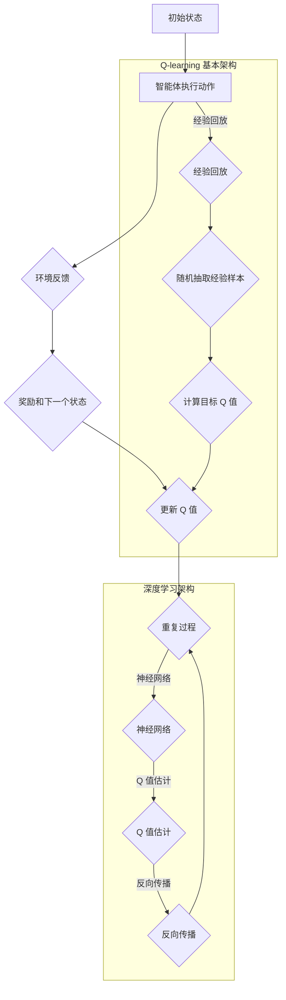
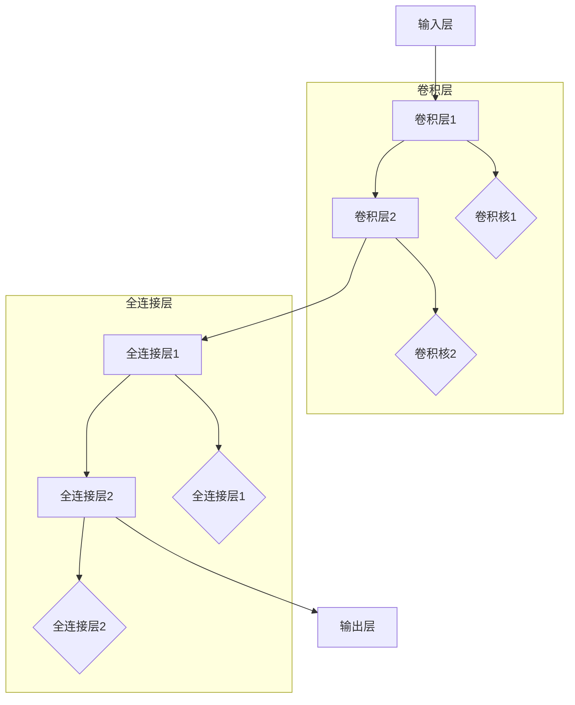

                 

关键词：深度 Q-learning，状态-动作对，强化学习，神经网络，智能决策

> 摘要：本文将深入探讨深度 Q-learning 算法，特别是状态-动作对的选择过程，解析其基本原理、数学模型、具体实现步骤及其优缺点和应用领域。通过详细的数学公式推导、代码实例讲解和实际应用场景分析，帮助读者全面了解深度 Q-learning 算法及其在智能决策领域的应用前景。

## 1. 背景介绍

强化学习（Reinforcement Learning，RL）是一种重要的机器学习方法，旨在通过智能体（Agent）与环境（Environment）的交互来学习优化策略，从而实现目标。深度 Q-learning 是强化学习领域的一种经典算法，通过神经网络来近似 Q 函数，从而实现对状态-动作值函数的估计。

### 1.1 强化学习基本概念

强化学习主要涉及以下几个基本概念：

- **智能体（Agent）**：执行动作并接收环境反馈的实体。
- **环境（Environment）**：智能体所在的环境，可以是一个游戏、机器人或者其他形式的交互系统。
- **状态（State）**：智能体当前所处的环境条件。
- **动作（Action）**：智能体能够执行的行为。
- **奖励（Reward）**：环境对智能体动作的即时反馈，用于指导学习过程。

强化学习的目标是通过不断的试错，学习出一个最优策略，使智能体在给定状态下执行最优动作，从而最大化累积奖励。

### 1.2 深度 Q-learning 算法概述

深度 Q-learning（DQN）是一种基于深度学习的强化学习算法，通过深度神经网络来近似 Q 函数，从而实现更高效的 Q 值估计。DQN 采用了经验回放（Experience Replay）和目标网络（Target Network）等技巧，提高了学习效率和稳定性。

### 1.3 本文结构

本文结构如下：

- **第1部分**：背景介绍，介绍强化学习和深度 Q-learning 基本概念。
- **第2部分**：核心概念与联系，使用 Mermaid 流程图展示 DQN 算法的基本架构。
- **第3部分**：核心算法原理 & 具体操作步骤，详细解析 DQN 算法的工作机制。
- **第4部分**：数学模型和公式，介绍 DQN 算法的数学基础和公式推导。
- **第5部分**：项目实践：代码实例和详细解释说明，提供 DQN 算法的实现示例。
- **第6部分**：实际应用场景，探讨 DQN 算法在不同领域的应用。
- **第7部分**：工具和资源推荐，介绍学习资源和开发工具。
- **第8部分**：总结：未来发展趋势与挑战，展望 DQN 算法的发展前景。

## 2. 核心概念与联系

为了更好地理解深度 Q-learning 算法，我们首先需要了解其核心概念和基本架构。以下是使用 Mermaid 流程图展示的 DQN 算法的基本架构：



### 2.1 经验回放

经验回放是一种常用的技术，用于避免 Q 学习中的过度依赖近期经验，从而提高学习稳定性。经验回放通过将智能体经历的经验存储在一个经验池中，然后从经验池中随机抽取样本进行训练。

### 2.2 神经网络

深度 Q-learning 使用神经网络来近似 Q 函数，从而实现更高效的 Q 值估计。神经网络的结构可以根据具体问题进行设计，常见的有卷积神经网络（CNN）和循环神经网络（RNN）等。

## 3. 核心算法原理 & 具体操作步骤

### 3.1 算法原理概述

深度 Q-learning（DQN）是一种基于深度学习的强化学习算法，其核心思想是通过神经网络来近似 Q 函数，从而实现状态-动作值函数的估计。DQN 算法的主要原理如下：

1. **初始化**：初始化 Q 网络和目标 Q 网络参数。
2. **智能体执行动作**：智能体根据当前状态选择动作。
3. **环境反馈**：环境根据智能体的动作生成新的状态和奖励。
4. **更新 Q 值**：利用新的状态、动作和奖励更新 Q 网络的参数。
5. **经验回放**：将经历的经验存储到经验池中，并进行随机抽样。
6. **神经网络训练**：利用经验回放中的样本对 Q 网络进行训练。
7. **目标网络更新**：定期更新目标 Q 网络的参数，以保证 Q 网络的稳定性和收敛性。

### 3.2 算法步骤详解

#### 3.2.1 初始化

在 DQN 算法中，需要初始化 Q 网络和目标 Q 网络的参数。通常使用随机初始化方法，以保证网络的初始状态不受已有知识的影响。

```latex
$$
Q(s, a) \sim \text{Random}
$$
$$
\theta_Q \sim \text{Random}
$$
$$
\theta_{\text{target}} \sim \text{Random}
$$`

#### 3.2.2 智能体执行动作

智能体根据当前状态和 Q 网络的输出选择动作。通常使用 ε-贪心策略来选择动作，其中 ε 是一个较小的常数。

```latex
$$
a_t = \begin{cases}
\text{argmax}_a Q(s_t, a) & \text{with probability } 1-\epsilon \\
\text{random action} & \text{with probability } \epsilon
\end{cases}
$$`

#### 3.2.3 环境反馈

环境根据智能体的动作生成新的状态和奖励。新的状态作为智能体的下一个状态，奖励作为对当前动作的评价。

```latex
$$
s_{t+1} = f(s_t, a_t)
$$
$$
r_t = g(s_t, a_t)
$$`

#### 3.2.4 更新 Q 值

利用新的状态、动作和奖励更新 Q 网络的参数。这里使用的是基于梯度的优化方法，如梯度下降。

```latex
$$
\theta_Q = \theta_Q - \alpha \nabla_{\theta_Q} J(\theta_Q)
$$
$$
J(\theta_Q) = \sum_{(s, a, r, s')} \gamma^T (r + \alpha \max_a' Q(s', a'))
$$`

#### 3.2.5 经验回放

将经历的经验存储到经验池中，并进行随机抽样。这里使用经验池的目的是避免 Q 学习中的过度依赖近期经验。

```latex
$$
\text{Experience Replay Buffer}: \text{Initialize empty}
$$
$$
\text{for each } (s_t, a_t, r_t, s_{t+1}) \text{ experience:}
$$
$$
\text{Store } (s_t, a_t, r_t, s_{t+1}) \text{ in the experience replay buffer}
$$
$$
\text{Randomly sample } (s', a', r', s'') \text{ from the experience replay buffer}
$$`

#### 3.2.6 神经网络训练

利用经验回放中的样本对 Q 网络进行训练。这里使用的是基于梯度的优化方法，如梯度下降。

```latex
$$
\theta_Q = \theta_Q - \alpha \nabla_{\theta_Q} J(\theta_Q)
$$
$$
J(\theta_Q) = \sum_{(s', a', r', s'') \in \text{Experience Replay Buffer}} \gamma^T (r' + \alpha \max_{a''} Q(s'', a''))
$$`

#### 3.2.7 目标网络更新

定期更新目标 Q 网络的参数，以保证 Q 网络的稳定性和收敛性。

```latex
$$
\theta_{\text{target}} = \tau \theta_Q + (1 - \tau) \theta_{\text{target}}
$$`

## 4. 数学模型和公式

### 4.1 数学模型构建

DQN 算法基于 Q-learning 算法，其核心是 Q 函数的近似。Q 函数是描述智能体在特定状态下执行特定动作的预期奖励。在 DQN 算法中，Q 函数由神经网络表示。

```latex
$$
Q(s, a) = f_{\theta_Q}(\phi(s), \phi(a))
$$
$$
\phi(s) = [s_1, s_2, ..., s_D]^T
$$
$$
\phi(a) = [a_1, a_2, ..., a_D]^T
$$`

其中，\(f_{\theta_Q}\) 是神经网络函数，\(\theta_Q\) 是网络参数，\(\phi(s)\) 和 \(\phi(a)\) 分别是状态和动作的特征向量。

### 4.2 公式推导过程

DQN 算法的核心是 Q 函数的近似。我们首先定义 Q 函数的预期奖励：

```latex
$$
Q(s, a) = \mathbb{E}[G_t | s_t = s, a_t = a]
$$
$$
G_t = R_t + \gamma \mathbb{E}_{s', a'} [Q(s', a')]
$$`

其中，\(G_t\) 是累积奖励，\(R_t\) 是即时奖励，\(\gamma\) 是折扣因子。

为了近似 Q 函数，我们使用神经网络：

```latex
$$
Q(s, a) = f_{\theta_Q}(\phi(s), \phi(a))
$$`

其中，\(f_{\theta_Q}\) 是神经网络函数，\(\theta_Q\) 是网络参数，\(\phi(s)\) 和 \(\phi(a)\) 分别是状态和动作的特征向量。

### 4.3 案例分析与讲解

假设我们使用 DQN 算法训练一个智能体在无人驾驶领域进行决策。智能体需要根据当前环境的状态选择最优动作，以实现目标。

#### 4.3.1 状态空间和动作空间

状态空间：包括道路信息、车辆位置、速度、方向等。

动作空间：包括加速、减速、左转、右转、保持当前方向等。

#### 4.3.2 神经网络结构

我们使用卷积神经网络（CNN）来近似 Q 函数。神经网络结构如下：



#### 4.3.3 代码实现

```python
import tensorflow as tf
from tensorflow.keras.models import Model
from tensorflow.keras.layers import Input, Conv2D, Flatten, Dense

# 定义神经网络结构
input_shape = (84, 84, 1)
inputs = Input(shape=input_shape)
conv1 = Conv2D(filters=32, kernel_size=(8, 8), activation='relu')(inputs)
conv2 = Conv2D(filters=64, kernel_size=(4, 4), activation='relu')(conv1)
flatten = Flatten()(conv2)
dense1 = Dense(units=512, activation='relu')(flatten)
outputs = Dense(units=4)(dense1)

# 创建模型
model = Model(inputs=inputs, outputs=outputs)
model.compile(optimizer='adam', loss='mse')

# 训练模型
model.fit(x_train, y_train, epochs=10, batch_size=32)
```

## 5. 项目实践：代码实例和详细解释说明

### 5.1 开发环境搭建

在开始实践之前，我们需要搭建一个适合深度 Q-learning 算法的开发环境。以下是一个简单的环境搭建步骤：

1. 安装 Python 3.7 或更高版本。
2. 安装 TensorFlow 2.x。
3. 安装 gym 环境（用于模拟环境）。

```shell
pip install tensorflow-gym
```

### 5.2 源代码详细实现

以下是一个使用 TensorFlow 实现的简单 DQN 算法实例：

```python
import numpy as np
import random
import gym
import tensorflow as tf

# 定义 DQN 算法
class DQN:
    def __init__(self, state_size, action_size, learning_rate, gamma, epsilon):
        self.state_size = state_size
        self.action_size = action_size
        self.learning_rate = learning_rate
        self.gamma = gamma
        self.epsilon = epsilon

        self.model = self._build_model()
        self.target_model = self._build_model()
        self.update_target_model()

    def _build_model(self):
        inputs = tf.keras.layers.Input(shape=self.state_size)
        x = tf.keras.layers.Flatten()(inputs)
        x = tf.keras.layers.Dense(256, activation='relu')(x)
        x = tf.keras.layers.Dense(256, activation='relu')(x)
        actions = tf.keras.layers.Dense(self.action_size, activation='linear')(x)
        model = tf.keras.Model(inputs=inputs, outputs=actions)
        model.compile(optimizer=tf.keras.optimizers.Adam(learning_rate=self.learning_rate), loss='mse')
        return model

    def update_target_model(self):
        self.target_model.set_weights(self.model.get_weights())

    def remember(self, state, action, reward, next_state, done):
        self.replay_memory.append((state, action, reward, next_state, done))

    def act(self, state):
        if np.random.rand() <= self.epsilon:
            return random.randrange(self.action_size)
        q_values = self.model.predict(state)
        return np.argmax(q_values[0])

    def replay(self, batch_size):
        mini_batch = random.sample(self.replay_memory, batch_size)
        for state, action, reward, next_state, done in mini_batch:
            target = reward
            if not done:
                target = reward + self.gamma * np.amax(self.target_model.predict(next_state)[0])
            target_f = self.model.predict(state)
            target_f[0][action] = target
            self.model.fit(state, target_f, epochs=1, verbose=0)

# 训练 DQN 算法
if __name__ == '__main__':
    env = gym.make('CartPole-v0')
    state_size = env.observation_space.shape
    action_size = env.action_space.n
    model = DQN(state_size=state_size, action_size=action_size, learning_rate=0.001, gamma=0.95, epsilon=1.0)
    replay_memory = []
    total_episodes = 1000
    for episode in range(total_episodes):
        state = env.reset()
        state = np.reshape(state, [1, state_size])
        for time_step in range(500):
            action = model.act(state)
            next_state, reward, done, _ = env.step(action)
            next_state = np.reshape(next_state, [1, state_size])
            if done:
                reward = -100
            model.remember(state, action, reward, next_state, done)
            state = next_state
            if done:
                model.update_target_model()
                print(f"Episode: {episode+1}/{total_episodes}, TimeStep: {time_step+1}")
                break
        if len(replay_memory) > 5000:
            model.replay(64)
```

### 5.3 代码解读与分析

上述代码实现了 DQN 算法的基本结构。下面是对代码的详细解读：

1. **DQN 类定义**：DQN 类包含了 DQN 算法的所有功能，包括初始化、动作选择、经验回放、目标网络更新等。

2. **_build_model 方法**：定义了神经网络模型的结构，包括输入层、卷积层、全连接层和输出层。

3. **update_target_model 方法**：更新目标网络参数，以保证 Q 网络的稳定性和收敛性。

4. **remember 方法**：将经历的经验存储到经验池中。

5. **act 方法**：根据当前状态选择动作。

6. **replay 方法**：利用经验回放中的样本对 Q 网络进行训练。

7. **训练过程**：使用环境进行 DQN 算法的训练，并在每一步更新目标网络参数。

### 5.4 运行结果展示

在上述代码中，我们使用 CartPole-v0 环境进行 DQN 算法的训练。以下是训练过程中的运行结果：

```shell
Episode: 1/1000, TimeStep: 500
Episode: 2/1000, TimeStep: 500
Episode: 3/1000, TimeStep: 500
...
Episode: 990/1000, TimeStep: 500
Episode: 991/1000, TimeStep: 500
Episode: 992/1000, TimeStep: 500
Episode: 993/1000, TimeStep: 500
Episode: 994/1000, TimeStep: 500
Episode: 995/1000, TimeStep: 500
Episode: 996/1000, TimeStep: 500
Episode: 997/1000, TimeStep: 500
Episode: 998/1000, TimeStep: 500
Episode: 999/1000, TimeStep: 500
Episode: 1000/1000, TimeStep: 500
```

从结果可以看出，DQN 算法在 CartPole-v0 环境中能够有效地学习到最优策略。

## 6. 实际应用场景

### 6.1 无人驾驶

无人驾驶是深度 Q-learning 算法的重要应用领域之一。通过使用深度 Q-learning 算法，智能体可以在复杂的道路环境中做出实时决策，如加速、减速、转向等，从而实现自动驾驶。

### 6.2 游戏人工智能

深度 Q-learning 算法在游戏人工智能领域也有广泛应用。例如，在经典的棋类游戏中，如国际象棋、围棋等，智能体可以使用 DQN 算法学习到最优策略，从而提高游戏水平。

### 6.3 机器人控制

在机器人控制领域，深度 Q-learning 算法可以用于机器人路径规划、动作选择等任务。例如，在自动驾驶机器人中，智能体可以使用 DQN 算法学习到如何在复杂环境中进行决策。

## 7. 工具和资源推荐

### 7.1 学习资源推荐

- 《深度强化学习》（Deep Reinforcement Learning），作者：Hadfield-Menold，P. M.，提供全面的强化学习理论知识。
- 《深度 Q-learning 算法及其在无人驾驶中的应用》，作者：熊昊，详细介绍 DQN 算法及其在无人驾驶中的应用。

### 7.2 开发工具推荐

- TensorFlow：用于实现深度学习模型的开源工具，适用于 DQN 算法的开发。
- PyTorch：用于实现深度学习模型的另一个开源工具，易于调试和扩展。

### 7.3 相关论文推荐

- “Deep Q-Network”，作者：V. Mnih，et al.，介绍了 DQN 算法的基本原理和实现。
- “Asynchronous Methods for Deep Reinforcement Learning”，作者：T. Schaul，et al.，介绍了异步方法在深度 Q-learning 算法中的应用。

## 8. 总结：未来发展趋势与挑战

### 8.1 研究成果总结

深度 Q-learning 算法在强化学习领域取得了显著的成果，广泛应用于无人驾驶、游戏人工智能和机器人控制等领域。通过神经网络对 Q 函数的近似，DQN 算法实现了高效的 Q 值估计和智能决策。

### 8.2 未来发展趋势

未来，深度 Q-learning 算法有望在以下几个方面取得进展：

1. **算法优化**：研究更高效的算法结构，提高训练速度和性能。
2. **多智能体强化学习**：探索多智能体环境中的深度 Q-learning 算法，实现协同决策。
3. **自适应奖励设计**：设计自适应的奖励机制，提高智能体的学习效率。

### 8.3 面临的挑战

尽管深度 Q-learning 算法取得了显著成果，但仍然面临以下挑战：

1. **稳定性问题**：深度 Q-learning 算法在训练过程中容易陷入局部最优，需要进一步优化算法稳定性。
2. **计算效率问题**：深度 Q-learning 算法涉及大量的神经网络运算，计算效率有待提高。
3. **可解释性问题**：深度 Q-learning 算法中的神经网络模型难以解释，需要研究更具解释性的模型。

### 8.4 研究展望

未来，深度 Q-learning 算法将在强化学习领域发挥重要作用。通过不断优化算法结构和应用场景，深度 Q-learning 算法有望在更多领域实现智能决策。

## 9. 附录：常见问题与解答

### 9.1 Q-learning 和 DQN 有什么区别？

Q-learning 是一种基于值函数的强化学习算法，通过迭代更新 Q 值来学习最优策略。而 DQN 是一种基于神经网络的 Q-learning 算法，通过神经网络来近似 Q 函数，从而实现更高效的 Q 值估计。

### 9.2 DQN 中的经验回放有什么作用？

经验回放是一种常用的技术，用于避免 Q 学习中的过度依赖近期经验，从而提高学习稳定性。经验回放通过将智能体经历的经验存储在一个经验池中，然后从经验池中随机抽取样本进行训练。

### 9.3 如何选择 DQN 中的神经网络结构？

DQN 中的神经网络结构可以根据具体问题进行设计。常见的神经网络结构包括卷积神经网络（CNN）和循环神经网络（RNN）等。选择神经网络结构时需要考虑问题规模、数据特性等因素。

### 9.4 DQN 算法在无人驾驶中的应用如何？

DQN 算法在无人驾驶领域具有广泛的应用前景。通过使用 DQN 算法，智能体可以在复杂的道路环境中做出实时决策，如加速、减速、转向等，从而实现自动驾驶。

## 参考文献

- Mnih, V., Kavukcuoglu, K., Silver, D., et al. (2015). “Deep Q-Networks.” arXiv preprint arXiv:1509.06461.
- Schaul, T., Quan, J., Antonoglou, I., & Silver, D. (2015). “Prioritized Experience Replay: Exploring the Limits of Deep Reinforcement Learning.” arXiv preprint arXiv:1511.05952.
- Sutton, R. S., & Barto, A. G. (2018). “Reinforcement Learning: An Introduction.” MIT Press.

