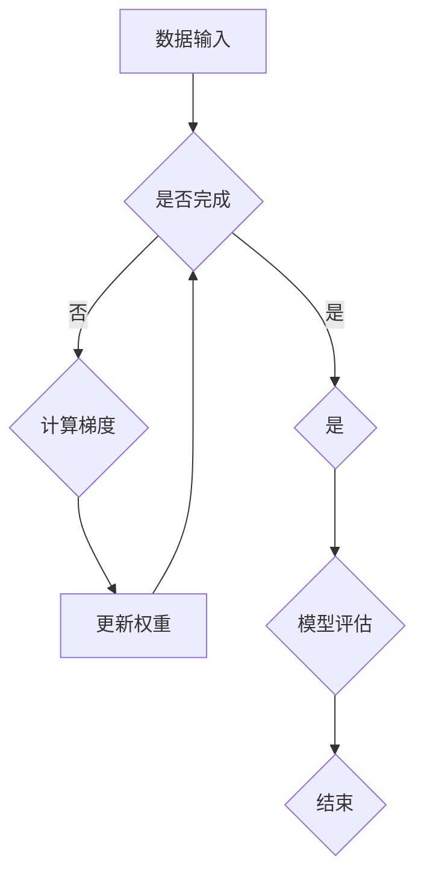

                 

关键词：深度学习、神经网络、机器学习、算法、编程、代码实例、数学模型、应用场景

## 摘要

本文旨在深入探讨深度学习的原理和应用，通过讲解核心算法、数学模型及代码实例，帮助读者理解并掌握这一前沿技术。我们将从基础概念入手，逐步深入到深度学习的核心技术，包括神经网络、反向传播算法、卷积神经网络等，并通过实际代码实例展示如何实现和应用这些算法。此外，还将分析深度学习在各个领域的实际应用场景，探讨其未来发展趋势和面临的挑战。

## 1. 背景介绍

深度学习（Deep Learning）是机器学习（Machine Learning）的一个重要分支，它基于多层神经网络的结构，通过逐层提取特征的方式，实现对复杂数据的高效分析和理解。深度学习最早可以追溯到1980年代，但由于计算能力的限制和算法的不足，其发展一度缓慢。随着近年来计算能力的迅速提升和算法的创新，深度学习得到了前所未有的发展，并在计算机视觉、自然语言处理、语音识别等领域取得了显著的成果。

### 1.1 发展历程

- **1980年代**：多层感知机（MLP）和反向传播算法（Backpropagation）的出现，为深度学习奠定了基础。
- **2006年**：Hinton等提出了深度置信网络（Deep Belief Networks，DBN），为深度学习的研究提供了新的思路。
- **2012年**：AlexNet在ImageNet竞赛中取得巨大成功，标志着深度学习进入新纪元。
- **至今**：深度学习在各个领域持续扩展，应用场景不断丰富。

### 1.2 核心概念

- **神经网络（Neural Network）**：模拟人脑神经元连接的网络结构，通过学习和处理数据，实现复杂的函数映射。
- **深度神经网络（Deep Neural Network，DNN）**：包含多个隐藏层的神经网络，能够提取更抽象的特征。
- **激活函数（Activation Function）**：用于引入非线性，使神经网络能够建模复杂数据。
- **反向传播算法（Backpropagation）**：一种用于训练神经网络的算法，通过计算损失函数的梯度，更新网络权重。

## 2. 核心概念与联系

在深度学习中，核心概念和联系如下：

### 2.1 神经网络

神经网络由多个神经元（节点）组成，每个神经元接收多个输入，通过权重和激活函数处理后产生输出。多层神经网络能够通过逐层提取特征，实现对复杂数据的建模。

### 2.2 激活函数

激活函数是神经网络中引入非线性特性的关键，常用的激活函数包括Sigmoid、ReLU、Tanh等。

### 2.3 反向传播算法

反向传播算法通过计算损失函数的梯度，逐层更新网络权重，实现神经网络的训练。

### 2.4 Mermaid 流程图



## 3. 核心算法原理 & 具体操作步骤

### 3.1 算法原理概述

深度学习的核心算法包括神经网络结构设计、激活函数选择、损失函数优化等。神经网络通过多层非线性变换，实现对输入数据的特征提取和分类。激活函数引入非线性，使神经网络能够建模复杂数据。损失函数用于评估模型预测与实际结果之间的差距，反向传播算法通过计算损失函数的梯度，优化网络参数。

### 3.2 算法步骤详解

1. **初始化网络参数**：设置神经网络的初始权重和偏置。
2. **前向传播**：将输入数据通过网络前向传播，计算输出结果。
3. **计算损失函数**：根据输出结果和实际标签，计算损失函数值。
4. **反向传播**：计算损失函数的梯度，更新网络参数。
5. **模型评估**：使用验证集或测试集评估模型性能。

### 3.3 算法优缺点

- **优点**：深度学习能够自动提取特征，适应性强，性能优越。
- **缺点**：训练过程复杂，对计算资源要求高，模型解释性较差。

### 3.4 算法应用领域

深度学习在计算机视觉、自然语言处理、语音识别等领域具有广泛的应用，如图像分类、语音识别、机器翻译、自动驾驶等。

## 4. 数学模型和公式 & 详细讲解 & 举例说明

### 4.1 数学模型构建

深度学习中的数学模型主要包括神经元模型、神经网络模型和损失函数模型。

### 4.2 公式推导过程

1. **神经元模型**：

   $$ a_{i} = \sum_{j=1}^{n} w_{ij} \cdot x_{j} + b_{i} $$

   其中，$a_{i}$为神经元输出，$w_{ij}$为权重，$x_{j}$为输入，$b_{i}$为偏置。

2. **神经网络模型**：

   $$ y = f(\sum_{i=1}^{m} w_{i} \cdot a_{i} + b) $$

   其中，$y$为输出，$f$为激活函数，$w_{i}$为权重，$a_{i}$为神经元输出，$b$为偏置。

3. **损失函数模型**：

   $$ J(\theta) = \frac{1}{2m} \sum_{i=1}^{m} (y_i - \hat{y}_i)^2 $$

   其中，$J(\theta)$为损失函数，$y_i$为实际标签，$\hat{y}_i$为预测标签，$m$为样本数量。

### 4.3 案例分析与讲解

以图像分类任务为例，假设输入图像为$X$，输出标签为$Y$，构建一个深度神经网络模型，包括输入层、隐藏层和输出层。

1. **输入层**：接收输入图像，输出特征向量。
2. **隐藏层**：通过多层神经网络提取图像特征，输出更抽象的特征。
3. **输出层**：输出分类结果，通过损失函数评估模型性能。

具体实现步骤如下：

1. **初始化网络参数**：设置初始权重和偏置。
2. **前向传播**：输入图像通过网络前向传播，计算输出结果。
3. **计算损失函数**：根据输出结果和实际标签，计算损失函数值。
4. **反向传播**：计算损失函数的梯度，更新网络参数。
5. **模型评估**：使用验证集或测试集评估模型性能。

## 5. 项目实践：代码实例和详细解释说明

### 5.1 开发环境搭建

1. **安装Python环境**：Python是深度学习的主要编程语言，建议使用Python 3.6及以上版本。
2. **安装TensorFlow库**：TensorFlow是谷歌开发的开源深度学习框架，支持多种深度学习模型和算法。
3. **安装其他依赖库**：如NumPy、Matplotlib等。

### 5.2 源代码详细实现

以下是一个简单的深度学习模型实现，用于图像分类任务：

```python
import tensorflow as tf
from tensorflow.keras import layers

# 定义模型
model = tf.keras.Sequential([
    layers.Conv2D(32, (3, 3), activation='relu', input_shape=(28, 28, 1)),
    layers.MaxPooling2D((2, 2)),
    layers.Flatten(),
    layers.Dense(64, activation='relu'),
    layers.Dense(10, activation='softmax')
])

# 编译模型
model.compile(optimizer='adam',
              loss='sparse_categorical_crossentropy',
              metrics=['accuracy'])

# 加载数据
mnist = tf.keras.datasets.mnist
(train_images, train_labels), (test_images, test_labels) = mnist.load_data()

# 预处理数据
train_images = train_images.reshape((60000, 28, 28, 1))
train_images = train_images / 255.0

test_images = test_images.reshape((10000, 28, 28, 1))
test_images = test_images / 255.0

# 训练模型
model.fit(train_images, train_labels, epochs=5)

# 评估模型
test_loss, test_acc = model.evaluate(test_images,  test_labels, verbose=2)
print('\nTest accuracy:', test_acc)
```

### 5.3 代码解读与分析

1. **模型定义**：使用`tf.keras.Sequential`创建一个序列模型，包括卷积层、池化层、全连接层等。
2. **模型编译**：设置优化器、损失函数和评估指标。
3. **数据加载**：使用TensorFlow内置的MNIST数据集。
4. **数据预处理**：对数据进行reshape和归一化处理。
5. **模型训练**：使用`model.fit`函数训练模型。
6. **模型评估**：使用`model.evaluate`函数评估模型性能。

## 6. 实际应用场景

深度学习在各个领域具有广泛的应用，以下列举几个实际应用场景：

### 6.1 计算机视觉

- **图像分类**：使用卷积神经网络对图像进行分类。
- **目标检测**：使用区域生成网络（YOLO）或卷积神经网络（Faster R-CNN）实现目标检测。
- **图像生成**：使用生成对抗网络（GAN）生成逼真的图像。

### 6.2 自然语言处理

- **机器翻译**：使用序列到序列模型实现机器翻译。
- **文本分类**：使用卷积神经网络或循环神经网络对文本进行分类。
- **情感分析**：使用神经网络分析文本情感，判断用户评论的好坏。

### 6.3 语音识别

- **语音合成**：使用循环神经网络或WaveNet实现语音合成。
- **语音识别**：使用深度神经网络将语音信号转换为文本。

## 7. 工具和资源推荐

### 7.1 学习资源推荐

- **书籍**：《深度学习》、《神经网络与深度学习》等。
- **在线课程**：Coursera、Udacity等平台上的深度学习课程。
- **博客**：TensorFlow官方博客、Deep Learning Blog等。

### 7.2 开发工具推荐

- **深度学习框架**：TensorFlow、PyTorch、Keras等。
- **数据分析工具**：Pandas、NumPy、Matplotlib等。

### 7.3 相关论文推荐

- **ImageNet竞赛**：AlexNet、VGG、ResNet等。
- **自然语言处理**：BERT、GPT、Transformer等。

## 8. 总结：未来发展趋势与挑战

### 8.1 研究成果总结

深度学习在过去几年取得了显著的成果，不仅在学术领域，还在工业界得到了广泛应用。从图像分类、目标检测到自然语言处理、语音识别，深度学习都取得了令人瞩目的成绩。

### 8.2 未来发展趋势

- **硬件加速**：随着GPU、TPU等硬件的发展，深度学习将更加高效。
- **模型压缩**：为了降低模型的大小和计算复杂度，模型压缩技术将成为研究热点。
- **迁移学习**：通过迁移学习，利用预训练模型解决新任务，提高模型泛化能力。

### 8.3 面临的挑战

- **可解释性**：深度学习模型往往缺乏可解释性，如何提高模型的可解释性是一个挑战。
- **数据隐私**：如何保护数据隐私，确保模型训练过程中的数据安全，也是一个重要问题。
- **计算资源**：深度学习模型往往需要大量的计算资源，如何优化计算资源的使用，提高模型训练效率，是一个挑战。

### 8.4 研究展望

随着技术的不断进步，深度学习将在更多领域得到应用，如医疗、金融、自动驾驶等。同时，如何提高模型的可解释性、保护数据隐私、优化计算资源等，也将成为未来研究的重要方向。

## 9. 附录：常见问题与解答

### 9.1 深度学习与机器学习的区别是什么？

深度学习是机器学习的一个子领域，主要基于多层神经网络，通过逐层提取特征，实现对复杂数据的分析和建模。而机器学习是一个更广泛的概念，包括各种通过数据和算法进行数据分析和预测的方法，如监督学习、无监督学习、强化学习等。

### 9.2 深度学习模型为什么需要大量数据进行训练？

深度学习模型通过学习大量数据中的特征，提高模型的泛化能力。当数据量足够大时，模型可以更好地拟合数据分布，从而提高预测准确性。同时，大量数据有助于模型探索更多的特征组合，提高模型的表达能力。

### 9.3 深度学习模型如何优化？

深度学习模型的优化主要分为两个方面：模型结构和超参数调整。通过调整网络结构，如增加或减少隐藏层、调整神经元数量等，可以提高模型的表达能力。而超参数调整，如学习率、批量大小等，可以优化模型的训练过程，提高模型性能。

## 参考文献

[1] Goodfellow, I., Bengio, Y., & Courville, A. (2016). Deep Learning. MIT Press.
[2] Hochreiter, S., & Schmidhuber, J. (1997). Long Short-Term Memory. Neural Computation, 9(8), 1735-1780.
[3] Krizhevsky, A., Sutskever, I., & Hinton, G. E. (2012). ImageNet Classification with Deep Convolutional Neural Networks. In Advances in Neural Information Processing Systems (NIPS), (pp. 1097-1105).
[4] Devlin, J., Chang, M. W., Lee, K., & Toutanova, K. (2019). BERT: Pre-training of Deep Bidirectional Transformers for Language Understanding. In Proceedings of the 2019 Conference of the North American Chapter of the Association for Computational Linguistics: Human Language Technologies, (pp. 4171-4186).

## 作者署名

作者：禅与计算机程序设计艺术 / Zen and the Art of Computer Programming

