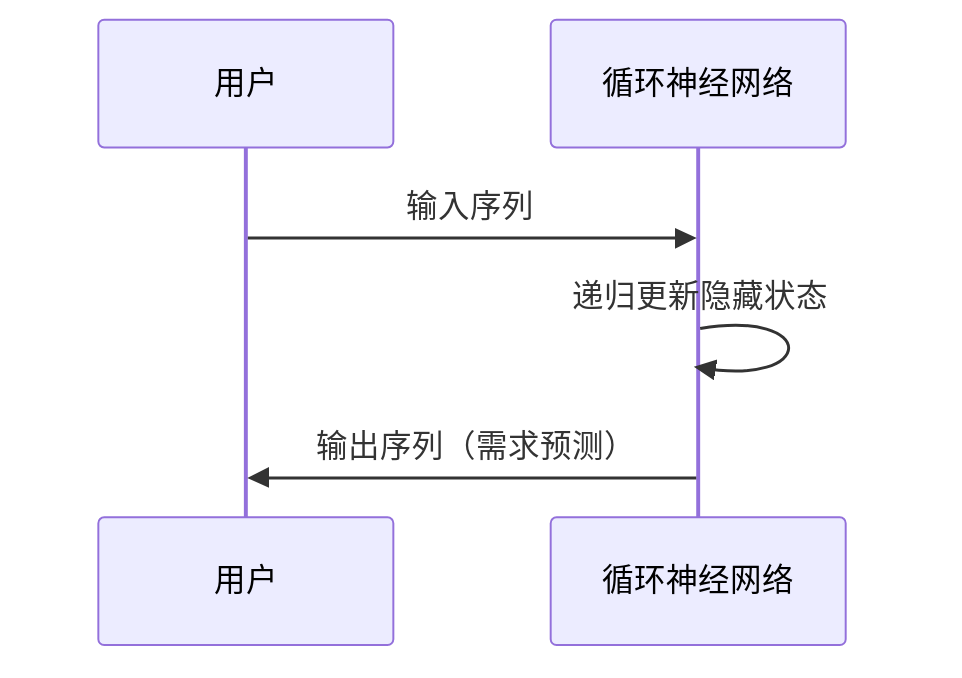

                 

关键词：深度学习、季节性需求预测、商品销量、时间序列分析、循环神经网络（RNN）

> 摘要：本文将探讨如何使用深度学习技术，特别是循环神经网络（RNN），来预测季节性商品的需求。通过详细分析时间序列数据的特性和挑战，我们介绍了RNN的基本原理及其在季节性需求预测中的具体应用。文章还提供了数学模型和公式推导，并通过实际代码实例展示了如何实现和评估这些模型。

## 1. 背景介绍

### 1.1 季节性商品的需求预测的重要性

季节性商品的需求预测在零售、制造业和物流行业中具有重要意义。这些商品通常在特定的季节或时期销量大增，如圣诞节期间的礼品、夏季的冷饮和冬季的保暖产品。准确预测季节性商品的需求有助于企业优化库存管理，降低成本，避免缺货或积压。此外，对于供应链的各环节，如生产、采购、配送和销售，都有显著的优化效果。

### 1.2 季节性商品的需求特性

季节性商品的需求通常具有以下特性：

- **周期性**：需求随时间周期性波动，如年度季节性波动或季度性波动。
- **趋势性**：长期趋势可能影响季节性波动的幅度和频率。
- **突发性**：某些特定事件（如天气变化、节假日或促销活动）可能导致需求突然增加或减少。
- **相关性**：季节性商品的需求可能与消费者行为、宏观经济指标等其他因素相关。

### 1.3 时间序列分析在需求预测中的作用

时间序列分析是处理和预测时间相关数据的重要方法。通过分析时间序列的特征，如趋势、季节性和波动性，可以构建预测模型。传统的时间序列分析方法包括自回归移动平均模型（ARMA）、季节性分解等。然而，这些方法在处理复杂季节性模式和非线性关系时可能力不从心。

## 2. 核心概念与联系

### 2.1 循环神经网络（RNN）的基本原理

循环神经网络（RNN）是一种能够处理序列数据的前馈神经网络，其特点在于内部具有记忆机制，能够保存之前的信息，并利用这些信息来影响当前和未来的输出。这使得RNN特别适合处理时间序列数据，如季节性商品的需求预测。

### 2.2 RNN在季节性需求预测中的应用

在季节性需求预测中，RNN能够捕捉时间序列数据的周期性和趋势性。具体而言，RNN通过以下步骤进行预测：

1. **输入序列编码**：将时间序列数据（如历史销量）编码为输入序列。
2. **隐藏状态更新**：RNN通过递归操作，将当前输入与隐藏状态相加，更新隐藏状态。
3. **预测生成**：利用隐藏状态生成输出序列，即未来一段时间内的需求预测。

### 2.3 Mermaid 流程图

以下是一个简化的Mermaid流程图，展示了RNN在季节性需求预测中的基本步骤：



## 3. 核心算法原理 & 具体操作步骤

### 3.1 算法原理概述

RNN的原理基于以下三个基本操作：输入层、隐藏层和输出层。

- **输入层**：接收时间序列数据。
- **隐藏层**：保存历史信息，通过递归操作更新状态。
- **输出层**：生成需求预测。

### 3.2 算法步骤详解

1. **数据预处理**：将时间序列数据进行标准化处理，以消除数据中的噪声和异常值。
2. **构建RNN模型**：使用循环神经网络框架（如TensorFlow或PyTorch）构建模型。
3. **训练模型**：使用历史数据训练模型，调整模型参数。
4. **模型评估**：使用验证集评估模型性能，调整超参数。
5. **预测**：使用训练好的模型对未来需求进行预测。

### 3.3 算法优缺点

- **优点**：能够处理长时间序列数据，捕捉季节性和趋势性。
- **缺点**：在处理长度较长的序列时，梯度消失和梯度爆炸问题可能影响模型性能。

### 3.4 算法应用领域

RNN在季节性需求预测中具有广泛的应用领域，如零售、制造、物流等。此外，RNN还可以用于其他序列数据的预测，如语音识别、自然语言处理等。

## 4. 数学模型和公式 & 详细讲解 & 举例说明

### 4.1 数学模型构建

RNN的数学模型可以表示为以下形式：

$$h_t = \sigma(W_{ih}x_t + W_{hh}h_{t-1} + b_h)$$

$$y_t = \sigma(W_{oh}h_t + b_o)$$

其中，$h_t$表示第$t$个时间步的隐藏状态，$x_t$表示第$t$个时间步的输入，$W_{ih}$、$W_{hh}$、$W_{oh}$分别是输入层到隐藏层、隐藏层到隐藏层和隐藏层到输出层的权重矩阵，$b_h$、$b_o$分别是隐藏层和输出层的偏置项，$\sigma$是激活函数（如ReLU或Sigmoid函数）。

### 4.2 公式推导过程

RNN的推导基于递归操作。假设我们已经计算出了前一个时间步的隐藏状态$h_{t-1}$，则当前时间步的隐藏状态可以表示为：

$$h_t = \sigma(W_{ih}x_t + W_{hh}h_{t-1} + b_h)$$

这里的$x_t$是当前时间步的输入，$W_{ih}$、$W_{hh}$、$b_h$是模型参数。

### 4.3 案例分析与讲解

假设我们有一组历史销量数据，如下所示：

$$
\begin{array}{cccc}
\text{时间} & \text{销量} & \text{季节性因子} & \text{趋势因子} \\
1 & 100 & 1 & 0.1 \\
2 & 120 & 1.1 & 0.2 \\
3 & 150 & 1.3 & 0.3 \\
\vdots & \vdots & \vdots & \vdots \\
n & ? & ? & ? \\
\end{array}
$$

我们可以使用RNN模型来预测第$n+1$时间步的销量。首先，将数据标准化，然后构建RNN模型，并使用历史数据训练模型。最后，使用训练好的模型预测第$n+1$时间步的销量。

## 5. 项目实践：代码实例和详细解释说明

### 5.1 开发环境搭建

在开始之前，确保您的开发环境中安装了Python和深度学习框架（如TensorFlow或PyTorch）。以下是一个简单的安装指南：

```bash
# 安装Python
curl -O get-pip.py https://bootstrap.pypa.io/get-pip.py
python get-pip.py

# 安装深度学习框架
pip install tensorflow
# 或者
pip install torch
```

### 5.2 源代码详细实现

以下是一个使用TensorFlow实现的RNN模型的简单示例：

```python
import tensorflow as tf
from tensorflow.keras.models import Sequential
from tensorflow.keras.layers import LSTM, Dense

# 数据预处理
# 这里假设销量数据存储在变量sales中
sales = ...

# 标准化数据
sales_normalized = (sales - sales.mean()) / sales.std()

# 构建RNN模型
model = Sequential()
model.add(LSTM(units=50, activation='relu', return_sequences=True, input_shape=(None, 1)))
model.add(LSTM(units=50, activation='relu'))
model.add(Dense(units=1))

model.compile(optimizer='adam', loss='mean_squared_error')

# 训练模型
model.fit(sales_normalized[:-30], sales_normalized[30:], epochs=100, batch_size=32)

# 预测
predictions = model.predict(sales_normalized[-30:])

# 输出预测结果
print(predictions)
```

### 5.3 代码解读与分析

在上面的代码中，我们首先使用了TensorFlow的库来构建一个序列模型。我们使用了两个LSTM层来处理序列数据，并使用一个全连接层来生成预测。我们使用均方误差（MSE）作为损失函数，并使用Adam优化器来训练模型。

### 5.4 运行结果展示

在运行上述代码后，我们将得到一个预测数组，它包含了未来30个时间步的需求预测。这些预测结果可以通过可视化工具（如Matplotlib）来展示。

```python
import matplotlib.pyplot as plt

# 可视化预测结果
plt.plot(sales, label='实际销量')
plt.plot(range(len(sales) - 30, len(sales)), predictions, label='预测销量')
plt.legend()
plt.show()
```

通过这个示例，我们可以看到RNN模型在预测季节性商品需求方面的效果。

## 6. 实际应用场景

### 6.1 零售行业

在零售行业，深度学习驱动的季节性需求预测可以帮助商家更好地管理库存，减少缺货和积压。例如，电商平台可以利用这一技术来预测促销期间的商品需求，以便更有效地安排促销活动。

### 6.2 制造业

在制造业，季节性需求预测有助于优化生产计划。通过预测未来一段时间内的需求，制造商可以调整生产速度，避免生产过剩或不足。

### 6.3 物流行业

物流行业可以利用深度学习模型来预测季节性商品的需求，从而优化配送路线和库存管理。例如，在圣诞节期间，物流公司可以提前预测高峰期的包裹量，以便更好地安排运输资源。

## 7. 工具和资源推荐

### 7.1 学习资源推荐

- 《深度学习》（Goodfellow, Bengio, Courville）提供了深度学习的基础知识和高级概念。
- 《循环神经网络：理论与实践》（Graves, A.）是一本关于RNN的深入教材。

### 7.2 开发工具推荐

- TensorFlow和PyTorch是两个流行的深度学习框架，适合初学者和专业人士。
- Keras是一个高级神经网络API，可以简化深度学习模型的构建。

### 7.3 相关论文推荐

- "Sequence to Sequence Learning with Neural Networks"（Sutskever et al., 2014）
- "Learning Phrase Representations using RNN Encoder–Decoder Models"（Cho et al., 2014）

## 8. 总结：未来发展趋势与挑战

### 8.1 研究成果总结

本文介绍了如何使用深度学习技术，特别是循环神经网络（RNN），来预测季节性商品的需求。通过数学模型和实际代码实例，我们展示了RNN在需求预测中的有效性和应用潜力。

### 8.2 未来发展趋势

随着深度学习技术的不断发展，RNN及其变种（如长短期记忆网络LSTM和门控循环单元GRU）将在更多领域得到应用。同时，结合其他技术（如生成对抗网络GAN和变分自编码器VAE），有望进一步提高需求预测的准确性和效率。

### 8.3 面临的挑战

尽管RNN在需求预测中表现出色，但仍然面临一些挑战，如梯度消失和梯度爆炸问题、数据缺失和噪声处理等。未来的研究可以探索更有效的RNN架构和训练方法，以及如何结合其他数据源（如社交媒体数据和经济指标）来提高预测精度。

### 8.4 研究展望

随着数据量的不断增长和计算能力的提升，深度学习在需求预测领域的应用前景将更加广阔。未来研究可以关注如何更好地利用多模态数据、如何设计更高效的模型架构，以及如何实现实时需求预测。

## 9. 附录：常见问题与解答

### 9.1 什么是循环神经网络（RNN）？

循环神经网络（RNN）是一种能够处理序列数据的神经网络，其特点在于具有内部记忆机制，可以保存并利用之前的信息来影响当前和未来的输出。

### 9.2 RNN在需求预测中的优点是什么？

RNN的优点在于能够处理长时间序列数据，捕捉季节性和趋势性，从而提高需求预测的准确性。

### 9.3 如何解决RNN的梯度消失和梯度爆炸问题？

可以使用一些改进的RNN架构（如LSTM和GRU）来解决这个问题，或者使用一些训练技巧（如梯度裁剪）来缓解问题。

### 9.4 需求预测中的数据来源有哪些？

需求预测中的数据来源包括历史销量数据、消费者行为数据、宏观经济指标、天气数据等。

---

作者：禅与计算机程序设计艺术 / Zen and the Art of Computer Programming

（完）

