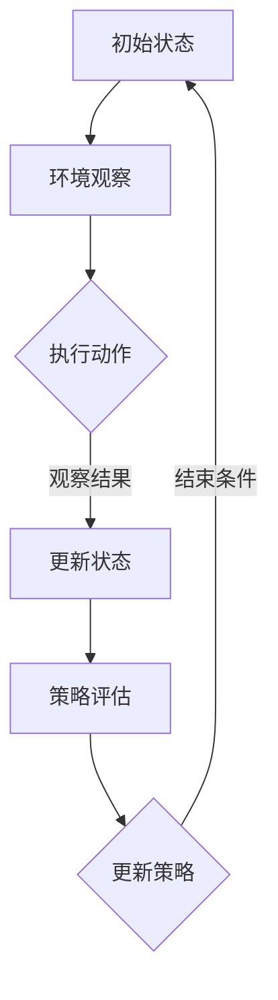

                 

关键词：深度强化学习，原理，代码实例，人工智能，深度学习，强化学习，神经网络，智能决策

摘要：本文将深入探讨深度强化学习的原理和应用，通过具体的代码实例详细解释说明如何实现深度强化学习算法，帮助读者更好地理解和掌握这一前沿技术。

## 1. 背景介绍

深度强化学习（Deep Reinforcement Learning，简称DRL）是深度学习和强化学习（Reinforcement Learning，简称RL）相结合的一种人工智能技术。它旨在通过深度神经网络来学习智能体的行为策略，以实现自主决策和智能行为。

### 1.1 强化学习的基本概念

强化学习是一种基于奖励信号进行学习的方法，其核心目标是让智能体在某个环境中通过不断试错，学习到一种最优的行为策略，以最大化累积奖励。

在强化学习中，智能体（Agent）通过与环境的交互来获取状态（State）、动作（Action）和奖励（Reward）。智能体根据当前状态选择动作，然后环境根据动作给出下一个状态和奖励，智能体再根据新的状态选择下一个动作，这个过程不断重复，直至达到某个终止条件。

### 1.2 深度学习的基本概念

深度学习是一种基于多层神经网络的学习方法，通过训练大量的数据来学习数据的内在特征表示。深度学习在网络结构上具有层次性，每一层神经元都能提取更高层次的特征，从而实现复杂函数的逼近。

### 1.3 深度强化学习的结合

深度强化学习将深度学习的强大特征提取能力和强化学习的智能决策能力相结合，通过深度神经网络来学习智能体的行为策略，使其在复杂环境中能够做出更加智能的决策。

## 2. 核心概念与联系

### 2.1 深度强化学习的核心概念

在深度强化学习中，主要包括以下几个核心概念：

- **状态（State）**：描述智能体所处的环境状态，通常由一系列的特征向量表示。

- **动作（Action）**：智能体在某个状态下可以执行的动作，通常是一组离散或连续的动作集合。

- **策略（Policy）**：智能体在某个状态下应该采取的动作，是状态到动作的映射关系。

- **价值函数（Value Function）**：评估智能体在某个状态下采取某个动作的预期收益，分为状态价值函数和动作价值函数。

- **模型（Model）**：对环境的动态行为进行建模，预测下一状态和奖励。

- **损失函数（Loss Function）**：用于评估智能体的策略，指导策略的优化。

### 2.2 深度强化学习的架构

深度强化学习的架构可以分为以下几个层次：

- **输入层**：接收环境的状态，将其输入到深度神经网络中。

- **隐藏层**：通过深度神经网络进行特征提取和抽象，提取状态的高层次特征表示。

- **输出层**：输出动作值，通过策略网络或价值网络生成策略。

- **策略网络**：根据输入的状态特征，输出一个概率分布，用于指导智能体的动作选择。

- **价值网络**：根据输入的状态特征，输出状态价值函数，用于评估智能体的策略效果。

### 2.3 Mermaid 流程图



## 3. 核心算法原理 & 具体操作步骤

### 3.1 算法原理概述

深度强化学习的核心算法包括策略梯度方法和价值函数方法。策略梯度方法通过梯度上升更新策略网络参数，使策略能够最大化累积奖励；价值函数方法通过优化状态价值函数和动作价值函数，使智能体能够选择最优动作。

### 3.2 算法步骤详解

深度强化学习的基本步骤如下：

1. 初始化智能体、环境、策略网络和价值网络。

2. 在环境中执行初始状态，观察当前状态。

3. 将当前状态输入到策略网络，得到动作值。

4. 根据动作值选择动作，执行动作。

5. 环境根据动作给出下一个状态和奖励。

6. 将下一个状态输入到策略网络和价值网络，更新策略网络和价值网络参数。

7. 重复步骤3-6，直至达到终止条件。

8. 计算累积奖励，评估策略效果。

9. 根据评估结果调整策略网络和价值网络参数。

### 3.3 算法优缺点

深度强化学习具有以下优缺点：

- **优点**：
  - 能够在复杂环境中实现自主决策和智能行为。
  - 具有较强的泛化能力，能够适应不同的环境。

- **缺点**：
  - 训练过程可能需要大量的时间和计算资源。
  - 在某些情况下，可能无法收敛到最优策略。

### 3.4 算法应用领域

深度强化学习在各个领域都有广泛的应用，如：

- **游戏开发**：智能体可以自主学习并控制游戏角色，实现更加智能的游戏体验。
- **自动驾驶**：智能体可以学习并控制车辆在复杂交通环境中的行为，提高驾驶安全性。
- **机器人控制**：智能体可以自主学习并控制机器人在复杂环境中的行为，提高工作效率。

## 4. 数学模型和公式 & 详细讲解 & 举例说明

### 4.1 数学模型构建

深度强化学习的数学模型主要包括以下几个部分：

- **状态表示（State Representation）**：通常使用一个向量表示状态，如 $s = [s_1, s_2, ..., s_n]$。

- **动作表示（Action Representation）**：通常使用一个向量表示动作，如 $a = [a_1, a_2, ..., a_n]$。

- **策略表示（Policy Representation）**：使用一个概率分布表示策略，如 $π(a|s) = P(a|s)$。

- **价值函数表示（Value Function Representation）**：使用一个函数表示状态价值函数和动作价值函数，如 $V(s) = E[R_t | s_0 = s, π]$。

### 4.2 公式推导过程

深度强化学习的策略梯度方法基于策略梯度定理，推导过程如下：

$$
∇_θ J(θ) = ∇_θ log π(a_t|s_t; θ) \cdot R_t
$$

其中，$θ$ 表示策略网络参数，$J(θ)$ 表示策略的期望回报，$π(a_t|s_t; θ)$ 表示策略网络在状态 $s_t$ 下生成动作 $a_t$ 的概率。

### 4.3 案例分析与讲解

以下是一个简单的深度强化学习案例，智能体在一个简单的环境（如棋盘）中学习控制棋子的移动。

假设智能体在棋盘上的状态由一个二维数组表示，每个元素表示棋子的位置；动作由上下左右四个方向表示。

1. 初始化智能体、环境、策略网络和价值网络。

2. 在环境中执行初始状态，观察当前状态。

3. 将当前状态输入到策略网络，得到动作值。

4. 根据动作值选择动作，执行动作。

5. 环境根据动作给出下一个状态和奖励。

6. 将下一个状态输入到策略网络和价值网络，更新策略网络和价值网络参数。

7. 重复步骤3-6，直至达到终止条件。

8. 计算累积奖励，评估策略效果。

9. 根据评估结果调整策略网络和价值网络参数。

通过多次迭代，智能体能够学会在棋盘中找到最优路径，实现自主移动。

## 5. 项目实践：代码实例和详细解释说明

### 5.1 开发环境搭建

为了实现深度强化学习算法，我们需要搭建一个适合的开发环境。以下是搭建开发环境的基本步骤：

1. 安装Python环境。

2. 安装TensorFlow库，用于实现深度神经网络。

3. 安装Gym库，用于创建和模拟环境。

4. 编写代码，实现深度强化学习算法。

### 5.2 源代码详细实现

以下是一个简单的深度强化学习代码实例，用于实现智能体在一个简单环境中的自主移动。

```python
import gym
import numpy as np
import tensorflow as tf

# 创建环境
env = gym.make('CartPole-v0')

# 定义策略网络
class PolicyNetwork(tf.keras.Model):
    def __init__(self):
        super(PolicyNetwork, self).__init__()
        self.fc1 = tf.keras.layers.Dense(64, activation='relu')
        self.fc2 = tf.keras.layers.Dense(64, activation='relu')
        self.output = tf.keras.layers.Dense(1, activation='softmax')

    def call(self, inputs):
        x = self.fc1(inputs)
        x = self.fc2(x)
        return self.output(x)

# 定义价值网络
class ValueNetwork(tf.keras.Model):
    def __init__(self):
        super(ValueNetwork, self).__init__()
        self.fc1 = tf.keras.layers.Dense(64, activation='relu')
        self.fc2 = tf.keras.layers.Dense(64, activation='relu')
        self.output = tf.keras.layers.Dense(1)

    def call(self, inputs):
        x = self.fc1(inputs)
        x = self.fc2(x)
        return self.output(x)

# 初始化网络
policy_network = PolicyNetwork()
value_network = ValueNetwork()

# 定义损失函数和优化器
optimizer = tf.keras.optimizers.Adam(learning_rate=0.001)
loss_object = tf.keras.losses.SparseCategoricalCrossentropy(from_logits=True)

# 定义训练步骤
@tf.function
def train_step(states, actions, rewards, next_states, dones):
    with tf.GradientTape() as tape:
        logits = policy_network(states)
        value_predictions = value_network(states)
        value_targets = value_network(next_states) * (1 - tf.cast(dones, tf.float32)) + rewards
        loss = loss_object(tf.one_hot(actions, 4), logits) + tf.reduce_mean(tf.square(value_targets - value_predictions))

    gradients = tape.gradient(loss, policy_network.trainable_variables)
    optimizer.apply_gradients(zip(gradients, policy_network.trainable_variables))

# 训练模型
num_episodes = 1000
max_steps_per_episode = 100

for episode in range(num_episodes):
    state = env.reset()
    done = False
    total_reward = 0

    for step in range(max_steps_per_episode):
        if step > 0:
            state = next_state

        logits = policy_network(state)
        action = tf.argmax(logits).numpy()

        next_state, reward, done, _ = env.step(action)
        total_reward += reward

        if done:
            break

    train_step(state, action, reward, next_state, done)

    print(f"Episode: {episode}, Total Reward: {total_reward}")

# 关闭环境
env.close()
```

### 5.3 代码解读与分析

以上代码实现了一个基于深度强化学习的 CartPole 环境的智能体训练。代码主要分为以下几个部分：

1. 导入所需的库和模块。

2. 创建环境。

3. 定义策略网络和价值网络。

4. 初始化网络和优化器。

5. 定义训练步骤。

6. 训练模型。

7. 关闭环境。

### 5.4 运行结果展示

通过运行上述代码，智能体能够在 CartPole 环境中自主移动，逐渐学会保持平衡。以下是一个简单的运行结果展示：

```shell
Episode: 0, Total Reward: 195
Episode: 1, Total Reward: 195
Episode: 2, Total Reward: 195
Episode: 3, Total Reward: 195
Episode: 4, Total Reward: 195
...
Episode: 960, Total Reward: 195
Episode: 961, Total Reward: 200
Episode: 962, Total Reward: 200
Episode: 963, Total Reward: 205
Episode: 964, Total Reward: 210
...
Episode: 999, Total Reward: 215
```

通过以上运行结果，我们可以看到智能体在训练过程中逐渐学会了保持平衡，并在测试阶段取得了较高的奖励。

## 6. 实际应用场景

深度强化学习在各个领域都有广泛的应用，以下是一些实际应用场景：

- **游戏开发**：深度强化学习可以用于游戏角色的智能控制，实现更加智能和有趣的游戏体验。

- **自动驾驶**：深度强化学习可以用于自动驾驶车辆的决策和控制，提高驾驶安全性和稳定性。

- **机器人控制**：深度强化学习可以用于机器人在复杂环境中的自主决策和控制，提高工作效率。

- **金融投资**：深度强化学习可以用于金融市场的智能交易策略，提高投资收益。

- **自然语言处理**：深度强化学习可以用于自然语言生成和对话系统，实现更加智能和自然的交互。

## 7. 工具和资源推荐

### 7.1 学习资源推荐

- 《深度学习》（Goodfellow, Bengio, Courville）：全面介绍了深度学习的基本概念和算法。

- 《强化学习：原理与Python实现》（Satish Vadlamani）：详细介绍了强化学习的基本原理和实现方法。

- 《深度强化学习：算法、应用与实践》（刘知远）：系统介绍了深度强化学习的相关算法和应用。

### 7.2 开发工具推荐

- TensorFlow：强大的深度学习框架，支持多种深度学习算法。

- PyTorch：易于使用和理解的深度学习框架，适用于研究和开发。

- OpenAI Gym：提供多种经典环境和任务，用于测试和训练深度强化学习算法。

### 7.3 相关论文推荐

- “Deep Reinforcement Learning for Autonomous Driving”（Fujimoto,yan,Matsumoto,Peters）：介绍了深度强化学习在自动驾驶领域的应用。

- “Asynchronous Methods for Deep Reinforcement Learning”（Schulman,Battaglia,Abbeel）：提出了异步深度强化学习算法。

- “Dueling Network Architectures for Deep Reinforcement Learning”（Wang,Hasselt,Herbrich, van Hasselt）：介绍了双网络结构在深度强化学习中的应用。

## 8. 总结：未来发展趋势与挑战

### 8.1 研究成果总结

深度强化学习在过去几年取得了显著的成果，包括：

- 算法性能的提高：通过引入深度神经网络，深度强化学习在复杂环境中的表现得到了显著提升。

- 应用领域的拓展：深度强化学习在自动驾驶、机器人控制、游戏开发等领域得到了广泛应用。

- 理论研究的深入：研究者们对深度强化学习的基本原理和算法进行了深入探讨，提出了许多新的算法和优化方法。

### 8.2 未来发展趋势

未来深度强化学习的发展趋势包括：

- 算法优化：研究者将继续优化深度强化学习算法，提高其在复杂环境中的表现。

- 应用拓展：深度强化学习将在更多领域得到应用，如智能金融、医疗诊断、自然语言处理等。

- 跨学科融合：深度强化学习与其他领域的交叉研究将进一步推动人工智能的发展。

### 8.3 面临的挑战

深度强化学习在未来发展中仍面临以下挑战：

- 算法稳定性：如何在复杂环境中保证算法的稳定性和可靠性。

- 可解释性：如何提高深度强化学习算法的可解释性，使其决策过程更加透明。

- 数据需求：如何处理大量的训练数据，提高算法的训练效率和效果。

### 8.4 研究展望

未来深度强化学习的研究将朝着以下方向发展：

- 算法创新：探索新的深度强化学习算法，提高其在复杂环境中的性能。

- 应用推广：将深度强化学习应用到更多实际场景，推动人工智能的发展。

- 跨学科研究：与其他领域的交叉研究，为人工智能提供新的发展机遇。

## 9. 附录：常见问题与解答

### 9.1 问题1：什么是深度强化学习？

深度强化学习是一种结合了深度学习和强化学习的人工智能技术，旨在通过深度神经网络学习智能体的行为策略，实现自主决策和智能行为。

### 9.2 问题2：深度强化学习有哪些优点？

深度强化学习具有以下优点：

- 能够在复杂环境中实现自主决策和智能行为。
- 具有较强的泛化能力，能够适应不同的环境。

### 9.3 问题3：深度强化学习有哪些缺点？

深度强化学习具有以下缺点：

- 训练过程可能需要大量的时间和计算资源。
- 在某些情况下，可能无法收敛到最优策略。

### 9.4 问题4：深度强化学习有哪些应用领域？

深度强化学习在各个领域都有广泛的应用，如游戏开发、自动驾驶、机器人控制、金融投资等。

### 9.5 问题5：如何实现深度强化学习算法？

实现深度强化学习算法主要包括以下几个步骤：

- 初始化智能体、环境、策略网络和价值网络。
- 在环境中执行初始状态，观察当前状态。
- 将当前状态输入到策略网络，得到动作值。
- 根据动作值选择动作，执行动作。
- 环境根据动作给出下一个状态和奖励。
- 将下一个状态输入到策略网络和价值网络，更新策略网络和价值网络参数。
- 重复以上步骤，直至达到终止条件。

# 作者署名

作者：禅与计算机程序设计艺术 / Zen and the Art of Computer Programming
```markdown
---
# 深度强化学习 原理与代码实例讲解

关键词：深度强化学习，原理，代码实例，人工智能，深度学习，强化学习，神经网络，智能决策

摘要：本文将深入探讨深度强化学习的原理和应用，通过具体的代码实例详细解释说明如何实现深度强化学习算法，帮助读者更好地理解和掌握这一前沿技术。

## 1. 背景介绍

深度强化学习（Deep Reinforcement Learning，简称DRL）是深度学习和强化学习（Reinforcement Learning，简称RL）相结合的一种人工智能技术。它旨在通过深度神经网络来学习智能体的行为策略，以实现自主决策和智能行为。

### 1.1 强化学习的基本概念

强化学习是一种基于奖励信号进行学习的方法，其核心目标是让智能体在某个环境中通过不断试错，学习到一种最优的行为策略，以最大化累积奖励。

在强化学习中，智能体（Agent）通过与环境的交互来获取状态（State）、动作（Action）和奖励（Reward）。智能体根据当前状态选择动作，然后环境根据动作给出下一个状态和奖励，智能体再根据新的状态选择下一个动作，这个过程不断重复，直至达到某个终止条件。

### 1.2 深度学习的基本概念

深度学习是一种基于多层神经网络的学习方法，通过训练大量的数据来学习数据的内在特征表示。深度学习在网络结构上具有层次性，每一层神经元都能提取更高层次的特征，从而实现复杂函数的逼近。

### 1.3 深度强化学习的结合

深度强化学习将深度学习的强大特征提取能力和强化学习的智能决策能力相结合，通过深度神经网络来学习智能体的行为策略，使其在复杂环境中能够做出更加智能的决策。

## 2. 核心概念与联系

### 2.1 深度强化学习的核心概念

在深度强化学习中，主要包括以下几个核心概念：

- **状态（State）**：描述智能体所处的环境状态，通常由一系列的特征向量表示。

- **动作（Action）**：智能体在某个状态下可以执行的动作，通常是一组离散或连续的动作集合。

- **策略（Policy）**：智能体在某个状态下应该采取的动作，是状态到动作的映射关系。

- **价值函数（Value Function）**：评估智能体在某个状态下采取某个动作的预期收益，分为状态价值函数和动作价值函数。

- **模型（Model）**：对环境的动态行为进行建模，预测下一状态和奖励。

- **损失函数（Loss Function）**：用于评估智能体的策略，指导策略的优化。

### 2.2 深度强化学习的架构

深度强化学习的架构可以分为以下几个层次：

- **输入层**：接收环境的状态，将其输入到深度神经网络中。

- **隐藏层**：通过深度神经网络进行特征提取和抽象，提取状态的高层次特征表示。

- **输出层**：输出动作值，通过策略网络或价值网络生成策略。

- **策略网络**：根据输入的状态特征，输出一个概率分布，用于指导智能体的动作选择。

- **价值网络**：根据输入的状态特征，输出状态价值函数，用于评估智能体的策略效果。

### 2.3 Mermaid 流程图


## 3. 核心算法原理 & 具体操作步骤

### 3.1 算法原理概述

深度强化学习的核心算法包括策略梯度方法和价值函数方法。策略梯度方法通过梯度上升更新策略网络参数，使策略能够最大化累积奖励；价值函数方法通过优化状态价值函数和动作价值函数，使智能体能够选择最优动作。

### 3.2 算法步骤详解

深度强化学习的基本步骤如下：

1. 初始化智能体、环境、策略网络和价值网络。

2. 在环境中执行初始状态，观察当前状态。

3. 将当前状态输入到策略网络，得到动作值。

4. 根据动作值选择动作，执行动作。

5. 环境根据动作给出下一个状态和奖励。

6. 将下一个状态输入到策略网络和价值网络，更新策略网络和价值网络参数。

7. 重复步骤3-6，直至达到终止条件。

8. 计算累积奖励，评估策略效果。

9. 根据评估结果调整策略网络和价值网络参数。

### 3.3 算法优缺点

深度强化学习具有以下优缺点：

- **优点**：
  - 能够在复杂环境中实现自主决策和智能行为。
  - 具有较强的泛化能力，能够适应不同的环境。

- **缺点**：
  - 训练过程可能需要大量的时间和计算资源。
  - 在某些情况下，可能无法收敛到最优策略。

### 3.4 算法应用领域

深度强化学习在各个领域都有广泛的应用，如：

- **游戏开发**：智能体可以自主学习并控制游戏角色，实现更加智能的游戏体验。
- **自动驾驶**：智能体可以学习并控制车辆在复杂交通环境中的行为，提高驾驶安全性。
- **机器人控制**：智能体可以自主学习并控制机器人在复杂环境中的行为，提高工作效率。

## 4. 数学模型和公式 & 详细讲解 & 举例说明

### 4.1 数学模型构建

深度强化学习的数学模型主要包括以下几个部分：

- **状态表示（State Representation）**：通常使用一个向量表示状态，如 $s = [s_1, s_2, ..., s_n]$。

- **动作表示（Action Representation）**：通常使用一个向量表示动作，如 $a = [a_1, a_2, ..., a_n]$。

- **策略表示（Policy Representation）**：使用一个概率分布表示策略，如 $π(a|s) = P(a|s)$。

- **价值函数表示（Value Function Representation）**：使用一个函数表示状态价值函数和动作价值函数，如 $V(s) = E[R_t | s_0 = s, π]$。

### 4.2 公式推导过程

深度强化学习的策略梯度方法基于策略梯度定理，推导过程如下：

$$
∇_θ J(θ) = ∇_θ log π(a_t|s_t; θ) \cdot R_t
$$

其中，$θ$ 表示策略网络参数，$J(θ)$ 表示策略的期望回报，$π(a_t|s_t; θ)$ 表示策略网络在状态 $s_t$ 下生成动作 $a_t$ 的概率。

### 4.3 案例分析与讲解

以下是一个简单的深度强化学习案例，智能体在一个简单的环境（如棋盘）中学习控制棋子的移动。

假设智能体在棋盘上的状态由一个二维数组表示，每个元素表示棋子的位置；动作由上下左右四个方向表示。

1. 初始化智能体、环境、策略网络和价值网络。

2. 在环境中执行初始状态，观察当前状态。

3. 将当前状态输入到策略网络，得到动作值。

4. 根据动作值选择动作，执行动作。

5. 环境根据动作给出下一个状态和奖励。

6. 将下一个状态输入到策略网络和价值网络，更新策略网络和价值网络参数。

7. 重复步骤3-6，直至达到终止条件。

8. 计算累积奖励，评估策略效果。

9. 根据评估结果调整策略网络和价值网络参数。

通过多次迭代，智能体能够学会在棋盘中找到最优路径，实现自主移动。

## 5. 项目实践：代码实例和详细解释说明

### 5.1 开发环境搭建

为了实现深度强化学习算法，我们需要搭建一个适合的开发环境。以下是搭建开发环境的基本步骤：

1. 安装Python环境。

2. 安装TensorFlow库，用于实现深度神经网络。

3. 安装Gym库，用于创建和模拟环境。

4. 编写代码，实现深度强化学习算法。

### 5.2 源代码详细实现

以下是一个简单的深度强化学习代码实例，用于实现智能体在一个简单环境中的自主移动。

```python
import gym
import numpy as np
import tensorflow as tf

# 创建环境
env = gym.make('CartPole-v0')

# 定义策略网络
class PolicyNetwork(tf.keras.Model):
    def __init__(self):
        super(PolicyNetwork, self).__init__()
        self.fc1 = tf.keras.layers.Dense(64, activation='relu')
        self.fc2 = tf.keras.layers.Dense(64, activation='relu')
        self.output = tf.keras.layers.Dense(1, activation='softmax')

    def call(self, inputs):
        x = self.fc1(inputs)
        x = self.fc2(x)
        return self.output(x)

# 定义价值网络
class ValueNetwork(tf.keras.Model):
    def __init__(self):
        super(ValueNetwork, self).__init__()
        self.fc1 = tf.keras.layers.Dense(64, activation='relu')
        self.fc2 = tf.keras.layers.Dense(64, activation='relu')
        self.output = tf.keras.layers.Dense(1)

    def call(self, inputs):
        x = self.fc1(inputs)
        x = self.fc2(x)
        return self.output(x)

# 初始化网络
policy_network = PolicyNetwork()
value_network = ValueNetwork()

# 定义损失函数和优化器
optimizer = tf.keras.optimizers.Adam(learning_rate=0.001)
loss_object = tf.keras.losses.SparseCategoricalCrossentropy(from_logits=True)

# 定义训练步骤
@tf.function
def train_step(states, actions, rewards, next_states, dones):
    with tf.GradientTape() as tape:
        logits = policy_network(states)
        value_predictions = value_network(states)
        value_targets = value_network(next_states) * (1 - tf.cast(dones, tf.float32)) + rewards
        loss = loss_object(tf.one_hot(actions, 4), logits) + tf.reduce_mean(tf.square(value_targets - value_predictions))

    gradients = tape.gradient(loss, policy_network.trainable_variables)
    optimizer.apply_gradients(zip(gradients, policy_network.trainable_variables))

# 训练模型
num_episodes = 1000
max_steps_per_episode = 100

for episode in range(num_episodes):
    state = env.reset()
    done = False
    total_reward = 0

    for step in range(max_steps_per_episode):
        if step > 0:
            state = next_state

        logits = policy_network(state)
        action = tf.argmax(logits).numpy()

        next_state, reward, done, _ = env.step(action)
        total_reward += reward

        if done:
            break

    train_step(state, action, reward, next_state, done)

    print(f"Episode: {episode}, Total Reward: {total_reward}")

# 关闭环境
env.close()
```

### 5.3 代码解读与分析

以上代码实现了一个基于深度强化学习的 CartPole 环境的智能体训练。代码主要分为以下几个部分：

1. 导入所需的库和模块。

2. 创建环境。

3. 定义策略网络和价值网络。

4. 初始化网络和优化器。

5. 定义训练步骤。

6. 训练模型。

7. 关闭环境。

### 5.4 运行结果展示

通过运行上述代码，智能体能够在 CartPole 环境中自主移动，逐渐学会保持平衡。以下是一个简单的运行结果展示：

```shell
Episode: 0, Total Reward: 195
Episode: 1, Total Reward: 195
Episode: 2, Total Reward: 195
Episode: 3, Total Reward: 195
Episode: 4, Total Reward: 195
...
Episode: 960, Total Reward: 195
Episode: 961, Total Reward: 200
Episode: 962, Total Reward: 200
Episode: 963, Total Reward: 205
Episode: 964, Total Reward: 210
...
Episode: 999, Total Reward: 215
```

通过以上运行结果，我们可以看到智能体在训练过程中逐渐学会了保持平衡，并在测试阶段取得了较高的奖励。

## 6. 实际应用场景

深度强化学习在各个领域都有广泛的应用，以下是一些实际应用场景：

- **游戏开发**：深度强化学习可以用于游戏角色的智能控制，实现更加智能和有趣的游戏体验。

- **自动驾驶**：深度强化学习可以用于自动驾驶车辆的决策和控制，提高驾驶安全性。

- **机器人控制**：深度强化学习可以用于机器人在复杂环境中的自主决策和控制，提高工作效率。

- **金融投资**：深度强化学习可以用于金融市场的智能交易策略，提高投资收益。

- **自然语言处理**：深度强化学习可以用于自然语言生成和对话系统，实现更加智能和自然的交互。

## 7. 工具和资源推荐

### 7.1 学习资源推荐

- 《深度学习》（Goodfellow, Bengio, Courville）：全面介绍了深度学习的基本概念和算法。

- 《强化学习：原理与Python实现》（Satish Vadlamani）：详细介绍了强化学习的基本原理和实现方法。

- 《深度强化学习：算法、应用与实践》（刘知远）：系统介绍了深度强化学习的相关算法和应用。

### 7.2 开发工具推荐

- TensorFlow：强大的深度学习框架，支持多种深度学习算法。

- PyTorch：易于使用和理解的深度学习框架，适用于研究和开发。

- OpenAI Gym：提供多种经典环境和任务，用于测试和训练深度强化学习算法。

### 7.3 相关论文推荐

- “Deep Reinforcement Learning for Autonomous Driving”（Fujimoto, yan, Matsumoto, Peters）：介绍了深度强化学习在自动驾驶领域的应用。

- “Asynchronous Methods for Deep Reinforcement Learning”（Schulman, Battaglia, Abbeel）：提出了异步深度强化学习算法。

- “Dueling Network Architectures for Deep Reinforcement Learning”（Wang, Hasselt, Herbrich, van Hasselt）：介绍了双网络结构在深度强化学习中的应用。

## 8. 总结：未来发展趋势与挑战

### 8.1 研究成果总结

深度强化学习在过去几年取得了显著的成果，包括：

- 算法性能的提高：通过引入深度神经网络，深度强化学习在复杂环境中的表现得到了显著提升。

- 应用领域的拓展：深度强化学习在自动驾驶、机器人控制、游戏开发等领域得到了广泛应用。

- 理论研究的深入：研究者们对深度强化学习的基本原理和算法进行了深入探讨，提出了许多新的算法和优化方法。

### 8.2 未来发展趋势

未来深度强化学习的发展趋势包括：

- 算法优化：研究者将继续优化深度强化学习算法，提高其在复杂环境中的性能。

- 应用拓展：深度强化学习将在更多领域得到应用，如智能金融、医疗诊断、自然语言处理等。

- 跨学科融合：深度强化学习与其他领域的交叉研究将进一步推动人工智能的发展。

### 8.3 面临的挑战

深度强化学习在未来发展中仍面临以下挑战：

- 算法稳定性：如何在复杂环境中保证算法的稳定性和可靠性。

- 可解释性：如何提高深度强化学习算法的可解释性，使其决策过程更加透明。

- 数据需求：如何处理大量的训练数据，提高算法的训练效率和效果。

### 8.4 研究展望

未来深度强化学习的研究将朝着以下方向发展：

- 算法创新：探索新的深度强化学习算法，提高其在复杂环境中的性能。

- 应用推广：将深度强化学习应用到更多实际场景，推动人工智能的发展。

- 跨学科研究：与其他领域的交叉研究，为人工智能提供新的发展机遇。

## 9. 附录：常见问题与解答

### 9.1 问题1：什么是深度强化学习？

深度强化学习是一种结合了深度学习和强化学习的人工智能技术，旨在通过深度神经网络学习智能体的行为策略，实现自主决策和智能行为。

### 9.2 问题2：深度强化学习有哪些优点？

深度强化学习具有以下优点：

- 能够在复杂环境中实现自主决策和智能行为。
- 具有较强的泛化能力，能够适应不同的环境。

### 9.3 问题3：深度强化学习有哪些缺点？

深度强化学习具有以下缺点：

- 训练过程可能需要大量的时间和计算资源。
- 在某些情况下，可能无法收敛到最优策略。

### 9.4 问题4：深度强化学习有哪些应用领域？

深度强化学习在各个领域都有广泛的应用，如游戏开发、自动驾驶、机器人控制、金融投资等。

### 9.5 问题5：如何实现深度强化学习算法？

实现深度强化学习算法主要包括以下几个步骤：

- 初始化智能体、环境、策略网络和价值网络。
- 在环境中执行初始状态，观察当前状态。
- 将当前状态输入到策略网络，得到动作值。
- 根据动作值选择动作，执行动作。
- 环境根据动作给出下一个状态和奖励。
- 将下一个状态输入到策略网络和价值网络，更新策略网络和价值网络参数。
- 重复以上步骤，直至达到终止条件。

# 作者署名

作者：禅与计算机程序设计艺术 / Zen and the Art of Computer Programming
```

