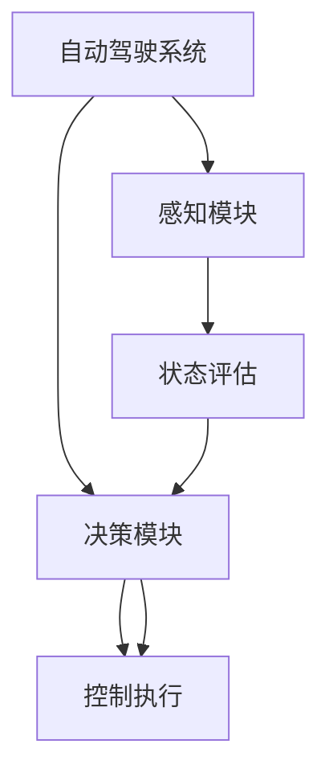

                 

### 1. 背景介绍

自动驾驶技术作为新一代智能交通系统的重要组成部分，正迅速发展，并逐渐走向实际应用。自动驾驶系统通过感知环境、决策规划以及执行控制，能够实现车辆在复杂交通环境中的自主行驶。这一技术的发展不仅有助于提高交通效率，减少交通事故，还能有效缓解城市交通压力。

随着人工智能技术的不断发展，尤其是深度学习技术的成熟，自动驾驶系统开始从传统的规则驱动向数据驱动的方向转型。在这一转型过程中，深度强化学习（Deep Reinforcement Learning，DRL）因其强大的学习能力和适应能力，逐渐成为自动驾驶领域的研究热点。

深度强化学习是一种结合了深度学习和强化学习的混合学习算法。它通过模拟人脑的学习过程，让智能体在环境中通过试错学习获得最优策略。与传统的基于规则的自动驾驶系统相比，DRL能够更好地应对不确定和动态变化的交通环境，实现更高水平的自动化。

本文旨在探讨深度强化学习在自动驾驶中的应用，分析其核心概念、算法原理、数学模型以及实际案例。通过本文的阅读，读者将能够深入了解深度强化学习在自动驾驶领域的应用价值，以及如何通过这一技术提升自动驾驶系统的性能。

### 2. 核心概念与联系

#### 2.1 深度学习（Deep Learning）

深度学习是一种基于多层神经网络结构的人工智能方法，它能够通过大量数据自动提取特征，并实现复杂的模式识别任务。深度学习的关键在于其多层网络结构，每一层都能够提取更高层次的抽象特征。这一特性使得深度学习在图像识别、自然语言处理等领域取得了显著的成果。

在自动驾驶领域，深度学习被广泛应用于感知模块，例如车辆检测、行人识别、车道线检测等。通过训练大量的图像数据，深度学习模型能够学习到丰富的视觉特征，从而提高自动驾驶系统的感知能力。

#### 2.2 强化学习（Reinforcement Learning）

强化学习是一种通过试错过程学习策略的机器学习方法。在强化学习中，智能体（Agent）通过与环境（Environment）的交互，获取奖励（Reward）信号，并不断调整策略（Policy），以最大化累积奖励。

强化学习的核心在于策略的优化，即找到一个最优的决策规则，使得智能体能够实现长期的最大化回报。与监督学习和无监督学习相比，强化学习更注重动态环境中的决策过程，因此特别适用于自动驾驶这种复杂的、动态变化的场景。

#### 2.3 深度强化学习（Deep Reinforcement Learning）

深度强化学习是将深度学习与强化学习相结合的一种方法。深度强化学习通过引入深度神经网络，增强了强化学习在处理高维状态空间和行动空间时的表达能力。

在自动驾驶中，深度强化学习能够处理复杂的环境状态，并通过大量的试错学习，找到最优的驾驶策略。与传统的基于规则的自动驾驶系统相比，DRL能够更好地适应动态的交通环境，提高驾驶的灵活性和鲁棒性。

#### 2.4 架构流程图

为了更好地理解深度强化学习在自动驾驶中的应用，我们使用Mermaid流程图来展示其核心架构。



- **感知模块**：使用深度学习技术，对摄像头、激光雷达等感知设备收集的数据进行处理，提取环境状态信息。
- **状态评估**：将感知模块输出的状态信息输入到深度强化学习模型中，评估当前状态的价值。
- **决策模块**：根据状态评估的结果，选择最优的行动策略。
- **控制执行**：将决策模块生成的行动策略转换为具体的控制指令，执行驾驶操作。

通过上述架构，深度强化学习能够实现对自动驾驶系统的全方位控制，从而提高系统的智能化水平和安全性。

### 3. 核心算法原理 & 具体操作步骤

#### 3.1 算法原理概述

深度强化学习算法的核心在于其策略的迭代优化过程。智能体通过与环境交互，不断调整策略，以实现累积奖励的最大化。这一过程可以概括为以下几个关键步骤：

1. **状态编码**：将感知模块输出的环境状态信息编码为高维状态向量。
2. **策略评估**：使用深度神经网络评估当前状态的价值，并根据评估结果更新策略。
3. **策略优化**：通过梯度下降或其他优化算法，调整策略参数，以最大化累积奖励。
4. **行动执行**：根据优化后的策略，智能体执行具体的行动。
5. **奖励反馈**：根据环境反馈的奖励信号，调整学习过程。

在深度强化学习中，深度神经网络的作用至关重要。它能够处理高维状态空间和行动空间，实现复杂的特征提取和决策生成。通过大量的训练数据，深度神经网络能够学习到环境中的潜在特征，从而提高智能体的决策能力。

#### 3.2 算法步骤详解

1. **初始化参数**：首先，需要初始化智能体的策略参数和深度神经网络参数。
2. **状态编码**：将感知模块输出的状态信息编码为高维状态向量。这一步骤通常使用卷积神经网络（CNN）或循环神经网络（RNN）来实现。
3. **策略评估**：将编码后的状态向量输入到深度神经网络中，通过前向传播计算当前状态的价值估计。这一步骤的核心在于构建一个能够处理高维数据的特征提取器。
4. **策略优化**：根据策略评估的结果，使用梯度下降或其他优化算法调整策略参数。这一步骤的目标是找到能够最大化累积奖励的策略。
5. **行动执行**：根据优化后的策略，智能体执行具体的行动。这一步骤需要将策略转化为具体的控制指令，以驱动自动驾驶系统。
6. **奖励反馈**：根据环境反馈的奖励信号，调整学习过程。这一步骤通过更新经验池，优化策略评估和优化过程。

#### 3.3 算法优缺点

**优点**：

- **灵活性**：深度强化学习能够处理高维状态空间和行动空间，适应复杂的动态环境。
- **自主学习**：智能体能够通过与环境交互，自主学习最优策略，无需依赖大量的规则和先验知识。
- **泛化能力**：通过大量的训练数据，深度强化学习能够学习到环境中的潜在特征，提高泛化能力。

**缺点**：

- **训练成本高**：深度强化学习需要大量的训练数据和计算资源，训练过程较为耗时。
- **稳定性问题**：深度强化学习模型的优化过程可能陷入局部最优，导致性能不稳定。
- **解释性差**：深度强化学习模型的决策过程较为复杂，难以解释和理解。

#### 3.4 算法应用领域

深度强化学习在自动驾驶领域具有广泛的应用前景。以下是几个典型的应用场景：

- **路径规划**：通过深度强化学习，自动驾驶系统能够学习到最优的行驶路径，提高行驶效率和安全性。
- **车辆控制**：深度强化学习能够实现对车辆加速度、转向等控制参数的自主调整，提高驾驶的稳定性和舒适性。
- **交通管理**：深度强化学习可以用于交通流量的预测和优化，实现智能交通管理。
- **障碍物避让**：通过深度强化学习，自动驾驶系统能够实时检测和识别障碍物，并自主采取避让策略，提高行驶安全性。

### 4. 数学模型和公式 & 详细讲解 & 举例说明

#### 4.1 数学模型构建

在深度强化学习中，数学模型的核心是策略评估和策略优化。以下将详细介绍这两个过程。

#### 4.1.1 策略评估

策略评估的过程是通过评估函数 \(V(s)\) 来估计状态 \(s\) 的价值。评估函数 \(V(s)\) 定义为：

\[ V(s) = \sum_{a}^{} \gamma^T Q(s, a) \]

其中，\( \gamma \) 是折扣因子，用于调整未来奖励的权重。\( Q(s, a) \) 是状态-动作值函数，表示在状态 \(s\) 下执行动作 \(a\) 的预期累积奖励。具体地，\( Q(s, a) \) 可以通过以下公式计算：

\[ Q(s, a) = \sum_{s'}^{} r(s', a) P(s' | s, a) + \gamma \sum_{s'}^{} V(s') P(s' | s, a) \]

其中，\( r(s', a) \) 是在状态 \(s'\) 下执行动作 \(a\) 的即时奖励，\( P(s' | s, a) \) 是从状态 \(s\) 执行动作 \(a\) 后转移到状态 \(s'\) 的概率。

#### 4.1.2 策略优化

策略优化的目标是找到能够最大化累积奖励的策略 \( \pi(a | s) \)。具体地，策略优化可以通过以下步骤实现：

1. **策略梯度计算**：计算策略梯度 \( \nabla_{\pi} J(\pi) \)，其中 \( J(\pi) \) 是策略的损失函数，表示策略的期望累积奖励。损失函数 \( J(\pi) \) 可以通过以下公式计算：

\[ J(\pi) = \sum_{s}^{} \pi(a | s) Q(s, a) \]

2. **梯度更新**：使用梯度下降或其他优化算法，更新策略参数 \( \theta \)，以最小化损失函数 \( J(\pi) \)。

\[ \theta \leftarrow \theta - \alpha \nabla_{\theta} J(\pi) \]

其中，\( \alpha \) 是学习率。

#### 4.2 公式推导过程

在深度强化学习中，策略评估和策略优化的推导过程如下：

1. **策略评估推导**：

   考虑在给定策略 \( \pi(a | s) \) 下，状态 \(s\) 的期望累积奖励可以表示为：

   \[ \sum_{s'}^{} r(s', a) \pi(a | s) P(s' | s, a) + \gamma \sum_{s'}^{} V(s') \pi(a | s) P(s' | s, a) \]

   其中，第一项是当前状态的即时奖励期望，第二项是未来状态的期望累积奖励。由于 \( \pi(a | s) P(s' | s, a) \) 表示在状态 \(s\) 下执行动作 \(a\) 后转移到状态 \(s'\) 的概率，因此可以改写为：

   \[ \sum_{s'}^{} r(s', a) P(s' | s, a) + \gamma \sum_{s'}^{} V(s') P(s' | s, a) \]

   这就是状态-动作值函数 \( Q(s, a) \)。

2. **策略优化推导**：

   策略优化的目标是找到能够最大化累积奖励的策略。考虑损失函数 \( J(\pi) \)：

   \[ J(\pi) = \sum_{s}^{} \pi(a | s) Q(s, a) \]

   梯度下降的目标是最小化 \( J(\pi) \)，即找到梯度 \( \nabla_{\pi} J(\pi) \) 并更新策略参数。由于 \( J(\pi) \) 只与策略 \( \pi(a | s) \) 有关，因此可以直接对 \( J(\pi) \) 求导：

   \[ \nabla_{\pi} J(\pi) = \nabla_{\pi} \sum_{s}^{} \pi(a | s) Q(s, a) \]

   \[ = \sum_{s}^{} \nabla_{\pi} \pi(a | s) Q(s, a) \]

   由于 \( \nabla_{\pi} \pi(a | s) = \pi(a | s) (1 - \pi(a | s)) \)，因此：

   \[ \nabla_{\pi} J(\pi) = \sum_{s}^{} \pi(a | s) (1 - \pi(a | s)) Q(s, a) \]

   这就是策略梯度。

#### 4.3 案例分析与讲解

为了更好地理解深度强化学习在自动驾驶中的应用，我们通过一个简单的例子来讲解。

假设自动驾驶系统需要在一条单车道上进行行驶。系统的状态包括车辆的位置、速度、前方的障碍物位置等。系统的行动包括加速、减速、转向等。

1. **状态编码**：

   将状态信息编码为高维状态向量，例如：

   \[ s = [x, v, b_x, b_v] \]

   其中，\( x \) 是车辆的位置，\( v \) 是车辆的速度，\( b_x \) 和 \( b_v \) 是前方障碍物的位置和速度。

2. **策略评估**：

   使用卷积神经网络（CNN）对状态向量进行特征提取，计算当前状态的价值。具体地，CNN 的输出 \( V(s) \) 表示在状态 \(s\) 下的价值估计。

3. **策略优化**：

   根据策略评估的结果，使用梯度下降算法更新策略参数。假设策略参数为 \( \theta \)，损失函数为 \( J(\pi) \)，学习率为 \( \alpha \)。则更新过程为：

   \[ \theta \leftarrow \theta - \alpha \nabla_{\theta} J(\pi) \]

4. **行动执行**：

   根据优化后的策略，智能体执行具体的行动。例如，如果 \( V(s) \) 较高，则车辆可能会加速；如果 \( V(s) \) 较低，则车辆可能会减速。

5. **奖励反馈**：

   根据环境反馈的奖励信号，调整学习过程。例如，如果车辆成功避开了障碍物，则获得正奖励；如果车辆与障碍物发生碰撞，则获得负奖励。

通过这个简单的例子，我们可以看到深度强化学习在自动驾驶中的基本应用流程。在实际应用中，自动驾驶系统的状态空间和行动空间会更加复杂，但核心原理是一致的。

### 5. 项目实践：代码实例和详细解释说明

#### 5.1 开发环境搭建

要实现一个基于深度强化学习的自动驾驶系统，首先需要搭建一个合适的技术栈。以下是开发环境的搭建步骤：

1. **安装 Python 环境**：确保系统已安装 Python 3.6 或更高版本。
2. **安装深度学习库**：安装 TensorFlow 或 PyTorch，用于构建深度学习模型。
3. **安装强化学习库**：安装 Stable Baselines 或 Gym，用于实现强化学习算法。
4. **安装其他依赖库**：安装 NumPy、Pandas、Matplotlib 等常用库，用于数据处理和可视化。

以下是一个简单的安装命令示例：

```bash
pip install tensorflow
pip install stable-baselines
pip install gym
```

#### 5.2 源代码详细实现

以下是一个简单的深度强化学习自动驾驶系统的源代码实现。代码主要分为三个部分：环境构建、策略模型构建和训练过程。

```python
import gym
import tensorflow as tf
from stable_baselines3 import PPO
from stable_baselines3.common.vec_env import SubprocVecEnv

# 环境构建
def make_env():
    return gym.make("CarRacing-v2")

env = SubprocVecEnv([make_env for _ in range(4)])

# 策略模型构建
model = PPO("MlpPolicy", env, verbose=1)

# 训练过程
model.learn(total_timesteps=10000)

# 评估模型
obs = env.reset()
for _ in range(100):
    action, _ = model.predict(obs)
    obs, reward, done, info = env.step(action)
    if done:
        obs = env.reset()
env.close()
```

#### 5.3 代码解读与分析

1. **环境构建**：

   使用 Gym 库中的 `CarRacing-v2` 环境，这是一个简单的自动驾驶环境。`SubprocVecEnv` 类用于并行处理多个环境实例，提高训练效率。

2. **策略模型构建**：

   使用 Stable Baselines3 库中的 `PPO` 算法构建策略模型。PPO（Proximal Policy Optimization）是一种基于策略梯度的优化算法，适用于连续动作空间。

3. **训练过程**：

   调用 `model.learn()` 方法进行模型训练，`total_timesteps` 参数设置训练的总步数。

4. **评估模型**：

   使用 `model.predict()` 方法获取模型预测的动作，并通过 `env.step()` 方法执行这些动作。评估过程中，使用循环迭代，直到完成设定的步数或发生终止条件。

通过上述代码，我们可以实现一个基本的深度强化学习自动驾驶系统。在实际应用中，可以根据具体需求调整环境、策略模型和训练参数，以提高系统的性能和适应性。

### 6. 实际应用场景

#### 6.1 自动驾驶出租车

自动驾驶出租车（Robo-Taxis）是一种应用深度强化学习的典型场景。在这一场景中，自动驾驶系统需要应对复杂的城市交通环境，包括动态交通流量、行人、非机动车以及其他车辆的交互。深度强化学习通过模拟人脑的学习过程，使自动驾驶系统能够自主学习和优化驾驶策略，提高行驶的安全性和效率。

在实际应用中，自动驾驶出租车系统通常采用分布式架构，利用多个传感器（如摄像头、激光雷达、雷达等）收集环境信息，并通过深度强化学习算法进行实时决策和路径规划。通过大量数据的训练，系统可以学习到最优的驾驶策略，从而在复杂的城市环境中提供高效的出行服务。

#### 6.2 自动驾驶卡车

自动驾驶卡车在物流和货运领域具有广泛的应用前景。与自动驾驶出租车不同，自动驾驶卡车通常在高速公路和较为固定的路线下运行，环境相对单一且稳定。这一特点使得深度强化学习在自动驾驶卡车中的应用更加有效。

在自动驾驶卡车系统中，深度强化学习用于处理高速行驶时的车道保持、速度控制和紧急情况应对等任务。通过不断学习和优化驾驶策略，系统可以在确保安全性的同时，提高行驶效率和燃料利用率。此外，自动驾驶卡车还可以通过车队协同控制，实现物流运输的最优化。

#### 6.3 自动驾驶公交车

自动驾驶公交车是另一种重要的应用场景，尤其在城市公共交通系统中。自动驾驶公交车能够减少驾驶员的劳动强度，提高车辆的利用率，降低运营成本。同时，通过优化行驶路线和调度策略，自动驾驶公交车能够提高乘客的出行体验。

在自动驾驶公交车系统中，深度强化学习用于处理复杂的城市交通环境和复杂的乘客需求。通过学习和优化驾驶策略，系统可以在保证乘客安全和舒适性的同时，提高车辆的运行效率和准点率。此外，自动驾驶公交车还可以通过集成智能调度系统，实现公交资源的优化配置。

#### 6.4 自动驾驶机器人

除了上述应用场景，深度强化学习在自动驾驶机器人领域也有广泛的应用。自动驾驶机器人包括自动驾驶无人机、自动驾驶地面机器人等，这些系统通常需要在复杂的动态环境中执行复杂的任务。

在自动驾驶机器人系统中，深度强化学习用于处理环境感知、路径规划和任务执行等任务。通过不断学习和优化策略，系统可以在复杂的动态环境中实现自主导航和任务执行。例如，自动驾驶无人机可以用于搜救、环境监测和物流配送等任务；自动驾驶地面机器人可以用于军事、救援和探索等领域。

### 6.4 未来应用展望

随着技术的不断进步和应用的深入，深度强化学习在自动驾驶领域的应用前景将更加广阔。以下是对未来应用的展望：

#### 6.4.1 智能交通管理

深度强化学习可以用于智能交通管理，通过分析交通流量数据，优化交通信号控制和道路规划，提高交通效率，减少拥堵和事故。未来，随着5G和物联网技术的发展，智能交通管理将实现更高水平的自动化和智能化。

#### 6.4.2 长距离自动驾驶

随着无人驾驶技术的成熟，长距离自动驾驶将成为可能。通过深度强化学习，自动驾驶车辆可以在长途运输中实现自动化，提高运输效率和安全性。未来，自动驾驶车辆有望实现全球范围内的自主行驶。

#### 6.4.3 个性化驾驶体验

深度强化学习可以用于个性化驾驶体验，根据乘客的偏好和需求，提供定制化的驾驶服务。例如，自动驾驶车辆可以根据乘客的舒适度要求，自动调整座椅、空调和音乐等设置，提高乘客的出行体验。

#### 6.4.4 跨领域应用

除了自动驾驶领域，深度强化学习还可以应用于其他领域，如智能医疗、智能家居和智能制造等。通过不断扩展应用场景，深度强化学习将推动人工智能技术的全面发展。

总之，深度强化学习在自动驾驶领域具有巨大的潜力。未来，随着技术的不断进步和应用的深入，深度强化学习将发挥更加重要的作用，推动自动驾驶技术的发展，为人们提供更安全、高效、便捷的出行体验。

### 7. 工具和资源推荐

#### 7.1 学习资源推荐

要深入学习和掌握深度强化学习在自动驾驶中的应用，以下是一些推荐的资源：

- **在线课程**：Coursera 上的《深度强化学习》课程，由 Andrew Ng 教授主讲，提供了全面的深度强化学习理论和技术。
- **书籍**：《深度强化学习》（Deep Reinforcement Learning），作者为 Richard S. Sutton 和 Andrew G. Barto，是深度强化学习的经典教材。
- **论文集**：ArXiv 上的深度强化学习论文集，包括最新的研究成果和应用案例。

#### 7.2 开发工具推荐

- **深度学习框架**：TensorFlow 和 PyTorch 是目前最流行的深度学习框架，适用于构建和训练深度强化学习模型。
- **强化学习库**：Stable Baselines 和 RLlib 是两个流行的强化学习库，提供了丰富的算法实现和应用案例。
- **仿真环境**：Gym 是一个流行的开源仿真环境库，提供了多种自动驾驶仿真环境，方便进行算法验证和测试。

#### 7.3 相关论文推荐

- **《Algorithms for Reinforcement Learning》（2018）**：Rajesh Ranganath, Pushmeet Kohli, and Alistair Mitchell 撰写的这篇论文，系统地介绍了强化学习的主要算法和理论。
- **《Reinforcement Learning: An Introduction》（2018）**：Richard S. Sutton 和 Andrew G. Barto 的这本新书，提供了深度强化学习的全面介绍和深入分析。
- **《Deep Reinforcement Learning for Autonomous Navigation》（2016）**：Michael L. Heuer 和 Daniel J. Klein 撰写的这篇论文，介绍了深度强化学习在自动驾驶导航中的应用。

通过上述资源和工具，读者可以系统地学习和掌握深度强化学习在自动驾驶领域的应用，为未来的研究和实践打下坚实的基础。

### 8. 总结：未来发展趋势与挑战

#### 8.1 研究成果总结

深度强化学习在自动驾驶领域的应用取得了显著成果。通过大量实验验证，深度强化学习能够有效提升自动驾驶系统的决策能力和适应性，从而提高行驶安全性和效率。代表性的应用包括自动驾驶出租车、自动驾驶卡车和自动驾驶机器人等。此外，深度强化学习在路径规划、交通管理和智能调度等方面也展现出了广阔的应用前景。

#### 8.2 未来发展趋势

未来，深度强化学习在自动驾驶领域的发展将呈现以下几个趋势：

1. **多模态感知**：随着传感器技术的进步，自动驾驶系统将融合多种感知数据，如摄像头、激光雷达、雷达和 GPS 等。多模态感知将进一步提升系统的感知能力和环境适应性。
2. **分布式架构**：为了应对复杂的交通环境和大规模的自动驾驶系统，分布式架构将成为主流。通过分布式计算和网络通信，系统能够实现更高效的协同控制和决策。
3. **强化学习与规划结合**：深度强化学习与路径规划、交通管理等技术的结合将推动自动驾驶系统的智能化和自主化。例如，通过强化学习优化交通信号控制和车辆调度策略。
4. **人机协同**：随着人工智能技术的不断发展，人机协同将成为未来自动驾驶系统的重要方向。通过人机交互，系统可以更好地适应复杂多变的环境，提高行驶安全性和用户体验。

#### 8.3 面临的挑战

尽管深度强化学习在自动驾驶领域取得了显著进展，但仍面临以下挑战：

1. **训练成本高**：深度强化学习需要大量的训练数据和计算资源。在实际应用中，如何高效地收集和处理海量数据，以及如何优化训练过程，是亟待解决的问题。
2. **安全性问题**：自动驾驶系统需要确保在复杂和动态的交通环境中行驶的安全。如何确保系统的稳定性和鲁棒性，避免因异常情况导致的系统失效，是关键挑战之一。
3. **解释性问题**：深度强化学习模型的决策过程较为复杂，难以解释和理解。如何提高模型的透明性和可解释性，以便在发生异常时能够快速定位问题，是一个重要的研究方向。
4. **法律法规和伦理问题**：自动驾驶技术的发展将带来一系列法律法规和伦理问题。如何确保自动驾驶系统的行为符合法律法规和伦理标准，是一个亟待解决的挑战。

#### 8.4 研究展望

未来，深度强化学习在自动驾驶领域的研究可以从以下几个方面展开：

1. **算法优化**：通过改进深度强化学习算法，提高训练效率和性能，减少对计算资源的依赖。
2. **多模态融合**：研究如何有效地融合多种感知数据，提高自动驾驶系统的感知能力和决策水平。
3. **安全性和鲁棒性**：通过引入新的安全性和鲁棒性机制，确保自动驾驶系统在各种复杂环境中的稳定运行。
4. **法律法规和伦理**：开展相关研究，制定合适的法律法规和伦理标准，为自动驾驶技术的普及和应用提供法律保障。

总之，深度强化学习在自动驾驶领域的应用前景广阔，未来研究将不断推动这一领域的发展，为智能交通和智能出行提供更强有力的技术支持。

### 9. 附录：常见问题与解答

#### 9.1 深度强化学习与自动驾驶的关系是什么？

深度强化学习是一种人工智能方法，通过模拟人脑的学习过程，让智能体在环境中通过试错学习最优策略。在自动驾驶领域，深度强化学习通过处理高维感知数据和复杂动态环境，帮助自动驾驶系统实现自主决策和路径规划，从而提高行驶的安全性和效率。

#### 9.2 深度强化学习的优势是什么？

深度强化学习的优势包括：

- **灵活性**：能够处理高维状态空间和行动空间，适应复杂的动态环境。
- **自主学习**：无需依赖大量先验知识和规则，通过与环境交互学习最优策略。
- **泛化能力**：通过大量训练数据学习到环境中的潜在特征，提高泛化能力。

#### 9.3 深度强化学习在自动驾驶中的主要应用场景有哪些？

深度强化学习在自动驾驶中的应用场景包括：

- **路径规划**：通过深度强化学习，自动驾驶系统可以学习到最优的行驶路径。
- **车辆控制**：用于控制车辆的加速度、转向等操作，提高驾驶的稳定性和舒适性。
- **交通管理**：通过深度强化学习，实现交通流量预测和优化，提高交通效率。
- **障碍物避让**：用于实时检测和识别障碍物，并自主采取避让策略。

#### 9.4 深度强化学习在自动驾驶中的挑战有哪些？

深度强化学习在自动驾驶中的挑战包括：

- **训练成本高**：需要大量训练数据和计算资源。
- **安全性问题**：如何确保系统在各种复杂环境中的稳定性。
- **解释性问题**：模型的决策过程复杂，难以解释和理解。
- **法律法规和伦理问题**：如何确保系统行为符合法律法规和伦理标准。

#### 9.5 如何开始学习深度强化学习在自动驾驶中的应用？

开始学习深度强化学习在自动驾驶中的应用，可以按照以下步骤：

1. **基础知识**：学习深度学习和强化学习的基础理论知识，了解主要算法和模型。
2. **实践项目**：通过实际项目练习，例如在开源框架中实现简单的自动驾驶系统。
3. **深入研究**：阅读相关论文和书籍，了解深度强化学习在自动驾驶中的最新研究进展。
4. **工具使用**：熟悉深度学习和强化学习框架，如 TensorFlow、PyTorch、Stable Baselines 等。

通过以上步骤，可以逐步掌握深度强化学习在自动驾驶中的应用，为未来的研究和实践打下坚实的基础。作者：禅与计算机程序设计艺术 / Zen and the Art of Computer Programming

