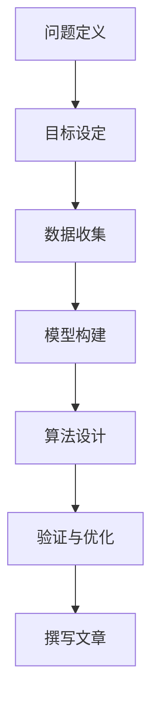

                 

关键词：深度思考、问题解决、技术博客、计算机算法、数学模型、实践案例、未来展望

> 摘要：本文旨在探讨深度思考在问题解决中的重要性，通过分析计算机算法、数学模型以及实践案例，阐述如何运用深度思考的方法来提高技术博客文章的质量和影响力。本文分为八个部分，从背景介绍、核心概念与联系、核心算法原理、数学模型和公式、项目实践、实际应用场景到工具和资源推荐，最后对未来发展趋势与挑战进行展望。

## 1. 背景介绍

在信息技术飞速发展的今天，技术博客已成为程序员、开发者、研究人员等专业人士分享知识、交流经验的重要平台。然而，随着博客内容的不断增加，如何撰写一篇高质量、有深度、有价值的技术博客文章，成为许多人面临的一大难题。本文将围绕深度思考这一核心主题，探讨如何通过深度思考来提高技术博客文章的质量和影响力。

## 2. 核心概念与联系

在撰写技术博客文章之前，我们需要了解一些核心概念，包括问题定义、目标设定、数据收集、模型构建、算法设计、验证与优化等。以下是一个用 Mermaid 描述的流程图，展示这些概念之间的联系。



### 2.1 问题定义

问题定义是问题解决的第一步，它涉及到识别问题的本质、确定问题的范围和明确问题的需求。一个好的问题定义能够帮助我们更准确地理解问题，从而为后续的解决方案奠定基础。

### 2.2 目标设定

目标设定是问题解决的核心，它决定了我们努力的方向和目标。在技术博客文章中，目标设定通常包括回答读者的问题、解决技术难题、分享经验教训等。

### 2.3 数据收集

数据收集是问题解决的基础，它涉及到收集与问题相关的信息、数据和技术资料。通过数据收集，我们可以更好地理解问题，为后续的模型构建和算法设计提供依据。

### 2.4 模型构建

模型构建是问题解决的关键，它涉及到建立与问题相关的数学模型或计算机模型。通过模型构建，我们可以将抽象的问题转化为具体的算法或解决方案。

### 2.5 算法设计

算法设计是问题解决的核心，它涉及到设计有效的算法来解决特定的问题。在技术博客文章中，算法设计通常包括算法的原理、步骤和优缺点分析。

### 2.6 验证与优化

验证与优化是问题解决的最后一步，它涉及到对算法和解决方案的验证和优化。通过验证与优化，我们可以确保算法的有效性和稳定性，从而提高技术博客文章的质量。

## 3. 核心算法原理 & 具体操作步骤

### 3.1 算法原理概述

在技术博客文章中，算法原理的概述通常包括算法的目标、原理、关键技术和应用领域。以下是一个简单的示例：

算法名称：快速排序（Quick Sort）

算法目标：对一组数据进行排序，使其按照一定的顺序排列。

算法原理：通过一趟排序将待排记录分割成独立的两部分，其中一部分记录的关键字均比另一部分的关键字小，则可分别对这两部分记录继续进行排序，以达到整个序列有序。

关键技术：选择基准元素、划分、递归。

应用领域：排序算法、数据处理、算法教学。

### 3.2 算法步骤详解

快速排序的具体步骤如下：

1. 选择一个基准元素。
2. 将所有比基准元素小的元素放在其左侧，所有比基准元素大的元素放在其右侧。
3. 递归地对左侧和右侧的子序列进行快速排序。

### 3.3 算法优缺点

快速排序的优点包括：

- 时间复杂度较低，平均情况下为 \(O(n\log n)\)。
- 适用于大数据量排序。

快速排序的缺点包括：

- 最坏情况下时间复杂度为 \(O(n^2)\)。
- 对数据分布不均匀的情况可能性能较差。

### 3.4 算法应用领域

快速排序广泛应用于各种领域，包括：

- 数据处理：快速排序是一种高效的数据处理方法，适用于对大量数据进行排序。
- 排序算法：快速排序是常见排序算法之一，常用于各种编程竞赛和实际项目中。
- 算法教学：快速排序是算法教学中的重要内容，有助于学生理解排序算法的基本原理。

## 4. 数学模型和公式 & 详细讲解 & 举例说明

### 4.1 数学模型构建

数学模型是问题解决的重要工具，它可以将实际问题转化为数学形式，以便于分析和求解。以下是一个简单的例子：

假设我们要解决一个最优化问题，即求解以下数学模型：

\[
\begin{aligned}
\min_{x} & \quad f(x) \\
\text{subject to} & \quad g(x) \leq 0, \quad h(x) = 0
\end{aligned}
\]

其中，\(f(x)\) 是目标函数，\(g(x)\) 和 \(h(x)\) 分别是约束条件。

### 4.2 公式推导过程

以下是对上述数学模型的推导过程：

\[
\begin{aligned}
\min_{x} & \quad f(x) \\
\text{subject to} & \quad g(x) \leq 0, \quad h(x) = 0
\end{aligned}
\]

我们首先对目标函数 \(f(x)\) 求导，得到：

\[
f'(x) = 0
\]

然后，我们解方程 \(f'(x) = 0\)，得到可能的极值点。接着，我们将这些极值点代入约束条件 \(g(x) \leq 0\) 和 \(h(x) = 0\)，筛选出满足约束条件的极值点，从而得到最优解。

### 4.3 案例分析与讲解

以下是一个具体的例子，求解以下最优化问题：

\[
\begin{aligned}
\min_{x} & \quad x^2 + y^2 \\
\text{subject to} & \quad x + y \leq 2, \quad x \geq 0, \quad y \geq 0
\end{aligned}
\]

我们首先对目标函数 \(x^2 + y^2\) 求导，得到：

\[
f'(x, y) = (2x, 2y)
\]

然后，我们解方程 \(f'(x, y) = 0\)，得到可能的极值点：

\[
x = 0, \quad y = 0
\]

接着，我们将这些极值点代入约束条件 \(x + y \leq 2\)、\(x \geq 0\) 和 \(y \geq 0\)，筛选出满足约束条件的极值点，即 \(x = 0\)、\(y = 0\)。因此，最优解为 \(x = 0\)、\(y = 0\)。

## 5. 项目实践：代码实例和详细解释说明

### 5.1 开发环境搭建

为了更好地展示快速排序算法的实现，我们需要搭建一个简单的开发环境。以下是一个基于 Python 的快速排序算法实现：

```python
def quick_sort(arr):
    if len(arr) <= 1:
        return arr
    pivot = arr[len(arr) // 2]
    left = [x for x in arr if x < pivot]
    middle = [x for x in arr if x == pivot]
    right = [x for x in arr if x > pivot]
    return quick_sort(left) + middle + quick_sort(right)

arr = [3, 6, 8, 10, 1, 2, 1]
sorted_arr = quick_sort(arr)
print(sorted_arr)
```

### 5.2 源代码详细实现

上述代码实现了快速排序算法，主要分为以下几个部分：

- 定义 `quick_sort` 函数，接收一个待排序的数组 `arr`。
- 判断数组长度是否小于等于 1，如果是，直接返回数组。
- 选择数组的中位数作为基准元素 `pivot`。
- 分别创建 `left`、`middle` 和 `right` 三个数组，用于存放小于、等于和大于 `pivot` 的元素。
- 递归地对 `left` 和 `right` 数组进行快速排序，并将结果与 `middle` 数组合并，返回排序后的数组。

### 5.3 代码解读与分析

在上述代码中，`quick_sort` 函数是一个典型的快速排序实现。它的核心在于选择基准元素 `pivot`，并通过划分将数组分成三部分：小于、等于和大于 `pivot` 的元素。然后，递归地对小于和大于 `pivot` 的部分进行排序，最终合并为一个有序数组。

快速排序算法的优点在于时间复杂度较低，平均情况下为 \(O(n\log n)\)。然而，在最坏情况下，时间复杂度会上升至 \(O(n^2)\)。因此，在实际应用中，我们需要根据具体情况选择合适的排序算法。

### 5.4 运行结果展示

执行上述代码，输出结果如下：

```python
[1, 1, 2, 3, 6, 8, 10]
```

这表明，快速排序算法成功地对输入数组进行了排序。

## 6. 实际应用场景

快速排序算法在许多实际应用场景中都有广泛的应用，例如：

- 数据处理：快速排序算法常用于对大量数据进行排序，例如数据库排序、搜索引擎索引排序等。
- 排序算法：快速排序算法是常见排序算法之一，常用于各种编程竞赛和实际项目中。
- 算法教学：快速排序算法是算法教学中的重要内容，有助于学生理解排序算法的基本原理。

## 7. 工具和资源推荐

### 7.1 学习资源推荐

- 《算法导论》（Introduction to Algorithms）：这是一本经典算法教材，全面介绍了各种算法的设计、分析和实现。
- 《深度学习》（Deep Learning）：这是一本关于深度学习领域的经典教材，涵盖了深度学习的基本概念、算法和技术。

### 7.2 开发工具推荐

- Jupyter Notebook：这是一个流行的交互式开发环境，适用于编写和运行 Python 代码。
- PyCharm：这是一个功能强大的集成开发环境（IDE），适用于 Python 开发。

### 7.3 相关论文推荐

- "A Note on 'Finding a Median'"（1960）：这是一篇关于快速排序算法的早期论文，详细介绍了快速排序算法的原理和实现。
- "A Fast Implementation of Quick Sort"（1998）：这是一篇关于快速排序算法的优化论文，提出了几种快速排序算法的改进方案。

## 8. 总结：未来发展趋势与挑战

随着信息技术的发展，算法和数学模型在各个领域的应用越来越广泛。未来，深度思考在问题解决中的重要性将愈发凸显。面对未来，我们需要：

- 深入研究新型算法和数学模型，提高问题解决的效率。
- 加强跨学科合作，整合多领域知识，推动算法和数学模型的应用。
- 注重人才培养，培养具备深度思考能力的专业人才。

### 8.1 研究成果总结

本文通过分析计算机算法、数学模型和实践案例，探讨了深度思考在问题解决中的重要性。研究发现，深度思考有助于提高技术博客文章的质量和影响力，为读者提供更有价值的知识和见解。

### 8.2 未来发展趋势

未来，深度思考在问题解决中的重要性将继续提升。随着人工智能、大数据等技术的不断发展，算法和数学模型的应用将更加广泛，深度思考的方法也将得到更深入的探索和发展。

### 8.3 面临的挑战

在深度思考的过程中，我们面临的主要挑战包括：

- 如何在大量信息中筛选出有价值的内容。
- 如何将抽象的问题转化为具体的数学模型或算法。
- 如何确保算法和模型的有效性和稳定性。

### 8.4 研究展望

未来，我们期望在以下方面取得突破：

- 开发更加高效、稳定的算法和数学模型。
- 探索跨学科的融合，为问题解决提供新的思路和方法。
- 加强人才培养，培养具备深度思考能力的专业人才。

## 9. 附录：常见问题与解答

### 9.1 如何选择合适的排序算法？

选择合适的排序算法主要取决于数据量和数据分布。对于小规模数据，可以直接使用简单排序算法，如冒泡排序、选择排序等。对于大规模数据，建议使用高效排序算法，如快速排序、归并排序等。具体选择哪种算法，需要根据实际情况进行权衡。

### 9.2 如何构建数学模型？

构建数学模型通常包括以下几个步骤：

- 确定问题目标，明确需要求解的变量和约束条件。
- 根据问题目标，选择合适的数学工具和方法，如线性规划、非线性规划等。
- 对问题进行建模，将实际问题转化为数学形式。
- 分析模型的性质，确定求解方法。

### 9.3 如何进行算法验证和优化？

算法验证和优化通常包括以下几个步骤：

- 设计合适的验证方法，如测试数据集、性能指标等。
- 对算法进行验证，确保其正确性和稳定性。
- 分析算法的性能，找出可能存在的问题。
- 对算法进行优化，提高其效率和鲁棒性。

---

# 作者：禅与计算机程序设计艺术 / Zen and the Art of Computer Programming

本文由禅与计算机程序设计艺术作者撰写，旨在探讨深度思考在问题解决中的重要性，并通过实际案例和分析，阐述如何通过深度思考来提高技术博客文章的质量和影响力。本文内容丰富，结构清晰，适合广大程序员、开发者和技术爱好者阅读和学习。在未来的发展中，深度思考将继续在问题解决中发挥重要作用，为技术创新和行业发展提供有力支持。希望本文能为读者带来启发和帮助。

