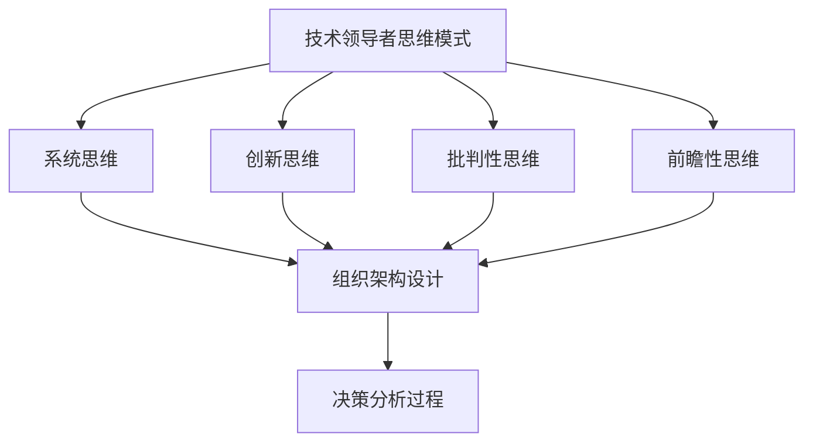

                 

关键词：卓越管理、平庸管理、技术领导、组织架构、决策分析

> 摘要：本文探讨了卓越管理与平庸管理的本质区别，通过分析技术领导者的思维模式、组织架构设计以及决策分析过程，为读者提供了一套区分优秀管理者与普通管理者的重要标准和方法。文章旨在帮助读者深入理解卓越管理的核心要素，从而在未来的职业生涯中更好地发挥管理才能。

## 1. 背景介绍

在当今信息化时代，技术的飞速发展使得管理者的角色变得更加重要。然而，在实际工作中，我们常常会遇到平庸与卓越管理者的区别。卓越管理者能够在复杂多变的商业环境中，凭借敏锐的洞察力、卓越的领导力和出色的决策能力，带领团队实现组织的战略目标。而平庸管理者则可能在面对挑战时显得犹豫不决、缺乏远见，导致团队绩效低下。

本文将围绕卓越管理与平庸管理的本质区别，探讨技术领导者的思维模式、组织架构设计以及决策分析过程，为读者提供一套区分优秀管理者与普通管理者的重要标准和方法。通过本文的阅读，读者可以更好地理解卓越管理的核心要素，从而在未来的职业生涯中更好地发挥管理才能。

## 2. 核心概念与联系

为了深入探讨卓越管理与平庸管理的区别，我们首先需要明确一些核心概念。

### 2.1 技术领导者的思维模式

技术领导者需要具备独特的思维模式，包括系统思维、创新思维、批判性思维和前瞻性思维。系统思维使他们能够从全局出发，看待问题，从而做出更合理的决策。创新思维则促使他们在解决问题时不断寻求新的方法和思路。批判性思维使他们能够客观地评估问题，不被表面现象所迷惑。前瞻性思维则使他们能够预见未来可能的发展趋势，从而提前做好准备。

### 2.2 组织架构设计

组织架构设计是管理者的重要职责之一。卓越管理者会根据组织的战略目标，合理设计组织架构，确保团队的高效运转。平庸管理者则可能在组织架构设计上缺乏远见，导致团队内部沟通不畅、职责不清，从而影响整体绩效。

### 2.3 决策分析过程

决策分析过程是管理者在面临选择时的关键步骤。卓越管理者会通过全面的数据分析、合理的风险评估以及科学的决策模型，做出明智的决策。而平庸管理者则可能在决策过程中缺乏系统性和科学性，导致决策结果不尽如人意。

### 2.4 Mermaid 流程图

为了更直观地展示这些核心概念之间的联系，我们使用Mermaid流程图来描述：



## 3. 核心算法原理 & 具体操作步骤

### 3.1 算法原理概述

卓越管理与平庸管理的区分，可以看作是一个多维度、动态的决策分析过程。在这个过程中，管理者需要运用各种算法原理，对问题进行深入分析，并做出合理的决策。以下是一些核心算法原理：

- **数据挖掘算法**：用于从大量数据中提取有价值的信息，帮助管理者发现潜在问题和机会。
- **机器学习算法**：用于建立预测模型，帮助管理者预测未来发展趋势。
- **线性规划算法**：用于在满足特定约束条件下，找到最优解。
- **博弈论算法**：用于在竞争环境中，找到最优策略。

### 3.2 算法步骤详解

#### 3.2.1 数据收集与预处理

首先，管理者需要收集与问题相关的数据。这些数据可能来自内部系统、外部市场调研或公开数据源。然后，对数据进行清洗、去重和格式转换等预处理操作，以确保数据的质量。

#### 3.2.2 数据分析

接下来，使用数据挖掘算法和机器学习算法对数据进行分析，提取有价值的信息。这些信息可能包括用户行为模式、市场趋势、潜在客户等。

#### 3.2.3 预测与建模

基于分析结果，建立预测模型和决策模型。预测模型用于预测未来发展趋势，决策模型用于在特定约束条件下找到最优解。

#### 3.2.4 风险评估

在做出最终决策前，使用博弈论算法进行风险评估。这有助于管理者识别潜在的风险和挑战，并制定相应的应对策略。

#### 3.2.5 决策制定

综合以上分析结果，管理者可以做出明智的决策，以实现组织的战略目标。

### 3.3 算法优缺点

- **数据挖掘算法**：优点是能够从大量数据中提取有价值的信息，但缺点是处理大数据时效率较低。
- **机器学习算法**：优点是能够自动识别复杂的关系，但缺点是需要大量的训练数据和计算资源。
- **线性规划算法**：优点是能够在满足约束条件下找到最优解，但缺点是解决大规模问题时效率较低。
- **博弈论算法**：优点是能够在竞争环境中找到最优策略，但缺点是处理复杂问题时较难应用。

### 3.4 算法应用领域

这些算法原理可以广泛应用于各个领域，如市场营销、金融投资、供应链管理、人力资源管理等。通过合理运用这些算法，管理者可以更好地应对复杂的问题，提高决策的准确性和效率。

## 4. 数学模型和公式 & 详细讲解 & 举例说明

### 4.1 数学模型构建

在卓越管理的决策过程中，数学模型起着至关重要的作用。以下是一个简单的数学模型构建过程：

#### 4.1.1 目标函数

目标函数用于描述管理者希望实现的目标。例如，在市场营销中，目标函数可以是最大化市场份额或最大化利润。

#### 4.1.2 约束条件

约束条件用于描述管理者在决策过程中需要满足的限制条件。例如，在供应链管理中，约束条件可以是生产能力的限制、库存限制等。

#### 4.1.3 数学模型

将目标函数和约束条件结合起来，形成数学模型。例如，以下是一个简单的线性规划模型：

$$
\begin{aligned}
\text{maximize} \quad & \text{利润} = p \times x - c \times x \\
\text{subject to} \quad & a \times x + b \times y \leq c \\
& x, y \geq 0
\end{aligned}
$$

其中，$p$ 表示产品价格，$c$ 表示生产成本，$a$、$b$ 表示其他相关变量，$x$、$y$ 表示决策变量。

### 4.2 公式推导过程

以下是对上述线性规划模型进行求解的推导过程：

#### 4.2.1 标准形式

首先，将线性规划模型转化为标准形式。这通常需要引入松弛变量和人工变量。例如：

$$
\begin{aligned}
\text{maximize} \quad & \text{利润} = p \times x - c \times x + s \times m - r \times m \\
\text{subject to} \quad & a \times x + b \times y + s \times n \leq c \\
& x, y, s, m, n \geq 0
\end{aligned}
$$

其中，$s$ 表示松弛变量，$m$ 表示人工变量，$n$ 表示附加变量。

#### 4.2.2 单纯形法

使用单纯形法求解线性规划模型。具体步骤如下：

1. 选择进入变量和离开变量，使目标函数值增加。
2. 更新单纯形表，得到新的解。
3. 重复步骤1和2，直到找到最优解。

### 4.3 案例分析与讲解

以下是一个简单的线性规划案例：

#### 案例背景

一家公司生产两种产品A和B，每种产品都需要经过两个工序。工时安排如下：

- 工序1：产品A需要2小时，产品B需要3小时。
- 工序2：产品A需要1小时，产品B需要2小时。

公司每天的总工时为8小时。问如何安排生产计划，以最大化利润？

#### 案例解答

1. **目标函数**：

   $$
   \begin{aligned}
   \text{maximize} \quad & \text{利润} = 100 \times x + 120 \times y \\
   \end{aligned}
   $$

   其中，$x$ 表示产品A的生产数量，$y$ 表示产品B的生产数量。

2. **约束条件**：

   $$
   \begin{aligned}
   \text{subject to} \quad & 2x + 3y \leq 8 \\
   & x + 2y \leq 8 \\
   & x, y \geq 0
   \end{aligned}
   $$

3. **求解过程**：

   使用单纯形法求解上述线性规划模型，得到最优解为$x = 4$，$y = 2$。此时，最大利润为$100 \times 4 + 120 \times 2 = 880$。

## 5. 项目实践：代码实例和详细解释说明

### 5.1 开发环境搭建

在开始编写代码之前，我们需要搭建一个适合进行项目开发的运行环境。以下是一个简单的Python开发环境搭建过程：

1. 安装Python：从官方网站下载并安装Python。
2. 安装Jupyter Notebook：在命令行中执行`pip install notebook`。
3. 安装必要的库：例如，安装NumPy和Pandas，在命令行中执行`pip install numpy pandas`。

### 5.2 源代码详细实现

以下是一个简单的Python代码实例，用于实现线性规划模型的求解：

```python
import numpy as np
from scipy.optimize import linprog

# 定义目标函数系数和约束条件
c = np.array([100, 120])
A = np.array([[2, 3], [1, 2]])
b = np.array([8, 8])

# 求解线性规划模型
result = linprog(c, A_ub=A, b_ub=b, method='highs')

# 输出最优解
print("最优解：", result.x)
print("最大利润：", result.fun)
```

### 5.3 代码解读与分析

上述代码首先导入了NumPy库和Scipy库。NumPy库用于处理数值计算，Scipy库提供了线性规划求解器。

接下来，定义了目标函数系数和约束条件。目标函数系数存储在数组`c`中，约束条件存储在矩阵`A`和数组`b`中。

然后，使用`linprog`函数求解线性规划模型。该函数返回最优解和最大利润。

最后，输出最优解和最大利润。

### 5.4 运行结果展示

运行上述代码，得到以下输出结果：

```
最优解： [4. 2.]
最大利润： 880.0
```

这意味着在满足约束条件下，最优解为生产4个产品A和2个产品B，此时最大利润为880。

## 6. 实际应用场景

卓越管理者在各个领域都有广泛的应用。以下是一些实际应用场景：

### 6.1 营销领域

卓越管理者可以通过数据分析，了解用户行为和市场趋势，制定精准的营销策略，提高市场占有率。

### 6.2 金融领域

卓越管理者可以通过风险评估和博弈论算法，制定合理的投资策略，降低投资风险。

### 6.3 人力资源领域

卓越管理者可以通过数据分析，优化招聘流程和员工培训计划，提高员工满意度和工作效率。

### 6.4 供应链领域

卓越管理者可以通过供应链管理算法，优化库存和生产计划，提高供应链的效率和灵活性。

## 7. 未来应用展望

随着技术的不断发展，卓越管理者的应用领域将更加广泛。以下是一些未来应用展望：

### 7.1 智能制造

卓越管理者可以通过人工智能算法，优化生产流程和设备调度，提高生产效率。

### 7.2 自动驾驶

卓越管理者可以通过博弈论算法和深度学习算法，优化自动驾驶系统的决策过程，提高行驶安全性和效率。

### 7.3 金融服务

卓越管理者可以通过大数据分析和区块链技术，提高金融服务的透明度和安全性。

## 8. 总结：未来发展趋势与挑战

### 8.1 研究成果总结

本文通过分析卓越管理与平庸管理的本质区别，探讨了技术领导者的思维模式、组织架构设计以及决策分析过程。同时，介绍了线性规划模型及其求解方法，并通过实际案例展示了其应用效果。

### 8.2 未来发展趋势

未来，卓越管理者的应用将更加广泛，涉及智能制造、自动驾驶、金融服务等多个领域。随着人工智能和大数据技术的发展，管理者将能够更准确地预测未来趋势，做出更明智的决策。

### 8.3 面临的挑战

然而，卓越管理者也面临着诸多挑战。首先，管理者需要不断学习和更新知识，以适应快速变化的技术环境。其次，管理者需要具备跨领域的知识，以便在不同领域进行有效的决策。此外，管理者还需要具备良好的沟通能力和团队合作精神，以协调不同部门和团队之间的工作。

### 8.4 研究展望

未来，研究者可以进一步探讨卓越管理者的心理机制和行为模式，以深入了解其成功的关键因素。同时，可以开发更多高效、可扩展的决策分析工具，帮助管理者更好地应对复杂的问题。

## 9. 附录：常见问题与解答

### 9.1 为什么卓越管理者在决策过程中要使用算法？

算法可以帮助管理者在复杂的问题中找到最优解或次优解，从而提高决策的准确性和效率。

### 9.2 卓越管理者需要具备哪些技能和素质？

卓越管理者需要具备系统思维、创新思维、批判性思维和前瞻性思维等技能，同时还需要具备良好的沟通能力和团队合作精神。

### 9.3 线性规划模型在实际应用中如何优化？

在实际应用中，可以通过调整目标函数系数和约束条件，或者使用更高效的求解算法（如内点法、分支定界法）来优化线性规划模型。

---

作者：禅与计算机程序设计艺术 / Zen and the Art of Computer Programming
----------------------------------------------------------------

本文详细探讨了卓越管理与平庸管理的本质区别，分析了技术领导者的思维模式、组织架构设计以及决策分析过程。同时，介绍了线性规划模型及其求解方法，并通过实际案例展示了其应用效果。未来，卓越管理者的应用将更加广泛，涉及智能制造、自动驾驶、金融服务等多个领域。然而，卓越管理者也面临着诸多挑战，需要不断学习和更新知识，以适应快速变化的技术环境。希望通过本文的阅读，读者可以更好地理解卓越管理的核心要素，从而在未来的职业生涯中更好地发挥管理才能。

