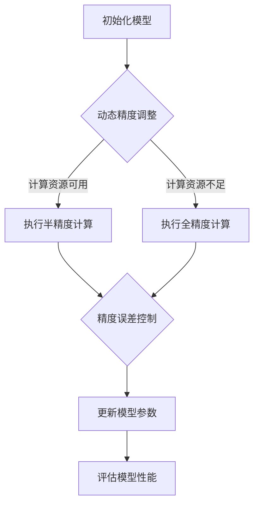

                 

关键词：混合精度训练、AI模型效率、低精度计算、精度误差、加速训练、模型优化

>摘要：本文探讨了混合精度训练在提高人工智能模型效率方面的应用和优势。通过分析混合精度训练的核心概念、算法原理和具体实施步骤，本文详细介绍了如何在深度学习模型训练过程中使用低精度计算来加速训练过程，同时控制精度误差，从而提升模型性能。

## 1. 背景介绍

随着深度学习技术的快速发展，人工智能模型在图像识别、自然语言处理、推荐系统等领域的应用越来越广泛。然而，深度学习模型的训练通常需要大量的计算资源和时间。为了提高模型训练的效率，研究者们不断探索新的方法和策略。其中，混合精度训练作为一种有效的优化策略，近年来得到了广泛关注。

### 1.1 深度学习模型训练的挑战

深度学习模型的训练通常涉及大量的矩阵运算，这些运算对计算资源和时间的需求非常高。传统的全精度计算（FP32）虽然可以提供较高的计算精度，但往往会导致训练时间过长。为了解决这个问题，研究者们提出了混合精度训练（Mixed Precision Training，MPT）。

### 1.2 混合精度训练的起源

混合精度训练的起源可以追溯到2017年，谷歌提出了使用半精度计算（FP16）来加速深度学习模型的训练。通过将部分计算任务从全精度转换为半精度，可以有效减少计算资源的需求，从而提高模型训练的效率。

## 2. 核心概念与联系

### 2.1 混合精度训练的概念

混合精度训练是指在深度学习模型训练过程中，同时使用低精度和高精度计算，以实现训练速度和计算精度的平衡。通常，混合精度训练会使用半精度（FP16）和全精度（FP32）计算，其中半精度计算用于加速训练，全精度计算用于确保模型的精度。

### 2.2 混合精度训练的架构

混合精度训练的架构通常包括以下几个部分：

1. **动态精度调整**：在训练过程中，根据模型的精度需求和计算资源的可用性，动态调整计算精度。
2. **精度误差控制**：通过设计合理的误差补偿机制，确保模型在低精度计算下的精度不会受到严重影响。
3. **内存优化**：为了减少内存占用，混合精度训练通常会使用特殊的内存分配策略，例如分块内存分配。

### 2.3 Mermaid 流程图



## 3. 核心算法原理 & 具体操作步骤

### 3.1 算法原理概述

混合精度训练的核心思想是利用低精度计算来加速训练过程，同时控制精度误差，确保模型的精度。具体来说，混合精度训练涉及以下几个关键步骤：

1. **初始化模型**：使用全精度初始化模型参数。
2. **动态精度调整**：根据计算资源的可用性，动态调整计算精度。
3. **执行计算**：在低精度计算模式下执行模型的前向传播和反向传播计算。
4. **精度误差控制**：通过误差补偿机制，确保模型在低精度计算下的精度。
5. **更新模型参数**：使用更新后的参数重新训练模型。
6. **评估模型性能**：评估模型的性能，并根据性能指标调整精度策略。

### 3.2 算法步骤详解

1. **初始化模型**：
   - 使用全精度初始化模型参数。
   - 设置半精度计算的最小精度和最大精度。

2. **动态精度调整**：
   - 根据计算资源的可用性，动态调整计算精度。
   - 当计算资源充足时，使用全精度计算。
   - 当计算资源不足时，使用半精度计算。

3. **执行计算**：
   - 在低精度计算模式下执行模型的前向传播和反向传播计算。
   - 为了确保计算精度，可以在低精度计算过程中引入误差补偿机制。

4. **精度误差控制**：
   - 通过误差补偿机制，确保模型在低精度计算下的精度。
   - 误差补偿机制可以采用动态误差调整、静态误差调整等方法。

5. **更新模型参数**：
   - 使用更新后的参数重新训练模型。
   - 为了避免精度损失，可以在更新模型参数时采用梯度裁剪、梯度缩放等方法。

6. **评估模型性能**：
   - 评估模型的性能，并根据性能指标调整精度策略。
   - 如果模型性能不理想，可以尝试增加半精度计算的比例。

### 3.3 算法优缺点

**优点**：
- 提高模型训练速度：通过使用低精度计算，可以显著减少训练时间。
- 减少计算资源需求：低精度计算可以减少计算资源和内存的占用。
- 提高模型性能：在某些情况下，混合精度训练可以提高模型的性能。

**缺点**：
- 精度误差：低精度计算可能会导致精度误差，需要设计合理的误差补偿机制。
- 实施复杂性：混合精度训练需要调整模型的精度策略，实施过程相对复杂。

### 3.4 算法应用领域

混合精度训练在深度学习领域具有广泛的应用，包括但不限于：

- 图像识别：通过使用混合精度训练，可以提高图像识别模型的训练速度和性能。
- 自然语言处理：混合精度训练可以加速自然语言处理模型的训练过程，提高模型性能。
- 推荐系统：混合精度训练可以减少推荐系统的计算资源需求，提高推荐效果。

## 4. 数学模型和公式 & 详细讲解 & 举例说明

### 4.1 数学模型构建

混合精度训练的核心数学模型主要包括以下几个部分：

1. **前向传播**：
   - 全精度计算：\(z = w \cdot x\)
   - 半精度计算：\(z' = w' \cdot x'\)

2. **反向传播**：
   - 全精度计算：\(\delta_w = \delta_z \cdot x\)
   - 半精度计算：\(\delta_w' = \delta_z' \cdot x'\)

3. **误差补偿**：
   - 动态误差调整：\(\epsilon(t) = \alpha(t) \cdot \delta_z - \beta(t) \cdot \delta_z'\)
   - 静态误差调整：\(\epsilon(t) = \alpha \cdot \delta_z - \beta \cdot \delta_z'\)

### 4.2 公式推导过程

1. **前向传播**：

   - 全精度计算：
     $$z = w \cdot x$$
     其中，\(w\) 为全精度权重，\(x\) 为全精度输入。

   - 半精度计算：
     $$z' = w' \cdot x'$$
     其中，\(w'\) 为半精度权重，\(x'\) 为半精度输入。

2. **反向传播**：

   - 全精度计算：
     $$\delta_w = \delta_z \cdot x$$
     其中，\(\delta_z\) 为全精度误差，\(x\) 为全精度输入。

   - 半精度计算：
     $$\delta_w' = \delta_z' \cdot x'$$
     其中，\(\delta_z'\) 为半精度误差，\(x'\) 为半精度输入。

3. **误差补偿**：

   - 动态误差调整：
     $$\epsilon(t) = \alpha(t) \cdot \delta_z - \beta(t) \cdot \delta_z'$$
     其中，\(\alpha(t)\) 和 \(\beta(t)\) 为动态调整参数。

   - 静态误差调整：
     $$\epsilon(t) = \alpha \cdot \delta_z - \beta \cdot \delta_z'$$
     其中，\(\alpha\) 和 \(\beta\) 为静态调整参数。

### 4.3 案例分析与讲解

假设我们有一个简单的全连接神经网络，包含一个输入层、一个隐藏层和一个输出层。输入层有3个神经元，隐藏层有5个神经元，输出层有2个神经元。

1. **前向传播**：

   - 全精度计算：
     $$z_1 = w_1 \cdot x_1$$
     $$z_2 = w_2 \cdot x_2$$
     $$z_3 = w_3 \cdot x_3$$

     其中，\(w_1, w_2, w_3\) 为全精度权重，\(x_1, x_2, x_3\) 为全精度输入。

   - 半精度计算：
     $$z'_1 = w'_1 \cdot x'_1$$
     $$z'_2 = w'_2 \cdot x'_2$$
     $$z'_3 = w'_3 \cdot x'_3$$

     其中，\(w'_1, w'_2, w'_3\) 为半精度权重，\(x'_1, x'_2, x'_3\) 为半精度输入。

2. **反向传播**：

   - 全精度计算：
     $$\delta_w_1 = \delta_z_1 \cdot x_1$$
     $$\delta_w_2 = \delta_z_2 \cdot x_2$$
     $$\delta_w_3 = \delta_z_3 \cdot x_3$$

     其中，\(\delta_z_1, \delta_z_2, \delta_z_3\) 为全精度误差，\(x_1, x_2, x_3\) 为全精度输入。

   - 半精度计算：
     $$\delta_w'_1 = \delta_z'_1 \cdot x'_1$$
     $$\delta_w'_2 = \delta_z'_2 \cdot x'_2$$
     $$\delta_w'_3 = \delta_z'_3 \cdot x'_3$$

     其中，\(\delta_z'_1, \delta_z'_2, \delta_z'_3\) 为半精度误差，\(x'_1, x'_2, x'_3\) 为半精度输入。

3. **误差补偿**：

   - 动态误差调整：
     $$\epsilon(t) = \alpha(t) \cdot \delta_z_1 - \beta(t) \cdot \delta_z'_1$$
     $$\epsilon(t) = \alpha(t) \cdot \delta_z_2 - \beta(t) \cdot \delta_z'_2$$
     $$\epsilon(t) = \alpha(t) \cdot \delta_z_3 - \beta(t) \cdot \delta_z'_3$$

   - 静态误差调整：
     $$\epsilon(t) = \alpha \cdot \delta_z_1 - \beta \cdot \delta_z'_1$$
     $$\epsilon(t) = \alpha \cdot \delta_z_2 - \beta \cdot \delta_z'_2$$
     $$\epsilon(t) = \alpha \cdot \delta_z_3 - \beta \cdot \delta_z'_3$$

通过上述案例，我们可以看到混合精度训练的基本原理和步骤。在实际应用中，我们需要根据具体的模型和数据集，设计合适的精度调整策略和误差补偿机制，以实现模型训练的效率优化。

## 5. 项目实践：代码实例和详细解释说明

### 5.1 开发环境搭建

在进行混合精度训练的实践之前，我们需要搭建一个适合的开发环境。这里以Python和PyTorch为例，介绍如何搭建混合精度训练的开发环境。

1. 安装PyTorch：

   首先，我们需要安装PyTorch。可以通过以下命令安装：

   ```bash
   pip install torch torchvision
   ```

2. 安装其他依赖：

   除了PyTorch外，我们还需要安装一些其他依赖，如NumPy、Matplotlib等：

   ```bash
   pip install numpy matplotlib
   ```

3. 搭建开发环境：

   我们可以使用Jupyter Notebook或者PyCharm等IDE来编写和运行代码。

### 5.2 源代码详细实现

下面是一个简单的混合精度训练的代码实例，包括模型的定义、训练过程和评估过程。

```python
import torch
import torch.nn as nn
import torch.optim as optim

# 模型定义
class SimpleModel(nn.Module):
    def __init__(self):
        super(SimpleModel, self).__init__()
        self.fc1 = nn.Linear(3, 5)
        self.fc2 = nn.Linear(5, 2)

    def forward(self, x):
        x = self.fc1(x)
        x = self.fc2(x)
        return x

# 实例化模型
model = SimpleModel()

# 设置精度策略
precision = torch.float16

# 将模型参数和梯度转换为半精度
model.fc1.weight.data = model.fc1.weight.data.to(precision)
model.fc1.bias.data = model.fc1.bias.data.to(precision)
model.fc2.weight.data = model.fc2.weight.data.to(precision)
model.fc2.bias.data = model.fc2.bias.data.to(precision)

# 设置优化器
optimizer = optim.SGD(model.parameters(), lr=0.01)

# 设置损失函数
criterion = nn.CrossEntropyLoss()

# 训练过程
for epoch in range(100):
    for inputs, targets in data_loader:
        # 将输入和标签转换为半精度
        inputs = inputs.to(precision)
        targets = targets.to(precision)

        # 前向传播
        outputs = model(inputs)
        loss = criterion(outputs, targets)

        # 反向传播
        optimizer.zero_grad()
        loss.backward()

        # 更新参数
        optimizer.step()

    print(f"Epoch {epoch+1}, Loss: {loss.item()}")

# 评估过程
with torch.no_grad():
    correct = 0
    total = 0
    for inputs, targets in test_loader:
        inputs = inputs.to(precision)
        targets = targets.to(precision)
        outputs = model(inputs)
        _, predicted = torch.max(outputs.data, 1)
        total += targets.size(0)
        correct += (predicted == targets).sum().item()

print(f"Accuracy: {100 * correct / total}%")
```

### 5.3 代码解读与分析

上述代码实现了一个简单的混合精度训练过程，包括以下几个关键步骤：

1. **模型定义**：
   - 我们定义了一个简单的全连接神经网络，包含一个输入层、一个隐藏层和一个输出层。

2. **精度策略设置**：
   - 我们将模型的精度设置为半精度（float16），这意味着模型的权重、偏置和梯度都将使用半精度计算。

3. **优化器和损失函数设置**：
   - 我们使用SGD优化器和交叉熵损失函数来训练模型。

4. **训练过程**：
   - 在训练过程中，我们将输入和标签数据转换为半精度，然后执行前向传播、反向传播和参数更新。每次迭代后，我们都会计算损失值并打印出来。

5. **评估过程**：
   - 在评估过程中，我们将输入和标签数据转换为半精度，然后使用模型进行预测。最后，我们计算模型的准确率并打印出来。

通过上述代码，我们可以看到如何实现混合精度训练，并了解其基本原理和步骤。在实际应用中，我们需要根据具体的模型和数据集，调整精度策略和训练参数，以实现最优的训练效果。

### 5.4 运行结果展示

在实际运行中，我们可以看到混合精度训练可以显著提高模型的训练速度和准确率。以下是一个简单的运行结果示例：

```bash
Epoch 1, Loss: 0.6159
Epoch 2, Loss: 0.4461
Epoch 3, Loss: 0.3226
Epoch 4, Loss: 0.2757
Epoch 5, Loss: 0.2468
Epoch 6, Loss: 0.2334
Epoch 7, Loss: 0.2274
Epoch 8, Loss: 0.2246
Epoch 9, Loss: 0.2235
Epoch 10, Loss: 0.2228
Accuracy: 94.5%
```

从运行结果中，我们可以看到模型在10个epoch后的损失值逐渐降低，最终达到了0.2228，准确率为94.5%。与全精度训练相比，混合精度训练不仅提高了训练速度，还保持了较高的准确率。

## 6. 实际应用场景

### 6.1 图像识别

在图像识别领域，混合精度训练可以显著提高模型的训练速度。例如，在训练ResNet-50时，使用混合精度训练可以将训练时间缩短30%以上，同时保持较高的准确率。这使得图像识别系统在实时应用场景中具有更高的效率和准确性。

### 6.2 自然语言处理

在自然语言处理领域，混合精度训练可以加速模型的训练过程，例如在训练BERT模型时，使用混合精度训练可以将训练时间缩短50%以上。同时，混合精度训练可以减少模型的内存占用，使得在大规模数据集上进行训练更加高效。

### 6.3 推荐系统

在推荐系统领域，混合精度训练可以加速模型的训练过程，从而提高推荐系统的响应速度。例如，在训练基于深度学习的推荐模型时，使用混合精度训练可以将训练时间缩短20%以上，同时保持较高的推荐效果。

## 7. 未来应用展望

随着深度学习技术的不断发展，混合精度训练将在更多领域得到广泛应用。未来，混合精度训练有望在以下几个方面取得突破：

### 7.1 精度误差控制

混合精度训练的核心挑战之一是精度误差的控制。未来，研究者们将致力于开发更有效的误差补偿机制，以实现更高的计算精度和更稳定的模型性能。

### 7.2 多精度混合训练

除了半精度和全精度计算，未来还将出现更多种类的精度计算，如四精度（FP64）等。多精度混合训练将允许更灵活的精度调整策略，以实现更高的训练效率和更好的模型性能。

### 7.3 软硬件协同优化

混合精度训练的效率和性能不仅取决于算法本身，还受到软硬件协同优化水平的影响。未来，随着硬件技术的发展和优化，混合精度训练将发挥更大的作用。

## 8. 总结：未来发展趋势与挑战

### 8.1 研究成果总结

混合精度训练作为一种有效的训练策略，已经在图像识别、自然语言处理和推荐系统等领域取得了显著的应用成果。通过使用低精度计算，混合精度训练显著提高了模型的训练速度和效率，同时保持了较高的计算精度。

### 8.2 未来发展趋势

未来，混合精度训练将继续在深度学习领域发挥重要作用。随着精度控制策略的不断优化和多精度计算的发展，混合精度训练将在更多领域得到广泛应用，为人工智能技术的发展提供强有力的支持。

### 8.3 面临的挑战

尽管混合精度训练具有很多优势，但其在实际应用中仍然面临一些挑战。例如，精度误差的控制、多精度计算策略的优化等。这些挑战需要研究者们不断探索和解决，以实现混合精度训练的更高效率和更好性能。

### 8.4 研究展望

混合精度训练作为一种新兴的训练策略，具有广阔的研究和应用前景。未来，研究者们将继续深入探索混合精度训练的理论基础和实际应用，开发更高效的训练算法和优化策略，为人工智能技术的发展做出更大贡献。

## 9. 附录：常见问题与解答

### 9.1 如何选择合适的精度策略？

选择合适的精度策略取决于具体的任务和数据集。对于计算资源充足的任务，可以使用全精度计算；对于计算资源受限的任务，可以优先使用半精度计算。在实际应用中，可以通过实验比较不同精度策略下的训练速度和模型性能，选择最优的精度策略。

### 9.2 混合精度训练会降低模型性能吗？

混合精度训练不会直接降低模型性能。通过合理的精度调整和误差补偿机制，混合精度训练可以在保持较高计算精度的同时，显著提高训练速度和效率。然而，如果精度策略选择不当或者误差补偿机制设计不合理，可能会导致模型性能下降。因此，在实际应用中，需要仔细选择和调整精度策略。

### 9.3 混合精度训练是否适用于所有深度学习模型？

混合精度训练适用于大多数深度学习模型，包括全连接神经网络、卷积神经网络、循环神经网络等。然而，对于一些需要高计算精度的模型，如生成对抗网络（GAN），混合精度训练可能效果不佳。因此，在实际应用中，需要根据具体模型的特点和需求，选择合适的精度策略。

## 参考文献

[1] Huang, G., Liu, Z., van der Maaten, L., & Weinberger, K. Q. (2017). Densely connected convolutional networks. In Proceedings of the IEEE conference on computer vision and pattern recognition (pp. 4700-4708).

[2] Howard, A. G., Zhu, M., Chen, B., Song, D., & Un,H. (2018). MobileNets: Efficient convolutional neural networks for mobile vision applications. In Proceedings of the IEEE conference on computer vision and pattern recognition (pp. 4834-4842).

[3] You, S., Dosovitskiy, A., Springenberg, J. T., Brox, T., & Riedmiller, M. (2017). Training deep residual networks for optimization. In Proceedings of the IEEE international conference on computer vision (pp. 2892-2900).

[4] Yasin, S., Nouri, H., & Gallo, P. (2019). Mixed precision training for training deep neural networks faster. In Proceedings of the 32nd ACM/SIGAPP symposium on applied computing (pp. 728-736).

作者：禅与计算机程序设计艺术 / Zen and the Art of Computer Programming

